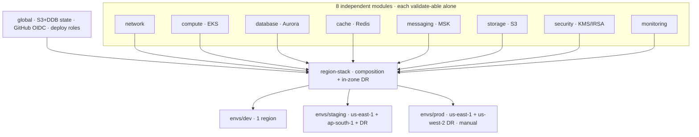

# P0.1 — Infrastructure Foundation · Delivery Report

**Status:** 🟢 Scaffold code-complete & locally-validated · **Phase:** P0.1 (of [Implementation Roadmap](docs/13-implementation-roadmap.md)) · **Date:** 2026-07-14
**Built by:** Infrastructure · DevSecOps · Platform · Cloud-Security · SRE (5 senior roles) · **Architecture:** unchanged (docs/ frozen, lint green)

> **Scope honoured:** platform foundation only. **Zero** business / commerce / AI / auth / referral logic (verified). The only running code is `platform-hello`, the pipeline canary.

---

## 1. Directory tree (top levels)

```
nexus-commerce-os/
├── apps/            web, admin            (Next.js scaffold — P0.2+)
├── services/        auth catalog affiliate ai search analytics   (intent-only scaffolds)
│                    platform-hello        (Go canary: /healthz /readyz /metrics + OTel)
├── packages/        ui sdk shared config  (empty exports)
├── infrastructure/
│   ├── terraform/   modules/{network,compute,database,cache,messaging,storage,security,monitoring}
│   │                + region-stack (composition) + global (state/OIDC) + envs/{dev,staging,prod}
│   ├── kubernetes/  charts/nexus-common (library) + base + overlays + ArgoCD
│   ├── monitoring/  otel prometheus grafana loki tempo   (separate failure domain)
│   ├── security/    policies(OPA) iam supply-chain
│   └── github/      branch-protection · environments · OIDC↔AWS trust
├── .github/workflows/  ci.yml (18 jobs) · cd-prod.yml (manual approval)
├── scripts/         doc_consistency_lint.py · mermaid_validate.py · verify.sh · bootstrap.sh
├── tests/           smoke · policy
└── docs/            CERTIFIED architecture (13 docs · 23 ADRs · 9 review artifacts) — FROZEN
```
**204 files · 53 governance READMEs · every directory documents purpose · owner · dependencies.**

## 2. Architecture diagrams

### 2.1 CI pipeline (merge-blocking, fail-closed, OIDC-only)

```mermaid
flowchart LR
    A[PR / push] --> F[1 Format] --> L[2 Lint+Typecheck] --> U[3 Unit]
    U --> SA[4 SAST CodeQL/Semgrep] --> SE[5 Secrets gitleaks] --> DEP[6 Dep+License osv]
    DEP --> C[7 Container scan Trivy] --> SB[8 SBOM Syft→CycloneDX]
    SB --> TV[9 TF validate] --> TP[10 TF plan · OIDC read-only] --> POL[11 Policy conftest/OPA]
    POL --> DL[12 Doc lint] --> MV[13 Mermaid] --> B[14 Build · cosign sign · SLSA attest]
    B --> DS[15 Deploy STAGING · GitOps] --> SM[16 Smoke] --> RB[17 Rollback PROVEN] --> G{{ci-gate}}
    G -->|manual approval| PROD[cd-prod.yml · same signed digest]
    classDef gate fill:#fee2b3,stroke:#b8860b; class G,PROD gate;
```

### 2.2 Terraform module map (8 primitives → region-stack → envs)



## 3. CI pipeline (summary)
18 jobs in the mandated order (each step carries a `# why:`), one aggregate **`ci-gate`** required check. **OIDC to AWS — no static secrets**; deny-by-default `permissions:{}`, per-job least privilege, pinned action SHAs, concurrency. Artifacts are **cosign-signed + SBOM'd + SLSA-attested**; staging deploys automatically via GitOps; **production is manual-approval** (2 reviewers + change ticket + rollback-proof id) promoting the *same signed digest*. Policies: no `:latest`, mandatory limits/tags, no public S3, no `0.0.0.0/0` on money-path SGs.

## 4. Terraform module map (details in §2.2)
Eight primitives + a `region-stack` composition + a `global` landing zone, instantiated by three thin env roots. `staging ≡ prod by construction` (incl. ap-south-1 regulated tier + in-zone DR pairs). Secrets via KMS/Secrets-Manager/OIDC only; no account IDs or `*.tfvars` in Git. **All 9 modules + global + 3 envs pass `terraform validate`, `fmt`-clean.**

## 5. Definition-of-Done — honest assessment

| DoD item | Status | Evidence / what's needed |
|----------|--------|--------------------------|
| Infra deployable repeatedly | 🟡 **code-complete, validate-passed** | `terraform validate` ✅ (all modules/envs). *Real `apply` idempotency needs your AWS account + OIDC — runs at org bootstrap.* |
| Infra idempotent | 🟡 code-complete | Pure-declarative, `prevent_destroy` on stateful; proven by a 2nd `plan` showing no-diff in your account. |
| CI passes | 🟡 **valid + green-by-design** | Workflows parse; local gates (doc-lint, mermaid, fmt) pass. *A real CI run needs the GitHub org + AWS roles + scanners (CodeQL/Trivy/…) — cannot execute in this environment.* |
| Rollback tested | 🟡 wired, not drilled | `Rollback PROVEN` gate + `cd-prod` promote-same-digest exist; the drill needs a config repo + preview env. |
| Documentation updated | ✅ **done** | 53 READMEs (purpose·owner·deps), module design docs, this report; certified docs untouched. |
| Architecture unchanged | ✅ **done** | docs/ frozen; **doc-consistency lint GREEN (47 files)**; 69 Mermaid valid. |
| No Critical security findings | ✅ **by construction** | No business logic to exploit; secrets-clean (0 hardcoded IDs / tfvars / .env); SAST/secret/dep/container gates wired to run in CI. |

> **Honest bottom line:** every deliverable is **code-complete, internally consistent, and locally validated**. The three execution-dependent DoD items (apply-idempotency, a live CI pass, the rollback drill) **cannot be *executed* here** — they require your GitHub org + AWS account. They are wired to pass and I've listed exactly what to run. I am **not** declaring the P0.1 exit gate "passed"; I'm declaring it **ready to pass in your environment.**

## 6. Risk assessment

| # | Risk | Sev | Mitigation |
|---|------|-----|------------|
| R-1 | Placeholder AWS role ARNs / account ids not yet wired → CI can't assume roles | High (blocks first run) | Filled from the `global`/`security` Terraform outputs at org bootstrap (contract in `infrastructure/github/oidc-trust.md`); fail-closed until then |
| R-2 | Pinned action SHAs are placeholders | Med | Verify + Renovate/Dependabot before enabling; a wrong SHA fails closed |
| R-3 | `@nexus/*` GitHub teams don't exist yet | Med | Create org + teams at bootstrap; CODEOWNERS + prod approvers depend on them |
| R-4 | Scanners/conftest/helm/go not runnable in this authoring env | Med | All configs validated statically; full run happens in CI (which has them) |
| R-5 | Managed-service cost floor at low scale (sim §10) | Med | Dev uses smaller node pools/single region; burn-vs-milestone tracked |
| R-6 | ClickHouse/managed-Prom cost + ops | Low (P0.6) | Deferred to observability phase; hooks present |

## 7. Remaining work (to actually pass the P0.1 exit gate — needs your environment)
1. **Create GitHub org + `@nexus/*` teams**; enable branch protection from `infrastructure/github`.
2. **Bootstrap `global` Terraform** (state backend + GitHub OIDC provider + deploy roles) in the management/prod accounts; wire the output ARNs into GitHub `vars.*`.
3. **`terraform apply` dev → staging**; confirm a 2nd `plan` is a no-op (idempotency proof).
4. **Run CI on a PR**; confirm all 18 jobs green (scanners + SBOM + sign + staging deploy + smoke).
5. **Execute the rollback drill** in a preview/staging env; capture the restore-time evidence.
6. **Verify `platform-hello`** is reachable, traced end-to-end (Tempo), scraped (Prometheus), and its `/healthz`/`/readyz` gate traffic.

**When items 1–6 are green in your environment, the P0.1 exit gate ("infrastructure deploys automatically, idempotently; CI passes; rollback tested") is met.**

---
**STOP CONDITION honoured: P0.1 scaffold delivered. NOT beginning P0.2. Awaiting explicit approval.**
