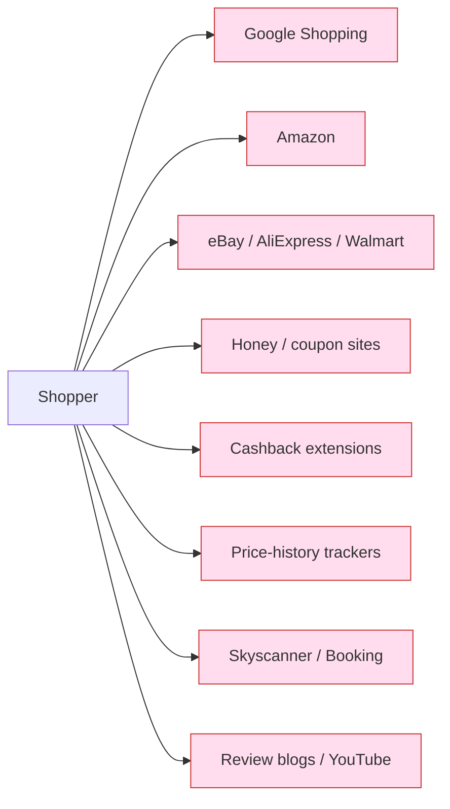
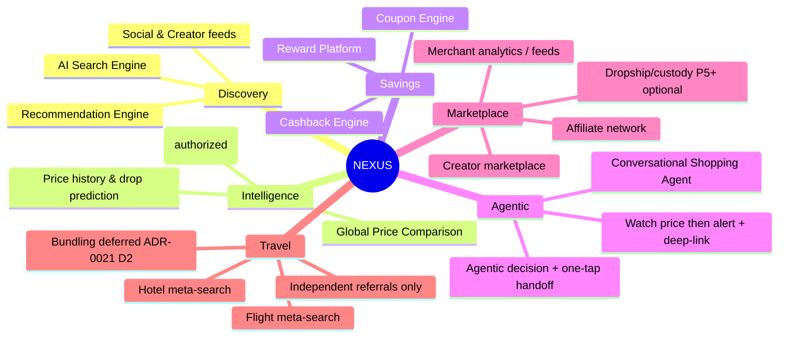
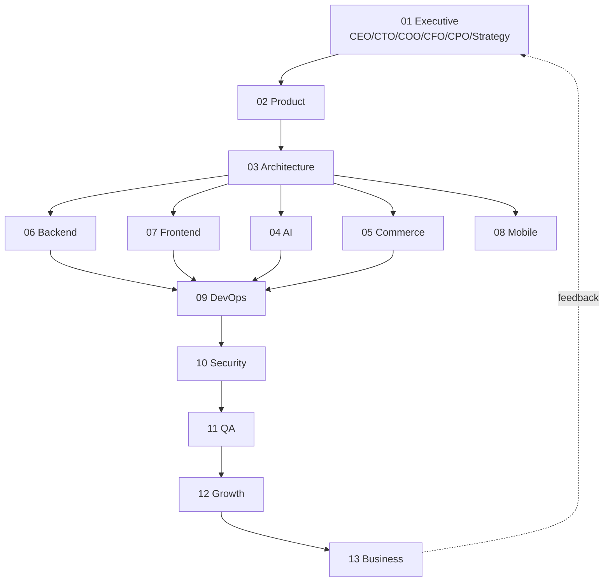

# 01 — Product Vision

**Status:** 🟢 Draft-complete (R4-remediated) · **Owner:** CEO + CPO + Strategy + Market Research agents · **Depends on:** —

---

## 1. The one-sentence vision

> **NEXUS is the AI that shops for you** — a single conversational surface that discovers products and travel across every legitimate merchant on earth, guarantees you the best real all-in price, surfaces every coupon and cashback automatically, and **hands you off to the best authorized checkout** (official affiliate link / authorized deep-link) to complete on the merchant's own site, so that *deciding* what and where to buy becomes one sentence instead of forty tabs.
>
> *NEXUS is a **pure referral + deep-link + affiliate** intelligence layer — it never processes payments, holds funds, or takes custody of orders. See [ADR-0006](adr/ADR-0006-referral-only-model.md).*

## 2. The problem (why this must exist)

Modern commerce is **fragmented, adversarial, and exhausting**:

- A shopper opens Google Shopping, Amazon, eBay, AliExpress, Walmart, three review blogs, a coupon site, a cashback extension, and a price-history tool — to buy one item.
- Prices are deliberately obscured (dynamic pricing, hidden shipping, fake "was" prices).
- Coupons expire, don't apply, or are fake. Cashback is opaque.
- Travel (flights + hotels) is a *separate* silo with the same fragmentation.
- Recommendations are engagement-optimized for the *seller*, not the buyer.

No incumbent solves the whole chain, and none is **agentic** — none can be *told* "book me the cheapest reliable 55-inch OLED under $900 delivered by Friday, apply every discount" and just do it.

**The insight:** the shopper does not want ten tools. They want an *outcome*. NEXUS sells the outcome.

## 3. Who we serve (segments & jobs-to-be-done)

| Segment | Job-to-be-done | Primary value |
|---------|----------------|---------------|
| **Deal-maximizer** (mass market) | "Get me the lowest all-in price with every discount applied." | Price intelligence + coupon/cashback automation |
| **Time-poor buyer** (professionals, parents) | "Just decide the right thing and take me straight to buy it." | Agentic decisioning; one-tap authorized handoff |
| **Traveler** | "Find and book the best flight+hotel for my constraints." | Unified travel meta-search |
| **Creators / affiliates** | "Monetize my audience's shopping." | Creator marketplace + affiliate tooling |
| **Merchants / dropshippers** | "Reach high-intent buyers via authorized feeds." | Merchant integration + demand |
| **Developers** | "Build on commerce+AI primitives." | Public API / agent platform |

**Beachhead:** *Deal-maximizer + Time-poor buyer* in a single launch geography (**United States** — Phase 1 of the [phased rollout](#101-geographic-rollout--internationalization-adr-0007)). We win consumer trust first; the two-sided marketplace (creators, merchants) compounds on top.

## 4. North-star metric & guardrails

- **North-star:** **Verified Money Saved per Active User per Month (VMS/MAU)** — dollars the user provably kept (lowest-price delta + coupons + cashback) vs. the price they would have paid at their default merchant.
  - *Why:* it is the only metric that is simultaneously the user's benefit, our marketing proof, and a leading indicator of retention and word-of-mouth. It cannot be gamed by dark patterns without harming the user (unlike "time on site").
  - **VMS counts *Confirmed* savings only.** Savings move through a transparent **four-state model** — **Estimated → Pending → Confirmed → Reversed** — and only the **Confirmed** state feeds VMS. Estimated/pending amounts are never shown as guaranteed, which keeps the north-star **falsifiable and honest** ([ADR-0021](adr/ADR-0021-legal-product-truth.md) D4/D1; see [Trust & Transparency](12-trust-and-transparency.md)).
- **Supporting metrics:** Assisted GMV (attributed via affiliate postbacks), agentic recommendation→handoff→conversion rate, coupon apply-success rate, D30 retention, creator-attributed GMV.
- **Guardrails (must not regress):** recommendation neutrality score, price-claim accuracy (audited), trust/NPS, p95 search latency, AI hallucination rate on product facts.

## 5. Product pillars (what we actually build)

Each pillar maps to a bounded context in the [System Architecture](04-system-architecture.md) and an agent cluster in the [AI Architecture](05-ai-architecture.md).

## 6. Positioning vs. the platforms we subsume

| Incumbent | What they do | What NEXUS does better |
|-----------|-------------|------------------------|
| Google Shopping | Ad-ranked product search | Neutral, buyer-aligned ranking + agentic handoff |
| Honey | Coupon injection at checkout | Coupon **+ cashback + price-compare + reward**, verified, pre-checkout |
| Amazon | Owned marketplace | Cross-merchant neutrality; not locked to one catalog |
| eBay / AliExpress / Walmart | Individual catalogs | Unified across all via authorized feeds |
| Booking / Skyscanner | Travel silos | Travel inside the same agent + wallet |
| Rakuten / cashback sites | Cashback only | Cashback fused with discovery + agent |

**Wedge:** we are the *only* layer that is neutral, cross-merchant, savings-native, and agentic at once. Incumbents can't copy neutrality without cannibalizing their ad/marketplace revenue — that is our **structural moat** (see [Business Model §8](03-business-model.md)).

## 7. Non-goals (explicit scope discipline)

To avoid the "boil the ocean" failure mode, NEXUS **will not** at launch:

- ❌ Operate its own first-party warehouse/inventory (we are an intelligence + orchestration layer, not a 3PL).
- ❌ Scrape or ingest any data without authorization — *ever* (Prime Directive).
- ❌ **Process payments, hold customer funds, or take custody of orders** — NEXUS is pure referral/affiliate and never touches card data or becomes Merchant of Record ([ADR-0006](adr/ADR-0006-referral-only-model.md), [Security §PCI scope](08-security-architecture.md)). Marketplace/dropship/unified-checkout are **optional P5+** items subject to future validation.
- ❌ Own inventory, operate warehouses, fulfill orders, manage shipping/returns, or handle chargebacks.
- ❌ Build native mobile apps before the web + PWA + agent API prove the loop.
- ❌ Offer personalized *financial* advice (regulatory line).
- ❌ **Bundle travel products** (flight + hotel + car as a single package) in regulated geos. Travel is presented as **independent referrals only** — users complete each booking directly with the provider — so NEXUS never becomes the **package organizer** (EU/UK Package Travel Regs / ATOL liability). Bundling is **deferred** pending future legal + business review ([ADR-0021](adr/ADR-0021-legal-product-truth.md) D2, reinforcing [ADR-0006](adr/ADR-0006-referral-only-model.md)).

## 8. Guiding principles

1. **Buyer-aligned, always.** When our incentive and the buyer's conflict, the buyer wins. Ranking neutrality is audited and published. We **disclose affiliate commissions** wherever affiliate links appear, and the agent **verbalizes** that a purchase may earn NEXUS a commission before it hands you off — trust posture over hidden monetization ([ADR-0021](adr/ADR-0021-legal-product-truth.md) D1; [Trust & Transparency](12-trust-and-transparency.md)).
2. **Commission-blind recommendation.** Rankings are determined by **user value, not commission value** — commission amount **never** raises a product's position. Sponsored content is **always labeled**, distinguishable from organic results, and the ranking is **auditable** ([ADR-0021](adr/ADR-0021-legal-product-truth.md) D5; see [Product Guidelines](11-product-guidelines.md)). This reinforces principle 1's neutrality commitment.
3. **Legitimate by construction.** Compliance and licensing are architecture inputs, not afterthoughts.
4. **Agent-first, UI-second.** The conversational agent is the product; the GUI is one of its rendering surfaces.
5. **Prove the savings.** Every claim ("you saved $37") is receipt-backed and auditable.
6. **Composable & API-native.** Every capability is an API before it is a screen.
7. **Privacy as a feature.** Personalization without surveillance; data minimization by default.

## 9. The operating model (how AI-DOS builds this)

NEXUS is built by a 13-layer agent organization. Each layer owns deliverables and hands artifacts down the chain; the orchestrator enforces consistency via [`PROJECT_MEMORY.md`](../PROJECT_MEMORY.md).

## 10. 3-horizon roadmap (outcome, not feature, framed)

| Horizon | Timeframe | Outcome | Proof point |
|---------|-----------|---------|-------------|
| **H1 — Trust the price** | 0–6 mo | Best-price + auto-coupon + cashback on web/PWA, 1 geo, top categories | VMS/MAU > $0 and growing; price-claim audit ≥ 99% accurate |
| **H2 — Delegate the decision** | 6–15 mo | Conversational agent recommends + one-tap hands off to complete on merchant; price-watch → alert → deep-link; travel added; API beta | Recommendation→handoff→conversion > 40%; assisted GMV milestone |
| **H3 — The commerce OS** | 15–36 mo | Creator marketplace, merchant analytics platform, developer ecosystem, multi-region *(marketplace custody/checkout only if validated at P5+)* | Two-sided network effects; positive contribution margin |

### 10.1 Geographic rollout & internationalization ([ADR-0007](adr/ADR-0007-phased-global-rollout.md))

Markets open in **phases** — product-market fit before regulatory breadth — but the platform is **international by design from day one** (a new market is an enablement flip, not a re-architecture).

| Phase | Markets |
|-------|---------|
| 1 | United States |
| 2 | Canada, United Kingdom, Australia |
| 3 | European Union |
| 4 | Bangladesh, India, Pakistan, Middle East |
| 5 | Global expansion |

**From day 1 (even while only the US is live):** multi-currency · multi-language (i18n, incl. RTL) · country feature flags · pluggable regional compliance modules · a tax-abstraction layer (all-in landed-cost display) · region-specific affiliate routing via the [Affiliate Gateway](adr/ADR-0008-affiliate-gateway.md). Each new market is gated behind a **legal sign-off + its compliance module** before its country flag is enabled.

## 11. Risks to the vision (top 5)

| Risk | Severity | Mitigation | Owner |
|------|----------|------------|-------|
| Affiliate/API access revoked or gated | High | Multi-network redundancy; direct merchant deals; contractual SLAs | COO/Partnerships |
| AI hallucinates product facts / prices | High | RAG grounded on authorized feeds; claim-verification agent; no ungrounded price claims | AI Orchestrator |
| Neutrality vs. monetization tension | Med-High | Separate "ad" surfaces clearly; neutrality audit; savings-share revenue model | CEO/CFO |
| Regulatory (privacy, consumer, travel) | Med | Compliance-by-design; per-geo gating; legal review gate before launch | Security/Legal |
| Cost of AI inference at scale | Med | Model-agnostic router; caching; cheap-model-first cascade | CTO |

## 12. Definition of success for this document

This vision is "production-grade" when: north-star is measurable, segments and non-goals are unambiguous, every pillar traces to an architecture context, and the exec team can say **no** to a feature by citing this document. ✅ once ratified in `PROJECT_MEMORY.md`.

---
*Next: [02 — Software Design Document](02-software-design-document.md)*
