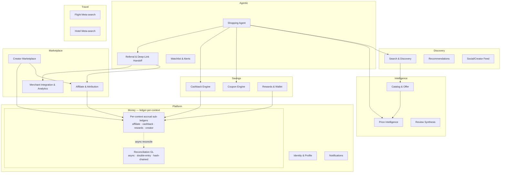
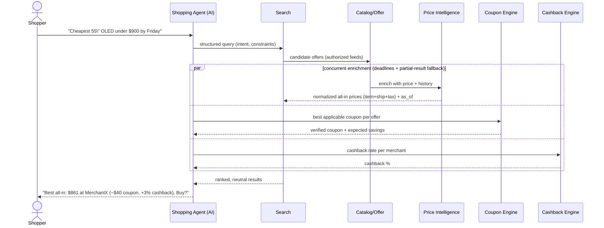
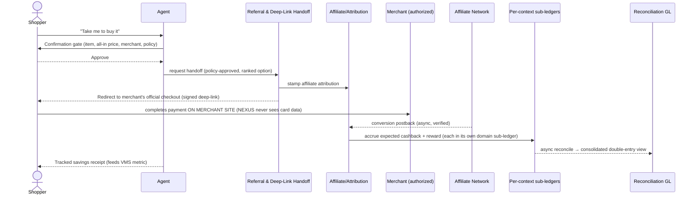
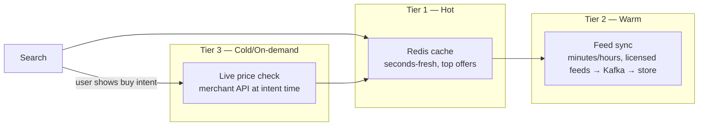

# 02 — Software Design Document (SDD)

**Status:** 🟢 Draft-complete (R4-remediated) · **Owner:** CTO + Solution Architect · **Depends on:** [01 Vision](01-vision.md)

---

## 1. Purpose & scope

This SDD is the connective tissue between the [Vision](01-vision.md) and the detailed architecture documents (04–10). It defines the **domain model, the primary end-to-end flows, the non-functional requirements (NFRs), the technology stack with justification, and the cross-cutting concerns.** Detailed decisions are delegated to the specialized architecture docs and referenced here.

## 2. Design goals & the forces they balance

| Goal | Force it fights | Design response |
|------|-----------------|-----------------|
| **Legitimacy** | Catalog breadth | Adapter pattern over *authorized* sources only; breadth via partnerships, not scraping |
| **Neutrality** | Monetization | Ranking free of pay-to-win; monetization via savings-share, ads clearly segregated |
| **Low latency search** | Freshness of price | Tiered data: hot cache + async feed sync + on-demand real-time price check |
| **Agentic autonomy** | Safety & trust | Human-in-the-loop confirmation gates; grounded RAG; spend limits |
| **Scale (global)** | Cost | Cheap-model-first AI cascade; multi-region read replicas; aggressive caching |
| **Velocity** | Correctness | Modular monolith first, typed contracts, strong CI gates |

## 3. Domain model (bounded contexts)

The system is decomposed into **bounded contexts** (DDD). Each maps to a vision pillar and later to a service boundary.

**Context ownership** is recorded in the [System Architecture](04-system-architecture.md). Each context owns its data; cross-context access is via API/events only (no shared tables) — this keeps the future extraction to microservices a *strangler*, not a rewrite.

> **Money is ledger-per-context, not one shared ledger** ([ADR-0013](adr/ADR-0013-ledger-per-context.md)). The four money domains — affiliate accrual, cashback, rewards, creator payouts — each own an **append-only accrual sub-ledger** with the double-entry money invariant scoped to that domain; no domain writes another's ledger. A dedicated **Reconciliation GL** service **asynchronously** aggregates the sub-ledgers into the audited, double-entry, hash-chained consolidated view (eventually consistent for reporting; per-domain authorization stays strongly consistent). This removes the former single "Ledger & Payouts" shared-kernel SPOF and makes each money domain independently consistent and extractable.

> **Boundary enforcement is real, not aspirational** ([ADR-0020](adr/ADR-0020-performance-consistency-hardening.md)). Modules are isolated by **separate DB schemas and separate DB roles** (not just a shared connection pool), and the **AI service does not call Core modules synchronously on the hot path** — it reads async read-models. Boundary tests assert role-scoped access, so the "modular monolith" seams are enforced by the database, keeping the strangler extraction honest.

## 4. Canonical user journeys (the flows that must be excellent)

### 4.1 "Find the best all-in price" (core loop)

> **Flow notes** ([ADR-0020](adr/ADR-0020-performance-consistency-hardening.md)): (1) Enrichment (price, coupon, cashback) runs **concurrently with per-hop deadlines and partial-result fallback**, not as a serial multi-hop chain — a slow coupon lookup degrades to "best price without coupon" rather than blowing the NFR-PERF-01 budget. (2) Every price carries an **`as_of` timestamp + freshness class**, so the agent can render staleness honestly and passive browsing never implies live accuracy it doesn't have. (3) **"Buy intent" is the explicitly-defined event** — the shopper signalling an intent to purchase this specific offer (e.g. tapping *Buy* / *Take me to buy it*) — that triggers the Tier-3 authoritative live-price check (§8) and the handoff gate (§4.2).

### 4.2 Delegated agentic handoff (with safety gate)

> NEXUS is a **pure referral** platform ([ADR-0006](adr/ADR-0006-referral-only-model.md)): the agent's terminal action is a **signed, allow-listed handoff** to the merchant's own checkout — NEXUS never processes payment or takes order custody. Conversion is learned later via the network **postback**. *(Agent-executed payment is a P5+ concern.)*

> **Safety:** the agent never performs the handoff (or, at P5+, any purchase) without an explicit in-session confirmation, and it can only hand off to a **server-side, allow-listed, neutrally-ranked** target — a prompt-injected instruction cannot redirect the user elsewhere. See [AI Architecture §safety](05-ai-architecture.md) and [Security §3.5](08-security-architecture.md).

### 4.3 Price-drop watch → alert → deep-link

User sets target → `Watchlist` polls `Price Intelligence` on a schedule/event → on hit, the agent **notifies** the user and offers a **one-tap deep-link** to the merchant (flow 4.2). NEXUS does not auto-purchase (no custody); "auto-buy" is a P5+ option gated on the custody decision.

## 5. Non-functional requirements (NFRs)

NFR IDs are stable and referenced across all documents.

| ID | Category | Requirement | Target |
|----|----------|-------------|--------|
| NFR-PERF-01 | Performance | p95 search latency (cached corridor) | ≤ 400 ms |
| NFR-PERF-02 | Performance | p95 live price refresh (on-demand) | ≤ 1.5 s |
| NFR-PERF-03 | Performance | Agent first-token latency | ≤ 1.2 s |
| NFR-SCAL-01 | Scalability | Sustained search QPS (H2) | 5,000 QPS, horizontally scalable |
| NFR-SCAL-02 | Scalability | Catalog size | 500M+ offers, sharded |
| NFR-AVAIL-01 | Availability | Core discovery uptime | 99.95% |
| NFR-AVAIL-02 | Availability | Referral/handoff orchestration | 99.9%, graceful degrade to plain deep-link |
| NFR-SEC-01 | Security | Data-at-rest & in-transit encryption | AES-256 / TLS 1.3 mandatory |
| NFR-SEC-02 | Security | AuthN | OIDC + MFA; passkeys preferred |
| NFR-PRIV-01 | Privacy | Data minimization & per-geo residency | GDPR/CCPA/DPA compliant |
| NFR-AI-01 | AI quality | Product-fact hallucination rate | < 0.5%, grounded-only claims |
| NFR-AI-02 | AI cost | Blended cost per resolved query | budget-capped via model cascade |
| NFR-A11Y-01 | Accessibility | WCAG conformance | 2.2 AA |
| NFR-OBS-01 | Observability | Trace coverage of user-facing paths | 100% distributed tracing |
| NFR-COMP-01 | Compliance | Price-claim audit accuracy | ≥ 99% |
| NFR-CONS-01 | Consistency | Monetary representation across runtimes & contracts | **Integer minor-units + ISO currency**, one canonical type, zero drift |
| NFR-CONS-02 | Consistency | API contract source of truth | **Single source**; OpenAPI + GraphQL SDL + protobuf all generated from it |

These NFRs are testable; QA layer owns the verification matrix ([Deployment §quality gates](10-deployment-architecture.md)).

## 6. Technology stack — decisions with alternatives

> Format: **Decision** · *Alternatives considered* · **Why** · **Trade-off/Risk**. Deep rationale in the referenced architecture doc + ADR.

| Concern | Decision | Alternatives | Why | Trade-off / Risk |
|---------|----------|--------------|-----|------------------|
| **Overall style** | Modular monolith → strangler to services | Microservices day 1; pure monolith | Velocity + clear seams; extract under load | Discipline required to keep boundaries clean |
| **Backend core** | TypeScript (NestJS) for product APIs; Go for latency-critical (price/search fan-out) | Java/Spring; Python-only; Laravel | TS shares types with frontend & agent; Go for concurrency-heavy fan-out | Two languages here (TS+Go); with Python in the AI layer = **three runtimes total**, deliberately bounded to 3 |
| **AI/ML services** | Python (FastAPI) | Node ML | Ecosystem (RAG, embeddings, eval) | Extra runtime; isolated to AI layer |
| **Frontend** | Next.js (React) + Tailwind; PWA | SvelteKit; Remix | SSR/edge, ecosystem, hiring | React weight — mitigated by RSC/edge |
| **Search** | OpenSearch/Elasticsearch + vector index | Algolia (SaaS); pgvector-only | Hybrid lexical+semantic at scale, self-hostable | Ops cost; mitigated by managed option |
| **Primary OLTP** | PostgreSQL | MySQL; distributed SQL (CockroachDB/Yugabyte) | Rich types, JSONB, ecosystem; distributed SQL later if needed | Single-writer scaling → partition + read replicas |
| **Catalog/offer store** | PostgreSQL + object store, sharded; move hot paths to a wide-column store (ScyllaDB/Cassandra) as needed | All-in Cassandra | Relational integrity where it matters, scale-out where it doesn't | Polyglot complexity — governed in [06](06-database-architecture.md) |
| **Cache / hot price** | Redis (cluster) | Memcached | Data structures, TTL, pub/sub | Memory cost |
| **Events / streaming** | Kafka (or managed equiv.) | RabbitMQ; SQS/SNS | High-throughput feed ingestion + event sourcing | Operational heft |
| **Analytics** | ClickHouse + object-store lakehouse | BigQuery/Snowflake | Real-time price analytics, cost | Self-host ops or managed spend |
| **AI gateway** | Model-agnostic router (Claude/GPT/OSS) | Single-vendor | Cost/quality routing, no lock-in | Router is a critical component — hardened |
| **Infra** | Kubernetes on AWS (multi-cloud-capable) | Serverless-only; single VM | Portability + elasticity | K8s complexity — managed (EKS) + platform team |
| **IaC** | Terraform + Helm | Pulumi; CDK | Multi-cloud, mature | HCL verbosity |
| **Money representation** | One **canonical money type — integer minor-units + ISO currency** — defined once and **code-generated** into all three runtimes (TS/Go/Python); FX normalization is an explicit ranking step | float; per-service decimal; ad-hoc per-language | Eliminates precision/semantics drift across 3 runtimes × 3 contract formats | Codegen pipeline to build and maintain |
| **API contract** | **Contract-first single source of truth**: authored once, then OpenAPI + GraphQL SDL + protobuf are **generated** from it; Web BFF and Agent BFF consume the **same** offer-view resolver | Independently authored OpenAPI/GraphQL/protobuf | No divergent money/i18n numbers across surfaces; contracts can't drift apart | Requires a contract build/codegen step |
| **Agent tool invocation** | **One** defined mechanism (tool-RPC) | Mixed tool-RPC + REST `:invoke` | Ends the tool-invocation self-contradiction; one protocol to secure and evolve | Must standardize all agent tools on it |

Full justification and the rejected-options analysis live in [04 System](04-system-architecture.md), [06 Database](06-database-architecture.md), [07 API](07-api-architecture.md), and the ADRs ([ADR-0020](adr/ADR-0020-performance-consistency-hardening.md)).

## 7. Cross-cutting concerns

| Concern | Approach | Doc |
|---------|----------|-----|
| **Identity** | OIDC, passkeys/MFA, per-user spend policy for agent | [08](08-security-architecture.md) |
| **Money movement** | **Ledger-per-context**: per-domain append-only accrual sub-ledgers (affiliate/cashback/rewards/creator) with the double-entry money invariant scoped per domain and **dual-enforced in code** (domain service + independent invariant-checker); an **async Reconciliation GL** aggregates them into the audited consolidated view; canonical money type (integer minor-units + ISO currency); PCI scope minimized | [ADR-0013](adr/ADR-0013-ledger-per-context.md), [06](06-database-architecture.md), [08](08-security-architecture.md) |
| **Attribution** | Deterministic affiliate stamping + event-sourced audit trail | [04](04-system-architecture.md), [07](07-api-architecture.md) |
| **Observability** | OpenTelemetry traces/metrics/logs; SLOs per NFR | [10](10-deployment-architecture.md) |
| **Feature flags / config** | Central flag service; progressive delivery | [10](10-deployment-architecture.md) |
| **Internationalization** | i18n, multi-currency, per-geo compliance gating | [01 §A1](01-vision.md), [08](08-security-architecture.md) |
| **AI safety** | Grounded RAG, claim verification, confirmation gates, spend limits, red-team evals | [05](05-ai-architecture.md) |

## 8. Data-freshness strategy (a defining design decision)

Price is the product; staleness is the enemy; live-checking every offer is impossible at 500M scale. The design uses a **three-tier freshness model**:

- **Tier 1** serves fast search from cache.
- **Tier 2** keeps the corpus reasonably fresh via authorized feeds (event-driven).
- **Tier 3** does an authoritative live check *only when the user shows purchase intent*, so we pay the expensive call exactly when accuracy matters and it feeds NFR-COMP-01 (claim accuracy). This is the crux of reconciling NFR-PERF-01 with NFR-COMP-01.

## 9. Failure & degradation design

| Failure | Degradation strategy |
|---------|----------------------|
| Merchant API down | Serve cached price with staleness badge; fall back to deep-link checkout |
| AI model/provider outage | Router fails over to alternate model; degrade to deterministic search UI |
| Coupon service down | Show best price without coupon; retry async |
| Feed ingestion lag | Staleness indicators; prioritize high-traffic offers for live check |
| Region outage | Multi-region failover for reads; checkout degrades to referral |

Everything degrades toward **"still useful, honest about freshness"** — never a hard failure of the core loop.

## 10. Open design questions (tracked in PROJECT_MEMORY)

- ~~Custody-of-order at launch~~ — **RESOLVED: pure referral, no custody** ([ADR-0006](adr/ADR-0006-referral-only-model.md)). Marketplace custody is optional P5+/P7.
- Build vs. buy on search (self-host OpenSearch vs. Algolia) pending scale/cost model.
- Single-writer Postgres vs. distributed SQL trigger point.

---
*Next: [03 — Business Model](03-business-model.md)*
