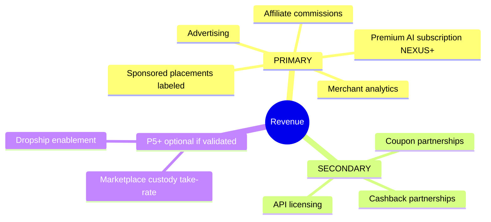
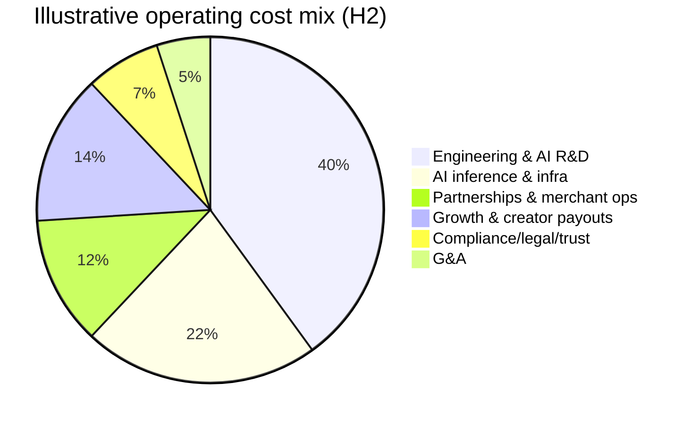
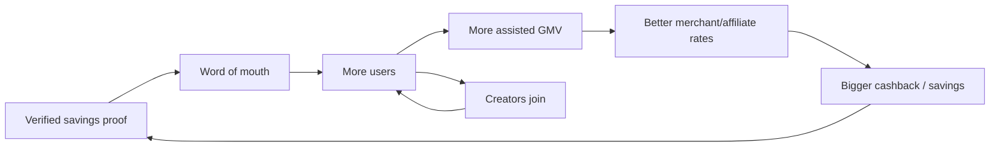

# 03 — Business Model

**Status:** 🟢 Draft-complete (R4-remediated) · **Owner:** CEO + CFO + COO + Revenue agents · **Depends on:** [01 Vision](01-vision.md)

---

## 1. The central tension (and how we resolve it)

NEXUS promises **neutrality** (Vision principle #1) but must **make money**. Most commerce platforms monetize by *distorting* what the buyer sees (ad-ranked results, owned-inventory bias, opaque cashback spreads). That path is closed to us by design.

**Resolution — monetize the outcome, not the attention.** Our primary revenue is a *share of value we demonstrably create*: affiliate commissions on purchases we drive, and a slice of savings/cashback. When the buyer wins, we win; the incentives are aligned. This is the business-model expression of the moat.

> **Standing commitment (ratified [ADR-0021](adr/ADR-0021-legal-product-truth.md)):** the entire revenue portfolio operates behind a **commission-blind ranking** and an **affiliate-commission disclosure** wherever affiliate links appear — commission amount **never** influences a recommendation. The cost of disclosure is negligible; it strengthens trust. Ranking is auditable and this posture is published in the [Trust & Transparency](12-trust-and-transparency.md) commitment.

## 2. Revenue streams (portfolio)

> Revenue portfolio ratified in [ADR-0006](adr/ADR-0006-referral-only-model.md). NEXUS earns from **referral + intelligence**, never from order custody or GMV take-rate.

**Primary streams**

| Stream | Model | Margin | Alignment risk | When |
|--------|-------|--------|----------------|------|
| **Affiliate commissions** | % of driven GMV via networks/direct, attributed by postback | High | Low (buyer already buying) | H1 |
| **Sponsored placements** | Clearly-labeled, non-ranking-distorting slots | High | **Highest** — strictly walled | H2+ |
| **Premium AI subscription (NEXUS+)** | Flat monthly; priority agent, unlimited watchers, boosted cashback | Very high | None | H1–H2 |
| **Merchant analytics** | SaaS: feed/listing analytics, demand insights, benchmarking | High | Med (must stay neutral) | H2–H3 |
| **Advertising** | Labeled, non-ranking ad surfaces (deals/newsletter/placements) | High | Med — walled from ranking | H2+ |

**Secondary streams**

| Stream | Model | Margin | When |
|--------|-------|--------|------|
| **Cashback partnerships** | Merchant-funded cashback; transparent small spread. **Enabled per-jurisdiction only after legal review** (country flags); each payout stays **pending until affiliate-confirmed + hold period expires**, and is **reversed if the commission reverses** ([ADR-0021](adr/ADR-0021-legal-product-truth.md) D3) | Med | H1 |
| **Coupon partnerships** | Merchant-funded coupon/CPA deals | Med | H1 |
| **API licensing** | Usage-based on agent/commerce/data API | Med | H3 |

**Deferred (P5+, optional — only if custody is later validated)**: marketplace GMV take-rate, dropship enablement fees. Not part of the ratified launch model ([ADR-0006](adr/ADR-0006-referral-only-model.md)).

> **Neutrality wall ([ADR-0021](adr/ADR-0021-legal-product-truth.md) D5):** sponsored placements and advertising are **clearly labeled**, visually and structurally segregated, and **cannot reorder the neutral best-price ranking** — ranking is **commission-blind** (commission amount never lifts a product's position) and **auditable**. Enforced in [System Architecture §5.3](04-system-architecture.md) and audited (NFR-COMP-01, strengthened neutrality fitness test). Sponsored/ad revenue is deliberately *not* the primary stream to keep the incentive clean. This portfolio-wide commitment is published in [Trust & Transparency](12-trust-and-transparency.md).

## 3. Pricing hypotheses

- **Consumer free tier:** full best-price + coupon + baseline cashback. Free forever — this is the trust engine and top of funnel.
- **NEXUS+ (~$5–9/mo hypothesis):** boosted cashback, unlimited price-drop watchers, priority/agentic auto-buy, travel deals (**independent referrals only — no bundled packages in regulated geos**, per [ADR-0021](adr/ADR-0021-legal-product-truth.md) D2 / [ADR-0006](adr/ADR-0006-referral-only-model.md)), early deals. Target attach rate 3–6% of MAU by H2.
- **Creator/Pro:** revenue-share tooling, storefronts, analytics.
- **Merchant:** freemium feed listing → paid analytics/demand tiers.

*All prices are hypotheses to be validated (Assumption A4 in PROJECT_MEMORY); pricing experiments owned by Growth layer.*

## 4. Unit economics (illustrative model, H2)

> Illustrative to validate the *shape*, not forecast. Real figures pending partner rates.

Per assisted purchase (avg order value **AOV = $80**):

| Line | Value | Note |
|------|-------|------|
| Affiliate commission (avg 4% of AOV) | **+$3.20** | Network/direct blended |
| Cashback spread kept (0.5% of AOV) | **+$0.40** | After user's cashback |
| Merchant-funded coupon share | +$0.10 | Where applicable |
| **Gross revenue / purchase** | **≈ $3.70** | |
| AI inference cost (cascade) | −$0.06 | Cheap-model-first (NFR-AI-02) |
| Infra/serving cost | −$0.09 | Cached-first |
| Cashback/reward payout ops | −$0.05 | via licensed payout partner (no card acceptance) |
| **Contribution / purchase** | **≈ $3.50** | ~95% contribution margin on marginal txn |

- **CAC target:** < $6 blended (heavy organic/word-of-mouth from "verified savings" proof + creator loop).
- **Payback:** if an active user drives ≥ 2 purchases/mo → payback < 1 month at these numbers; the sensitivity is **purchases/user/month**, which the agent + watchlists are designed to increase.
- **LTV lever:** subscription + purchase frequency + creator-driven acquisition.

**Sensitivity (what breaks the model):** affiliate rate compression, low purchase frequency, or AI cost blowout. Mitigations: direct merchant deals (higher rates), agent-driven frequency, model cascade + caching. Tracked as risks below.

## 5. Cost structure

Largest controllable variable cost is **AI inference + infra**, directly addressed by the model-cascade and cache-first architecture (NFR-AI-02, SDD §8). **Cost-floor note (from the [scalability simulation](../docs/review/02-scalability-simulation.md) §10):** the fixed HA + money-integrity floor makes the platform **structurally unprofitable below ~1M MAU** (cost/MAU falls ~25× by 100M); the phased rollout is designed to reach density fast, and burn-vs-milestone is tracked at P1/P2 (risk R-025).

## 6. Market sizing (framing, not forecast)

- **TAM:** global e-commerce + travel GMV (multi-trillion $). We monetize a thin, aligned slice of GMV we *assist*.
- **SAM:** GMV in launch geographies × categories with strong affiliate/feed coverage.
- **SOM (3-yr):** realistic assisted-GMV given partner coverage and MAU ramp — modeled bottom-up from MAU × purchases/user × AOV × **blended affiliate rate** (not a custody take-rate). Market Research owns the quantified model; the point here is the *monetization mechanism*, which scales with assisted GMV, not with attention.

## 7. Go-to-market (GTM)

**Wedge → loop → platform.**

1. **Wedge (H1):** one geography — **United States (Phase 1, [ADR-0007](adr/ADR-0007-phased-global-rollout.md))** — high-affiliate-coverage categories (electronics, fashion, home). Lead with the browser/PWA "you just saved $X, verified" moment — inherently viral and screenshot-able. Expansion (CA/UK/AU → EU → South-Asia/ME) reuses the same product; region-specific affiliate routing is handled by the [Affiliate Gateway](adr/ADR-0008-affiliate-gateway.md).
2. **Organic loop:** VMS proof drives word-of-mouth; price-drop alerts drive re-engagement; referral rewards from the Reward Platform. **VMS (Verified Money Saved) counts only *Confirmed* savings** — never estimated or pending ([ADR-0021](adr/ADR-0021-legal-product-truth.md) D4) — so the proof is falsifiable and honest.
3. **Creator loop (H2):** creators monetize shopping content via our affiliate tooling → they bring high-intent audiences → GMV → better merchant rates → better cashback → more users. Two-sided flywheel.
4. **Merchant/platform (H3):** demand attracts merchants who pay for analytics/feed tooling; developer API opens ecosystem.

## 8. Competitive moat (why this compounds and can't be trivially copied)

| Moat | Mechanism | Why incumbents can't copy easily |
|------|-----------|----------------------------------|
| **Neutrality** | Buyer-aligned ranking, savings-share revenue | Ad/marketplace incumbents would cannibalize core revenue to match |
| **Agentic trust** | Delegated-buy with proven safety + savings receipts | Requires trust + AI + safety infra built ground-up |
| **Data flywheel** | Price/coupon/verified-savings dataset (from *authorized* sources + our own txn outcomes) | Accumulates only with scale and legitimate access |
| **Two-sided network** | Creators + merchants + buyers | Classic network effects; late movers face cold-start |
| **Compliance-by-design** | Legitimate access as architecture | Retrofitting compliance is expensive & slow |

## 9. Business model alternatives considered (and rejected)

| Alternative | Why rejected |
|-------------|-------------|
| **Ad-ranked marketplace (Google/Amazon model)** | Breaks neutrality — our core differentiator and moat |
| **Pure markup reseller** | Requires inventory/custody, thin margin, no neutrality, high ops risk (violates non-goal) |
| **Paywall the savings** | Kills top-of-funnel trust engine; savings must be free to be viral |
| **Data brokerage** | Privacy principle violation; regulatory & trust risk |
| **Scrape-and-arbitrage** | Illegal per Prime Directive; existential legal risk |

## 10. Key business risks & mitigations

| Risk | Impact | Likelihood | Mitigation |
|------|--------|-----------|------------|
| Affiliate rate compression / de-listing | High | Med | **No single-network SPOF** — ≥4 networks behind the plugin [Affiliate Gateway](adr/ADR-0008-affiliate-gateway.md) with automatic failover (Amazon PA-API, CJ, Impact, Rakuten); direct deals; subscription revenue as ballast |
| Low purchase frequency | High | Med | Agent + watchlist + alerts to drive frequency; travel adds high-AOV |
| Regulatory (affiliate disclosure, travel, privacy) | High | Med | Compliance-by-design; legal gate before launch |
| AI cost > revenue per query | Med | Med | Model cascade, caching, cache-first search |
| Trust incident (bad price claim) | High | Low | Live-check at intent (SDD §8), claim audit ≥99% |
| Two-sided cold start | Med | High early | Seed creators; concierge merchant onboarding |

## 11. Financial guardrails (CFO)

- Gross margin on marginal transaction **must stay > 80%** (protects against AI/infra creep).
- Sponsored revenue **capped** as % of total to protect neutrality (policy, not just number).
- Runway-to-milestone gating: each Horizon has a proof metric (Vision §10) that unlocks the next spend tranche.

---
*Next: [04 — System Architecture](04-system-architecture.md)*
