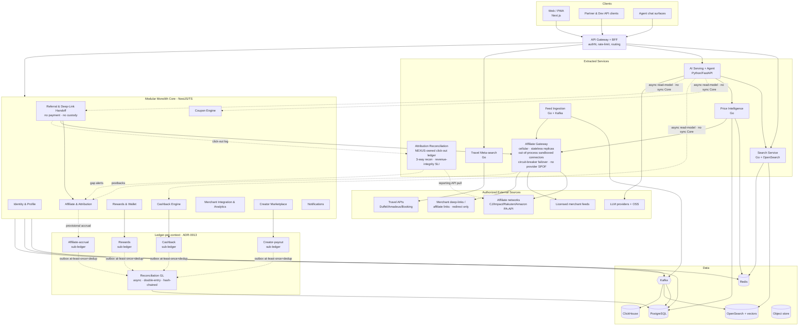
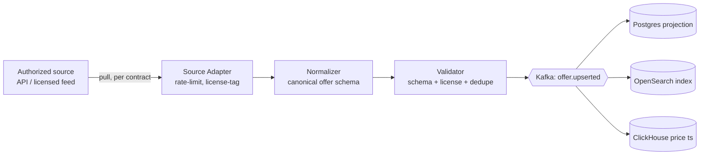
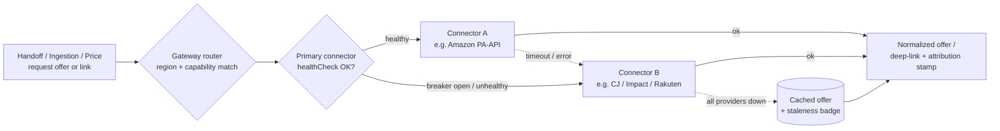

# 04 — System Architecture

**Status:** 🟢 Draft-complete (R4-remediated) · **Owner:** Enterprise + Solution + Software Architect · **Depends on:** [01](01-vision.md), [02](02-software-design-document.md), [03](03-business-model.md)

---

## 1. Architectural drivers

Ranked forces that shape every structural decision (traceable to NFRs in [SDD §5](02-software-design-document.md#5-non-functional-requirements-nfrs)):

1. **Legitimacy** — only authorized data sources (Prime Directive → adapter isolation).
2. **Neutrality** — ranking must be un-buyable (→ ranking service isolated from monetization).
3. **Latency at scale** — NFR-PERF-01/03 (→ cache-first, CQRS reads).
4. **Freshness-accuracy at intent** — NFR-COMP-01 (→ three-tier freshness, SDD §8).
5. **Evolvability** — modular-monolith-first, clean seams for strangler extraction.
6. **Cost control** — AI/infra (→ model cascade, read replicas, caching; AI ≤ $0.01/request per [ADR-0009](adr/ADR-0009-ai-cost-strategy.md)).
7. **Provider resilience** — no affiliate/feed provider may be a SPOF (→ Affiliate Gateway plugin connectors + automatic failover, [ADR-0008](adr/ADR-0008-affiliate-gateway.md)).
8. **Regional expandability** — international-by-design; adding a market is config, not re-architecture (→ country flags, compliance modules, tax abstraction, i18n/multi-currency, [ADR-0007](adr/ADR-0007-phased-global-rollout.md)).
9. **Replaceability & operability** — every subsystem swappable, adapter-wrapped, health-checked, metered, with a rollback ([ADR-0010](adr/ADR-0010-platform-principles.md)).

## 2. Architecture style — decision

> **Decision:** **Modular monolith** for the transactional core (bounded contexts as modules with enforced boundaries), with **latency-critical and independently-scaling concerns extracted as services from day one** (search fan-out, price intelligence, AI serving, feed ingestion). Evolve to microservices via the **strangler-fig** pattern under measured load. See [ADR-0004](adr/ADR-0004-architecture-style.md).

| Option | Pros | Cons | Verdict |
|--------|------|------|---------|
| Microservices day 1 | Independent scale/deploy | Distributed-systems tax before product-market fit; slow velocity | ❌ premature |
| Pure monolith | Fastest velocity | Can't scale search/AI independently; risky coupling | ❌ won't scale core |
| **Modular monolith + a few strategic services** | Velocity **and** independent scaling where it matters | Requires boundary discipline | ✅ **chosen** |

**Boundary enforcement is real, not aspirational ([ADR-0020](adr/ADR-0020-performance-consistency-hardening.md)):** modules communicate only via typed interfaces + domain events; no cross-module DB access. Boundaries are enforced by the datastore, not just convention — each module owns a **separate DB schema with a separate DB role**, so cross-schema access is denied at the database even under a shared connection pool (not merely a shared pool with polite conventions). The **AI service never calls Core modules synchronously on the hot path** — it reads from async read-models/projections — so a Core latency spike or outage cannot stall AI serving and the discovery path stays decoupled from the transactional core. CI checks import boundaries (e.g., dependency-cruiser / arch tests) and boundary tests assert role-scoped DB access. This makes future extraction mechanical.

## 3. Context / container map (C4 Level 2)

## 4. Component responsibilities

| Component | Responsibility | Style | Scaling axis |
|-----------|----------------|-------|--------------|
| **API Gateway + BFF** | AuthN, rate-limit, request shaping, per-surface aggregation | Edge/stateless | Horizontal |
| **Identity & Profile** | Accounts, passkeys/MFA, consent, agent spend policy | Module | With users |
| **Search Service** | Hybrid lexical+semantic query, neutral ranking, faceting | Service (Go) | QPS |
| **Price Intelligence** | Normalize all-in price, history, drop prediction, live check | Service (Go) | Offer volume |
| **Feed Ingestion** | Pull authorized feeds/APIs → normalize → events | Service (Go) | Feed count |
| **Affiliate Gateway** | Plugin front-end to **all** affiliate networks / licensed feeds; one common **connector** interface (feed sync · offer/price lookup · deep-link build · attribution stamp · postback ingest · health check · capabilities incl. regions); connectors run **out-of-process, sandboxed, least-privilege** ([ADR-0018](adr/ADR-0018-connector-security-hardening.md)); runs as **cellular stateless replicas** with independent per-connector health — no shared router/health-check gates all traffic ([ADR-0017](adr/ADR-0017-blast-radius-isolation.md)); **no provider is a SPOF** — circuit-breaker + health-based **automatic failover** to alternate connector or cached data; region-aware routing ([ADR-0008](adr/ADR-0008-affiliate-gateway.md)) | Service (Go, HA/multi-AZ) | Provider count · referral volume |
| **Attribution Reconciliation** | Owns the **NEXUS-minted click-out ledger** (every `handoff.redirected`); runs **3-way reconciliation** (NEXUS click-out × modeled rate vs. network reporting API vs. sampled real-purchase panel) → per-network/region `attribution_gap_rate`; baselines + anomaly alerts feed the **revenue-integrity SLI**; makes VMS falsifiable ([ADR-0011](adr/ADR-0011-attribution-reconciliation.md)) | Service | Network × region |
| **Coupon / Cashback / Rewards** | Verified savings, spread, accrual | Modules | Txn volume |
| **Referral & Deep-Link Handoff** | Resolve best option → stamp attribution → **redirect** to merchant's official checkout via affiliate/deep-link. **No payment, no order custody** ([ADR-0006](adr/ADR-0006-referral-only-model.md)) | Module | Referral volume |
| **Affiliate & Attribution** | Deterministic stamping; ingest conversion **postbacks** as **provisional (non-payable) accrual**; purchase-fingerprint dedup; idempotent, order-independent postback state machine; event-sourced audit ([ADR-0012](adr/ADR-0012-postback-integrity.md)) | Module | GMV |
| **Ledger-per-context + Reconciliation GL** | Each money domain (affiliate accrual, cashback, rewards, creator payouts) owns an **append-only accrual sub-ledger** with its invariant scoped to that domain (no cross-domain writes); a dedicated **Reconciliation GL asynchronously** aggregates them into the audited, double-entry, hash-chained financial view; money invariant **dual-enforced** (domain service + independent checker); durable **at-least-once outbox relay with idempotent dedup-on-event-id consumers (effectively-once)** — not order settlement ([ADR-0013](adr/ADR-0013-ledger-per-context.md)) | Sub-ledgers (modules) + GL (service) | Accrual volume |
| **AI Serving + Agent** | Agent loop, RAG, tool-calling, safety | Service (Python) | Query volume |
| **Travel Meta-search** | Flight/hotel search + bundling | Service (Go) | QPS |
| **Creator/Merchant** | Two-sided onboarding, storefronts, analytics | Modules | Partners |

## 5. Data-flow patterns

### 5.1 CQRS for discovery
Writes (feed ingestion, price updates) flow through Kafka into the **read-optimized** OpenSearch + Redis projections. Search reads never hit the OLTP write path → satisfies NFR-PERF-01 and isolates read scaling.

### 5.2 Event-driven feed ingestion (the legitimacy boundary)

**Every ingested record is license-tagged at the adapter** with its source and permitted use. Downstream services enforce usage rights (e.g., can we cache price? show review text? redistribute image?). No adapter exists for a non-authorized source — legitimacy is structural, not procedural. See [ADR-0001](adr/ADR-0001-data-sourcing.md).

### 5.3 Neutrality enforcement
The **Ranking** component inside Search consumes only relevance + buyer-value signals (price, reliability, delivery, savings). Monetization signals (sponsorship) are handled by a **separate Placement service** that can insert *labeled* slots but **cannot reorder** neutral results. The two code paths are physically separated and the boundary is asserted by tests + audit (NFR-COMP-01). This is the architectural guarantee behind [Business Model §2 neutrality wall](03-business-model.md#2-revenue-streams-portfolio).

### 5.4 Attribution & money (event-sourced)
The referral flow emits immutable events (`referral.initiated`, `attribution.stamped`, `handoff.redirected`, then — asynchronously from the affiliate network — `conversion.confirmed` via **postback**, and `cashback.accrued`). NEXUS never observes the payment itself; conversion is known only via authorized network postbacks, which are received and normalized by the **Affiliate Gateway**'s connector postback-ingest (§6.1) so that failover between providers never loses or double-counts attribution. **No funds flow through NEXUS** ([ADR-0006](adr/ADR-0006-referral-only-model.md)).

**Independent revenue integrity — 3-way reconciliation ([ADR-0011](adr/ADR-0011-attribution-reconciliation.md)).** Because 100% of primary revenue rides on async, network-controlled, reversible postbacks NEXUS never independently observes, the platform does **not** trust the counterparty to grade its own homework. Every `handoff.redirected` is written to a **NEXUS-owned click-out ledger** with a NEXUS-minted `click_id` — a source of truth we control. The **Attribution Reconciliation** subsystem then compares, per network/region/period: (a) NEXUS click-out volume × modeled conversion rate, (b) the network's **reporting-API** pull, and (c) a **sampled real-purchase panel** — yielding an `attribution_gap_rate`. Expected rates are baselined; a statistically significant reported-vs-expected drop-off raises a first-class **revenue-integrity SLI** into the FinOps/anomaly infra. VMS is consequently reported **with confidence bounds and audited against the panel** (falsifiable, not just asserted). Per-connector postback mechanism (real-time pixel vs. batch file vs. API pull — e.g., Amazon is batch) is modeled explicitly, and reconciliation cadence adapts per connector.

**Postback integrity — provisional, deduplicated, order-independent ([ADR-0012](adr/ADR-0012-postback-integrity.md)).** Postbacks are weakly authenticated, out-of-order, duplicable and reversible, so accrual is **provisional by construction**: a postback creates a **`pending`, non-payable** accrual that becomes payable only once *independently* corroborated (reconciliation pull and/or settlement-file match) — a forged postback can never become a real liability. At ingest a probabilistic `purchase_fingerprint = hash(merchant, normalized_offer, user, amount_bucket, time_bucket)` deduplicates conversions; a fingerprint match within the longest cookie window routes to a **hold/adjudication queue**, not auto-credit. One **connector is pinned per (offer, session)** for the attribution window, so mid-session failover cannot re-stamp and double-attribute. The `purchase_fingerprint` uses **overlapping/jittered buckets cross-checked against per-user velocity + connector-pair collusion signals** (anti-gaming), and the reconciliation real-purchase panel is **rotated + population-diversified** so a counterparty cannot behaviorally fingerprint it ([ADR-0022](adr/ADR-0022-round2-remediation.md) H-6/H-7). The postback lifecycle is an **idempotent, order-independent state machine** (`pending → confirmed → reversed`) whose confirm/reverse ordering keys on **NEXUS's own monotonic receipt sequence + a signed reconciliation decision — never the attacker-suppliable `network_event_at`** ([ADR-0022](adr/ADR-0022-round2-remediation.md) NC-3). A reversal is authoritative only when corroborated by reconciliation ([ADR-0011](adr/ADR-0011-attribution-reconciliation.md)); a **raw postback can never *un-reverse* a reversal** (closing the forged/replayed-postback commission-resurrection vector). Duplicates are idempotent on `(network, txn_id)`; reversals post compensating ledger entries; and referral/attribution partitions are retained **at least the longest network return/reversal window** so a late reversal always finds its accrual.

**Ledger-per-context + async reconciliation GL ([ADR-0013](adr/ADR-0013-ledger-per-context.md)).** The four money domains — affiliate accrual, cashback, rewards, creator payouts — are **not** funnelled through one global double-entry ledger (which would be a shared kernel and systemic SPOF). Each domain owns an **append-only accrual sub-ledger** with its invariant scoped to that domain; domains never write each other's ledgers. A dedicated **Reconciliation GL asynchronously** aggregates the sub-ledgers into the audited, double-entry, hash-chained financial view — the strong invariant is enforced *within* each sub-ledger, while the GL provides eventually-consistent consolidated reporting and the VMS north-star. The money invariant is **dual-enforced** (the domain service **and** an independent invariant-checker both validate every balance-changing operation, so a single PDP bug cannot silently break it; the PDP itself runs HA).

**No cross-ledger atomic fan-out — one event, independent consumers (NC-2, [ADR-0022](adr/ADR-0022-round2-remediation.md)).** A confirmed conversion does **not** synchronously write the affiliate, cashback, and rewards sub-ledgers in one atomic cross-ledger transaction. It emits **one `conversion.confirmed` event**, and each money sub-ledger **idempotently consumes that event independently** — at-least-once delivery + dedup on the event id, so a redelivery is a no-op. There is **no distributed write to compensate**: each domain's accrual is applied locally and is **eventually consistent per-domain by construction**, and the GL reconciles the domains into the consolidated view. The outbox→Kafka relay carries this event with **at-least-once delivery** that survives Postgres failover (so money events are never lost in the relay gap; consumers dedup on event id), and sub-ledger ordering uses a **per-account monotonic sequence** (no global-ordering lock-in for the future distributed-SQL migration). *This removes coordination machinery rather than adding it.*

### 5.5 Core-loop performance patterns ([ADR-0020](adr/ADR-0020-performance-consistency-hardening.md))
The buy-intent core loop must hold its p95 budget under enrichment, so it is **not** a serial multi-hop chain:

- **Single-flight request coalescing.** Concurrent live-price lookups for the same offer collapse to **one** upstream call (singleflight keyed by `offer_id`); the herd waits on that one result and shares its freshness timestamp. This removes the per-cache-hit thundering herd against rate-limited networks (e.g., Amazon PA-API) at exactly the viral-SKU peak, at the cost of a bounded, disclosed sub-second freshness window.
- **Parallel fan-out with deadlines + partial-result fallback.** Search → price/coupon/cashback enrichment runs **concurrently**, not serially; each hop gets an allocated slice of a hard total budget, and a slow/failed enrichment degrades to a partial result rather than blowing the p95. Money-adjacent numbers still respect their own freshness/verification rules (§5.4).

These patterns are load-bearing for NFR-PERF-01/03 and are complemented by the hot-partition and write-amplification mitigations in §8.

## 6. Integration architecture (external)

| Source class | Examples | Access mode | Contract concern |
|--------------|----------|-------------|------------------|
| Affiliate networks | CJ, Impact, Rakuten, Amazon PA-API | API + feed | Rate limits, attribution rules, TOS on caching/display |
| Licensed merchant feeds | Google Merchant-style feeds, direct | Batch/stream | License scope, freshness SLA |
| Merchant handoff | Merchant deep-links / affiliate links | Redirect only | Attribution rules, TOS on display; **no card data, no custody** |
| Travel | Duffel/Amadeus, Booking affiliate | API | Booking rules, cancellation liability |
| LLM/AI | Claude, GPT, OSS via router | API | Cost, data-handling, residency |

Each integration is wrapped in an **anti-corruption layer** (adapter) so external schema/TOS changes never leak into the core domain. Circuit breakers + bulkheads isolate a flaky partner from the platform (SDD §9 degradation). **All** affiliate-network and licensed-feed access is mediated by the **Affiliate Gateway** (§6.1) — no core module or service holds a provider SDK directly.

### 6.1 Affiliate Gateway — plugin connectors & automatic failover ([ADR-0008](adr/ADR-0008-affiliate-gateway.md))

The Affiliate Gateway is a first-class abstraction sitting between the core Referral/Handoff module, Feed Ingestion, and Price Intelligence on one side, and the external affiliate networks / licensed feeds / merchant deep-links on the other. It is a **plugin architecture**: every provider is a **connector** — the core depends only on the interface, never on a specific provider.

**Connectors run out-of-process, sandboxed, least-privilege (MUST — [ADR-0018](adr/ADR-0018-connector-security-hardening.md)).** Connector code is credentialed third-party code, so it never runs in-process with the core. Each connector is an isolated worker (separate process/container in a **hardened runtime (gVisor / Kata / microVM, not ordinary namespaces)** — credentialed third-party code over hostile data ([ADR-0018](adr/ADR-0018-connector-security-hardening.md)), **scoped credentials, no access to core secrets or DB**); a compromised or malicious connector cannot pivot into the platform. Per-region × per-connector secrets rotate on a **security schedule**, decoupled from slow partner-contract cadence (automated via ESO + KMS).

**Common connector interface (MUST).** Every connector implements the same contract:

| Capability | Purpose |
|-----------|---------|
| `feedSync()` | Pull/refresh catalog & offer feed into Ingestion |
| `lookupOffer()` / `lookupPrice()` | On-demand offer & live-price resolution |
| `buildDeepLink()` | Construct the affiliate/deep-link for a merchant handoff |
| `stampAttribution()` | Normalize click-id / attribution so failover never loses or double-counts it |
| `ingestPostback()` | Receive & normalize async conversion postbacks |
| `healthCheck()` | Liveness/readiness/dependency health, consumed by failover routing |
| `capabilities()` | Declared regions, categories, rate limits, license-tag & TOS flags — **self-declared but NEXUS-verified before they drive compliance/market routing** ([ADR-0018](adr/ADR-0018-connector-security-hardening.md)); a connector cannot self-assert into a market |

**No provider is a SPOF (MUST).** For any offer/merchant the Gateway may source via **multiple** connectors. A provider outage, rate-limit trip, or failed health check opens a **circuit breaker**; **health-based routing** automatically fails over to an alternate connector, and if all providers for that offer are down it degrades to **cached data with a staleness badge** — never a user-visible failure. Connectors are enabled/disabled by config + feature flag; the interface is versioned and each connector pins a version, so a misbehaving connector is disabled instantly and traffic reroutes (rollback per [ADR-0010](adr/ADR-0010-platform-principles.md)).

**Region-specific routing.** The Gateway's router selects connectors whose `capabilities()` cover the user's region (per [ADR-0007](adr/ADR-0007-phased-global-rollout.md) rollout phases), so the same handoff resolves to the correct network/merchant program per market. The Gateway itself is a critical component and therefore runs HA/multi-AZ with its own SLO ([10](10-deployment-architecture.md)).

## 7. Cross-cutting concerns

### 7.1 Resilience patterns

- **Circuit breakers + bulkheads** per external dependency.
- **Idempotency keys** on all referral/sub-ledger (accrual/payout) mutations; postbacks are idempotent on `(network, txn_id)` (§5.4).
- **Transactional outbox with at-least-once relay + idempotent consumers** (dedup on event id → effectively-once) for reliable event publication; survives Postgres failover so money events are never lost in the relay gap. Sub-ledgers consume `conversion.confirmed` independently — no cross-ledger atomic fan-out ([ADR-0013](adr/ADR-0013-ledger-per-context.md), [ADR-0022](adr/ADR-0022-round2-remediation.md) NC-2).
- **Saga** for the multi-step referral→attribution→(postback)→accrual flow with compensations (conversion is async via postback, so the saga tolerates long gaps and out-of-order/duplicate postbacks; reversals post compensating sub-ledger entries).
- **Backpressure** on ingestion via Kafka consumer lag monitoring.

### 7.2 Internationalization & regional platform ([ADR-0007](adr/ADR-0007-phased-global-rollout.md))

The platform is **international-by-design from day 1** even while only the US market is live, so enabling a new market is a configuration/enablement step — not a re-architecture. The rollout is phased (US → CA/UK/AU → EU → BD/IN/PK/ME → global); the *architecture* carries the following regional components and cross-cutting concerns:

| Concern | Component / mechanism | Notes |
|---------|----------------------|-------|
| **Country feature flags** | Every market gated by a per-country flag | Enabling a country is a controlled rollout, not a deploy; disabling a flag removes it from routing instantly (rollback). |
| **Regional compliance modules** | Pluggable per-jurisdiction policy packs (GDPR, CCPA/CPRA, UK-GDPR/DPA, PIPEDA, Australian Privacy Act, BD-DPA, …) selected by user region | Built out as the rollout reaches each phase; each market gated behind legal sign-off. Swappable adapters per [ADR-0010](adr/ADR-0010-platform-principles.md). |
| **Tax abstraction layer** | Provider-agnostic interface for region tax **display** rules (VAT/GST/sales-tax) | Governs correct all-in **landed-cost display** only — **no tax collection**, since NEXUS is pure-referral ([ADR-0006](adr/ADR-0006-referral-only-model.md)); future-proofs any P7 custody. |
| **Region-specific affiliate routing** | The **Affiliate Gateway** (§6.1) routes each request to the network/merchant program serving the user's region | Driven by connector `capabilities()` region metadata. |
| **Multi-currency** *(cross-cutting)* | Every monetary value carries an explicit currency; no implicit USD; FX handled centrally | Applies platform-wide from day 1. |
| **Multi-language / i18n** *(cross-cutting)* | No hard-coded user-facing strings; locale + RTL support in the platform | Present before non-English markets launch. |

### 7.3 Platform engineering principles ([ADR-0010](adr/ADR-0010-platform-principles.md))

These directives are **normative (MUST)** and apply to **every** subsystem in this document — they are enforced as CI fitness functions (§10):

- **Health checks everywhere** — every component exposes liveness + readiness + dependency health, consumed by orchestration and the Affiliate Gateway's failover routing (§6.1).
- **Metrics everywhere** — every service emits OpenTelemetry metrics/traces/logs with golden signals (NFR-OBS-01).
- **Adapter boundary** — every external provider sits behind an adapter/anti-corruption layer; **no third-party schema or SDK leaks into the core domain**.
- **Replaceability** — every major subsystem (search, data stores, AI models, affiliate networks, payout partner, tax provider, compliance modules, message bus) is swappable without cross-system rewrites.
- **Rollback for every change** — no change (code, config, model, schema, region flag, connector) ships without a documented, tested rollback.

> **AI cost governance ([ADR-0009](adr/ADR-0009-ai-cost-strategy.md)):** the AI Serving layer holds blended inference to **≤ $0.01 per resolved request** via cheapest-capable routing, model cascade, multi-tier caching, and FinOps budgets. This is a cross-cutting concern owned by the AI layer — see [05 — AI Architecture](05-ai-architecture.md) for the mechanism.

## 8. Scalability strategy

| Dimension | Approach |
|-----------|----------|
| Search QPS (NFR-SCAL-01) | Stateless Go search nodes + OpenSearch shards + Redis cache; autoscale on QPS/latency. **Flash-sale ×10–15 spikes** (which breach the 5,000-QPS envelope from ~10M MAU) are handled by an explicit **surge admission & load-shed design** — scheduled pre-warm, priority load-shed protecting the money path while discovery degrades to cached results, edge admission control + fair-priority queue, and per-tier rate-limit tightening ([09 §7.1](09-cloud-architecture.md#71-flash-sale-surge-admission--load-shed-design)) |
| Catalog size (NFR-SCAL-02) | Sharded offer store; hot-path wide-column option; OpenSearch index sharding |
| Write throughput (ingestion) | Kafka partitions keyed by merchant/category; consumer parallelism |
| OLTP | Read replicas + partitioning; distributed SQL as escape hatch (trigger documented in [06](06-database-architecture.md)) |
| AI | Model cascade + response cache + batching ([05](05-ai-architecture.md)) |
| Global | Multi-region read-local, write-home; failover ([09](09-cloud-architecture.md)) |

### 8.1 Blast-radius isolation ([ADR-0017](adr/ADR-0017-blast-radius-isolation.md))

Several components were previously called "no SPOF" while remaining single systemic blast radii. Scaling therefore also means **de-concentrating** them so one failure is one cell, not the platform:

| Concentration | Isolation |
|---------------|-----------|
| AI routing-policy config | A **versioned artifact rolled out by canary per capability class *and* per region** — the canary is scoped to one capability class (**search-rank / agent-reason / claim-verify**) in one region, so a bad policy can't reach all capabilities (or all regions) at once; the prior version auto-pins on eval regression — not a platform-wide AI outage (R-009, [ADR-0022](adr/ADR-0022-round2-remediation.md)). |
| Egress allowlist | A **fleet of horizontally-scaled egress cells**, not one chokepoint; losing a cell reroutes. The allowlist config is **versioned + canaried per cell** — never one shared global flip — so a bad allowlist change hits only one cell (R-020, [ADR-0022](adr/ADR-0022-round2-remediation.md)). The allowlist stays a metering/security control but is no longer a throughput/availability bottleneck. |
| Affiliate Gateway | Runs as **cellular stateless replicas with independent per-connector health**; no shared router/health-check gates all traffic (intra-Gateway HA complementing the §6.1 failover). |
| Discovery vs. money | Discovery (search/AI — elastic, best-effort) and money/handoff/ledger (strict SLO) run on **separate node pools / clusters**, so a discovery surge cannot starve the money path or couple their SLOs. |
| Redis | Money/auth Redis is a **separate cluster** from the high-churn catalog-invalidation cache; a catalog stampede cannot evict session/auth/rate-limit state. |
| Observability | Metrics/logs/traces run on a **separate failure domain** with no autoscaling circular dependency — the thing that scales the app cannot depend on the app being up. |
| GPU capacity | A **minimum warm GPU floor** guarantees the agent first-token SLO; scale-to-zero applies only to batch/eval, never the interactive path. |

## 9. Risks, assumptions, trade-offs (architecture-level)

| Item | Type | Note / mitigation |
|------|------|-------------------|
| Boundary erosion in monolith | Risk | CI arch-tests; module ownership; periodic fitness functions |
| Three backend runtimes (TS + Go + Python) | Trade-off | Bounded to 3, each with a clear domain (TS core, Go latency-critical, Python AI); shared protobuf/OpenAPI contracts |
| Kafka operational heft | Risk | Use managed (MSK/Confluent) initially |
| Feed-partner TOS variance | Risk | License-tag enforcement; legal review per integration |
| Live-check cost spikes at intent | Trade-off | Cache warm results; only on genuine buy-intent (SDD §8) |
| Neutrality/monetization leak | Risk | Physical code separation + audit; highest-severity guardrail |

## 10. Fitness functions (how we keep it healthy)

- **Boundary test:** no cross-module DB imports (CI).
- **Neutrality test (strengthened):** ranking output invariant under **both** direct sponsorship changes **and** *indirect, commission-correlated* perturbation — i.e. varying a merchant's affiliate-commission rate MUST NOT reorder neutral results (CI + audit, per [ADR-0020](adr/ADR-0020-performance-consistency-hardening.md) R-045). *This strengthens **enforcement** of the ratified neutrality principle ([§5.3](#53-neutrality-enforcement)); it does not change the principle.*
- **Latency SLO test:** p95 search ≤ NFR-PERF-01 in staging load test (gate).
- **License-tag coverage:** 100% of ingested records tagged (monitor).
- **Adapter-boundary / "no provider SDK in core":** static check that no third-party provider SDK/schema is imported into a core module — every external provider stays behind an adapter (CI, per [ADR-0010](adr/ADR-0010-platform-principles.md)).
- **Connector-interface conformance:** every Affiliate Gateway connector passes the shared interface conformance test suite (all capabilities implemented incl. regions) before it can be enabled (CI gate, per [ADR-0008](adr/ADR-0008-affiliate-gateway.md)).
- **Health-endpoint presence:** every component/service exposes liveness + readiness + dependency-health endpoints (CI + deploy check).
- **Automatic-failover test:** killing/forcing-unhealthy a primary connector reroutes to an alternate (or cached data) with no user-visible failure — asserted in integration tests (gate).
- **Rollback-doc-present gate:** no change (code, config, model, schema, region flag, connector) merges without a documented, tested rollback procedure (CI gate).
- **Connector-sandbox isolation:** every Affiliate Gateway connector runs out-of-process with scoped credentials and **no access to core secrets/DB**; a test asserts an in-process or over-privileged connector fails to start / fails the gate (CI + deploy check, per [ADR-0018](adr/ADR-0018-connector-security-hardening.md)).
- **Revenue-integrity reconciliation SLI:** the 3-way reconciliation runs per network/region and the `attribution_gap_rate` SLI is emitted and alertable; a network with no independent corroboration path (reporting API or panel) fails the check — VMS must be computed with confidence bounds (monitor + gate, per [ADR-0011](adr/ADR-0011-attribution-reconciliation.md)).
- **No-sync-core / schema-role boundary:** static + integration check that the AI service never calls Core modules synchronously on the hot path, and that each module accesses only its own DB schema under its own DB role (cross-schema access denied) (CI, per [ADR-0020](adr/ADR-0020-performance-consistency-hardening.md)).
- **Provisional-accrual invariant:** no postback-derived accrual is payable until independently reconciled; a test asserts an unreconciled `pending` accrual cannot reach a payout path (CI gate, per [ADR-0012](adr/ADR-0012-postback-integrity.md)).
- **Reversal-ordering invariant (safety-critical):** the postback state machine MUST order confirm/reverse by NEXUS's own monotonic receipt sequence + a signed reconciliation decision — **never** by the network-supplied `network_event_at`. A test replays a forged/late "confirm" with a future `network_event_at` against a prior reconciliation-confirmed `reversed` state and asserts it **cannot un-reverse** the accrual (CI gate, per [ADR-0022](adr/ADR-0022-round2-remediation.md) NC-3 / [ADR-0012](adr/ADR-0012-postback-integrity.md)). This directly guards the C-1 fraud vector.
- **Doc-consistency lint (breaks the ADR→doc propagation-failure class):** a CI lint over `docs/` that fails on (a) **banned/retired terms** (e.g. `last-writer-by-network-timestamp`, the retired savings vocabulary `promised|clawed-back`, unqualified `exactly-once`), (b) **dangling intra-repo anchors** (every `](file.md#slug)` must resolve to a real heading slug), and (c) **ADR-status drift** (an ADR marked `Accepted` whose decisions aren't reflected, or a doc citing a superseded rule). Adversarial reviews R4/R5 repeatedly caught defects of exactly these three shapes *after* the ADR was correct but the doc wasn't updated; this lint makes that class a **merge-blocking gate**, not a review finding (per Review R5; wired in [10 §2](10-deployment-architecture.md#2-ci-pipeline)).
- **Ledger fan-out is event-driven, not atomic:** a test asserts a confirmed conversion emits one `conversion.confirmed` event that each sub-ledger consumes independently and idempotently (redelivered event is a no-op; no synchronous cross-ledger atomic write), so per-domain accrual is eventually consistent and the GL reconciles (CI gate, per [ADR-0022](adr/ADR-0022-round2-remediation.md) NC-2).
- **AI routing-policy canary scope:** a routing-policy rollout is gated to canary **per capability class (search-rank / agent-reason / claim-verify) and per region**; a policy that targets all capabilities or all regions at once fails the gate (CI + deploy check, per [ADR-0022](adr/ADR-0022-round2-remediation.md) R-009).
- **Egress-allowlist canary scope:** egress allowlist config is **versioned and canaried per cell**; a change that flips the allowlist globally (not cell-scoped) fails the gate (CI + deploy check, per [ADR-0022](adr/ADR-0022-round2-remediation.md) R-020).

---
*Next: [05 — AI Architecture](05-ai-architecture.md)*
