# 06 — Database Architecture

**Status:** 🟢 Draft-complete (R4-remediated) · **Owner:** Database Architect · **Depends on:** [04](04-system-architecture.md)

---

## 0. Scope, method & how to read this document

This document specifies the **persistence layer** for NEXUS: which store owns which data, the canonical logical models, the freshness/consistency contracts, and the scaling triggers. It is the authoritative source for every schema decision downstream ([07 — API Architecture](07-api-architecture.md), [08 — Security](08-security-architecture.md)).

It is bound by the **consistency contract** with the upstream docs and MUST NOT contradict them:

- Polyglot persistence from [SDD §6](02-software-design-document.md#6-technology-stack--decisions-with-alternatives): **PostgreSQL** (primary OLTP), **Redis** (cache / hot price), **OpenSearch** (+vectors), **ClickHouse** (analytics / price time-series), **object store**, **Kafka** (events). **Wide-column (ScyllaDB/Cassandra)** is a hot-path escape hatch, not a day-1 store.
- Money is a **double-entry ledger, event-sourced** ([04 §5.4](04-system-architecture.md#54-attribution--money-event-sourced)). **Attribution** is event-sourced.
- **Three-tier freshness** ([SDD §8](02-software-design-document.md#8-data-freshness-strategy-a-defining-design-decision)): Redis hot / feed-synced warm / on-demand live check.
- Every ingested record is **license-tagged** ([04 §5.2](04-system-architecture.md#52-event-driven-feed-ingestion-the-legitimacy-boundary)).
- Referenced NFRs: **NFR-SCAL-01** (5,000 QPS), **NFR-SCAL-02** (500M+ offers), **NFR-PERF-01** (≤400 ms p95 cached search), **NFR-SEC-01** (AES-256 at rest / TLS 1.3), **NFR-PRIV-01** (data minimization + per-geo residency).
- **Round-1 remediation ADRs bind this document** and their schema/topology consequences are folded into the sections below: [ADR-0011](adr/ADR-0011-attribution-reconciliation.md) (attribution reconciliation store), [ADR-0012](adr/ADR-0012-postback-integrity.md) (provisional postback state machine), [ADR-0013](adr/ADR-0013-ledger-per-context.md) (ledger-per-context + async GL), [ADR-0014](adr/ADR-0014-wallet-hold-gate.md) (wallet available/held), [ADR-0016](adr/ADR-0016-region-residency-lifecycle.md) (residency / DR / erasure), [ADR-0017](adr/ADR-0017-blast-radius-isolation.md) (store isolation), [ADR-0020](adr/ADR-0020-performance-consistency-hardening.md) (canonical money type, hot-partition, write-amplification). **Round-2 remediation** [ADR-0022](adr/ADR-0022-round2-remediation.md) further amends the sections below: event-driven (non-atomic) sub-ledger accrual fan-out (§3.6, §3.7, §9), NEXUS-authoritative reversal ordering (§3.8, §9), and the blinded reconciliation panel (§3.7).

**Decision format (RFC-2119).** Every material decision is recorded as **Options → Decision → Trade-offs → Risks → Assumptions → Scalability → Implementation**. The keywords MUST, MUST NOT, SHOULD, SHOULD NOT, MAY are used per RFC 2119.

---

## 1. Polyglot persistence overview — one store per job

### Decision

> **Decision:** NEXUS **MUST** use polyglot persistence. Each bounded context ([04 §3](04-system-architecture.md#3-context--container-map-c4-level-2)) has **exactly one system of record (SoR)**; all other stores that hold the same data are **derived read models** rebuildable from the SoR + the Kafka event log. No two stores are dual-writable systems of record for the same fact.

### Options considered

| Option | Verdict |
|--------|---------|
| **Single Postgres for everything** | ❌ Cannot meet NFR-SCAL-02 (500M+ offers) for hybrid lexical+vector search, nor ClickHouse-class time-series analytics. Search on Postgres GIN/pgvector caps out well below 5,000 QPS at this corpus size. |
| **Store-per-microservice, no shared analytics plane** | ❌ Fragments price history and attribution audit; VMS north-star ([01 §4](01-vision.md#4-north-star-metric--guardrails)) needs a unified analytical view. |
| **Polyglot: SoR per context + derived read models via CQRS** | ✅ **Chosen.** Matches the CQRS discovery pattern ([04 §5.1](04-system-architecture.md#5-data-flow-patterns)) and the extracted-services topology. |

### Context → store ownership map

| Bounded context ([04 §3](04-system-architecture.md#3-context--container-map-c4-level-2)) | System of record | Derived / secondary stores | Why this SoR |
|---|---|---|---|
| **Identity & Profile** | PostgreSQL (`identity` schema) | Redis (session/token cache) | Relational integrity, consent state, foreign keys to everything; small row count, strong consistency mandatory. |
| **Catalog & Offer** | PostgreSQL (`catalog` schema, sharded) — canonical offer SoR | OpenSearch (search projection), Redis (hot price), ClickHouse (price ts), object store (media) | Offers need relational joins (product↔offer↔merchant) + license tags; scale-out via partitioning, search offloaded to OpenSearch. |
| **Price Intelligence** | ClickHouse (price time-series SoR) + Redis (current hot price) | PostgreSQL holds *last-known* price on offer row | Append-only observations at 500M-offer cadence are a columnar/time-series workload, not OLTP. |
| **Search & Discovery** | OpenSearch (query index; **no SoR of its own** — pure read model) | Redis (result cache) | It is a projection; MUST be rebuildable from Catalog SoR + events. |
| **Recommendations** | Derived (feature store in Redis/ClickHouse; models in object store) | — | No authoritative business facts; consumes events. |
| **Coupon Engine** | PostgreSQL (`coupon` schema) | Redis (verified-coupon cache) | Small, relational, verification state; strong consistency on validity. |
| **Cashback Engine** | PostgreSQL (`cashback` schema) — accrual records | Kafka (accrual events → Ledger) | Money-adjacent; MUST be transactional and auditable. |
| **Rewards & Wallet** | PostgreSQL (`wallet` schema) — **`available` + `held` balances** ([ADR-0014](adr/ADR-0014-wallet-hold-gate.md)) | — | Balances are money-like; strong consistency; payout draws only from `available`. |
| **Ledger & Payouts** | PostgreSQL — **per-context append-only sub-ledgers** (`ledger_affiliate` / `ledger_cashback` / `ledger_rewards` / `ledger_creator`), each event-sourced ([ADR-0013](adr/ADR-0013-ledger-per-context.md)) | Reconciliation **GL** service (async double-entry consolidation) → ClickHouse (reporting projection) | Double-entry correctness ([04 §5.4](04-system-architecture.md#54-attribution--money-event-sourced)) requires ACID + serializable writes **scoped per domain**; one global ledger was a shared-kernel SPOF (R-004). |
| **Affiliate & Attribution** | PostgreSQL (`attribution` schema) — **event-sourced**, incl. the **NEXUS-owned click-out ledger** + reconciliation tables ([ADR-0011](adr/ADR-0011-attribution-reconciliation.md)) | ClickHouse (attribution analytics + `attribution_gap` rollups) | Immutable stamping audit trail; deterministic replay; independent click-out view detects network under-reporting (R-001). |
| **Referral & Handoff** | PostgreSQL (`referral` schema) — referral + attributed-conversion state; saga tolerant of async postbacks | Kafka (saga events) | Multi-step saga with compensations; needs durable state machine. |
| **Merchant / Dropship** | PostgreSQL (`merchant` schema) | OpenSearch (merchant search) | Relational partner/contract data + license scope. |
| **Creator Marketplace** | PostgreSQL (`creator` schema) | OpenSearch (creator/content discovery), object store (media) | Relational profiles + storefront; content indexed for discovery. |
| **Watchlist & Alerts** | PostgreSQL (`watch` schema) | Redis (active-watch price-trigger index) | Durable user intent; fast trigger match on price events. Launch = alert→deep-link; auto-buy is P5+ ([ADR-0006](adr/ADR-0006-referral-only-model.md)). |
| **Travel Meta-search** | External APIs (no local SoR for inventory) | Redis (short-TTL quote cache), ClickHouse (search analytics) | Inventory is not ours to persist; only cache quotes within TOS. |
| **Notifications** | PostgreSQL (`notif` schema) + Kafka | — | Outbox-driven delivery log. |
| **Feed Ingestion** | Kafka (`offer.upserted` log is the durable ingress) | writes into Catalog/OpenSearch/ClickHouse | The event log is the replayable source for all derived offer stores. |

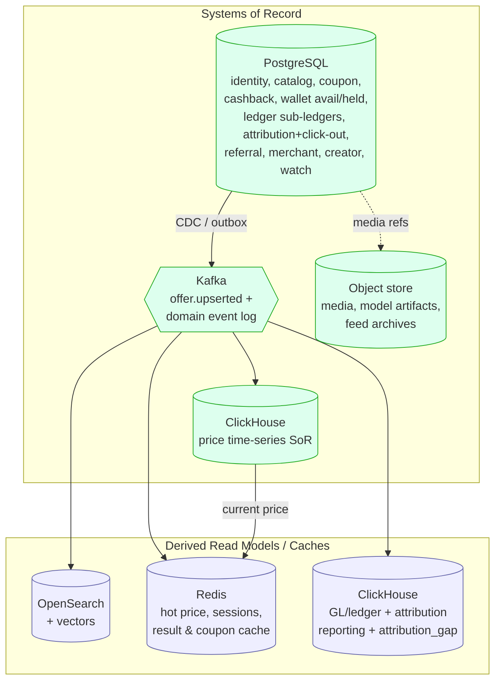

### Trade-offs
Polyglot maximizes fit-for-purpose but multiplies operational surface (backup, monitoring, on-call runbooks per engine). We accept this because a single store cannot simultaneously satisfy NFR-SCAL-01/02 and NFR-PERF-01.

### Risks
- **Derived-store drift** (OpenSearch/Redis diverge from SoR). Mitigation: all derived stores are **idempotently rebuildable** from Kafka; drift detectors reconcile counts hourly.
- **Skill/ops sprawl** across 4 engine families. Mitigation: managed offerings first (RDS/Aurora, MSK, managed OpenSearch, ClickHouse Cloud) per [SDD §6](02-software-design-document.md#6-technology-stack--decisions-with-alternatives).

### Assumptions
Aligned with SDD §6 tech choices; wide-column store deferred until a measured hot-path need (§10).

### Scalability
Each store scales on its own axis (Postgres: partition+replica; OpenSearch: shards; ClickHouse: parts/shards; Redis: cluster slots). Detailed in §10.

### Implementation
One managed cluster per engine per region; Terraform-managed ([SDD §6](02-software-design-document.md#6-technology-stack--decisions-with-alternatives)); schema-per-context inside Postgres to keep the no-shared-tables rule enforceable in a single physical cluster before extraction.

---

## 2. Data ownership & the no-shared-tables rule

### Decision

> **Decision:** A table (or index/keyspace) is owned by **exactly one** bounded context. A context **MUST NOT** read or write another context's tables directly — not even inside the same Postgres cluster. Cross-context data access **MUST** go through the owning context's API (synchronous) or its published domain events (asynchronous). This makes the future strangler extraction ([04 §2](04-system-architecture.md#2-architecture-style--decision)) mechanical rather than a rewrite.

### Enforcement

- Each context lives in its **own Postgres schema** with a **dedicated DB role**. Role `catalog_rw` has no grants on `ledger.*`. This turns the architectural rule into a **database permission**, not a code convention.
- Cross-schema foreign keys are **forbidden** except within a context. Cross-context references are held as **opaque IDs** (e.g., `referral.referral.user_id` stores an Identity user id but has no FK to `identity.user`).
- The CI **boundary fitness function** ([04 §10](04-system-architecture.md#10-fitness-functions-how-we-keep-it-healthy)) additionally greps migrations for cross-schema DDL and fails the build.
- Referential integrity that spans contexts is maintained by **eventual consistency + reconciliation**, never by a database FK.

```mermaid
flowchart LR
    subgraph Referral
      RF[Referral & Handoff module]
    end
    subgraph Identity
      IDAPI[[Identity API]]
      IDDB[(identity schema)]
    end
    RF -->|GET /users/:id  (sync)| IDAPI
    RF -.->|subscribe user.updated (async)| K{{Kafka}}
    IDAPI --> IDDB
    IDDB -->|outbox| K
    RF -->|NEVER| IDDB
    linkStyle 3 stroke:#c33,stroke-width:2px;
```

**Trade-offs:** joins that would be trivial in one schema become an API call or a local read-model. We accept read-model duplication (e.g., Referral keeps a denormalized `buyer_display` copy) to preserve boundaries. **Risk:** duplicated data goes stale → reconcile via events. **Assumption:** contexts are correctly bounded per [04 §3](04-system-architecture.md#3-context--container-map-c4-level-2). **Scalability:** clean seams let any context be lifted to its own physical database under load. **Implementation:** per-schema roles + migration linter in CI.

---

## 3. Core logical data models

> Models below are **logical** and deliberately show keys, cardinality, and the load-bearing columns — not exhaustive column dumps. Types are indicative (`uuid`, `citext`, `numeric`, `jsonb`, `tstz` = `timestamptz`). **Money is one canonical type: an integer count of ISO-4217 minor units + a `currency` code** ([ADR-0020](adr/ADR-0020-performance-consistency-hardening.md)), defined once and code-generated into every runtime and contract format (never floats). The logical models below render money columns as `numeric` for readability, but the physical/wire representation is the canonical minor-units integer; cross-currency comparison is an explicit **FX-normalization** ranking step, never an implicit cast. All tables carry `created_at`, `updated_at`; append-only tables carry only `created_at`.

### 3.1 Identity & Profile

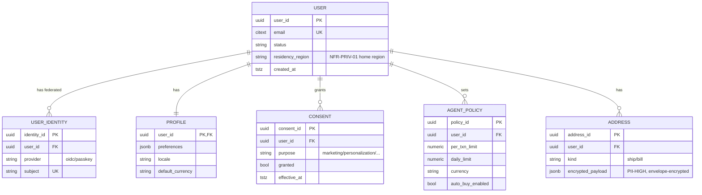

The `AGENT_POLICY` is the SoR for **per-user action/handoff authorization** — the agentic safety gate ([SDD §4.2](02-software-design-document.md#42-delegated-agentic-handoff-with-safety-gate)). Under ADR-0006 the agent **decides and hands off**; it does not complete payment, so per-user **spend limits are a P5+ addition** (pending a future custody ADR), not a launch control. `residency_region` drives multi-region write-home (§11).

### 3.2 Catalog & Offer (product · offer · merchant · price)

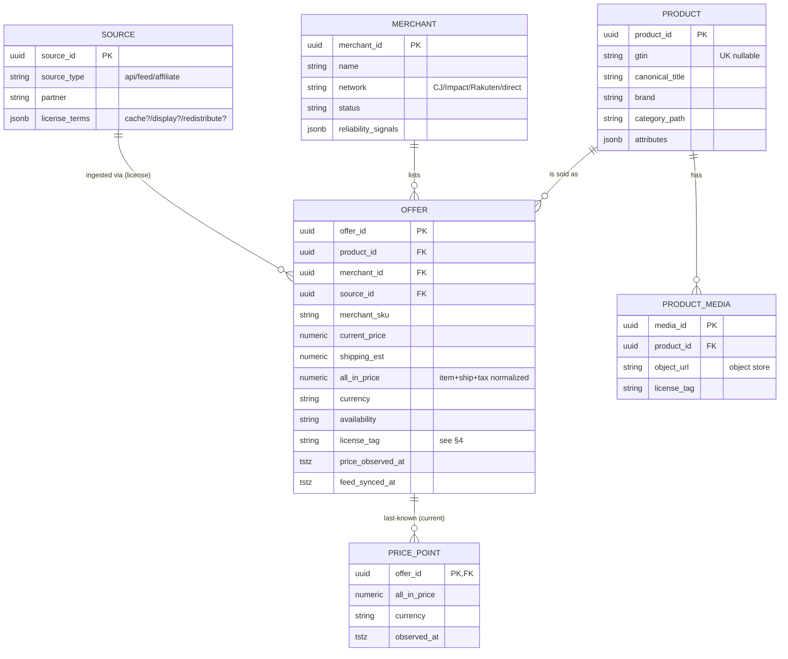

`OFFER` is the **canonical offer** (schema in §4). `PRICE_POINT` on Postgres holds only the **current** value for OLTP reads; the full history lives in ClickHouse (§5) — this is the CQRS split that keeps the OLTP row narrow at 500M-offer scale (NFR-SCAL-02).

### 3.3 Coupon

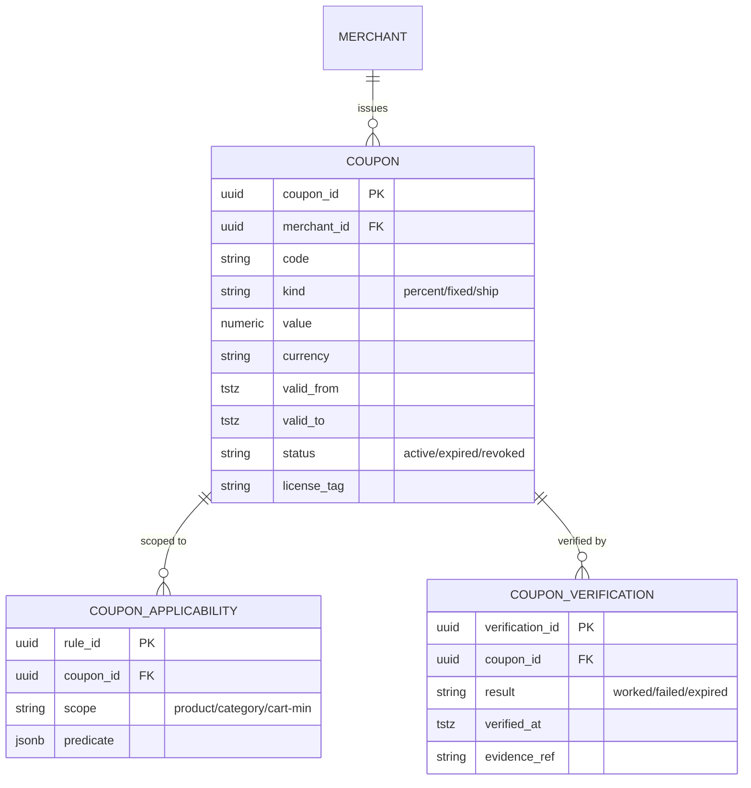

`COUPON_VERIFICATION` is what backs the "verified coupon" claim in the core loop ([SDD §4.1](02-software-design-document.md#41-find-the-best-all-in-price-core-loop)) and feeds coupon apply-success rate.

### 3.4 Cashback

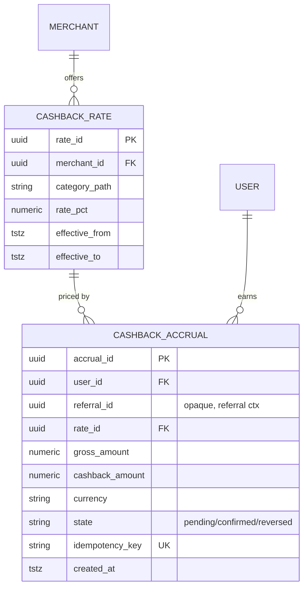

`CASHBACK_ACCRUAL` is money-adjacent: each state transition emits an event that the **Ledger** (§3.6) posts as a double-entry pair. `idempotency_key` prevents double-accrual on event redelivery (§8).

### 3.5 Rewards / Wallet

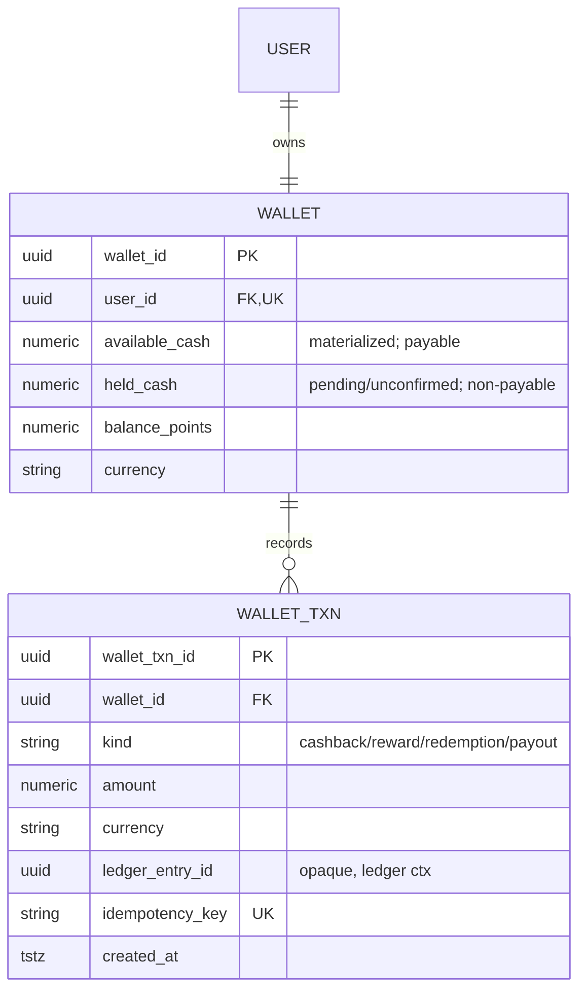

> **Important:** both `WALLET.available_cash` and `WALLET.held_cash` are **materialized caches** of the wallet sub-ledger ([ADR-0013](adr/ADR-0013-ledger-per-context.md)), never independent sources of truth. The **sub-ledger is authoritative**; each balance MUST be reconcilable to the sum of its ledger entries. Any divergence is an incident.
>
> **Payout hold-gate (MUST, [ADR-0014](adr/ADR-0014-wallet-hold-gate.md)):** postback-driven accrual lands in **`held_cash`** (provisional, [ADR-0012](adr/ADR-0012-postback-integrity.md)) and moves to **`available_cash`** **only** once the accrual reaches `confirmed` past the hold/clawback window. A payout MAY draw **only** from `available_cash`; a `held`/`pending` amount is **never payable** — enforced server-side in the wallet sub-ledger, not in UI. This closes the accrue→payout→return leak (R-005): a reversal during the window hits not-yet-paid `held_cash`, so the reversing entry always has funds to reverse. The product surfaces the ratified **four-state** savings model — **Estimated → Pending → Confirmed → Reversed** ([ADR-0021](adr/ADR-0021-legal-product-truth.md) D4) — with VMS counted from **Confirmed** only. Reverting to a single balance is forbidden without a superseding ADR.

### 3.6 Ledger (double-entry, event-sourced)

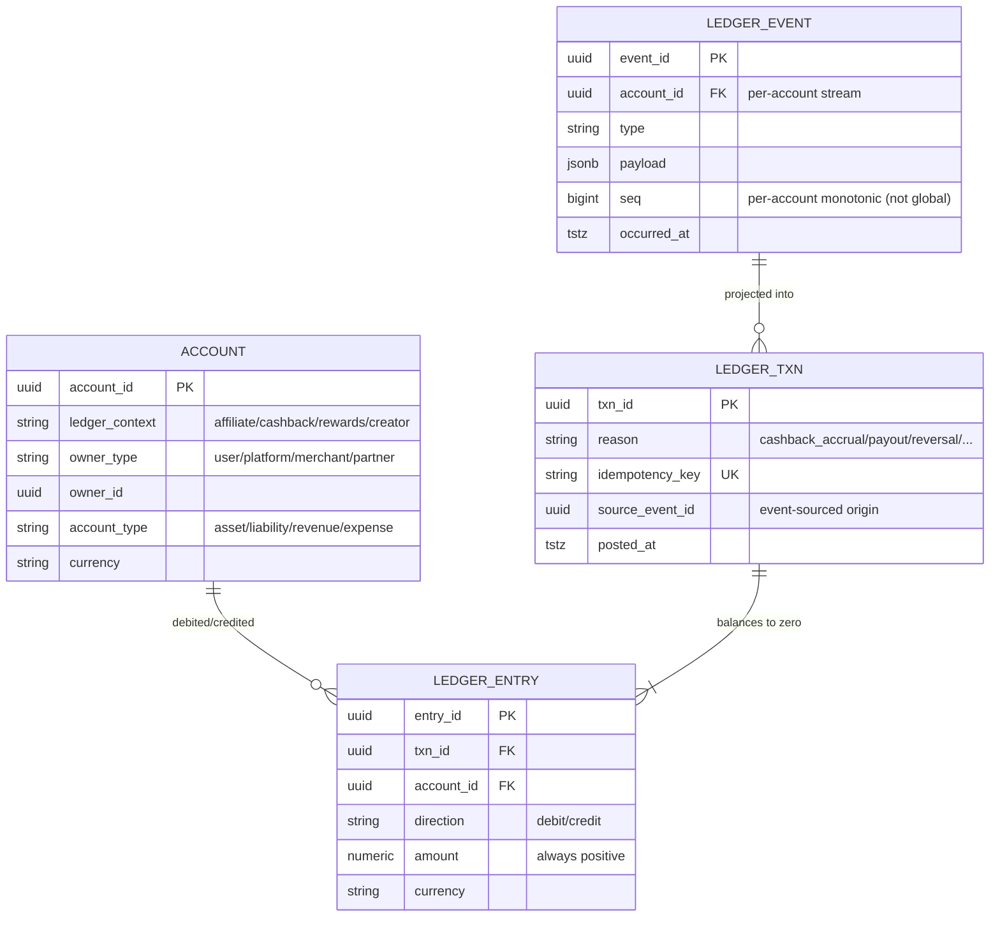

> **Decision (ledger-per-context, [ADR-0013](adr/ADR-0013-ledger-per-context.md)):** there is **no single global Ledger**. Each money domain — affiliate accrual, cashback, rewards, creator payouts — owns its **own append-only sub-ledger** (the ER above is instantiated once per context, e.g. `ledger_cashback.account`), with the double-entry invariant **scoped to that sub-ledger**; domains never write each other's ledgers. A separate **Reconciliation GL service asynchronously** aggregates the sub-ledgers into the audited, hash-chained, consolidated double-entry view: the strong invariant is enforced *within* a sub-ledger, the GL is eventually consistent for reporting only (not for per-domain authorization, which stays strong). This removes the shared-kernel SPOF (R-004) and makes each money domain independently deployable and extractable.
>
> **Accrual fan-out is event-driven, not a cross-sub-ledger atomic write ([ADR-0022](adr/ADR-0022-round2-remediation.md)).** A conversion that accrues to more than one domain (e.g. commission to the affiliate/creator sub-ledger *and* cashback to the cashback sub-ledger) does **not** perform a synchronous multi-sub-ledger atomic write. It emits **one `conversion.confirmed` event**; each affected sub-ledger **consumes it independently and idempotently** (at-least-once + dedup on the event id, §8). There is **no distributed write to compensate** — per-domain accrual is **eventually consistent per domain by construction**, and the Reconciliation GL reconciles the domains. *This removes coordination machinery rather than adding it.*

**Invariants (enforced in a serializable transaction, per sub-ledger):**
1. Every `LEDGER_TXN` has ≥2 entries; **Σ debits = Σ credits** per currency (double-entry). A DB `CONSTRAINT TRIGGER DEFERRED` checks the balance at commit.
2. `LEDGER_ENTRY` and `LEDGER_TXN` are **append-only** — no `UPDATE`/`DELETE`. Corrections post **reversing** transactions.
3. Each sub-ledger is a **projection of its `LEDGER_EVENT`** stream ([04 §5.4](04-system-architecture.md#54-attribution--money-event-sourced)); replaying a given account's events from its **per-account `seq=0`** reproduces that sub-ledger exactly (deterministic). Ordering is a **per-account monotonic sequence, not a global one** ([ADR-0013](adr/ADR-0013-ledger-per-context.md)) — this survives the future Postgres→distributed-SQL migration (§10) without a global-ordering assumption (fixes R-034).
4. `idempotency_key` (derived from the source event id) makes posting effectively-once under redelivery; the outbox→Kafka relay uses **at-least-once delivery with dedup-on-event-id (effectively-once) that survives Postgres failover** ([ADR-0013](adr/ADR-0013-ledger-per-context.md), fixes R-035), so money events are never lost in the relay gap.
5. Balance-changing operations are **dual-enforced** — checked by **both** the domain service **and** an independent invariant-checker (belt-and-braces, fixes R-069) — so no single PDP bug can silently break a money invariant; the PDP itself runs HA.

### 3.7 Affiliate / Attribution (event-sourced)

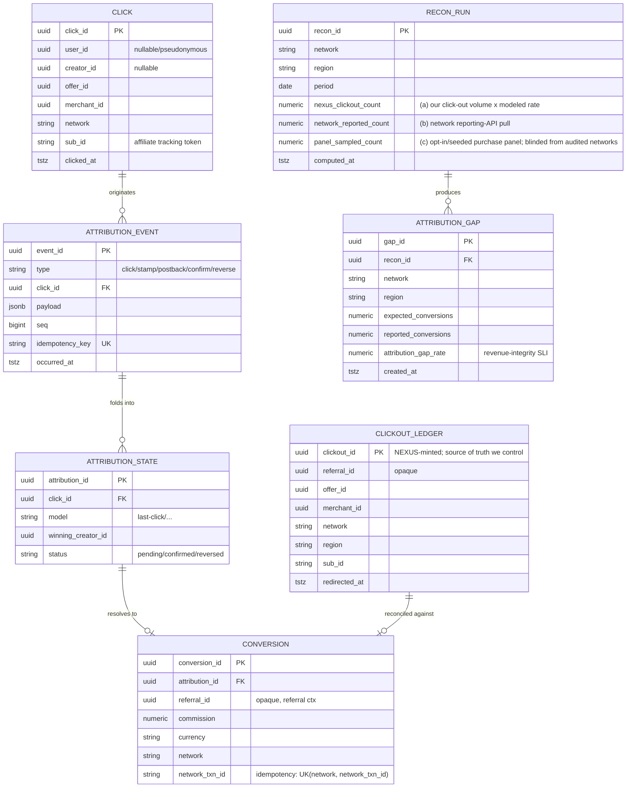

Attribution is **deterministic and event-sourced** ([04 §5.4](04-system-architecture.md#54-attribution--money-event-sourced)): `ATTRIBUTION_STATE` is a left-fold over `ATTRIBUTION_EVENT`. A confirmed `CONVERSION` emits a **single `conversion.confirmed` event** that each affected sub-ledger (creator/affiliate commission, cashback) **consumes independently and idempotently** ([ADR-0022](adr/ADR-0022-round2-remediation.md), dedup on event id, §3.6) — there is no synchronous cross-sub-ledger atomic write; the two event streams meet only in the ledger.

> **Reconciliation store ([ADR-0011](adr/ADR-0011-attribution-reconciliation.md)).** Because 100% of revenue rides async, network-controlled, reversible postbacks NEXUS never independently observes, NEXUS **owns a click-out ledger** (`CLICKOUT_LEDGER`): every `handoff.redirected` is logged with a **NEXUS-minted `clickout_id`** — a source of truth we control, independent of any network. A **three-way reconciliation** job (`RECON_RUN`) compares, per network/region/period, (a) NEXUS click-out volume × modeled conversion rate, (b) the network's reporting-API pull, and (c) a sampled real-purchase panel, and writes an **`attribution_gap_rate`** per network/region (`ATTRIBUTION_GAP`) as a first-class revenue-integrity SLI into the FinOps/anomaly infra — making silent under-reporting measurable and alertable (fixes R-001) and the VMS falsifiable (R-021). The real-purchase panel (c) is **blinded from the audited networks** ([ADR-0022](adr/ADR-0022-round2-remediation.md)): panel identities/purchases are **not distinguishable to a network**, so a network cannot report panel traffic correctly while under-reporting the rest; the panel is **rotated and population-diversified on a schedule** so a resourced counterparty cannot behaviorally fingerprint members and selectively fully-report their traffic (defeat-device resistance, H-6). The per-connector attribution mechanism (real-time pixel vs. batch file vs. API pull — e.g. Amazon is batch) is modeled explicitly so reconciliation cadence adapts per connector (fixes R-033).

### 3.8 Referral / Attributed-Conversion (saga state)

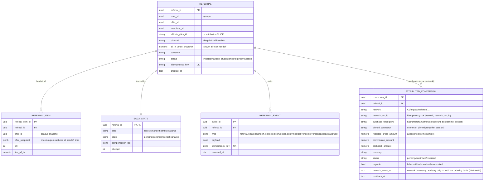

There is **no order, checkout, payment, or fulfillment record here** — NEXUS never takes custody (ADR-0006). `REFERRAL_ITEM.offer_snapshot` **freezes** the all-in price/coupon/cashback shown at the handoff gate — this is the receipt that backs the VMS "you saved $X" claim ([01 §4](01-vision.md#4-north-star-metric--guardrails), NFR-COMP-01). `ATTRIBUTED_CONVERSION` is populated **later, from the affiliate network's postback** (async — minutes to days), carries only the network-reported gross/commission/cashback amounts, and can move to `reversed` on returns/cancellations. `REFERRAL_EVENT` types match [04 §5.4](04-system-architecture.md#54-attribution--money-event-sourced) exactly.

> **Postback-integrity state machine ([ADR-0012](adr/ADR-0012-postback-integrity.md)).** `ATTRIBUTED_CONVERSION` is **provisional by construction**: a postback creates a `pending`, **non-payable** row (`payable = false`) until *independently* corroborated by the reconciliation pull ([ADR-0011](adr/ADR-0011-attribution-reconciliation.md)) and/or a settlement-file match — so a forged or weakly-authenticated postback can **never become a payable liability** (fixes R-003; the "signature-verified" MUST is replaced by a per-connector auth table in the Affiliate Gateway). The `pending → confirmed → reversed` transition is **idempotent on `(network, network_txn_id)`** and **order-independent**: confirm/reverse are ordered by **NEXUS's own monotonic receipt sequence plus a signed reconciliation decision** ([ADR-0022](adr/ADR-0022-round2-remediation.md)), **never** by the network-supplied `network_event_at` (which is attacker-suppliable). A **raw postback cannot un-reverse a reversal**; a reversal is authoritative **only when corroborated by reconciliation** ([ADR-0011](adr/ADR-0011-attribution-reconciliation.md)). Duplicate and out-of-order confirm/reverse postbacks therefore still converge correctly (fixes R-085); reversals post compensating ledger entries. At ingest a probabilistic **`purchase_fingerprint`** is computed with **overlapping/jittered amount+time buckets cross-checked against per-user velocity + connector-pair collusion signals** (so a colluding connector pair cannot perturb one order across static bucket edges to double-claim, H-7); a fingerprint match within the longest cookie window routes to a **hold/adjudication queue** rather than auto-credit, and **one connector is pinned per `(offer, session)`** for the attribution window so mid-session failover cannot re-stamp a second network (fixes R-002). A confirmed conversion's accrual lands in the wallet's `held_cash` (§3.5) and becomes payable only after the hold window. Referral/attribution partitions are retained **at least the longest network return/reversal window** (§10.2, §12.3) so a late reversal always finds its accrual (fixes R-084).

### 3.9 Creator

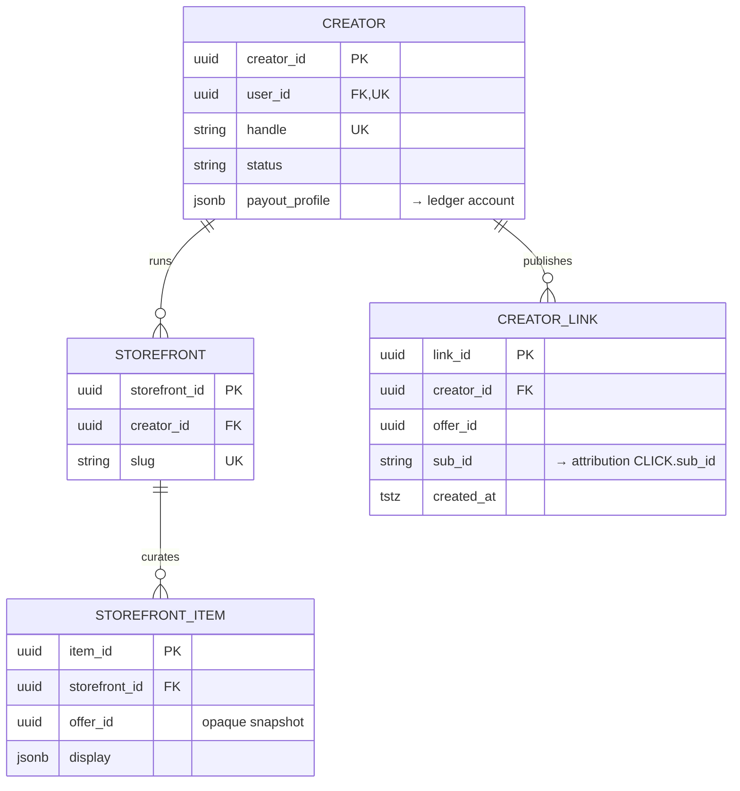

`CREATOR_LINK.sub_id` is the join key into the attribution stream (§3.7) — a creator's earnings are just confirmed conversions attributed to their `sub_id`, posted to their ledger account.

### 3.10 Watchlist & Alerts (auto-buy is P5+)

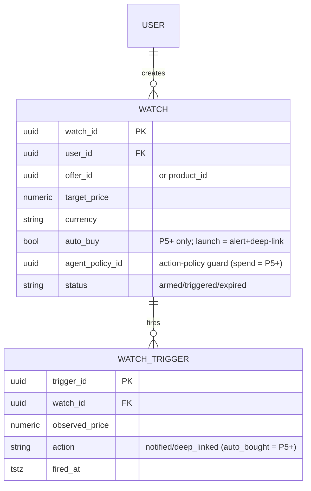

Active watches are mirrored into a **Redis sorted set keyed by offer** (`watch:offer:{offer_id}` scored by `target_price`); when a `price.updated` event arrives, a range query finds all watches to fire in O(log N) — this is what makes price-drop alert/deep-link react at event speed ([SDD §4.3](02-software-design-document.md#43-price-drop-watch--alert--deep-link)) without scanning Postgres.

---

## 4. Canonical Offer schema & license tags

### Decision

> **Decision:** There is **one canonical Offer schema**, produced by the Normalizer ([04 §5.2](04-system-architecture.md#52-event-driven-feed-ingestion-the-legitimacy-boundary)) and identical across Postgres (SoR), the `offer.upserted` Kafka event, the OpenSearch document, and the ClickHouse price row. Every offer **MUST** carry a **license tag** describing permitted use; downstream services **MUST** consult it before caching, displaying, or redistributing any field.

Canonical Offer (logical):

```jsonc
{
  "offer_id": "uuid",                 // stable, deterministic from (source, merchant_sku)
  "product_id": "uuid",               // resolved by product-matching
  "merchant_id": "uuid",
  "source_id": "uuid",                // which adapter/partner produced this
  "merchant_sku": "string",
  "title": "string",
  "price": { "amount": "numeric", "currency": "ISO-4217" },
  "shipping_est": { "amount": "numeric", "currency": "ISO-4217" },
  "tax_est": { "amount": "numeric", "currency": "ISO-4217" },
  "all_in_price": { "amount": "numeric", "currency": "ISO-4217" }, // normalized item+ship+tax
  "availability": "in_stock|out|preorder|unknown",
  "url": "string (affiliate-wrapped)",
  "media_refs": ["object-store keys"],
  "freshness": {
    "tier": "hot|warm|live",          // three-tier model, SDD §8
    "price_observed_at": "tstz",
    "feed_synced_at": "tstz"
  },
  "license_tag": {                     // ── the legitimacy contract, 04 §5.2 ──
    "source": "partner id",
    "acquired_via": "api|licensed_feed|affiliate_network",
    "may_cache_price": true,
    "cache_ttl_max_s": 3600,           // partner-imposed cap; feeds Redis TTL (§7)
    "may_display_price": true,
    "may_display_review_text": false,
    "may_redistribute_image": true,
    "attribution_required": true,
    "geo_restrictions": ["US","EU"],   // ties to residency, §11
    "expires_at": "tstz"               // license/contract expiry
  }
}
```

**Rules (RFC-2119):**
- An offer whose `license_tag` is missing or expired **MUST NOT** be indexed, cached, or served. The validator ([04 §5.2](04-system-architecture.md#52-event-driven-feed-ingestion-the-legitimacy-boundary)) drops it. License-tag coverage MUST be 100% (fitness function, [04 §10](04-system-architecture.md#10-fitness-functions-how-we-keep-it-healthy)).
- `cache_ttl_max_s` is the **ceiling** on any Redis TTL for that offer's price (§7) — NEXUS caches for `min(tier_ttl, cache_ttl_max_s)`.
- Fields flagged `may_display_* = false` (e.g., review text under a restrictive feed license) **MUST** be stored only if `may_cache = true` and **MUST NOT** be rendered.
- **Money fields** (`price`/`shipping_est`/`tax_est`/`all_in_price`) use the **canonical money type — an integer count of ISO-4217 minor units + `currency`** ([ADR-0020](adr/ADR-0020-performance-consistency-hardening.md)), code-generated identically into all runtimes and the OpenAPI/GraphQL/protobuf contracts (the `numeric` shown above is illustrative). Cross-currency comparison happens **only** via the explicit FX-normalization ranking step, never by implicit float math.

**Trade-offs:** fat per-offer metadata (~+30% row width) vs. auditable legitimacy. Accepted — legitimacy is a Prime Directive. **Risk:** partner changes TOS → license tags go stale; mitigated by `expires_at` + adapter re-tag on every sync. **Scalability:** license fields are small scalars, cheap to index. **Implementation:** license schema is a shared protobuf/JSON-schema owned by the Ingestion service; deterministic `offer_id` makes upserts idempotent.

---

## 5. Price time-series (ClickHouse)

### Options

| Option | Verdict |
|--------|---------|
| Keep full price history in Postgres | ❌ 500M offers × frequent observations = billions of rows/day; kills OLTP. |
| Store history in ClickHouse | ✅ **Chosen** per [SDD §6](02-software-design-document.md#6-technology-stack--decisions-with-alternatives); columnar, compresses time-series ~10×, sub-second range aggregations. |
| TimescaleDB (Postgres ext.) | ⚠️ Simpler ops but shares the OLTP cluster's ceiling; revisit only if analytics volume stays small (it won't). |

### Decision

> **Decision:** ClickHouse is the **SoR for price observations**. Postgres keeps only the *current* price on the offer row (§3.2). The drop-prediction feature pipeline reads from ClickHouse.

Schema:

```sql
CREATE TABLE price_observations (
    offer_id      UUID,
    product_id    UUID,
    merchant_id   UUID,
    all_in_price  Decimal(20,4),
    base_price    Decimal(20,4),
    shipping_est  Decimal(20,4),
    currency      LowCardinality(FixedString(3)),
    availability  LowCardinality(String),
    source_id     UUID,
    freshness_tier LowCardinality(String),   -- hot/warm/live
    observed_at   DateTime64(3, 'UTC')
)
ENGINE = MergeTree
PARTITION BY toYYYYMM(observed_at)
ORDER BY (product_id, offer_id, observed_at)
TTL observed_at + INTERVAL 24 MONTH DELETE,               -- raw retention
    observed_at + INTERVAL 3 MONTH  TO VOLUME 'cold';     -- tiered storage
```

> **Money type here is illustrative.** The `Decimal(20,4)` columns above live in the
> ClickHouse **analytics / price-observation** store (OLAP price history) — *not* the
> transactional money-of-record. The canonical physical money type across the platform
> is **integer minor-units + ISO currency** (§4 Offer, NFR-CONS-01 /
> [ADR-0020](adr/ADR-0020-performance-consistency-hardening.md)); the wallet and ledger
> money-of-record use that, never `Decimal`.

**Retention & rollups:**
- **Raw** observations: 24 months, tiered to object-store-backed cold volume after 3 months.
- **Daily rollup** (`price_daily` via `AggregatingMergeTree` / materialized view): min/max/avg/close per offer per day — retained **5 years** for long-horizon drop prediction and price-claim audit (NFR-COMP-01).

**Drop-prediction feature source:** the Recommendations/Price-Intelligence models ([04 §4](04-system-architecture.md#4-component-responsibilities)) read features from `price_daily` (volatility, trailing min, days-since-low, seasonality) + live signal from Redis hot price. ClickHouse is read-only for models; feature vectors are written to the Redis/ClickHouse feature store.

**Trade-offs:** eventual consistency between hot price (Redis) and history (ClickHouse) — acceptable, history is analytical not transactional. **Risk:** double-counting on Kafka redelivery → ClickHouse dedup via `ReplacingMergeTree` variant keyed on `(offer_id, observed_at, source_id)` where exactness matters. **Scalability:** partition-by-month + sharding by `cityHash64(product_id)` across a ClickHouse cluster. **Implementation:** `offer.upserted`/`price.updated` Kafka consumer bulk-inserts in batches of ~10k rows.

---

## 6. Search index (OpenSearch)

### Decision

> **Decision:** OpenSearch is a **pure derived read model** ([04 §5.1](04-system-architecture.md#5-data-flow-patterns)) supporting **hybrid lexical + vector** retrieval, rebuildable from the Catalog SoR + `offer.upserted` events. It holds **no authoritative fact** and MUST be reconstructable within the rebuild RPO (§13).

**Index granularity:** one document **per product** with **nested offers** (not per-offer), so a search returns a product once with its best/available offers — this matches the neutral, product-first result surface ([SDD §4.1](02-software-design-document.md#41-find-the-best-all-in-price-core-loop)) and avoids 500M top-level docs.

Document shape:

```jsonc
{
  "product_id": "uuid",
  "title": "text (lexical, analyzed)",
  "title_suggest": "completion",
  "brand": "keyword",
  "category_path": "keyword (hierarchical)",
  "attributes": { "...": "keyword/numeric facets" },
  "embedding": [ /* 1024-dim float, knn_vector, cosine */ ],
  "best_all_in_price": "scaled_float",        // for sort/filter, refreshed on price events
  "offer_count": "integer",
  "available": "boolean",
  "offers": [                                  // nested
    { "offer_id":"uuid","merchant_id":"uuid","all_in_price":"scaled_float",
      "availability":"keyword","license_display":"boolean","geo":["keyword"] }
  ],
  "buyer_value_signals": { "reliability":"float","delivery_days":"integer","savings":"float" },
  "license_indexable": "boolean"               // false ⇒ excluded from results
}
```

**Hybrid retrieval:** a query runs **BM25** (lexical) and **kNN/HNSW** (semantic on `embedding`) in parallel and fuses with **normalized score combination / RRF**; the **Ranking** component then re-scores using only `buyer_value_signals` — never monetization (the neutrality wall, [04 §5.3](04-system-architecture.md#5-data-flow-patterns)). Sponsored slots are injected *after* ranking by the separate Placement service and are labeled — OpenSearch never encodes sponsorship.

**Sharding & scale (NFR-SCAL-01/02):**
- Shard target ~**30–50 GB/primary shard**; number of primaries sized to corpus (hundreds of shards across the fleet), **1 replica** minimum for HA and read QPS.
- **Routing** by `category_path` top level to keep facet queries shard-local where possible.
- kNN uses HNSW with per-shard graphs; heavy vector queries served by memory-optimized nodes; separate **hot (search) vs. warm (rebuild/reindex)** node pools.
- Redis fronts the index for the top query corridor to hit NFR-PERF-01 (§7).
- **Write-amplification control ([ADR-0020](adr/ADR-0020-performance-consistency-hardening.md), R-083):** the highest-fan-in products (hundreds of nested offers) use a **parent-offer / child-price** split — a price tick updates a small child-price document rather than re-indexing the whole nested parent — plus update-throttling/coalescing on rapid price ticks, so a viral product does not re-index its entire nested document on every observation.

**Trade-offs:** nested offers make partial offer updates a document update (mitigated by `_update` on the nested path, and price kept coarse — exact price is a live check at intent, Tier 3). **Risk:** reindex storms on mapping change → blue/green alias reindex. **Assumption:** 1024-dim embeddings from the AI layer ([05](05-ai-architecture.md)). **Implementation:** index behind a **read alias** + **write alias**; rebuild into a new index, then flip the alias atomically (§14).

### 6.1 The documented trigger point — single cluster → OpenSearch cells

This is the search-tier analogue of the Postgres→distributed-SQL trigger (§10.4), specified to the **same rigor** so the 100M scale ceiling is designed, not merely named. The [scalability simulation](review/02-scalability-simulation.md#6-first-bottleneck-at-each-scale--the-crossing-move) identifies **OpenSearch coordinator scatter-gather over a 180+-shard single cluster** as the *first* bottleneck at 100M MAU (peak ~9,650 QPS, NFR-PERF-01 conditional), with **cellularization** named as the crossing move. Below defines what a cell is, how queries route, and the **measured trigger** that fires the split.

> **Decision:** OpenSearch **stays a single (per-region) cluster with category-routed shards** (§6) until a **measured** ceiling is hit, then splits into **cells — each cell an independent OpenSearch cluster** owning a disjoint slice of the corpus keyed by a **stable partition key**, fronted by a thin **routing / scatter-gather layer** that queries only the relevant cell(s) and fuses their results. Because the index is a **pure derived read model** (§6, no authoritative fact), a cell is **rebuildable from the Catalog SoR + `offer.upserted` Kafka log** — so cellularization is a **reindex-into-new-cells + alias flip** (§14), never a stateful data migration like §10.4.

**Cell partition key.** The key **MUST** be stable (a document never hops cells on a price tick) and align with the dominant query filter so most queries stay **single-cell**:
- **Primary key — `category_path` top level.** Routing is already by `category_path` (§6), so a category-scoped query (the common case) hits **one cell**; only cross-category queries fan out to a bounded set. This keeps scatter-gather width ≈ 1 for most traffic.
- **Secondary axis — region**, where a residency zone's corpus + QPS alone justifies a dedicated cell (composes with the write-home/read-local topology, §11).

**Trigger — split into cells when ANY of the following is sustained for ≥ 4 weeks (not a spike):**

| Metric | Threshold (trigger) |
|---|---|
| **Coordinator scatter-gather latency** | Single-cluster **p99 fan-out > 300 ms** (eating the NFR-PERF-01 400 ms budget before Redis/BFF overhead), after hot/warm pool separation + shard right-sizing |
| **Primary shard count** | **> ~150 primary shards** on one cluster (coordinator fan-out + cluster-state/master pressure grows super-linearly past this) |
| **Hot index size** | A single index's **primary (pre-replica) size > ~8 TB**, or total managed data **> ~10 TB** ([sim §5.2](review/02-scalability-simulation.md#52-storage--database-growth) puts OpenSearch at ~10 TB at 100M) |
| **kNN / vector memory** | HNSW graphs no longer fit the memory-optimized hot pool → per-shard graph paging pushes vector-query p99 past budget |
| **Reindex / recovery window** | Full blue/green reindex or a lost-node shard recovery **exceeds the maintenance/RPO budget** ([§13](#13-backup--dr) rebuild RPO) on the single cluster |

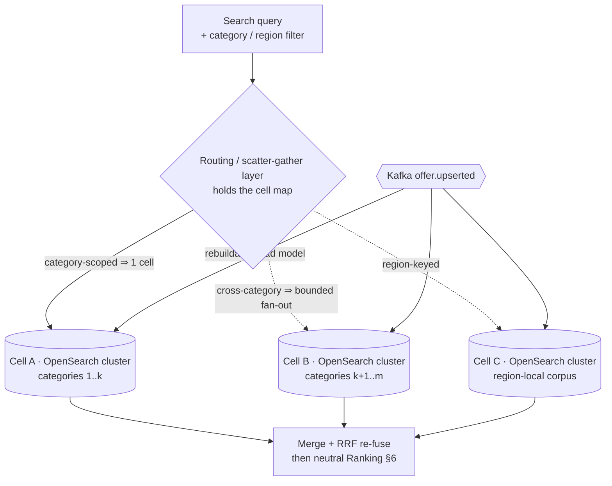

**Routing layer.** A small, stateless service (or gateway plugin) holds the **cell map** (`partition key → cell`), sends each sub-query only to the cell(s) whose slice can match, and **merges** partial results with the same **normalized-score / RRF fusion** used intra-cluster (§6) before the neutral Ranking pass — so cellularization is invisible to callers and **does not touch the neutrality wall** ([04 §5.3](04-system-architecture.md#53-neutrality-enforcement)). The cell map is versioned config, canaried like any routing change ([10 §4](10-deployment-architecture.md#4-release-strategy--progressive-delivery)).

**Options at the trigger:**

| Option | Pros | Cons | When |
|---|---|---|---|
| Keep scaling one cluster (more shards/nodes) | No routing layer | Coordinator fan-out + cluster-state pressure grow super-linearly; blast radius = whole search tier | ❌ avoided past the trigger |
| **Cellularize — cell = independent cluster by category/region** | Bounded fan-out, isolated blast radius, per-cell scale/upgrade, rebuildable from Kafka | Routing layer + cross-cell merge for cross-category queries | ✅ when trigger fires |
| Managed Elastic / third-party search SaaS | Ops offload | Cost + partial re-platform; portability caveat ([09 §5](09-cloud-architecture.md#5-managed-data-services-mapping)) | Only if ops load outweighs self-managed cells |

**Trade-offs:** cross-category queries fan out to > 1 cell and pay a merge — bounded because the category-keyed layout keeps the common case single-cell; a global "search everything" query is the worst case and is de-prioritized/cached. **Risk:** a cell becomes hot (a viral category) → a cell can itself be re-split on the same trigger, and hot keys use the §6 write-amplification controls. **Assumption:** query mix stays category-filterable for the majority of traffic (true for the product-first surface, [SDD §4.1](02-software-design-document.md#41-find-the-best-all-in-price-core-loop)). **Scalability:** each cell scales, upgrades, and fails **independently** — one cell's reindex or outage is one slice, not the platform ([ADR-0017](adr/ADR-0017-blast-radius-isolation.md) blast-radius intent). **Implementation:** routing layer reads the versioned cell map; split executed as **reindex-into-new-cell + atomic alias flip** (§14) off the Kafka log; trigger metrics wired into the §7 [capacity dashboards](09-cloud-architecture.md#11-observability-infrastructure) and reviewed at the R-CLD-01 build-vs-buy milestone.

---

## 7. Caching (Redis)

### Decision

> **Decision:** Redis is the **Tier-1 hot store** of the three-tier freshness model ([SDD §8](02-software-design-document.md#8-data-freshness-strategy-a-defining-design-decision)) and the low-latency path for NFR-PERF-01. It is **never a system of record**; every key is reconstructable and every TTL is **capped by the offer's `license_tag.cache_ttl_max_s`** (§4).

> **Cluster isolation (MUST, [ADR-0017](adr/ADR-0017-blast-radius-isolation.md)):** money/auth Redis (`sess:*`, `idem:*`, rate-limit, `watch:offer:*` triggers) runs on a **separate Redis cluster** from the high-churn catalog-invalidation cache (`price:offer:*`, `search:*`, `product:*`). A catalog-cache stampede or mass-invalidation storm therefore **cannot evict session/auth/rate-limit state** (fixes R-082); the two clusters scale and fail independently.

### Key patterns & TTLs per freshness tier

| Purpose | Key pattern | Value | TTL (tier) | Notes |
|---|---|---|---|---|
| **Hot price (Tier 1)** | `price:offer:{offer_id}` | all-in price + currency + observed_at | `min(30–120 s, cache_ttl_max_s)` | Refreshed by `price.updated`; "seconds-fresh" per SDD §8. |
| **Search result cache** | `search:{query_hash}:{geo}:{page}` | ranked product ids + facets | 60–300 s | Serves the cached corridor for NFR-PERF-01. |
| **Product detail** | `product:{product_id}` | denormalized card + best offers | 300 s (warm) | Rebuilt from OpenSearch/Catalog. |
| **Verified coupon** | `coupon:merchant:{merchant_id}` | list of active verified coupons | until `valid_to` (≤ 6 h) | Invalidated on `coupon.verified/revoked`. |
| **Cashback rate** | `cashback:rate:{merchant_id}:{category}` | current rate_pct | 15 min | |
| **Watch trigger index** | `watch:offer:{offer_id}` (ZSET) | member=watch_id, score=target_price | no TTL (durable mirror) | Range query on price event → fire (§3.10). |
| **Session/token** | `sess:{token}` | session claims | = token exp | Identity ctx. |
| **Idempotency guard** | `idem:{scope}:{key}` | result ref | 24 h | Dedupe at API edge (§8). |
| **Live-check result (Tier 3)** | `live:offer:{offer_id}` | authoritative live price | ≤ 60 s | Written after an on-demand merchant call at buy intent; also warms Tier 1. |

### Freshness-tier mapping

- **Tier 1 (hot):** `price:offer:*`, `search:*` — served directly, seconds-fresh.
- **Tier 2 (warm):** `product:*`, `coupon:*`, `cashback:*` — minutes-fresh, refreshed by feed-sync events.
- **Tier 3 (live):** `live:offer:*` — populated only on genuine buy intent, then feeds back into Tier 1 (matches SDD §8 arrow `L → C`).

### Invalidation on `offer.upserted` / `price.updated`

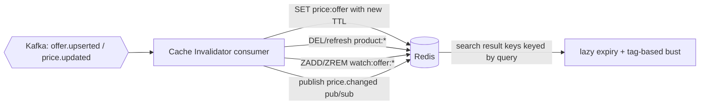

- Price/offer events **update-in-place** the `price:offer:*` key (write-through) and **evict** dependent `product:*` and affected `search:*` keys (tag-based; search keys are grouped by a per-product tag set for targeted busting).
- Watch ZSETs are updated in the same consumer so auto-buy fires within one event hop.
- **Cache stampede** protection: single-flight / probabilistic early recompute on hot keys.

**Trade-offs:** write-through invalidation adds consumer load vs. TTL-only staleness; we combine both. **Risk:** partner `cache_ttl_max_s` shorter than our tier TTL → we always take the min, never violating a license. **Scalability:** Redis Cluster, hash-tag co-location for multi-key ops (`{offer_id}`), replicas for read fan-out. **Implementation:** one Go "cache-projection" consumer group per event topic.

---

## 8. Event store / outbox / CDC

### Decision

> **Decision:** State changes in the Postgres core are published to Kafka via the **transactional outbox pattern** ([04 §7](04-system-architecture.md#7-cross-cutting-concerns)); Kafka is the **event backbone** and, for Ledger and Attribution, the **event-sourced SoR**. Every consumer is **idempotent** via idempotency keys.

### Outbox + CDC flow

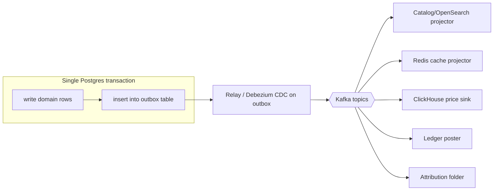

- The domain write and the `outbox` insert commit **atomically** — no dual-write gap. A CDC relay (Debezium reading the WAL, or a poller) ships outbox rows to Kafka and marks them sent. This guarantees **at-least-once** publication; consumers dedupe to reach **effectively-once**.

### Core Kafka topics (keyed for ordering)

| Topic | Key | Producers | Consumers |
|---|---|---|---|
| `offer.upserted` | `product_id` | Feed Ingestion | Catalog, OpenSearch, ClickHouse, Redis |
| `price.updated` | `offer_id` | Price Intelligence | Redis, ClickHouse, Watchlist |
| `referral.events` (`referral.initiated`/`handoff.redirected`/`conversion.confirmed`/`conversion.reversed`/`cashback.accrued`) | `referral_id` | Referral & Handoff | Attribution, Ledger, Notifications |
| `attribution.events` (`stamp`/`postback`/`confirm`/`reverse`) | `click_id` | Affiliate | Attribution folder, Ledger |
| `ledger.events` | `account_id` | Cashback/Rewards/Attribution | Ledger poster, ClickHouse reporting |
| `coupon.events` (`verified`/`revoked`) | `merchant_id` | Coupon | Redis, Search |

**Partitioning** follows [04 §8](04-system-architecture.md#8-scalability-strategy): keyed by `merchant`/`category`/entity id so all events for one entity are **ordered within a partition**.

### Event sourcing (ledger + attribution) & idempotency

- **Ledger** and **Attribution** are rebuilt by replaying their event streams from `seq=0` (§3.6, §3.7) — the Postgres tables are **projections**, the Kafka log is the durable truth. This is exactly [04 §5.4](04-system-architecture.md#54-attribution--money-event-sourced).
- **Idempotency keys:** every mutating command and event carries a stable `idempotency_key`. Consumers keep a processed-key set (Postgres unique index on `idempotency_key`, or Redis `idem:*` at the edge). Re-delivery is a no-op. Keys are **deterministic** (e.g., `sha256(source_event_id)` for ledger postings) so retries across services converge.
- **Effectively-once posting** to the ledger = at-least-once delivery + unique `idempotency_key` constraint that turns duplicate deliveries into ignored inserts (idempotent).

**Trade-offs:** outbox adds a table + relay vs. dual-write bugs; strongly worth it for money paths. **Risk:** consumer lag / poison messages → DLQ + lag alerts (backpressure, [04 §7](04-system-architecture.md#7-cross-cutting-concerns)). **Assumption:** managed Kafka (MSK/Confluent). **Scalability:** partitions scale with entity cardinality. **Implementation:** shared outbox library; schema registry for event contracts.

---

## 9. Consistency model

### Decision

> **Decision:** NEXUS uses **strong consistency for money and identity**, and **eventual consistency for discovery and derived read models**. Multi-step referral→attribution is a **saga** with compensations; CQRS read projections converge via the event log with explicit staleness bounds. The attributed-conversion projection is **eventual by construction** — it is fed by async affiliate postbacks — while the ledger and identity it ultimately affects stay strongly consistent. A conversion that accrues to multiple money domains fans out via **one `conversion.confirmed` event** that each sub-ledger consumes independently and idempotently ([ADR-0022](adr/ADR-0022-round2-remediation.md)) — there is **no synchronous multi-sub-ledger atomic write**; each domain's posting is strong *within* its sub-ledger, cross-domain accrual is **eventual per domain**, and the GL reconciles.

### Strong vs. eventual — where each applies

| Data | Consistency | Why |
|---|---|---|
| Per-context sub-ledger entries ([ADR-0013](adr/ADR-0013-ledger-per-context.md)), wallet `available`/`held` balances ([ADR-0014](adr/ADR-0014-wallet-hold-gate.md)), referral saga state, identity, agent action/handoff authorization, coupon validity at apply-time | **Strong** (Postgres, serializable where needed) | Money and authorization correctness; double-entry invariants scoped per sub-ledger (§3.6). |
| Cashback accrual **posting** | Strong at posting (idempotent) | Money-adjacent. |
| Consolidated **GL / financial reporting** ([ADR-0013](adr/ADR-0013-ledger-per-context.md)) | **Eventual** (async reconciliation) | Aggregated from sub-ledgers for reporting only, never for per-domain authorization. |
| Search index, recommendations, hot price, product cards, price history | **Eventual** | Derived read models; freshness bounded by tiers (SDD §8). |
| Attribution state | **Eventual but deterministic** | Folded from an ordered event stream; converges. |
| Attributed-conversion / postback state ([ADR-0012](adr/ADR-0012-postback-integrity.md)) | **Eventual but convergent** | Async network postbacks; idempotent on `(network, txn_id)`, ordered by **NEXUS receipt-sequence + signed reconciliation decision** (not the network timestamp, [ADR-0022](adr/ADR-0022-round2-remediation.md)); a reversal is authoritative only when reconciliation-corroborated, and a raw postback cannot un-reverse it, so duplicate/out-of-order postbacks converge; **non-payable** until reconciled ([ADR-0011](adr/ADR-0011-attribution-reconciliation.md)). |

### Saga for referral → attribution

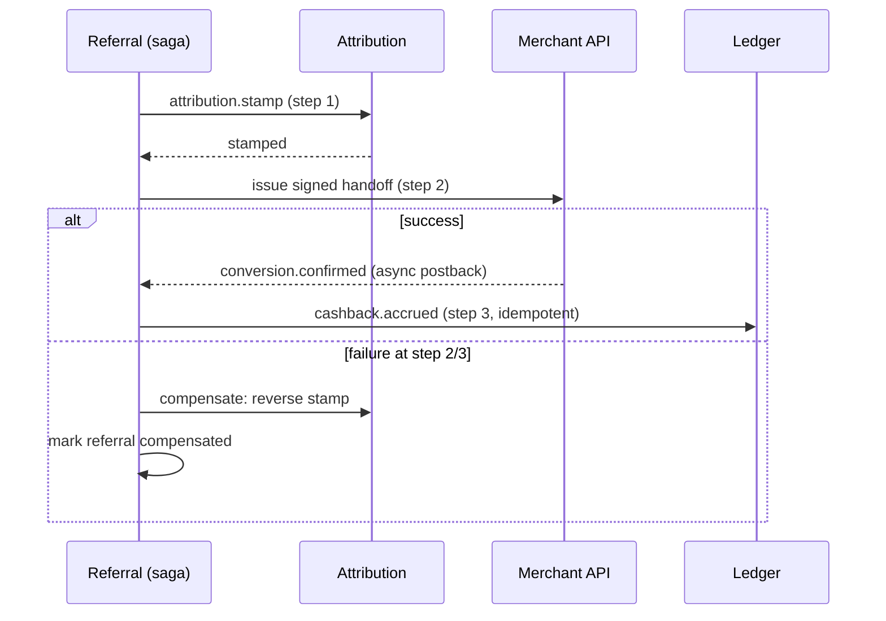

> **Asynchronous & eventual by nature.** Unlike an in-band checkout, the conversion signal arrives via the affiliate network's **postback minutes to days after handoff** — the saga has **no synchronous "order confirmed" moment**. It MUST therefore tolerate **long gaps** between handoff and conversion, **duplicate and out-of-order postbacks**, and **reversals** (returns/cancellations flip a confirmed conversion back to `reversed`). Cashback accrual is not final on confirmation: it carries a **hold/clawback window** so a later reversal claws back the accrual (posted as a reversing ledger transaction, §3.6) rather than corrupting a settled balance.

The saga state (§3.8) is durable in Postgres; each step is idempotent and has a compensating action ([04 §7](04-system-architecture.md#7-cross-cutting-concerns)). No distributed 2PC — the saga trades atomicity for availability with explicit compensation.

### How CQRS read projections stay consistent

- Writes go to the SoR; the **outbox → Kafka → projector** pipeline (§8) updates OpenSearch/Redis/ClickHouse. Projections are **eventually consistent** with a **bounded lag SLO** (target p99 projection lag **< 5 s** for `price.updated`, **< 30 s** for full offer re-index).
- **Read-your-writes** where users expect it (e.g., a user's own watch/wallet) is served from the SoR or a session-pinned cache, **not** the lagging projection.
- **Reconciliation jobs** compare SoR row counts/checksums against projections hourly; divergence triggers a targeted rebuild.

**Trade-offs / risks / assumptions:** eventual consistency can briefly show a stale price — mitigated by the Tier-3 live check at buy intent (SDD §8) so the *purchased* price is always authoritative (NFR-COMP-01). **Scalability:** read scaling is decoupled from writes (the point of CQRS). **Implementation:** projection-lag metric per topic; SLO alerts.

---

## 10. Scaling: partitioning, sharding & the distributed-SQL trigger

### 10.1 Offers — partitioning/sharding

> **Decision:** The `catalog.offer` table (largest, NFR-SCAL-02: 500M+) is **declaratively partitioned in Postgres by a composite key — not raw `HASH(product_id)`** ([ADR-0020](adr/ADR-0020-performance-consistency-hardening.md)), e.g. `HASH(product_id, merchant_id)` across ~64 partitions, so a **viral single product cannot concentrate all its writes on one partition** (fixes R-080). For a hot key under a demand spike, writes are **key-salted** and reads **fan out across read replicas**; the salt is transparent to callers and collapsed at query time. Search/analytics load is already **offloaded** to OpenSearch/ClickHouse, so Postgres holds the OLTP working set only.

### 10.2 Referrals — partitioning

> **Decision:** `referral.referral` and its conversion/`referral_event` rows are **range-partitioned by `created_at` (monthly)** for time-bounded queries and cheap archival of closed months; sub-partition or index by `user_id` for user history reads. Async postbacks may land in a **later** month than the referral row, so conversion lookups join by `referral_id` rather than assuming same-partition co-location. **Archival cadence respects reversal windows** ([ADR-0012](adr/ADR-0012-postback-integrity.md), [ADR-0020](adr/ADR-0020-performance-consistency-hardening.md), fixes R-084): a partition is **retained at least the longest network return/reversal window** before archival, so a late reversal always finds its accrual to reverse.

### 10.3 Read replicas

- Each Postgres SoR runs **1 primary + ≥2 read replicas** per region. Reads that tolerate replica lag (history, analytics-ish OLTP) go to replicas; money/identity reads that need read-your-writes go to the primary or a session-pinned replica.

### 10.4 The documented trigger point — partitioned Postgres → distributed SQL

This resolves the open question in [SDD §10](02-software-design-document.md#10-open-design-questions-tracked-in-project_memory) and [04 §8](04-system-architecture.md#8-scalability-strategy).

> **Decision:** NEXUS **stays on partitioned single-primary Postgres + read replicas** until a **measured** ceiling is hit, then migrates the OLTP write path to **distributed SQL (CockroachDB or YugabyteDB)** — Postgres-wire-compatible to minimize app rewrite.

**Trigger — migrate when ANY of the following is sustained for ≥ 4 weeks (not a spike):**

| Metric | Threshold (trigger) |
|---|---|
| Primary **write throughput** on the busiest SoR (ledger/referral) | **> 60% of primary write IOPS/CPU** at p95, after partitioning + vertical scaling to the largest practical instance |
| **Single-primary vertical headroom** | Largest available managed instance reached **and** write CPU p95 **> 70%** |
| **Cross-region write latency** need | A second region requires **local writes** (not write-home) for a money/identity path → single-primary topology becomes the bottleneck |
| **Replication lag** under write load | Read-replica lag p95 **> 10 s** persistently, breaking read-your-writes SLAs |
| **Storage/partition count** | A single partitioned table **> ~2 TB** hot working set or partition maintenance windows exceed the maintenance budget |

**Options at the trigger:**

| Option | Pros | Cons | When |
|---|---|---|---|
| Stay + shard app-side (Postgres) | No new engine | App-level sharding complexity, cross-shard txn pain | ❌ avoided — reinvents distributed SQL |
| **CockroachDB / YugabyteDB** | Horizontal writes, multi-region native, PG-wire | New ops model, serializable-txn cost | ✅ when trigger fires |
| Move hot path to **ScyllaDB/Cassandra** wide-column | Massive write scale | No cross-row ACID → unfit for ledger | Only for a **non-transactional** hot path (per SDD §6 escape hatch) |

**Wide-column escape hatch:** ScyllaDB/Cassandra ([SDD §6](02-software-design-document.md#6-technology-stack--decisions-with-alternatives)) is reserved for a **specific non-transactional hot path** (e.g., a per-user event feed or a write-heavy click stream) **only if** OpenSearch/Redis/ClickHouse cannot absorb it — it is **never** used for money (no cross-row ACID). Its own trigger: a single derived-read workload sustaining **> 100k writes/s** that Kafka+ClickHouse batching cannot smooth.

**Trade-offs:** distributed SQL adds latency per txn and ops complexity; we defer it precisely because most contexts fit single-primary Postgres for a long time. **Risk:** migrating the ledger is high-stakes → rehearsed with the expand-contract playbook (§14) and dual-run reconciliation. **Assumption:** app uses only PG-wire features available in CRDB/YB. **Implementation:** abstract data access behind repository interfaces now so the swap is mechanical for the triggered context only (not a big-bang migration).

---

## 11. Multi-region data residency & replication (NFR-PRIV-01)

### Decision

> **Decision:** NEXUS is **multi-region with a write-home / read-local** topology. Each user record has a **`residency_region`** (§3.1); their **PII and money data are written only in their home region**. Non-personal, license-permitting catalog/offer data is **replicated read-local** to every region for latency (NFR-PERF-01).

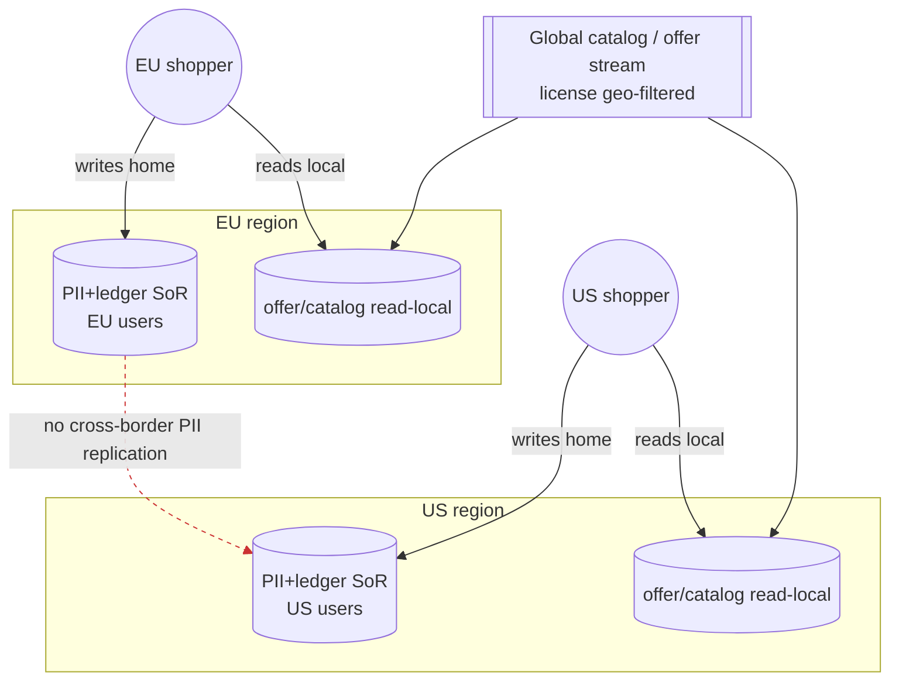

- **Write-home:** identity, wallet, ledger, referrals/attributed conversions, consent → written and stored in the user's home region only (GDPR/CCPA/Bangladesh DPA per [01 §10.1](01-vision.md#101-geographic-rollout--internationalization-adr-0007), NFR-PRIV-01). Cross-region access to a user's PII goes through the home region's API, not by replicating the data.
- **Read-local:** catalog/offer/price/search projections are replicated to each region — but **filtered by `license_tag.geo_restrictions`** (§4), so an offer not licensed for a region is not served there.
- **Region pinning** is by `residency_region`; the API gateway routes money/identity mutations to the home region.
- **Region-before-market gate (MUST, [ADR-0016](adr/ADR-0016-region-residency-lifecycle.md)):** a market's country flag **cannot** be enabled until its compliant region — **including an in-zone DR pair** — is provisioned and residency-tested; network-layer routing is **default-deny** to unlaunched regions. This re-sequences infra **ahead of** the EU/South-Asia (P3/P4) market opens that legally require it (fixes R-013, R-014, R-073); residency is resolved at signup from verified signals with a **strict default** (R-074).
- **In-zone DR pair per regulated region ([ADR-0016](adr/ADR-0016-region-residency-lifecycle.md)):** each residency zone has a **second, AZ-independent in-zone region** so money/PII survive a full-region loss **without cross-residency failover**. The Kafka "RPO≈0" claim (§13) is scoped to **in-zone** replication — cross-residency PII replication stays forbidden.

**Trade-offs:** a traveling EU user hitting the US edge reads offers locally but their handoff/wallet call is routed to EU (slightly higher latency for that call) — correct for compliance. **Risk:** residency misclassification → default to strictest region; residency is set at signup and change-controlled. **Assumption:** residency zones span the **phased** rollout (US P1 → EU P3 → South-Asia P4, [ADR-0007](adr/ADR-0007-phased-global-rollout.md)); each region's data tier (incl. its in-zone DR pair) is **provisioned and residency-tested before that phase's market flags flip** — the region-before-market gate ([ADR-0016](adr/ADR-0016-region-residency-lifecycle.md)). **Scalability:** offer replication rides the existing Kafka stream, geo-filtered per consumer. **Implementation:** per-region Kafka + per-region Postgres/OpenSearch/Redis; a global control-plane topic for catalog, region-scoped topics for PII.

---

## 12. Data governance

### 12.1 PII classification

| Class | Examples | Handling |
|---|---|---|
| **PII-HIGH** | address, payout tokens/references, government-issued ids (if ever collected), precise geo | Envelope-encrypted (per-record DEK), access-logged, residency-pinned, retention-minimized |
| **PII-MED** | email, name, phone | Column-encrypted, access-controlled |
| **PII-LOW / pseudonymous** | `user_id`, behavioral events keyed by pseudonymous id | Minimized, revocable linkage |
| **Non-PII** | catalog, offers, price history | Standard at-rest encryption; freely replicated within license geo |

> **Decision:** NEXUS is **not a card-accepting merchant** — it is a pure referral platform (ADR-0006) and **PCI-DSS card-acceptance scope is none**: **no cardholder data ever enters NEXUS**. Purchases complete on the merchant's own checkout after handoff; NEXUS never sees a PAN. The **only** payment-ish tokens ever stored are **outbound payout** references — for paying cashback and creator earnings **out** via a licensed payment partner (a payout/AML concern, not card acceptance). Those payout tokens are opaque and issued by the partner ([01 §7](01-vision.md#7-non-goals-explicit-scope-discipline), [SDD §6 cross-cutting](02-software-design-document.md#7-cross-cutting-concerns)).

### 12.2 Encryption (NFR-SEC-01)

- **At rest:** AES-256 on every store (Postgres/Redis/OpenSearch/ClickHouse/object store) via managed KMS-backed volume encryption **plus** application-level **envelope encryption** for PII-HIGH columns (per-record DEK wrapped by a KMS CMK). **In transit:** TLS 1.3 mandatory (NFR-SEC-01).
- Keys rotated on a schedule; CMKs per region for residency; erasure of a **per-user DEK** cryptographically shreds that user's records (supports 12.4). Because the DEK is destroyed, a **restored backup cannot resurrect erased PII** — the ciphertext is unreadable even from an older snapshot ([ADR-0016](adr/ADR-0016-region-residency-lifecycle.md), fixes R-076); restore game-days assert this.

### 12.3 Retention

- Behavioral/analytics events: rolled up then raw purged (price raw 24 mo, §5). Session data: token lifetime. Attribution/ledger: retained per **financial-record legal minimum** (append-only, cannot be deleted — see erasure interaction below). PII-HIGH: minimized, retained only as long as the purpose (consent, §3.1) holds.

### 12.4 Right-to-erasure (GDPR)

> **Decision:** Erasure is implemented by **crypto-shredding + pseudonymization**, not by deleting append-only financial/event records.

- On a verified erasure request: PII-HIGH/MED are **crypto-shredded** (destroy the record's DEK) and identity rows tombstoned; the `user_id` is **pseudonymized** in event streams (ledger/attribution keep the pseudonymous id so double-entry and legally-required financial history stay intact and balanced).
- The ledger/attribution **immutability** (§3.6/§3.7) is preserved — we erase the *link to a person*, not the *accounting fact*. This reconciles GDPR erasure with append-only money records.
- **Erasure is an orchestrated cascade across all ~15 bounded contexts** with a **completeness ledger** ([ADR-0016](adr/ADR-0016-region-residency-lifecycle.md), fixes R-015, R-075): each context acknowledges erasure and the saga is not "done" until every context reports complete. Where a user's data reached an **affiliate network**, a network data-deletion/suppression request is issued and tracked, and **post-erasure postbacks for that user are dropped**.

### 12.5 License-usage enforcement

- Every offer/review/media carries a `license_tag` (§4). A shared **policy library** gates cache/display/redistribute at every read path; violations are blocked and alerted. License **expiry** (`expires_at`) auto-purges affected offers from derived stores. 100% license-tag coverage is a fitness function ([04 §10](04-system-architecture.md#10-fitness-functions-how-we-keep-it-healthy)).

**Trade-offs:** crypto-shredding needs disciplined per-record key management (ops cost) but is the only way to honor both erasure and immutable ledgers. **Risk:** key-management errors → tested key lifecycle + backups of CMKs. **Assumption:** legal financial-retention windows per geo. **Implementation:** KMS + per-record DEK table; policy library imported by all read services.

---

## 13. Backup / DR

### Decision

> **Decision:** Every SoR has **PITR** and cross-region backup; targets differ by data criticality.

| Store | RPO | RTO | Mechanism |
|---|---|---|---|
| **Postgres (money/identity SoR)** | **≤ 1 min** (PITR via WAL) | **≤ 30 min** | Continuous WAL archiving + streaming replicas; promote replica on failover; cross-region encrypted snapshots |
| **Kafka (event log / event-sourced SoR)** | **≈0 (in-zone replicated)** | ≤ 15 min | RF≥3, min-ISR≥2, multi-AZ **in-zone** (RPO≈0 scoped to in-zone, not cross-residency — [ADR-0016](adr/ADR-0016-region-residency-lifecycle.md)); tiered storage to object store for long retention |
| **ClickHouse (price ts)** | ≤ 15 min | ≤ 2 h | Replicated MergeTree + object-store backups; **rebuildable** from Kafka if needed |
| **OpenSearch (search)** | Derived (rebuild) | ≤ 4 h to rebuild, minutes to fail over to replica | Snapshots to object store + full rebuild from Catalog SoR + events |
| **Redis (cache)** | Derived (0 durability required) | seconds (warm from SoR) | AOF optional; treated as reconstructable |
| **Object store (media/artifacts)** | ≤ 15 min | ≤ 1 h | Versioning + cross-region replication |

- **Derived stores** (OpenSearch/Redis) have relaxed RPO because they are **rebuildable** from the SoR + Kafka — DR for them is "replay," not "restore."
- **In-zone DR scope ([ADR-0016](adr/ADR-0016-region-residency-lifecycle.md)):** each regulated region fails over to its **in-zone DR pair**, never across a residency boundary; the Kafka RPO≈0 above is an **in-zone** guarantee, and DR RTO/RPO are validated on the **portable Postgres** path (not only managed-Aurora features) via game-days so the portability claim holds (fixes R-036).
- **DR drills:** quarterly region-failover game-day; restore-from-backup and event-replay rehearsed and timed against these targets. Restore drills additionally assert that **crypto-shredded PII does not reappear** after a restore (§12.2, R-076). Ledger restore is reconciled by re-summing entries per sub-ledger (§3.6 invariant).

**Trade-offs / risks:** aggressive RPO on money stores costs more (continuous archiving) — justified. **Assumption:** managed backups (Aurora/RDS PITR, MSK tiered storage). **Implementation:** IaC-defined backup policies; automated restore tests in CI-adjacent pipelines.

---

## 14. Migration strategy

### Decision

> **Decision:** All schema changes are **versioned, reviewed migrations** applied via a migration tool (e.g., **Flyway/Liquibase** for SQL, per-service migration folders), and **every change is zero-downtime via expand-contract** (a.k.a. parallel-change). Destructive DDL is **forbidden** in a single release.

### Expand-contract playbook (RFC-2119)

1. **Expand:** add the new column/table/index **nullable/additive**; deploy code that **writes both** old and new, **reads old**. Backfill in batches (throttled, off-peak). Migrations MUST be backward-compatible with the currently-running app version.
2. **Migrate reads:** deploy code that **reads new**, still writes both; verify parity via reconciliation.
3. **Contract:** once no code path uses the old shape, a later release drops the old column/table. Drops MUST lag the expand by ≥1 full deploy cycle.

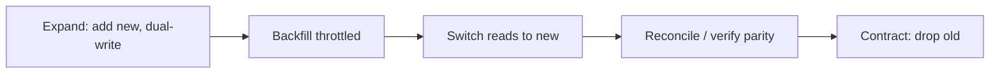

- **Large tables (offer):** use `CREATE INDEX CONCURRENTLY`, batched backfills, and partition-wise operations to avoid long locks on 500M-row tables.
- **OpenSearch mapping changes:** blue/green **reindex into a new index behind an alias**, then atomic alias flip (§6) — never mutate a live mapping in place.
- **ClickHouse:** additive columns are cheap; type changes go through a new table + `INSERT SELECT` + rename.
- **Event schema:** evolved via the **schema registry** with backward/forward compatibility; consumers tolerate unknown fields (§8).
- **The distributed-SQL migration (§10)** uses this same expand-contract discipline plus a **dual-run + reconcile** phase before cutover, scoped to the single triggered context.

**Trade-offs:** dual-write windows add temporary complexity vs. downtime. **Risk:** backfill load on prod → throttled + off-peak + observable. **Assumption:** CI runs migrations against a prod-like snapshot. **Implementation:** migrations live beside each context; a CI gate blocks non-backward-compatible DDL.

---

## 15. Risks, assumptions & trade-offs

| # | Item | Type | Impact | Mitigation / note |
|---|---|---|---|---|
| 1 | Polyglot ops sprawl (4 engine families × regions) | Trade-off | High ops load | Managed services first; per-engine runbooks; SoR-vs-derived clarity |
| 2 | Derived stores drift from SoR | Risk | Wrong search/price shown | Idempotent rebuild from Kafka; hourly reconciliation; bounded projection-lag SLO (§9) |
| 3 | Single-primary Postgres write ceiling | Risk | Money-path scaling wall | Documented trigger → CRDB/YB (§10); repository abstraction now |
| 4 | Ledger correctness under redelivery | Risk | Financial errors | Double-entry constraint + deterministic idempotency keys + event replay (§3.6, §8) |
| 5 | License-tag staleness (partner TOS change) | Risk | Legitimacy breach (Prime Directive) | `expires_at`, re-tag on sync, auto-purge, 100% coverage fitness function |
| 6 | GDPR erasure vs. immutable ledger | Trade-off | Compliance vs. auditability conflict | Crypto-shred PII + pseudonymize id; keep accounting facts (§12.4) |
| 7 | Cross-region PII residency complexity | Trade-off | Higher latency for traveling users' money ops | Write-home/read-local; route money ops to home region (§11) |
| 8 | Stale price shown from eventual read model | Risk | Wrong price claim (NFR-COMP-01) | Tier-3 live check at buy intent makes purchased price authoritative (SDD §8) |
| 9 | Wide-column store misused for money | Risk | Loss of ACID | Escape hatch restricted to non-transactional hot paths; never ledger (§10) |
| 10 | OpenSearch reindex storms on mapping change | Risk | Search availability dip | Blue/green alias reindex; hot/warm node pools (§6, §14) |
| 11 | Kafka consumer lag / poison messages | Risk | Delayed projections, stuck saga | DLQ, lag alerts, backpressure ([04 §7](04-system-architecture.md#7-cross-cutting-concerns)) |
| 12 | Two+ backend languages touching data layer | Assumption | Contract drift | Shared protobuf/JSON-schema for events & offer (§4, §8) |
| 13 | Attribution under-reporting invisible (R-001/R-021) | Risk | Revenue leak / VMS unfalsifiable | NEXUS-owned click-out ledger + 3-way reconciliation + `attribution_gap_rate` SLI (§3.7, [ADR-0011](adr/ADR-0011-attribution-reconciliation.md)) |
| 14 | Forged / duplicate / out-of-order postback (R-002/R-003/R-085) | Risk | False payable liability / double-pay | Provisional non-payable accrual + `purchase_fingerprint` + `(network,txn_id)` idempotency; confirm/reverse ordered by NEXUS receipt-sequence + reconciliation decision, reversal authoritative only when reconciliation-corroborated (§3.8, [ADR-0012](adr/ADR-0012-postback-integrity.md)/[ADR-0022](adr/ADR-0022-round2-remediation.md)) |
| 15 | Global ledger shared-kernel SPOF (R-004/R-034/R-035) | Risk | Cross-domain money corruption | Ledger-per-context sub-ledgers + async GL; per-account seq; at-least-once+dedup outbox (§3.6, [ADR-0013](adr/ADR-0013-ledger-per-context.md)) |
| 16 | Payout races clawback (R-005) | Risk | Unrecoverable cash leak | Wallet `available`/`held` split + payout hold-gate (§3.5, [ADR-0014](adr/ADR-0014-wallet-hold-gate.md)) |
| 17 | Backup restore resurrects erased PII; erasure incomplete (R-015/R-075/R-076) | Risk | Privacy / compliance breach | Per-user DEK crypto-shred + restore assertion; ~15-context erasure cascade (§12, [ADR-0016](adr/ADR-0016-region-residency-lifecycle.md)) |
| 18 | Viral-product hot partition / Redis coupling (R-080/R-082/R-083) | Risk | Money-path starvation, write amplification | Composite-key partition + salting; isolated money/auth Redis; parent/child-price (§10.1, §7, §6, [ADR-0020](adr/ADR-0020-performance-consistency-hardening.md)/[ADR-0017](adr/ADR-0017-blast-radius-isolation.md)) |

### Assumptions register (data-layer)

- **DA-1:** Managed offerings exist and are affordable for each engine in each launch region (else self-host ops cost rises).
- **DA-2:** Embedding dimensionality/model provided by the AI layer ([05](05-ai-architecture.md)) is stable enough to avoid frequent full reindex.
- **DA-3:** Partner licenses expose the cache/display/redistribute terms needed to populate `license_tag` (else default to most-restrictive).
- **DA-4:** Launch geographies confirmed as a **phased** rollout (US P1 → CA/UK/AU P2 → EU P3 → South-Asia/ME P4, [ADR-0007](adr/ADR-0007-phased-global-rollout.md)); this drives the residency topology, provisioned per phase; a change reshapes §11.

---

*Next: [07 — API Architecture](07-api-architecture.md)*
