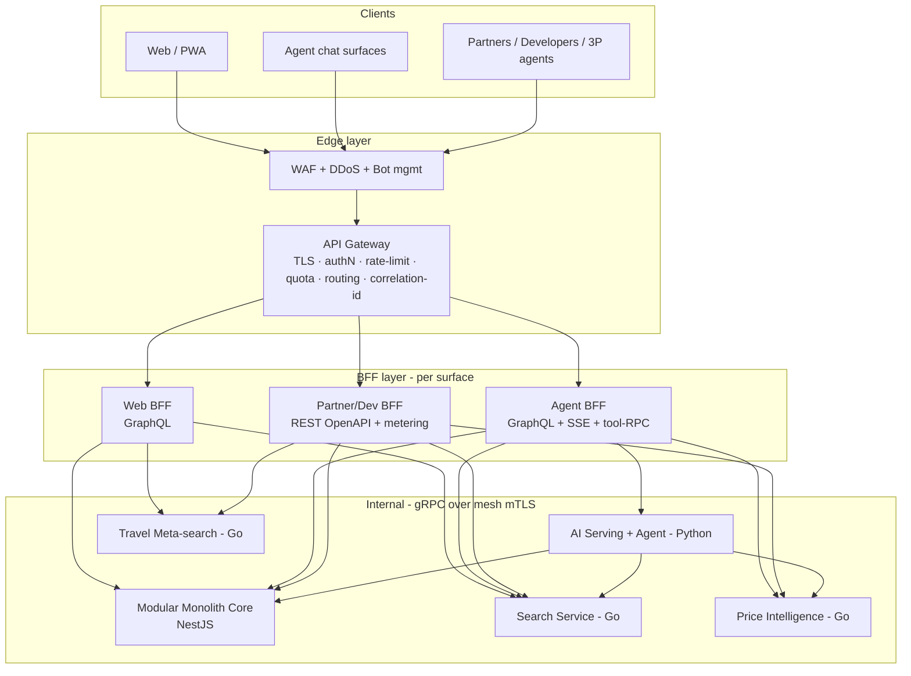
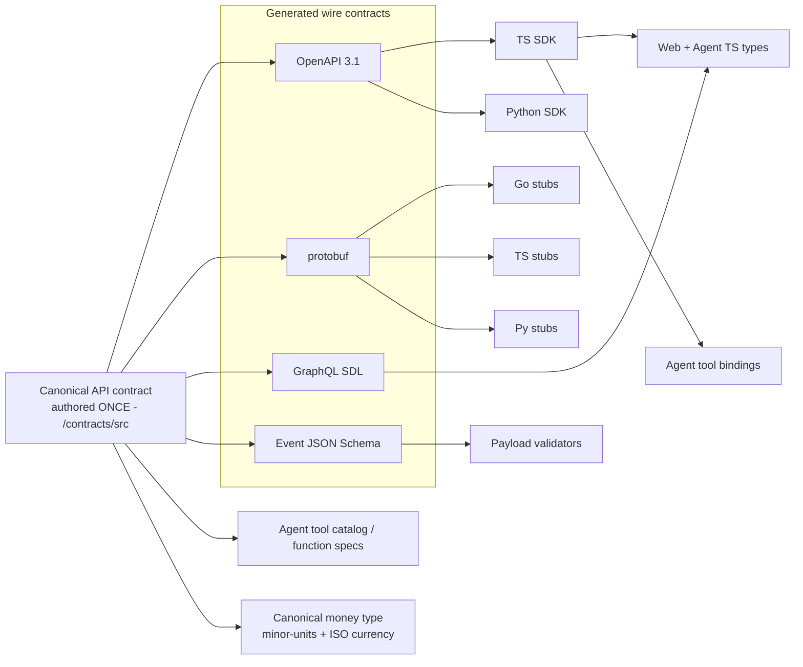
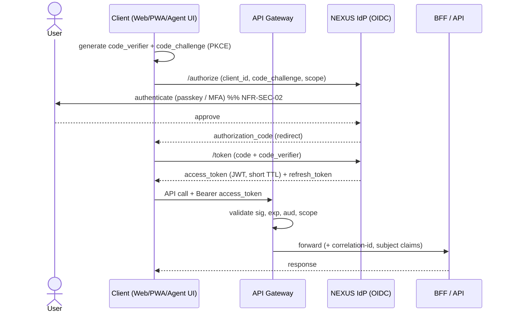
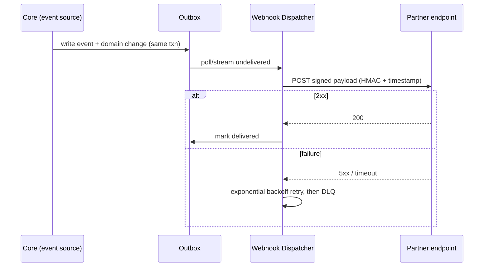
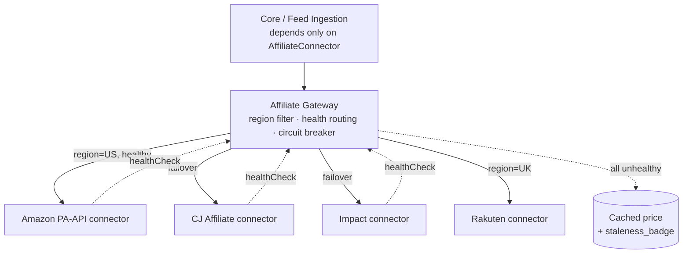

# 07 — API Architecture

**Status:** 🟢 Draft-complete (R4-remediated) · **Owner:** API Architect · **Depends on:** [04](04-system-architecture.md)

---

## 0. Purpose & first principles

This document specifies how NEXUS exposes, secures, versions, and operates its APIs — internal and public. It is the contract layer that turns the [System Architecture](04-system-architecture.md) into callable surfaces for three distinct consumers: **humans** (web/PWA), **the shopping agent** (the product itself), and **third parties** (partners, developers, and *their* agents).

Three principles from upstream docs are load-bearing here and are treated as constraints, not aspirations:

1. **"Every capability is an API before it is a screen."** ([Vision §8.6](01-vision.md#8-guiding-principles)) — the GUI is one renderer of the API, never a privileged path. Nothing may be reachable only through the web app.
2. **Agent-first, UI-second.** ([Vision §8.4](01-vision.md#8-guiding-principles)) — the agent's tool catalog is a *first-class public surface*, not an internal shim. The same tools the NEXUS agent calls are (scope-gated) the tools a partner's agent can call.
3. **The public API is a revenue stream.** The developer/agent platform is the H3 "commerce OS" horizon ([Vision §10](01-vision.md#10-3-horizon-roadmap-outcome-not-feature-framed)) and a distinct monetized product, not a free side-effect — so it is metered, tiered, and SLA-backed from the design stage.

RFC-2119 keywords (**MUST**, **SHOULD**, **MAY**) are used normatively throughout.

---

## 1. API styles — REST vs GraphQL vs gRPC vs events

### Options

| Option | Fit | Where it hurts |
|--------|-----|----------------|
| **REST everywhere** | Ubiquitous, cacheable, simple, tool-friendly | Over/under-fetching for rich UIs; chatty for aggregation; weak for streaming |
| **GraphQL everywhere** | Flexible client-shaped fetch; one round-trip aggregation | Caching is hard; poor fit for service-to-service; N+1 risk; harder to rate-limit/meter fairly |
| **gRPC everywhere** | Fast, typed, streaming, low overhead | Browser support needs a proxy; poor human/partner ergonomics; not cache-friendly at the edge |
| **Polyglot: right tool per boundary** | Each boundary optimal | Requires contract governance and codegen discipline |

### Decision

NEXUS **MUST** use a **polyglot, boundary-specific** API strategy:

| Boundary | Style | Rationale |
|----------|-------|-----------|
| **Public REST API** (partners, developers, agent-tool catalog) | **REST + JSON**, OpenAPI 3.1 | Universally consumable, cacheable, easy to meter/tier, LLM-function-calling maps cleanly to REST resources |
| **Client aggregation (web/PWA, agent chat UI)** | **GraphQL BFF** | One typed round-trip for view-shaped data; kills the "40 tabs" over-fetch problem at the API layer |
| **Internal service-to-service** (Core ⇄ Search/Price/AI/Travel/Ingestion) | **gRPC + protobuf** | Low-latency typed RPC over the mesh; supports server-streaming for search fan-out and agent token streams; directly serves NFR-PERF-01/03 |
| **Real-time to clients** (agent tokens, price ticks, watchlist hits) | **SSE** (primary) / WebSocket (bidirectional) | SSE for one-way streaming (agent output, price drops); WS only where the client must push mid-stream |
| **Partner & platform integration** | **Webhooks + event notifications** (signed) | Async, decoupled, survives partner downtime; inbound feeds already handled by Ingestion ([04 §5.2](04-system-architecture.md#52-event-driven-feed-ingestion-the-legitimacy-boundary)) |

**Trade-offs.** We accept **three contract formats** (OpenAPI, protobuf, GraphQL SDL) on the wire in exchange for each boundary being optimal — but they are **not authored independently**: per [ADR-0020](adr/ADR-0020-performance-consistency-hardening.md) all three are **generated from one canonical contract source** (§3), so there is no hand-syncing and no money/i18n drift across formats. This mirrors and is bounded by the "three backend languages" trade-off already accepted in [04 §9](04-system-architecture.md#9-risks-assumptions-trade-offs-architecture-level).

**Risks.** (a) Contract drift between styles — eliminated at the source: one canonical contract generates all three formats, with codegen + contract tests as a merge gate ([ADR-0020](adr/ADR-0020-performance-consistency-hardening.md), §3). (b) GraphQL abuse (deep/expensive queries) — mitigated by depth/complexity limits and persisted queries (§7). (c) gRPC-web browser gap — irrelevant because browsers hit the BFF/REST edge, never gRPC directly.

**Assumptions.** Internal mesh supports mTLS + HTTP/2 ([09](09-cloud-architecture.md)); partners can consume REST + webhooks (validated in partner onboarding).

**Scalability.** REST/GraphQL edges are stateless and horizontally autoscaled; gRPC lives behind the mesh where connection multiplexing (HTTP/2) reduces per-call overhead at high QPS (NFR-SCAL-01).

**Implementation.** GraphQL BFF in NestJS (Apollo/Mercurius); public REST in NestJS; gRPC contracts compiled to TS/Go/Python stubs; SSE via the gateway; webhooks via an outbox → dispatcher (§9).

---

## 2. Gateway + BFF architecture

The edge (introduced in [04 §3–4](04-system-architecture.md#4-component-responsibilities)) is split into two logical layers with different jobs. Conflating them is a common failure; NEXUS **MUST** keep them separate.

- **API Gateway (edge, cross-cutting, thin):** TLS termination, authN token validation, coarse routing, global + tiered rate-limiting, quota enforcement, WAF/abuse checks, correlation-ID injection, request/response logging, schema-level request validation. It is **surface-agnostic** and holds no business logic.
- **BFF (Backend-for-Frontend, per surface):** aggregation, view-shaping, orchestration of multiple downstream calls, surface-specific auth scoping, response caching. There are **three BFFs**, one per consumer archetype, because their needs genuinely diverge:

| BFF | Consumer | Protocol out | Optimized for |
|-----|----------|--------------|---------------|
| **Web BFF** | Web / PWA | GraphQL | View-shaped aggregation, SSR/RSC hydration, session cookies |
| **Agent BFF** | NEXUS shopping agent + agent chat surfaces | GraphQL + SSE + tool-RPC | Streaming tokens, tool-call fan-out, action-scope enforcement, low first-token latency (NFR-PERF-03) |
| **Partner/Dev BFF** | External partners, developers, third-party agents | REST (OpenAPI) | Stable versioned contracts, API-key/OAuth scopes, metering, quotas |

> **Affiliate-commission disclosure field (MUST — [ADR-0021](adr/ADR-0021-legal-product-truth.md) D1).** Every offer/result object served by the API — REST, GraphQL, and the agent tool catalog — **MUST** carry a **`disclosure`** field (the affiliate-commission notice). Clients render it wherever affiliate links appear; the agent verbalizes it before a handoff. A response with an affiliate offer and no `disclosure` field **fails the contract test** (Product-Guidelines acceptance criterion, [11 §1](11-product-guidelines.md)).

> **Shared offer-view resolver (MUST).** The Web BFF and Agent BFF **MUST NOT** independently aggregate the offer view. Both resolve offers through the **same offer-view resolver** ([ADR-0020](adr/ADR-0020-performance-consistency-hardening.md)) so a human and the agent see byte-identical prices, coupons, and cashback for the same offer. BFFs shape and stream; they never re-derive money numbers (this closes the divergent-numbers risk from two BFFs aggregating the same view independently).

### Gateway topology



**Options considered.** (a) Single fat gateway with per-surface logic inside — rejected: couples surfaces, becomes a deploy bottleneck. (b) No BFF, clients call services directly — rejected: leaks internal topology, forces chatty clients, breaks the "API before screen" neutrality boundary. (c) One BFF for all — rejected: web session shaping and partner metering have incompatible concerns.

**Decision:** thin surface-agnostic Gateway + three surface-specific BFFs.

**Trade-offs.** More deploy units and some duplicated aggregation logic across BFFs — accepted for isolation and independent scaling. **Risks:** BFF logic sprawl (mitigated: BFFs orchestrate, they do not own domain rules — those stay in Core/services); gateway as SPOF (mitigated: stateless, multi-AZ, autoscaled, NFR-AVAIL-01). **Assumptions:** downstream exposes stable gRPC contracts. **Scalability:** every edge/BFF box is stateless → horizontal autoscale on RPS/latency; cache in Redis at the BFF for hot read aggregates. **Implementation:** gateway via managed edge (e.g., AWS API Gateway/ALB + Envoy) or Kong/Envoy on EKS; BFFs as NestJS services; service mesh (Istio/Linkerd) provides mTLS + retries + circuit-breaking for the gRPC leg (complements [04 §7](04-system-architecture.md#7-cross-cutting-concerns)).

---

## 3. Contract-first everywhere

APIs at NEXUS **MUST** be defined contract-first and — per [ADR-0020](adr/ADR-0020-performance-consistency-hardening.md) — authored **once**. There is a **single canonical contract source** per resource, reviewed *before* implementation; **OpenAPI 3.1, GraphQL SDL, and protobuf are generated from it**, never authored independently. Independent authoring is precisely what let money/i18n semantics drift across the three formats — so it is prohibited, as are hand-written clients or drifting server types.

The canonical source is the single source of truth; the three wire contracts below are **generated artifacts**, and everything downstream (SDKs, stubs, the agent tool catalog) is generated from those:

| Boundary | Wire contract (generated from canonical source) | Generated from it |
|----------|-------------------|-------------------|
| Public REST | **OpenAPI 3.1** (`/contracts/openapi/*.yaml`) | TS + Go + Python server stubs & DTOs; TS SDK; Python SDK; Postman collection; docs portal |
| Internal RPC | **protobuf 3** (`/contracts/proto/*.proto`) | Go/TS/Python gRPC stubs; message types |
| Client aggregation | **GraphQL SDL** (`/contracts/graphql/*.graphql`) | TS types for web + agent; resolver typings; persisted-query manifest |
| Events/webhooks | **JSON Schema + CloudEvents** envelope (`/contracts/events/*.json`) | Producer/consumer types; webhook payload validators |

### Shared types: how frontend, agent, and services stay in sync



The **agent tool catalog** (§4.4) and the **canonical money type** (§8.5) are *generated from the same canonical contract* that produces the public REST OpenAPI. This is the mechanism behind "agent-first": there is no separate hand-maintained function schema — and no separately-authored money/i18n semantics — that can drift from the real API. The LLM function-calling definitions consumed by [AI Architecture](05-ai-architecture.md) are generated from the contract.

**Decision:** contracts live in a versioned `/contracts` monorepo package; codegen runs in CI; **breaking-change detection** (`oasdiff` for OpenAPI, `buf breaking` for protobuf, GraphQL-inspector for SDL) is a **required merge gate**. Contract tests (Pact/consumer-driven) verify provider/consumer agreement before deploy.

**Trade-offs.** Codegen infra and a `/contracts` review discipline up front — repays itself by eliminating an entire class of integration bugs and letting the TS frontend, TS SDK, and agent share one type universe. **Risks:** generator lock-in (mitigated: standards-based inputs, swappable generators); over-generated bloat (mitigated: curate SDK surface). **Assumptions:** all three contract formats can be authored for the same resource without semantic loss (validated per resource). **Scalability:** contracts scale with API surface, not traffic. **Implementation:** `buf`, `openapi-generator`/`orval`, GraphQL Code Generator, all wired into CI with the breaking-change gates above.

---

## 4. Core public API surface (illustrative)

Base: `https://api.nexus.example/v1` · JSON · `Authorization: Bearer <token>` or `X-API-Key` (partner/dev). All examples are illustrative and normative in *shape*, not in exhaustive field list.

### 4.0 Resource map

| Domain | Resource(s) | Key operations |
|--------|-------------|----------------|
| Search | `/search`, `/offers` | discovery, faceting, neutral ranking |
| Price | `/offers/{id}/price`, `/products/{id}/price-history` | all-in price, history, drop forecast |
| Coupons | `/coupons` | verified applicable coupons per offer |
| Cashback | `/cashback/rates`, `/cashback/ledger` | rates, accruals |
| Watchlist | `/watchlists`, `/watchlists/{id}/targets` | target price watch & auto-buy |
| Handoff | `/handoff/sessions`, `/handoff/sessions/{id}/confirm` | agentic best-option resolution → signed merchant redirect (no payment, no order) |
| Wallet | `/wallet`, `/wallet/transactions`, `/wallet/payouts` | balance, ledger, payouts |
| Creator | `/creator/links`, `/creator/earnings` | affiliate links, attributed earnings |
| Travel | `/travel/flights/search`, `/travel/hotels/search`, `/travel/bookings` | meta-search + booking |
| Agent tools | `/agent/tools` (catalog), tool-RPC invocation | function-calling catalog + one tool-RPC invocation mechanism (§4.4) |
| Config | `/config/markets`, `/config/markets/{country}` | enabled markets, currencies, locales, per-market feature flags (§8.6) |

### 4.1 Search & offers

```http
GET /v1/search?q=55%22+oled+tv&max_price=900&currency=USD&deliver_by=2026-07-17&page_size=20
```
```jsonc
// 200 OK  (fields trimmed)
{
  "query": { "intent": "product", "constraints": { "max_price": 900, "deliver_by": "2026-07-17" } },
  "results": [
    {
      "offer_id": "off_9f2a...",
      "product": { "id": "prd_ab12", "title": "Acme 55\" OLED 4K", "brand": "Acme" },
      "merchant": { "id": "mrc_amazon", "name": "MerchantX", "reliability": 0.98 },
      "all_in_price": { "item": 899.00, "shipping": 0, "tax": 62.93, "total": 961.93, "currency": "USD" },
      "best_coupon": { "code_masked": "SAVE**", "expected_savings": 40.00 },
      "cashback_rate": 0.03,
      "ranking": { "score": 0.91, "neutral": true, "sponsored": false },
      "disclosure": "NEXUS may earn a commission on qualifying purchases. It never affects ranking.",
      "license_tag": "amazon-pa-api"      // provenance, per ADR-0001
    }
  ],
  "facets": { "brand": [...], "screen_size": [...] },
  "page": { "size": 20, "next_cursor": "eyJvIjoyMH0" }
}
```
Every result carries `ranking.neutral`/`sponsored` and a `license_tag` — the API-level expression of the [neutrality wall](04-system-architecture.md#53-neutrality-enforcement) and the [data-sourcing legitimacy rule](adr/ADR-0001-data-sourcing.md). Sponsored slots, if any, are **labeled** and never reorder neutral results.

### 4.2 Live price (intent-time, Tier-3 per [SDD §8](02-software-design-document.md#8-data-freshness-strategy-a-defining-design-decision))

```http
GET /v1/offers/off_9f2a.../price?live=true
```
```jsonc
{ "offer_id": "off_9f2a...", "all_in_price": { "total": 961.93, "currency": "USD", "as_of": "2026-07-13T09:12:04Z" },
  "freshness": { "class": "live", "as_of": "2026-07-13T09:12:04Z", "staleness_badge": null },   // class ∈ live|recent|cached (§8.7)
  "history_summary": { "min_90d": 879.00, "drop_forecast": { "prob_30d": 0.42, "expected_low": 849.00 } } }
```

### 4.3 Agentic handoff (idempotent, with safety gate)

Per [ADR-0006](adr/ADR-0006-referral-only-model.md), a **handoff session does NOT create an order or take payment**. It resolves the best option, stamps affiliate attribution, and its `:confirm` returns a **signed merchant redirect URL** (deep-link/affiliate link) — the user completes payment on the merchant's own checkout. NEXUS never receives card data.

```http
POST /v1/handoff/sessions
Idempotency-Key: 6f9d1c2e-...        // MUST for all state-changing money & attribution ops (handoff, wallet, payout, accrual)
```
```jsonc
// request
{ "offer_id": "off_9f2a...", "coupon_code": "SAVE20", "expected_total": 921.93,
  "on_behalf_of": "usr_123", "action_scope_token": "act_...", "confirm": false }
```
```jsonc
// 201 Created — confirmation gate, no order created, nothing bought
{ "session_id": "hos_77a...", "state": "awaiting_confirmation",
  "quote": { "all_in_price": 921.93, "coupon_applied": 40.00, "cashback_expected": 27.66, "ship_by": "2026-07-16" },
  "policy": { "target_allowed": true, "return_window_days": 30 },
  "expires_at": "2026-07-13T09:20:00Z" }
```
```http
POST /v1/handoff/sessions/hos_77a.../confirm
Idempotency-Key: 6f9d1c2e-...
```
```jsonc
// 200 OK — signed redirect to the merchant's OWN checkout; payment happens there
{ "session_id": "hos_77a...", "state": "handed_off",
  "redirect": { "url": "https://merchantx.example/cart?...&aff=nexus&sig=...", "signed": true, "expires_at": "2026-07-13T09:25:00Z" },
  "attribution": { "click_id": "clk_...", "network": "impact" } }
```
The confirm step is where the [SDD §4.2 safety gate](02-software-design-document.md#42-delegated-agentic-handoff-with-safety-gate) is enforced: the agent **MUST NOT** call `:confirm` without an explicit in-session user approval carried by a valid `action_scope_token` (§6.5), and the purchase completes via an **authorized deep-link** to the merchant's own checkout — NEXUS does **not** call a merchant payment API on the user's behalf at launch (agent-executed payment is deferred to Phase P5+). Already a referral deep-link by design, so there is no merchant-API failure mode to degrade from (NFR-AVAIL-02 covers redirect-resolution availability). **Open-redirect defense (MUST, [ADR-0018](adr/ADR-0018-connector-security-hardening.md)):** before a signed `redirect.url` is emitted, the affiliate wrapper is resolved and its **final-hop host validated against the merchant's per-merchant canonical-destination allowlist** — a confirmed handoff can never redirect anywhere but the vetted merchant destination, so an affiliate open-redirect cannot turn the signed handoff into a confused deputy.

### 4.4 The agent "tool" API (function-calling catalog)

This is the surface that makes NEXUS agent-first. Each tool is a thin, well-described binding over a governed operation, **generated from the canonical contract** (§3), and consumed by the agent loop in [AI Architecture §tool-calling](05-ai-architecture.md). Tools are **invoked over one mechanism — tool-RPC on the Agent BFF (§2)** — not a REST `:invoke` verb (see below).

```http
GET /v1/agent/tools           // discovery: returns function-calling schemas
```
```jsonc
{
  "tools": [
    {
      "name": "search_offers",
      "description": "Search authorized merchant offers with constraints; returns neutral-ranked all-in prices.",
      "parameters": { "type": "object",
        "properties": { "q": {"type":"string"}, "max_price": {"type":"number"}, "deliver_by": {"type":"string","format":"date"} },
        "required": ["q"] },
      "scopes": ["search:read"], "side_effects": "none"
    },
    {
      "name": "start_handoff",
      "description": "Create a confirmation-gated handoff session; returns a signed redirect to the merchant's own checkout. Does NOT take payment or create an order.",
      "parameters": { "type":"object", "properties": { "offer_id":{"type":"string"}, "expected_total":{"type":"number"} }, "required":["offer_id"] },
      "scopes": ["handoff:write"], "side_effects": "creates_session", "requires_action_scope": true
    }
  ]
}
```
```jsonc
// Tool invocation is a single tool-RPC call on the Agent BFF (NOT a REST `:invoke`)
// tool-RPC: invoke(name, arguments, action_scope_token?, idempotency_key?)
{ "tool": "search_offers", "arguments": { "q": "55\" oled tv", "max_price": 900 } }
```
**One tool-invocation mechanism (MUST, [ADR-0020](adr/ADR-0020-performance-consistency-hardening.md)).** There is exactly **one** way to call a tool: a **tool-RPC** on the Agent BFF (§2). The earlier tool-RPC-vs-REST `:invoke` contradiction is resolved in favour of a **single tool-RPC protocol** — the REST `:invoke` verb is retired. The NEXUS agent and *third-party agents* invoke through the **same** scope-gated tool-RPC surface, so there is no second invocation path to drift. The catalog is generated from the same canonical contract (§3) that defines the REST resources, so every tool maps 1:1 to a governed operation and its `scopes`, `side_effects`, and `requires_action_scope` are contract-derived, never hand-written. Tools with money-adjacent side-effects (handoff attribution, wallet payouts) **MUST** be idempotent and action-scoped. This is how the agent tool catalog stays a *public product surface*, not an internal shim.

### 4.5 Wallet, creator, travel (shape sketch)

```jsonc
// GET /v1/wallet  -> { "balance": {"available":142.10,"pending":27.66,"currency":"USD"}, "ledger_ref":"lgr_..." }
// GET /v1/creator/earnings?period=2026-07 -> { "attributed_gmv": 12040.00, "commission": 601.00, "clicks": 3821 }
// POST /v1/travel/flights/search -> { "itineraries":[ { "price_all_in":..., "segments":[...], "provider":"duffel" } ] }
```
Wallet mutations are projections of the **double-entry Ledger** ([04 §5.4](04-system-architecture.md#54-attribution--money-event-sourced)); the API never mutates money directly, it emits intent events.

---

## 5. Versioning & evolution

### Options → Decision

| Option | Verdict |
|--------|---------|
| URL path version (`/v1`) | ✅ **Chosen for major** — explicit, cache/proxy-friendly, unambiguous for partners & agents |
| Header/media-type version | Used **only** internally / for minor content negotiation; too invisible for a public partner contract |
| No versioning (evolve in place) | ❌ breaks partners; unacceptable for a revenue API |

**Decision.** Public REST **MUST** carry a **major version in the URL** (`/v1`, `/v2`). Non-breaking changes ship **within** a major version (additive fields, new optional params, new endpoints) governed by an **expand/contract** rule. gRPC evolves via protobuf field-number discipline (never reuse/renumber; only add). GraphQL evolves additively with `@deprecated` directives (no field removal without the deprecation cycle).

**Backward-compat rules (normative).**
- Clients **MUST** ignore unknown response fields (tolerant reader); servers **MUST NOT** remove or repurpose a field within a major version.
- New required request params are a **breaking change** → new major version only.
- Enum values **MAY** be added; clients **MUST** handle unknown enums gracefully.
- Default behavior **MUST NOT** change silently; behavior changes ship behind a new param or version.

**Deprecation policy.** Deprecations **MUST** be announced via: `Deprecation` + `Sunset` HTTP headers (RFC 8594), the changelog, portal banners, and email to key-holders. Minimum support windows: **public partner/dev API ≥ 12 months** after a successor GA; **internal gRPC ≥ 2 release trains**. A deprecated major version is frozen (security fixes only). Usage dashboards track residual callers before sunset.

**Trade-offs / Risks / Assumptions.** URL versioning can encourage premature `/v2` forks (mitigated: additive-first culture, `/v2` requires an ADR). Long support windows carry maintenance cost (mitigated: adapters translating `v1`→`v2` internally so only the edge is dual-versioned). Assumes most change is additive (validated by the breaking-change CI gate in §3). **Scalability:** version routing is a stateless edge concern; multiple majors run side-by-side behind the gateway. **Implementation:** gateway routes by path prefix to versioned BFF handlers; `oasdiff`/`buf breaking` enforce the rules automatically.

---

## 6. AuthN / AuthZ for APIs

Grounded in **NFR-SEC-02 (OIDC + MFA; passkeys preferred)** and [SDD §7 Identity](02-software-design-document.md#7-cross-cutting-concerns). Full IAM detail is deferred to [08 — Security Architecture](08-security-architecture.md); this section covers the **API-facing** flows.

### 6.1 Identity model

| Caller | Mechanism | Credential |
|--------|-----------|------------|
| Human (web/PWA/agent chat) | **OIDC / OAuth2 Authorization Code + PKCE**, MFA/passkey at IdP | Short-lived access JWT + rotating refresh token |
| NEXUS agent acting for a user | **On-behalf-of** token + **action-scope token** | Delegated JWT with `act` claim + handoff action scope |
| Third-party developer/partner app | **OAuth2** (Auth-Code+PKCE for user data; Client-Credentials for app data) **or API key** | API key (`X-API-Key`) with scopes, or OAuth client |
| Service-to-service (internal) | **mTLS + SPIFFE/SPIRE** workload identity | Short-lived SVID certs, no shared secrets |

### 6.2 Public-client login (Auth Code + PKCE)



Public clients (SPA/PWA/native) **MUST** use PKCE and **MUST NOT** hold a client secret. Access tokens **SHOULD** be short-lived (≤ 15 min) with refresh rotation; the web surface **MAY** keep tokens in secure httpOnly cookies via the Web BFF to avoid token exposure to JS.

### 6.3 Service-to-service (mTLS + SPIFFE)

Internal gRPC calls carry a SPIFFE SVID; the mesh enforces mutual TLS and the callee authorizes by SPIFFE ID (e.g., `spiffe://nexus/handoff` may call `spiffe://nexus/ledger`, Search may not). No internal call is trusted by network position alone — **zero-trust** between services. Human/partner JWTs are **not** propagated raw internally; the BFF exchanges them for a narrowly-scoped internal assertion (token exchange, RFC 8693).

### 6.4 Partner / developer API keys & scopes

Keys are issued per app/environment (sandbox vs. live), carry an explicit **scope set** (`search:read`, `price:read`, `handoff:write`, `webhooks:manage`, …), are hashed at rest, support **rotation with overlap**, and are bound to tier + quota (§7). Sensitive scopes (`handoff:write`, `wallet:*`) **MUST** additionally require OAuth user consent — an API key alone can never hand off on a user's behalf or touch a user's wallet.

### 6.5 Per-user agent action scope (the delegated-authority primitive)

The agent's authority to *hand off* is a **separate, narrow, bounded credential** from its authority to *read*. Because NEXUS never charges the user (ADR-0006), this token governs **which merchant/option the agent may hand off to** — not spend:

```jsonc
// action_scope_token claims (illustrative)
{ "sub": "usr_123", "act": { "sub": "agent:nexus" },
  "handoff": { "targets_allow": ["mrc_amazon", "mrc_bestbuy"], "merchants_deny": ["mrc_x"],
               "categories_allow": ["electronics"], "max_quote": 1000.00, "currency": "USD",
               "requires_confirmation_above": 0.00 },
  "exp": 1789..., "jti": "act_..." }
```
Rules: the token is **per-user, time-boxed**, single-audience (`handoff`), and **`requires_confirmation_above: 0` by default** — i.e. every handoff is confirmation-gated unless the user has explicitly raised one-tap limits ([SDD §4.2/4.3](02-software-design-document.md#42-delegated-agentic-handoff-with-safety-gate)). At launch the token **caps and allow-lists handoff targets** (which merchant/option), not spend — `max_quote` bounds the *displayed* quote the agent may hand off, but no money moves through NEXUS; a true **spend-cap variant** (where the agent completes payment under an amount ceiling) is deferred to **P5+**. `/handoff/.../confirm` **MUST** reject a session whose selected option (merchant/offer) is outside the token's allow-list. This is the API contract behind the product's core safety promise.

**Trade-offs / Risks.** More token types = more complexity (mitigated: one IdP issues all; standard OAuth2/OIDC/8693/SPIFFE, nothing bespoke). Delegated tokens are high-value theft targets (mitigated: short TTL, `jti` revocation list, target allow-list bounds blast radius, all handoff events audited to the Ledger). **Assumptions:** IdP supports token exchange + custom claims (validated in [08](08-security-architecture.md)). **Scalability:** JWT validation is stateless at the gateway (JWKS cached); revocation via a small Redis denylist. **Implementation:** OIDC IdP (e.g., managed Cognito/Auth0/Keycloak), SPIRE for workload identity, gateway-level JWT + scope enforcement, action-scope minted by the Identity module.

---

## 7. Rate limiting, quotas, throttling, abuse protection

**Decision.** Enforce limits at the **gateway** (coarse, tier-based) *and* per sensitive operation (fine). Algorithm: **token-bucket for burst + sliding-window for sustained**, keyed by `(principal, tier, route-class)`. GraphQL is additionally limited by **query cost/complexity + depth**, not just request count (a single GraphQL call can be arbitrarily expensive).

### Tiered limits (illustrative baselines; tuned against NFR-PERF/cost)

| Tier | Sustained | Burst | Monthly quota | Notes |
|------|-----------|-------|---------------|-------|
| **Anonymous** | 5 req/s | 20 | — | search read-only, heavy caching |
| **Free (registered)** | 20 req/s | 60 | — | full read, gated writes |
| **NEXUS+ (subscriber)** | 60 req/s | 200 | — | priority routing, live-price priority |
| **Developer (metered)** | per plan | per plan | plan-based | billed on overage (H3, §10) |
| **Partner (contracted)** | per SLA | per SLA | per contract | SLA-backed, dedicated capacity |
| **Internal (agent BFF)** | high | high | — | protected by concurrency + cost budget, not raw RPS |

Rate-limit responses **MUST** return `429` with `Retry-After` and `RateLimit-Limit`/`RateLimit-Remaining`/`RateLimit-Reset` headers (IETF `RateLimit` fields). Overload sheds load with `503` + `Retry-After` (backpressure, complementing [04 §7](04-system-architecture.md#7-cross-cutting-concerns)).

**Abuse protection.** WAF + bot management at the edge; anomaly detection on key/IP/subject; progressive challenge (never a CAPTCHA the *agent* must solve — bot-detection for NEXUS's own first-party agent is handled by signed workload identity, not challenges); automatic key throttling on scraping-shaped access; per-scope stricter caps on money routes; `handoff:write` and `wallet:*` get hard concurrency ceilings per user regardless of tier. **Anti-abuse MUST cover the conversational agent surface, not just the REST tier ([ADR-0018](adr/ADR-0018-connector-security-hardening.md)):** the agent API is itself the scraping/abuse target (the moat), so our own first-party agent authenticates with **signed workload identity** while third-party agent access carries **anomaly/velocity detection and per-scope caps** on the tool-RPC surface (§4.4) — the REST rate limits above are necessary but not sufficient.

**Trade-offs / Risks / Assumptions / Scalability / Implementation.** Distributed rate-limit counters add latency (mitigated: Redis with local pre-check, eventual reconciliation). Aggressive limits can throttle legitimate bursty agents (mitigated: cost-budget limiting for the agent path rather than naive RPS). Assumes principal identity is resolved at the edge (true post-authN). Counters scale horizontally in Redis-cluster; limits are config-driven per tier so changes need no redeploy. Implemented in gateway plugins + a shared limiter library used by BFFs.

---

## 8. Idempotency, pagination, filtering, errors, consistency

### 8.1 Idempotency (handoff / ledger)
All mutating money operations (`/handoff/*` — session creation is idempotent — plus `/wallet/*`, payout, cashback accrual) **MUST** accept an `Idempotency-Key` header (client-generated UUID). The server stores `(key → first response)` for ≥ 24h; a replay returns the original result. There is no "double-charge" to guard against because NEXUS never charges — the point is **safe retries with no duplicate attribution** (a replayed handoff confirm returns the same signed redirect and the same single click-id, never a second affiliate stamp). This is the API surface of the [outbox + saga](04-system-architecture.md#7-cross-cutting-concerns) machinery — retries (from flaky agents, partners, or networks) are safe by construction.

### 8.2 Pagination
**Cursor-based** by default (`page_size` + opaque `next_cursor`) — stable under inserts, scales to 500M offers (NFR-SCAL-02). Offset pagination is **NOT** offered on large collections. Every list response carries a `page` object; agents follow `next_cursor` until null.

### 8.3 Filtering & sorting
Explicit whitelisted query params (`max_price`, `brand`, `deliver_by`, `merchant_id`, `sort`). No arbitrary query DSL on public REST (prevents expensive-query abuse). Sort is constrained to neutral/buyer-value fields; **`sort` MUST NOT** expose a "sponsored-first" option (neutrality wall).

### 8.4 Error model — RFC 9457 problem+json
All errors **MUST** be `application/problem+json`:
```jsonc
// 422
{ "type": "https://api.nexus.example/problems/coupon-expired",
  "title": "Coupon no longer valid",
  "status": 422,
  "detail": "Coupon SAVE20 expired 2026-07-10; best price without coupon is 961.93 USD.",
  "instance": "/v1/handoff/sessions",
  "correlation_id": "c-8f2a...", "retriable": false,
  "errors": [ { "field": "coupon_code", "code": "expired" } ] }
```
Every error carries a stable `type` URI, `correlation_id` (§11), and a `retriable` flag so agents can decide to retry vs. surface. Error `type`s are documented in the portal and are part of the versioned contract.

### 8.5 Consistency of responses
House rules enforced by a shared response library + lint: `snake_case` JSON, RFC 3339 UTC timestamps, the **canonical money type** (§8.6 — **integer minor-units + ISO 4217 currency**, defined once and code-generated into every runtime and contract format per [ADR-0020](adr/ADR-0020-performance-consistency-hardening.md); never a float or bare decimal), all IDs are prefixed opaque strings (`off_`, `usr_`, `hos_`), collections always wrapped (`{ "results": [...], "page": {...} }`), money is **always** all-in (item+ship+tax) with components broken out. Read consistency: discovery is **eventually consistent** (CQRS read projections, [04 §5.1](04-system-architecture.md#5-data-flow-patterns)); money/ledger reads are **read-your-writes** consistent.

### 8.6 Internationalization (multi-currency, locale, country feature flags)

Per [ADR-0007](adr/ADR-0007-phased-global-rollout.md), the API is **international-by-design from day 1** even while only the US market is live — internationalization is an API contract concern, not a later retrofit. Three surfaces are normative here.

**Multi-currency (money objects — MUST).** Every monetary value in every request and response is the **canonical money type** ([ADR-0020](adr/ADR-0020-performance-consistency-hardening.md)): **integer `minor_units` + `currency` (ISO 4217)**. There is **no implicit USD** — a bare number is never a valid money value on any boundary. Minor-units integers are exact by construction (no float rounding, no decimal-string parse ambiguity across the three runtimes/contract formats). The type is defined **once** and code-generated into every runtime (§3), so precision cannot drift. **Cross-currency comparisons are FX-normalized as an explicit ranking step** — never an implicit cast — and FX is handled centrally, not per-service. This generalizes the objects shown in §4 (`all_in_price`, `wallet.balance`, `action_scope_token.max_quote`): the decimal totals rendered there are **illustrative display renderings** of the underlying minor-units money object, whose `currency` is **required**, never defaulted.

```jsonc
// every money value everywhere is the canonical money type — both fields REQUIRED
{ "minor_units": 96193, "currency": "USD" }        // ✅  96193 minor units = 961.93 USD
// 961.93                                             // ❌ bare number / implicit-USD is a contract violation
// { "amount": "961.93" }                             // ❌ float/decimal string, no currency — rejected by the response library
```

**Locale (`Accept-Language` — SHOULD/MUST).** Clients **SHOULD** send `Accept-Language`; the API selects the best-matching supported locale, returns `Content-Language`, and localizes all user-facing display strings, number/date formatting, and RTL directionality. There are **no hard-coded user-facing strings** in responses — machine-stable fields (`type` URIs, enum codes, IDs) stay locale-invariant so agents parse them deterministically, while human-facing `title`/`detail`/labels are localized. Agents that need a fixed locale **MAY** pin it with a `locale` query param, which overrides `Accept-Language`. Requesting an unsupported locale falls back to the market default (never an error).

**Country feature-flag surface (MUST).** Every market is gated by a **country feature flag** ([ADR-0007](adr/ADR-0007-phased-global-rollout.md)); enabling a country is a controlled rollout, not a deploy. Clients and agents learn *which markets and features are enabled* — rather than discovering it by failed calls — from a public capability endpoint:

```http
GET /v1/config/markets                 // and GET /v1/config/markets/{country}
```
```jsonc
// 200 OK — advertises enabled markets, currencies, locales, and per-market feature flags
{ "detected_region": "US",
  "markets": [
    { "country": "US", "enabled": true,  "currency": "USD", "locales": ["en-US","es-US"],
      "features": { "travel": true,  "cashback": true,  "watchlist_one_tap_alert": true } },
    { "country": "GB", "enabled": true,  "currency": "GBP", "locales": ["en-GB"],
      "features": { "travel": true,  "cashback": false, "watchlist_one_tap_alert": false } },
    { "country": "BD", "enabled": false, "currency": "BDT", "locales": ["bn-BD","en"],
      "features": {} }
  ] }
```
Calling a market-scoped operation for a country whose flag is off returns `409`/`404` `application/problem+json` with `type` `.../market-not-available` (§8.4), never a partial or US-defaulted result. Because flags gate **routing**, a market is added or rolled back instantly without a deploy. Region for a request is resolved from the authenticated account (falling back to geo-IP) and drives both this surface and region-specific affiliate connector selection (§9).

**Trade-offs / Risks / Assumptions.** Day-1 currency/locale plumbing before non-US launch is upfront discipline (accepted as cheap insurance vs. a notorious retrofit — [ADR-0007](adr/ADR-0007-phased-global-rollout.md)). Risk: a service emits a bare number and leaks implicit-USD — mitigated by the shared response library rejecting non-money-object monetary fields and a contract-lint (§3) fitness check. Assumes FX and per-market tax-display abstraction ([ADR-0007](adr/ADR-0007-phased-global-rollout.md)) live behind the Core money layer, not in the edge.

### 8.7 Price freshness & "buy intent"

Per [ADR-0020](adr/ADR-0020-performance-consistency-hardening.md), the client contract for price freshness is explicit — a client (human or agent) always knows how fresh a price is and never mistakes a cached comparison price for a live guarantee.

- **Every price carries `as_of` + a freshness class (MUST).** `as_of` is the RFC 3339 timestamp the quote was captured; the **freshness class** is `live` \| `recent` \| `cached`. No price is served without both (generalizes the `freshness` block in §4.2). Beyond the class's staleness threshold the price carries a `staleness_badge` the client **MUST** surface.
- **Passive-browse staleness contract (MUST).** Passive browsing (search, scroll, compare — no purchase signal) is served from **cached/recent** projections, **not** a live check. This is the §7 thundering-herd / cost guard; when a live check *does* fire, concurrent requests for the same offer collapse to one upstream call (single-flight coalescing, [ADR-0020](adr/ADR-0020-performance-consistency-hardening.md)).
- **"Buy intent" (normative definition).** *Buy intent* is the event that transitions a session from browse to purchase — the user opening a handoff/confirm flow, or the agent forming a confirmed handoff (§4.3). It is the **only** trigger for a Tier-3 **live** price re-check ([SDD §8](02-software-design-document.md#8-data-freshness-strategy-a-defining-design-decision)). Passive comparison prices are **never** live-checked; only a buy-intent quote is.

### 8.8 SSE resume & idempotency across a gated tool call

Per [ADR-0020](adr/ADR-0020-performance-consistency-hardening.md), the SSE stream (agent tokens, tool-call lifecycle events; §1/§2) **MUST** support **resume** (Last-Event-ID reconnect) and **idempotent, effectively-once** delivery of tool-call events **across a confirmation-gated tool call**. A dropped connection during an `awaiting_confirmation` handoff (§4.3) resumes from the last acknowledged event without re-emitting or losing the confirmation event, and **MUST NOT** double-invoke the gated tool. This pairs with the `Idempotency-Key` on the underlying handoff (§8.1): the stream and the mutation converge on the same single confirmation and the same single click-id.

---

## 9. Partner / affiliate integration APIs & webhooks

Two directions, cleanly separated:

- **Inbound (partner → NEXUS):** offer/price/inventory feeds are **NOT** a public write API — they flow through the **Feed Ingestion** legitimacy boundary ([04 §5.2](04-system-architecture.md#52-event-driven-feed-ingestion-the-legitimacy-boundary)), where every record is **license-tagged** at the adapter (ADR-0001). Partners submit via contracted feed/API adapters, not ad-hoc POSTs. This keeps the "authorized sources only" Prime Directive **structural**.
- **Outbound (NEXUS → partner):** signed **webhooks** for lifecycle events, plus **attribution postbacks** to affiliate networks.

### Webhook delivery



Webhook rules: payloads are **signed** (`X-NEXUS-Signature` HMAC-SHA256 over body + timestamp; timestamp window prevents replay); delivery is **at-least-once** → consumers **MUST** be idempotent on `event_id`; retries use exponential backoff to a **dead-letter queue** with partner-visible redelivery; partners manage subscriptions via `/v1/webhooks` (create/verify/rotate-secret). CloudEvents envelope for uniformity.

**Attribution postbacks.** Conversion happens off-platform on the merchant's checkout, so NEXUS learns of it via an inbound affiliate-network **postback**. Per [ADR-0012](adr/ADR-0012-postback-integrity.md), the ingest endpoint **MUST NOT** treat a postback as truth: it creates a **provisional (`pending`), non-payable accrual** that becomes payable only after *independent* corroboration (reconciliation pull / settlement-file match, [ADR-0011](adr/ADR-0011-attribution-reconciliation.md)). Postbacks are frequently weakly authenticated (plain GETs keyed on click/txn id, not an HMAC NEXUS can validate end-to-end), so a **per-connector auth table** in the Affiliate Gateway (§9.1) records each network's actual scheme/algorithm/rotation; a postback arriving under a weak scheme is an **unverified signal**, never a verified conversion. Ingest is **idempotent on `(network, txn_id)`** and **order-independent**: the state machine is `pending → confirmed → reversed`, ordered by **NEXUS's own monotonic receipt sequence + a signed reconciliation decision — never the attacker-suppliable `network_event_at`** ([ADR-0022](adr/ADR-0022-round2-remediation.md) NC-3), so a **raw postback can never un-reverse a reversal** (forged/replayed-postback resurrection is closed) while duplicate and out-of-order confirm/reverse postbacks still converge safely, and multi-connector failover cannot double-attribute one physical purchase (purchase-fingerprint dedup — **overlapping/jittered buckets + velocity + connector-pair collusion signals** (H-7) — routes suspected duplicates to a hold/adjudication queue, [ADR-0012](adr/ADR-0012-postback-integrity.md)). Only **corroborated** conversions are the source-of-truth for creator earnings (§4.5) and the VMS metric (there is no in-platform order event to key off, per ADR-0006).

**License/TOS constraints (normative).** What a partner integration is *allowed to expose* is bounded by the `license_tag` carried from ingestion: some feeds forbid caching prices, redistributing review text, or showing images. The API layer **MUST** enforce these per-field usage rights — e.g., a `price` from a no-cache source is served live-only, review text from a display-only source is not returned via the public API. TOS variance is a tracked risk ([04 §9](04-system-architecture.md#9-risks-assumptions-trade-offs-architecture-level)); legal review gates each new partner (ADR-0001).

### 9.1 Affiliate Gateway connector contract (internal)

Both directions above — inbound feed adapters and outbound postbacks — sit behind the **Affiliate Gateway** ([ADR-0008](adr/ADR-0008-affiliate-gateway.md)): a plugin abstraction in front of *all* affiliate/feed providers. The Prime-Directive rule from OQ#3 is architectural — **no provider may be a single point of failure**, and adding or replacing a provider **MUST NOT** require touching core code. Every provider (Amazon PA-API, CJ, Impact, Rakuten, …) ships as a **connector** implementing **one internal interface**; core code depends only on that interface, never on a specific provider's schema or SDK (the anti-corruption-layer rule of [ADR-0010](adr/ADR-0010-platform-principles.md) §4). This is the internal, in-mesh companion to the public surfaces above; it is **not** a public API.

**Connector contract (pseudo-IDL).**

```protobuf
// One interface every affiliate/feed provider implements. Core depends only on this.
interface AffiliateConnector {
  feedSync(FeedSyncRequest)        -> FeedSyncResult      // catalog/offer/inventory pull → Ingestion (§9, license-tagged)
  offerLookup(OfferQuery)          -> Offer[]             // resolve offers for a product/merchant
  priceLookup(OfferRef)            -> Money               // all-in price (money object: amount+currency, §8.6)
  buildDeepLink(OfferRef, Attribution) -> SignedUrl       // affiliate/deep-link for handoff (§4.3)
  stampAttribution(ClickContext)   -> ClickId             // normalized, provider-agnostic click-id
  ingestPostback(RawPostback)      -> ConversionEvent     // inbound network postback → normalized conversion (§9)
  healthCheck()                    -> HealthStatus        // liveness/latency/error-rate → failover routing (§11.1)

  capabilities: {
    regions:     Region[]          // ISO-3166 markets this connector serves  → region routing
    categories:  Category[]        // product categories it can source
    rateLimits:  RateLimitSpec     // provider quota the Gateway must respect
    licenseTags: LicenseTag[]      // permitted uses / TOS flags (ADR-0001; enforced per §9 license rules)
  }                                // self-declared → NEXUS-VERIFIED before driving routing (ADR-0018)
}
```

**Hot-swappable, no SPOF, automatic failover (MUST).** Because core binds only to `AffiliateConnector`, connectors are enabled/disabled/replaced by config + feature flags with no core change ([ADR-0008](adr/ADR-0008-affiliate-gateway.md) rollback). For any offer/merchant, the Gateway can source via **multiple** connectors; a connector outage, rate-limit, or unhealthy `healthCheck()` **fails over automatically** (circuit breaker + health-based routing) to an alternate connector, and if all viable connectors fail it **degrades to cached price with a `staleness_badge`** (§4.2, SDD §9) rather than surfacing an error. `stampAttribution` normalizes click-ids across providers so failover **never loses or double-counts** attribution — the same determinism §8.1 idempotency and the §9 postback matching rely on.

**Region-specific routing.** The user's region (resolved per §8.6) selects the connector: the Gateway filters connectors whose **NEXUS-verified** `capabilities.regions` include the region and whose `capabilities.categories`/`licenseTags` permit the request, then ranks the healthy candidates and routes to the primary — the others stand by as failover targets. This is the region-specific affiliate routing that [ADR-0007](adr/ADR-0007-phased-global-rollout.md) delegates to the Gateway. Capabilities are **NEXUS-verified, not trusted** ([ADR-0018](adr/ADR-0018-connector-security-hardening.md)): a connector's self-declared regions/categories/licenseTags are validated by NEXUS before they drive compliance or market routing — a connector cannot self-assert into a market.

**Connector security hardening (MUST, [ADR-0018](adr/ADR-0018-connector-security-hardening.md)).** Connectors carry credentialed third-party code, so they run **out-of-process and sandboxed**: each connector is an isolated, least-privilege worker (separate process/container in a **hardened runtime (gVisor / Kata / microVM, not ordinary namespaces)** — credentialed third-party code over hostile data ([ADR-0018](adr/ADR-0018-connector-security-hardening.md)), scoped credentials, **no access to core secrets or DB**), so a compromised or malicious connector cannot pivot into the platform. The hosting change is internal — the `AffiliateConnector` interface is unchanged externally. Every `buildDeepLink` result is subject to the **open-redirect defense** (§4.3): the affiliate wrapper is resolved and its final-hop host validated against the merchant's canonical-destination allowlist before any signed redirect leaves the Gateway. Per-region × per-connector secrets **rotate on a security schedule**, decoupled from partner-contract cadence, via automated secret management (ESO + KMS).



**Trade-offs / Risks.** The Gateway itself becomes critical → runs HA/multi-AZ, is health-checked, and carries its own SLO ([10](10-deployment-architecture.md)); cross-provider attribution normalization is non-trivial (fraud/double-count risk) and is owned by Affiliate & Attribution ([04 §5.4](04-system-architecture.md#54-attribution--money-event-sourced)). The interface is **versioned**; connectors pin an interface version so a connector upgrade never silently breaks core ([ADR-0008](adr/ADR-0008-affiliate-gateway.md)).

---

## 10. Developer platform (H3 revenue stream)

The public API is a **product**. Its surface:

| Component | Purpose |
|-----------|---------|
| **Developer portal** | Self-serve signup, interactive OpenAPI docs, changelog, status, guides |
| **Sandbox environment** | Isolated data, synthetic offers/merchants, no real money, no partner-TOS exposure — safe to build against |
| **API keys & OAuth apps** | Per-env keys, scope selection, rotation, IP allowlists |
| **SDKs** | Generated TS + Python SDKs (§3) + Postman; agent-tool bindings for third-party agents |
| **Usage metering & billing** | Per-key request/cost metering → tiered plans + overage billing (ties to the H3 model in [03 Business Model](03-business-model.md)) |
| **Quotas & tiers** | Free/dev/partner tiers (§7) enforced at gateway |

Metering **MUST** emit a usage event per billable call (route-class-weighted; a live-price or handoff call costs more than a cached search) into ClickHouse for real-time dashboards and monthly billing reconciliation. Sandbox usage is unmetered but rate-limited.

**Trade-offs / Risks / Assumptions / Scalability / Implementation.** Running a public platform adds support + abuse surface (mitigated: sandbox-first, tiered onboarding, hard money-route guards). Risk of exposing neutrality-sensitive ranking to competitors (mitigated: API returns neutral results with provenance but not the ranking model itself). Assumes billing integration exists ([03](03-business-model.md)). Metering scales as an append-only event stream (same Kafka→ClickHouse spine as analytics). Implemented as a portal app + metering middleware in the Partner/Dev BFF.

---

## 11. Observability of APIs

Serves **NFR-OBS-01 (100% distributed tracing of user-facing paths)** and the OpenTelemetry mandate in [SDD §7](02-software-design-document.md#7-cross-cutting-concerns).

- **Correlation IDs.** The gateway injects `X-Correlation-Id` (and W3C `traceparent`) on every inbound request if absent; it propagates through BFF → gRPC → services → events → webhooks and appears in every log line and every `problem+json` error. One ID tells the whole story of a request, including the async tail.
- **Distributed tracing.** OpenTelemetry spans across gateway, BFF, gRPC hops, DB, cache, LLM calls, and outbound partner calls. The agent tool-call chain is traced so a slow agent turn is attributable to a specific tool/downstream (supports NFR-PERF-03).
- **Metrics (RED per route + tier):** rate, errors, duration; plus quota consumption, cache hit-ratio, live-price call rate/cost, webhook delivery success/lag.
- **SLABs / SLOs.** Per-surface SLOs with error budgets: e.g. discovery API availability tracks NFR-AVAIL-01 (99.95%), handoff tracks NFR-AVAIL-02 (99.9%), search latency tracks NFR-PERF-01 (p95 ≤ 400 ms), agent first-token tracks NFR-PERF-03 (≤ 1.2 s). Breaching an error budget freezes risky changes to that surface (gate coordinated with [10 Deployment](10-deployment-architecture.md)).
- **Audit logging.** All money-moving, handoff, and action-scope calls are written to an immutable audit trail (feeds the Ledger reconciliation and [08](08-security-architecture.md)).

### 11.1 Health-check & metrics endpoints (platform standard)

[ADR-0010](adr/ADR-0010-platform-principles.md) makes operability a binding, CI-enforced fitness function for **every** service — not just user-facing APIs. Two conventions are therefore standard across the platform.

**Health checks (MUST).** Every service **MUST** expose two distinct, unauthenticated, low-cost endpoints:

| Endpoint | Semantics | Consumed by |
|----------|-----------|-------------|
| `GET /healthz` | **Liveness** — the process is up and not deadlocked. Does **not** touch dependencies. Failing → orchestrator restarts the pod. | Kubernetes liveness probe |
| `GET /readyz` | **Readiness** — the service can serve traffic, **including dependency health** (DB, cache, message bus, and — for the Affiliate Gateway — connector `healthCheck()` status, §9.1). Failing → removed from load-balancer rotation, no restart. | Orchestration + Affiliate Gateway health-based failover (§9.1) |

```jsonc
// GET /readyz  → 200 when ready, 503 when not; body aids debugging
{ "status": "ready",
  "dependencies": { "postgres": "ok", "redis": "ok", "kafka": "ok", "search-svc": "degraded" } }
```
Liveness vs. readiness are kept **separate** — a service whose downstream is briefly unhealthy should be pulled from rotation (`/readyz` 503), *not* killed and restarted (`/healthz` stays 200). Health-endpoint presence is a **CI fitness check** ([ADR-0010](adr/ADR-0010-platform-principles.md) §consequences).

**Metrics exposure (MUST).** Every service **MUST** expose metrics via the standard OpenTelemetry convention — OTLP export (or a scrapeable `/metrics` endpoint) with consistent metric naming — carrying the golden/RED signals (NFR-OBS-01, [SDD §7](02-software-design-document.md#7-cross-cutting-concerns)). This makes the per-route RED metrics above (rate/errors/duration, quota, cache-hit, live-price cost, webhook lag) a uniform platform contract rather than a per-service choice, so dashboards and alerts compose across services.

**Every external provider behind an adapter.** Reinforcing [ADR-0010](adr/ADR-0010-platform-principles.md) §4 and realized concretely by the Affiliate Gateway connectors (§9.1) and Feed Ingestion adapters (§9): no third-party schema or SDK leaks into the core domain, and each provider's health feeds `/readyz` and the Gateway's failover. A "no provider SDK in core" lint is a CI fitness function.

---

## 12. Risks, assumptions & trade-offs (API-level)

| # | Item | Type | Note / mitigation |
|---|------|------|-------------------|
| 1 | Three contract formats (OAS/proto/SDL) can drift | Risk | **Authored once**: one canonical contract source generates all three; codegen + breaking-change CI gates (§3, ADR-0020) |
| 2 | GraphQL expensive-query abuse | Risk | Depth + cost limits, persisted queries, no arbitrary DSL on REST (§7,§8.3) |
| 3 | Delegated action-scope token theft | Risk | Short TTL, target allow-list, `jti` revocation, full audit; confirmation-gated by default (§6.5) |
| 4 | Long public-API deprecation windows raise maintenance cost | Trade-off | Internal `v1→v2` adapters; only edge is dual-versioned (§5) |
| 5 | Per-surface BFFs duplicate aggregation logic | Trade-off | BFFs orchestrate only; domain rules stay in Core/services (§2) |
| 6 | Partner TOS forbids caching/redistribution of some fields | Risk | Per-field `license_tag` enforcement at API layer; legal gate per partner (§9, ADR-0001) |
| 7 | Public API exposes neutrality-sensitive surface to rivals | Risk | Return results + provenance, never the ranking model; sponsored labeled, unsortable (§4.1,§8.3) |
| 8 | Idempotency store growth / TTL | Trade-off | 24h+ TTL in Redis/Postgres; keyed & compacted (§8.1) |
| 9 | Distributed rate-limit latency | Trade-off | Local pre-check + Redis reconcile (§7) |
| 10 | Metering must be exact for billing | Risk | Append-only usage events → ClickHouse; reconciled monthly (§10) |
| 11 | An affiliate network outage/de-listing downs catalog or revenue | Risk | No SPOF: multi-connector sourcing + automatic health-based failover + cached-price degrade behind the Affiliate Gateway (§9.1, ADR-0008) |
| 12 | A service emits a bare number / float and leaks implicit-USD or drifts precision | Risk | Canonical money type (`minor_units`+`currency`) mandatory, code-generated into all runtimes; response-library + contract-lint reject non-money-object monetary fields (§8.5/§8.6, ADR-0020/ADR-0007) |
| 13 | Region rollback / market gating must be instant | Trade-off | Country feature flags gate routing (no deploy); `market-not-available` problem response; region drives connector routing (§8.6/§9.1, ADR-0007) |
| 14 | Web BFF & Agent BFF derive divergent offer numbers | Risk | Both consume the **same offer-view resolver**; BFFs shape/stream, never re-derive money (§2, ADR-0020) |
| 15 | Tool invocation self-contradictory (tool-RPC vs REST `:invoke`) | Risk | **One** mechanism: tool-RPC on the Agent BFF; REST `:invoke` retired (§4.4, ADR-0020) |
| 16 | No client price-freshness contract; "buy intent" undefined | Risk | Every price carries `as_of`+freshness class; passive-browse staleness contract; buy intent = the only Tier-3 live-check trigger; SSE resume/idempotency across a gated call (§8.7/§8.8, ADR-0020) |
| 17 | Forged / duplicate / out-of-order postback creates payable liability | Risk | Provisional non-payable accrual; idempotent on `(network, txn_id)`, order-independent; per-connector auth table (weak = unverified); fingerprint dedup (§9, ADR-0012) |
| 18 | Credentialed connector code in-process; affiliate open-redirect confused-deputy | Risk | Connectors out-of-process sandboxed; final-hop host validated vs per-merchant allowlist; capabilities NEXUS-verified (§4.3/§9.1, ADR-0018) |
| 19 | Anti-abuse only guards REST, not the agent surface (the moat) | Risk | Agent-surface anti-abuse: signed workload identity (first-party) + anomaly/velocity + per-scope caps on tool-RPC (§7, ADR-0018) |

**Key assumptions.** (A) IdP supports OIDC + PKCE + token-exchange (RFC 8693) + custom action-scope claims. (B) Service mesh provides mTLS + SPIFFE. (C) Managed edge/gateway available on AWS baseline ([09](09-cloud-architecture.md)). (D) Partners can consume REST + signed webhooks. (E) Agent tool catalog derivation from the canonical contract (§3) is lossless enough for reliable function-calling over the single tool-RPC mechanism ([05](05-ai-architecture.md)). All are tracked in [`PROJECT_MEMORY.md`](../PROJECT_MEMORY.md) and validated before Phase 1.

---
*Next: [08 — Security Architecture](08-security-architecture.md)*
