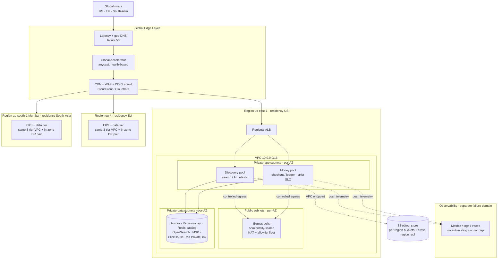
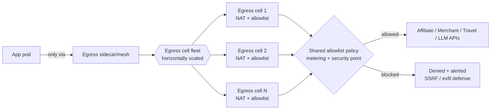

# 09 — Cloud Architecture

**Status:** 🟢 Draft-complete (R4-remediated) · **Owner:** Cloud Architect + DevOps · **Depends on:** [04](04-system-architecture.md)

---

## 0. Purpose & scope

This document defines **where and how NEXUS runs**: the cloud provider posture, network topology, compute fabric, managed data services, multi-region strategy (including the **phased global rollout** and **multi-currency/i18n** infrastructure), elasticity, reliability, cost architecture (FinOps, including **AI unit-cost governance**), cloud security posture, and observability infrastructure. It is the physical realization of the logical [System Architecture](04-system-architecture.md) and honors the NFRs in [SDD §5](02-software-design-document.md#5-non-functional-requirements-nfrs).

All subsystems in this document also obey the cross-cutting **platform engineering principles** of [ADR-0010](adr/ADR-0010-platform-principles.md) — provider abstraction (portability), health checks consumed by orchestration/failover, and metrics/observability on every service — called out at the relevant sections (§1, §8, §11).

It does **not** cover CI/CD pipelines, release strategy, or environment promotion mechanics in depth — those are [10 — Deployment Architecture](10-deployment-architecture.md). It does **not** re-specify identity, encryption, or threat modeling — those are [08 — Security Architecture](08-security-architecture.md); this document references them.

**Convention.** Every material decision follows: **Options → Decision → Trade-offs → Risks → Assumptions → Scalability → Implementation**, and uses RFC-2119 keywords (**MUST**, **SHOULD**, **MAY**).

---

## 1. Cloud provider decision (ADR-0003)

### Options

| Criterion | **AWS-primary (MC-capable)** | GCP-primary | Azure-primary | Multi-cloud day 1 |
|-----------|------------------------------|-------------|---------------|-------------------|
| Managed Kubernetes | EKS (upstream K8s) | GKE (best-in-class) | AKS | per-cloud |
| Managed Kafka | **MSK** (real Apache Kafka) | Confluent marketplace only | Event Hubs (Kafka-API shim) | per-cloud |
| Managed search | **OpenSearch Service** (native) | self-host / marketplace | self-host / marketplace | per-cloud |
| Postgres | Aurora / RDS | Cloud SQL / AlloyDB | Azure DB for Postgres | per-cloud |
| Residency US/EU/AP-South | **all GA incl. ap-south-1 Mumbai** | GA (Mumbai/Delhi) | GA (Central India) | best spread |
| AI/GPU breadth | broad GPU + Bedrock optional | TPU + GPU | GPU + Azure OpenAI | best-of-breed |
| Cost levers | Graviton, Spot, Savings Plans | sustained-use, committed-use | reserved, savings | fragmented |
| Egress cost | high (watch-item) | competitive | high | worst |
| Lock-in risk | medium (mitigated) | medium-high (BigQuery gravity) | medium-high (AD/enterprise) | lowest / highest ops |
| Operational tax | moderate | moderate | moderate | **highest** |

### Decision

NEXUS **MUST** run **AWS-primary, multi-cloud-capable**. Rationale: AWS offers the **broadest exact-match** to our chosen open engines — MSK is genuine Apache Kafka, OpenSearch Service is the AWS-originated fork we already standardized on ([SDD §6](02-software-design-document.md#6-technology-stack--decisions-with-alternatives)), Aurora speaks the PostgreSQL wire protocol — and it has **GA regions in all three residency zones**, satisfying **NFR-PRIV-01**. Full analysis: **[ADR-0003](adr/ADR-0003-cloud-provider.md)**.

**Anti-lock-in contract (how portability stays real)** — this is the cloud-plane realization of the **provider-abstraction / no-vendor-lock-in principle** ([ADR-0010](adr/ADR-0010-platform-principles.md) §§2–4: every major subsystem replaceable, every external provider behind an adapter):

1. Compute is **upstream Kubernetes on EKS** — not a proprietary compute PaaS. Workloads are pod specs, not vendor primitives.
2. **All** infra via **Terraform**; **all** deploys via **Helm/Kustomize**. No console-clicked or provider-locked-pipeline resources.
3. Every managed data service wraps an **open-source engine** (Postgres, Redis, Kafka, OpenSearch, ClickHouse) that can be self-hosted on K8s or re-platformed to another cloud.
4. Provider-specific **data-plane** services (KMS, Secrets, SQS-if-used, S3) sit behind **narrow internal adapter interfaces** (ports/adapters). Application code depends on capabilities, not AWS SDKs. CI **MUST** fail on direct SDK use outside approved adapter packages — the same adapter-boundary lint that enforces [ADR-0010](adr/ADR-0010-platform-principles.md) as a CI fitness function.
5. **Control-plane lock-in is in scope, not just the data-plane SDK** ([ADR-0019](adr/ADR-0019-portability-ops-maturity.md), R-012; ADR-0022 NC-9). The AWS **control-plane** dependencies — **IRSA** (pod identity), **Global Accelerator** (anycast ingress), **Route 53** (latency/geo DNS + health checks), **Shield** (DDoS), **Control Tower** (landing zone), **Config/SCP** (org guardrails) — are each either **behind an internal abstraction** (identity, ingress-routing, DNS/health, edge-protection, org-policy ports) **or carry a documented per-cloud equivalent in the exit runbook** (e.g. IRSA→GKE Workload Identity / AKS Workload Identity; Global Accelerator→GCP Cloud Load Balancing anycast / Azure Front Door; Route 53→Cloud DNS / Azure DNS + traffic manager; Shield→Cloud Armor / Azure DDoS Protection; Control Tower→Landing-Zone equivalent; Config/SCP→Org Policy / Azure Policy). The §10 cloud-security posture (IRSA, SCP, Config, Control Tower, Shield) and the §6 routing plane (Route 53 + Global Accelerator) are therefore **exit-mapped**, not assumed-portable.
6. **Portability is tested, not asserted** ([ADR-0019](adr/ADR-0019-portability-ops-maturity.md), R-012). "Multi-cloud-capable" is only true if it is proven: a CI **portability check MUST fail on un-abstracted provider use — data-plane SDK *and* control-plane** (upgrading the item-4 lint to a fitness gate that also flags un-abstracted IRSA/GA/Route 53/Shield/Control Tower/Config/SCP use), and a documented **exit runbook** — re-platforming a region onto the portable Postgres / self-hosted-engine path **and onto the per-cloud control-plane equivalents above** — is **periodically rehearsed as a game-day**, not merely written down. DR RTO/RPO is validated on the **portable Postgres path** (not only Aurora features), so the exit claim is real (§6, [ADR-0016](adr/ADR-0016-region-residency-lifecycle.md) R-036).

### Trade-offs

We pay a small, permanent **portability tax** (no proprietary shortcuts, adapter indirection) in exchange for pricing leverage and exit optionality — and we pay for **exercising** that exit path (rehearsed re-platform game-days) so it stays real rather than aspirational. We accept AWS **egress pricing** as a structural cost risk to be actively governed (§9).

### Risks

- **R-CLD-01** Managed-service premium (MSK/OpenSearch Service) exceeds self-host at scale → re-evaluate at capacity milestones with a build-vs-buy gate.
- **R-CLD-02** Subtle lock-in creep via convenience APIs **or control-plane services** → guardrail: adapter-boundary CI lint **plus a CI portability check that fails on un-abstracted provider use — data-plane SDK *and* control-plane (IRSA/GA/Route 53/Shield/Control Tower/Config/SCP) — and a rehearsed exit-runbook game-day covering the per-cloud control-plane equivalents** ([ADR-0019](adr/ADR-0019-portability-ops-maturity.md), R-012; ADR-0022 NC-9) — portability is proven, not asserted.
- **R-CLD-03** Egress bill surprise → guardrail: per-service egress budgets + alerts before GA.

### Assumptions

- AWS retains compliant GA regions in US, EU, and South-Asia for the life of Phase 1 (A1, PROJECT_MEMORY).
- Bangladesh residency is legally satisfiable by **ap-south-1 (Mumbai)** at launch; a local/edge PoP is a later option if regulation tightens.

### Scalability

Upstream K8s + open engines means scaling is a matter of node groups, shards, and partitions — none of which is provider-gated. A second cloud can be added region-by-region for a specific residency or cost need without re-architecting.

### Implementation

Terraform root modules per region; a shared "landing zone" (accounts, org, guardrails); Helm umbrella charts per environment. Bootstrapping sequence and pipeline detail: [10](10-deployment-architecture.md).

---

## 2. High-level cloud topology

Global edge terminates at the nearest PoP; requests route to the nearest healthy region; each region is a self-similar multi-AZ VPC with public / private-app / private-data subnet tiers.

Every region is **structurally identical** (three subnet tiers × ≥3 AZs) and carries an **in-zone DR pair** for the money/PII plane (§6). Residency is enforced by pinning a user's data-of-record to their home region (§6). To eliminate systemic blast radii ([ADR-0017](adr/ADR-0017-blast-radius-isolation.md)): outbound traffic leaves through **horizontally-scaled egress cells** rather than one chokepoint (§4); **discovery (search/AI, elastic) and money (checkout/ledger, strict-SLO) run on separate node pools/clusters** so a discovery surge cannot starve or couple the money path (§3); and the **observability stack sits in a separate failure domain** off the critical path — the thing that autoscales the app cannot depend on the app being up (§11).

---

## 3. Compute

### Options

| Option | Fit | Rejected because |
|--------|-----|------------------|
| **EKS managed node groups + Fargate + selective Lambda** | Matches modular-monolith + extracted services + spiky/edge work | — chosen |
| EKS-only (no serverless) | Simpler mental model | wastes money on spiky/bursty and trivial glue workloads |
| Serverless-only (Lambda/Fargate) | Zero node ops | poor fit for stateful, long-lived, latency-critical Go/Java services and GPU AI |
| Self-managed K8s on EC2 | Max control | node/control-plane ops burden with no portability upside over EKS |

### Decision

Compute **MUST** be tiered by workload shape **and split by blast radius** — discovery (elastic, best-effort) and money/handoff/ledger (strict-SLO) run on **separate node pools/clusters** so a discovery surge cannot starve or SLO-couple the money path ([ADR-0017](adr/ADR-0017-blast-radius-isolation.md), R-059):

| Workload | Placement | Why |
|----------|-----------|-----|
| Modular-monolith core (NestJS/TS) | **EKS on-demand + Savings-Plan node group** | steady, latency-sensitive, stateful-ish |
| Extracted services — Search, Price, Travel (Go) | **EKS discovery pool, autoscaled node group (Graviton where possible)** | QPS-elastic, CPU-bound fan-out |
| Checkout / handoff / ledger (money path) | **EKS money pool — isolated node pool/cluster, strict SLO** | must not be starved by discovery elasticity ([ADR-0017](adr/ADR-0017-blast-radius-isolation.md) R-059) |
| Feed ingestion (Go + Kafka consumers) | **EKS Spot node group + KEDA (discovery pool)** | interruptible, bursty, event-driven ([§7](#7-scalability--elasticity)) |
| AI serving / agent (Python) | **GPU/inference node group (warm floor)** *or* **managed inference** behind the AI gateway | expensive; cost-routed ([§9](#9-cost-architecture-finops)); interactive first-token SLO |
| Spiky/edge async jobs, webhooks, image transforms | **Lambda / Fargate** | scale-to-zero, no idle cost |
| BFF / static / personalization-light | **CDN edge + edge functions** | latency, offload origin |

**Serverless policy:** use Lambda/Fargate for **spiky, event-triggered, or scale-to-zero** work (webhook receivers, feed-file processors, thumbnailing, scheduled reconciliation). **MUST NOT** place hot p95-critical request paths on cold-start-prone Lambda; those stay warm on EKS.

**AI/GPU policy:** GPU nodes are the single most expensive compute line. NEXUS **SHOULD** default to the **model-agnostic AI gateway** ([05](05-ai-architecture.md), [ADR-0005](adr/ADR-0005-ai-model-gateway.md)) routing cheap-model-first; self-hosted GPU inference is justified **only** when unit economics beat managed APIs at volume. GPU node groups **MUST** be isolated (taints/tolerations) and use Spot for batch/eval workloads. **A minimum warm GPU floor MUST stay hot for the interactive agent path** so the first-token 1.2 s SLO holds ([ADR-0017](adr/ADR-0017-blast-radius-isolation.md), R-078); **scale-to-zero applies only to batch/eval — never the interactive path** (a cold GPU cannot meet first-token latency).

**Edge policy:** the BFF and static assets **SHOULD** run at CDN edge; personalization that needs user data stays regional for residency.

### Trade-offs
Three compute modes (nodes / serverless / edge) add operational surface; bounded by clear placement rules above.

### Risks
- Spot interruption on ingestion → mitigated by KEDA + Kafka consumer-group rebalancing + on-demand fallback pool.
- GPU scarcity in a region → capacity reservations for baseline; Spot/managed for burst.

### Assumptions
Graviton (ARM) compatibility validated for Go/Node services in staging before adoption.

### Scalability
Cluster-autoscaler + HPA + KEDA (§7). Node groups scale independently per workload class; the discovery and money pools scale on independent signals so neither can exhaust the other's capacity.

### EKS upgrade strategy ([ADR-0019](adr/ADR-0019-portability-ops-maturity.md), R-019)

There **MUST** be an explicit, rehearsed Kubernetes upgrade path — an unmanaged control-plane/n-1 skew is an operational SPOF:

- **Blue-green node groups:** a new node group on the target version is stood up alongside the old; workloads drain-migrate (cordon + surge) and the old group is retired only after health holds. No in-place node upgrades on the money pool.
- **Surge upgrades + pinned add-on versions** (CNI, CoreDNS, CSI) upgraded in lockstep with a tested version matrix; the control plane leads, data-plane node groups follow within the supported skew.
- **Tested rollback per control-plane/n-1 skew:** the prior node group stays warm until the new version passes gates, so rollback is re-routing to the retained group, not a rebuild. Upgrade cadence is a **scheduled, rehearsed operation**, not ad-hoc.

### Implementation
Node groups declared in Terraform; taints/labels drive scheduling and enforce the discovery-vs-money pool split; Karpenter **MAY** replace the cluster-autoscaler for faster, cheaper bin-packing (evaluate in staging). Blue-green node-group upgrades and the version matrix are codified and game-day-rehearsed ([10](10-deployment-architecture.md)).

---

## 4. Networking

### VPC design

Each region has **one VPC** with three subnet tiers replicated across **≥3 AZs**:

| Tier | Contents | Ingress | Egress |
|------|----------|---------|--------|
| **Public** | ALB/NLB, NAT gateways, edge-facing only | from CDN/GA only | to internet |
| **Private-app** | EKS worker nodes, service mesh | from ALB only | via NAT (allowlisted) |
| **Private-data** | Aurora, ElastiCache, OpenSearch, MSK, ClickHouse | from app tier only, via PrivateLink/endpoints | **none to internet** |

- Data-tier subnets **MUST** have **no route to an internet/NAT gateway**. Managed services are reached over **VPC endpoints / PrivateLink**, keeping data traffic on the AWS backbone.
- Security groups are **default-deny**; app→data access is by SG reference, not CIDR.

### Egress control (SSRF defense — coordinated with [08](08-security-architecture.md))

NEXUS makes **many outbound authorized-API calls** (affiliate networks, merchant checkout APIs, travel APIs, LLM providers, licensed feeds). This is a **first-class attack surface** (SSRF, exfiltration) and a cost surface (egress bytes).

- All outbound traffic **MUST** traverse a **controlled egress path**: NAT → **egress firewall / forward proxy (e.g., AWS Network Firewall or Squid/Envoy egress gateway)** enforcing a **domain allowlist** of authorized partner endpoints.
- **Horizontally-scaled egress cells, not one chokepoint** ([ADR-0017](adr/ADR-0017-blast-radius-isolation.md), R-020). The allowlisted egress runs as a **fleet of egress cells** whose throughput scales horizontally; losing one cell **reroutes** to the others. The allowlist remains a single **metering/security control point** (one authorization policy), but it is **not** a single throughput ceiling or availability bottleneck for all outbound monetization traffic. This resolves the earlier "egress proxy is a SPOF" watch-item: HA is achieved by cellular scale-out, not just multi-AZ of one appliance.
- Workloads **MUST NOT** reach arbitrary internet hosts. New partner domains are added to the allowlist by change control ([08](08-security-architecture.md) owns the authorization policy; this doc owns the enforcement plumbing).
- The AI serving path and the feed-ingestion adapters — the two biggest outbound callers — route through the egress cells so URL targets are **validated against the allowlist**, blunting SSRF via user- or LLM-influenced URLs. Detailed SSRF threat model and request-signing live in [08](08-security-architecture.md); this document guarantees the **enforcement point** exists and is horizontally scalable.

### Service mesh (mTLS)

- East-west traffic inside the cluster **MUST** be **mTLS-encrypted** via a service mesh (Istio or Linkerd; Cilium/eBPF as a lighter alternative). This satisfies NFR-SEC-01 in-transit encryption *inside* the cluster and enables per-service authorization policies (aligns with the neutrality/attribution isolation in [04 §5.3](04-system-architecture.md#5-data-flow-patterns)).
- Mesh provides retries, circuit-breaking, and traffic-shifting used by [04 §7](04-system-architecture.md#7-cross-cutting-concerns) resilience patterns and by [10](10-deployment-architecture.md) progressive delivery.

### Edge protection

| Layer | Control |
|-------|---------|
| DDoS | AWS Shield Advanced (+ Cloudflare option) on all public endpoints |
| WAF | Managed + custom rules (OWASP CRS, bot rules) at CDN/ALB — policy owned by [08](08-security-architecture.md) |
| CDN | CloudFront/Cloudflare for static + cacheable API responses (feeds discovery cache-hit for NFR-PERF-01) |
| Bot/abuse | Rate-limit at gateway ([04 BFF](04-system-architecture.md)); WAF bot rules |

### Trade-offs / Risks / Assumptions
- Egress is a security/metering control point → made HA by **horizontally-scaled egress cells** ([ADR-0017](adr/ADR-0017-blast-radius-isolation.md), R-020), so it is **not** a single throughput ceiling or SPOF for outbound calls; losing a cell reroutes.
- Service mesh adds latency/complexity → choose eBPF/Linkerd if Istio overhead is unjustified; measure against NFR-PERF-03.
- Assumes partner endpoint set is enumerable and relatively stable (true for authorized-only sourcing, [ADR-0001](adr/ADR-0001-data-sourcing.md)).

### Scalability
NAT/egress gateways and ALBs scale horizontally per-AZ; PrivateLink endpoints scale with the managed service.

### Implementation
VPC, subnets, endpoints, Network Firewall rules in Terraform; mesh via Helm; allowlist as version-controlled config reviewed with Security.

---

## 5. Managed data services mapping

Every engine is chosen managed-on-AWS **for operational leverage**, with a **portability caveat** so [ADR-0003](adr/ADR-0003-cloud-provider.md) stays honest.

| Logical store ([04 Data](04-system-architecture.md#3-context--container-map-c4-level-2)) | AWS managed service | Why managed | Portability caveat |
|------|----------------------|-------------|--------------------|
| **PostgreSQL** (OLTP, ledger, catalog projections) | **Aurora PostgreSQL** (RDS as fallback) | HA, read replicas, backup, PITR | Aurora storage engine is proprietary; **MUST** keep to standard Postgres features + wire protocol; a plain-Postgres-on-K8s or Cloud SQL exit stays viable |
| **Redis** (hot price, cache, pub/sub) | **ElastiCache (Redis / Valkey)** — **two isolated clusters** | cluster mode, failover | Use OSS Redis/Valkey API only — no proprietary extensions. **Money/auth/rate-limit state is a *separate* cluster from the high-churn catalog-invalidation cache** ([ADR-0017](adr/ADR-0017-blast-radius-isolation.md), R-082) so a catalog cache stampede cannot evict session/auth state |
| **OpenSearch + vectors** (hybrid search) | **OpenSearch Service** | managed shards, snapshots | Native OSS engine; self-host on EKS or move to Elastic if needed |
| **Kafka** (event backbone, ingestion) | **MSK** (Apache Kafka) | genuine Kafka, no shim | Standard Kafka protocol; Confluent/self-host/Redpanda are drop-ins |
| **ClickHouse** (price analytics, lakehouse) | **Self-host on EKS via the ClickHouse Kubernetes operator** (default) **or ClickHouse Cloud** | analytics engine, cost-sensitive | OSS either way. Run via **operator with replication/quorum + PVC affinity** — a real HA story for this FinOps/analytics SoR ([ADR-0019](adr/ADR-0019-portability-ops-maturity.md), R-077); where HA is deferred, the store **MUST** be explicitly **rebuildable from Kafka**. Self-host keeps cost + portability; managed if ops load justifies |
| **Object store** (images, feed files, backups, lake) | **S3** | durability, tiering, lifecycle | S3 API is a de-facto standard (GCS/MinIO/R2 compatible); adapter-wrapped |

**Decision:** managed-first for stateful engines to protect a lean platform team; **ClickHouse self-hosted on EKS via the ClickHouse Kubernetes operator by default** (replication/quorum + PVC affinity — [ADR-0019](adr/ADR-0019-portability-ops-maturity.md) R-077) because it is the most cost-sensitive high-volume store and self-hosting preserves both cost control and portability, or **ClickHouse Cloud** where ops load justifies. **MSK, Aurora, ElastiCache, OpenSearch Service, S3** are managed. **Money/auth and catalog-invalidation Redis are separate clusters** ([ADR-0017](adr/ADR-0017-blast-radius-isolation.md) R-082). All access is via **private-data subnets over PrivateLink/endpoints** (§4).

**Trade-offs:** managed premiums vs. ops savings (R-CLD-01) — re-evaluated per engine at capacity milestones. **Risk:** Aurora feature-creep eroding portability → CI/schema review forbids Aurora-only features. **Assumption:** cross-region replication features of each service meet the RPO in §6. **Scalability:** covered per-engine in [04 §8](04-system-architecture.md#8-scalability-strategy) and [06 Database Architecture](06-database-architecture.md). **Implementation:** Terraform modules per engine; parameters, encryption (KMS, [08](08-security-architecture.md)), and replication set as code.

---

## 6. Multi-region strategy

### Region selection mapped to the phased rollout ([ADR-0007](adr/ADR-0007-phased-global-rollout.md), residency — NFR-PRIV-01)

Regions are **provisioned ahead of the markets they serve** — the platform is multi-region-ready from day 1, and we do not pay for idle regions, but infra **MUST lead**, not trail, each market open. Each market is gated by a **country feature flag** at the edge (Route 53/GA + flag service); enabling a market is a controlled flip, never a deploy, and is reversible (rollback = disable the flag).

**Region-before-market gate (MUST)** ([ADR-0016](adr/ADR-0016-region-residency-lifecycle.md), R-014/R-073). A market's country flag **cannot be enabled until its compliant region — including an in-zone DR pair — is provisioned and residency-tested**. This re-sequences infra **ahead of the P3/P4 opens** (EU/BD) that legally require in-region data, closing the earlier ordering hazard where multi-region infra landed after the markets needing it. Enforcement is at the **network layer: routing is default-deny to any region that has not yet been launched and residency-certified** — an un-launched region receives no user traffic even if a flag is misconfigured. Region bring-up is itself a rehearsed backfill/warm-up runbook (Kafka backlog drain, cache warm, projection catch-up), not a cold flag-flip ([ADR-0019](adr/ADR-0019-portability-ops-maturity.md), R-061; [10](10-deployment-architecture.md)).

Each phase's region is provisioned **with its in-zone DR pair** (a second, AZ-independent region **inside the same residency zone**) before the market's flag can flip — so money/PII survive a full-region loss **without** cross-residency failover ([ADR-0016](adr/ADR-0016-region-residency-lifecycle.md), R-013):

| Phase | Markets | AWS region(s) — **primary + in-zone DR pair** | Primary compliance |
|-------|---------|---------------|--------------------|
| **1** | United States | **us-east-1** + **us-west-2** (in-zone DR pair, US residency) | CCPA/CPRA |
| **2** | Canada · UK · Australia | **ca-central-1** (+ in-zone DR) · **eu-west-2 (London)** (+ EU/UK in-zone DR) · **ap-southeast-2 (Sydney)** (+ in-zone DR) | PIPEDA · UK-GDPR/DPA · AU Privacy Act (APPs) |
| **3** | European Union | **eu-west-1 + eu-central-1** (in-zone DR pair, EU residency) | GDPR (+ PSD2 is the merchant's, per [ADR-0006](adr/ADR-0006-referral-only-model.md)) |
| **4** | India · Bangladesh · Pakistan · Middle East | **ap-south-1 (Mumbai) + ap-south-2 (Hyderabad)** (in-zone DR pair, South-Asia residency) · **me-central-1** (+ in-zone DR) for ME | India DPDP · Bangladesh DPA (residency) · regional DPAs |
| **5** | Global expansion | added region-by-region via the identical Terraform region module, **each with its in-zone DR pair** | per-jurisdiction module |

> **Bangladesh residency:** satisfied by the **ap-south-1 (Mumbai) + ap-south-2 (Hyderabad)** in-zone pair at launch of Phase 4 — DR failover stays **within the South-Asia residency zone**, never cross-residency; a local/edge PoP is a later option if regulation tightens (Assumption A1). Each new region is a Terraform region-module instantiation subscribing to the global Kafka projection topics (§Scalability), and its flag stays **default-deny until the region + DR pair is provisioned and residency-tested** (Region-before-market gate).

### Multi-currency & i18n infrastructure (from day 1)

- **Currency service** — a central FX/rates service; every money object carries an explicit `currency`; display conversions are cache-backed with rate-staleness bounds. No implicit USD anywhere.
- **Locale/i18n at the edge** — CDN varies on locale; translation bundles served per-locale (incl. RTL for Arabic/Urdu in Phase 4); no user-facing string is hard-coded.
- **Region-specific affiliate routing** — the [Affiliate Gateway](adr/ADR-0008-affiliate-gateway.md) selects the correct network/program per user region; edge routing + gateway capabilities metadata drive this.

### Options

| Model | Consistency | Cost/complexity | Verdict |
|-------|-------------|-----------------|---------|
| Single region + CDN | strong | lowest | ❌ fails residency + availability |
| **Active-active reads, write-home (region-of-record)** | tunable | medium | ✅ chosen |
| Full active-active writes (multi-master) | hard (conflict resolution) | highest | ❌ premature; needed only if a market demands local writes at global scale |

### Decision

NEXUS **MUST** run **active-active for reads, write-home for writes**:

- Each user/tenant has a **home region of record** determined by residency. **Personal + ledger data is written and stored only in the home region** (residency guarantee). Residency is resolved at signup from verified signals with a **strict default**; a mis-set residency is change-controlled and audited ([ADR-0016](adr/ADR-0016-region-residency-lifecycle.md), R-074).
- **Read-optimized, non-personal data** (catalog, offers, prices, search indexes) is **replicated to all regions** so discovery is fast and locally available everywhere → serves **NFR-PERF-01** and **NFR-AVAIL-01**.
- **Residency-fenced AI (MUST)** ([ADR-0016](adr/ADR-0016-region-residency-lifecycle.md), R-010). The AI Gateway ([05](05-ai-architecture.md), [ADR-0005](adr/ADR-0005-ai-model-gateway.md)) tags every request with the user's residency; **PII-bearing inference is pinned to an in-region model** (in-region hosted OSS or a residency-compliant endpoint), and **out-of-region model calls for PII are hard-blocked** at the gateway — reinforced by the network default-deny to unlaunched/foreign regions. Cheapest-capable routing selects only among **residency-eligible** models.
- **Routing:** **Route 53 latency/geo policies + Global Accelerator** send users to the nearest healthy region; residency-bound requests are pinned home; routing to any un-launched/un-certified region is **default-deny**.
- **Replication:**
  - Catalog/offer/price projections: via **Kafka (MSK) → per-region OpenSearch/ClickHouse/Postgres projections** (already the CQRS path, [04 §5.1](04-system-architecture.md#5-data-flow-patterns)). **Scope note:** Kafka's low-RPO (near-zero) replication guarantee applies to the **in-zone DR pair** (same residency zone); it is **not** a cross-region/cross-residency RPO≈0 claim for personal/ledger data ([ADR-0016](adr/ADR-0016-region-residency-lifecycle.md), R-013).
  - Object store: **S3 Cross-Region Replication** for globally-needed **non-personal** assets only.
  - Home-region OLTP: **in-zone DR-pair replica** (same residency zone) for money/PII DR; any cross-region **read replica** is for **non-personal** data only (never cross-residency reads of personal data).

### Failover & targets

| Scope | Strategy | RTO | RPO |
|-------|----------|-----|-----|
| **Discovery (reads)** — NFR-AVAIL-01 99.95% | Multi-region active-active; DNS/GA reroutes on health failure | seconds–minutes (automatic) | ~0 for replicated **non-personal** read data |
| **Checkout (writes)** — NFR-AVAIL-02 99.9% | Home-region multi-AZ HA; on region loss **degrade to deep-link referral** ([SDD §9](02-software-design-document.md#9-failure--degradation-design)) + queue for later reconciliation | minutes | ≤ seconds (sync multi-AZ), ≤ minutes to the **in-zone DR pair** |
| **Home-region full outage** | Promote the **in-zone DR-pair region** (same residency zone — never cross-residency); pre-designated per [ADR-0016](adr/ADR-0016-region-residency-lifecycle.md) | ≤ 30 min (target) | ≤ 5 min (target), in-zone |

Graceful degradation is the safety net: checkout never hard-fails — it degrades to referral, preserving the core loop.

### Trade-offs / Risks / Assumptions
- Write-home adds cross-region latency for users far from home → mitigated by keeping only writes home; reads are local.
- In-zone DR pairs raise per-zone baseline cost (a second region per residency zone) → accepted: it is the only way money/PII survive a full-region loss **without** breaching residency via cross-zone failover ([ADR-0016](adr/ADR-0016-region-residency-lifecycle.md), R-013).
- **Risk:** residency leak via replicated data → guardrail: replication filters **MUST** exclude personal/ledger data from cross-region topics; asserted by test. AI residency fence hard-blocks out-of-region PII inference (R-010).
- **Risk:** market opened before its region/DR is ready → guardrail: **region-before-market gate** + **network default-deny to unlaunched regions** (R-014/R-073); the gate is a safety guard, **not** rollback-eligible.
- **Assumption:** the ap-south in-zone pair satisfies Bangladesh residency at launch (A1); revisit if a local PoP is mandated.

### Scalability
Add a region by instantiating the identical Terraform region module (**with its in-zone DR pair**) + subscribing its projections to the global Kafka topics — and only after the region-gate's residency test passes.

### Implementation
Route 53 health checks, GA endpoint groups, MSK replication (MirrorMaker2 / MSK Replicator), S3 CRR, **per-region default-deny routing until launch-certified**, and the **region-before-market flag gate** — all in Terraform + the flag service. In-zone DR promotion runbooks + residency-tested game-days in [10](10-deployment-architecture.md).

---

## 7. Scalability & elasticity

### Decision

Three cooperating autoscalers **MUST** be in place:

| Mechanism | Scales on | Applied to | NFR tie |
|-----------|-----------|-----------|---------|
| **HPA** (Horizontal Pod Autoscaler) | CPU / latency / custom (QPS) metrics | Search, Price, BFF, core APIs | NFR-SCAL-01 (5,000 QPS), NFR-PERF-01/03 |
| **Cluster Autoscaler / Karpenter** | pending pods / bin-packing | node groups (right-size + Spot) | cost (§9) + capacity |
| **KEDA** (event-driven) | **Kafka consumer lag**, queue depth | feed ingestion, async jobs | NFR-SCAL-02 (500M offers), backpressure ([04 §7](04-system-architecture.md#7-cross-cutting-concerns)) |

- Ingestion is **event-driven**: KEDA scales consumers on **Kafka lag**, scaling to near-zero when idle and bursting on feed-refresh storms — directly supports the three-tier freshness model ([SDD §8](02-software-design-document.md#8-data-freshness-strategy-a-defining-design-decision)) cost-effectively.
- Search nodes autoscale on **QPS + p95 latency** custom metrics (Prometheus adapter) to hold NFR-PERF-01 under the NFR-SCAL-01 target.

### Capacity planning (to NFR-SCAL-01)

- Baseline provisioned for steady QPS; **headroom** (target ~40% CPU) so autoscale reaction time never breaches p95.
- Load tests in staging **MUST** demonstrate 5,000 sustained search QPS at ≤400 ms p95 before GA (gate, [10](10-deployment-architecture.md)).
- OpenSearch shards + Kafka partitions sized for **NFR-SCAL-02** (500M+ offers) per [06](06-database-architecture.md).

**Trade-offs:** aggressive scale-to-zero (KEDA/Karpenter) trades a little cold-latency for large idle savings — acceptable for async, not for hot paths. **Risk:** autoscaler thrash → stabilization windows + min replicas. **Assumption:** metrics pipeline (§11) is itself HA (autoscaling depends on it). **Implementation:** HPA/KEDA manifests via Helm; Karpenter provisioners in Terraform.

### 7.1 Flash-sale surge admission & load-shed design

Reactive autoscaling (§7) holds the **steady** NFR-SCAL-01 envelope (5,000 sustained search QPS at ≤400 ms p95) and the ×5 diurnal peak. It does **not**, on its own, absorb a **flash-sale / campaign spike**: the [scalability simulation §2/§8](review/02-scalability-simulation.md#8-nfr-verdict-summary) models Black-Friday / Prime-Day-class events at **×10–15** over the diurnal peak (assumption G5b), which breaches 5,000 QPS **as early as ~10M MAU** (965 avg-peak × 10–15 ≈ 9.6K–14.5K QPS), not first at 100M. An instantaneous ×10 step arrives faster than cluster-autoscaler/Karpenter can add nodes, so pod-count elasticity alone would let latency collapse across the *whole* surface — including the money path — before capacity lands. Surge is therefore handled by an **explicit admission-control + load-shed design**, not by "surge headroom" prose. This is graceful degradation ([SDD §9](02-software-design-document.md#9-failure--degradation-design)) applied to **capacity**, and it protects **NFR-SCAL-01 / NFR-AVAIL-02** by shedding the *right* traffic instead of degrading everything equally.

Four cooperating mechanisms **MUST** be in place:

| Mechanism | What it does | Rough numbers |
|-----------|--------------|---------------|
| **1. Scheduled pre-warm / pre-scale** | Campaigns are calendar-known, so capacity is provisioned **hot before T-0**, never reactively. A scheduled scaler raises HPA/KEDA **min-replicas** and Karpenter/Cluster-Autoscaler floors on the discovery pool, the OpenSearch hot-search pool (§3, [06 §6](06-database-architecture.md#6-search-index-opensearch)), the catalog Redis cluster, and the **GPU warm floor** ahead of the window; a canary campaign-load replay validates the pre-warm. | Reserve headroom to **~3× the diurnal peak (≈ ×15 of average)** for the campaign window — i.e. cover the modeled ×10–15 spike with margin — then release on schedule. Pre-scale, not autoscale, is what makes capacity present at the first request. |
| **2. Priority load-shedding (protect money, shed to cached discovery)** | When demand exceeds even the pre-scaled floor, the platform **sheds by priority**, exploiting the discovery-vs-money pool split (§3, [ADR-0017](adr/ADR-0017-blast-radius-isolation.md)): the money/handoff/ledger path on its **isolated pool is never shed**; discovery **degrades to cache-only** (serve Redis/CDN cached results, suppress cache-miss live fan-out to OpenSearch); non-essential AI is shed to a **cheap tier / cached answer**; batch/eval GPU work is paused. | Non-essential AI sheds to cheap-tier, but the **protected grounding line (§9.1) is never shed**; discovery cache-only holds NFR-PERF-01 off the ≥85% hot corridor ([06 §7](06-database-architecture.md#7-caching-redis)) while the fan-out tier is protected. |
| **3. Request admission control / fair-priority queue** | A **concurrency limiter + fair-priority queue at the BFF/gateway** admits work by tier and fairness key (buy-intent > authenticated discovery > anonymous > bot), **before** expensive OpenSearch/AI work is dispatched. Excess low-priority load gets a fast cached-degraded response or a bounded "busy, retry-after", **not** an unbounded latency tail — this prevents congestion collapse where every request slows instead of a subset shedding cleanly. | Admission caps in-flight concurrency so **admitted money-path p95 stays within SLO** even while discovery is actively shedding; shedding happens at the edge, cheaply. |
| **4. Per-tier rate-limit tightening under surge** | A surge signal **dynamically tightens** the WAF/gateway rate limits (§4) per tier: scrapers/bots and abusive clients are throttled first; genuine authenticated buy-intent keeps generous limits. Tightening is a canaried config (per §4 / [10 §4](10-deployment-architecture.md#4-release-strategy--progressive-delivery)), reversible on surge exit. | Bot/anon tiers tighten hardest; the money/handoff tier is throttled last and least. |

**Tie to NFR-SCAL-01.** The 5,000-QPS/≤400 ms figure is a **steady-state** capacity target; the surge design is what keeps the platform within SLO on the **money path** when *instantaneous* demand exceeds that envelope by ×10–15, rather than certifying the platform for 15× steady QPS. The surge behaviour is a **release gate, not a hope**: the modeled figures carry ±50–100% error bars, so a **flash-sale surge test (×10–15) is a P2 load-test gate** and the baseline 5,000-QPS test a **P1 exit gate** ([10 §8, §12](10-deployment-architecture.md#8-reliability-engineering)) — both are UNEXECUTED design-time targets until run.

**Trade-offs:** pre-scaling to ~3× diurnal peak for a campaign window spends idle capacity briefly — bounded to the scheduled window and cheap beside a money-path SLO breach. **Risk:** mis-tuned shedding drops genuine buy-intent → the fairness key ranks buy-intent above discovery, and the money pool is out of shed scope entirely. **Assumption:** major campaigns are calendar-known ≥ hours ahead; an *unforecast* spike still degrades gracefully via mechanisms 2–4 (just without the pre-warm head start). **Implementation:** scheduled scaler (cron-driven KEDA `ScaledObject` floors + Karpenter provisioner limits) in Terraform/Helm; admission limiter + fair queue at the BFF (envoy/gateway concurrency + priority); surge-mode flag drives rate-limit tightening and the shed ladder; validated by the §8 / [10 §8](10-deployment-architecture.md#8-reliability-engineering) surge test.

---

## 8. Reliability

### Decision

| Practice | Requirement |
|----------|-------------|
| **Multi-AZ** | Every tier (app + data) **MUST** span ≥3 AZs; single-AZ deploys are prohibited in staging/prod |
| **Discovery availability** | Architecture **MUST** meet **NFR-AVAIL-01 = 99.95%** via multi-region active-active reads + CDN + multi-AZ |
| **Checkout availability** | **MUST** meet **NFR-AVAIL-02 = 99.9%** via home-region multi-AZ HA **and graceful degradation to deep-link** ([SDD §9](02-software-design-document.md#9-failure--degradation-design)) |
| **Graceful degradation** | Every dependency has a fallback ([04 §7](04-system-architecture.md), SDD §9): stale-price-with-badge, model failover, coupon-skip, referral checkout |
| **Health & readiness** | All pods **MUST** expose liveness/readiness; mesh + ALB drain unhealthy targets |
| **Backups/DR** | Automated backups + PITR (Aurora), snapshots (OpenSearch), tested restores; **money/PII DR via the in-zone DR pair** (same residency zone, never cross-residency); DR RTO/RPO per §6. DR RTO/RPO also **validated on the portable Postgres path** (ADR-0019 R-036), not only Aurora features |
| **Chaos engineering** | NEXUS **SHOULD** run periodic **game-days / chaos experiments** (AZ loss, region loss, partner-API outage, model outage) to validate the degradation paths are real, not theoretical |

**Availability math (informative):** 99.95% ≈ 4.4 h/yr downtime budget for discovery; 99.9% ≈ 8.8 h/yr for checkout. Multi-region reads make discovery robust to a full region loss; checkout's tighter budget is protected by degradation rather than heroics.

**Trade-offs:** ≥3-AZ everywhere raises baseline cost (data replicated 3×) — non-negotiable for the availability NFRs. **Risk:** untested degradation path fails when needed → chaos game-days are the mitigation. **Assumption:** partner outages are the most frequent real-world failure (hence [04 §6](04-system-architecture.md#6-integration-architecture-external) circuit breakers). **Scalability/Implementation:** SLOs and error budgets defined and monitored in [10](10-deployment-architecture.md); this doc guarantees the topology can meet them.

---

## 9. Cost architecture (FinOps)

Cost is a **first-class driver** ([Business Model §5](03-business-model.md); [04 driver #6](04-system-architecture.md#1-architectural-drivers)): AI/infra is the biggest variable cost, so the cloud design **MUST** make unit cost visible and controllable.

### Biggest levers (ranked)

| Lever | Why it dominates | Control |
|-------|------------------|---------|
| **AI inference (GPU / model APIs)** | most expensive per-request line | model-cascade cheap-first ([05](05-ai-architecture.md)), response caching, batching, **GPU warm floor for the interactive path** + scale-to-zero/Spot **for batch/eval only** (§3, [ADR-0017](adr/ADR-0017-blast-radius-isolation.md) R-078); **unit-cost per resolved query tracked to NFR-AI-02, inclusive of the protected grounding line (§9.1)** |
| **Data egress** | many outbound API calls + cross-region replication | egress allowlist chokepoint (§4) doubles as a metering point; prefer VPC endpoints (backbone) over NAT; regionally cache partner responses |
| **OpenSearch + Kafka (MSK)** | always-on, storage+throughput heavy | right-size shards/partitions, tiered/warm storage, retention policies; build-vs-buy re-eval (R-CLD-01) |
| **Compute idle** | over-provisioned nodes | Graviton, Spot (ingestion/batch/GPU-batch), Savings Plans (steady), Karpenter bin-packing, autoscale-to-zero |
| **ClickHouse storage** | high-volume price time-series | self-host + object-store tiering, TTL on cold partitions |

### Decision

- **Purchasing:** steady baseline on **Savings Plans/Reserved**; elastic + interruptible on **Spot**; **Graviton** default where compatible.
- **Caching everywhere** it removes an expensive call: Redis hot cache (price), CDN (discovery), AI response cache — each removes cost *and* latency (NFR-PERF-01, NFR-AI-02).
- **Cost observability:** every workload **MUST** be **tagged** (team/service/env/region); cost dashboards + **per-service budgets with alerts** (AWS Budgets / Cost Anomaly Detection surfaced into Grafana). Unallocated spend **MUST** be < 5%.
- **Unit economics:** the platform **MUST** compute **blended cost per resolved query** and expose it as a first-class metric tied to **NFR-AI-02**; a query whose serving cost exceeds budget triggers a cheaper routing/cache path, not a bigger bill.
- **Right-sizing** reviews run on a cadence; idle GPU and over-provisioned data tiers are the first targets.

**Trade-offs:** Spot/scale-to-zero add operational complexity and occasional cold latency — bounded to non-hot-path workloads. **Risk:** egress bill surprise (R-CLD-03) → budgets + anomaly alerts before GA. **Assumption:** model-cascade keeps blended AI cost within the NFR-AI-02 cap (validated by [05](05-ai-architecture.md) evals). **Scalability:** unit-cost visibility lets us scale volume without scaling cost linearly. **Implementation:** tagging policy enforced by Terraform + SCP (untagged resource = deny); budgets/anomaly detection as code.

### 9.1 AI cost governance ([ADR-0009](adr/ADR-0009-ai-cost-strategy.md))

The ratified target is **blended AI inference cost ≤ $0.01 USD per resolved shopping request**, enforced as a FinOps SLO (not a per-call hard fail). The cloud plane provides the observability + guardrails; the routing/caching mechanics live in [05 AI Architecture](05-ai-architecture.md).

**Grounding is a protected budget line ([ADR-0015](adr/ADR-0015-ai-trust-cost-integrity.md), R-006/R-050).** The claim-verification and guardrail passes that make NEXUS trustworthy are **carved out of** the $0.01 ceiling and **summed into** the true blended cost — they are a **first-class metered line, not a degradable one**. Cost-degrade **MUST NOT** disable grounding: it may reduce reasoning depth or route to a cheaper tier, but it **never** turns off truth-checking. The FinOps metric therefore reports blended cost **inclusive of** the protected grounding line, so the number is honest rather than flattered by silently dropping verification.

| Control | Cloud-plane responsibility |
|---------|----------------------------|
| **FinOps dashboard** | Real-time **blended cost/resolved-request** (**inclusive of the protected grounding/claim-verify line, broken out separately**), cache hit-rates (prompt/embedding/response/semantic), model-tier mix, and **cost-per-feature** — surfaced in Grafana from ClickHouse usage events + Cost Explorer. |
| **Cost anomaly detection** | AWS Cost Anomaly Detection + a custom detector on the blended-cost metric; deviation from baseline pages FinOps and can auto-trip the cheaper routing path. |
| **Protected grounding budget** | Claim-verification + guardrail-pass spend is a **carved-out, summed-in budget line** ([ADR-0015](adr/ADR-0015-ai-trust-cost-integrity.md), R-006/R-050); soft-throttle/degrade **MUST NOT** target it. The degrade path passes the **same** quality/eval gate as the primary (R-057), so cheaper never means ungrounded. |
| **Budget tracking — per-user / per-session / per-feature** | Usage events (tokens × model-rate) emitted per request into ClickHouse, aggregated on those three keys; exceeding a budget triggers **soft-throttle/degrade** (cheaper tier or cached answer) **of reasoning depth only**, never grounding, and never a hard user-facing failure. |
| **Cheapest-capable routing** | The AI Gateway ([ADR-0005](adr/ADR-0005-ai-model-gateway.md)) dynamically selects the cheapest **residency-eligible** model meeting the quality target; the cloud plane hosts OSS models (GPU **warm floor** for interactive, scale-to-zero for batch/eval only — §3) + brokers cloud model APIs. |

This makes NFR-AI-02 a concrete, dashboarded, alertable number **whose blended cost includes — and never sacrifices — the grounding line**, rather than an aspiration. **FinOps floor (sim §10):** the fixed HA + isolation floor (discovery/money pool split, warm-GPU minimum, per-region cells) makes unit economics **unprofitable below ~1M MAU** and worsens the small-scale floor by ~+25–40% — an accepted, disclosed trade for money-integrity and blast-radius isolation, monitored via burn-vs-milestone (risk R-025).

---

## 10. Cloud security posture

Owned in detail by **[08 — Security Architecture](08-security-architecture.md)**; this section states the **cloud-plane** posture only and defers policy.

| Concern | Cloud posture | Owner |
|---------|---------------|-------|
| **Identity / least-privilege** | **IRSA** (IAM Roles for Service Accounts) — each pod gets a scoped role, no node-wide creds; human access via SSO + short-lived roles | [08](08-security-architecture.md) sets policy |
| **Org guardrails** | **SCPs** (deny prohibited regions/services), **AWS Config** rules (drift/compliance), **Control Tower** landing zone | this doc plumbs, [08](08-security-architecture.md) defines rules |
| **Network isolation** | Private-data subnets, default-deny SGs, PrivateLink, **controlled egress allowlist (SSRF defense, §4)** | shared |
| **Encryption** | **KMS**-managed keys; at-rest on every store, in-transit TLS 1.3 + **mesh mTLS** (NFR-SEC-01) | [08](08-security-architecture.md) key policy |
| **Secrets** | Secrets Manager / External Secrets Operator → K8s; no secrets in images or env-in-repo | [08](08-security-architecture.md) |
| **WAF / DDoS / bot** | Shield Advanced + WAF at edge (§4) | [08](08-security-architecture.md) rules |
| **Audit** | CloudTrail (all regions) → central logging (§11); immutable | shared |

**Principle:** least-privilege by default, private-by-default networking, everything-encrypted, everything-audited. No cloud credential is long-lived where a short-lived role works. Detailed threat model, IAM policy, and compliance mapping: **[08](08-security-architecture.md)** — not duplicated here.

---

## 11. Observability infrastructure

Realizes **NFR-OBS-01** (100% distributed tracing of user-facing paths) at the infra level; SLO/alerting *policy* is [10](10-deployment-architecture.md).

### Decision

| Signal | Stack | Notes |
|--------|-------|-------|
| **Traces** | **OpenTelemetry** SDK/collector → Tempo/Jaeger (or X-Ray) | 100% coverage of user-facing paths (NFR-OBS-01); mesh auto-injects spans |
| **Metrics** | **Prometheus** (+ Thanos/AMP for long-term/global) → **Grafana** | feeds HPA/KEDA custom metrics (§7) and cost dashboards (§9) |
| **Logs** | Structured JSON → central logging (OpenSearch/Loki/CloudWatch) | correlated by trace ID |
| **Dashboards/alerts** | Grafana + Alertmanager → on-call | SLO burn-rate alerts ([10](10-deployment-architecture.md)) |

- **OpenTelemetry is the vendor-neutral instrumentation standard** — reinforces the anti-lock-in stance (swap backends without re-instrumenting).
- **Observability runs in a separate failure domain, off the critical path** ([ADR-0017](adr/ADR-0017-blast-radius-isolation.md), R-060). Metrics/logs/traces run on a **managed or dedicated cluster** distinct from the workload clusters, with **no autoscaling circular dependency** — the control loop that scales the app (HPA/KEDA consuming these metrics, §7) **MUST NOT** depend on the app being up, or a workload outage would blind the very autoscaler meant to recover it. This is why the stack is drawn as its own domain in the §2 topology.
- The observability stack **MUST** be **HA and independent** of the workloads it watches (autoscalers depend on it — §7).
- **Retention (indicative, tune with cost/compliance):** metrics 15 mo (downsampled), traces 7–30 d (sampled; 100% of errors/slow), logs 30–90 d hot + object-store archive; audit logs per compliance ([08](08-security-architecture.md)).

**Trade-offs:** full tracing has overhead/cost → tail-based + error-biased sampling keeps 100% *coverage* of paths without 100% *volume*. **Risk:** telemetry cost sprawl → it is itself a tagged cost center (§9). **Assumption:** OTel collectors are deployed as a DaemonSet/gateway per region. **Scalability:** Thanos/AMP for global metric aggregation across regions. **Implementation:** OTel collector + Prometheus + Grafana via Helm; retention/archival as code.

---

## 12. Environments footprint

High-level only; promotion mechanics, quality gates, and CI/CD are **[10 — Deployment Architecture](10-deployment-architecture.md)**.

| Environment | Purpose | Footprint | Data |
|-------------|---------|-----------|------|
| **dev** | fast iteration | shared cluster/namespace; scaled-down data tier | synthetic/anonymized only |
| **ephemeral preview** | per-PR review | short-lived namespace + seeded data, auto-torn-down | synthetic |
| **staging** | prod-like validation, load & chaos & **DR/residency** drills | **prod-shaped, smaller**; multi-AZ; **includes the regulated-region (ap-south-1) tier + its in-zone DR pair** so residency/DR is exercised before the P4 South-Asia open — staging is topology-identical to prod ([10 §envs](10-deployment-architecture.md), R-014) | anonymized; residency-safe |
| **prod** | live | full multi-region, multi-AZ, all managed services | real, residency-pinned (§6) |

- Environments are **isolated by AWS account** (org/Control Tower) — a blast-radius and IAM boundary.
- Each is instantiated from the **same Terraform modules** (parameterized), so staging genuinely predicts prod behavior.
- **Staging carries the regulated-region tier (MUST)** ([ADR-0016](adr/ADR-0016-region-residency-lifecycle.md) R-014; [ADR-0019](adr/ADR-0019-portability-ops-maturity.md)). Staging is **not single-region**: it stands up the **ap-south-1 (Mumbai) tier + its in-zone DR pair** so residency fencing (§6), in-zone DR failover, and the region-before-market bring-up runbook are **tested on the regulated region before the P4 South-Asia market opens**, not first exercised in prod. This keeps staging topology-identical to prod ([10 §environments](10-deployment-architecture.md)) and removes the earlier 09-vs-10 "single primary region" contradiction.
- **Ephemeral previews MUST scale to zero / auto-expire** to control cost (§9).

**Trade-offs:** account-per-env adds setup overhead vs. strong isolation — isolation wins. **Risk:** staging/prod drift → same-module IaC + drift detection (Config). **Assumption:** synthetic data is representative enough for load tests. **Implementation:** [10](10-deployment-architecture.md).

---

## 13. Risks, assumptions & trade-offs (consolidated)

| # | Item | Type | Impact | Mitigation |
|---|------|------|--------|-----------|
| R-CLD-01 | Managed-service premium (MSK/OpenSearch/Aurora) > self-host at scale | Risk | cost | build-vs-buy gate at capacity milestones; ClickHouse already self-hosted |
| R-CLD-02 | Lock-in creep via convenience APIs **or AWS control-plane** (IRSA/GA/Route 53/Shield/Control Tower/Config/SCP) | Risk | portability | adapter-boundary CI lint **+ CI portability check on data-plane *and* control-plane + rehearsed exit-runbook game-day with per-cloud control-plane equivalents** (ADR-0019 R-012, ADR-0022 NC-9); ADR-0003 guardrails |
| R-CLD-03 | Egress bill surprise (outbound API + cross-region) | Risk | cost | egress allowlist as metering point; VPC endpoints; per-service budgets/alerts |
| R-CLD-04 | Residency leak via cross-region replication | Risk | compliance (NFR-PRIV-01) | replication filters exclude personal/ledger; test-asserted; **AI residency fence hard-blocks out-of-region PII inference** (ADR-0016 R-010) |
| R-CLD-05 | Egress as SPOF or throughput ceiling | Risk | availability/perf | **horizontally-scaled egress cells** (ADR-0017 R-020) — reroute on cell loss; lightweight mesh; measure vs NFR-PERF-03 |
| R-CLD-06 | Spot interruption on ingestion/GPU-batch | Risk | reliability | KEDA + consumer-group rebalance + on-demand fallback |
| R-CLD-07 | GPU scarcity/cost in a region | Risk | cost/capacity | prefer managed inference via AI gateway; capacity reservations for baseline; **warm GPU floor for interactive first-token SLO** (ADR-0017 R-078) |
| R-CLD-08 | Discovery surge starves/couples the money path | Risk | availability (NFR-AVAIL-02) | **separate discovery vs money node pools/clusters + separate money/catalog Redis** (ADR-0017 R-059/R-082) |
| R-CLD-09 | Market opened before its compliant region + in-zone DR is ready | Risk | compliance (NFR-PRIV-01) | **region-before-market gate + network default-deny to unlaunched regions**; in-zone DR pair per zone; **staging carries the ap-south-1 regulated-region tier so residency/DR is tested pre-P4** (§12) (ADR-0016 R-013/R-014/R-073) |
| R-CLD-10 | Kafka "RPO≈0" misread as cross-region for personal/ledger data | Risk | compliance/DR | RPO≈0 scoped to **in-zone DR pair**; cross-residency personal-data replication excluded (ADR-0016 R-013) |
| R-CLD-11 | No EKS upgrade strategy; control-plane/n-1 skew | Risk | operational | **blue-green node-group upgrades + version matrix + tested rollback**, rehearsed cadence (ADR-0019 R-019) |
| R-CLD-12 | Self-hosted ClickHouse (FinOps SoR) HA gap | Risk | operational | **ClickHouse operator w/ quorum + PVC affinity** or Cloud, else explicitly rebuildable from Kafka (ADR-0019 R-077) |
| R-CLD-13 | Observability autoscaling circular dependency | Risk | availability | **separate failure domain, off the critical path** (ADR-0017 R-060) |
| R-CLD-14 | Cost-degrade silently cuts grounding/claim-verify | Risk | trust/ai-integrity | **grounding is a protected, summed-in budget line**; degrade path same eval gate (ADR-0015 R-006/R-050/R-057) |
| R-CLD-15 | Flash-sale ×10–15 spike breaches NFR-SCAL-01 (from ~10M MAU) | Risk | availability/perf | **surge admission & load-shed design (§7.1)** — scheduled pre-warm to ~3× diurnal peak, priority load-shed (protect money, shed to cached discovery), edge admission control + fair queue, per-tier rate-limit tightening; surge test is a P2 gate ([10 §8/§12](10-deployment-architecture.md#8-reliability-engineering)) |
| T-CLD-01 | Portability tax (no proprietary shortcuts) | Trade-off | velocity | accepted for pricing leverage + exit optionality |
| T-CLD-02 | ≥3-AZ everywhere triples some baseline cost | Trade-off | cost | required by NFR-AVAIL-01/02; non-negotiable |
| T-CLD-03 | Three compute modes (nodes/serverless/edge) | Trade-off | ops complexity | bounded by explicit placement rules (§3) |
| A-CLD-01 | AWS keeps compliant GA regions in US/EU/AP-South | Assumption | residency | monitor; ap-south-1 satisfies Bangladesh at launch |
| A-CLD-02 | Graviton compatible for Go/Node services | Assumption | cost | validate in staging before rollout |
| A-CLD-03 | Model-cascade holds blended AI cost within NFR-AI-02 | Assumption | cost | [05](05-ai-architecture.md) evals + unit-cost metric (§9) |

---

*Next: [10 — Deployment Architecture](10-deployment-architecture.md)*
