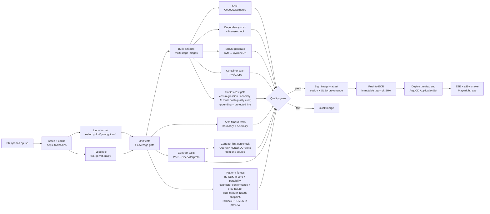
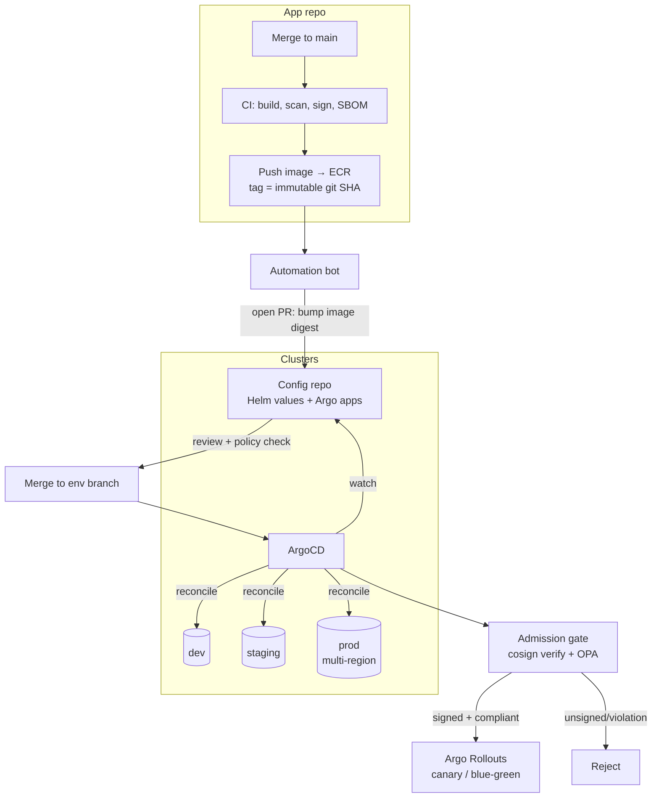
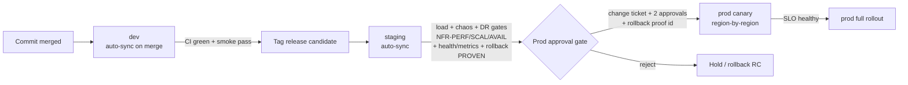
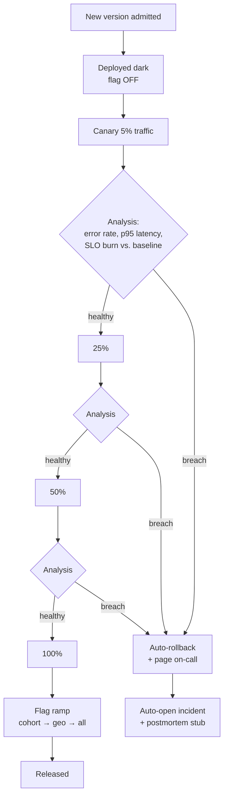
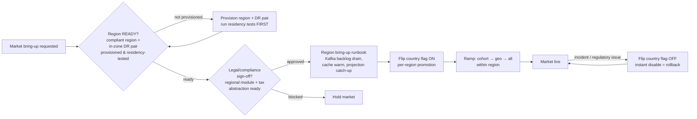
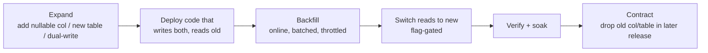
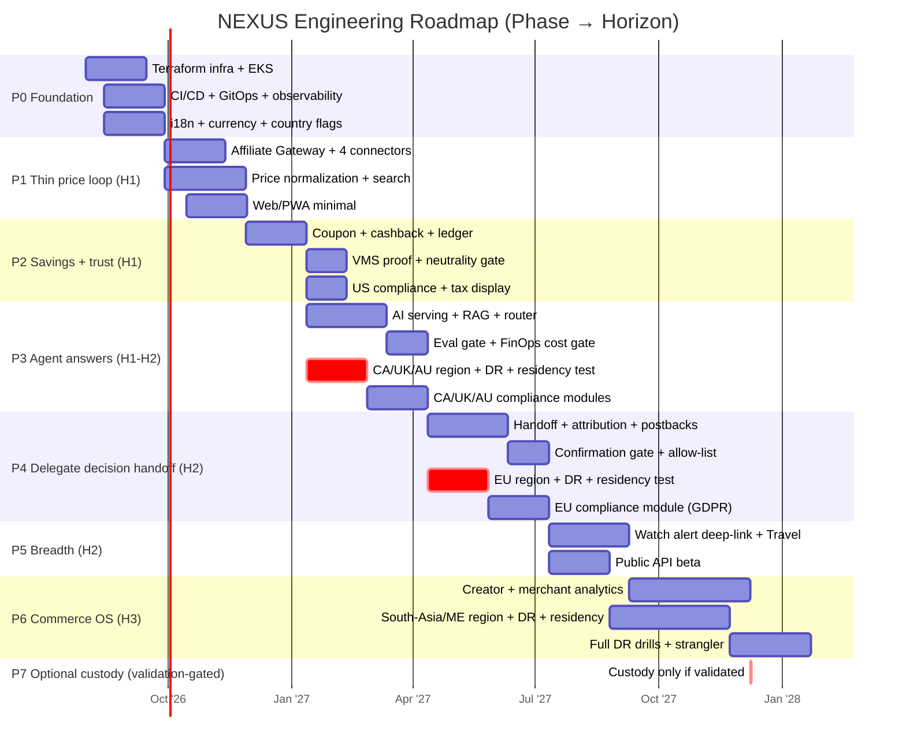

# 10 — Deployment Architecture

**Status:** 🟢 Draft-complete (R4-remediated) · **Owner:** DevOps + SRE · **Depends on:** [09](09-cloud-architecture.md)

---

## 0. Purpose & scope

This document defines **how NEXUS is built, verified, shipped, operated, and recovered** — the moving machinery between a merged commit and a request served in production. It consumes the cloud topology from [09 Cloud Architecture](09-cloud-architecture.md) (EKS, multi-region, networking, cost) and the structural decisions from [04 System Architecture](04-system-architecture.md) (modular monolith + a few Go/Python services), and it operationalizes the NFRs from [SDD §5](02-software-design-document.md#5-non-functional-requirements-nfrs) into **testable quality gates, SLOs, and release controls**.

It is the last of the ten foundational documents and therefore doubles as the **on-ramp to implementation** (§12): the phased build plan that turns the [Vision 3-horizon roadmap](01-vision.md#10-3-horizon-roadmap-outcome-not-feature-framed) into engineering milestones.

> **Normative language.** RFC-2119 keywords (**MUST**, **SHOULD**, **MAY**) mark requirements. Where docs 05–09 are authored concurrently, this doc references them by path/section and states the interface contract it depends on.

### 0.1 Deployment principles (the invariants every decision below serves)

1. **Everything reproducible.** Any environment, artifact, or release is rebuildable from Git + pinned inputs. No click-ops, no snowflakes.
2. **Progressive by default.** No change reaches 100% of users in one step. Blast radius is always bounded and observable.
3. **Automated rollback beats heroics — for *every* change type, and it is *proven*, not merely documented.** SLO breach → automatic revert, not a 3 a.m. page to "watch it." Beyond the request path, **every change ships with a rollback that has been executed and time-asserted** — code, config/flag, AI model/prompt/router-policy, DB schema, country/region flag, affiliate connector, or infra ([ADR-0010](adr/ADR-0010-platform-principles.md) principle #7; [ADR-0019](adr/ADR-0019-portability-ops-maturity.md) — *rollback is proven, not present*; procedures in §4.1). The CD gate is **not** "a rollback doc exists" but "the rollback ran in a preview env / game-day and restored service within its stated max time." When an operator must intervene by hand during an incident, GitOps self-heal is suspended via a scoped **break-glass** mode (§3) so the emergency fix is not silently reconciled away.
4. **Secure supply chain.** Every artifact is scanned, signed, provenance-attested, and admission-gated. Unsigned images MUST NOT run.
5. **Legitimacy & neutrality are release gates, not aspirations.** The boundary + neutrality fitness tests from [04 §10](04-system-architecture.md#10-fitness-functions-how-we-keep-it-healthy) block the pipeline like any other test.
6. **Observability is a build output.** A service is not "done" until it emits traces/metrics/logs and ships its SLOs, dashboards, and runbook (NFR-OBS-01).

---

## 1. Environments

### Options

| Option | Description | Verdict |
|--------|-------------|---------|
| Two environments (dev + prod) | Cheapest, fastest | ❌ No safe integration/perf surface; risky for a money-movement platform |
| Static dev/staging/prod | Classic three-tier | 🟡 Good, but slow feedback; every PR queues for shared dev |
| **dev + staging + prod + ephemeral preview envs** | Static integration tiers **plus** per-PR throwaway envs | ✅ **chosen** — fast PR feedback, isolated blast radius, prod-like staging |

### Decision

NEXUS **MUST** run five environment classes:

| Env | Purpose | Lifetime | Parity to prod | Data |
|-----|---------|----------|----------------|------|
| **local** | Inner-loop dev on laptop | Ephemeral | Docker Compose / `kind`; mocked externals | Synthetic fixtures only |
| **dev** | Shared integration, trunk-latest | Persistent | Same Helm charts, smaller node pools, single region | Synthetic + anonymized samples |
| **preview (ephemeral)** | Per-PR full-stack env for review + e2e | Auto-created on PR open, destroyed on merge/close | Namespaced on the dev cluster via ArgoCD ApplicationSet | Seeded synthetic dataset per env |
| **staging** | Pre-prod, release candidate, load/chaos/DR drills | Persistent | **Prod-identical** topology (multi-AZ, same instance types, prod-scale data volume) | Synthetic-at-scale + **masked** production shapes |
| **prod** | Live, multi-region | Persistent | — | Real data, geo-resident (NFR-PRIV-01) |

### Parity strategy

- **Same artifact, all envs.** The *identical* signed container image promoted from dev flows to prod. Only **config + secrets + scale** differ (12-factor). Rebuilding per-env is forbidden.
- **Same Helm charts**, parameterized by env `values-<env>.yaml`. Divergence between staging and prod topology MUST be caught by a drift check (§5.4) and is a release blocker.
- **Staging is the SLO proving ground.** NFR-PERF-01/03 and NFR-SCAL-01 are verified in staging *before* any prod promotion (§8).
- **Staging includes an ap-south-1 regulated-region tier (R-014, [ADR-0022](adr/ADR-0022-round2-remediation.md)).** Beyond the primary us-east-1 staging, staging carries an **ap-south-1 tier** so **data-residency and in-zone DR are exercised on the regulated South-Asia corridor *before* its market opens** (market Phase 4) and before the region-before-market gate (§4.2) can pass for it. This removes the doc 09 vs. doc 10 staging-topology contradiction — both docs now agree staging spans a regulated region, and the portability gate's control-plane-lock-in coverage (§2) is validated there too.

### Data handling (hard rule)

- **No production PII in any lower environment. Ever.** This is a Prime-Directive-level constraint tied to NFR-PRIV-01 and [08 Security §data-protection](08-security-architecture.md).
- Lower envs use: (a) fully synthetic data generators, or (b) **irreversibly masked/tokenized** production *shapes* (structure & volume, not values) produced by an offline masking job in a locked-down account. Emails, names, payment tokens, addresses, and ledger identities MUST be replaced with format-preserving fakes.
- The masking job's output is itself scanned for PII leakage (regex + entropy + named-entity check) before it may be loaded into staging.

### Config strategy

- **Config precedence:** chart defaults → `values-<env>.yaml` → ExternalSecret-injected secrets → runtime feature flags. No secrets in Git, no config baked into images.
- **Feature flags** (LaunchDarkly-style self-hosted or OpenFeature + flagd) carry per-env + per-cohort targeting and are the primary mechanism for decoupling *deploy* from *release* (§4).

### Trade-offs

Ephemeral preview envs cost compute and require rock-solid teardown automation (orphaned namespaces = cost leak). Staging at prod-scale is expensive but non-negotiable for a platform with 99.95% availability and money-movement correctness (NFR-AVAIL-01, [06](06-database-architecture.md)).

### Risks

- **Orphaned preview envs** inflate cost → mitigate with a TTL controller that garbage-collects any preview namespace older than 72 h or whose PR is closed.
- **Masking gaps** leak PII → mitigate with the leakage scanner as a gate and periodic audit sampling.

### Assumptions

- Cloud account structure (per-env AWS accounts, org SCPs) is provided by [09 Cloud Architecture](09-cloud-architecture.md). Assume separate `nexus-dev`, `nexus-staging`, `nexus-prod` accounts with least-privilege cross-account roles.

### Scalability

Adding a region or a new extracted service adds a `values` overlay and a pipeline target, not a new pipeline. ApplicationSets template preview envs, so PR throughput scales without per-env wiring.

### Implementation

`kind` + Compose for local; ArgoCD ApplicationSet generator (PR generator) for previews; Terraform workspaces per env-account; Helm value overlays under `deploy/helm/values/`.

---

## 2. CI pipeline

### Options

| Option | Verdict |
|--------|---------|
| Jenkins (self-hosted) | 🟡 Powerful but heavy plugin-maintenance burden |
| GitLab CI | 🟡 Strong, but ties us to GitLab SCM |
| **GitHub Actions + reusable workflows, self-hosted runners for heavy/build jobs** | ✅ **chosen** — where the code lives, OIDC to AWS (no static keys), ecosystem for SAST/SBOM/signing |

### Decision

CI runs on **every PR and every push to `main`**. It is a **fail-closed quality gate**: a red stage blocks merge (branch protection) and blocks promotion. Heavy jobs (container build, integration, load smoke) run on self-hosted runners in `nexus-ci`; light jobs on GitHub-hosted runners. Runners authenticate to AWS via **OIDC federation** — no long-lived cloud credentials in CI.

- **Hardened, ephemeral runners (MUST).** Per [ADR-0018](adr/ADR-0018-connector-security-hardening.md), self-hosted runners are **single-use and ephemeral** — spun up in an isolated `nexus-ci` account per job and destroyed after it, so no build state or credential persists between runs. OIDC tokens are **short-lived with tight audience + branch/ref conditions** (a token minted for a PR branch cannot assume a prod role); there are **no persistent runner credentials**. Every artifact carries SLSA provenance. This closes the self-hosted-runner credential-theft supply-chain vector (R-065).

### Pipeline stages



### Stage detail & the gates they enforce

| Stage | Tooling | Blocks on | Maps to |
|-------|---------|-----------|---------|
| Lint / format | eslint+prettier (TS), golangci-lint (Go), ruff+black (Py) | Any error | Code quality |
| Typecheck | `tsc --noEmit`, `go vet`, `mypy` | Any type error | Correctness |
| Unit tests | vitest/jest, `go test`, pytest | Fail or coverage < threshold (core modules ≥ 80%, ledger/attribution ≥ 90%) | SDD QA layer |
| Build | Docker BuildKit multi-stage | Build failure | §6 |
| **SAST** | CodeQL + Semgrep rulesets | High/critical finding | NFR-SEC-01, [08](08-security-architecture.md) |
| **Dependency scan** | `npm audit`/`osv-scanner`/`govulncheck` + license allowlist | Known critical CVE; disallowed license (GPL in proprietary) | NFR-SEC-01 |
| **SBOM** | Syft → CycloneDX, attached as attestation | SBOM generation failure | Supply chain (§6) |
| **Container scan** | Trivy + Grype | Critical OS/lib CVE with fix available | NFR-SEC-01 |
| **Arch fitness — boundary** | dependency-cruiser (TS), import-linter (Py), custom Go analyzer | Cross-module DB import or cross-boundary import ([04 §2](04-system-architecture.md#2-architecture-style--decision)) | [04 §10](04-system-architecture.md#10-fitness-functions-how-we-keep-it-healthy) |
| **Arch fitness — neutrality** | Golden-test: ranking output invariant under injected sponsorship deltas ([04 §5.3](04-system-architecture.md#53-neutrality-enforcement)) | Any reorder of neutral results by monetization signal | NFR-COMP-01, neutrality moat |
| **Adapter boundary — no provider SDK in core** | dependency-cruiser/import-linter rule banning any third-party provider SDK or provider schema import outside its adapter package | Provider SDK/schema leaks into the core domain | [ADR-0010](adr/ADR-0010-platform-principles.md) (§4), [ADR-0008](adr/ADR-0008-affiliate-gateway.md) |
| **Portability check** | Static rule failing on un-abstracted **cloud-provider** SDK/API use outside its infra-adapter (extends the no-SDK lint to AWS-proprietary control-plane calls — **incl. control-plane lock-in surfaces**: IRSA, Global Accelerator, Route 53, Shield, Control Tower, Config/SCP, each behind an abstraction or a documented per-cloud exit-runbook equivalent); paired with a periodically-rehearsed **exit/re-platform runbook** proven in a game-day | AWS-proprietary **data-plane *or* control-plane** call leaks past the portability seam un-abstracted; "multi-cloud-capable" left unproven | [ADR-0019](adr/ADR-0019-portability-ops-maturity.md) (R-012), [ADR-0022](adr/ADR-0022-round2-remediation.md) (NC-9), [ADR-0003](adr/ADR-0003-cloud-provider.md) |
| **CRD / API-deprecation scanner** | CI scans rendered Helm/Kustomize manifests + CRDs against the **API-deprecation schedules** of the target Kubernetes version and the installed platform operators (**Istio, Argo, Kyverno**); a manifest using a removed/deprecated `apiVersion` (or a CRD version past its deprecation window) fails the **upgrade gate** before the cluster bump lands | Any manifest/CRD referencing a deprecated or removed Kubernetes/Istio/Argo/Kyverno API on the target version | [ADR-0022](adr/ADR-0022-round2-remediation.md) (R-019), §5 EKS upgrade |
| **Connector-interface conformance (+ gray-failure)** | Contract/conformance suite run against every affiliate connector: implements the full interface (`catalog/feed sync`, `offer/price lookup`, `deep-link build`, `attribution stamp`, `postback ingest`, `health check`, `capabilities`) + declares license/region metadata; the suite injects **gray failures** — latency, partial responses, corrupt payloads, slow-drain — not just clean outages | A connector missing/mismatching an interface method or metadata, or misbehaving under a gray failure | [ADR-0008](adr/ADR-0008-affiliate-gateway.md), [ADR-0019](adr/ADR-0019-portability-ops-maturity.md) (R-062), [04 §6](04-system-architecture.md) |
| **Automatic-failover test (+ gray-failure)** | Connector outage/rate-limit **and gray failure** (injected latency, partial/corrupt response, slow-drain) asserts the Affiliate Gateway fails over to an alternate connector or cached data with no user-visible failure and no attribution loss/double-count | No SPOF fallback; failover loses or double-counts attribution; a *degraded* (not-dead) connector isn't shed | [ADR-0008](adr/ADR-0008-affiliate-gateway.md), [ADR-0019](adr/ADR-0019-portability-ops-maturity.md) (R-062), [SDD §9](02-software-design-document.md#9-failure--degradation-design) |
| **Health-endpoint presence** | Static + smoke check that every service exposes liveness, readiness, and dependency-health endpoints wired to the library chart probes | Any deployable service lacking a health/readiness endpoint | [ADR-0010](adr/ADR-0010-platform-principles.md) (§5), §7 |
| **Metrics/OTel presence** | Check that each service emits OpenTelemetry golden-signal metrics/traces on startup smoke | Service ships without metrics/trace export | [ADR-0010](adr/ADR-0010-platform-principles.md) (§6), NFR-OBS-01 |
| **Rollback PROVEN** | Not a presence check: the gate **executes** the change's rollback of the correct type (§4.1) in a preview env (or a scheduled game-day for slow/infra classes) and **asserts it restores service within its stated max time** — for code, config/flag, AI model/prompt/router, schema, region flag, connector, or infra | Any change whose rollback is undocumented **or fails to restore within its max time** when actually run | [ADR-0010](adr/ADR-0010-platform-principles.md) (§7), [ADR-0019](adr/ADR-0019-portability-ops-maturity.md) (R-064) |
| **FinOps cost gate** | Cost-regression/anomaly check vs. baseline; AI route/model/prompt changes must pass the blended cost-per-resolved-request cap **and** quality eval. **Grounding / claim-verification is a protected budget line** — carved *out* of the $0.01 cap and summed into true blended cost; the cost-degrade path is validated against the **same** quality eval as the primary (never an ungated fallback) | Cost regression/anomaly; AI change breaching the NFR-AI-02 cost cap; a change that funds cost by cutting grounding, or a degrade path that skips the quality gate | [ADR-0009](adr/ADR-0009-ai-cost-strategy.md), [ADR-0015](adr/ADR-0015-ai-trust-cost-integrity.md) (R-006, R-050, R-057), NFR-AI-02 |
| **License-tag coverage** | Static check that every ingestion adapter tags source+usage | Untagged ingest path | [04 §5.2](04-system-architecture.md#52-event-driven-feed-ingestion-the-legitimacy-boundary), ADR-0001 |
| **Contract tests** | Pact (consumer-driven) + OpenAPI/protobuf compat check | Breaking API/event schema change without version bump | [07 API](07-api-architecture.md), §10 |
| **Contract-first generation** | Check that OpenAPI, GraphQL SDL, and protobuf are **generated from the one canonical source** (not hand-authored in parallel) and are in sync; the canonical money type (integer minor-units + ISO currency) is code-generated into all runtimes | Any of the 3 contract formats authored/edited independently → money/i18n drift risk | [ADR-0020](adr/ADR-0020-performance-consistency-hardening.md) (R-040, R-041, R-042), [07 API](07-api-architecture.md) |
| E2E + a11y smoke | Playwright + axe-core on preview env | Broken core loop; WCAG 2.2 AA violation | NFR-A11Y-01 |

> **Why neutrality & boundary tests are CI gates, not audits.** [04 §10](04-system-architecture.md#10-fitness-functions-how-we-keep-it-healthy) declares these fitness functions; making them *pipeline gates* is what gives them teeth. A commit that lets a sponsorship signal reorder neutral results **MUST NOT** merge — the moat is enforced mechanically.

> **Why the platform-principles fitness functions are CI gates.** [ADR-0010](adr/ADR-0010-platform-principles.md) makes replaceability and operability *auditable fitness functions, not aspirations*, and [ADR-0019](adr/ADR-0019-portability-ops-maturity.md) sharpens several from *presence* to *proof*. The gates above — **no-provider-SDK-in-core** + **portability check**, **connector-interface conformance** and **automatic-failover** (now injecting **gray failures**, not just clean outages), **health/metrics-endpoint presence**, and **rollback PROVEN** — are the mechanical enforcement: a change that leaks a vendor SDK (affiliate *or* cloud-provider) into core, adds a connector that becomes a SPOF or misbehaves under latency/partial/corrupt responses, ships a service with no health check, or lands with a rollback that doesn't actually restore service in time **MUST NOT** merge. The **contract-first generation** gate enforces [ADR-0020](adr/ADR-0020-performance-consistency-hardening.md)'s single-source contract so money/i18n numbers can't drift across the 3 formats. The **FinOps cost gate** does the same for [ADR-0009](adr/ADR-0009-ai-cost-strategy.md)/[ADR-0015](adr/ADR-0015-ai-trust-cost-integrity.md): AI route/model/prompt changes prove cost **and** quality before promotion, with grounding walled off as a protected budget line that cost-degrade can never cut. The **doc-consistency lint** ([04 §10](04-system-architecture.md#10-fitness-functions-how-we-keep-it-healthy)) fails a build on retired/banned terms, dangling intra-repo anchors, or ADR-vs-doc status drift — introduced after adversarial reviews R4/R5 repeatedly caught *correct-ADR-but-stale-doc* defects; it makes that propagation-failure class a merge-blocking gate rather than a review round-trip.

### Trade-offs

A thorough gate set adds minutes to every PR. Mitigation: aggressive dependency caching, parallel job fan-out, and running the slowest suites (load smoke, full e2e) only on `main` / release candidates while PRs get the fast subset.

### Risks

- **Flaky tests erode trust in the gate** → quarantine lane + flake-rate dashboard; a test flakier than 1% is auto-quarantined and ticketed, never silently retried into green. **The probabilistic AI eval gate is explicitly *excluded* from auto-quarantine** ([ADR-0019](adr/ADR-0019-portability-ops-maturity.md), R-058): its variance is expected, so it is governed by **statistical thresholds with reported power** ([ADR-0015](adr/ADR-0015-ai-trust-cost-integrity.md), stratified eval), not treated as a "flaky" deterministic test to be silenced.
- **Scanner false-positives block delivery** → time-boxed, signed `.trivyignore`/suppression files with mandatory expiry and security-owner approval.

### Assumptions

Contract/consumer definitions come from [07 API Architecture](07-api-architecture.md); protobuf/OpenAPI schemas are the source of truth in a shared `contracts/` package.

### Scalability

Reusable composite workflows mean a new service inherits the full gate set by referencing one workflow file. Self-hosted runner pool autoscales on queue depth.

### Implementation

`.github/workflows/ci.yaml` (reusable) + per-service caller workflows; policy configs versioned in-repo (`.semgrep/`, `dependency-cruiser.config.js`, `.trivyignore`).

---

## 3. CD pipeline

### Options

| Option | Pros | Cons | Verdict |
|--------|------|------|---------|
| **Push-based** (CI runs `kubectl`/`helm upgrade`) | Simple, familiar | CI holds prod cluster creds; drift invisible; no single source of truth | ❌ |
| **GitOps — ArgoCD** | Declarative desired-state in Git; auto-reconcile & drift correction; pull-based (cluster has no inbound CI creds); rich UI + progressive-delivery ecosystem | Learning curve; another platform to run | ✅ **chosen** |
| GitOps — Flux | Lightweight, CNCF | Thinner UI, smaller progressive-delivery ecosystem than Argo Rollouts | 🟡 viable alternative |

### Decision

**GitOps with ArgoCD** is the single delivery mechanism. CI's job ends at **"produce a signed, attested artifact and open a PR to the config repo."** ArgoCD (running *inside* each cluster) pulls desired state and reconciles. No CI system ever holds production cluster credentials.

### GitOps break-glass mode (self-heal that knows when to stand down)

Continuous reconciliation is a hazard during an incident: an operator's emergency manual fix (a scaled replica count, a patched resource) is exactly the kind of drift ArgoCD auto-heals — so self-heal can **silently revert the fix mid-incident**. Per [ADR-0019](adr/ADR-0019-portability-ops-maturity.md) (R-018):

- **Break-glass freezes self-heal for a scoped resource.** Declaring break-glass (a logged, MFA-gated, auto-expiring action, tied to the §11 human-access path) **suspends auto-sync/self-heal for the named Application(s) or resource(s)** so an operator's emergency change persists instead of being reconciled away. Scope is minimal — the incident's blast radius, not the whole cluster.
- **Exit reconciles intentionally.** Leaving break-glass re-enables reconciliation and **converges to the Git desired state on purpose** — the operator must land the emergency fix (or its considered replacement) back into the config repo first, so exit doesn't re-trigger the outage. Break-glass entry/exit and every manual change under it are captured in the §11 evidence trail.
- **Break-glass is itself a rollback tool.** It is the sanctioned way to hold a hand-applied recovery in place while the durable GitOps fix is prepared, and is auditable end-to-end.

### Delivery flow



### Artifact registry & image identity

- **Registry:** Amazon ECR, one repo per service, **immutable tags = git commit SHA** (never `latest` in any deployable manifest). Digests, not tags, are pinned in Helm values.
- **Retention:** signed release images retained ≥ 1 year (compliance evidence, §11); untagged/preview images expire in 14 days.

### Image signing & provenance (supply chain)

- Every image **MUST** be signed with **cosign** (keyless, OIDC-backed Fulcio/Rekor) at the end of CI.
- CI emits **SLSA v1 provenance** (build L3 target) + a CycloneDX **SBOM**, both attached as cosign attestations.
- **Admission control** (Kyverno or OPA Gatekeeper + `cosign verify`) rejects any pod whose image is unsigned, lacks provenance, or fails policy. This is the enforcement point for principle #4.
- **Proven-rollback gate (MUST).** No change is promotable unless its rollback of the correct change type (§4.1) has been **executed and time-asserted**, not merely documented. CI runs the rollback in a preview env (or a scheduled game-day for slow/infra classes) and asserts restore-within-max-time (`Rollback PROVEN`, §2); the CD promotion PR **MUST NOT** merge into an env branch without a passing proof, and admission policy checks the corresponding rollback-proof metadata label (run id + measured restore time). This operationalizes [ADR-0010](adr/ADR-0010-platform-principles.md) principle #7 as sharpened by [ADR-0019](adr/ADR-0019-portability-ops-maturity.md) (R-064) — *a rollback that has never been run is not a rollback.*

### Helm charts

- One **library chart** (`nexus-common`) encodes org defaults: probes, resource templates, PodDisruptionBudgets, topology-spread, OTel sidecar/annotations, NetworkPolicy, ServiceMonitor. Each service is a thin chart depending on it.
- Umbrella `ApplicationSet` renders per-env, per-region Applications from the config repo.

### Promotion flow across environments



- **dev:** auto-sync on merge to `main`.
- **staging:** auto-sync of tagged release candidates; the SLO/load/chaos/DR gates (§8) must pass.
- **prod:** **manual approval gate** (§11) → progressive rollout (§4), **region by region** per the multi-region topology in [09](09-cloud-architecture.md).

### Trade-offs

GitOps introduces a config repo and an indirection (CI can't "just deploy"). The payoff: auditable history, drift correction, and clusters with no inbound CI credentials — a large security win for a money-movement platform.

### Risks

- **Config-repo becomes a bottleneck** → CODEOWNERS auto-approval for routine digest bumps to non-prod; humans only gate prod.
- **Registry outage blocks deploys** → cross-region ECR replication; cluster-local image cache for rollback targets.

### Assumptions

ECR, IAM/OIDC roles, and cluster bootstrap are provisioned by Terraform ([09](09-cloud-architecture.md)). ArgoCD is itself bootstrapped via Terraform (app-of-apps root).

### Scalability

New service = new thin chart + ApplicationSet entry. New region = new value overlay + Argo cluster registration. No pipeline rewrite.

### Implementation

`config-repo/` (Argo `Application`/`ApplicationSet`, per-env values); ArgoCD + Argo Rollouts installed via root app; Kyverno policies for signature/provenance admission.

---

## 4. Release strategy — progressive delivery

### Options

| Option | Use | Verdict |
|--------|-----|---------|
| Recreate / rolling only | Simplest | ❌ Full blast radius; no automated safety |
| **Canary (Argo Rollouts + metric analysis)** | Stateless request-path services (search, price, AI, gateway, core APIs) | ✅ default |
| **Blue/green** | Risky cutovers needing instant rollback (gateway, referral/handoff service) | ✅ where instant switch matters |
| **Feature flags** | Decouple deploy from release; cohort/geo/kill-switch control | ✅ cross-cutting, always on |

### Decision

**Deploy ≠ release.** Code ships dark behind flags; exposure is ramped by **canary + automated analysis**, with **blue/green** for cutovers that need an instant switch, and **feature flags** as the universal exposure + kill-switch layer. Every rollout has an **automated rollback on SLO breach** — no human in the critical revert path.



### Automated rollback on SLO breach

- Argo Rollouts **AnalysisTemplates** query Prometheus/OTel during each canary step: request error rate, p95 latency (NFR-PERF-01/03), saturation, and **SLO error-budget burn rate** (§7). Any breach beyond the guardrail → automatic abort + rollback to the last-good ReplicaSet, plus an auto-filed incident (§7.5).
- Flags provide a **second, instant kill-switch** independent of the deploy system: a bad feature is disabled in seconds without a redeploy.

### Cell- and capability-scoped config canaries

Not only *code* is progressively delivered — high-blast-radius **config** changes are canaried at the smallest safe unit, never flipped globally in one step ([ADR-0017](adr/ADR-0017-blast-radius-isolation.md); [ADR-0022](adr/ADR-0022-round2-remediation.md), R-020/R-009):

- **Egress allowlist — canaried per cell (R-020).** The network egress allowlist is a **versioned, per-cell** artifact, not one shared config flipped everywhere at once. An allowlist change rolls out **one cell at a time** behind the same analysis/abort machinery as a canary; a bad change is contained to a single cell and auto-reverted, instead of cutting egress platform-wide.
- **AI routing-policy — canaried per capability class (R-009).** An AI routing-policy change canaries **per capability class** (search-rank, agent-reason, claim-verify) *as well as* per region, so a bad policy for one capability cannot reach all capabilities simultaneously. Rollback repins the prior policy version for just the affected capability (§4.1), and the model-drift/cost canary (below) evaluates each capability's policy independently.

### 4.1 Rollback procedures by change type

> **The headline directive ([ADR-0010](adr/ADR-0010-platform-principles.md) principle #7, sharpened by [ADR-0019](adr/ADR-0019-portability-ops-maturity.md)).** *Every* architectural decision — and every change that lands from one — **MUST** ship with a **rollback that has actually been executed and time-asserted**, not just a written procedure. Rollback is not one mechanism; it is a **per-change-type discipline**. A change of any type below **MUST NOT** promote unless its rollback has been **run in a preview env (or scheduled game-day) and shown to restore service within its stated max time** (enforced as the CI `Rollback PROVEN` gate in §2 and the CD **proven-rollback gate** in §3). "The rollback has been proven to work" — not "a rollback doc exists" — is the **required CD gate**.

| Change type | Rollback mechanism | Max rollback time | How the rollback is tested |
|-------------|--------------------|-------------------|----------------------------|
| **Application code** | Argo Rollouts abort → revert to last-good ReplicaSet (canary/blue-green); GitOps revert of the digest-bump PR | Seconds (canary abort) → ≤ 5 min (Git revert reconcile) | Auto-rollback exercised every canary via AnalysisTemplate guardrails; blue-green switch-back drilled in staging |
| **Config / feature-flag** | Flip the flag off / restore prior flag value (OpenFeature + flagd) — no redeploy; instant kill-switch | Seconds | Flag toggle rehearsed per release; flag service failure defaults to last-known-good config (fails safe) |
| **AI model / prompt / router-policy** | Routing policy, prompt, model pin, and RAG config are **versioned config artifacts** — repin the prior version; shadow/A-B abort back to incumbent. A **model-drift canary** ([ADR-0015](adr/ADR-0015-ai-trust-cost-integrity.md)) runs a fixed golden-eval continuously against every third-party model version and can **auto-pin the prior model** on silent drift — this is the real-time detector that backs the "seconds" claim | Seconds (policy repin) → ≤ 5 min (config-repo reconcile) | Every AI change passes the eval gate **before** exposure; the drift canary is **wired into release** so rollback triggers on measured hallucination-rate or **cost-per-query** regression (same canary machinery), not on a hope; prior version kept warm ([ADR-0009](adr/ADR-0009-ai-cost-strategy.md), [ADR-0015](adr/ADR-0015-ai-trust-cost-integrity.md)) |
| **Database schema (expand→contract)** | Roll back the **app**, never the schema: expand steps are backward-compatible, so app N−1 runs against the expanded schema; the destructive **contract** step is a separate, later PR and only after soak | Seconds–minutes (app revert); schema stays forward-compatible | Expand/contract soak verified on staging; app N and N+1 both tested against the expanded schema; ledger/attribution tables append-only (no destructive DDL) — [06](06-database-architecture.md) |
| **Country / region feature flag** | **Disable** the country flag → market instantly removed from routing with **no deploy** ([ADR-0007](adr/ADR-0007-phased-global-rollout.md)). *Enabling*, by contrast, is **not** a cold flag-flip: it runs the region bring-up backfill/warm-up runbook (Kafka backlog drain, cache warm, projection catch-up) first — [ADR-0016](adr/ADR-0016-region-residency-lifecycle.md)/[ADR-0019](adr/ADR-0019-portability-ops-maturity.md), §4.2 | Seconds (disable) | Disable rehearsed per market bring-up as the standard market kill-switch (§4.2); enable rehearsed as a warm-up runbook, not asserted |
| **Affiliate connector** | Disable the connector via config/flag → Affiliate Gateway reroutes to alternate connectors or cached data (automatic failover, no SPOF); connectors pin an interface version ([ADR-0008](adr/ADR-0008-affiliate-gateway.md)) | Seconds | `automatic-failover` CI test proves reroute under **clean *and* gray failures** (latency/partial/corrupt/slow-drain — [ADR-0019](adr/ADR-0019-portability-ops-maturity.md), R-062) with no user-visible failure or attribution loss; connector disable + gray-failure drilled in staging game-days (§8) |
| **Infra (Terraform)** | `terraform apply` of the prior pinned module version / revert the IaC PR; `prevent_destroy` on data stores blocks destructive rollback; state is versioned per env-account-region. **EKS control-plane/node-group upgrades** roll back via **blue-green node groups** (drain back to the prior group) — [ADR-0019](adr/ADR-0019-portability-ops-maturity.md) | Minutes (plan+apply) — varies by resource | Plan reviewed pre-apply; drift check (§5) confirms convergence; destructive + upgrade changes gated + rehearsed in staging before prod (EKS blue-green upgrade cadence, §5) |

- **Rollback is the default, not the exception.** Per [ADR-0010](adr/ADR-0010-platform-principles.md), if a subsystem genuinely cannot support a tested rollback, that exception is itself an ADR with justification — it is never an unstated gap.

### 4.2 Country feature-flag rollout mechanics

Per [ADR-0007](adr/ADR-0007-phased-global-rollout.md), **enabling a market is a controlled rollout, not a deploy.** Every country is gated by a feature flag; the architecture is international from day one (multi-currency, i18n, regional compliance modules) so a new market is a configuration/enablement step, not a re-architecture.



- **Region-before-market gate (MUST).** Per [ADR-0016](adr/ADR-0016-region-residency-lifecycle.md), a country flag **cannot** be flipped on until the market's **compliant region — including its in-zone AZ-independent DR pair — is provisioned and residency-tested**, with network-layer routing default-deny to unlaunched regions. Compliance sign-off is necessary but **not sufficient**: the residency-fenced infrastructure must physically exist first, so write-home money/PII is never a single-region SPOF and PII inference can be pinned in-region. This re-sequences infra **ahead of** the P3/P4 market opens (§12).
- **Enabling a market = a flag flip gated by legal/compliance sign-off (MUST).** Beyond the region gate, the flag is not flipped until the **regional compliance module** (GDPR/CCPA/UK-GDPR/PIPEDA/BD-DPA/etc.) and **tax-abstraction** rules for correct all-in landed-cost display are in place and signed off by Security/Legal ([ADR-0007](adr/ADR-0007-phased-global-rollout.md), [08](08-security-architecture.md)).
- **Enabling is a rehearsed warm-up, not a cold flip.** Per [ADR-0019](adr/ADR-0019-portability-ops-maturity.md) (R-061), opening a region runs a **rehearsed backfill/warm-up runbook** — Kafka backlog drain, cache warm, read-model/projection catch-up — *before* the flag exposes users, so Day-1 traffic doesn't hit a cold region and a backlog storm. "Flip a flag" describes the *disable* path only.
- **Instant disable = rollback.** Disabling a country flag removes the market from routing in **seconds, with no deploy** — this is the market-level rollback path (§4.1) and the standard response to a regional incident or regulatory stop-order.
- **Per-region deploy / promotion.** Rollout is **region by region** (matching the multi-region prod topology in [09](09-cloud-architecture.md) and the canary promotion flow in §3); a market is ramped within its home region (cohort → geo → all) rather than switched globally at once.

### Database expand–contract (zero-downtime) migrations

Coordinated with [06 Database Architecture](06-database-architecture.md). Schema changes MUST be **backward-compatible across at least one release** so app N and N+1 run against the same schema during a canary:



- **Rules:** never rename/drop in the same release that stops using a column; migrations are **forward-only + reversible-by-design** (contract step is a *separate, later* PR); long migrations run as throttled online jobs, never blocking DDL on hot tables. Ledger/attribution tables (event-sourced, [04 §5.4](04-system-architecture.md#54-attribution--money-event-sourced)) are append-only, which sidesteps most destructive DDL.

### AI model / prompt release gating

AI is released like any other artifact **plus an eval gate**, tied to [05 AI Architecture](05-ai-architecture.md) eval gates:

- **Models, prompts, RAG configs, and router policies are versioned artifacts** (in the config repo / model registry), not ad-hoc changes. A prompt change is a PR.
- **Eval gate (blocks promotion):** offline eval suite MUST pass thresholds before any exposure — product-fact **hallucination rate < 0.5%** (NFR-AI-01), grounded-only claims, price-claim accuracy ≥ 99% (NFR-COMP-01), refusal/safety red-team pass, and **blended cost per resolved query ≤ $0.01 USD** ([ADR-0009](adr/ADR-0009-ai-cost-strategy.md), NFR-AI-02). Eval sets are **stratified** (tier × provider × class × locale) with reported statistical power, so the gate isn't underpowered ([ADR-0015](adr/ADR-0015-ai-trust-cost-integrity.md)). **Every route/model/prompt change MUST pass both the cost gate and the quality eval before promotion** — cost and quality are jointly gated, never traded off silently.
- **Grounding is a protected budget line ([ADR-0015](adr/ADR-0015-ai-trust-cost-integrity.md)).** Claim-verification / grounding passes are **carved out of** the $0.01 cap and **summed into** the true blended cost; the cost-degrade path **MUST NOT** disable grounding — it degrades reasoning/drafting depth, never truth-checking. The cheaper degrade path is itself run through the **same** quality eval as the primary (R-057), so cost is never bought with silent quality loss.
- **Model-drift canary wired into release ([ADR-0015](adr/ADR-0015-ai-trust-cost-integrity.md)).** A fixed golden-eval canary runs **continuously** against every third-party model version; silent drift trips an alert and can **auto-pin the prior model**. This is the real-time detector that makes the "rollback in seconds" claim (§4.1) true rather than aspirational, and it is part of the release surface, not a side dashboard. Mid-cascade escalation to another model **re-runs** the injection/safety scan on the new model (one-time scans don't carry across models).
- **Progressive AI rollout:** new model/prompt goes canary → **shadow/A-B** against the incumbent on live traffic (compare quality + cost + latency) → flag-ramp. Automated rollback triggers on a hallucination-rate or cost-per-query regression (fed by the drift canary above), same machinery as service canaries; routing policy is versioned config, so a bad policy repins to the prior version instantly (§4.1). **Routing-policy canaries roll out per capability class** (search-rank, agent-reason, claim-verify) as well as per region ([ADR-0017](adr/ADR-0017-blast-radius-isolation.md); [ADR-0022](adr/ADR-0022-round2-remediation.md), R-009), so a bad policy for one capability can't reach all capabilities at once — see *Cell- and capability-scoped config canaries* above.
- The model-agnostic router ([SDD §6](02-software-design-document.md#6-technology-stack--decisions-with-alternatives)) makes provider/model swaps a config change gated by the same evals.

### Trade-offs

Progressive delivery + expand/contract migrations demand engineering discipline (two-phase schema work, flag hygiene, eval maintenance). The cost buys near-zero-downtime releases and automated safety — mandatory for 99.9–99.95% availability and money movement.

### Risks

- **Flag debt** (stale flags = hidden complexity) → flags carry an owner + expiry; a "stale flag" report and cleanup are part of the sprint.
- **Canary metrics too noisy at low traffic** → for low-QPS services use longer analysis windows or blue/green instead.
- **Backfill overload** → throttled, off-peak, with consumer-lag/DB-load backpressure (aligns with [04 §7](04-system-architecture.md#7-cross-cutting-concerns)).

### Assumptions

SLO metrics and error-budget definitions (§7) exist and are queryable at canary time; flag service is itself HA (its outage must fail *safe* — default to last-known config).

### Scalability

Canary + analysis templates are reused across all services via the common chart. Flag targeting scales to per-geo/per-cohort without redeploys — essential for multi-region and phased geo launch.

### Implementation

Argo Rollouts (`Rollout` + `AnalysisTemplate`); OpenFeature + flagd (self-hosted, HA); model/prompt registry integrated with the AI eval harness from [05](05-ai-architecture.md).

---

## 5. Infrastructure as Code (IaC)

### Options

| Option | Verdict |
|--------|---------|
| Terraform (infra) + Helm (workloads) | ✅ **chosen** — matches [SDD §6](02-software-design-document.md#6-technology-stack--decisions-with-alternatives); mature, multi-cloud, huge ecosystem |
| Pulumi (general-purpose lang) | 🟡 nicer typing, smaller talent pool |
| CDK/CDK8s | 🟡 AWS-leaning; less portable than the multi-cloud-capable mandate ([ADR-0003](adr/ADR-0003-cloud-provider.md)) |

### Decision

**Terraform provisions infrastructure; Helm defines workloads.** Clean seam: Terraform owns anything that exists before/around Kubernetes (VPC, EKS, RDS/Aurora, MSK/Kafka, ElastiCache, ECR, IAM, KMS, DNS, S3); Helm (via ArgoCD) owns anything *inside* the cluster. No `kubectl apply` from Terraform.

### Structure

```
infra/                      # Terraform
  modules/                  # reusable: vpc, eks, aurora, msk, redis, ecr, iam, observability
  live/
    global/                 # Route53, org, ECR, IAM roles
    us-east-1/{dev,staging,prod}/
    eu-west-1/{staging,prod}/
    ap-south-1/{staging,prod}/  # Bangladesh/South-Asia corridor (Vision A1); staging = regulated-region tier for residency/DR before market Phase 4 (R-014)
deploy/helm/                # workloads
  charts/nexus-common/      # library chart
  charts/<service>/
  values/values-<env>.yaml
config-repo/                # GitOps desired state (Argo apps + rendered values)
policy/                     # OPA/Conftest/Kyverno policies
```

### Modules & environments

- **Reusable modules** with per-env inputs; environments are thin compositions, not copy-paste. Region/env parity is a module contract, so staging ≡ prod by construction.
- **Remote state:** S3 backend + DynamoDB lock, **one state per env-account-region**, encrypted with per-env KMS. State is never local, never shared across prod/non-prod.

### Drift detection

- **Terraform:** scheduled `terraform plan` in CI (read-only) on all `live/` stacks; any non-empty plan raises an alert and a drift ticket. Prod drift is a **change-management event** (§11).
- **Kubernetes:** ArgoCD is the drift detector for workloads — it continuously compares live vs. desired and either auto-heals (dev/staging) or flags **OutOfSync** for review (prod).

### Cluster lifecycle — EKS upgrade strategy

A control plane with no upgrade story is an outage waiting for a forced version bump. Per [ADR-0019](adr/ADR-0019-portability-ops-maturity.md) (R-019), EKS lifecycle is a **scheduled, rehearsed operation**, not an emergency:

- **Blue-green node groups.** Control-plane and node upgrades roll out on a **new (green) node group** running the target version + pinned add-on versions; workloads drain onto green under PDB/topology-spread guarantees, and rollback is a **drain back to the still-warm blue group** (the per-change-type infra rollback of §4.1). Surge upgrades keep capacity during the shift.
- **Pinned + skew-bounded.** Add-on (CNI, CoreDNS, kube-proxy, CSI) versions are pinned in Terraform; upgrades respect a tested **control-plane / n-1 node skew** with a rollback proven per step (the `Rollback PROVEN` gate, §2).
- **Deprecated-API pre-check blocks the bump.** Before any control-plane version bump, the CI **CRD / API-deprecation scanner** (§2 — [ADR-0022](adr/ADR-0022-round2-remediation.md), R-019) validates every rendered manifest and CRD against the target Kubernetes version's **and** the installed operators' (Istio/Argo/Kyverno) API-deprecation schedules; a manifest on a removed/deprecated `apiVersion` **fails the upgrade gate** so the cluster is never bumped into an API that its workloads still call.
- **Cadence.** Upgrades run on a scheduled cadence (staying within EKS support windows), rehearsed on staging first, and scored like a DR drill (§8). This is an [ADR-0016](adr/ADR-0016-region-residency-lifecycle.md) prerequisite too: a region isn't "provisioned" for the region-before-market gate until its cluster is on the supported, upgrade-rehearsed baseline.

### Policy-as-code (OPA / Conftest / Kyverno)

- **Plan-time (Conftest/OPA on `terraform plan` JSON):** no public S3, encryption-at-rest mandatory (NFR-SEC-01), no `0.0.0.0/0` on sensitive SGs, tags required (cost + ownership), no untagged data stores.
- **Admission-time (Kyverno/Gatekeeper):** signed-image-only, resource requests/limits required, no `:latest`, runAsNonRoot, read-only root FS, NetworkPolicy present, PII-labeled workloads pinned to compliant regions (NFR-PRIV-01).
- Policies run in CI (fail the PR) **and** in-cluster (fail admission) — defense in depth.

### Trade-offs

Terraform+Helm is two tools with two mental models (HCL verbosity, Helm templating). Accepted per SDD; mitigated by the library chart and module registry that hide most complexity.

### Risks

- **State corruption / accidental destroy** → state locking, `prevent_destroy` on data stores, plan review required, prod applies gated behind approval + Atlantis/CI (never local apply).
- **Policy gaps** → policy test suite (`conftest verify`) and periodic OPA rule review.

### Assumptions

Network/region/cost topology defined in [09 Cloud Architecture](09-cloud-architecture.md); this doc consumes those module outputs.

### Scalability

New region = new `live/<region>/<env>/` composition from existing modules. Policy set applies uniformly.

### Implementation

Terraform + `tflint`/`checkov`/`conftest` in CI; Atlantis (or CI-driven plan/apply with approval) for governed applies; Kyverno in-cluster.

---

## 6. Containerization

### Options

| Base image | Verdict |
|------------|---------|
| Full OS (ubuntu/debian) | ❌ Large attack surface, slow, more CVEs |
| Alpine | 🟡 Small but musl edge-cases (esp. Go cgo, Python wheels) |
| **Distroless (gcr.io/distroless) / scratch for Go** | ✅ **chosen** — minimal attack surface, no shell, smaller CVE exposure |

### Decision

All services use **multi-stage builds** producing **distroless** (TS/Python) or **scratch/distroless-static** (Go) final images, **non-root**, read-only root filesystem, no shell/package manager in the runtime layer.

### Per-language build pattern

- **Go (search, price, ingestion, travel):** builder stage compiles a static binary → `scratch`/`distroless-static`. Tiny images, fast cold-start (helps QPS autoscaling, NFR-SCAL-01).
- **TypeScript (core monolith, gateway):** builder installs+builds → runtime is `distroless/nodejs` with only `node_modules` prod deps + built output.
- **Python (AI serving):** builder resolves wheels in a venv → copy venv into `distroless/python3`. GPU/inference images pinned to a vetted CUDA base where required.

### Supply chain (provenance)

- Reproducible-ish builds: pinned base-image **digests** (not tags), pinned toolchain versions, `--no-cache` deterministic layers.
- Each build emits **SBOM (Syft/CycloneDX)** + **SLSA provenance**, signed with cosign (§3). Base images themselves are scanned and mirrored to ECR (no pulling unverified public images at deploy time).

### Per-service resource requests/limits

Every workload **MUST** declare requests + limits (Kyverno-enforced). Indicative baselines (tuned by load tests, §8):

| Service | Requests (cpu/mem) | Limits (cpu/mem) | Scaling signal |
|---------|--------------------|--------------------|----------------|
| API Gateway/BFF (TS) | 250m / 512Mi | 1 / 1Gi | RPS, p95 latency |
| Core monolith (TS) | 500m / 1Gi | 2 / 2Gi | RPS, CPU |
| Search (Go) | 500m / 512Mi | 2 / 1Gi | QPS, p95 (NFR-PERF-01) |
| Price Intelligence (Go) | 500m / 512Mi | 2 / 1Gi | queue depth, live-check rate |
| Feed Ingestion (Go) | 500m / 1Gi | 2 / 2Gi | Kafka consumer lag |
| AI Serving (Py) | 1 / 2Gi (+GPU as needed) | 2 / 4Gi | inflight requests, token throughput |
| Travel (Go) | 250m / 512Mi | 1 / 1Gi | QPS |

- **HPA** on the scaling signal above; **VPA in recommendation mode** to tune requests; **PodDisruptionBudgets** + topology-spread across AZs for availability (NFR-AVAIL-01).

### Trade-offs

Distroless means no in-container debugging shell → mitigate with **ephemeral debug containers** (`kubectl debug`) and out-of-band exec, keeping the runtime clean.

### Risks

- **Base-image CVE** → automated base bump PRs (Renovate) + rebuild pipeline; container scan gate catches regressions.
- **Right-sizing errors** → VPA recommendations + load-test-derived baselines; over/under-provisioning surfaced on cost + saturation dashboards.

### Assumptions

Node pool shapes (incl. GPU pools for AI) come from [09](09-cloud-architecture.md).

### Scalability

Common Dockerfile templates per language; the library chart standardizes probes/resources so a new service is production-shaped on day one.

### Implementation

`Dockerfile` templates per language; Renovate for base/dep bumps; Trivy/Grype gates; Kyverno resource/rootless policies.

---

## 7. Observability & SRE

> Operationalizes NFR-OBS-01 (100% distributed tracing), NFR-AVAIL-01/02, NFR-PERF-01/02/03, and the [SDD cross-cutting observability](02-software-design-document.md#7-cross-cutting-concerns) commitment.

### Decision

**OpenTelemetry is the single instrumentation standard** across TS/Go/Python: traces + metrics + logs, exported via the OTel Collector to the backend (Grafana stack — Tempo/Mimir/Loki — or managed equivalent). **100% of user-facing paths are traced** (NFR-OBS-01); trace/span IDs propagate through the gateway, monolith, extracted services, Kafka (context headers), and DB calls.

### Health checks & metrics are release gates (not just runtime niceties)

Per [ADR-0010](adr/ADR-0010-platform-principles.md) principles #5–6, **every component exposes health checks and metrics**, and this is enforced at build/deploy time, not merely assumed at runtime:

- **Liveness + readiness + dependency-health endpoints are REQUIRED per service.** The library chart (`nexus-common`) wires probes to these endpoints; the CI **health-endpoint presence** gate (§2) fails any deployable service that lacks them, and Kyverno admission (§5) rejects a pod whose container declares no probes. **A deploy blocks if the health or metrics endpoints are absent.**
- **Metrics/OTel export is REQUIRED per service.** The CI **metrics/OTel presence** gate (§2) fails a service that ships without golden-signal metrics/trace export — because the SLO gates below are unmeasurable without it.
- **These feed the gates already defined.** Readiness endpoints back the canary/rollout health checks (§4); dependency-health endpoints back the Affiliate Gateway's automatic failover ([ADR-0008](adr/ADR-0008-affiliate-gateway.md), §4.1); and the metrics they emit are exactly what the **SLO / error-budget burn-rate gates** (below, and the §4 auto-rollback) consume. Health/metrics presence is thus the *prerequisite* that makes the existing SLO/error-budget release gates enforceable — the chain is: endpoints present (CI/admission) → metrics flowing (§7) → SLO burn evaluated → release gated / auto-rolled-back (§4).

### SLOs / SLIs / error budgets (per service)

SLIs are measured at the edge (BFF) and per service. Error budget = `1 − SLO`; budget burn drives both alerting and release gating (§4).

| Service / journey | SLI | SLO | NFR |
|-------------------|-----|-----|-----|
| Core discovery (search read path) | Availability | 99.95% | NFR-AVAIL-01 |
| Search latency | p95 request latency (cached corridor) | ≤ 400 ms | NFR-PERF-01 |
| Live price refresh | p95 on-demand refresh | ≤ 1.5 s | NFR-PERF-02 |
| Agent | first-token latency p95 | ≤ 1.2 s | NFR-PERF-03 |
| Referral/Handoff service | Availability (graceful degrade to plain deep-link) | 99.9% | NFR-AVAIL-02 |
| AI quality | product-fact hallucination rate | < 0.5% | NFR-AI-01 |
| Price claims | audited claim accuracy | ≥ 99% | NFR-COMP-01 |
| Ledger/attribution | correctness (reconciliation mismatch) | 0 unreconciled | [06](06-database-architecture.md) |

- **Multi-window multi-burn-rate alerts** (fast-burn page, slow-burn ticket) per Google SRE practice. Error budget policy: budget exhausted → **feature freeze** on that service until reliability work restores headroom (release gate hook into §4).

### Dashboards & alerting

- **Per-service golden-signals** dashboards (latency, traffic, errors, saturation) + RED/USE; **per-SLO** burn dashboards; **business** dashboards (VMS/MAU, agentic handoff→conversion, coupon apply-success — the [Vision north-star](01-vision.md#4-north-star-metric--guardrails)).
- **Alerting** routed via Alertmanager → PagerDuty/Opsgenie. Alerts are **symptom-based (SLO burn)**, not cause-based noise. Every alert links to a runbook.

### On-call, runbooks, incidents

- **On-call:** **24×7 follow-the-sun coverage begins at P3** — the first non-US markets (CA/UK/AU) — **not** at H3 as originally scoped ([ADR-0019](adr/ADR-0019-portability-ops-maturity.md), R-063): the moment a market goes live in another timezone, someone must be awake for it. Primary + secondary; blameless culture. Full cross-region rotation broadens as more regions open (P4/P6).
- **Runbooks:** every alert and every service ships a runbook (dashboards, common failures, degradation levers from [SDD §9](02-software-design-document.md#9-failure--degradation-design), rollback command, escalation). A service without a runbook is not production-ready.
- **Incident management + postmortems:** tie into the org **incident-response discipline** — every production incident gets a structured record (timeline, impact, root cause, contributing factors, action items with owners) and a **blameless postmortem** for Sev1/Sev2. Postmortem action items are tracked to closure; a repeat incident with open actions is an escalation. Canary auto-rollbacks (§4) auto-open an incident stub so no silent revert goes un-reviewed.

### Trade-offs

100% tracing + high-cardinality metrics are expensive at 5,000 QPS (NFR-SCAL-01). Mitigate with **tail-based sampling** (keep all errors/slow traces, sample the fast happy path), metric cardinality budgets, and log-level tiering — without dropping below full *coverage* of user-facing paths (sampling ≠ gaps in instrumentation).

### Risks

- **Alert fatigue** → symptom-based SLO alerting only; quarterly alert review; page only on user-visible burn.
- **Observability backend as SPOF** → the platform's own SLOs; degrade to local buffering in the Collector on backend outage.

### Assumptions

OTel SDKs are wired in service scaffolds from day one (part of the library chart); backend sizing per [09](09-cloud-architecture.md) cost model.

### Scalability

OTel Collector runs as a horizontally-scaled gateway + node agents; sampling keeps cost sublinear to traffic.

### Implementation

OTel SDK + Collector; Grafana/Tempo/Mimir/Loki (or Datadog managed); Sloth/OpenSLO for SLO-as-code; PagerDuty + runbook repo; incident tooling (e.g., incident.io / rootly) with postmortem templates.

---

## 8. Reliability engineering

### Decision

Reliability is **verified before prod**, not hoped for. Load/perf, chaos, and DR are **pipeline and cadence gates**.

### Load / performance testing gates

- **Gate:** a release candidate **MUST** pass a staging load test at target scale before prod promotion — verifying **NFR-PERF-01** (p95 search ≤ 400 ms), **NFR-PERF-02/03**, and **NFR-SCAL-01** (sustained 5,000 QPS, horizontally scalable). This makes the [04 §10 latency SLO fitness function](04-system-architecture.md#10-fitness-functions-how-we-keep-it-healthy) a hard gate.
- **The 5,000-QPS ≤ 400 ms load test is a HARD, EXECUTED P1 exit gate — not a modeled claim.** NFR-PERF-01/SCAL-01 **cannot** be certified from the [scalability-simulation](review/02-scalability-simulation.md) figures: those are **planning estimates carrying ±50–100% error bars** and are **UNEXECUTED design-time targets until the test is actually run**. The P1 exit gate (§12) therefore **MUST NOT** pass until a k6/Gatling run **executes** the sustained-5,000-QPS / p95 ≤ 400 ms scenario against prod-scale staging data **and passes** — a green modeled number is explicitly **not** acceptable evidence. Until that run exists, NFR-PERF-01/SCAL-01 are recorded as *designed-and-modeled, not verified*.
- **Flash-sale surge test (×10–15) is a P2 exit gate.** The [surge admission & load-shed design](09-cloud-architecture.md#71-flash-sale-surge-admission--load-shed-design) (scheduled pre-warm, priority load-shed protecting the money path, edge admission control + fair queue, per-tier rate-limit tightening) **MUST** be exercised by a **surge test that drives a ×10–15 spike over the diurnal peak** and asserts: the money/handoff path stays within SLO, discovery degrades to cached results (not failure), and no congestion collapse. This is a **P2 gate** (the modeled sim shows flash-sale spikes breach 5,000 QPS from ~10M MAU, so surge behaviour is proven before scale, not after). Like the baseline test, it is an **UNEXECUTED design-time target until run**.
- Tooling: k6/Gatling scenarios modeling the core "best all-in price" loop + agentic handoff, run against prod-scale staging data. Results tracked over time to catch **performance regressions** release-over-release (regression matrix per the performance-governance discipline: ≥ 20 samples, isolated benchmark runs).

### FinOps / cost-regression gate

Per [ADR-0009](adr/ADR-0009-ai-cost-strategy.md), cost is a **governed, gated variable**, not an after-the-fact surprise:

- **Pipeline cost-regression / anomaly check (gate).** The pipeline runs a **cost-regression check** against baseline (the `FinOps cost gate`, §2): a release candidate that regresses blended **AI inference cost per resolved request** beyond the guardrail, or trips **cost-anomaly detection** vs. baseline, blocks promotion. This makes the **≤ $0.01 USD per resolved request** target (NFR-AI-02) an enforceable pipeline gate, backstopped at runtime by the FinOps SLO (rolling blended average) with soft-throttle/degrade — never a hard user-facing failure.
- **AI route/model/prompt changes are cost-**and**-quality gated.** As in §4, no routing-policy, model, or prompt change promotes without passing *both* the cost cap and the quality eval (cheapest-capable routing + cascade + multi-tier caching remain the mechanisms that hold the target).
- **Grounding is a protected budget line ([ADR-0015](adr/ADR-0015-ai-trust-cost-integrity.md)).** The cost gate computes the ≤ $0.01 blended target **excluding** claim-verification/grounding, which is summed into true cost but never throttled: the cost-degrade path degrades reasoning depth, never truth-checking, and the degrade path clears the **same** quality eval as the primary (R-006, R-050, R-057). A release that funds its cost headroom by cutting grounding fails the gate.
- **Continuously observed.** The FinOps dashboard (real-time cost/request, cache hit-rates, tier mix, per-user/session/feature budgets) is part of the observability surface (§7); anomaly alerts route like any symptom-based alert.

### Chaos experiments

- **Game-days** on staging (and, once mature, controlled prod blast-radius): kill pods/nodes, inject latency/errors into external partners (validates circuit breakers/bulkheads from [04 §6–7](04-system-architecture.md#6-integration-architecture-external)), simulate AZ loss, Kafka lag, Redis eviction, and **affiliate-connector gray failures** — not just clean outages/rate-limits but injected **latency, partial responses, corrupt payloads, and slow-drain** ([ADR-0019](adr/ADR-0019-portability-ops-maturity.md), R-062) — to validate the Affiliate Gateway sheds a *degraded* (not merely dead) connector and fails over with no SPOF and no attribution loss ([ADR-0008](adr/ADR-0008-affiliate-gateway.md)); and LLM-provider outage (validates router failover from [SDD §9](02-software-design-document.md#9-failure--degradation-design)). Game-days also exercise **GitOps break-glass** (§3) and the **region bring-up warm-up runbook** (§4.2) so both are rehearsed, not first-run during an incident.
- **Hypothesis-driven:** each experiment asserts the documented degradation ("merchant API down → cached price + deep-link"), and a failure to degrade gracefully is a bug ticket.

### DR drills (RTO / RPO)

- Coordinated with [06](06-database-architecture.md) and [09](09-cloud-architecture.md) multi-region topology. **Quarterly DR drills** exercise region failover for reads and checkout degradation-to-referral (NFR-AVAIL-02). Targets (finalized in [09 §6](09-cloud-architecture.md) / [06 §13](06-database-architecture.md), enforced here): **RTO ≤ 30 min, RPO ≤ 5 min** for a home-region full outage on the core path; **ledger/event-log RPO ≈ 0 *scoped to in-zone replication*** (Kafka RF≥3 across the region's in-zone DR pair — the cross-region "RPO≈0" claim is corrected per [ADR-0016](adr/ADR-0016-region-residency-lifecycle.md); each regulated region survives a full-region loss via its own in-zone AZ-independent failover, not cross-residency failover); Postgres money-SoR RPO ≤ 1 min via PITR. DR RTO/RPO is validated on the **portable Postgres** path (not only Aurora-specific features) via game-days so the portability claim is real ([ADR-0016](adr/ADR-0016-region-residency-lifecycle.md), [ADR-0019](adr/ADR-0019-portability-ops-maturity.md)).
- Drills are scored (did we meet RTO/RPO?) and produce action items like any incident.

### Backup verification

- Backups are **useless until restored** — automated **restore tests** run on a schedule into an isolated account, validating integrity + restore time. A backup that hasn't been test-restored doesn't count toward RPO compliance.

### Trade-offs

Chaos/DR/load rigor costs engineering time and staging spend. For a money-movement, best-price-guarantee platform, unverified reliability is the larger cost.

### Risks

- **Chaos in prod causing real impact** → strict blast-radius limits, abort switches, start in staging.
- **Load tests not representative** → scenarios derived from real traffic shapes (once available) + synthetic-at-scale before launch.

### Assumptions

RTO/RPO numbers are finalized in [06](06-database-architecture.md)/[09](09-cloud-architecture.md); this doc references and enforces them.

### Scalability

Load/chaos scenarios are code, reused per release; DR runbooks generalize across regions as they're added.

### Implementation

k6/Gatling in CI (staging stage); Litmus/Chaos Mesh or AWS FIS for chaos; scheduled restore-test jobs; DR runbook + scorecard.

---

## 9. Secrets & config in delivery

> References [08 Security Architecture](08-security-architecture.md); this section covers only the *delivery-time* handling.

### Decision

**No plaintext secrets in Git, images, or CI logs — ever.** Secrets live in a managed store and are injected at runtime.

- **Source of truth:** AWS Secrets Manager / SSM Parameter Store, encrypted with **per-env KMS** keys (separate CMKs per dev/staging/prod, least-privilege grants).
- **In-cluster injection:** **External Secrets Operator (ESO)** syncs from Secrets Manager into Kubernetes Secrets via IRSA (no static cloud creds in pods).
- **GitOps-safe secrets:** where a secret must be represented in the GitOps config repo (bootstrap), use **Sealed Secrets** (encrypted with a cluster-held key, safe to commit) — but ESO is preferred for rotation.
- **Rotation:** automated rotation via Secrets Manager; workloads reload on rotation (ESO refresh interval / restart hooks). DB and third-party API credentials rotate on a schedule.
- **CI secrets:** OIDC-federated, short-lived tokens only (§2); no long-lived AWS keys in GitHub. Scanners (gitleaks/trufflehog) run in CI to block accidental commits.

### Trade-offs

ESO + Sealed Secrets + KMS is more moving parts than plaintext env files — the security posture for a platform touching PII and payout data (even without card custody) requires it.

### Risks

- **KMS key compromise / mis-scoped grant** → per-env isolation, key policies audited, CloudTrail on key use → [08](08-security-architecture.md).
- **Secret sprawl** → central inventory, ownership tags, expiry, unused-secret reports.

### Assumptions

KMS/IAM/rotation policy defined in [08](08-security-architecture.md); this doc consumes it.

### Scalability

ESO + per-env KMS scale per-namespace; adding a region adds a regional replica of the store.

### Implementation

External Secrets Operator + IRSA; Sealed Secrets controller (bootstrap only); gitleaks in CI.

---

## 10. Rollout of data & stateful changes

### Decision

Stateful change is **orchestrated, backward-compatible, and zero-downtime** — the highest-risk class of change, coordinated with [06 Database](06-database-architecture.md) and the Kafka backbone from [04](04-system-architecture.md).

### Migration orchestration

- Schema migrations run as **versioned, ordered, forward-only** jobs (Flyway/golang-migrate/Prisma-migrate depending on service), executed as a **pre-sync Argo hook** (or a gated Job) before the app version that depends on them — following expand→contract (§4). Migrations are idempotent and re-runnable.

### Backfills

- Large data changes run as **online, batched, throttled backfill jobs** with checkpointing and backpressure (respecting DB load + Kafka consumer lag). Backfills are **resumable** and observable (progress metric + dashboard). They never hold long locks on hot tables.

### Kafka topic / schema evolution (schema registry)

- All Kafka events are governed by a **Schema Registry** (Avro/Protobuf) with **compatibility enforcement** — `BACKWARD` (or `FULL`) compatibility required so producers and consumers can deploy independently. A breaking schema change requires a **new topic version / new event type**, never an in-place breaking edit.
- **Topic evolution rules:** add optional fields freely; removing/renaming requires a versioned event + dual-publish during transition + consumer migration + retire. The event contract is part of the **contract-test gate** (§2). Ties to the event-sourced attribution/ledger design ([04 §5.4](04-system-architecture.md#54-attribution--money-event-sourced)) — event immutability makes replay + audit safe.

### Zero-downtime guarantee

The combination — expand/contract schema, dual-write/dual-read windows behind flags, backward-compatible events, and canary rollout — means **no user-facing downtime for stateful changes**. This is a hard requirement for NFR-AVAIL-01/02.

### Trade-offs

Multi-phase stateful changes are slower to ship (a rename spans ≥ 2 releases). Accepted: correctness and uptime of money-movement + price data outrank change velocity.

### Risks

- **Backfill overwhelms OLTP** → throttle + off-peak + read-replica-sourced where possible.
- **Schema-registry bypass** → CI contract gate + broker-side compatibility enforcement (defense in depth).
- **Partial migration failure** → checkpointed, resumable, reversible-by-design; ledger stays append-only.

### Assumptions

Consistency models, partitioning, and replication are defined in [06](06-database-architecture.md); Kafka partitioning keyed per [04 §8](04-system-architecture.md#8-scalability-strategy).

### Scalability

Backfill framework and migration hooks are reusable per service; schema registry scales with topic count.

### Implementation

Flyway/golang-migrate as Argo pre-sync hooks; Confluent/Apicurio Schema Registry with CI compat check; reusable backfill worker template.

---

## 11. Release governance

### Decision

Prod change is **governed, approved, evidenced, and auditable** — SOC2-style — without turning delivery into a ticket swamp. Governance rigor **scales with blast radius**: routine non-prod is fully automated; prod and stateful/security changes carry approvals + evidence.

### Change management & approval gates

| Change class | Gate |
|--------------|------|
| Non-prod (dev/preview) | Automated on merge; no human gate |
| Standard prod (canary-safe service change) | CI green + 2 reviewer approvals (incl. 1 CODEOWNER) + auto change-record; progressive rollout |
| Stateful / migration / security-sensitive | Above **+** explicit DB/Security owner approval + linked migration plan (§10) |
| Emergency/hotfix | Expedited path with post-hoc review within 24 h; still signed, scanned, evidenced |

- **Prod promotion** (§3) requires merging the digest-bump PR into the prod env branch behind branch protection + required approvals. ArgoCD's admission gate (signature/provenance/OPA) is the final automated check.

### Compliance evidence capture (SOC2-style)

Every prod release automatically produces an **immutable evidence bundle**: commit SHA, CI run + all gate results (SAST/deps/SBOM/scan/fitness/contract/load), signer identity + cosign signature + SLSA provenance, approver identities + timestamps, change ticket, migration plan, and rollout/rollback outcome. Bundles are stored write-once (S3 Object-Lock) with retention per compliance policy.

### Audit trail

- **Who deployed what, when, and with whose approval** is reconstructable end-to-end from Git history + ArgoCD sync history + evidence bundles + CloudTrail — no manual production access needed for the record.
- **Human prod access** (break-glass) is short-lived, MFA-gated, fully logged, and auto-expiring ([08](08-security-architecture.md)); routine ops go through GitOps, not `kubectl`.

### Trade-offs

Evidence capture + approvals add process. Automated bundling (no manual screenshots) keeps the burden near-zero while satisfying auditors — essential for a compliance-sensitive, multi-geo platform handling PII and payouts (GDPR/CCPA/DPA per [Vision A1](01-vision.md#3-who-we-serve-segments--jobs-to-be-done)).

### Risks

- **Governance theater slowing delivery** → automate evidence; reserve human gates for prod + stateful/security only.
- **Approval bypass** → branch protection + admission control can't be skipped; break-glass is logged and reviewed.

### Assumptions

Compliance scope (SOC2, PCI extent, per-geo) finalized in [08](08-security-architecture.md) + open questions in [PROJECT_MEMORY](../PROJECT_MEMORY.md).

### Scalability

Evidence bundling is a pipeline step; governance metadata scales automatically with release count.

### Implementation

GitHub branch protection + CODEOWNERS; ArgoCD sync history; S3 Object-Lock evidence store; CloudTrail; policy-as-code as the non-bypassable enforcement layer.

---

## 12. Implementation planning kickoff

This is the bridge from Phase 0 (documentation) to engineering. It maps the [Vision 3-horizon roadmap](01-vision.md#10-3-horizon-roadmap-outcome-not-feature-framed) to concrete milestones and sequences **the thin vertical slice of the core "best all-in price" loop first** — the [SDD §4.1 flow](02-software-design-document.md#41-find-the-best-all-in-price-core-loop) is the spine everything else hangs off.

### Sequencing principle

Build a **thin end-to-end slice** (one category, one geo, a handful of authorized feeds) through the *entire* stack — feed ingestion → catalog/offer → price normalization → search → coupon/cashback → agent answer → receipt-backed VMS — before widening. Prove the loop and the VMS/MAU north-star with real savings, then scale breadth (categories, feeds), depth (agentic **handoff**, not custody — [ADR-0006](adr/ADR-0006-referral-only-model.md)), and reach (travel, multi-region, creator/merchant-analytics).

### Phased build plan

> **Two phase axes — do not conflate** (per [PROJECT_MEMORY numbering disambiguation](../PROJECT_MEMORY.md)): **engineering build phases `P0–P7`** (below) are *capability* milestones; **market rollout phases `Phase 1–5`** ([ADR-0007](adr/ADR-0007-phased-global-rollout.md)) are *geographies*. They interleave: market Phase 1 (US) opens at **P2**, Phase 2 (CA/UK/AU) at **P3**, Phase 3 (EU) at **P4**, Phase 4 (South-Asia/ME) at **P6**, each behind its compliance module + legal sign-off.

> **Region-before-market re-sequencing (MUST — [ADR-0016](adr/ADR-0016-region-residency-lifecycle.md)).** Multi-region infrastructure is **no longer deferred to P6**. A market's country flag cannot flip until its **compliant region — including an in-zone AZ-independent DR pair — is provisioned and residency-tested** (§4.2). Therefore each market's region is stood up *in the phase that opens it*: the CA/UK/AU regions land **in P3** (before their flags), the EU region + in-zone DR pair land **in P4** (before GDPR go-live), and the South-Asia/ME regions in P6. P6 becomes "*remaining* regions + full DR-drill maturity + strangler extraction," not "first multi-region." Infra leads the market it serves — the historical ordering where infra (P6) trailed the EU/BD markets (P3/P4) is corrected (R-014).

> **Money-integrity is a hard exit gate (MUST — [ADR-0022](adr/ADR-0022-round2-remediation.md), NC-4).** No money feature ships from a phase until that phase's money-integrity path is **LIVE and proven**, not merely built. Specifically: the **P1 exit gate** requires the **provisional-accrual + attribution-reconciliation path LIVE** ([ADR-0011](adr/ADR-0011-attribution-reconciliation.md)/[ADR-0012](adr/ADR-0012-postback-integrity.md)) — accrual is provisional and only confirmed/reversed on a signed reconciliation decision keyed on NEXUS's own receipt sequence, never a raw attacker-suppliable postback; the **P2 exit gate** requires **ledger-per-context + wallet payout hold-gate + blast-radius isolation LIVE** ([ADR-0013](adr/ADR-0013-ledger-per-context.md)/[ADR-0014](adr/ADR-0014-wallet-hold-gate.md)/[ADR-0017](adr/ADR-0017-blast-radius-isolation.md)) — per-context sub-ledgers accrue idempotently off one `conversion.confirmed` event, payouts are held behind the wallet available/held hold-gate, and a cell/capability fault cannot cascade. These money-integrity conditions are encoded in the P1/P2 exit-gate cells below and gate promotion like any other exit gate.

| Phase | Horizon | Engineering milestone | Components built first | Exit gate |
|-------|---------|-----------------------|------------------------|-----------|
| **P0 — Platform foundation** | pre-H1 | The delivery machine itself | Terraform infra (VPC/EKS/Aurora/MSK/Redis/ECR/KMS), CI/CD (§2–3), ArgoCD, observability + **health/metrics baseline** (§7, library-chart probes + OTel), library Helm chart, **i18n + multi-currency scaffolding** (locale/RTL + explicit-currency money type — [ADR-0007](adr/ADR-0007-phased-global-rollout.md)), **country feature-flag system** (§4.2), **ephemeral hardened CI runners** (short-lived OIDC — [ADR-0018](adr/ADR-0018-connector-security-hardening.md)), **EKS blue-green upgrade tooling** (§5) | dev+staging clusters live; CI gates green **incl. health/metrics, `Rollback PROVEN`, portability, and contract-first gates**; i18n/currency plumbing + country-flag toggle proven on one "hello" service deployed via full pipeline; **first EKS blue-green upgrade rehearsed on staging** |
| **P1 — Thin price loop (walking skeleton)** | H1 | Best all-in price for **1 category, 1 geo (US)** | **Affiliate Gateway** + plugin connectors — **≥ 4 launch connectors: Amazon PA-API, CJ Affiliate, Impact, Rakuten** ([ADR-0008](adr/ADR-0008-affiliate-gateway.md)) with automatic failover, Catalog/Offer, Price Intelligence (all-in normalization), Search (lexical first), minimal web/PWA | End-to-end SDD §4.1 returns a neutral, correct all-in price; NFR-COMP-01 price-claim audit ≥ 99% on the slice; **Gateway fails over across connectors with no SPOF** (auto-failover CI test + game-day); **load-test gate (MUST) — the 5,000-QPS ≤ 400 ms staging load test is EXECUTED and PASSED** (NFR-PERF-01/SCAL-01 verified by an actual run, **never certified from the ±50–100% modeled sim figures** — §8); **money-integrity gate (MUST) — provisional-accrual + attribution-reconciliation path LIVE** ([ADR-0011](adr/ADR-0011-attribution-reconciliation.md)/[ADR-0012](adr/ADR-0012-postback-integrity.md)): reversal ordering keyed on NEXUS's own receipt sequence + signed reconciliation decision (not raw postbacks); **no money feature ships without it** |
| **P2 — Savings + trust** | H1 | Add coupon + cashback + VMS proof | Coupon Engine, Cashback Engine, Ledger (accrual side), receipt/VMS tracking, neutrality fitness test wired as gate, **US regional compliance module** (CCPA/CPRA) + tax-abstraction display, gated by legal sign-off ([ADR-0007](adr/ADR-0007-phased-global-rollout.md)) | VMS/MAU > $0 and growing; neutrality + price-claim gates enforced in CI; US market flag live behind compliance sign-off; **surge-test gate (MUST) — flash-sale surge test (×10–15 over diurnal peak) EXECUTED and PASSED**: money/handoff path holds SLO, discovery sheds to cached results, no congestion collapse ([surge design 09 §7.1](09-cloud-architecture.md#71-flash-sale-surge-admission--load-shed-design), §8) — an UNEXECUTED design-time target until run; **money-integrity gate (MUST) — ledger-per-context + wallet payout hold-gate + blast-radius isolation LIVE** ([ADR-0013](adr/ADR-0013-ledger-per-context.md)/[ADR-0014](adr/ADR-0014-wallet-hold-gate.md)/[ADR-0017](adr/ADR-0017-blast-radius-isolation.md)): per-context sub-ledgers accrue idempotently off one `conversion.confirmed` event, payouts held behind the available/held hold-gate; **no money feature ships without it** |
| **P3 — Agent (answer, not buy)** | H1→H2 | Conversational surface over the loop | AI Serving + Agent (RAG grounded on feeds), model-agnostic router, AI eval gate + **FinOps cost gate** (§4, §8 — ≤ $0.01/req, grounding protected), **residency-fenced AI gateway** (PII inference pinned in-region — [ADR-0016](adr/ADR-0016-region-residency-lifecycle.md)), model-drift canary, semantic search (vector), **CA/UK/AU compliant regions + in-zone DR pairs provisioned & residency-tested** ahead of their flags, **CA/UK/AU regional compliance modules** (PIPEDA, UK-GDPR/DPA, Australian Privacy Act), **24×7 follow-the-sun on-call begins here** (§7) | Agent answers "cheapest X under $Y" grounded; NFR-AI-01 hallucination < 0.5% **and** NFR-AI-02 cost cap met in eval; **each new market's region+DR provisioned & residency-tested before its flag** (region-before-market, §4.2); markets flag-enabled behind compliance sign-off; on-call coverage live |
| **P4 — Delegate the decision (handoff)** | H2 | Agentic decision → one-tap authorized **handoff** (no payment — [ADR-0006](adr/ADR-0006-referral-only-model.md)) | *(Referral & Deep-Link Handoff, Affiliate & Attribution, conversion **postbacks** and the reconciliation/provisional-accrual path are **already LIVE since P1** — the P1 money-integrity gate)*; **P4 adds the agentic one-tap handoff surface on top** — allow-listed signed handoff targets, confirmation gate, connectors sandboxed out-of-process + open-redirect allowlist ([ADR-0018](adr/ADR-0018-connector-security-hardening.md)) ([SDD §4.2](02-software-design-document.md#42-delegated-agentic-handoff-with-safety-gate)), **EU region + in-zone DR pair provisioned & residency-tested before GDPR flag** ([ADR-0016](adr/ADR-0016-region-residency-lifecycle.md)), **EU regional compliance module** (GDPR) | Recommendation→handoff→conversion > 40%; NFR-AVAIL-02 handoff 99.9% with plain deep-link degrade; **EU region+DR live & residency-tested before EU flag**; EU market flag live behind compliance sign-off |
| **P5 — Watch→alert→deep-link + Travel + API beta** | H2 | Breadth of agentic value | Watchlist + price-drop **alert → deep-link** ([SDD §4.3](02-software-design-document.md#43-price-drop-watch--alert--deep-link)), Travel meta-search (Go), public API beta ([07](07-api-architecture.md)) | Travel loop live; API beta partners onboarded |
| **P6 — Commerce OS + remaining regions** | H3 | Two-sided network + global breadth | Creator Marketplace, **Merchant analytics** platform, **remaining-region rollout — South-Asia/ME regions + in-zone DR pairs provisioned & residency-tested ahead of their flags** ([09](09-cloud-architecture.md), [ADR-0016](adr/ADR-0016-region-residency-lifecycle.md)) — *not* the first multi-region (CA/UK/AU/EU regions already live from P3/P4), **South-Asia/ME regional compliance modules** (India DPDP, Bangladesh DPA, Pakistan, ME), full DR-drill maturity across all regions, strangler extraction of hot modules | Two-sided network effects; positive contribution margin; multi-region SLOs met; **each South-Asia/ME region+DR provisioned & residency-tested before its flag**; flags live behind compliance sign-off |
| **P7 — (Optional, validation-gated) Custody / Marketplace / Unified checkout** | future | *Only if business-validated* | Payment/checkout/order/fulfillment services, dropship orchestration — **requires a new custody ADR + full PCI re-scope + Security sign-off** ([ADR-0006](adr/ADR-0006-referral-only-model.md), [08 §8](08-security-architecture.md)) | Explicit go/no-go; **not assumed** by any earlier phase |

> **Scale-out mechanics (parallel to every phase):** widen categories/feeds via new ingestion adapters (no core change — [04 §5.2](04-system-architecture.md#52-event-driven-feed-ingestion-the-legitimacy-boundary)); scale search via OpenSearch shards + Go node autoscale (NFR-SCAL-01); harden AI via model cascade + eval expansion.

### Milestone timeline (Gantt)



### Trade-offs

Vertical-slice-first delays breadth (few categories at launch) but de-risks the hardest integration (end-to-end correctness + neutrality + VMS proof) early. This directly serves the [Vision non-goal](01-vision.md#7-non-goals-explicit-scope-discipline) of *not* boiling the ocean.

### Risks / Assumptions

- **Risk:** affiliate/API access gating (Vision top risk) could stall P1 → mitigate by securing the **≥ 4 launch connectors (Amazon PA-API, CJ, Impact, Rakuten) pre-P1** per [ADR-0008](adr/ADR-0008-affiliate-gateway.md) (Assumption A2), behind the Affiliate Gateway so no single network is a SPOF. **Assumption:** dates are indicative; the *sequence* and *exit gates* are the contract, not the calendar.

---

## 13. Risks, assumptions & trade-offs (consolidated)

| Item | Type | Impact | Mitigation / Note |
|------|------|--------|-------------------|
| Orphaned ephemeral preview envs | Risk | Cost leak | TTL GC controller; PR-close teardown |
| PII masking gap in lower envs | Risk | Privacy breach (NFR-PRIV-01) | Leakage scanner as gate; audit sampling; no prod PII rule |
| Flaky CI tests erode gate trust | Risk | Merges bypass intent | Flake quarantine + <1% policy; never blind-retry; **AI eval gate excluded from quarantine** — statistical thresholds instead ([ADR-0019](adr/ADR-0019-portability-ops-maturity.md)) |
| Scanner false-positives block delivery | Trade-off | Velocity vs. security | Time-boxed signed suppressions w/ expiry + owner |
| GitOps config-repo bottleneck | Trade-off | Slower routine deploys | Auto-approve non-prod digest bumps; humans gate prod only |
| Two IaC tools (Terraform+Helm) | Trade-off | Cognitive load | Library chart + module registry hide complexity |
| Terraform state destroy / corruption | Risk | Infra outage | Locking, `prevent_destroy`, gated applies, no local apply |
| Flag debt (stale flags) | Risk | Hidden complexity | Owner+expiry; stale-flag report each sprint |
| Canary metrics noisy at low QPS | Risk | Bad rollout decisions | Longer windows or blue/green for low-traffic services |
| 100% tracing cost at 5k QPS | Trade-off | Observability spend (NFR-OBS-01/SCAL-01) | Tail sampling (keep errors/slow); cardinality budgets |
| Alert fatigue | Risk | Missed real incidents | Symptom/SLO-based alerts only; quarterly review |
| Backfill overwhelms OLTP | Risk | Latency regression | Throttled, off-peak, resumable, replica-sourced |
| Schema-registry bypass | Risk | Consumer break | CI contract gate + broker compat enforcement |
| Chaos/DR causing real impact | Risk | Prod disruption | Staging-first, blast-radius limits, abort switches |
| KMS key / secret compromise | Risk | Data exposure (NFR-SEC-01) | Per-env CMKs, least-privilege, CloudTrail → [08] |
| Governance theater slows delivery | Trade-off | Velocity | Automated evidence; human gates only where blast radius warrants |
| Affiliate/API access gated | Risk | Blocks P1 loop | ≥4 connectors (Amazon/CJ/Impact/Rakuten) pre-P1 behind Affiliate Gateway (no SPOF); direct merchant deals ([ADR-0008](adr/ADR-0008-affiliate-gateway.md), Vision risk #1) |
| Rollback documented but never actually works | Risk | Unrecoverable bad change | **`Rollback PROVEN` gate** executes the rollback in preview/game-day and asserts restore-within-max-time (not a presence check); per-change-type procedures (§4.1) ([ADR-0010](adr/ADR-0010-platform-principles.md), [ADR-0019](adr/ADR-0019-portability-ops-maturity.md)) |
| GitOps self-heal reverts an incident fix | Risk | Prolonged outage | Scoped **break-glass** freezes reconciliation during an incident; exit reconciles intentionally (§3) ([ADR-0019](adr/ADR-0019-portability-ops-maturity.md)) |
| Market enabled without compliance sign-off | Risk | Regulatory exposure | Country flag flip gated on legal/compliance sign-off; instant disable = rollback (§4.2) ([ADR-0007](adr/ADR-0007-phased-global-rollout.md)) |
| Market enabled before its region exists | Risk | Residency/legal Critical; PII SPOF | **Region-before-market gate**: flag can't flip until compliant region + in-zone DR pair provisioned & residency-tested; infra re-sequenced ahead of P3/P4 (§4.2, §12) ([ADR-0016](adr/ADR-0016-region-residency-lifecycle.md)) |
| Region opened cold (Day-1 backlog storm) | Risk | Bad launch; SLO breach | Rehearsed **backfill/warm-up runbook** (Kafka drain, cache warm, projection catch-up) before flag exposes users (§4.2) ([ADR-0019](adr/ADR-0019-portability-ops-maturity.md)) |
| Connector gray failure not shed by failover | Risk | Attribution loss; degraded UX | Conformance/failover CI tests + game-days inject **latency/partial/corrupt/slow-drain**, not just clean outages (§2, §8) ([ADR-0019](adr/ADR-0019-portability-ops-maturity.md)) |
| Credentialed connector code in-process | Risk | Supply-chain pivot | Connectors run **out-of-process, sandboxed**, scoped creds; open-redirect allowlist; NEXUS-verified capabilities (§4.2, P4) ([ADR-0018](adr/ADR-0018-connector-security-hardening.md)) |
| CI runner credential theft | Risk | Supply-chain compromise | **Ephemeral single-use runners**, short-lived OIDC with tight audience/branch conditions, no persistent creds (§2) ([ADR-0018](adr/ADR-0018-connector-security-hardening.md)) |
| AI cost regression at scale | Risk | Unit economics (NFR-AI-02) | FinOps cost gate + cost+quality eval before promotion; **grounding is a protected budget line** (never throttled); cost-degrade path passes the same quality eval; runtime FinOps SLO + auto-degrade ([ADR-0009](adr/ADR-0009-ai-cost-strategy.md), [ADR-0015](adr/ADR-0015-ai-trust-cost-integrity.md)) |
| Silent third-party model drift | Risk | Hallucination/cost regression | **Model-drift canary** wired into release runs golden-eval continuously, auto-pins prior model (§4, §4.1) ([ADR-0015](adr/ADR-0015-ai-trust-cost-integrity.md)) |
| Money/i18n numbers drift across contracts | Risk | Correctness; consumer break | **Contract-first generation** gate: OpenAPI+GraphQL+proto generated from one source; canonical money type code-generated (§2) ([ADR-0020](adr/ADR-0020-performance-consistency-hardening.md)) |
| Vendor SDK leaks into core | Risk | Lock-in; loses replaceability | `no-provider-SDK-in-core` + **portability check** (cloud-provider SDK) + rehearsed exit runbook + connector-conformance CI gates ([ADR-0010](adr/ADR-0010-platform-principles.md), [ADR-0019](adr/ADR-0019-portability-ops-maturity.md), [ADR-0008](adr/ADR-0008-affiliate-gateway.md)) |
| No EKS upgrade path → forced-bump outage | Risk | Availability | **Blue-green node-group** upgrades, pinned add-ons, tested skew rollback, scheduled rehearsed cadence (§5) ([ADR-0019](adr/ADR-0019-portability-ops-maturity.md)) |
| Cluster bumped into a removed/deprecated API | Risk | Upgrade-time outage | **CRD/API-deprecation scanner** validates manifests+CRDs vs. K8s/Istio/Argo/Kyverno deprecation schedules; deprecated API fails the upgrade gate (§2, §5) ([ADR-0022](adr/ADR-0022-round2-remediation.md), R-019) |
| Money feature ships before its integrity path is live | Risk | Money-movement correctness | **Money-integrity exit gates**: P1 requires provisional-accrual + attribution-reconciliation LIVE; P2 requires ledger-per-context + wallet hold-gate + blast-radius isolation LIVE (§12) ([ADR-0022](adr/ADR-0022-round2-remediation.md), NC-4) |
| NFR-PERF-01/SCAL-01 certified from modeled ±50–100% figures, never a real run | Risk | Perf/scale unverified at GA | **5,000-QPS ≤ 400 ms load test is a HARD, EXECUTED P1 exit gate** — a modeled number is not acceptable evidence; **flash-sale ×10–15 surge test is a P2 gate**; both are UNEXECUTED design-time targets until run (§8, §12) |
| Global egress/routing config flipped in one step | Risk | Platform-wide blast radius | Egress allowlist **canaried per cell**; AI routing-policy **canaried per capability class** — contained + auto-reverted (§4) ([ADR-0017](adr/ADR-0017-blast-radius-isolation.md), [ADR-0022](adr/ADR-0022-round2-remediation.md), R-020/R-009) |
| Control-plane lock-in leaves "multi-cloud" unproven | Risk | Lock-in; portability | **Portability gate covers control-plane surfaces** (IRSA, Global Accelerator, Route 53, Shield, Control Tower, Config/SCP) behind an abstraction or exit-runbook equivalent; exercised in ap-south-1 staging (§1, §2) ([ADR-0022](adr/ADR-0022-round2-remediation.md), NC-9) |
| Regulated-region residency/DR untested before market open | Risk | Residency/legal (South-Asia) | Staging carries an **ap-south-1 regulated-region tier**; residency + in-zone DR exercised before market Phase 4; doc 09/10 staging topology reconciled (§1, §5) ([ADR-0022](adr/ADR-0022-round2-remediation.md), R-014) |
| **Assumption:** per-env AWS accounts + SCPs from [09] | Assumption | Env isolation | Validate with Cloud Architect |
| **Assumption:** RTO≤30m / RPO≤5m finalized in [06]/[09] | Assumption | DR gate correctness | Confirm targets; ledger RPO≈0 |
| **Assumption:** contract schemas owned by [07] | Assumption | Contract gate validity | `contracts/` shared package as source of truth |

---

### Inter-document consistency note

This doc consumes: [01 Vision](01-vision.md) (3-horizon roadmap, north-star, non-goals), [02 SDD](02-software-design-document.md) (NFRs, flows §4, stack §6, degradation §9), [04 System](04-system-architecture.md) (style §2, fitness functions §10, integration/resilience §6–7, event sourcing §5.4). It **operationalizes the ratified ADRs**: [ADR-0007](adr/ADR-0007-phased-global-rollout.md) (phased rollout + i18n/currency/country-flags → §4.2, §12), [ADR-0008](adr/ADR-0008-affiliate-gateway.md) (Affiliate Gateway + connector conformance + auto-failover → §2, §4.1, §8, §12), [ADR-0009](adr/ADR-0009-ai-cost-strategy.md) (FinOps cost gate → §2, §4, §8), and [ADR-0010](adr/ADR-0010-platform-principles.md) (rollback-for-every-change, health/metrics presence, no-SDK-in-core → §0.1, §2, §3, §4.1, §7). It further applies the **Review-R1 remediation ADRs**: [ADR-0015](adr/ADR-0015-ai-trust-cost-integrity.md) (grounding as a protected budget line, cost-degrade quality-gated, model-drift canary → §2, §4, §8), [ADR-0016](adr/ADR-0016-region-residency-lifecycle.md) (region-before-market gate, in-zone DR pair, residency-fenced AI → §4.2, §12), [ADR-0018](adr/ADR-0018-connector-security-hardening.md) (ephemeral hardened CI runners, sandboxed connectors → §2, §12), [ADR-0019](adr/ADR-0019-portability-ops-maturity.md) (rollback *proven* not present, GitOps break-glass, gray-failure tests, follow-the-sun at P3, region warm-up runbook, EKS blue-green upgrades, portability check, eval-gate quarantine exclusion → §0.1, §2, §3, §4.1, §4.2, §5, §7, §8, §12), and [ADR-0020](adr/ADR-0020-performance-consistency-hardening.md) (contract-first single-source generation → §2). It applies the **Review-R2 remediation** [ADR-0022](adr/ADR-0022-round2-remediation.md): money-integrity as hard P1/P2 exit gates (NC-4 → §12), the CRD/API-deprecation scanner (R-019 → §2, §5), per-cell egress + per-capability AI routing-policy canaries (R-020/R-009 → §4), control-plane-lock-in coverage in the portability gate (NC-9 → §2), and the ap-south-1 regulated-region staging tier (R-014 → §1, §5); the event-driven per-context accrual, NEXUS-sequence reversal ordering, and blinded reconciliation panel it depends on are defined in [ADR-0011](adr/ADR-0011-attribution-reconciliation.md)/[ADR-0012](adr/ADR-0012-postback-integrity.md)/[ADR-0013](adr/ADR-0013-ledger-per-context.md)/[ADR-0014](adr/ADR-0014-wallet-hold-gate.md)/[ADR-0017](adr/ADR-0017-blast-radius-isolation.md). It depends forward on [05 AI](05-ai-architecture.md) (eval gates), [06 Database](06-database-architecture.md) (migrations, RTO/RPO), [07 API](07-api-architecture.md) (contracts), [08 Security](08-security-architecture.md) (KMS, IAM, compliance), and [09 Cloud](09-cloud-architecture.md) (EKS, multi-region, cost). Docs 05–09 were queued/concurrent at authoring time and are referenced by path/section; when they land, verify RTO/RPO numbers (§8), eval thresholds (§4), and account topology (§1) match.

---
*Next: [Back to docs index](00-README.md) — implementation planning begins.*
