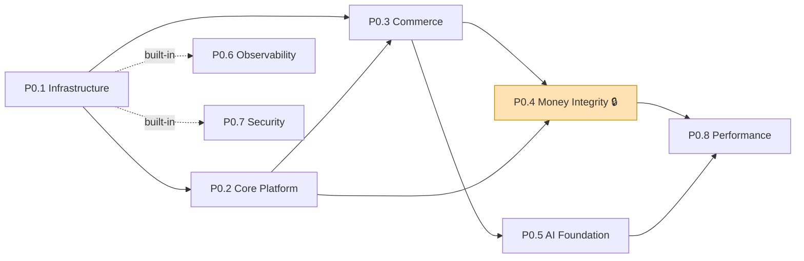

# 13 — Implementation Roadmap (P0.1 – P0.8)

**Status:** 🟢 Ratified build plan · **Owner:** CTO + Founder · **Depends on:** [10 Deployment §12](10-deployment-architecture.md), [Final Certification](review/09-FINAL-CERTIFICATION.md)

---

This formalizes the Founder-ratified decomposition of the **implementation build (P0)** into eight gated sub-phases, each mapped to the *certified* architecture (docs 01–12, ADRs 0001–0022). Phase-0 **documentation** is complete and certified [UNCONDITIONAL GO](review/09-FINAL-CERTIFICATION.md); this roadmap governs the **code** build.

> **Relationship to [Deployment §12](10-deployment-architecture.md).** Doc 10's `P0…P7` are *capability/market* milestones; the `P0.1…P0.8` below are the **workstreams** that build the foundation. They compose: P0.1–P0.2 realize doc-10 **P0**; P0.3 realizes **P1**; P0.4 the **P2** money-integrity gate; P0.5 **P3**. Market rollout (US → CA/UK/AU → EU → …) still follows [ADR-0007](adr/ADR-0007-phased-global-rollout.md).

## Cross-cutting from P0.1 (NOT late phases) — CTO refinement

Two of the eight are **built-in from the first commit**, with their *exit gate* verified later:

- **Observability (P0.6)** — every service ships OTel traces/metrics/logs the day it's created ([ADR-0010](adr/ADR-0010-platform-principles.md) health/metrics fitness function). "Everything traceable" is *verified* at the P0.6 gate, but the capability is not deferred.
- **Security scanning (P0.7)** — SAST/DAST/dependency/secret/container scans are **CI gates from P0.1** ([10 §2](10-deployment-architecture.md#2-ci-pipeline)). "0 High/Critical" is *verified* at the P0.7 gate; the scanning runs from day one.

Also cross-cutting from P0.1: **feature flags** (country + cohort, [ADR-0007](adr/ADR-0007-phased-global-rollout.md)) and **rollback-proven** + **doc-consistency lint** CI gates ([04 §10](04-system-architecture.md#10-fitness-functions-how-we-keep-it-healthy)).

## The eight sub-phases

| # | Sub-phase | Builds | Maps to | Measurable exit gate |
|---|-----------|--------|---------|----------------------|
| **P0.1** | **Infrastructure** | GitHub org, repo strategy, branch protection, CODEOWNERS, CI/CD, Docker, Kubernetes (EKS), Terraform, secrets mgmt | [09](09-cloud-architecture.md), [10 §1–5](10-deployment-architecture.md), [ADR-0003](adr/ADR-0003-cloud-provider.md)/[0019](adr/ADR-0019-portability-ops-maturity.md) | **Infra deploys automatically**: a commit → CI green (incl. SAST/scan/lint/portability/rollback-proven gates) → GitOps deploys a "hello" service to dev+staging; `terraform apply` reproducible; **first EKS blue-green upgrade rehearsed** |
| **P0.2** | **Core Platform** | Authentication (OIDC/passkeys/MFA), RBAC (+ABAC), User Service, Settings, Feature Flags, Audit Logs | [08 §3](08-security-architecture.md), [04](04-system-architecture.md) Identity, [ADR-0010](adr/ADR-0010-platform-principles.md) | **Login → Dashboard full flow**: passkey/MFA login, RBAC-scoped dashboard, feature-flag toggle live, every auth/privileged action in the tamper-evident audit log |
| **P0.3** | **Commerce Foundation** | Affiliate Gateway (≥4 connectors, sandboxed), Merchant Gateway, Product Catalog, Search (lexical→hybrid), Referral Engine | [04 §5–6](04-system-architecture.md), [ADR-0008](adr/ADR-0008-affiliate-gateway.md)/[0018](adr/ADR-0018-connector-security-hardening.md), [06](06-database-architecture.md) | **Search → best all-in price → affiliate redirect**: neutral ranking, price-claim audit ≥ 99% (NFR-COMP-01), **Gateway fails over across connectors with no SPOF** (auto-failover test), signed handoff to an allow-listed merchant |
| **P0.4** | **Money Integrity** 🔒 *(crown jewel)* | Referral tracking, conversion tracking, ledger, cashback hold, reversal, commission reconciliation | [ADR-0011](adr/ADR-0011-attribution-reconciliation.md)/[0012](adr/ADR-0012-postback-integrity.md)/[0013](adr/ADR-0013-ledger-per-context.md)/[0014](adr/ADR-0014-wallet-hold-gate.md), [06 §3.6–3.8](06-database-architecture.md) | **Zero money mismatch** (made measurable): (a) reconciliation `attribution_gap_rate` = 0 on a seeded network-postback test; (b) **no `pending`/unconfirmed accrual is ever payable** (payout hold-gate test); (c) a forged/replayed postback with future `network_event_at` **cannot un-reverse** a clawed-back accrual (reversal-ordering fitness test); (d) double-entry GL balances reconcile to the sub-ledgers |
| **P0.5** | **AI Foundation** | AI Gateway, model router, prompt library, embedding, RAG, recommendation engine | [05](05-ai-architecture.md), [ADR-0005](adr/ADR-0005-ai-model-gateway.md)/[0009](adr/ADR-0009-ai-cost-strategy.md)/[0015](adr/ADR-0015-ai-trust-cost-integrity.md) | **AI consistently produces grounded recommendations**: hallucination < 0.5% on eval (NFR-AI-01), **price numbers deterministically verified** (never LLM-asserted), blended cost ≤ $0.01/request (NFR-AI-02), commission-blind + disclosure verbalized ([11](11-product-guidelines.md)) |
| **P0.6** | **Observability** *(cross-cutting from P0.1)* | OpenTelemetry, Grafana, Prometheus, Loki, Tempo | [09 §11](09-cloud-architecture.md), [10 §7](10-deployment-architecture.md), [ADR-0010](adr/ADR-0010-platform-principles.md) | **Everything traceable**: 100% distributed-trace coverage of user-facing paths (NFR-OBS-01); per-service SLO dashboards + error budgets; money & VMS business dashboards live; observability runs on an isolated failure domain ([ADR-0017](adr/ADR-0017-blast-radius-isolation.md)) |
| **P0.7** | **Security** *(cross-cutting from P0.1)* | SAST, DAST, dependency scan, secret scan, container scan | [08](08-security-architecture.md), [10 §2](10-deployment-architecture.md), [ADR-0018](adr/ADR-0018-connector-security-hardening.md) | **High/Critical vulnerabilities = 0** (blocking CI gate); SBOM + image signing (SLSA); connectors in a hardened runtime; secret-scan clean; a pen-test pass before first GA |
| **P0.8** | **Performance** | Load testing, stress testing, chaos testing | [09 §7](09-cloud-architecture.md), [10 §8](10-deployment-architecture.md), sim [§10](review/02-scalability-simulation.md) | **5,000 QPS sustained** (NFR-SCAL-01) at **p95 ≤ 400 ms** (NFR-PERF-01), **99.9%** availability under a chaos experiment, and a **flash-sale surge (×10–15) load-shed test** protecting the money path ([09 §7.1](09-cloud-architecture.md)) |

## Dependency & sequencing

- **Critical path:** P0.1 → P0.2 → P0.3 → **P0.4** → P0.8. Money Integrity is the gate no money feature ships without ([10 §12](10-deployment-architecture.md)).
- **P0.5 (AI)** depends on P0.3 (catalog/search/offers) for RAG grounding, and parallels P0.4.
- **P0.6/P0.7** thread through every phase (built-in), gate-verified near the end.
- **P0.8** requires P0.3–P0.5 live; the 5,000-QPS load test is the [certification's tracked non-blocking High](review/09-FINAL-CERTIFICATION.md) — provable only with code.

## Risks & CTO notes
- **P0.4 first-purchase-first-money:** the very first real affiliate conversion in P0.3 already needs the P0.4 reconciliation/hold-gate live — so **P0.4 is not deferrable past the first revenue event** (encoded as the doc-10 P1/P2 money-integrity exit gate).
- **Sub-1M cost floor:** the platform is unprofitable below ~1M MAU ([sim §10](review/02-scalability-simulation.md)); burn-vs-milestone is tracked from P0.1.
- **Market gating:** each market's country flag stays off until its region + compliance module + legal sign-off are live ([ADR-0007](adr/ADR-0007-phased-global-rollout.md)/[0016](adr/ADR-0016-region-residency-lifecycle.md)).

---
*Related: [10 — Deployment Architecture](10-deployment-architecture.md) · [09 — Final Certification](review/09-FINAL-CERTIFICATION.md)*
