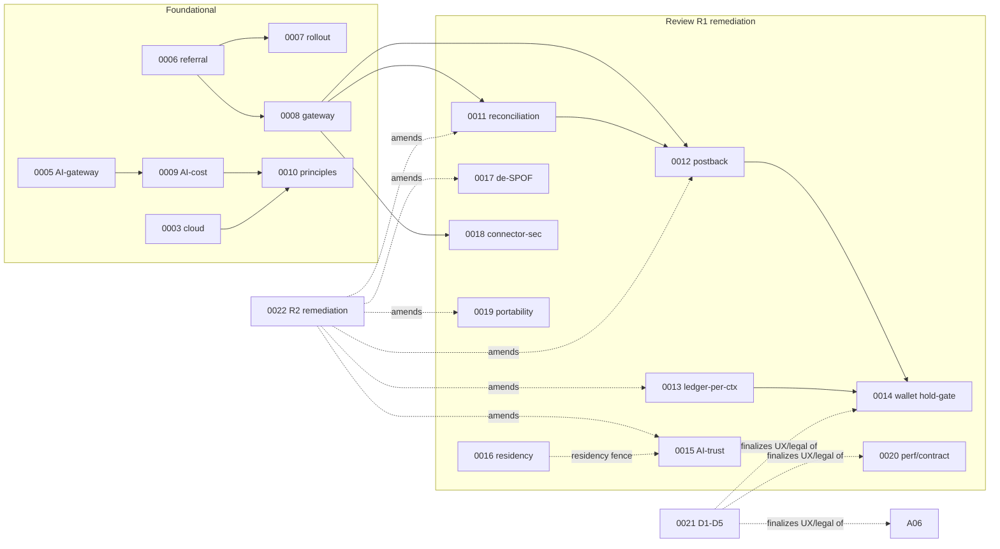

# ADR Index & Lineage Map

**Status:** 🟢 Living index · **Purpose:** single-glance traceability for the 22-ADR corpus — status, what each ADR decides/closes, and how ADRs amend one another. Addresses the maintainability need for an explicit ADR-dependency map.

## 1. ADR register

| ADR | Title | Status | Origin |
|-----|-------|--------|--------|
| [0001](ADR-0001-data-sourcing.md) | Authorized-data-only sourcing | Accepted | Foundational |
| [0002](ADR-0002-branding.md) | Codename NEXUS; brand deferred | Proposed | Foundational |
| [0003](ADR-0003-cloud-provider.md) | AWS-primary, multi-cloud-capable | Proposed | Foundational |
| [0004](ADR-0004-architecture-style.md) | Modular monolith → strangler | Proposed | Foundational |
| [0005](ADR-0005-ai-model-gateway.md) | Model-agnostic AI gateway | Proposed | Foundational |
| [0006](ADR-0006-referral-only-model.md) | **Pure referral / no custody** | Accepted (OQ#1) | Owner-ratified |
| [0007](ADR-0007-phased-global-rollout.md) | Phased rollout + i18n | Accepted (OQ#2) | Owner-ratified |
| [0008](ADR-0008-affiliate-gateway.md) | Affiliate Gateway plugin, no SPOF | Accepted (OQ#3) | Owner-ratified |
| [0009](ADR-0009-ai-cost-strategy.md) | AI ≤ $0.01/request + FinOps | Accepted (OQ#4) | Owner-ratified |
| [0010](ADR-0010-platform-principles.md) | Replaceability/operability principles | Accepted | Owner-ratified |
| [0011](ADR-0011-attribution-reconciliation.md) | Attribution reconciliation subsystem | Accepted | Review R1 → closes R-001/021/033 |
| [0012](ADR-0012-postback-integrity.md) | Provisional accrual + fingerprint | Accepted | Review R1 → closes R-002/003/084/085 |
| [0013](ADR-0013-ledger-per-context.md) | Ledger-per-context + GL | Accepted | Review R1 → closes R-004/034/035/069 |
| [0014](ADR-0014-wallet-hold-gate.md) | Wallet available/held + hold-gate | Accepted | Review R1 → closes R-005; R-022 backend; R-037 |
| [0015](ADR-0015-ai-trust-cost-integrity.md) | Grounding protected; deterministic price verify | Accepted | Review R1 → closes R-006/007/011/048-057/081 |
| [0016](ADR-0016-region-residency-lifecycle.md) | Region-before-market + residency + erasure | Accepted | Review R1 → closes R-010/013/014/015/036/073-076 |
| [0017](ADR-0017-blast-radius-isolation.md) | De-SPOF isolation | Accepted | Review R1 → closes R-009/020/029/059/060/078/082 |
| [0018](ADR-0018-connector-security-hardening.md) | Connector sandbox + open-redirect | Accepted | Review R1 → closes R-016/017/055/065-068/070/071 |
| [0019](ADR-0019-portability-ops-maturity.md) | Real portability + ops maturity | Accepted | Review R1 → closes R-012/018/019/058/061-064/077 |
| [0020](ADR-0020-performance-consistency-hardening.md) | Perf + canonical money + contract-first | Accepted | Review R1 → closes R-008/026-032/038-045/051/079/080/083 |
| [0021](ADR-0021-legal-product-truth.md) | **D1–D5 legal/product** | Accepted | Owner-ratified → closes R-021/022/023/024/037/046/047 |
| [0022](ADR-0022-round2-remediation.md) | Round-2 remediation | Accepted | Review R2 → closes NC-1…NC-9 + partials |

## 2. Amendment lineage (which ADR modifies which)

## 3. Amendment notes (explicit)
- **[ADR-0022](ADR-0022-round2-remediation.md)** amends 0011 (blinded panel), 0012 (NEXUS-sequence reversal ordering — supersedes the original "last-writer-by-network-timestamp"), 0013 (event-driven idempotent accrual — no atomic fan-out), 0015 (honest long-tail cache), 0017 (per-capability/per-cell canaries), 0019 (control-plane portability).
- **[ADR-0021](ADR-0021-legal-product-truth.md)** finalizes the customer-facing/legal layer over 0006 (travel), 0014 (savings-state presentation), 0020 (commission-blind neutrality positioning).
- **Round 5** (2026-07-14) propagated the ADR-0022 NC-3 reversal-ordering wording into docs 04 §5.4 / 07 §9 (closing open Critical C-1) and added the reversal-ordering CI fitness function. The R5 *review* then found 2 further doc-propagation Criticals (C-A/C-B), fixed in **Round 6**, which also added the **doc-consistency lint** to make the recurring ADR→doc propagation gap a mechanical CI gate. See the Review-lineage table (§4) for the full round-by-round outcome.

## 4. Review lineage
| Round | Artifact | Outcome |
|-------|----------|---------|
| R1 | [report v1](../review/00-architecture-review-report-v1.md) · [register v1](../review/01-master-risk-register.md) · [sim](../review/02-scalability-simulation.md) | 20 Critical / 34 High · NO-GO |
| R2 | [register v2](../review/03-master-risk-register-v2.md) · [report v2](../review/04-architecture-review-report-v2.md) | 15/24 closed, 9 new Criticals · NO-GO |
| R3 | ADR-0022 + doc patches + sim §10 | NC-1…9 + partials remediated (C-1 propagation gap missed) |
| R4 | [report v3 FINAL](../review/05-architecture-review-report-v3-FINAL.md) | 1 open Critical (C-1) + gates 88/88/91/92/89 · NO-GO |
| R5 remediation | C-1 fixed in 04/07 + reversal-ordering fitness fn + H-1…H-15 | (propagation of C-A/C-B/H-6-8 later found incomplete) |
| R5 review | [report v4 FINAL](../review/07-architecture-review-report-v4-FINAL.md) | **NO-GO** — 2 new Criticals (C-A stale savings vocab, C-B CONVERSION composite key) + recurring ADR→doc propagation failure; gates 90/84/92/90/87 |
| R6 remediation | C-A + C-B fixed at source; H-6/7/8 propagated to docs; **doc-consistency lint** added as CI fitness fn (04 §10 + 10 §2) | closes the propagation-failure class mechanically |
| R6 review | [report v5 FINAL](../review/08-architecture-review-report-v5-FINAL.md) | **CONDITIONAL-GO** — gates 96/95/96/89/91; design certified sound, no fund-loss exploit; 2 doc-fidelity Criticals (doc06 exactly-once, this lineage map stale) |
| R6 close-out | doc06 exactly-once→effectively-once; this lineage map updated; lint re-run green | conditions for CONDITIONAL-GO met |
