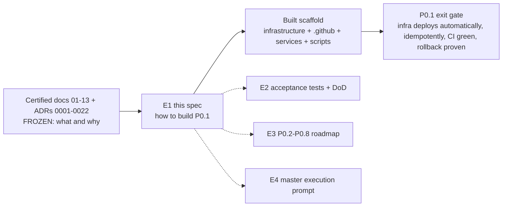
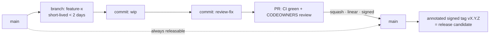
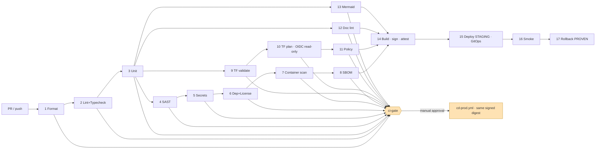
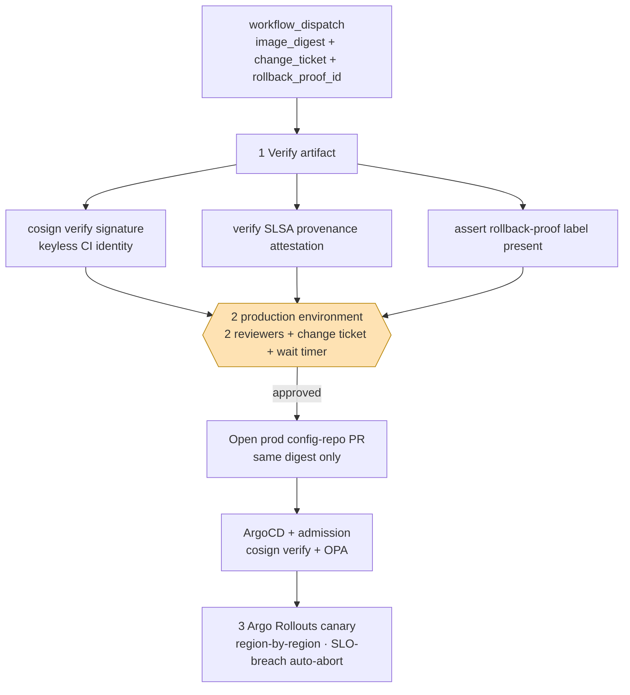
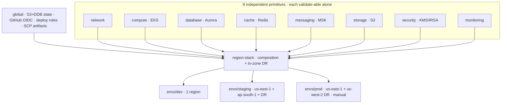
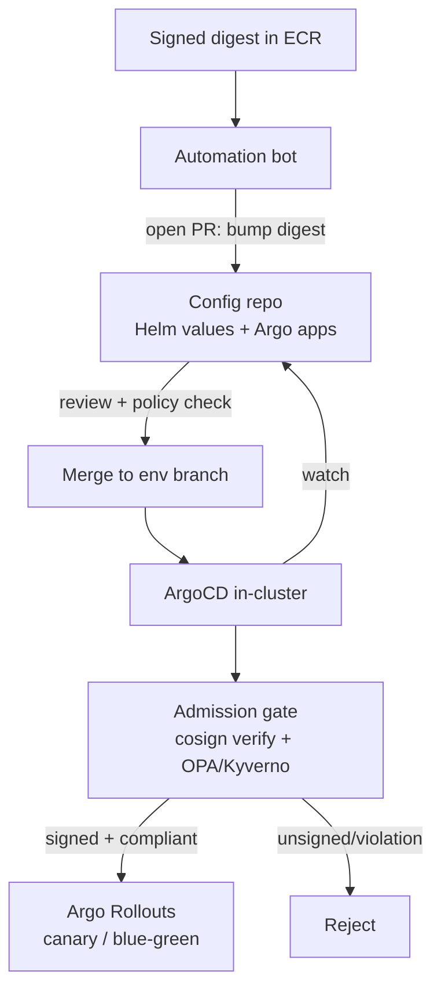
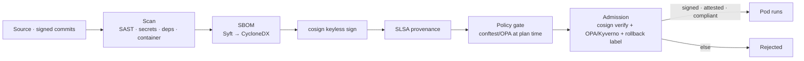

# E1 — P0.1 Engineering Specification & Production Blueprint

**Status:** 🟢 Authoritative build spec · **Phase:** P0.1 Infrastructure Foundation · **Owner:** Staff Platform Engineering (Infrastructure · DevSecOps · Platform · Cloud-Security · SRE) · **Date:** 2026-07-14 · **Conforms to:** the certified, frozen architecture in [`/docs`](../00-README.md) — this spec *formalizes* the built scaffold; it neither changes the architecture nor invents divergent designs.

> **What this document is.** The single authoritative engineering specification for the **P0.1 Infrastructure Foundation**: the monorepo, Git strategy, branch protection, CODEOWNERS, CI/CD, Terraform, Kubernetes, security, observability, and reproducibility of the NEXUS platform. It is the "how we build the foundation" companion to the certified "what/why" documents ([09 Cloud Architecture](../09-cloud-architecture.md), [10 Deployment Architecture](../10-deployment-architecture.md), [13 Implementation Roadmap](../13-implementation-roadmap.md)) and the ADRs they ratify.
>
> **What this document is NOT.** It contains **zero business, commerce, AI, auth, or referral logic** — those are P0.2+ ([13 Implementation Roadmap](../13-implementation-roadmap.md)). The only running code in P0.1 is `platform-hello`, the pipeline canary.

**Normative language.** This document uses RFC-2119 keywords — **MUST**, **MUST NOT**, **SHOULD**, **SHOULD NOT**, **MAY** — to mark requirements. Every material claim traces to a certified doc or ADR; because this file lives under `docs/`, it is itself guarded by the [doc-consistency lint](../04-system-architecture.md#10-fitness-functions-how-we-keep-it-healthy) and the Mermaid validator.

---

## Table of contents

- [1. Scope and non-goals](#1-scope-and-non-goals)
- [2. Monorepo structure](#2-monorepo-structure)
- [3. Git strategy](#3-git-strategy)
- [4. Branch protection](#4-branch-protection)
- [5. CODEOWNERS and ownership model](#5-codeowners-and-ownership-model)
- [6. CICD pipeline](#6-cicd-pipeline)
- [7. Terraform](#7-terraform)
- [8. Kubernetes](#8-kubernetes)
- [9. Security](#9-security)
- [10. Observability](#10-observability)
- [11. Reproducibility and idempotency](#11-reproducibility-and-idempotency)
- [12. Cross-references](#12-cross-references)
- [Appendix A. Traceability matrix](#appendix-a-traceability-matrix)
- [Appendix B. Toolchain and pinned versions](#appendix-b-toolchain-and-pinned-versions)
- [Appendix C. Glossary](#appendix-c-glossary)
- [Appendix D. P0.1 risk register](#appendix-d-p01-risk-register)

---

## 0. How this spec relates to the certified architecture

The certified corpus (13 docs, 23 ADRs, 9 review artifacts) is **frozen**: code conforms to it, it is not changed by code work. This spec is the **engineering formalization** of the P0.1 slice of that corpus. Each normative statement below carries a back-reference to its certifying source so the chain of authority is auditable end-to-end.



The authoritative sources this spec formalizes are: the repository [README](../../README.md) and [P0.1 delivery report](../../PHASE-P0.1-REPORT.md); the workflows [`.github/workflows/ci.yml`](../../.github/workflows/ci.yml) and [`.github/workflows/cd-prod.yml`](../../.github/workflows/cd-prod.yml); [`.github/CODEOWNERS`](../../.github/CODEOWNERS); the infrastructure estate rooted at [`infrastructure/README.md`](../../infrastructure/README.md); the [`nexus-common`](../../infrastructure/kubernetes/charts/nexus-common/README.md) library chart; the [`platform-hello`](../../services/platform-hello/README.md) canary; and the certified [09](../09-cloud-architecture.md) / [10](../10-deployment-architecture.md) / [13](../13-implementation-roadmap.md) plus ADRs 0003, 0010, 0016, 0017, 0018, 0019.

---

## 1. Scope and non-goals

### 1.1 In scope (P0.1 platform foundation)

P0.1 delivers the **foundation on which every later phase is built**, per the [Implementation Roadmap](../13-implementation-roadmap.md) exit gate: *"a commit → CI green → GitOps deploys a hello service to dev+staging; `terraform apply` reproducible; first EKS blue-green upgrade rehearsed."* Concretely, the following are in scope and specified by this document:

| # | Deliverable | Certifying source |
|---|-------------|-------------------|
| 1 | The monorepo layout, workspace tooling, and directory-governance model | [README](../../README.md), [04](../04-system-architecture.md) |
| 2 | Git strategy: trunk-based development, conventional + signed commits, linear history, tags/releases | [10 §0.1](../10-deployment-architecture.md), [08](../08-security-architecture.md) |
| 3 | `main` branch protection: required checks, CODEOWNERS review, no force-push, signed commits, up-to-date-before-merge | [`branch-protection.yml`](../../infrastructure/github/branch-protection.yml), [10 §2](../10-deployment-architecture.md#2-ci-pipeline) |
| 4 | CODEOWNERS ownership model and the team map | [`.github/CODEOWNERS`](../../.github/CODEOWNERS) |
| 5 | The CI pipeline (17 fail-closed stages + the `ci-gate` aggregate) with OIDC-no-static-secrets, cosign signing, SBOM, and SLSA provenance | [`ci.yml`](../../.github/workflows/ci.yml), [10 §2](../10-deployment-architecture.md#2-ci-pipeline) |
| 6 | The CD pipeline (staging auto-sync, prod manual-approval promotion of the same signed digest) | [`cd-prod.yml`](../../.github/workflows/cd-prod.yml), [10 §3](../10-deployment-architecture.md#3-cd-pipeline) |
| 7 | The Terraform estate: 8 primitive modules + `region-stack` composition + `global` landing zone + 3 env roots | [`infrastructure/terraform`](../../infrastructure/terraform/README.md), [09](../09-cloud-architecture.md) |
| 8 | The Kubernetes platform: `nexus-common` library chart, Kustomize overlays, ArgoCD GitOps, namespace isolation | [`infrastructure/kubernetes`](../../infrastructure/kubernetes/README.md), [10 §3](../10-deployment-architecture.md#3-cd-pipeline) |
| 9 | Supply-chain security: OIDC, least-privilege IAM/IRSA, signed images, mandatory SBOM, SLSA, OPA policy-as-code | [`infrastructure/security`](../../infrastructure/security/README.md), [08](../08-security-architecture.md) |
| 10 | Observability from day one: OpenTelemetry, Prometheus/Grafana/Loki/Tempo, health/readiness/liveness, separate failure domain | [`infrastructure/monitoring`](../../infrastructure/monitoring/README.md), [09 §11](../09-cloud-architecture.md#11-observability-infrastructure) |
| 11 | Reproducibility and idempotency: bootstrap, verify, deterministic builds, drift detection | [10 §5](../10-deployment-architecture.md#5-infrastructure-as-code-iac) |
| 12 | The `platform-hello` walking-skeleton service that proves every platform contract end-to-end | [`services/platform-hello`](../../services/platform-hello/README.md) |

### 1.2 Non-goals (explicitly deferred, MUST NOT appear in P0.1)

P0.1 is **platform only**. The following are **out of scope** and any code implementing them **MUST NOT** land in the P0.1 slice; they belong to the named later sub-phase of the [roadmap](../13-implementation-roadmap.md):

- **Authentication / RBAC / user service / audit logs** — P0.2 Core Platform.
- **Affiliate Gateway, merchant gateway, catalog, search, referral engine** — P0.3 Commerce Foundation.
- **Referral/conversion tracking, ledger, cashback, reconciliation** — P0.4 Money Integrity.
- **AI gateway, model router, RAG, recommendations** — P0.5 AI Foundation.
- **Any real business ranking, pricing, attribution, or money movement** — governed by the money-integrity gate and never shipped in the foundation.

The `apps/`, `services/{auth,catalog,affiliate,ai,search,analytics}`, and `packages/{ui,sdk,shared,config}` directories exist in P0.1 as **intent-only scaffolds with empty exports** so ownership, boundaries, and the CI gate set are wired from the first commit — but they contain no logic. The only running code is `platform-hello`.

### 1.3 The six non-negotiables

Every decision in this spec serves the six invariants the repository README and [10 §0.1](../10-deployment-architecture.md) declare. They are restated here as the acceptance frame for P0.1:

1. **Secrets never in Git.** CI federates to AWS by **GitHub OIDC**; there are no static cloud credentials anywhere.
2. **Every artifact is signed and SBOM'd** (SLSA-aware). **Unsigned images MUST NOT run** — admission control enforces it.
3. **Observability and security scanning are built-in from the first commit**, not later phases.
4. **Every change ships with a rollback that has been executed and time-asserted** — the `Rollback PROVEN` gate, not a rollback document.
5. **Doc-consistency lint blocks ADR↔doc drift** as a merge-blocking fitness function.
6. **Terraform is modular** — eight independent primitives composed per environment, never one giant project.

---

## 2. Monorepo structure

### 2.1 Decision: one polyglot monorepo

NEXUS **MUST** be a single monorepo. The rationale is architectural, not stylistic:

- **Atomic cross-cutting change.** A contract, a shared type, a policy, and its consumers change in **one reviewable commit**. The certified [10 §2](../10-deployment-architecture.md#2-ci-pipeline) contract-first-generation gate (money type generated once, into every runtime) is only enforceable when the canonical source and all consumers live in one tree.
- **One CI gate set, inherited.** A new service inherits the full fail-closed gate suite by referencing one reusable workflow ([10 §2 Scalability](../10-deployment-architecture.md#2-ci-pipeline)) — no per-repo pipeline drift.
- **One source of truth for governance.** [`.github/CODEOWNERS`](../../.github/CODEOWNERS) covers every path; the frozen [`/docs`](../00-README.md) corpus sits beside the code it certifies so the doc-consistency lint can prove ADR↔doc↔code coherence.
- **Portability discipline is global.** The "no provider SDK in core" and portability fitness functions ([ADR-0010](../adr/ADR-0010-platform-principles.md), [ADR-0019](../adr/ADR-0019-portability-ops-maturity.md)) are cheap to enforce across one dependency graph and expensive to enforce across many repos.

The trade-off — a large working tree and the need for build-graph tooling to keep CI fast — is bounded by pnpm workspaces + Turborepo task-graph caching (JS/TS), native Go modules (Go services), and per-service Python virtual environments.

### 2.2 Top-level layout

```
nexus-commerce-os/
├── apps/                     user-facing apps (P0.2+ scaffold)
│   ├── web/                  Next.js PWA
│   └── admin/                internal admin surface
├── services/                 backend services
│   ├── auth/ catalog/ affiliate/ ai/ search/ analytics/   intent-only scaffolds (empty exports)
│   └── platform-hello/       Go canary: / /healthz /readyz /metrics + OTel  (the ONLY running code)
├── packages/                 shared libraries (empty exports in P0.1)
│   ├── ui/ sdk/ shared/ config/
├── infrastructure/           the whole cloud + platform estate
│   ├── terraform/            8 primitive modules + region-stack + global + envs/{dev,staging,prod}
│   ├── kubernetes/           charts/nexus-common (library) + base + overlays + ArgoCD
│   ├── monitoring/           otel prometheus grafana loki tempo (separate failure domain)
│   ├── security/             policies (OPA) + iam + supply-chain
│   └── github/               branch-protection · environments · OIDC↔AWS trust
├── .github/
│   ├── workflows/            ci.yml (17 stages + ci-gate) · cd-prod.yml (manual approval)
│   └── CODEOWNERS            every path has an owning team
├── scripts/                  bootstrap.sh · verify.sh · doc_consistency_lint.py · mermaid_validate.py
├── tests/                    smoke · policy (OPA/conftest)
└── docs/                     CERTIFIED architecture (13 docs · 23 ADRs · 9 review) — FROZEN
    └── engineering/          E1 (this) · E2 · E3 · E4 — engineering specs (linted)
```

Every directory carries a `README.md` documenting **purpose · ownership · dependencies** — 53 governance READMEs at P0.1 delivery. This is a hard rule: an unowned or undocumented directory is a governance defect.

### 2.3 The seven workspaces and their tooling

| Workspace | Language / runtime | Package/build tool | P0.1 status |
|-----------|--------------------|--------------------|-------------|
| `apps/*` | TypeScript (Next.js) | pnpm workspace + Turborepo | scaffold |
| `services/platform-hello` | Go 1.22 | Go modules | **running canary** |
| `services/*` (others) | Go / TS / Python by domain | Go modules · pnpm · uv/pip | intent-only |
| `packages/*` | TypeScript | pnpm workspace + Turborepo | empty exports |
| `infrastructure/terraform` | HCL (Terraform ≥ 1.7) | Terraform modules | validate-clean |
| `infrastructure/kubernetes` | Helm + Kustomize | Helm ≥ 3.14 · Kustomize · ArgoCD | template-clean |
| `scripts`, `tests` | Python 3.12 · Bash | zero-dep Python · shell | running in CI |

- **pnpm workspaces** provide a single lockfile (`pnpm-lock.yaml`), content-addressable store, and `--frozen-lockfile` installs in CI so the dependency tree is bit-reproducible.
- **Turborepo** provides the task graph (`lint`, `typecheck`, `test`, `build`) with remote/local caching, so a PR only rebuilds what changed. CI stages 1–3 (§6) invoke `pnpm -s <task>` which fans out through Turbo.
- **Go modules** are per-service (`go.mod`); `go.sum` is generated by CI (`go mod download`) rather than vendored in the scaffold ([`platform-hello` README](../../services/platform-hello/README.md)).
- **Python** tooling (ruff, mypy) governs `scripts/` and future Python services; `scripts/` is deliberately **zero-third-party-dependency** so the doc-consistency lint and Mermaid validator run anywhere Python 3.8+ exists.

### 2.4 Boundary enforcement

The monorepo does not imply loose coupling. Cross-boundary discipline is a **CI fitness function**, not a review convention ([10 §2](../10-deployment-architecture.md#2-ci-pipeline), [ADR-0010](../adr/ADR-0010-platform-principles.md)):

- **No cross-module database import** and **no cross-boundary import** (dependency-cruiser for TS, import-linter for Python, a custom Go analyzer).
- **No third-party provider SDK or provider schema in the core domain** — an adapter-boundary lint; provider SDKs live only in their adapter package.
- **Portability check** — no un-abstracted AWS control-plane call (IRSA, Global Accelerator, Route 53, Shield, Control Tower, Config/SCP) leaks past the infra-adapter seam.

These gates run in P0.1 even though most consumers are empty scaffolds, so the boundaries are correct *before* logic is written.

---

## 3. Git strategy

### 3.1 Trunk-based development with short-lived branches

NEXUS **MUST** practise **trunk-based development**:

- `main` is the single long-lived branch and is **always releasable**. Every merge to `main` triggers the full CI pipeline and (on green) produces a signed artifact.
- Work happens on **short-lived branches** (target lifetime < 2 days) branched from `main`, kept up to date with `main`, and merged back via pull request. Long-lived divergent branches are prohibited — they defeat continuous integration and inflate merge risk on a money-movement platform.
- **Deploy ≠ release.** Code ships to `main` and to environments dark, behind feature flags; user exposure is a separate, progressively-delivered decision ([10 §4](../10-deployment-architecture.md)). Merging to `main` is safe because release is gated downstream, not because the branch is special.



### 3.2 Conventional Commits

Commit messages **MUST** follow [Conventional Commits](https://www.conventionalcommits.org): `type(scope): summary`, where `type ∈ {feat, fix, docs, refactor, perf, test, build, ci, chore, revert}`. This is enforced by a commit-message hook (installed by [`scripts/bootstrap.sh`](../../scripts/bootstrap.sh)) and re-checked in CI. Conventional Commits give machine-parseable history that drives:

- **Automated changelog + semantic version derivation** at tag time.
- **Revert precision** — a `revert:` commit references the exact commit it undoes, which pairs with the rollback discipline (§6, §11).
- **Scope-level routing** — the `scope` maps to a CODEOWNERS domain, aiding review assignment.

### 3.3 Signed commits and verified authorship

Every commit on `main` **MUST** be cryptographically signed and verified (`required_signed_commits: true` in [`branch-protection.yml`](../../infrastructure/github/branch-protection.yml)). This realizes the [08 Security](../08-security-architecture.md) integrity control against forged authorship (A08). Contributors sign with SSH or GPG keys registered to their GitHub identity; an unsigned or unverifiable commit cannot merge. Signed commits + signed artifacts (§6) + admission verification (§9) form one unbroken provenance chain from author keystroke to running pod.

### 3.4 Linear history

`main` **MUST** have a **linear history** (`required_linear_history: true`). PRs merge by squash or rebase, never by a merge commit that tangles topology. Linear history is not aesthetic: it makes `git bisect` deterministic, makes any commit a clean revert target (rollback), and produces an auditable, monotone record for compliance evidence ([10 §11](../10-deployment-architecture.md)).

### 3.5 Tags, releases, and immutable identity

- A release is an **annotated, signed tag** (`vMAJOR.MINOR.PATCH`) on a `main` commit that passed the full pipeline.
- **Image identity is the git commit SHA** — `IMAGE_TAG = ${{ github.sha }}` ([`ci.yml`](../../.github/workflows/ci.yml)). The immutable tag is the SHA; downstream, **digests (not tags) are pinned** in Helm values, so what runs is byte-identical to what was signed. `latest` is forbidden in any deployable manifest ([10 §3](../10-deployment-architecture.md#3-cd-pipeline)).
- Signed release images are retained ≥ 1 year as compliance evidence; untagged/preview images expire in 14 days.

### 3.6 The GitOps two-repo model

The application monorepo is **not** the deployment source of truth. CI's responsibility ends at *"produce a signed, attested artifact and open a PR to the config repo."* Desired cluster state lives in a **separate config repo** that ArgoCD reconciles ([10 §3](../10-deployment-architecture.md#3-cd-pipeline)). This keeps cluster credentials out of the app repo entirely and gives deployments their own auditable, revertible history. See §8.4.

---

## 4. Branch protection

### 4.1 Protected `main` — the config-as-doc contract

`main` protection is declared as config-as-doc in [`infrastructure/github/branch-protection.yml`](../../infrastructure/github/branch-protection.yml) and applied **out-of-band by a privileged org-admin bootstrap** (the `github` Terraform provider or `gh api`) — **never by a workflow token**, so the pipeline can never weaken its own gates. The declared controls are normative:

| Control | Setting | Why (certifying source) |
|---------|---------|-------------------------|
| **Required status check** | `ci-gate` (strict) | The single aggregate check; green only when every sub-gate succeeded ([10 §2](../10-deployment-architecture.md#2-ci-pipeline)) |
| **Up-to-date before merge** | `required_status_checks.strict: true` | A PR **MUST** be current with `main` before merge — no stale-branch bypass of gates |
| **CODEOWNERS review** | `require_code_owner_reviews: true`, `required_approving_review_count: 1` | Every path has an owning team that MUST approve ([`.github/CODEOWNERS`](../../.github/CODEOWNERS)) |
| **Dismiss stale reviews** | `dismiss_stale_reviews: true` | A new push invalidates prior approvals — reviewers approve the code that ships |
| **No self-approval** | `require_last_push_approval: true` | The approver cannot be the last pusher (4-eyes) |
| **Signed commits** | `required_signed_commits: true` | Verified authorship, no forgery ([08](../08-security-architecture.md)) |
| **Linear history** | `required_linear_history: true` | Auditable, revertible history ([10 §0.1](../10-deployment-architecture.md)) |
| **No force-push** | `allow_force_pushes: false` | `main` history is immutable — force-push would erase the audit trail |
| **No deletion** | `allow_deletions: false` | The protected branch cannot be deleted |
| **Conversation resolution** | `required_conversation_resolution: true` | No unresolved review threads merge silently |
| **Admins not exempt** | `enforce_admins: true` | The gate is universal — no snowflakes ([10 §0.1](../10-deployment-architecture.md)) |

### 4.2 Why one aggregate required check

Branch protection requires exactly **one** context: `ci-gate`. This is deliberate. The CI job graph evolves — stages are added per service and per phase — but the branch-protection contract stays stable because `ci-gate` only goes green when **every** upstream gate succeeded, and a skipped or failed sub-job propagates to `ci-gate` failing (§6.6). Listing individual jobs as required checks would force a branch-protection edit on every pipeline change and risk a gate silently dropping out of the required set. One aggregate check is fail-closed and edit-free.

### 4.3 The required status checks ARE the CI gates

The "required status checks" of branch protection are not a separate list — they are the CI gates of §6, funnelled through `ci-gate`. A red stage (format, lint, unit, SAST, secrets, dependency, container, SBOM, tf-validate, tf-plan, policy, doc-lint, mermaid) turns `ci-gate` red and **blocks merge**. This is what makes the fitness functions of [04 §10](../04-system-architecture.md#10-fitness-functions-how-we-keep-it-healthy) and the platform principles of [ADR-0010](../adr/ADR-0010-platform-principles.md) *have teeth*: they are merge-blocking, not advisory.

### 4.4 Config-repo protection (non-prod auto-approval, humans gate prod)

The GitOps config repo has its own protection: routine digest-bump PRs to **non-prod** env branches **MAY** use CODEOWNERS auto-approval for velocity ([10 §3 risk note](../10-deployment-architecture.md#3-cd-pipeline)); **prod** is gated by the `production` GitHub Environment (§6.5), not by a branch rule. Humans gate prod; machines gate everything below it.

---

## 5. CODEOWNERS and ownership model

### 5.1 Principle: no unowned code

[`.github/CODEOWNERS`](../../.github/CODEOWNERS) assigns an **explicit owning team to every path** in the monorepo. The wildcard default (`* @nexus/platform`) guarantees there is no unowned code; more specific rules layer domain ownership on top. Because branch protection requires CODEOWNERS review, the ownership map is not documentation — it is the enforced approval routing for every PR.

### 5.2 The team map

| Path | Owning team(s) | Rationale |
|------|----------------|-----------|
| `*` (default) | `@nexus/platform` | Anything not otherwise claimed |
| `/infrastructure/terraform/` | `@nexus/infrastructure` `@nexus/cloud-security` | Cloud estate changes need both infra and security eyes |
| `/infrastructure/kubernetes/` | `@nexus/platform` `@nexus/sre` | Workload runtime + reliability |
| `/infrastructure/monitoring/` | `@nexus/sre` | Observability is SRE-owned |
| `/infrastructure/security/` | `@nexus/cloud-security` | Policy-as-code, supply chain, IAM |
| `/infrastructure/github/` | `@nexus/devsecops` | Repo governance, OIDC trust |
| `/.github/` | `@nexus/devsecops` `@nexus/platform` | Pipelines + governance |
| `/apps/` | `@nexus/frontend` | User-facing surfaces |
| `/services/auth/` | `@nexus/platform` `@nexus/cloud-security` | Identity is security-sensitive |
| `/services/{catalog,affiliate,search}/` | `@nexus/commerce` | Commerce domain |
| `/services/ai/` | `@nexus/ai` | AI domain |
| `/services/analytics/` | `@nexus/data` | Data/analytics domain |
| `/services/platform-hello/` | `@nexus/platform` | The platform canary |
| `/packages/` | `@nexus/platform` `@nexus/frontend` | Shared libraries |
| `/docs/` | `@nexus/architecture` | **Certified + frozen** — changes require architecture review |
| `/tests/` | `@nexus/sre` `@nexus/devsecops` | Smoke + policy tests |

### 5.3 Ownership rules

- **Two-team ownership on high-blast-radius paths.** Terraform (`infrastructure` + `cloud-security`) and auth (`platform` + `cloud-security`) require dual sign-off by construction — a single team cannot land a change to the money-adjacent or credential-adjacent surface.
- **`/docs/` is owned by `@nexus/architecture`.** The certified corpus is frozen; a docs change is an architecture-review event, which is exactly why the doc-consistency lint (§6) guards against ADR↔doc drift as a merge gate.
- **Feature teams are added at their phase.** P0.1 owners are the platform/scaffold owners; a domain team (e.g. `@nexus/commerce` deepening) is layered on when its sub-phase begins ([13](../13-implementation-roadmap.md)).

### 5.4 Bootstrap dependency

The `@nexus/*` teams are **placeholders** until the GitHub org is created at P0.1 bootstrap. Branch protection, CODEOWNERS review, and prod environment approvers all depend on these teams existing (Risk R-3, [P0.1 report](../../PHASE-P0.1-REPORT.md)). Creating the org and teams is step 1 of the exit-gate runbook (§11.4).

---

## 6. CICD pipeline

### 6.1 Design principles

The pipeline realizes five deployment invariants from [10 §0.1](../10-deployment-architecture.md) and the hardening ADRs:

1. **Everything reproducible** — every `uses:` is pinned to a full 40-char commit SHA; toolchain versions are pinned in `env` (Node 20.17.0, pnpm 9.7.0, Python 3.12, Terraform 1.9.5). A wrong SHA **fails closed** (action not found).
2. **Secure supply chain** — scan → sign (cosign) → attest (SLSA provenance + CycloneDX SBOM). Unsigned images **MUST NOT** run.
3. **Fail-closed** — a red stage blocks merge (branch protection requires `ci-gate`) and blocks promotion.
4. **No static cloud credentials** — OIDC federation to AWS only ([ADR-0018](../adr/ADR-0018-connector-security-hardening.md) R-065).
5. **Least privilege** — top-level `permissions: {}` (deny by default); each job widens to the minimum it needs.

Additional hardening from [ADR-0018](../adr/ADR-0018-connector-security-hardening.md): self-hosted runners for heavy jobs are **single-use and ephemeral**, spun up in an isolated `nexus-ci` account and destroyed after each job, so no build state or credential persists between runs. OIDC tokens are short-lived with tight audience + branch/ref conditions — a token minted for a PR branch **cannot** assume a prod role.

### 6.2 Stage order and the dependency chain

CI runs on **every PR and every push to `main`**. The task-mandated stage order is enforced by `needs:` chains in [`ci.yml`](../../.github/workflows/ci.yml):



Stages 1–13 run on **every PR and push** and feed `ci-gate`. Stages 14–17 (build/sign, deploy-staging, smoke, rollback-proven) run **only on push to `main`** — PRs are gated but never push, sign, or deploy.

### 6.3 The 17 stages in detail

Each stage below states **what it does · why it exists · the fail condition · the tool**. The mapping is one-to-one with the jobs in [`ci.yml`](../../.github/workflows/ci.yml).

| # | Stage | What it does | Why | Fails when | Tool |
|---|-------|--------------|-----|-----------|------|
| 1 | **Format** | First cheap gate; checks formatting of the whole tree before wasting runners | A mis-formatted diff should never consume the expensive gates; style is mechanically enforced, not reviewed | Any file is not canonically formatted | Prettier via `pnpm format:check` |
| 2 | **Lint & typecheck** | ESLint/golangci-lint/ruff (via Turbo) + `tsc`/`go vet`/`mypy`; includes the no-provider-SDK-in-core boundary lint | Code-quality + correctness + architecture-boundary fitness functions caught before tests | Any lint error, type error, or boundary violation | eslint · golangci-lint · ruff · tsc · go vet · mypy |
| 3 | **Unit tests** | Runs unit suites with coverage thresholds (core ≥ 80%, ledger/attribution ≥ 90%) | Correctness gate; money paths gated hardest | Test failure or coverage below threshold | vitest/jest · `go test` · pytest |
| 4 | **SAST** | Semantic static analysis of the JS/TS + Go surface + rule-based OWASP scan | Deep taint analysis generic linters miss (NFR-SEC-01, [08](../08-security-architecture.md)) | A high/critical CodeQL alert or a Semgrep finding | CodeQL + Semgrep |
| 5 | **Secrets scan** | Scans the **full history** (`fetch-depth: 0`) for leaked credentials | Secrets never in Git; a leak is a P0 | Any gitleaks hit | gitleaks |
| 6 | **Dependency & license scan** | Known-CVE gate across npm/Go/Python transitively + license allowlist | A known critical CVE with a fix, or a disallowed license (e.g. GPL in a proprietary platform), blocks | Critical CVE with an available fix; disallowed license | osv-scanner + license-checker/go-licenses |
| 7 | **Container scan** | Builds a candidate image (loaded locally, **not pushed**) and scans it | Defense-in-depth vs. the dependency scan; catches OS/lib CVEs in the image | Critical OS/lib CVE **with an available fix** (`ignore-unfixed`) | Trivy (SARIF uploaded to the security tab) |
| 8 | **SBOM** | Generates a CycloneDX SBOM of the source, uploaded as an artifact | SBOM is a required build output; attached as a cosign attestation in Build (#14) | SBOM generation fails | Syft (anchore/sbom-action) → CycloneDX |
| 9 | **Terraform validate** | `fmt -check` + per-module `validate` with `-backend=false` (offline) | Catches HCL/type errors per module before any plan; no cloud creds needed | Any module fails `fmt` or `validate` | Terraform 1.9.5 |
| 10 | **Terraform plan (staging, read-only)** | Assumes a **read-only** plan role via OIDC and emits `tfplan.json` for the policy gate | The machine-readable plan is the input to the OPA plan-time policy gate; a PR ref can only reach the read-only role | Plan errors, or OIDC assumption fails | Terraform + `configure-aws-credentials` (OIDC) |
| 11 | **Policy validation** | `conftest verify` (policy unit tests) + `conftest test` against the plan JSON | No public S3, no `0.0.0.0/0` on money SGs, mandatory tags, encryption-at-rest — enforced at plan time; the policies themselves are tested so a broken rule can't silently pass | Any policy violation, or a failing policy unit test | conftest / OPA |
| 12 | **Documentation lint** | Runs the certified ADR↔doc drift fitness function | Banned/retired terms, dangling anchors, broken intra-repo links block merge (zero-dep, certified) | Any banned term, dangling anchor, or broken link | [`scripts/doc_consistency_lint.py`](../../scripts/doc_consistency_lint.py) |
| 13 | **Mermaid validation** | Parses every Mermaid diagram in the docs | Docs are a build output; a malformed diagram fails the build, not review | Any diagram fails to parse | [`scripts/mermaid_validate.py`](../../scripts/mermaid_validate.py) |
| 14 | **Build · sign · attest** *(main only)* | Multi-stage build, push to ECR **by digest**, cosign keyless sign + SLSA provenance + SBOM attestation | Signed artifacts are produced only for the trunk; one signed image is promoted across envs | Build/push/sign/attest fails; a service with a Dockerfile that cannot produce a signed digest | docker buildx · cosign · `attest-build-provenance` |
| 15 | **Deploy staging (GitOps)** *(main only)* | Opens a digest-bump PR to the config repo; ArgoCD reconciles staging | CI never holds cluster creds — it hands off to GitOps; staging auto-syncs | The digest-bump PR cannot be opened | brokered GitHub App token (no cluster creds) |
| 16 | **Smoke test** *(main only)* | Post-deploy health + core-loop assertion against staging | Staging must pass smoke before it can be a release candidate | Liveness/readiness/dependency-health probes fail on staging | shell smoke suite (Playwright/axe + probes) |
| 17 | **Rollback PROVEN** *(main only)* | **Executes** the change's rollback of the correct type in a preview/staging env and **time-asserts** restore ≤ max | *"A rollback that has never been run is not a rollback"* — the CD proven-rollback gate reads this label | The rollback is undocumented **or** fails to restore within its stated max time | rollback drill harness; emits `{run_id, restore_seconds}` |

### 6.4 OIDC — no static secrets anywhere

Every AWS interaction uses **short-lived OIDC credentials**, never a stored key. A job that needs AWS declares `permissions: id-token: write`, mints a token from `token.actions.githubusercontent.com` (`aud = sts.amazonaws.com`), and exchanges it via `sts:AssumeRoleWithWebIdentity` for temporary credentials scoped to one least-privilege role ([`oidc-trust.md`](../../infrastructure/github/oidc-trust.md)):

| Workflow var | Role (placeholder) | Max permissions | Who may assume (`sub`) |
|--------------|--------------------|-----------------|------------------------|
| `AWS_TF_PLAN_ROLE_ARN` | `nexus-ci-tfplan` | **Read-only** describe/get for `terraform plan` | PR ref **and** `refs/heads/main` |
| `AWS_ECR_PUSH_ROLE_ARN` | `nexus-ci-ecr-push` | `ecr:PutImage` + push to `nexus-*` repos only | `refs/heads/main` **only** (never a PR ref) |
| `AWS_ECR_READONLY_ROLE_ARN` | `nexus-cd-ecr-ro` | Read image attestations for verification | `environment:production` only |

Condition hardening is mandatory for all roles: pin `aud`, pin `sub` with a prefix + exact-ref match (never a bare `repo:nexus/*` wildcard), bind push/apply/prod roles to a branch or environment, and cap session duration (≤ 1 h; jobs use ≤ 15 min). This closes the self-hosted-runner credential-theft vector ([ADR-0018](../adr/ADR-0018-connector-security-hardening.md) R-065).

### 6.5 Signing, SBOM, SLSA, and staging/prod promotion

**Build job (#14)** produces the release artifact and its provenance:

1. Build multi-stage, push to ECR pinned by **digest** (immutable tag = git SHA).
2. **cosign keyless sign** the digest (OIDC-backed Fulcio certificate + Rekor transparency log) — no signing key is stored.
3. **Attach the CycloneDX SBOM** as a cosign attestation (`cosign attest --type cyclonedx`).
4. **Emit SLSA v1 build provenance** (build L3 target) as a signed attestation, pushed to the registry.

**Staging is automatic (#15–16).** On green `main`, CI opens a digest-bump PR to the config repo; ArgoCD reconciles staging; the smoke suite validates it. No human gate — velocity with a prod-like safety net ([`environments.yml`](../../infrastructure/github/environments.yml)).

**Production is manual (`cd-prod.yml`).** Promotion is a `workflow_dispatch` that **promotes, never rebuilds** — the *same* signed digest CI produced for staging is what ships to prod ([10 §3](../10-deployment-architecture.md#3-cd-pipeline)). It runs three phases:



The `production` GitHub Environment requires **2 reviewers**, a **change ticket**, a passing **rollback-proof id**, `prevent_self_review`, and a 5-minute wait timer ([`environments.yml`](../../infrastructure/github/environments.yml)). Admission control in-cluster (Kyverno/OPA + `cosign verify`) **rejects** any pod whose signature, provenance, or rollback-proof label does not verify — the pipeline's approval is necessary but the cluster re-checks independently.

### 6.6 The `ci-gate` aggregate

`ci-gate` is the single required status check. It `needs:` all 13 PR gates (format → mermaid), runs with `permissions: {}`, and with `if: always()` so it evaluates even when an upstream job failed or was skipped. It joins `needs.*.result` and **fails closed** unless every result is exactly `success`:

```
results='${{ join(needs.*.result, ",") }}'
if echo "$results" | tr ',' '\n' | grep -vqx "success"; then
  echo "::error::One or more CI gates did not succeed — merge blocked."
  exit 1
fi
```

This is why branch protection lists only `ci-gate` (§4.2): adding or removing a sub-gate never requires editing branch protection, and a skipped or failed sub-job propagates to `ci-gate` failing.

### 6.7 Concurrency and cost hygiene

Each workflow scopes concurrency to its ref (`ci-${{ github.workflow }}-${{ github.ref }}`); superseded PR runs are cancelled (`cancel-in-progress` on PRs only — **never** on `main`, which must always finish). `cd-prod` uses `cancel-in-progress: false` and a single group so two prod promotions never run at once — a prod deploy queues, it does not cancel.

---

## 7. Terraform

### 7.1 Decision: eight primitives, one composition, thin envs — never one giant project

The cloud estate is **modular by mandate** ([10 §5](../10-deployment-architecture.md#5-infrastructure-as-code-iac), README non-negotiable #6). Terraform owns everything **before/around** Kubernetes (VPC, EKS, Aurora, MSK, ElastiCache, ECR, IAM, KMS, DNS, S3); Helm/ArgoCD own everything **inside** the cluster — a clean IaC seam with **no `kubectl apply` from Terraform**.



### 7.2 The eight primitive modules

Each primitive ships `versions.tf` · `variables.tf` (typed/validated/described) · `main.tf` · `outputs.tf` · a **README design doc** (purpose · owner · dependencies · I/O · security notes · ADR mapping), and is **independently `terraform validate`-able** with no hidden cross-module coupling.

| Module | Provisions | Key certified decision | Source |
|--------|-----------|------------------------|--------|
| [`network`](../../infrastructure/terraform/modules/network/README.md) | 3-tier VPC × ≥3 AZ, egress-cell NAT fleet, internet-isolated data tier, PrivateLink, default-deny SG | Egress cells de-SPOF (not one chokepoint); data tier has **no** internet route | [09 §4](../09-cloud-architecture.md#4-networking), [ADR-0017](../adr/ADR-0017-blast-radius-isolation.md) R-020 |
| [`compute`](../../infrastructure/terraform/modules/compute/README.md) | EKS (private API, envelope-encrypted secrets), IRSA OIDC, data-driven node pools | Discovery-vs-money pool split; GPU warm floor (`min_size > 0`); blue-green upgrades | [09 §3](../09-cloud-architecture.md#3-compute), [ADR-0017](../adr/ADR-0017-blast-radius-isolation.md) R-059/R-078, [ADR-0019](../adr/ADR-0019-portability-ops-maturity.md) R-019 |
| `database` | Multi-AZ Aurora PostgreSQL, per-domain KMS, Secrets-Manager master credential | Portable-Postgres-only; master credential never in state | [09 §5](../09-cloud-architecture.md), [ADR-0016](../adr/ADR-0016-region-residency-lifecycle.md) R-036 |
| `cache` | ElastiCache Redis — **two isolated clusters** (money/auth vs catalog) | A catalog cache stampede cannot evict session/auth state | [ADR-0017](../adr/ADR-0017-blast-radius-isolation.md) R-082 |
| `messaging` | MSK (genuine Apache Kafka), TLS + IAM-SASL, Prometheus exporters | Real Kafka protocol (no shim); replication scoped in-zone | [09 §5](../09-cloud-architecture.md), [ADR-0016](../adr/ADR-0016-region-residency-lifecycle.md) R-013 |
| `storage` | S3 versioned/SSE-KMS/TLS-only, residency-guarded CRR | No personal data cross-region; CRR for non-personal only | [ADR-0016](../adr/ADR-0016-region-residency-lifecycle.md) R-013 |
| `security` | Per-domain KMS, exact-match IRSA roles, secret **containers** (metadata only, no values) | Least-privilege pod identity; no secret values in Git or state | [09 §10](../09-cloud-architecture.md#10-cloud-security-posture) |
| `monitoring` | AMP/AMG + self-host hooks | Observability in a **separate failure domain** | [ADR-0017](../adr/ADR-0017-blast-radius-isolation.md) R-060 |

### 7.3 The `region-stack` composition module

[`region-stack`](../../infrastructure/terraform/modules/region-stack/README.md) is *"the identical Terraform region module."* It is the **only** place the 8 primitives are wired together; environments never wire primitives directly. That is what makes *"staging is prod-identical"* a **construction guarantee**, not a review checklist. Its acyclic dependency ordering breaks the compute↔security cycle by instantiating `security` twice:

1. `security_keys` — KMS keys + secret containers (no OIDC needed).
2. `network` — VPC/subnets/egress cells.
3. `compute` — EKS, using the `eks` KMS key for secret envelope encryption.
4. `security_irsa` — IRSA roles, using the cluster OIDC from `compute`.
5. `database` / `cache` / `messaging` / `storage` — data tier, each with its domain KMS key, ingress from the EKS **primary** SG (app→data by SG-reference).
6. `monitoring` — collector IRSA on the cluster OIDC; separate failure domain.

`var.kms_keys` **MUST** contain keys named `eks`, `rds`, `redis`, `msk`, `s3` (and any referenced by `secrets`), because the wiring looks them up by purpose. Outputs surface everything the GitOps/Helm bootstrap needs: `cluster_endpoint`, `oidc_provider_arn`, `kms_key_arns`, `irsa_role_arns`, `db_*`, `redis_primary_endpoints`, `kafka_bootstrap_brokers_sasl_iam`, `bucket_arns`, `egress_cell_public_ips`, `prometheus_remote_write_endpoint`.

### 7.4 Module contracts

Modules are composed by contract, not by copy-paste. The contract rules are normative:

- **Typed, validated, described inputs.** Every `variable` carries a type, a description, and where applicable a `validation` block (e.g. `network` validates `availability_zones` length ≥ 3; `vpc_cidr` `/20` or larger). Tags **MUST** include `env` + `owner` (FinOps, [09 §9](../09-cloud-architecture.md)).
- **No provider inside primitives.** A primitive configures **no** provider and reads region via `data.aws_region`, so it validates standalone and composes into any region via a provider alias.
- **Derived, not hardcoded.** Subnet CIDRs are derived with `cidrsubnet()` from a single `vpc_cidr` + AZ list — nothing hardcoded.
- **Outputs are the composition API.** A downstream module consumes an upstream module's outputs (e.g. `compute` consumes `network.app_subnet_ids`; `security_irsa` consumes `compute.oidc_provider_arn`), never a data-source lookup of the other module's resources.

### 7.5 The `global` landing zone and remote state

[`global`](../../infrastructure/terraform/global/README.md) creates the one-per-org singletons and is applied **once** at bootstrap:

- **Remote-state backend** — versioned, KMS-encrypted, public-blocked, **TLS-only** S3 bucket + a `PAY_PER_REQUEST` DynamoDB lock table (PITR on), both with `prevent_destroy`.
- **GitHub OIDC provider** for `token.actions.githubusercontent.com` (thumbprint derived live via the `tls` provider).
- **Per-env deploy roles** — `for_each` over `var.deploy_roles`; each trust policy pins `aud` **and** a `sub` ref/environment pattern. **No static access keys exist anywhere.** The prod role is **environment-scoped** so only the protected GitHub `prod` environment can assume it.
- **Guardrail artifacts** — rendered SCP JSON (deny prohibited regions; require `owner` tag on new data stores), output for the org admin to attach in the **management account** (this stack deliberately does not hold `organizations:*`, keeping its blast radius small).

**Remote state rule:** S3 backend + DynamoDB lock, **one state per env-account-region**, encrypted with per-env KMS. State is never local, never shared across prod/non-prod ([10 §5](../10-deployment-architecture.md#5-infrastructure-as-code-iac)).

### 7.6 No-secrets rule and data-loss guards

- **No secret values, no account IDs, no real `*.tfvars` in Git.** Values arrive via tfvars/data sources; credentials via KMS/Secrets Manager/OIDC. The `security` module creates secret **containers** only (metadata, no `secret_version`); Aurora's master credential is AWS-managed in Secrets Manager; Redis/Kafka use RBAC/IAM-SASL; pods read secrets via the External Secrets Operator.
- **Data-loss guards.** `prevent_destroy` + `deletion_protection` on stateful resources; versioned, lockable remote state. A destructive plan cannot land even if mistakenly approved.

### 7.7 staging ≡ prod, and prod is manual-apply

- **`staging ≡ prod by construction`** — staging is **not** single-region: it stands up us-east-1 **plus** the **ap-south-1 (Mumbai) regulated tier + its in-zone DR pair**, so residency fencing, in-zone DR failover, and the region-before-market bring-up runbook are tested on the regulated region **before** the P4 South-Asia market opens ([09 §12](../09-cloud-architecture.md), [ADR-0016](../adr/ADR-0016-region-residency-lifecycle.md) R-014).
- **dev** — auto-applied by CI on merge to `main` (1 region, scaled down).
- **prod** — **manual-approval only**: 2 approvals + change ticket + passing rollback-proof id, then a progressive **region-by-region** rollout. The prod OIDC role is assumable **only** from the protected GitHub `prod` environment. **Never `terraform apply` to prod locally** — apply runs in the gated pipeline.

### 7.8 Drift detection

A **scheduled read-only `terraform plan`** runs on all `live/` env stacks; any non-empty plan raises an alert and a **drift ticket**. Prod drift is a change-management event ([10 §11](../10-deployment-architecture.md)). Kubernetes drift is handled separately by ArgoCD (§8).

---

## 8. Kubernetes

### 8.1 The `nexus-common` library chart

[`nexus-common`](../../infrastructure/kubernetes/charts/nexus-common/README.md) is the single **library Helm chart every deployable service inherits**, so a service is *"production-shaped on day one."* Centralizing the baseline means the CI health/metrics presence gates and the Kyverno admission gates pass **by construction** — a service author cannot forget a probe or ship a root container. The chart renders:

| Template | Object | Guarantees |
|----------|--------|-----------|
| `nexus-common.deployment` | Deployment | liveness `/healthz` + readiness `/readyz` + startup probe; **required** requests/limits; non-root + read-only-root-FS + `drop: [ALL]` + `seccomp: RuntimeDefault`; OTel env + inject annotation; topology spread; pool node placement |
| `nexus-common.service` | Service | ClusterIP exposing `http` + `metrics` ports |
| `nexus-common.serviceaccount` | ServiceAccount | IRSA-ready (`eks.amazonaws.com/role-arn`); token automount off by default |
| `nexus-common.hpa` | HorizontalPodAutoscaler | CPU + memory targets with scale up/down behavior |
| `nexus-common.pdb` | PodDisruptionBudget | voluntary-disruption floor (NFR-AVAIL-01) |
| `nexus-common.networkpolicy` | NetworkPolicy | **default-deny** ingress + egress; re-allows only DNS, OTel export, metrics scrape, and named namespaces |
| `nexus-common.servicemonitor` | ServiceMonitor | Prometheus Operator scrape of `/metrics` |

**Fail-closed by design:** `resources.requests/limits` have **no defaults** — `helm template` **fails** if any is unset (resources are a MUST). `image.repository` is required and `image.tag`/`image.digest` must be set — no `:latest`; prefer `image.digest` for immutable GitOps pins. These are deliberate; adding defaults is prohibited.

This maps directly to [ADR-0010](../adr/ADR-0010-platform-principles.md) principles #5 (health) and #6 (metrics), and honors [ADR-0017](../adr/ADR-0017-blast-radius-isolation.md) R-059 (pool isolation via the `pool` value) and R-060 (services only *export* to observability, never depend on it to serve).

### 8.2 A service consumes the chart as a thin dependency

A service chart declares `nexus-common` as a `type: library` dependency and adds thin stub templates that `include` the library templates; its `values.yaml` supplies only `image`, `resources`, `pool`, and the OTel endpoint. [`services/platform-hello/helm`](../../services/platform-hello/README.md) is the worked walking-skeleton example — all probes, securityContext, HPA, PDB, NetworkPolicy, and ServiceMonitor come from the library chart.

### 8.3 Kustomize base and overlays

- **`base/`** — Kustomize base establishing **namespace separation: discovery vs money vs observability** ([ADR-0017](../adr/ADR-0017-blast-radius-isolation.md)).
- **`overlays/{dev,staging,prod}`** — per-env Kustomize + ArgoCD `AppProject`/`Application`: dev auto-sync, staging digest-pinned auto-sync, prod manual-gated.

### 8.4 ArgoCD GitOps

GitOps with ArgoCD is the **single delivery mechanism**. CI's job ends at *"signed artifact + PR to the config repo."* ArgoCD (running **inside** each cluster) pulls desired state and reconciles — **no CI system ever holds production cluster credentials**.



- **Break-glass mode.** During an incident, continuous reconciliation is a hazard — self-heal can silently revert an operator's emergency fix. Declaring **break-glass** (a logged, MFA-gated, auto-expiring action) suspends auto-sync/self-heal for the **named Application(s) only** — minimal scope, the incident's blast radius, not the whole cluster. Exit re-enables reconciliation and converges to Git **on purpose**, after the operator lands the durable fix ([ADR-0019](../adr/ADR-0019-portability-ops-maturity.md) R-018).
- **ArgoCD is the K8s drift detector.** It continuously compares live vs. desired and either auto-heals (dev/staging) or flags **OutOfSync** for review (prod).

### 8.5 Namespace and node-pool isolation

Two isolation planes are enforced:

- **Node pools** (Terraform `compute`, §7.2): money-path workloads run on an **isolated node pool** (`taints: pool=money:NoSchedule`, `min_size` warm floor), never co-scheduled with elastic discovery. A discovery surge cannot starve the money path ([ADR-0017](../adr/ADR-0017-blast-radius-isolation.md) R-059).
- **Namespaces** (Kustomize `base`): discovery / money / observability are separate namespaces with default-deny NetworkPolicies, so a compromise or noisy-neighbor in one plane cannot reach another.

Prod observability runs on a **dedicated/managed cluster** — a separate failure domain, not just a namespace ([09 §11](../09-cloud-architecture.md#11-observability-infrastructure)).

### 8.6 EKS lifecycle — blue-green, rehearsed

EKS upgrades are a **scheduled, rehearsed operation**, not an emergency ([ADR-0019](../adr/ADR-0019-portability-ops-maturity.md) R-019): a green node group on the target version is stood up alongside blue; workloads drain-migrate under PDB/topology-spread; rollback is a drain **back to the still-warm blue group** — never in-place on the money pool. Add-on versions (CNI, CoreDNS, kube-proxy, EBS-CSI) are pinned in Terraform; the control-plane/n-1 skew is bounded and each step is proven by the `Rollback PROVEN` gate. A **CRD/API-deprecation scanner** blocks the version bump if any rendered manifest or CRD references a removed/deprecated `apiVersion` on the target Kubernetes/Istio/Argo/Kyverno version. **The first EKS blue-green upgrade rehearsal is part of the P0.1 exit gate** ([13](../13-implementation-roadmap.md)).

---

## 9. Security

Security is **built-in from the first commit**, not a later phase. The controls below fail closed at each link; the chain is owned by `@nexus/cloud-security` and codified in [`infrastructure/security`](../../infrastructure/security/README.md).



### 9.1 OIDC and least-privilege IAM/IRSA

- **No long-lived cloud credentials.** CI federates via GitHub OIDC (§6.4); roles are ref/environment-scoped so a PR ref cannot assume a push/apply/prod role ([ADR-0018](../adr/ADR-0018-connector-security-hardening.md) R-065).
- **IRSA for pod identity.** Each pod gets a scoped IAM role tied to one ServiceAccount — **no node-wide credentials**. IRSA roles are exact-match, minted from the cluster OIDC by the `security` module.
- **Human access** is via SSO + short-lived roles; break-glass is MFA-gated, logged, and auto-expiring (§8.4).

### 9.2 Signed images, SBOM, SLSA — mandatory

- Every image **MUST** be **cosign-signed** (keyless, Fulcio/Rekor). **Unsigned images MUST NOT run** — admission control (Kyverno/OPA Gatekeeper + `cosign verify`) rejects them.
- A **CycloneDX SBOM is mandatory** and travels with the image as a cosign attestation; SBOM generation failure fails the build.
- **SLSA v1 provenance** (build L3 target) is attested and admission-verified before any pod runs. Prod promotion re-verifies signature + provenance + the rollback-proof label independently in-cluster (§6.5).

### 9.3 OPA policy-as-code — defense in depth

Policies run **in CI (fail the PR)** and **in-cluster (fail admission)**:

- **Plan-time (conftest/OPA on `terraform plan` JSON):** no public S3, encryption-at-rest mandatory, no `0.0.0.0/0` on sensitive/money SGs, tags required, no untagged data stores. The policies are themselves unit-tested (`conftest verify`) so a broken rule cannot silently pass.
- **Admission-time (Kyverno/Gatekeeper):** signed-image-only, resource requests/limits required, no `:latest`, `runAsNonRoot`, read-only root FS, NetworkPolicy present, PII-labeled workloads pinned to compliant regions.

### 9.4 Secrets never in Git

No secret values live in Git, images, or Terraform state. Secrets are managed in AWS Secrets Manager and delivered to pods by the External Secrets Operator; the `security` module creates secret **containers** (metadata) only. The `gitleaks` gate scans the **full history** on every PR, and a hit is a P0 that blocks merge.

### 9.5 Network and encryption posture

- **Private-by-default networking:** only the public tier has an internet route; nodes are private; the **data tier has no internet/NAT route**; app→data is by **SG-reference, not CIDR**.
- **Controlled egress** through a horizontally-scaled egress-cell fleet enforcing a domain allowlist (SSRF/exfil defense, [09 §4](../09-cloud-architecture.md#4-networking)) — a metering + security control point that is **not** a single throughput ceiling.
- **Encrypted everywhere:** customer-managed KMS per data domain, at-rest on every store, in-transit TLS 1.3 + in-cluster mesh mTLS.

### 9.6 P0.7 relationship

Deep SAST/DAST/pen-test verification and the "0 High/Critical" gate are **verified** at the P0.7 gate, but the **scanning runs from P0.1** ([13](../13-implementation-roadmap.md)). P0.1 is secure by construction: there is no business logic to exploit, the tree is secret-clean, and the scanners are wired into CI to run from day one.

---

## 10. Observability

### 10.1 OpenTelemetry from day one

Every service ships OpenTelemetry traces/metrics/logs **the day it is created** — a CI **metrics/OTel presence** gate fails any service that does not ([ADR-0010](../adr/ADR-0010-platform-principles.md) #6, NFR-OBS-01). The [`nexus-common`](../../infrastructure/kubernetes/charts/nexus-common/README.md) chart injects `OTEL_*` env, the `instrumentation.opentelemetry.io/inject-sdk` annotation, `prometheus.io/scrape`, and a `ServiceMonitor`, so **every** service is wired to the stack by construction.

### 10.2 The stack

```
service SDKs ──OTLP──▶ [ otel collector ] ──▶ Tempo      (traces)
 (nexus-common wires      (tail sampling)  ──▶ Prometheus (metrics, remote-write) ──▶ Grafana + Alertmanager
  OTEL_* env)                              ──▶ Loki       (logs, OTLP-native)
```

| Signal | Backend | Notes |
|--------|---------|-------|
| Traces | Tempo | 100% coverage of user-facing paths (NFR-OBS-01); tail/error-biased sampling |
| Metrics | Prometheus (+ Thanos/AMP in prod) → Grafana | feeds HPA/KEDA custom metrics and cost dashboards; SLO burn-rate alerts |
| Logs | Loki | structured JSON, correlated by trace ID |
| Dashboards/alerts | Grafana + Alertmanager | dashboards-as-code; SLO burn-rate alerts back the §6 canary auto-rollback |

Each backend directory carries its own README (purpose · owner · dependencies) under [`infrastructure/monitoring`](../../infrastructure/monitoring/README.md). P0.1 configs are **skeleton** (single-target, filesystem storage, RF=1) sufficient to run the pipeline in lower envs; prod swaps in S3-backed, replicated, microservices-mode deployments.

### 10.3 Health, readiness, liveness

The org health contract is fixed by the library chart and exercised by [`platform-hello`](../../services/platform-hello/README.md):

| Path | Port | Kind | Behavior |
|------|------|------|----------|
| `/healthz` | 8080 | **liveness** | 200 while the process is up |
| `/readyz` | 8080 | **readiness** | 200 only after warm-up **and** the dependency-check passes; 503 otherwise (gates traffic + backs canary analysis) |
| `/metrics` | 9090 | Prometheus | golden-signal metrics on a **separate port** so scrape traffic is isolated |

Readiness gates traffic and backs canary analysis; the dependency-health check is what the Affiliate Gateway's failover and the readiness probe consume ([ADR-0010](../adr/ADR-0010-platform-principles.md) #5).

### 10.4 A separate failure domain — the one non-negotiable

The observability stack runs in its **own failure domain, off the critical path** ([ADR-0017](../adr/ADR-0017-blast-radius-isolation.md) R-060). Services **export** telemetry to it; it **never** depends on the workloads it watches. This breaks the **autoscaling circular dependency**: the HPA/KEDA control loop that scales the app consumes metrics *from* this domain, so if the domain depended on the app being up, a workload outage would blind the very autoscaler meant to recover it. In prod it is a dedicated/managed cluster; backends fail **safe** (the collector buffers or drops rather than backpressuring the app). This is why the stack is drawn as its own domain in the [09 §2](../09-cloud-architecture.md) topology.

### 10.5 The canary proves it end to end

`platform-hello` is the walking-skeleton that validates the whole pipeline with a **real running workload** rather than by inspection: its `/metrics` are scraped, its `/` handler emits traces to Tempo, its logs land in Loki, and the golden-signals dashboard lights up from live traffic. Verifying it end-to-end (reachable, traced, scraped, probes gating traffic) is item 6 of the exit-gate runbook (§11.4).

---

## 11. Reproducibility and idempotency

### 11.1 Reproducibility — everything rebuildable from Git + pinned inputs

*"Any environment, artifact, or release is rebuildable from Git + pinned inputs. No click-ops, no snowflakes"* ([10 §0.1](../10-deployment-architecture.md)). Concretely:

- **Deterministic builds** — pinned toolchains (Node/pnpm/Python/Terraform in CI `env`), `--frozen-lockfile` installs, multi-stage image builds to `distroless/static-debian12:nonroot` (uid/gid 65532, no shell, static `CGO_ENABLED=0`), base image pinned-by-digest + ECR-mirrored. Same inputs → same digest.
- **Pinned actions** — every `uses:` is a 40-char commit SHA; a wrong SHA fails closed. Dependabot/Renovate keeps them current.
- **Config-as-doc** — branch protection, environments, and OIDC trust are declarative files in [`infrastructure/github`](../../infrastructure/github/README.md), applied by a bootstrap, not click-configured in the UI.
- **Same artifact, all envs** — the identical signed image flows dev → staging → prod; only config + secrets + scale differ. Rebuilding per-env is forbidden.

### 11.2 Idempotency — a second apply is a no-op

- **Terraform** is pure-declarative; stateful resources carry `prevent_destroy`. Idempotency is **proven** by a second `plan` showing no diff in the target account after the first `apply`.
- **GitOps** is convergent: ArgoCD reconciles to the Git desired state; re-running reconciliation is a no-op when live == desired.
- **Effectively-once delivery semantics.** Where the platform later processes events (Kafka consumers, postbacks — P0.3+), handlers are designed idempotent so redelivery is safe; the platform targets **effectively-once** processing (idempotent consumers over at-least-once transport), never an unqualified stronger claim. P0.1 ships no such handlers, but the library chart and messaging module are shaped for it.

### 11.3 Bootstrap and verify scripts

- [`scripts/bootstrap.sh`](../../scripts/bootstrap.sh) — installs toolchains + git hooks (Conventional Commits, pre-commit format/lint) so a fresh clone is contributor-ready in one command.
- [`scripts/verify.sh`](../../scripts/verify.sh) — runs the **local subset** of the CI gate (fmt, lint, doc-lint, mermaid, `terraform validate`) so a developer reproduces the merge-blocking checks before pushing. The doc-lint and Mermaid validators are **zero-third-party-dependency Python**, runnable anywhere Python 3.8+ exists.

### 11.4 The P0.1 exit-gate runbook (execution-dependent)

The scaffold is code-complete and locally validated; the three execution-dependent DoD items require the target GitHub org + AWS account and are wired to pass. The exit gate — *"infrastructure deploys automatically, idempotently; CI passes; rollback tested"* — is met when, in the target environment:

1. The **GitHub org + `@nexus/*` teams** exist; branch protection + environments are applied from [`infrastructure/github`](../../infrastructure/github/README.md).
2. The **`global` landing zone** is applied (state backend + OIDC provider + deploy roles); output ARNs are wired into GitHub `vars.*`.
3. **`terraform apply` dev → staging** succeeds and a **second `plan` is a no-op** (idempotency proof).
4. **CI runs green on a PR** — all 13 PR gates plus, on `main`, build/sign/SBOM/attest → staging deploy → smoke.
5. The **rollback drill** executes in a preview/staging env and captures restore-time evidence (the `Rollback PROVEN` label).
6. **`platform-hello`** is reachable, traced end-to-end (Tempo), scraped (Prometheus), and its `/healthz`/`/readyz` gate traffic.
7. The **first EKS blue-green upgrade** is rehearsed on staging.

Until items 1–7 are green in the target environment, P0.1 is **ready to pass**, not passed. **STOP after the P0.1 exit gate; do not begin P0.2 without explicit approval** ([README](../../README.md)).

---

## 12. Cross-references

This spec is the E1 anchor of the [engineering series](00-README.md). The companion documents (referenced by filename; created as their own deliverables) are:

- **E2 — `E2-P0.1-acceptance-tests.md`** — Acceptance Test Specification & Definition of Done: concrete, testable acceptance criteria per component in this spec (monorepo boundaries, branch-protection settings, each of the 17 CI stages, Terraform validate/plan, chart fail-closed behavior, admission rejection of unsigned images, OTel end-to-end), the formal DoD, and the exit-gate evidence checklist that operationalizes §11.4. E2 turns every **MUST** here into a verifiable assertion.
- **E3 — `E3-P0.2-P0.8-roadmap.md`** — the per-sub-phase engineering plan from P0.2 Core Platform through P0.8 Performance, sequencing, and exit gates, elaborating [13 Implementation Roadmap](../13-implementation-roadmap.md). Everything E3 builds inherits the platform contracts specified in this document (library chart, CI gate set, GitOps, OIDC).
- **E4 — `E4-P0.1-master-prompt.md`** — the complete, reusable master execution prompt for building or rebuilding P0.1 from this spec, so the foundation is reproducible by construction (§11).

Certified upstream sources: [09 Cloud Architecture](../09-cloud-architecture.md), [10 Deployment Architecture](../10-deployment-architecture.md), [13 Implementation Roadmap](../13-implementation-roadmap.md); ADRs [0003](../adr/ADR-0003-cloud-provider.md), [0010](../adr/ADR-0010-platform-principles.md), [0016](../adr/ADR-0016-region-residency-lifecycle.md), [0017](../adr/ADR-0017-blast-radius-isolation.md), [0018](../adr/ADR-0018-connector-security-hardening.md), [0019](../adr/ADR-0019-portability-ops-maturity.md).

---

## Appendix A. Traceability matrix

Every P0.1 control traces to a certifying source and the artifact that implements it.

| Control | Certifying source | Implementing artifact |
|---------|-------------------|------------------------|
| Monorepo + governance READMEs | [README](../../README.md), [04](../04-system-architecture.md) | repository tree; 53 directory READMEs |
| Trunk-based + conventional + signed commits + linear history | [10 §0.1](../10-deployment-architecture.md), [08](../08-security-architecture.md) | [`branch-protection.yml`](../../infrastructure/github/branch-protection.yml) |
| Branch protection (required checks, CODEOWNERS, no force-push, up-to-date) | [10 §2](../10-deployment-architecture.md#2-ci-pipeline) | [`branch-protection.yml`](../../infrastructure/github/branch-protection.yml) |
| Ownership model | — | [`.github/CODEOWNERS`](../../.github/CODEOWNERS) |
| 17 CI stages + `ci-gate` | [10 §2](../10-deployment-architecture.md#2-ci-pipeline), [ADR-0010](../adr/ADR-0010-platform-principles.md) | [`ci.yml`](../../.github/workflows/ci.yml) |
| OIDC no-static-secrets | [ADR-0018](../adr/ADR-0018-connector-security-hardening.md) R-065 | [`oidc-trust.md`](../../infrastructure/github/oidc-trust.md), `global` roles |
| cosign sign + SBOM + SLSA | [10 §3](../10-deployment-architecture.md#3-cd-pipeline) | [`ci.yml`](../../.github/workflows/ci.yml) build job; [`infrastructure/security`](../../infrastructure/security/README.md) |
| Staging auto / prod manual approval | [10 §3](../10-deployment-architecture.md#3-cd-pipeline) | [`cd-prod.yml`](../../.github/workflows/cd-prod.yml), [`environments.yml`](../../infrastructure/github/environments.yml) |
| Rollback PROVEN | [ADR-0019](../adr/ADR-0019-portability-ops-maturity.md) R-064 | `ci.yml` stage 17; `cd-prod.yml` verify |
| 8 modules + region-stack + global + envs | [09](../09-cloud-architecture.md), [10 §5](../10-deployment-architecture.md#5-infrastructure-as-code-iac) | [`infrastructure/terraform`](../../infrastructure/terraform/README.md) |
| Discovery/money/GPU isolation; egress cells | [ADR-0017](../adr/ADR-0017-blast-radius-isolation.md) R-059/R-078/R-020 | `compute`, `network` modules |
| Residency + in-zone DR; staging carries ap-south-1 | [ADR-0016](../adr/ADR-0016-region-residency-lifecycle.md) R-013/R-014 | `region-stack`, `envs/staging` |
| `nexus-common` library chart | [10 §3](../10-deployment-architecture.md#3-cd-pipeline), [ADR-0010](../adr/ADR-0010-platform-principles.md) #5/#6 | [`nexus-common`](../../infrastructure/kubernetes/charts/nexus-common/README.md) |
| ArgoCD GitOps + break-glass | [10 §3](../10-deployment-architecture.md#3-cd-pipeline), [ADR-0019](../adr/ADR-0019-portability-ops-maturity.md) R-018 | `overlays/*`, config repo |
| OPA policy-as-code | [10 §5](../10-deployment-architecture.md#5-infrastructure-as-code-iac) | [`infrastructure/security/policies`](../../infrastructure/security/README.md), `tests/policy` |
| OTel + separate failure domain | [09 §11](../09-cloud-architecture.md#11-observability-infrastructure), [ADR-0017](../adr/ADR-0017-blast-radius-isolation.md) R-060 | [`infrastructure/monitoring`](../../infrastructure/monitoring/README.md) |
| Doc-consistency + Mermaid lints | [04 §10](../04-system-architecture.md#10-fitness-functions-how-we-keep-it-healthy) | [`scripts/doc_consistency_lint.py`](../../scripts/doc_consistency_lint.py), [`scripts/mermaid_validate.py`](../../scripts/mermaid_validate.py) |
| Walking-skeleton canary | [10 §6–7](../10-deployment-architecture.md) | [`services/platform-hello`](../../services/platform-hello/README.md) |

## Appendix B. Toolchain and pinned versions

| Tool | Pinned version (P0.1) | Where pinned |
|------|-----------------------|--------------|
| Node.js | 20.17.0 | `ci.yml` `env.NODE_VERSION` |
| pnpm | 9.7.0 | `ci.yml` `env.PNPM_VERSION` |
| Python | 3.12 | `ci.yml` `env.PYTHON_VERSION` |
| Terraform | 1.9.5 (≥ 1.7 floor) | `ci.yml` `env.TERRAFORM_VERSION` |
| Go | 1.22 | `platform-hello` build |
| Helm | ≥ 3.14 (chart declares 3.7+) | `nexus-common` chart |
| AWS provider | ~> 5.60 | `infrastructure/terraform/versions.tf` |
| Semgrep | 1.85.0 | `ci.yml` SAST stage |
| conftest | v0.55.0 | `ci.yml` policy stage |
| GitHub Actions | full-SHA-pinned | every `uses:` in the workflows |

## Appendix C. Glossary

- **ci-gate** — the single aggregate CI status check required by branch protection; green only when every sub-gate succeeded.
- **IRSA** — IAM Roles for Service Accounts; per-pod scoped AWS identity, no node-wide credentials.
- **OIDC federation** — short-lived credential exchange between GitHub Actions and AWS STS; no static keys.
- **SLSA provenance** — signed, verifiable build-origin attestation (build L3 target).
- **SBOM** — Software Bill of Materials (CycloneDX), attached to the image as a cosign attestation.
- **region-stack** — the composition module that wires the 8 primitives into one self-similar region.
- **Rollback PROVEN** — a gate that *executes* and time-asserts a change's rollback; not a presence check.
- **Break-glass** — a scoped, MFA-gated, auto-expiring suspension of ArgoCD self-heal during an incident.
- **Effectively-once** — idempotent processing over at-least-once transport (the qualified delivery term this platform uses).
- **Walking skeleton** — `platform-hello`, the minimal running workload that exercises every platform contract end-to-end.

## Appendix D. P0.1 risk register

Carried from the [P0.1 delivery report](../../PHASE-P0.1-REPORT.md); resolved at org bootstrap.

| # | Risk | Severity | Mitigation |
|---|------|----------|-----------|
| R-1 | Placeholder AWS role ARNs/account ids not yet wired → CI can't assume roles | High (blocks first run) | Filled from `global`/`security` Terraform outputs at bootstrap ([`oidc-trust.md`](../../infrastructure/github/oidc-trust.md)); fail-closed until then |
| R-2 | Pinned action SHAs are placeholders | Medium | Verify + Renovate/Dependabot before enabling; a wrong SHA fails closed |
| R-3 | `@nexus/*` GitHub teams don't exist yet | Medium | Create org + teams at bootstrap; CODEOWNERS + prod approvers depend on them |
| R-4 | Scanners/conftest/helm/go not runnable in the authoring env | Medium | Configs statically validated; full run happens in CI |
| R-5 | Managed-service cost floor at low scale | Medium | Dev uses smaller node pools/single region; burn-vs-milestone tracked |
| R-6 | ClickHouse/managed-Prometheus cost + ops | Low (P0.6) | Deferred to the observability phase; hooks present |

---

*E1 formalizes the P0.1 scaffold. Next in the engineering series: `E2-P0.1-acceptance-tests.md` (acceptance + DoD), `E3-P0.2-P0.8-roadmap.md` (later phases), `E4-P0.1-master-prompt.md` (reusable build prompt). Certified upstream: [09](../09-cloud-architecture.md) · [10](../10-deployment-architecture.md) · [13](../13-implementation-roadmap.md).*
