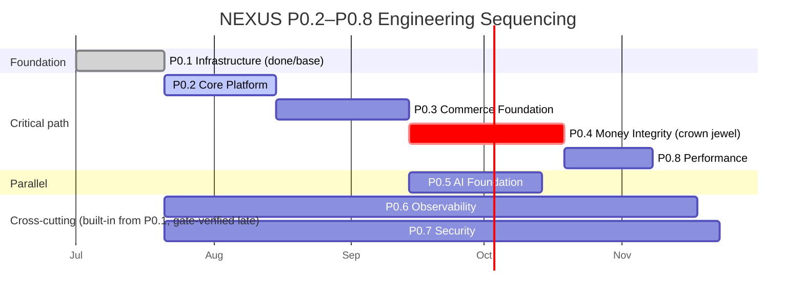

# E3 — P0.2–P0.8 Engineering Roadmap

**Status:** 🟢 Ratified build plan (engineering detail) · **Owner:** Principal Engineer + CTO · **Depends on:** [13 — Implementation Roadmap](../13-implementation-roadmap.md), P0.1 Engineering Spec (E1) & Acceptance Tests (E2) · **Certified against:** docs [04](../04-system-architecture.md)/[05](../05-ai-architecture.md)/[06](../06-database-architecture.md)/[07](../07-api-architecture.md)/[08](../08-security-architecture.md) and ADRs 0001–0022.

---

This document expands the P0.2–P0.8 gate summary in [13 §the-eight-sub-phases](../13-implementation-roadmap.md) into **engineering detail**: for each sub-phase — objective, workstreams/epics, the technical decisions already fixed by ADR vs. those open at build time, the data-model and API touchpoints, dependencies and parallelizable work, a measurable/testable exit gate, and top risks. **P0.4 Money Integrity** — the crown jewel — receives extended treatment and a concrete "zero money mismatch" test set.

**Conventions (lint-enforced).** RFC-2119 keywords (**MUST**/**SHOULD**/**MAY**) are normative. Money-event delivery is **effectively-once** (at-least-once relay + dedup-on-event-id), never described as unqualified "exactly-once." Confirm/reverse ordering keys on **NEXUS's own monotonic receipt sequence + a signed reconciliation decision** — never a network-supplied timestamp. The savings model uses exactly the four states **Estimated · Pending · Confirmed · Reversed** ([ADR-0021](../adr/ADR-0021-legal-product-truth.md) D4); **VMS counts Confirmed only**. Every claim traces to a certified doc or ADR; the [doc-consistency lint](../04-system-architecture.md#10-fitness-functions-how-we-keep-it-healthy) guards this file too.

> **Relationship to earlier docs.** [13](../13-implementation-roadmap.md) sets the eight gates and the P0.1 cross-cutting rule (Observability P0.6 and Security P0.7 are **built-in from the first commit**, gate-*verified* late). This E3 does not re-decide anything certified — it sequences the build. Market rollout across regions still follows [ADR-0007](../adr/ADR-0007-phased-global-rollout.md) (see the closing note).

---

## P0.2 — Core Platform

### Objective
Stand up the identity, access, and platform-control substrate every later service binds to: authentication, authorization, user/profile, settings, feature flags, and the tamper-evident audit trail. Realizes [08 §3](../08-security-architecture.md#3-identity--access-management-iam) (IAM), [04](../04-system-architecture.md#4-component-responsibilities) Identity, [07 §6](../07-api-architecture.md#6-authn--authz-for-apis) (API AuthN/AuthZ), and the operability fitness functions of [ADR-0010](../adr/ADR-0010-platform-principles.md).

### Workstreams / epics
- **auth-service** — OIDC provider integration, **Auth Code + PKCE** for public clients ([07 §6.2](../07-api-architecture.md#62-public-client-login-auth-code--pkce)), **passkeys/WebAuthn** + step-up **MFA** ([08 §3.2](../08-security-architecture.md#32-authentication-authn)), session lifecycle/rotation ([08 §3.4](../08-security-architecture.md#34-session-management)).
- **authz / policy engine** — **RBAC + ABAC** PDP ([08 §3.3](../08-security-architecture.md#33-authorization--rbac--abac)); ABAC attributes include region (drives compliance policy-pack selection, [08 §9](../08-security-architecture.md#9-compliance-phased-per-jurisdiction-policy-packs)) and separation-of-duties (backs the P0.4 payout 4-eyes rule). The PDP **MUST** run **HA — no authorization SPOF** ([ADR-0013](../adr/ADR-0013-ledger-per-context.md) fix R-069).
- **user-service** — identity/profile domain (owns [06 §3.1](../06-database-architecture.md#31-identity--profile)); no cross-service table sharing ([06 §2](../06-database-architecture.md#2-data-ownership--the-no-shared-tables-rule)).
- **settings-service** — per-user + per-market preferences, currency/locale.
- **feature-flag service** — **country + cohort** flags, the enablement primitive for [ADR-0007](../adr/ADR-0007-phased-global-rollout.md) phased rollout and the P0.4 cashback jurisdiction gate ([ADR-0021](../adr/ADR-0021-legal-product-truth.md) D3). Built-in from P0.1; matured here.
- **audit-log pipeline** — append-only, **tamper-evident** trail for every auth/privileged/money-adjacent action ([07 §11](../07-api-architecture.md#11-observability-of-apis) audit logging, [08 §8.2](../08-security-architecture.md#82-ledger-integrity--audit)); feeds later Ledger reconciliation and security forensics.
- **service-to-service identity** — **mTLS + SPIFFE** workload identity ([07 §6.3](../07-api-architecture.md#63-service-to-service-mtls--spiffe)) so every later service authenticates in-mesh.
- **action-scope primitive** — the delegated-authority token (`action_scope_token`, [07 §6.5](../07-api-architecture.md#65-per-user-agent-action-scope-the-delegated-authority-primitive)) that P0.3 handoff and P0.5 agent tools require for money-adjacent operations.

### Key technical decisions — fixed vs. open
- **Fixed:** RBAC+ABAC dual model, PDP-HA, mTLS+SPIFFE for east-west, passkeys+MFA, region-as-ABAC-attribute, tamper-evident audit — all in [08 §3](../08-security-architecture.md#3-identity--access-management-iam)/[ADR-0010](../adr/ADR-0010-platform-principles.md)/[ADR-0013](../adr/ADR-0013-ledger-per-context.md).
- **Open at build:** concrete OIDC IdP product; passkey attestation policy strictness; session TTL/refresh tuning; audit-log storage backend (append-only store vs. hash-chained log) — decide within the certified envelope, record as engineering ADRs.

### Data model touchpoints (doc 06) · API surface (doc 07)
- **Data:** [06 §3.1 Identity & Profile](../06-database-architecture.md#31-identity--profile); PII classification + encryption ([06 §12.1–12.2](../06-database-architecture.md#12-data-governance)).
- **API:** login/PKCE ([07 §6.2](../07-api-architecture.md#62-public-client-login-auth-code--pkce)), `/config/markets` feature flags ([07 §4.0](../07-api-architecture.md#40-resource-map)), health/metrics endpoints standard ([07 §11.1](../07-api-architecture.md#111-health-check--metrics-endpoints-platform-standard)).

### Dependencies · parallelizable work
- **Depends on:** P0.1 infra (CI/CD, EKS, secrets, OTel/scan gates live).
- **Parallelizable:** user-service, settings-service, feature-flag service, and audit pipeline can be built concurrently once auth-service + PDP contracts are frozen. Audit pipeline and feature-flag service are cross-cutting and start in P0.1.

### Exit gate (measurable)
**Login → Dashboard full flow works:** a user completes **passkey/MFA** login; the dashboard is **RBAC-scoped** to their role; a **feature-flag toggle** takes effect live without deploy; and **every auth + privileged action appears in the tamper-evident audit log** with a correlation id. Testable as: (1) automated passkey+MFA E2E; (2) RBAC/ABAC deny-by-default authorization matrix test; (3) flag-flip integration test; (4) audit-completeness assertion (privileged action ⇒ audit row, no gaps).

### Top risks
- Auth is on the critical path for *every* later phase — schedule slippage cascades.
- PDP correctness is money-safety-adjacent (it later authorizes payouts); a permissive default is catastrophic → deny-by-default + the independent invariant-checker pattern arrives in P0.4.
- Audit-log completeness gaps would undermine P0.4 reconciliation forensics; enforce "privileged-action ⇒ audit-row" as a fitness function.

---

## P0.3 — Commerce Foundation

### Objective
Deliver the neutral discovery core loop and the authorized-source commerce plane: Affiliate Gateway (multi-connector, sandboxed, no SPOF), Merchant Gateway, Product Catalog, Search, and the Referral Engine that produces the **click-out** every money flow later reconciles against. Realizes [04 §5–6](../04-system-architecture.md#5-data-flow-patterns), [ADR-0008](../adr/ADR-0008-affiliate-gateway.md)/[ADR-0018](../adr/ADR-0018-connector-security-hardening.md), and the catalog/offer models of [06](../06-database-architecture.md#32-catalog--offer-product--offer--merchant--price).

### Workstreams / epics
- **Affiliate Gateway** ([04 §6.1](../04-system-architecture.md#61-affiliate-gateway--plugin-connectors--automatic-failover-adr-0008)) — plugin architecture; **≥4 connectors** (Amazon PA-API, CJ, Impact, Rakuten) each implementing the single `AffiliateConnector` interface ([07 §9.1](../07-api-architecture.md#91-affiliate-gateway-connector-contract-internal)). Connectors run **out-of-process in a hardened runtime (gVisor/Kata/microVM), least-privilege, no core secrets/DB** ([ADR-0018](../adr/ADR-0018-connector-security-hardening.md)). Health-based routing + circuit breaker + **automatic failover**; degrade to cached price + `staleness_badge` when all connectors are down. Connector `capabilities()` are **NEXUS-verified, not trusted**.
- **Feed Ingestion (legitimacy boundary)** ([04 §5.2](../04-system-architecture.md#52-event-driven-feed-ingestion-the-legitimacy-boundary)) — every record **license-tagged at the adapter** ([ADR-0001](../adr/ADR-0001-data-sourcing.md)); no ad-hoc partner write API.
- **Merchant Gateway** — merchant/deep-link resolution; **open-redirect defense** ([07 §4.3](../07-api-architecture.md#43-agentic-handoff-idempotent-with-safety-gate), [ADR-0018](../adr/ADR-0018-connector-security-hardening.md)): final-hop host validated against a per-merchant canonical-destination allowlist before any signed redirect.
- **Product Catalog + canonical Offer** — [06 §3.2](../06-database-architecture.md#32-catalog--offer-product--offer--merchant--price) and the [canonical Offer schema + license tags §4](../06-database-architecture.md#4-canonical-offer-schema--license-tags); all-in price object.
- **Search** — lexical → **hybrid** (OpenSearch, [06 §6](../06-database-architecture.md#6-search-index-opensearch)); **neutral ranking** with the physically-separated Placement service ([04 §5.3](../04-system-architecture.md#53-neutrality-enforcement), [ADR-0021](../adr/ADR-0021-legal-product-truth.md) D5 commission-blind).
- **Referral Engine + Handoff** — confirmation-gated **handoff session** that stamps attribution and returns a **signed merchant redirect** — no order, no payment, no custody ([ADR-0006](../adr/ADR-0006-referral-only-model.md), [07 §4.3](../07-api-architecture.md#43-agentic-handoff-idempotent-with-safety-gate)). **Every `handoff.redirected` writes the NEXUS-owned click-out ledger** — the source of truth P0.4 reconciles against.

### Key technical decisions — fixed vs. open
- **Fixed:** single connector interface + no-SPOF failover + sandboxed connectors ([ADR-0008](../adr/ADR-0008-affiliate-gateway.md)/[ADR-0018](../adr/ADR-0018-connector-security-hardening.md)); neutrality wall ([ADR-0021](../adr/ADR-0021-legal-product-truth.md) D5); referral-only handoff ([ADR-0006](../adr/ADR-0006-referral-only-model.md)); commission disclosure MUST appear wherever affiliate links appear ([ADR-0021](../adr/ADR-0021-legal-product-truth.md) D1); travel is **independent referrals only, no bundling** ([ADR-0021](../adr/ADR-0021-legal-product-truth.md) D2).
- **Open at build:** ranking feature set + weights (within the buyer-value-only constraint); OpenSearch single-cluster→cells trigger point ([06 §6.1](../06-database-architecture.md#61-the-documented-trigger-point--single-cluster--opensearch-cells)); which merchants additionally get direct S2S webhooks ([ADR-0011](../adr/ADR-0011-attribution-reconciliation.md) top-merchant option).

### Data model touchpoints (doc 06) · API surface (doc 07)
- **Data:** [06 §3.2 Catalog/Offer](../06-database-architecture.md#32-catalog--offer-product--offer--merchant--price), [§3.8 Referral/saga](../06-database-architecture.md#38-referral--attributed-conversion-saga-state) (REFERRAL, REFERRAL_ITEM with `offer_snapshot` freezing the all-in price — the VMS receipt), [§3.7 CLICKOUT_LEDGER](../06-database-architecture.md#37-affiliate--attribution-event-sourced), [§4 canonical Offer](../06-database-architecture.md#4-canonical-offer-schema--license-tags), [§5 price time-series](../06-database-architecture.md#5-price-time-series-clickhouse).
- **API:** `/search`, `/offers` ([07 §4.1](../07-api-architecture.md#41-search--offers)); `/offers/{id}/price` ([07 §4.2](../07-api-architecture.md#42-live-price-intent-time-tier-3-per-sdd-8)); `/handoff/sessions` + `:confirm` ([07 §4.3](../07-api-architecture.md#43-agentic-handoff-idempotent-with-safety-gate)); connector contract ([07 §9.1](../07-api-architecture.md#91-affiliate-gateway-connector-contract-internal)).

### Dependencies · parallelizable work
- **Depends on:** P0.1 (infra) + P0.2 (auth, action-scope token, feature flags, audit).
- **Parallelizable:** Catalog, Search, and the connector implementations can proceed concurrently behind the frozen `AffiliateConnector` interface; Referral/Handoff needs Catalog + at least one connector live.

### Exit gate (measurable)
**Search → best all-in price → affiliate redirect** end-to-end: neutral ranking (Placement cannot reorder neutral results — asserted by test); **price-claim audit ≥ 99%** (NFR-COMP-01); the **Gateway fails over across connectors with no SPOF** (kill the primary connector mid-request → served from a healthy alternate, attribution neither lost nor double-stamped); a **signed handoff resolves only to an allow-listed merchant** (open-redirect test); and **every handoff writes exactly one click-out ledger row**.

### Top risks
- **First-revenue coupling to P0.4:** the very first real conversion needs P0.4's provisional-accrual/hold-gate live, so P0.3 and P0.4 are tightly sequenced — P0.4 is **not deferrable past the first revenue event** ([13 §risks](../13-implementation-roadmap.md#risks--cto-notes)).
- Cross-provider attribution normalization is non-trivial (double-count/fraud surface) — mitigated by connector-pinning-per-`(offer, session)` designed in P0.4.
- Connector sandbox performance overhead vs. p95 budget — validated in P0.8.

---

## P0.4 — Money Integrity 🔒 *(crown jewel)*

### Objective
Make money **provably correct before it is ever payable**. This sub-phase builds the referral-tracking → conversion-ingest → ledger → hold-gate → reversal → reconciliation chain so that **no forged, duplicated, out-of-order, or reversed postback can ever produce a payable liability or an overstated savings claim**. Realizes [ADR-0011](../adr/ADR-0011-attribution-reconciliation.md) (attribution reconciliation), [ADR-0012](../adr/ADR-0012-postback-integrity.md) (postback integrity), [ADR-0013](../adr/ADR-0013-ledger-per-context.md) (ledger-per-context + GL), [ADR-0014](../adr/ADR-0014-wallet-hold-gate.md) (wallet hold-gate), and the round-2 corrections in [ADR-0022](../adr/ADR-0022-round2-remediation.md) (NC-1/NC-2/NC-3), over the money models in [06 §3.5–3.8](../06-database-architecture.md#35-rewards--wallet).

> **Why this is the crown jewel.** Under the pure-referral model ([ADR-0006](../adr/ADR-0006-referral-only-model.md)) **100% of primary revenue and the VMS north-star ride on async, network-controlled, reversible postbacks NEXUS never independently observes** ([ADR-0011](../adr/ADR-0011-attribution-reconciliation.md)). Every other phase can be re-run; a money leak here is real and often unrecoverable. The gate is **binding**: no money feature ships without it ([ADR-0022](../adr/ADR-0022-round2-remediation.md) NC-4, [10 §12](../10-deployment-architecture.md)).

### Workstreams / epics (each mapped to its ADR)

**E4.1 — Referral & click-out tracking** → [ADR-0011](../adr/ADR-0011-attribution-reconciliation.md)
- Own the **click-out ledger**: every `handoff.redirected` logged with a **NEXUS-minted `clickout_id`** ([06 §3.7 CLICKOUT_LEDGER](../06-database-architecture.md#37-affiliate--attribution-event-sourced)) — a source of truth independent of any network.
- Event-sourced **ATTRIBUTION_STATE** as a left-fold over **ATTRIBUTION_EVENT** (`click/stamp/postback/confirm/reverse`); deterministic replay from per-account `seq=0`.

**E4.2 — Conversion postback ingest → provisional accrual** → [ADR-0012](../adr/ADR-0012-postback-integrity.md)
- Ingest endpoint ([07 §9 attribution postbacks](../07-api-architecture.md#9-partner--affiliate-integration-apis--webhooks)) **MUST NOT treat a postback as truth**: it creates a **`pending`, non-payable** accrual (`payable = false`) until *independently* corroborated ([06 §3.8 ATTRIBUTED_CONVERSION](../06-database-architecture.md#38-referral--attributed-conversion-saga-state)).
- **Per-connector auth table** in the Gateway (actual scheme/algorithm/rotation) replaces the naïve "signature-verified MUST"; a weak scheme ⇒ **unverified signal**, never truth.
- **Purchase-fingerprint dedup**: `hash(merchant, normalized_offer, user, amount_bucket, time_bucket)` with **overlapping/jittered buckets cross-checked against per-user velocity + connector-pair collusion signals** (H-7); a match within the longest cookie window routes to a **hold/adjudication queue**, not auto-credit.
- **One connector pinned per `(offer, session)`** for the attribution window so mid-session failover cannot re-stamp/double-attribute (R-002).
- **Idempotent on `(network, network_txn_id)`**; redelivery is a no-op.

**E4.3 — Ledger-per-context + reconciliation GL** → [ADR-0013](../adr/ADR-0013-ledger-per-context.md) / [ADR-0022](../adr/ADR-0022-round2-remediation.md) NC-2
- **Four independent sub-ledgers** (affiliate, cashback, rewards, creator payouts), each append-only double-entry with the invariant **scoped to that sub-ledger** ([06 §3.6](../06-database-architecture.md#36-ledger-double-entry-event-sourced)); **domains never write each other's ledgers**.
- **No cross-ledger atomic fan-out**: a confirmed conversion emits **one `conversion.confirmed` event**; each sub-ledger **consumes it independently and idempotently** (at-least-once + dedup-on-event-id ⇒ **effectively-once**). Per-domain accrual is eventually consistent **by construction**; there is no distributed write to compensate.
- **Reconciliation GL** asynchronously aggregates sub-ledgers into the audited, hash-chained, double-entry consolidated view (eventually consistent for reporting; **not** for per-domain authorization, which stays strong).
- **Money invariant dual-enforced**: domain service **and** an independent invariant-checker both validate every balance-changing op (R-069); PDP runs HA.
- **Portable ordering**: **per-account monotonic sequence**, no global-sequence lock-in for the future distributed-SQL migration ([06 §10.4](../06-database-architecture.md#104-the-documented-trigger-point--partitioned-postgres--distributed-sql)).
- **Durable relay**: transactional outbox → Kafka, at-least-once + dedup, survives Postgres failover so money events are never lost in the relay gap ([06 §8](../06-database-architecture.md#8-event-store--outbox--cdc)).

**E4.4 — Cashback hold-gate (available/held wallet)** → [ADR-0014](../adr/ADR-0014-wallet-hold-gate.md)
- Two-balance wallet: **`available_cash` (payable)** and **`held_cash` (pending, non-payable)**, both **materialized caches of the wallet sub-ledger** — the sub-ledger is authoritative ([06 §3.5](../06-database-architecture.md#35-rewards--wallet)).
- Accrual lands in **`held_cash`**; moves to `available_cash` **only** when `confirmed` past the hold/clawback window.
- **Payout hold-gate (MUST):** a payout MAY draw **only** from `available_cash`; a `held`/`pending` amount is **never payable** — enforced server-side in the wallet sub-ledger, **not** in UI. This closes the accrue→payout→return leak (R-005) by construction.
- Surfaces the ratified four-state savings model **Estimated → Pending → Confirmed → Reversed** ([ADR-0021](../adr/ADR-0021-legal-product-truth.md) D4); **VMS counts Confirmed only.**
- Cashback stays gated per jurisdiction behind a country flag until legal review ([ADR-0021](../adr/ADR-0021-legal-product-truth.md) D3).

**E4.5 — Reversal: NEXUS-sequence ordering + reconciliation** → [ADR-0012](../adr/ADR-0012-postback-integrity.md) / [ADR-0022](../adr/ADR-0022-round2-remediation.md) NC-3
- `pending → confirmed → reversed` is an **idempotent, order-independent state machine**; confirm/reverse are ordered by **NEXUS's own monotonic receipt sequence + a signed reconciliation decision** — **never** the attacker-suppliable `network_event_at` (which is advisory only).
- A **raw postback can never *un-reverse* a reversal**; a reversal is authoritative **only when corroborated by reconciliation** ([ADR-0011](../adr/ADR-0011-attribution-reconciliation.md)). Reversals post **compensating** sub-ledger entries.
- Referral/attribution partitions retained **at least the longest network return/reversal window** so a late reversal always finds its accrual (R-084).

**E4.6 — Commission reconciliation SLI** → [ADR-0011](../adr/ADR-0011-attribution-reconciliation.md) / [ADR-0022](../adr/ADR-0022-round2-remediation.md) NC-1
- **Three-way reconciliation** (`RECON_RUN`, [06 §3.7](../06-database-architecture.md#37-affiliate--attribution-event-sourced)) per network/region/period: (a) NEXUS click-out volume × modeled rate, (b) network reporting-API pull, (c) a **blinded, rotated, population-diversified real-purchase panel** (NC-1: a network cannot report panel traffic correctly while under-reporting the rest).
- Emit **`attribution_gap_rate`** (`ATTRIBUTION_GAP`) as a first-class **revenue-integrity SLI** with baselines + anomaly alerts into the FinOps/anomaly infra; VMS reported **with confidence bounds** and audited against the panel (falsifiable, R-021).

### Key technical decisions — fixed vs. open
- **Fixed (not rollback-eligible):** provisional-by-construction accrual; hold-gate; **reversal-ordering source** and the **blinded panel** are **safety-critical, not rollback-eligible** ([ADR-0022](../adr/ADR-0022-round2-remediation.md)); reverting to a single wallet balance is **forbidden** without a superseding ADR ([ADR-0014](../adr/ADR-0014-wallet-hold-gate.md)); ledger-per-context + no-cross-ledger-fan-out; per-account ordering; dual-enforced invariant.
- **Open at build:** hold-window length per market (config); fingerprint threshold + bucket jitter parameters (config-flagged); false-positive/false-negative **fraud-loss budget** sizing; reconciliation cadence per connector (Amazon is batch); which top merchants get direct S2S corroboration; GL reconciliation-latency SLO.

### Data model touchpoints (doc 06) · API surface (doc 07)
- **Data:** [§3.5 Wallet](../06-database-architecture.md#35-rewards--wallet), [§3.6 Ledger](../06-database-architecture.md#36-ledger-double-entry-event-sourced), [§3.7 Attribution + reconciliation store](../06-database-architecture.md#37-affiliate--attribution-event-sourced), [§3.8 Referral/ATTRIBUTED_CONVERSION saga](../06-database-architecture.md#38-referral--attributed-conversion-saga-state); consistency/saga [§9](../06-database-architecture.md#9-consistency-model); retention [§12.3](../06-database-architecture.md#12-data-governance).
- **API:** attribution postback ingest + webhook idempotency ([07 §9](../07-api-architecture.md#9-partner--affiliate-integration-apis--webhooks)); `/wallet`, `/wallet/transactions`, `/wallet/payouts`, `/creator/earnings` ([07 §4.5](../07-api-architecture.md#45-wallet-creator-travel-shape-sketch)); idempotency-key MUST on all money/attribution mutations ([07 §8.1](../07-api-architecture.md#81-idempotency-handoff--ledger)); payout **dual-control (4-eyes)** ([08 §8.3](../08-security-architecture.md#83-payout-controls--hold-gate--dual-control-4-eyes)).

### Dependencies · parallelizable work
- **Depends on:** P0.2 (PDP-HA, audit, action-scope) **and** P0.3 (click-out ledger, connectors, referral/handoff). Critical path: P0.1 → P0.2 → P0.3 → **P0.4** → P0.8.
- **Parallelizable:** the four sub-ledgers are independently deployable ([ADR-0013](../adr/ADR-0013-ledger-per-context.md)) and can be built by separate teams; the reconciliation subsystem (E4.6) parallels ledger work once the click-out ledger (E4.1) and postback ingest (E4.2) contracts are frozen; the GL is additive over the sub-ledgers.

### Exit gate — "Zero money mismatch," made a concrete test set
The gate is **zero money mismatch**, decomposed into an executable, CI-runnable suite (restates & makes testable [13 P0.4](../13-implementation-roadmap.md#the-eight-sub-phases)):

| # | Test | Asserts | ADR |
|---|------|---------|-----|
| **T-1 Attribution gap = 0** | Seed a synthetic network of click-outs + postbacks with a known ground truth; run `RECON_RUN`. | `attribution_gap_rate = 0` on the seeded set; any injected under-report is **detected + alerted** (SLI fires). | [0011](../adr/ADR-0011-attribution-reconciliation.md) |
| **T-2 Hold-gate** | Accrue a conversion (lands in `held_cash`); attempt payout before `confirmed`. | Payout is **rejected**; `held`/`pending` is **never payable**; only `available_cash` is drawable. | [0014](../adr/ADR-0014-wallet-hold-gate.md) |
| **T-3 Forged/replayed postback cannot un-reverse** | Reverse a clawed-back accrual, then replay a forged postback carrying a **future `network_event_at`**. | The reversal **holds**; a raw postback **cannot un-reverse** it; ordering used NEXUS receipt sequence, not the network timestamp. | [0012](../adr/ADR-0012-postback-integrity.md)/[0022](../adr/ADR-0022-round2-remediation.md) NC-3 |
| **T-4 Duplicate / failover dedup** | Emit the same physical purchase via two connectors + a mid-session failover. | Exactly **one** accrual; duplicate routes to hold/adjudication; `(network, network_txn_id)` idempotent; connector pinned per `(offer, session)`. | [0012](../adr/ADR-0012-postback-integrity.md) |
| **T-5 GL balances to sub-ledgers** | Run a mixed workload of accrual/confirm/reverse across all four sub-ledgers; reconcile GL. | Double-entry **Σ debits = Σ credits** per sub-ledger; GL **reconciles to each sub-ledger** (eventually consistent, converges); `available + held` = Σ wallet sub-ledger entries. | [0013](../adr/ADR-0013-ledger-per-context.md) |
| **T-6 Effectively-once fan-out** | Redeliver one `conversion.confirmed` event N times across a Postgres failover. | Each sub-ledger applies it **once** (dedup-on-event-id); no lost event, no double accrual; **effectively-once**. | [0013](../adr/ADR-0013-ledger-per-context.md)/[0022](../adr/ADR-0022-round2-remediation.md) NC-2 |
| **T-7 Late reversal finds its accrual** | Reverse just inside the longest return window after archival cadence. | The accrual partition is **still retained**; the reversal posts its compensating entry. | [0012](../adr/ADR-0012-postback-integrity.md) R-084 |
| **T-8 VMS = Confirmed only** | Feed Estimated + Pending + Confirmed + Reversed states. | VMS counts **Confirmed only**; Estimated/Pending never presented as guaranteed; a Reversed conversion reverses its cashback. | [0021](../adr/ADR-0021-legal-product-truth.md) D4 |
| **T-9 Payout 4-eyes** | Attempt an above-threshold payout with initiator = approver. | **Rejected** by the ABAC separation-of-duties attribute; both identities + signed instruction logged. | [08 §8.3](../08-security-architecture.md#83-payout-controls--hold-gate--dual-control-4-eyes) |

**Gate passes when T-1…T-9 are green in CI** and the reconciliation SLI dashboard is live with baselines + alerts. These map 1:1 to the [13 P0.4](../13-implementation-roadmap.md#the-eight-sub-phases) sub-criteria (a)–(d) and extend them.

### Top risks
- **Networks may not expose reporting APIs** for all four connectors → where absent, lean on the blinded panel + merchant-direct S2S and **document the residual as a modeled fraud/margin budget** ([ADR-0011](../adr/ADR-0011-attribution-reconciliation.md)).
- **Fingerprint false positives** create UX friction (delayed cashback) → sized explicitly as a fraud-loss budget; jitter/threshold tuned against the panel.
- **GL reconciliation latency** could make consolidated reporting stale — acceptable for reporting, **never** for per-domain authorization (which stays strong); track the latency SLO.
- **Confirmed→reversed after payout** is a rare tail → handled by negative-balance recovery + collusion detection, not the default path ([ADR-0014](../adr/ADR-0014-wallet-hold-gate.md)).

---

## P0.5 — AI Foundation

### Objective
Deliver grounded, cost-bounded, commission-blind AI: the model-agnostic Gateway/router, prompt library, embeddings + RAG, the deterministic price-claim verifier, and the neutral recommendation engine. Realizes [05](../05-ai-architecture.md), [ADR-0005](../adr/ADR-0005-ai-model-gateway.md) (gateway), [ADR-0009](../adr/ADR-0009-ai-cost-strategy.md) (cost), and [ADR-0015](../adr/ADR-0015-ai-trust-cost-integrity.md) (trust/cost/integrity).

### Workstreams / epics
- **AI Gateway / model router** ([05 §2](../05-ai-architecture.md#2-model-agnostic-ai-gateway--router)) — vendor-agnostic; **cheapest-capable routing + cheap-model-first cascade** ([05 §2.4](../05-ai-architecture.md#24-cheapest-capable-routing--cheap-model-first-cascade-cost-engine-of-nfr-ai-02)); **residency-fenced routing** ([05 §2.6](../05-ai-architecture.md#26-residency-fenced-routing-adr-0016)).
- **Four-tier caching + batching** ([05 §2.5](../05-ai-architecture.md#25-four-tier-caching--batching)) — modeled with a **low long-tail hit-rate + cheap-tier cascade fallback** (NC-5, no assumed hit-rate); FinOps tracks hit-rate by query class.
- **Prompt library + agent loop + tool catalog** ([05 §3](../05-ai-architecture.md#3-agentic-architecture)) over the single **tool-RPC** surface ([07 §4.4](../07-api-architecture.md#44-the-agent-tool-api-function-calling-catalog)); the delegated-handoff **safety confirmation gate** ([05 §3.5](../05-ai-architecture.md#35-delegated-handoff-with-the-safety-confirmation-gate)) requires the P0.2 `action_scope_token`.
- **Embeddings + vector store + RAG** ([05 §4](../05-ai-architecture.md#4-rag--grounding)) grounded on the P0.3 catalog (authorized sources only).
- **Claim-Verification Agent** ([05 §4.3](../05-ai-architecture.md#43-claim-verification--how-pricefact-claims-are-grounded-the-nfr-ai-01-engine)) — **the price NUMBER a user sees is verified by deterministic code against the authorized feed at intent, never LLM-asserted** ([ADR-0015](../adr/ADR-0015-ai-trust-cost-integrity.md), safety-critical, not rollback-eligible); prices are live-checked (Tier-3), cross-source corroborated with outlier anomaly flags ("grounded ≠ true").
- **Recommendation engine** ([05 §5](../05-ai-architecture.md#5-recommendation-engine)) — held to the same **neutrality wall**; **commission-blind** ([ADR-0021](../adr/ADR-0021-legal-product-truth.md) D5); commission disclosure verbalized before redirect ([ADR-0021](../adr/ADR-0021-legal-product-truth.md) D1, [11](../11-product-guidelines.md)).

### Key technical decisions — fixed vs. open
- **Fixed:** model-agnostic router ([ADR-0005](../adr/ADR-0005-ai-model-gateway.md)); deterministic price verification (not rollback-eligible); commission-blind ranking; disclosure MUST; $0.01 blended target validated against *actual* long-tail mix (NC-5).
- **Open at build:** exact model roster + routing policy weights; embedding model + vector store product; eval thresholds beyond the certified floors; canary granularity per capability class (search-rank / agent-reason / claim-verify, [ADR-0022](../adr/ADR-0022-round2-remediation.md) R-009).

### Data model touchpoints (doc 06) · API surface (doc 07)
- **Data:** catalog + image vectors ([06 §3.2](../06-database-architecture.md#32-catalog--offer-product--offer--merchant--price), [§6](../06-database-architecture.md#6-search-index-opensearch)); price time-series for grounding ([06 §5](../06-database-architecture.md#5-price-time-series-clickhouse)).
- **API:** `/agent/tools` catalog + tool-RPC ([07 §4.4](../07-api-architecture.md#44-the-agent-tool-api-function-calling-catalog)); live price for claim-verify ([07 §4.2](../07-api-architecture.md#42-live-price-intent-time-tier-3-per-sdd-8)).

### Dependencies · parallelizable work
- **Depends on:** P0.3 (catalog/search/offers for RAG grounding + live price). **Parallels P0.4** (no hard dependency on the ledger; but agent-executed payment is deferred to P5+).
- **Parallelizable:** Gateway/router, embeddings/RAG, and the recommendation engine build concurrently once the catalog contract is frozen; the Claim-Verify agent depends on the live-price tool.

### Exit gate (measurable)
**AI consistently produces grounded recommendations:** hallucination **< 0.5%** on eval (NFR-AI-01); **price numbers deterministically verified** (fault-injection proves no LLM-asserted number can reach the user); **blended cost ≤ $0.01/resolved request** (NFR-AI-02) validated against the actual long-tail mix; **commission-blind ranking** (neutrality fitness test) with disclosure verbalized before every redirect.

### Top risks
- Long-tail/personalized queries erode cache hit-rate and blow the cost target → cheap-tier cascade + FinOps hit-rate-by-class tracking (NC-5); if content still absent, R-081 stays **open**, not phantom-closed.
- Prompt injection over untrusted product data ([05 §7.1](../05-ai-architecture.md#71-prompt-injection-defense--product-data-is-untrusted-input)) → treated as untrusted input; guardrails + red-team harness ([05 §7.4](../05-ai-architecture.md#74-red-team-eval-harness)).
- A bad routing policy reaching all capabilities at once → per-capability-class canary (R-009).

---

## P0.6 — Observability *(cross-cutting from P0.1; gate-verified here)*

### Objective
Prove "everything traceable." Observability is **built into every service from its first commit** ([13 cross-cutting](../13-implementation-roadmap.md#cross-cutting-from-p01-not-late-phases--cto-refinement)); this sub-phase *verifies* the coverage and stands up the money/VMS business dashboards. Realizes [09 §11](../09-cloud-architecture.md), [10 §7](../10-deployment-architecture.md), [ADR-0010](../adr/ADR-0010-platform-principles.md), [ADR-0017](../adr/ADR-0017-blast-radius-isolation.md).

### Workstreams / epics
- **OpenTelemetry** traces/metrics/logs on every service (day-one, [ADR-0010](../adr/ADR-0010-platform-principles.md) fitness function); correlation-id + W3C `traceparent` propagated through gateway → BFF → gRPC → events → webhooks ([07 §11](../07-api-architecture.md#11-observability-of-apis)).
- **Grafana / Prometheus / Loki / Tempo** stack; RED metrics per route+tier; per-service **SLO dashboards + error budgets** (budget breach freezes risky change to that surface).
- **Business dashboards:** the **money** dashboards (ledger balances, GL reconciliation) and the **VMS** dashboard (Confirmed-only) + the P0.4 **`attribution_gap_rate` revenue-integrity SLI**.
- **Isolated failure domain:** observability runs on an isolated blast-radius domain ([ADR-0017](../adr/ADR-0017-blast-radius-isolation.md)) so it survives an incident it is meant to observe.
- **Health/metrics endpoints** standard on every service ([07 §11.1](../07-api-architecture.md#111-health-check--metrics-endpoints-platform-standard)).

### Key technical decisions — fixed vs. open
- **Fixed:** OTel mandate + 100% trace coverage of user-facing paths (NFR-OBS-01); observability on an isolated failure domain ([ADR-0017](../adr/ADR-0017-blast-radius-isolation.md)); error-budget-freeze policy.
- **Open at build:** sampling strategy for high-volume traces; dashboard/alert thresholds; retention tiers for traces vs. logs.

### Data model touchpoints · API surface
- **Data:** metering/analytics event stream (Kafka → ClickHouse) shared with the dev-platform meter ([07 §10](../07-api-architecture.md#10-developer-platform-h3-revenue-stream)).
- **API:** health + metrics endpoints on every service ([07 §11.1](../07-api-architecture.md#111-health-check--metrics-endpoints-platform-standard)).

### Dependencies · parallelizable work
- **Depends on:** capability threads through P0.1–P0.5 (each service ships instrumented). **Verified** near the end; money/VMS dashboards need P0.4 live.
- **Parallelizable:** dashboard/alert build proceeds continuously alongside every phase.

### Exit gate (measurable)
**Everything traceable:** **100% distributed-trace coverage** of user-facing paths (NFR-OBS-01); per-service SLO dashboards + error budgets live; **money & VMS (Confirmed-only) business dashboards live**; and observability demonstrably runs on an **isolated failure domain** (kill a primary cell → observability still reports).

### Top risks
- Trace-coverage gaps in async tails (postback ingest, webhook redelivery) → assert coverage of the async money path specifically.
- Cardinality/cost blow-up from over-instrumentation → sampling + budget.

---

## P0.7 — Security *(cross-cutting from P0.1; gate-verified here)*

### Objective
Prove the platform ships with **zero High/Critical vulnerabilities** and a signed, attested supply chain. Scanning runs as **blocking CI gates from P0.1**; this sub-phase verifies the posture and runs the pre-GA pen-test. Realizes [08](../08-security-architecture.md), [10 §2](../10-deployment-architecture.md#2-ci-pipeline), [ADR-0018](../adr/ADR-0018-connector-security-hardening.md).

### Workstreams / epics
- **CI security gates (from P0.1):** SAST, DAST, dependency scan, secret scan, container scan — **blocking** ([10 §2](../10-deployment-architecture.md#2-ci-pipeline), [08 §5.5](../08-security-architecture.md#55-pipeline-security-testing)).
- **Supply chain:** **SBOM** + **image signing (SLSA provenance)**; **CRD/API-deprecation scanner** ([ADR-0022](../adr/ADR-0022-round2-remediation.md) R-019).
- **Connector hardened runtime** ([ADR-0018](../adr/ADR-0018-connector-security-hardening.md)): connectors in gVisor/Kata/microVM, least-privilege, no core secrets/DB; per-region×per-connector secret rotation (ESO + KMS).
- **App-sec controls:** OWASP Web + API Top-10 mappings ([08 §5.1–5.2](../08-security-architecture.md#51-owasp-web-top-10--nexus-controls)); **SSRF defense** ([08 §5.4](../08-security-architecture.md#54-ssrf-defense-critical--we-call-many-external-apis)) — critical since we call many external APIs.
- **Fraud/abuse defense** ([08 §7](../08-security-architecture.md#7-fraud--abuse-defense)) — affiliate/attribution fraud, coupon/cashback fraud, ATO, bot defense (interlocks with P0.4).
- **Pen-test** pass before first GA.

### Key technical decisions — fixed vs. open
- **Fixed:** scanning is CI-blocking from day one; connectors sandboxed in a hardened runtime (not ordinary namespaces); SBOM + signing; deprecation scanner.
- **Open at build:** specific scanner products + severity policy tuning; pen-test vendor + scope; secret-rotation cadence per connector.

### Data model touchpoints · API surface
- **Data:** PII classification + encryption + tokenization ([06 §12](../06-database-architecture.md#12-data-governance), [08 §4](../08-security-architecture.md#4-data-protection)); right-to-erasure ([06 §12.4](../06-database-architecture.md#12-data-governance)).
- **API:** rate-limit/quota/abuse tiers ([07 §7](../07-api-architecture.md#7-rate-limiting-quotas-throttling-abuse-protection)); webhook signing + replay window ([07 §9](../07-api-architecture.md#9-partner--affiliate-integration-apis--webhooks)).

### Dependencies · parallelizable work
- **Depends on:** gates run from P0.1 across all phases. Connector hardening lands with P0.3; fraud defense interlocks with P0.4.
- **Parallelizable:** SAST/dep/secret/container scans run continuously; SBOM/signing is pipeline work independent of feature phases.

### Exit gate (measurable)
**High/Critical vulnerabilities = 0** (blocking CI gate); **SBOM + image signing (SLSA)** produced per build; connectors demonstrably in a **hardened runtime**; **secret-scan clean**; and a **pen-test pass recorded before first GA**.

### Top risks
- A late-discovered High in a connector's third-party dependency blocks GA → hardened-runtime containment limits blast radius; dependency scanning from day one shortens lead time.
- SSRF via connector-driven external calls → egress allowlist versioned + canaried per cell ([ADR-0022](../adr/ADR-0022-round2-remediation.md) R-020).

---

## P0.8 — Performance

### Objective
Prove the platform sustains target throughput and latency and **protects the money path under surge and chaos**. Realizes [09 §7](../09-cloud-architecture.md), [10 §8](../10-deployment-architecture.md), the [scalability simulation](../review/02-scalability-simulation.md), and [ADR-0020](../adr/ADR-0020-performance-consistency-hardening.md).

### Workstreams / epics
- **Load testing** to **5,000 QPS** sustained (NFR-SCAL-01) at **p95 ≤ 400 ms** (NFR-PERF-01), validating the core-loop performance patterns — **single-flight coalescing** + **parallel fan-out with deadlines + partial-result fallback** ([04 §5.5](../04-system-architecture.md#55-core-loop-performance-patterns-adr-0020)).
- **Stress + flash-sale surge (×10–15)** with a **load-shed test protecting the money path** ([09 §7.1](../09-cloud-architecture.md)).
- **Chaos testing** to **99.9% availability** under an experiment; validate blast-radius isolation ([ADR-0017](../adr/ADR-0017-blast-radius-isolation.md)).
- **Re-run scalability simulation** against the remediation (egress cells, discovery/money split, ledger-per-context, reconciliation load, warm-GPU floor) so the scale gate is certifiable from evidence ([ADR-0022](../adr/ADR-0022-round2-remediation.md) NC-7).

### Key technical decisions — fixed vs. open
- **Fixed:** the QPS/p95/availability targets; core-loop coalescing + fan-out patterns ([ADR-0020](../adr/ADR-0020-performance-consistency-hardening.md)); money path is load-shed-protected.
- **Open at build:** autoscaling policies + headroom; chaos experiment catalog; the partitioned-Postgres→distributed-SQL trigger point ([06 §10.4](../06-database-architecture.md#104-the-documented-trigger-point--partitioned-postgres--distributed-sql)).

### Data model touchpoints · API surface
- **Data:** partitioning/sharding + hot-partition mitigation ([06 §10](../06-database-architecture.md#10-scaling-partitioning-sharding--the-distributed-sql-trigger)); read replicas.
- **API:** rate limits + freshness/buy-intent tiers under load ([07 §7](../07-api-architecture.md#7-rate-limiting-quotas-throttling-abuse-protection), [§8.7](../07-api-architecture.md#87-price-freshness--buy-intent)).

### Dependencies · parallelizable work
- **Depends on:** **P0.3–P0.5 live** (real code to load); the money path from P0.4 is the shed-priority target. The 5,000-QPS load test is the certification's [tracked non-blocking High](../review/09-FINAL-CERTIFICATION.md) — provable only with code.
- **Parallelizable:** test harness + scenario authoring build during earlier phases; simulation re-run parallels harness development.

### Exit gate (measurable)
**5,000 QPS sustained** at **p95 ≤ 400 ms**, **99.9%** availability under a chaos experiment, and a **flash-sale surge (×10–15) load-shed test** that demonstrably **protects the money path** (money operations succeed or safely defer; nothing is double-accrued or lost under shed).

### Top risks
- Connector sandbox + reconciliation load add overhead not seen in earlier phases → the re-run simulation (NC-7) must include these.
- Load-shedding must never violate money integrity — shed at the discovery tier first; money path stays consistent (interlocks with P0.4 T-6 effectively-once under failover).

---

## Dependency / sequencing Gantt

**Reading the Gantt.** The **critical path** is P0.1 → P0.2 → P0.3 → **P0.4** → P0.8; Money Integrity is the gate no money feature ships without ([10 §12](../10-deployment-architecture.md), [ADR-0022](../adr/ADR-0022-round2-remediation.md) NC-4). **P0.5 (AI)** depends on P0.3 and **parallels P0.4**. **P0.6/P0.7** are **built-in from P0.1** (bars span the whole program) and only *gate-verified* near the end. P0.8 requires P0.3–P0.5 live.

> **Market rollout still follows [ADR-0007](../adr/ADR-0007-phased-global-rollout.md).** This roadmap builds the *foundation*; turning a market on (US → CA/UK/AU → EU → South Asia/Middle East → …) remains a **gated feature-flag enablement**, never a code deploy: a country flag **MUST NOT** be enabled until its jurisdiction policy pack passes its fitness functions and a documented Legal/Security sign-off is recorded ([08 §9](../08-security-architecture.md#9-compliance-phased-per-jurisdiction-policy-packs), [ADR-0007](../adr/ADR-0007-phased-global-rollout.md)/[ADR-0016](../adr/ADR-0016-region-residency-lifecycle.md)). Cashback in particular stays gated per jurisdiction ([ADR-0021](../adr/ADR-0021-legal-product-truth.md) D3).

---
*Related: [13 — Implementation Roadmap](../13-implementation-roadmap.md) · [04 System Architecture](../04-system-architecture.md) · [06 Database Architecture](../06-database-architecture.md) · [Final Certification](../review/09-FINAL-CERTIFICATION.md) · ADRs [0011](../adr/ADR-0011-attribution-reconciliation.md)/[0012](../adr/ADR-0012-postback-integrity.md)/[0013](../adr/ADR-0013-ledger-per-context.md)/[0014](../adr/ADR-0014-wallet-hold-gate.md)/[0021](../adr/ADR-0021-legal-product-truth.md)/[0022](../adr/ADR-0022-round2-remediation.md)*
