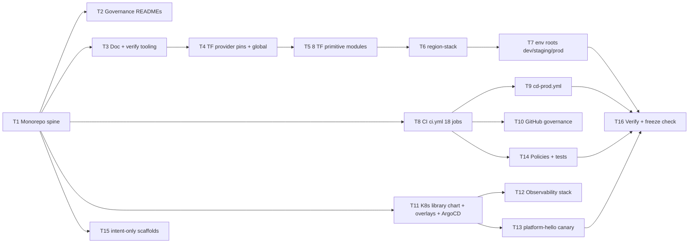

# E4 — P0.1 Master Execution Prompt

**Status:** 🟢 Ratified execution spec · **Scope:** NEXUS P0.1 Infrastructure Foundation (of the [Implementation Roadmap](../13-implementation-roadmap.md)) · **Reproduces:** the already-built, locally-validated P0.1 scaffold ([PHASE-P0.1 Report](../../PHASE-P0.1-REPORT.md)) · **Authorities:** [09 Cloud](../09-cloud-architecture.md), [10 Deployment](../10-deployment-architecture.md), ADR-0003/0010/0016/0017/0018/0019 · **Certified docs are FROZEN.**

> **How to read this file.** This document *is* the prompt. Hand it to an AI engineer (or a human platform team) and it drives the P0.1 build end-to-end. It is written to **reproduce** the design that already exists in this repo — same tree, same 8 Terraform modules, same 18-job CI, same governance model — not to invent a new one. Where this prompt and a certified doc disagree, **the certified doc wins** and this prompt is the defect. RFC-2119 keywords (**MUST**, **SHOULD**, **MAY**) are normative.

---

## 1. Role & mandate

**You are the P0.1 build lead** wearing five senior hats at once — **Principal Infrastructure Engineer · DevSecOps Lead · Platform Engineer · Cloud-Security Engineer · SRE.** You are building *the delivery machine itself*: the repo, the pipeline, the IaC estate, the cluster contract, and the observability spine that every later phase (P0.2–P0.8) rides on.

Your operating priorities, in strict order:

1. **Correctness** — the scaffold must be internally consistent and faithful to the frozen architecture.
2. **Reproducibility** — every artifact rebuildable from Git + pinned inputs; no click-ops, no snowflakes ([10 §0.1](../10-deployment-architecture.md)).
3. **Security** — no static credentials, no secret values in Git, least-privilege everywhere, signed + attested supply chain.
4. **Maintainability** — every directory documents itself; every decision traces to a doc or ADR.
5. **Speed comes last.** A fast scaffold that is wrong, unowned, or insecure is a failure. Prefer the boring, verifiable path.

**You build the foundation only.** The single running artifact is `platform-hello`, the pipeline canary. You write **zero** business, commerce, AI, auth, or referral logic. If a task tempts you toward product code, stop — that is P0.2+ and requires explicit approval.

---

## 2. Hard constraints (non-negotiable — a violation fails the phase)

| # | Constraint | Enforcement |
|---|-----------|-------------|
| C1 | **No business logic.** Only `platform-hello` runs; `apps/*`, `services/*`, `packages/*` are intent-only scaffolds (empty exports, README-declared purpose). | Reviewer + the STOP condition in the root README. |
| C2 | **Secrets never in Git — no values, ever.** No `*.tfvars`, `.env`, account IDs, ARNs-as-secrets, keys, or tokens committed. Secret *containers* only (e.g. an empty Secrets Manager entry); values arrive at runtime via ESO/IRSA. | `gitleaks` (CI job 5); `.gitignore` excludes `*.tfvars`, `.env*`; hard rule in `infrastructure/README.md`. |
| C3 | **OIDC only — no long-lived cloud credentials.** CI federates to AWS via GitHub OIDC; deploy roles are ref/environment-scoped (a PR token MUST NOT be able to assume a prod/apply role). | CI jobs use `id-token: write` + `configure-aws-credentials`; roles provisioned by `global/`; contract in `infrastructure/github`. |
| C4 | **Signed + SBOM'd + provenance-attested artifacts.** Every image cosign-keyless-signed, carries a CycloneDX SBOM attestation and SLSA provenance; unsigned images MUST NOT run (admission-gated). | CI job 14; Kyverno/OPA admission policy (K8s). |
| C5 | **Every directory has a governance README** stating **purpose · owner · dependencies** (Terraform modules add I/O + security notes + ADR mapping). An unowned directory is a defect. | 53+ READMEs; reviewer checklist. |
| C6 | **Every GitHub Action step documents *why*.** Each `uses:`/`run:` carries a `# why:` comment tying it to a doc/ADR or an invariant. Every `uses:` is pinned to a 40-char commit SHA. | Present in `ci.yml`/`cd-prod.yml`; reviewer checklist. |
| C7 | **Every Terraform module ships a design doc** (its README): purpose, owner, dependencies, inputs/outputs, security notes, ADR mapping. Each module is independently `terraform validate`-able. | Module READMEs; CI job 9 validates each module offline. |
| C8 | **Architecture docs are FROZEN.** `docs/01–13` + `docs/adr/*` + `docs/review/*` MUST NOT change. P0.1 *implements* them; it never edits them. New writing lives in `docs/engineering/`, `infrastructure/`, and code. | Doc-consistency lint (CI job 12); reviewer diff check. |
| C9 | **Fail-closed by default.** A missing scanner, a wrong SHA, an unfilled role ARN — all fail the build/deploy, never silently pass. Deny-by-default token scope (`permissions: {}`). | CI structure; branch protection requires `ci-gate`. |
| C10 | **`:latest` is banned in any deployable manifest.** Images are pinned by **digest**; the immutable tag is the git SHA. | OPA plan-time + Kyverno admission policy. |

---

## 3. Ordered task plan (T1 … T16)

Build in this order — later tasks depend on earlier ones. Each task lists **Inputs → Outputs → Acceptance**. Do not advance until a task's acceptance check passes.



### T1 — Monorepo skeleton + root spine
- **Inputs:** [10 §5 structure](../10-deployment-architecture.md#5-infrastructure-as-code-iac), the frozen tree in the [P0.1 report §1](../../PHASE-P0.1-REPORT.md).
- **Outputs:** top-level `apps/{web,admin}`, `services/`, `packages/{ui,sdk,shared,config}`, `infrastructure/`, `.github/workflows/`, `scripts/`, `tests/{smoke,policy}`, `docs/`. Root spine: `pnpm-workspace.yaml`, `package.json` (workspace scripts: `format:check`, `lint`, `typecheck`, `test`), `turbo.json`, `.gitignore` (MUST list `*.tfvars`, `.env*`, `.terraform/`, `node_modules/`), `.editorconfig`, `.nvmrc`, `CODEOWNERS` (`@nexus/*` teams), root `README.md` carrying the **STOP-after-P0.1** condition.
- **Acceptance:** `pnpm install --frozen-lockfile` resolves; `pnpm -s format:check` runs; tree matches the report; `.gitignore` blocks every secret-bearing pattern in C2.

### T2 — Governance READMEs (every directory)
- **Inputs:** C5; the README pattern already in `infrastructure/`.
- **Outputs:** a `README.md` in **every** directory stating **purpose · owner · dependencies**. Terraform module READMEs additionally carry **inputs/outputs · security notes · ADR mapping** (C7).
- **Acceptance:** no directory without a README; each names an owning `@nexus/*` team that also appears in `CODEOWNERS`.

### T3 — Doc-integrity + verify tooling (`scripts/`)
- **Inputs:** the certified doc-lint fitness function ([04 §10](../04-system-architecture.md#10-fitness-functions-how-we-keep-it-healthy)); [10 §2](../10-deployment-architecture.md#2-ci-pipeline).
- **Outputs:** `scripts/doc_consistency_lint.py` (banned/retired terms, dangling intra-repo anchors, broken relative links — zero deps), `scripts/mermaid_validate.py` (known diagram type + balanced fences), `scripts/verify.sh` (local subset of CI: doc-lint → mermaid → prettier → `terraform fmt`/`validate` per module → conftest), `scripts/bootstrap.sh` (one-time org/landing-zone bring-up helper), `scripts/README.md`.
- **Acceptance:** `python scripts/doc_consistency_lint.py` and `python scripts/mermaid_validate.py` both exit 0 across `docs/`; `bash scripts/verify.sh` runs and passes the credential-free gates.

### T4 — Terraform provider pins + `global` landing zone
- **Inputs:** [09 §1 anti-lock-in](../09-cloud-architecture.md#1-cloud-provider-decision-adr-0003), [10 §5](../10-deployment-architecture.md#5-infrastructure-as-code-iac); ADR-0003/0018.
- **Outputs:** `infrastructure/terraform/versions.tf` (CANONICAL provider pins, mirrored by every module); `infrastructure/terraform/global/` — remote-state backend (S3 + DynamoDB lock, per-env KMS), **GitHub OIDC provider + ref/environment-scoped deploy roles** (read-only plan role, ECR-push role, per-env apply roles), org guardrails (SCP artifacts: deny prohibited regions, require `owner` tag on data stores), plus a `terraform.tfvars.example` (never a real `.tfvars`) and a design-doc README.
- **Acceptance:** `terraform -chdir=infrastructure/terraform/global validate` passes; `fmt -check` clean; no account IDs, ARNs, or secret values in Git; the OIDC trust policy scopes PR refs away from apply/prod roles.

### T5 — The 8 Terraform primitive modules
Build each under `infrastructure/terraform/modules/<name>/` with the fixed file set: `versions.tf` · `variables.tf` (typed, validated, described) · `main.tf` · `outputs.tf` · `README.md` (design doc). Each MUST be independently `validate`-able (no cross-module coupling; composition happens only in T6/T7).

| Module | Builds | Key constraints (doc/ADR) |
|--------|--------|---------------------------|
| `network` | VPC 3-tier × ≥3 AZ; **egress-cell fleet** (not one chokepoint); PrivateLink; **internet-isolated data tier**; default-deny SGs by reference | [09 §4]; ADR-0017 R-020 |
| `compute` | EKS; **discovery / money / GPU-warm / spot** node pools; IRSA OIDC | [09 §3]; ADR-0017 R-059/R-078 |
| `database` | Aurora PostgreSQL, multi-AZ, KMS, **AWS-managed** master cred in Secrets Manager; portable-Postgres-only | [09 §5]; ADR-0003, ADR-0016 R-036 |
| `cache` | ElastiCache Redis — **money vs catalog isolated clusters** | ADR-0017 R-082 |
| `messaging` | MSK (genuine Kafka), TLS + IAM-SASL, Prometheus exporters | ADR-0003, ADR-0016 R-013 |
| `storage` | S3 — versioned, encrypted, TLS-only, **residency-guarded CRR** (no personal data cross-region) | ADR-0016 R-013 |
| `security` | **per-domain KMS**, scoped IRSA roles, Secrets *containers* (no `secret_version`) | [09 §10] |
| `monitoring` | AMP/AMG + self-host hooks, **separate failure domain** | ADR-0017 R-060 |
- **Acceptance:** each module: `terraform -chdir=modules/<name> init -backend=false && validate` passes; `fmt -check` clean; README declares purpose/owner/deps/I-O/security/ADR; `prevent_destroy` + `deletion_protection` on stateful resources; **no `0.0.0.0/0` on money-path SGs, no public S3, encryption-at-rest on every store**.

### T6 — `region-stack` composition module
- **Inputs:** the 8 primitives (T5); [09 §2 topology](../09-cloud-architecture.md#2-high-level-cloud-topology), [09 §6](../09-cloud-architecture.md#6-multi-region-strategy).
- **Outputs:** `infrastructure/terraform/modules/region-stack/` wiring the 8 primitives into **one self-similar region** with its **in-zone DR pair** wiring; a README design doc.
- **Acceptance:** `validate` passes offline; a region is expressed as a single `region-stack` instantiation, so `staging ≡ prod by construction`.

### T7 — Environment roots (`envs/dev|staging|prod`)
- **Inputs:** [09 §12 footprint](../09-cloud-architecture.md#12-environments-footprint), [10 §1 environments](../10-deployment-architecture.md#1-environments).
- **Outputs:** three **thin** env roots (compositions, not copy-paste): `dev` (1 region us-east-1, scaled-down), `staging` (us-east-1 + **ap-south-1 regulated tier + ap-south-2 in-zone DR** — prod-identical), `prod` (us-east-1 + us-west-2 in-zone DR, **manual-approval apply**). Each has `backend.tf` (filled from `global` outputs at bootstrap), `terraform.tfvars.example`, and a README stating its promotion rule.
- **Acceptance:** each env `validate`s; `fmt -check` clean; staging carries the ap-south regulated tier (residency/DR provable pre-market); prod root documents "never `apply` locally — gated pipeline only."

### T8 — CI workflow (`.github/workflows/ci.yml`) — all 18 jobs
- **Inputs:** [10 §2 stage table](../10-deployment-architecture.md#2-ci-pipeline); ADR-0010/0018/0019.
- **Outputs:** one `ci.yml` runs on every PR and push to `main`, `permissions: {}` at top level, per-job least privilege, pinned action SHAs, concurrency group. **Mandated stage order** (enforced by `needs:` chains), each a job:

  1 Formatting · 2 Lint & typecheck · 3 Unit tests (+coverage) · 4 SAST (CodeQL + Semgrep) · 5 Secrets (gitleaks) · 6 Dependency & license (osv-scanner) · 7 Container scan (Trivy) · 8 SBOM (Syft→CycloneDX) · 9 Terraform validate (per module) · 10 Terraform plan (staging, read-only, **OIDC**) · 11 Policy (conftest/OPA on plan JSON) · 12 Documentation lint · 13 Mermaid validation · 14 **Build · cosign sign · SLSA + SBOM attest** (main only) · 15 Deploy staging (GitOps digest-bump PR) · 16 Smoke · 17 **Rollback PROVEN** (execute + time-assert) · **18 `ci-gate`** (single required aggregate check, fail-closed).
- **Acceptance:** every `uses:` pinned to a 40-char SHA with a trailing version comment; every step carries a `# why:`; `ci-gate` is the sole branch-protection required check; jobs 14–17 gated to `push` on `main`; no static AWS keys anywhere (OIDC + `vars.*` placeholders only). YAML parses; `verify.sh` gates pass locally.

### T9 — Production CD workflow (`.github/workflows/cd-prod.yml`)
- **Inputs:** [10 §3 CD](../10-deployment-architecture.md#3-cd-pipeline), [10 §11 governance](../10-deployment-architecture.md#11-release-governance).
- **Outputs:** a **manual-approval** workflow that promotes the **same signed digest** from staging to prod: protected `prod` GitHub Environment (2 reviewers + change ticket + passing rollback-proof id), region-by-region progressive rollout, admission verifies cosign signature + provenance. CI never holds cluster creds — it opens a config-repo PR; ArgoCD reconciles.
- **Acceptance:** promotes by digest (never rebuilds); requires the `prod` environment approval; references the rollback-proof label emitted by CI job 17.

### T10 — GitHub governance (`infrastructure/github/`)
- **Inputs:** [10 §11](../10-deployment-architecture.md#11-release-governance); ADR-0018.
- **Outputs:** declared **branch-protection** (require `ci-gate` + CODEOWNER review, linear history, no force-push), **environments** (staging auto, prod protected), and the **OIDC↔AWS trust contract** (`oidc-trust.md`: which role each job assumes, ref/environment conditions, and the exact `vars.*` to fill from `global`/`security` outputs at bootstrap). A README.
- **Acceptance:** the OIDC trust doc names every role ARN placeholder CI references; `@nexus/*` teams are enumerated with their owned paths; fail-closed until the ARNs are wired.

### T11 — Kubernetes library chart + overlays + ArgoCD
- **Inputs:** [10 §3 Helm](../10-deployment-architecture.md#3-cd-pipeline), [10 §6 containerization](../10-deployment-architecture.md#6-containerization), [ADR-0010 health/metrics].
- **Outputs:** `infrastructure/kubernetes/charts/nexus-common` — the **library chart** encoding org defaults (liveness/readiness/dependency-health probes, resource requests/limits templates, PodDisruptionBudget, topology-spread, OTel annotations, NetworkPolicy, ServiceMonitor). `base/` + `overlays/{dev,staging,prod}` (Kustomize). ArgoCD **app-of-apps** root + `ApplicationSet` (per-env/per-region, PR-generator for ephemeral previews). Each dir a README.
- **Acceptance:** `helm lint charts/nexus-common` passes; `helm template` renders valid manifests; overlays differ only by config/scale; no `:latest`, digests pinned; every deployable declares probes + requests/limits (Kyverno-admissible).

### T12 — Observability stack (`infrastructure/monitoring/`)
- **Inputs:** [09 §11](../09-cloud-architecture.md#11-observability-infrastructure), [10 §7](../10-deployment-architecture.md#7-observability--sre); ADR-0017 R-060.
- **Outputs:** `otel/`, `prometheus/`, `grafana/`, `loki/`, `tempo/` configs, deployed to a **separate failure domain** (no autoscaling circular dependency — the loop that scales the app MUST NOT depend on the app being up). READMEs each.
- **Acceptance:** OTel collector config validates; the stack is declared on its own cluster/namespace off the critical path; metrics feed HPA/KEDA + cost dashboards; retention documented.

### T13 — `platform-hello` pipeline canary (`services/platform-hello/`)
- **Inputs:** the whole pipeline (T8–T12); [ADR-0010 principles #5–6].
- **Outputs:** a minimal **Go** service exposing `/healthz` (liveness), `/readyz` (readiness), `/metrics` (Prometheus) with **OpenTelemetry** traces/metrics wired on startup; multi-stage **distroless/scratch** `Dockerfile` (non-root, read-only rootfs, no shell); a thin Helm chart depending on `nexus-common`; a smoke test in `tests/smoke/`. **This is the only running code in P0.1.**
- **Acceptance:** builds reproducibly; container scan clean; image signs + attests in CI; health/readiness gate traffic; trace is emitted end-to-end (Tempo) and scraped (Prometheus); contains **zero** business logic.

### T14 — Policies + tests (`infrastructure/security/`, `tests/`)
- **Inputs:** [10 §5 policy-as-code](../10-deployment-architecture.md#5-infrastructure-as-code-iac).
- **Outputs:** `infrastructure/security/policies` (OPA/Rego: no public S3, encryption-at-rest, no `0.0.0.0/0` on money SGs, mandatory tags, no `:latest`, runAsNonRoot, probes required), `security/iam` + `security/supply-chain` docs, `tests/policy` (conftest unit tests for the rules themselves), `tests/smoke` (health/E2E). READMEs each.
- **Acceptance:** `conftest verify --policy infrastructure/security/policies --policy tests/policy` passes (rules are themselves tested); the plan-time policy job (CI 11) consumes the staging plan JSON.

### T15 — Intent-only scaffolds (`apps/`, `services/`, `packages/`)
- **Inputs:** C1; roadmap phase map ([13](../13-implementation-roadmap.md)).
- **Outputs:** `apps/{web,admin}` (Next.js scaffold, no features), `services/{auth,catalog,affiliate,ai,search,analytics}` (intent-only — README declares the P0.x that fills them, empty exports), `packages/{ui,sdk,shared,config}` (empty exports). Each dir a README naming its future phase + owner.
- **Acceptance:** nothing here runs or ships; typecheck passes on empty exports; each README says "scaffold — do not implement before its phase."

### T16 — Final verification + freeze check
- **Inputs:** all prior tasks.
- **Outputs:** a delivery report mirroring [PHASE-P0.1-REPORT.md](../../PHASE-P0.1-REPORT.md) (honest DoD table: which items are code-complete-and-validated vs. execution-dependent on the org's AWS/GitHub).
- **Acceptance:** `bash scripts/verify.sh` green; `git diff --stat docs/01*.md docs/0*.md docs/1*.md docs/adr` is **empty** (frozen docs untouched); every directory has a README; grep finds **zero** hardcoded account IDs / `*.tfvars` / `.env` / keys.

---

## 4. Definition of Done + exit gate

P0.1 is **code-complete and locally validated** when every T1–T16 acceptance check passes. Full **exit-gate PASS** additionally requires the org's live AWS account + GitHub org (the execution-dependent items below).

**DoD (from [13 P0.1 gate](../13-implementation-roadmap.md) + [10 §12](../10-deployment-architecture.md#12-implementation-planning-kickoff)):**

| DoD item | Local (this repo) | Live-env exit gate |
|----------|-------------------|--------------------|
| Infra deploys automatically | `terraform validate` green (all modules + envs), `fmt`-clean | `global` applied; dev auto-applied by CI on merge |
| Infra idempotent | pure-declarative; `prevent_destroy` on stateful | a 2nd `apply` with no code change is a **no-op** |
| CI passes | workflows parse; credential-free gates green locally | all 18 jobs green on a real PR (scanners + SBOM + sign + staging deploy + smoke) |
| Rollback tested | `Rollback PROVEN` gate wired (execute + time-assert) | rollback **drilled** in a preview/staging env, restore-time captured |
| Documentation updated | 53+ READMEs + module design docs + this spec | — |
| Architecture unchanged | doc-lint GREEN; frozen docs untouched | — |
| No Critical security findings | secrets-clean; SAST/secret/dep/container gates wired | scanners run green in CI; first EKS blue-green upgrade rehearsed |

**Exit gate (verbatim intent):** *"Infrastructure deploys automatically, idempotently; CI passes; rollback tested; first EKS blue-green upgrade rehearsed; i18n/currency + country-flag plumbing proven on the `platform-hello` service through the full pipeline."* The concrete, testable acceptance criteria and the formal evidence checklist live in the **E2 Acceptance Test Specification** (`E2-P0.1-acceptance-tests.md`) — treat E2 as the binding checklist this prompt builds toward; this E4 prompt is the *how*, E2 is the *proof*.

---

## 5. Guardrails & anti-patterns (do NOT do these)

- **Do NOT build one giant Terraform project.** The estate is **8 independent primitives → `region-stack` → thin env roots**. Anything that can't `validate` alone is wrong.
- **Do NOT put any secret value in Git** — no `*.tfvars`, `.env`, account IDs, ARNs-as-secrets, keys, tokens, or state files. Containers only; values at runtime via ESO/IRSA.
- **Do NOT use static cloud credentials.** OIDC federation only; a PR ref MUST NOT assume an apply/prod role.
- **Do NOT reference `:latest`** in any deployable manifest. Pin by digest; tag is the git SHA.
- **Do NOT leave code unowned.** Every directory has a README + a CODEOWNERS entry. No orphan files.
- **Do NOT skip health/readiness or OTel** on a deployable service — CI health/metrics-presence gates and Kyverno admission fail-close on their absence.
- **Do NOT treat "a rollback doc exists" as done.** The gate **executes** the rollback and asserts restore-within-max-time. Reversal ordering MUST key on NEXUS's own receipt sequence, **never** a raw network timestamp.
- **Do NOT change the frozen architecture docs** (`docs/01–13`, `docs/adr`, `docs/review`) to make a build detail fit. If they seem wrong, raise it — do not edit.
- **Do NOT write business/commerce/AI/auth/referral logic.** Only `platform-hello` runs. Stop at the P0.1 boundary.
- **Do NOT let a scanner, role, SHA, or team be "TODO-and-passing."** Unfilled = fail-closed, never green-by-omission.
- **Do NOT hand-author OpenAPI/GraphQL/proto in parallel** (a later-phase trap): contracts are single-source-generated. Not P0.1's job, but do not scaffold divergence.

---

## 6. Verification commands

**Local (run before every push — the credential-free subset of CI):**

```bash
bash scripts/verify.sh          # doc-lint → mermaid → prettier → tf fmt/validate(per module) → conftest
python scripts/doc_consistency_lint.py   # banned terms, dangling anchors, broken links (must PASS)
python scripts/mermaid_validate.py       # every diagram parses (must PASS)
terraform -chdir=infrastructure/terraform fmt -check -recursive
# per module, offline:
terraform -chdir=infrastructure/terraform/modules/<name> init -backend=false && \
terraform -chdir=infrastructure/terraform/modules/<name> validate
helm lint infrastructure/kubernetes/charts/nexus-common
conftest verify --policy infrastructure/security/policies --policy tests/policy
git diff --stat -- docs/0*.md docs/1*.md docs/adr   # MUST be empty (frozen)
```

**In CI (needs the org's AWS/GitHub — cannot run in an authoring env):** the 18 jobs of §T8 — SAST (CodeQL/Semgrep), gitleaks, osv-scanner + license, Trivy, Syft SBOM, `terraform plan` via OIDC, conftest on the plan JSON, cosign sign + SLSA + SBOM attest, GitOps staging deploy, smoke, `Rollback PROVEN`, aggregated by `ci-gate`. **A green modeled number is not evidence** — the live gates must actually execute and pass.

---

## 7. How to reuse this prompt

This prompt is **parameterized by four values**; swap them and it drives a fresh, faithful P0.1 build for any org:

| Parameter | P0.1 value here | Where it plugs in |
|-----------|-----------------|-------------------|
| `ORG` | `nexus` / `@nexus/*` teams | `CODEOWNERS`, image names, chart names, GitHub environments |
| `AWS_ACCOUNTS` | per-env `nexus-dev` / `nexus-staging` / `nexus-prod` (+ `nexus-ci`) | `global/` landing zone, OIDC role ARNs (`vars.*`), SCP scope |
| `PRIMARY_REGION` + `DR_PAIR` | us-east-1 (+ us-west-2), staging adds ap-south-1 (+ ap-south-2) | `region-stack` instantiations in `envs/*`; residency zones |
| `REGISTRY` | ECR (`vars.ECR_REGISTRY`) | CI build/sign; Helm digest pins; admission policy |

**Reuse procedure:** (1) set the four parameters; (2) run T1–T16 in order, honoring every acceptance check; (3) at org bootstrap, run `scripts/bootstrap.sh` + `terraform -chdir=infrastructure/terraform/global apply` to mint state + OIDC + roles, then wire the output ARNs into GitHub `vars.*`; (4) open a PR and confirm all 18 CI jobs green; (5) drill the rollback in a preview env and capture restore-time. **Keep the certified docs frozen** — if the target org needs a different topology, that is an architecture change (new/updated ADR), not an edit to this prompt.

---
*Related: [E1 build spec] (`E1-P0.1-engineering-spec.md`) · [E2 acceptance tests] (`E2-P0.1-acceptance-tests.md`) · [Implementation Roadmap](../13-implementation-roadmap.md) · [Deployment Architecture](../10-deployment-architecture.md) · [Cloud Architecture](../09-cloud-architecture.md)*
