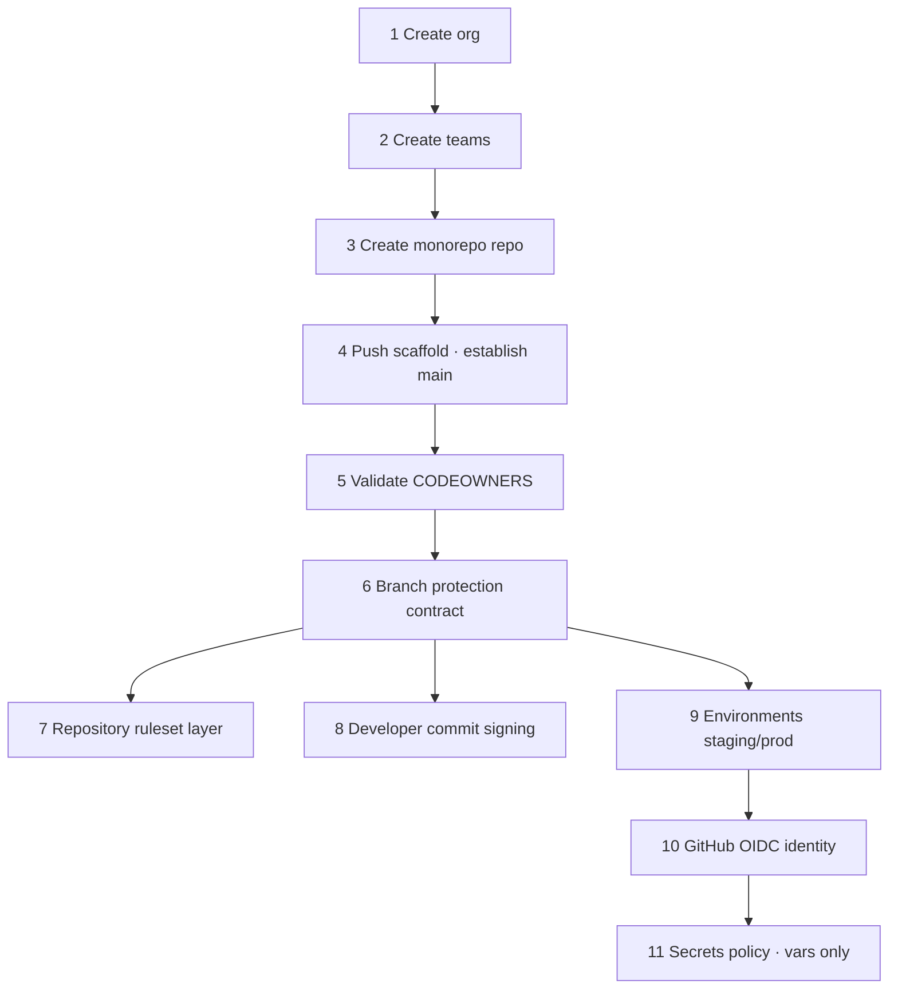

# Chapter 1 — GitHub Organization

**Status:** 🟢 Runbook · **Scope:** stand up the GitHub organization that is the **source of truth and CI identity** for NEXUS, starting from a **completely empty GitHub organization** (no org, no teams, no repo). This chapter ends when `main` on the monorepo is protected, signed-commit-enforced, CODEOWNERS-gated, environment-gated, and OIDC-ready — with **zero cloud credentials stored anywhere**. The AWS trust side of OIDC is created in **Chapter 3 (Terraform Bootstrap)**; this chapter only establishes GitHub as the OIDC *identity provider* and pins the `sub`/`aud` claims that Chapter 3's AWS roles will trust.

> This chapter *operates* the governance declared as config-as-doc in [`infrastructure/github/branch-protection.yml`](../../../infrastructure/github/branch-protection.yml), [`infrastructure/github/environments.yml`](../../../infrastructure/github/environments.yml), and [`infrastructure/github/oidc-trust.md`](../../../infrastructure/github/oidc-trust.md), and it enforces the ownership map in [`.github/CODEOWNERS`](../../../.github/CODEOWNERS). It realizes [E1 Engineering Spec §3–§6](../E1-P0.1-engineering-spec.md). Every step follows the fixed 8-field format from [`00-README.md`](00-README.md).

## Step format (every step has all 8)
**Objective · Prerequisites · Commands · Expected output · Verification · Rollback · Common failure · Troubleshooting.**

## RFC-2119
The key words **MUST**, **MUST NOT**, **SHOULD**, **SHOULD NOT**, and **MAY** in this chapter are to be interpreted as described in RFC 2119.

## Placeholders (set once in `env.sh`, never committed)
| Placeholder | Meaning | Constraint |
|-------------|---------|------------|
| `<ORG>` | GitHub org login | **MUST** equal the `@<org>` used in CODEOWNERS (i.e. `nexus-commerce-os`) or CODEOWNERS **MUST** be updated to match. |
| `<REPO>` | Monorepo repository name | e.g. `nexus-monorepo`. Feeds the OIDC `sub` (`repo:<ORG>/<REPO>:…`). |
| `<ORG_ADMIN>` | GitHub account with org-owner rights | Used for bootstrap only. |
| `<ADMIN_TOKEN>` | Fine-grained PAT / `gh auth` token with `admin:org`, `repo` | Bootstrap only; **MUST NOT** be a workflow token. |
| `<TEAM_ID>` | Numeric team id returned at team creation | Needed for Environment reviewers. |

## Ordered step map



> **Handoff:** Steps 10–11 leave GitHub emitting short-lived OIDC tokens with pinned claims and **no stored secrets**. Chapter 3 creates the matching AWS IAM OIDC provider + least-privilege roles that trust those claims.

---

## Step 1 — Create the GitHub organization

**Objective.** Create the empty organization `<ORG>` that will own the monorepo, teams, environments, and OIDC identity.

**Prerequisites.**
- A GitHub account `<ORG_ADMIN>` that is allowed to create organizations (or an Enterprise with org-creation rights).
- `gh` CLI installed and authenticated: `gh auth status` MUST show the account with `admin:org` scope.
- Decide `<ORG>` now; it is load-bearing (CODEOWNERS `@<org>/…`, OIDC `sub`). It **MUST** be `nexus-commerce-os` unless CODEOWNERS is updated.

**Commands.**
```bash
# Organization creation is NOT exposed on the github.com REST API for normal accounts.
# Primary path — UI: https://github.com/account/organizations/new
#   → choose plan → Organization name: <ORG> → contact email → Create organization.
#
# Enterprise-managed path only (GHEC/GHES admin): the Enterprise admin API supports:
gh api --method POST /admin/organizations \
  -f login='<ORG>' -f admin='<ORG_ADMIN>' -f profile_name='NEXUS'   # enterprise only

# After the org exists (either path), verify from the CLI:
gh api /orgs/<ORG> --jq '{login, id, type}'
```

**Expected output.** `gh api /orgs/<ORG>` returns a JSON object with `"login": "<ORG>"`, a numeric `id`, and `"type": "Organization"` (HTTP 200).

**Verification.**
```bash
gh api /orgs/<ORG> --jq '.login'   # → <ORG>
gh api /orgs/<ORG>/repos --jq 'length'   # → 0 (empty org, as required)
```
Both MUST succeed; the repo count MUST be `0` at this point.

**Rollback.** Delete the org via **Settings → Danger zone → Delete this organization** (UI only; irreversible — retype the org name to confirm). There is no API delete for github.com orgs. Because the org is empty, deletion has no downstream impact.

**Common failure.** `HTTP 404` from `gh api /orgs/<ORG>` immediately after UI creation — replication lag, or `gh` is authenticated as a different identity than the one that created the org.

**Troubleshooting.** Run `gh auth status` and confirm the active account. Re-run after ~30 s for propagation. If your account cannot create orgs (enterprise policy), have the Enterprise owner create it and add `<ORG_ADMIN>` as an org owner, then continue.

---

## Step 2 — Create the `@nexus-commerce-os/*` teams

**Objective.** Create the ten owning teams referenced by [`.github/CODEOWNERS`](../../../.github/CODEOWNERS), so CODEOWNERS review and Environment reviewers can resolve to real teams.

**Prerequisites.** Step 1 complete. `<ADMIN_TOKEN>` with `admin:org`. The canonical team list is derived from CODEOWNERS — do **not** invent teams.

**Commands.**
```bash
# Team slug = lowercased name; CODEOWNERS uses @<ORG>/<slug>.
for t in platform infrastructure cloud-security sre devsecops \
         frontend commerce ai data architecture; do
  gh api --method POST /orgs/<ORG>/teams \
    -f name="$t" \
    -f privacy='closed' \
    -f notification_setting='notifications_enabled' \
    --jq '{slug, id}'
done

# Restrict repository creation to org owners only (no snowflake repos):
gh api --method PATCH /orgs/<ORG> \
  -F members_can_create_repositories=false \
  -F members_can_create_public_repositories=false \
  -F default_repository_permission='none'

# Record each team id (needed in Step 9). Example lookup:
gh api /orgs/<ORG>/teams/sre --jq '.id'          # → <TEAM_ID> for @nexus-commerce-os/sre
gh api /orgs/<ORG>/teams/devsecops --jq '.id'    # → <TEAM_ID> for @nexus-commerce-os/devsecops
```

**Expected output.** Ten JSON objects, each `{ "slug": "<team>", "id": <number> }`. `gh api /orgs/<ORG>/teams --jq 'length'` returns `10`.

**Verification.**
```bash
gh api /orgs/<ORG>/teams --jq 'sort_by(.slug) | map(.slug)'
# MUST equal (order-independent):
# ["ai","architecture","cloud-security","commerce","data","devsecops","frontend","infrastructure","platform","sre"]
```
Cross-check every slug against the `@nexus-commerce-os/*` handles in CODEOWNERS; there MUST be no CODEOWNERS handle without a matching team.

**Rollback.** `gh api --method DELETE /orgs/<ORG>/teams/<slug>` per team. Safe while no repo references them yet.

**Common failure.** `HTTP 422 name already exists`, or a CODEOWNERS handle like `@nexus-commerce-os/platform` fails to resolve later because the org login is not `nexus-commerce-os`.

**Troubleshooting.** For 422, the team already exists — treat as idempotent and continue (`gh api /orgs/<ORG>/teams/<slug>`). If handles won't resolve, confirm `<ORG> == nexus-commerce-os`; if the org login intentionally differs, update the `@nexus-commerce-os/*` prefixes in [`.github/CODEOWNERS`](../../../.github/CODEOWNERS) in the same PR that lands the scaffold (Step 4) so ownership stays consistent.

---

## Step 3 — Create the monorepo repository (empty, private)

**Objective.** Create the single monorepo `<ORG>/<REPO>` that holds all code, `.github/` governance, and `infrastructure/` — the source of truth CI runs against.

**Prerequisites.** Steps 1–2 complete. `<ADMIN_TOKEN>` with `repo` + `admin:org`.

**Commands.**
```bash
gh repo create <ORG>/<REPO> \
  --private \
  --description 'NEXUS platform monorepo — code, governance, infrastructure' \
  --disable-wiki

# Grant each team its standing access (least privilege; CODEOWNERS handles review routing):
gh api --method PUT /orgs/<ORG>/teams/platform/repos/<ORG>/<REPO>   -f permission='maintain'
for t in infrastructure cloud-security sre devsecops frontend commerce ai data architecture; do
  gh api --method PUT /orgs/<ORG>/teams/$t/repos/<ORG>/<REPO> -f permission='push'
done

# Harden repo defaults: squash-only merges (linear history), auto-delete merged branches:
gh api --method PATCH /repos/<ORG>/<REPO> \
  -F allow_merge_commit=false -F allow_rebase_merge=true \
  -F allow_squash_merge=true -F delete_branch_on_merge=true \
  -F allow_auto_merge=true -F has_issues=true -F has_projects=false
```

**Expected output.** `gh repo view <ORG>/<REPO>` shows a private repo; the PATCH returns `allow_merge_commit=false`, `allow_squash_merge=true`.

**Verification.**
```bash
gh api /repos/<ORG>/<REPO> --jq '{private, allow_merge_commit, delete_branch_on_merge}'
# → {"private": true, "allow_merge_commit": false, "delete_branch_on_merge": true}
```
`allow_merge_commit` MUST be `false` (merge commits break the required linear history of Step 6).

**Rollback.** `gh repo delete <ORG>/<REPO> --yes` (irreversible; only safe now because it is empty).

**Common failure.** `HTTP 403` on the team-permission PUT — the token lacks `admin:org`, or the team does not exist (Step 2 skipped).

**Troubleshooting.** Re-check `gh auth status` scopes; refresh with `gh auth refresh -h github.com -s admin:org,repo`. Confirm each `teams/<slug>` resolves before granting access.

---

## Step 4 — Push the certified scaffold and establish `main`

**Objective.** Publish the working-tree scaffold — including [`.github/CODEOWNERS`](../../../.github/CODEOWNERS), [`.github/workflows/ci.yml`](../../../.github/workflows/ci.yml), `infrastructure/`, and `docs/` — as the first **signed** commit on `main`, so protection (Step 6) has a branch to protect and CI has a workflow to run.

**Prerequisites.** Step 3 complete. Local commit signing already configured (see Step 8 — if not yet done, do Step 8 first, since `main` will require signed commits). `git` ≥ 2.34.

**Commands.**
```bash
cd <path-to-local-monorepo>
git init -b main
git remote add origin git@github.com:<ORG>/<REPO>.git

# Ensure the scaffold's governance files are present before the first push:
test -f .github/CODEOWNERS && test -f .github/workflows/ci.yml || { echo 'scaffold missing'; exit 1; }

git add .
git commit -S -m 'chore(bootstrap): certified P0.1 scaffold (governance, CI, infra, docs)'
git push -u origin main
```

**Expected output.** `git push` reports `main -> main`. On GitHub, the commit shows a **Verified** badge. The **Actions** tab shows the `ci` workflow starting (it MAY fail on placeholder stages — that is expected pre-Chapter 3/7).

**Verification.**
```bash
gh api /repos/<ORG>/<REPO>/commits/main --jq '.commit.verification.verified'   # → true
gh api /repos/<ORG>/<REPO>/contents/.github/CODEOWNERS --jq '.path'            # → .github/CODEOWNERS
gh run list --repo <ORG>/<REPO> --limit 1                                       # ci run recorded
```
The first commit **MUST** verify as signed.

**Rollback.** This is the initial history; to undo, delete and recreate the repo (Step 3 rollback). Do **not** force-push a rewrite after Step 6 — protection forbids it.

**Common failure.** Push rejected `commit … is not signed`, or the badge shows **Unverified** because the signing key is not registered to the GitHub identity.

**Troubleshooting.** Complete Step 8 (register the GPG/SSH signing key to your GitHub account and set `commit.gpgsign true`). Re-sign the tip: `git commit --amend -S --no-edit` then push. Confirm the committer email matches a verified email on the account.

---

## Step 5 — Validate CODEOWNERS resolution (enforcement prerequisite)

**Objective.** Prove that every rule in [`.github/CODEOWNERS`](../../../.github/CODEOWNERS) resolves to a real team, so the `require_code_owner_reviews` rule enabled in Step 6 actually routes review to an owning team (an unresolved owner silently disables enforcement for that path).

**Prerequisites.** Steps 2 and 4 complete (teams exist, CODEOWNERS is pushed on `main`).

**Commands.**
```bash
# GitHub surfaces CODEOWNERS parse errors via the repo API and the UI:
gh api /repos/<ORG>/<REPO>/codeowners/errors --jq '.errors'

# UI cross-check: Repo → Settings → Code and automation → nothing;
#   open .github/CODEOWNERS in the web editor — unknown owners render with a ⚠ warning.
```

**Expected output.** `.errors` is an **empty array** `[]` — no unknown owners, no syntax errors, no unowned-path warnings.

**Verification.** Open a throwaway PR touching `/infrastructure/terraform/` and confirm GitHub auto-requests review from `@nexus-commerce-os/infrastructure` **and** `@nexus-commerce-os/cloud-security` (matching the CODEOWNERS rule). Close the PR after confirming.

**Rollback.** N/A (read-only validation). If CODEOWNERS is wrong, fix it via a normal PR (owned by `@nexus-commerce-os/architecture` for `/docs/` etc., `@nexus-commerce-os/devsecops` for `/.github/`).

**Common failure.** `errors` lists `Unknown owner` for a `@nexus-commerce-os/<team>` handle — the team was not created (Step 2) or the org login ≠ `nexus-commerce-os`.

**Troubleshooting.** Create the missing team, or reconcile the org login with the handle prefix. Re-run the errors check until `[]`. Do **not** proceed to Step 6 with a non-empty error list — CODEOWNERS review would be a paper control.

---

## Step 6 — Apply the `main` branch-protection contract

**Objective.** Enforce, on `main`, the normative controls declared in [`infrastructure/github/branch-protection.yml`](../../../infrastructure/github/branch-protection.yml): the single required status check **`ci-gate`** (strict), CODEOWNERS review + minimum approvals, dismiss-stale + last-push-approval, **signed commits**, linear history, no force-push, no deletion, conversation resolution, and **admins-not-exempt**. Applied out-of-band by this org-admin bootstrap — **never** by a workflow token, so the pipeline can never weaken its own gates.

**Prerequisites.** Steps 4–5 complete. `<ADMIN_TOKEN>` with `repo` admin. The `ci-gate` context name **MUST** match the aggregate job in [`.github/workflows/ci.yml`](../../../.github/workflows/ci.yml).

**Commands.**
```bash
# 6a — Protection payload (mirrors branch-protection.yml). NOTE: required_signed_commits
#      is NOT part of this payload; it is a separate sub-resource applied in 6b.
cat > /tmp/protection.json <<'JSON'
{
  "required_status_checks": { "strict": true, "contexts": ["ci-gate"] },
  "enforce_admins": true,
  "required_pull_request_reviews": {
    "require_code_owner_reviews": true,
    "required_approving_review_count": 1,
    "dismiss_stale_reviews": true,
    "require_last_push_approval": true
  },
  "required_linear_history": true,
  "required_conversation_resolution": true,
  "allow_force_pushes": false,
  "allow_deletions": false,
  "block_creations": false,
  "restrictions": null
}
JSON

gh api --method PUT /repos/<ORG>/<REPO>/branches/main/protection \
  -H 'Accept: application/vnd.github+json' --input /tmp/protection.json

# 6b — Signed-commit enforcement (dedicated sub-resource):
gh api --method POST /repos/<ORG>/<REPO>/branches/main/protection/required_signatures \
  -H 'Accept: application/vnd.github+json'
```

**Expected output.** 6a returns the full protection object with `enforce_admins.enabled=true` and `required_status_checks.contexts=["ci-gate"]`. 6b returns `{ "enabled": true, ... }` for required signatures.

**Verification.**
```bash
gh api /repos/<ORG>/<REPO>/branches/main/protection --jq '{
  checks: .required_status_checks.contexts,
  strict: .required_status_checks.strict,
  admins: .enforce_admins.enabled,
  codeowners: .required_pull_request_reviews.require_code_owner_reviews,
  approvals: .required_pull_request_reviews.required_approving_review_count,
  last_push: .required_pull_request_reviews.require_last_push_approval,
  linear: .required_linear_history.enabled,
  force: .allow_force_pushes.enabled }'
gh api /repos/<ORG>/<REPO>/branches/main/protection/required_signatures --jq '.enabled'  # → true
```
`checks` MUST be `["ci-gate"]`, `strict`/`admins`/`codeowners`/`linear` MUST be `true`, `approvals` `≥ 1`, `force` MUST be `false`. Negative test: a direct `git push` to `main` MUST be rejected.

**Rollback.** `gh api --method DELETE /repos/<ORG>/<REPO>/branches/main/protection` (and `.../required_signatures`). Rolling back re-opens `main`; only do so to re-apply a corrected payload, and re-verify immediately.

**Common failure.** Merges are allowed despite a red pipeline — the required context string does not match the job name; or `ci-gate` is spelled differently between protection and `ci.yml`.

**Troubleshooting.** The required check is matched by **exact context string**. Read the emitted context: `gh api /repos/<ORG>/<REPO>/commits/main/status --jq '.statuses[].context'` and `gh api /repos/<ORG>/<REPO>/commits/main/check-runs --jq '.check_runs[].name'`; align the protection `contexts[]` to that exact string. A newly added context that has never reported shows as `Expected — Waiting` and correctly blocks merge (fail-closed) until it runs.

---

## Step 7 — Layer a repository ruleset (modern enforcement)

**Objective.** Add a **repository ruleset** targeting `main` that mirrors and reinforces the Step 6 contract using the current Rulesets API — `required_signatures`, `non_fast_forward` (no force-push), `deletion` protection, `required_linear_history`, a `pull_request` rule (CODEOWNERS + approvals), and `required_status_checks` (`ci-gate`). Rulesets stack with branch protection (**most-restrictive-wins**), are auditable as one object, and are the portable form for scaling identical governance to future repos via an **org-level** ruleset.

**Prerequisites.** Step 6 complete. `<ADMIN_TOKEN>` with `repo` admin. Resolve the integration/app id that publishes `ci-gate` if pinning by source (optional).

**Commands.**
```bash
cat > /tmp/ruleset.json <<'JSON'
{
  "name": "main-protection",
  "target": "branch",
  "enforcement": "active",
  "conditions": { "ref_name": { "include": ["refs/heads/main"], "exclude": [] } },
  "bypass_actors": [],
  "rules": [
    { "type": "deletion" },
    { "type": "non_fast_forward" },
    { "type": "required_linear_history" },
    { "type": "required_signatures" },
    { "type": "pull_request", "parameters": {
        "required_approving_review_count": 1,
        "require_code_owner_review": true,
        "dismiss_stale_reviews_on_push": true,
        "require_last_push_approval": true,
        "required_review_thread_resolution": true } },
    { "type": "required_status_checks", "parameters": {
        "strict_required_status_checks_policy": true,
        "required_status_checks": [ { "context": "ci-gate" } ] } }
  ]
}
JSON

gh api --method POST /repos/<ORG>/<REPO>/rulesets \
  -H 'Accept: application/vnd.github+json' --input /tmp/ruleset.json --jq '{id, name, enforcement}'
```
> To scale identical governance across the org later, POST the same body (with a `repository_name` condition) to `/orgs/<ORG>/rulesets`.

**Expected output.** `{ "id": <number>, "name": "main-protection", "enforcement": "active" }`.

**Verification.**
```bash
gh api /repos/<ORG>/<REPO>/rulesets --jq '.[] | {id, name, enforcement}'
gh api /repos/<ORG>/<REPO>/rules/branches/main --jq 'map(.type) | sort'
# MUST include: deletion, non_fast_forward, pull_request, required_linear_history,
#               required_signatures, required_status_checks
```
`bypass_actors` MUST be empty — no actor may bypass the ruleset.

**Rollback.** `gh api --method DELETE /repos/<ORG>/<REPO>/rulesets/<id>`. Branch protection from Step 6 remains in force, so `main` is not left unguarded.

**Common failure.** `HTTP 422 validation failed` on `required_status_checks` (bad parameter shape), or duplicated/conflicting rules producing confusing "why blocked" messages.

**Troubleshooting.** Rulesets and branch protection are additive; when a push is blocked, `gh api /repos/<ORG>/<REPO>/rules/branches/main` lists every active rule and its source so you can see which layer blocked. Keep the ruleset and branch protection **semantically identical** to avoid operator confusion; treat the ruleset as the authoritative, org-portable copy.

---

## Step 8 — Configure developer commit signing (GPG or SSH)

**Objective.** Give every contributor a signing key registered to their GitHub identity so their commits satisfy the `required_signatures` rule and render **Verified**. This is the client-side counterpart to Steps 6b/7.

**Prerequisites.** A GitHub account with a verified email. `git` ≥ 2.34. Either GnuPG (GPG path) or OpenSSH ≥ 8.0 (SSH path). Developers **MUST** use a key they control; keys **MUST NOT** be shared.

**Commands.**
```bash
# ---- Option A: SSH signing (simplest; reuses an SSH key) ----
ssh-keygen -t ed25519 -C '<you>@<org>.example' -f ~/.ssh/nexus_sign   # if no key yet
git config --global gpg.format ssh
git config --global user.signingkey ~/.ssh/nexus_sign.pub
git config --global commit.gpgsign true
git config --global tag.gpgsign true
# Register the PUBLIC key on GitHub as a SIGNING key (type must be "signing", not "authentication"):
gh ssh-key add ~/.ssh/nexus_sign.pub --type signing --title 'nexus-signing'

# ---- Option B: GPG signing ----
gpg --quick-generate-key '<Your Name> <you@org.example>' ed25519 sign 1y
KEYID=$(gpg --list-secret-keys --keyid-format=long --with-colons | awk -F: '/^sec:/{print $5; exit}')
git config --global user.signingkey "$KEYID"
git config --global commit.gpgsign true
gpg --armor --export "$KEYID" | gh gpg-key add -

# Verify a fresh signed commit locally:
git commit --allow-empty -S -m 'test: signing check' && git log --show-signature -1
```

**Expected output.** `git log --show-signature -1` shows `Good "…" signature` (SSH) or `gpg: Good signature` (GPG). Pushed commits show the **Verified** badge on GitHub.

**Verification.**
```bash
# On any pushed commit authored with the key:
gh api /repos/<ORG>/<REPO>/commits/<SHA> --jq '.commit.verification | {verified, reason}'
# → {"verified": true, "reason": "valid"}
gh ssh-key list   # (or) gh gpg-key list  → shows the registered signing key
```

**Rollback.** Disable locally: `git config --global --unset commit.gpgsign`. Revoke a key on GitHub: `gh ssh-key delete <id>` / `gh gpg-key delete <id>`. Note: with Steps 6b/7 active, unsigned commits then simply cannot merge to `main` — this is the intended fail-closed behavior.

**Common failure.** Commit is **Unverified** because the SSH key was added as an *authentication* key (not *signing*), the GPG committer email is not a verified GitHub email, or `gpg.format` was left unset while using an SSH key.

**Troubleshooting.** Confirm `git config --get gpg.format` matches the key type. Ensure the committer email (`git config user.email`) is a **verified** email on the GitHub account. For "gpg failed to sign the data" in non-interactive shells, export `export GPG_TTY=$(tty)`. Re-sign the tip with `git commit --amend -S --no-edit`.

---

## Step 9 — Create GitHub Environments (`staging` auto, `production` gated)

**Objective.** Create the deployment-protection boundaries the workflows reference by name, per [`infrastructure/github/environments.yml`](../../../infrastructure/github/environments.yml): `staging` auto-syncs (no human gate), `production` requires **team reviewers + a wait timer + no self-review** and only protected (`main`) refs may deploy.

**Prerequisites.** Steps 2 and 6 complete. `<TEAM_ID>` for `@nexus-commerce-os/sre` and `@nexus-commerce-os/devsecops` (from Step 2). `<ADMIN_TOKEN>` with `repo` admin.

**Commands.**
```bash
# 9a — staging: auto, main-only, NO reviewers, NO secrets.
gh api --method PUT /repos/<ORG>/<REPO>/environments/staging \
  -F 'deployment_branch_policy[protected_branches]=false' \
  -F 'deployment_branch_policy[custom_branch_policies]=true'
gh api --method POST /repos/<ORG>/<REPO>/environments/staging/deployment-branch-policies \
  -f name='main'

# 9b — production: protected-branches only, 2 team reviewers, 5-min wait, no self-review.
cat > /tmp/prod-env.json <<JSON
{
  "wait_timer": 5,
  "prevent_self_review": true,
  "reviewers": [
    { "type": "Team", "id": <SRE_TEAM_ID> },
    { "type": "Team", "id": <DEVSECOPS_TEAM_ID> }
  ],
  "deployment_branch_policy": { "protected_branches": true, "custom_branch_policies": false }
}
JSON
gh api --method PUT /repos/<ORG>/<REPO>/environments/production \
  -H 'Accept: application/vnd.github+json' --input /tmp/prod-env.json

# 9c — non-sensitive environment variables ONLY (never secrets — see Step 11):
gh variable set AWS_REGION  --repo <ORG>/<REPO> --env staging    --body 'us-east-1'
gh variable set CONFIG_REPO --repo <ORG>/<REPO> --env staging    --body '<ORG>/config-repo'
gh variable set AWS_REGION  --repo <ORG>/<REPO> --env production --body 'us-east-1'
gh variable set PROD_URL    --repo <ORG>/<REPO> --env production --body 'https://nexus.example'
```

**Expected output.** Both environments returned as JSON. `production` shows `wait_timer=5`, `prevent_self_review=true`, two `Team` reviewers, `protected_branches=true`.

**Verification.**
```bash
gh api /repos/<ORG>/<REPO>/environments --jq '.environments[].name'   # → staging, production
gh api /repos/<ORG>/<REPO>/environments/production --jq \
  '{wait: .wait_timer, selfrev: .prevent_self_review,
    reviewers: [.protection_rules[]?.reviewers[]?.reviewer.slug]}'
# reviewers MUST include "sre" and "devsecops"; wait MUST be 5; selfrev MUST be true.
gh api /repos/<ORG>/<REPO>/environments/production/secrets --jq '.total_count'  # → 0
```
`production` secrets count MUST be `0` (OIDC only).

**Rollback.** `gh api --method DELETE /repos/<ORG>/<REPO>/environments/production` (and `/staging`). Removing an environment removes its gate — only do so to re-apply a corrected definition.

**Common failure.** `HTTP 422 Reviewer team not found` (wrong `<TEAM_ID>`), or production accepts a deploy from a non-`main` ref because `protected_branches` was left `false`.

**Troubleshooting.** Re-fetch team ids with `gh api /orgs/<ORG>/teams/<slug> --jq '.id'`. For prod, confirm `deployment_branch_policy.protected_branches=true` **and** that `main` is protected (Step 6) — the "protected branches" set is defined by branch protection/rulesets.

---

## Step 10 — Configure the GitHub OIDC identity (claims the AWS roles will trust)

**Objective.** Establish **GitHub Actions as the OIDC identity provider** and pin the token claims — `aud=sts.amazonaws.com` and the `sub` subject format — that Chapter 3's AWS IAM roles will condition on. GitHub's OIDC issuer is built in (`https://token.actions.githubusercontent.com`); the operational task here is to **keep the default `sub` claim format** (repo + ref/environment) so the trust conditions in [`infrastructure/github/oidc-trust.md`](../../../infrastructure/github/oidc-trust.md) hold, and to document the exact `sub` values per role. **The AWS trust side (OIDC provider + `sts:AssumeRoleWithWebIdentity` role trust policies) is created in Chapter 3 — not here.**

**Prerequisites.** Steps 3, 6, 9 complete. `<ADMIN_TOKEN>` with `admin:org`/`repo`. Familiarity with the sub-condition table in `oidc-trust.md`.

**Commands.**
```bash
# 10a — Inspect the current OIDC subject-claim template (repo and org level).
gh api /repos/<ORG>/<REPO>/actions/oidc/customization/sub --jq '.'
gh api /orgs/<ORG>/actions/oidc/customization/sub --jq '.'

# 10b — Pin the DEFAULT sub format explicitly (repo + ref, plus environment when present),
#        so tokens carry the claims oidc-trust.md conditions on. use_default=true keeps the
#        canonical "repo:<ORG>/<REPO>:ref:refs/heads/<branch>" / ":environment:<env>" shape.
gh api --method PUT /repos/<ORG>/<REPO>/actions/oidc/customization/sub \
  -F use_default=true

# 10c — Confirm the issuer/audience the AWS provider must register (Chapter 3 input):
#   Issuer   : https://token.actions.githubusercontent.com
#   Audience : sts.amazonaws.com   (aud claim; set per job by configure-aws-credentials)
```

**Expected output.** 10a returns the current template; 10b returns `{ "use_default": true }`.

**Verification.** The `sub` values that Chapter 3's role trust policies MUST match:

| Workflow var (from `ci.yml`) | Assumed by (`sub`) | Reaches |
|------------------------------|--------------------|---------|
| `AWS_TF_PLAN_ROLE_ARN` | `repo:<ORG>/<REPO>:pull_request` and `repo:<ORG>/<REPO>:ref:refs/heads/main` | read-only `terraform plan` |
| `AWS_ECR_PUSH_ROLE_ARN` | `repo:<ORG>/<REPO>:ref:refs/heads/main` **only** (never a PR ref) | ECR push (main) |
| `AWS_ECR_READONLY_ROLE_ARN` | `repo:<ORG>/<REPO>:environment:production` | verify attestations |

Confirm the template resolves to these forms:
```bash
gh api /repos/<ORG>/<REPO>/actions/oidc/customization/sub --jq '.use_default'   # → true
```
The `aud` for every job MUST be `sts.amazonaws.com`; `sub` MUST be a prefix + exact-ref/environment match — never a bare `repo:<ORG>/*` wildcard.

**Rollback.** Re-run 10b with `use_default=true` to restore the canonical template (this is the safe default). If a custom template was set and broke trust, reverting to default re-aligns tokens with the Chapter 3 conditions.

**Common failure.** A customized `sub` template omits `:ref` or `:environment`, so Chapter 3's AWS trust policy (which matches on `refs/heads/main` or `environment:production`) never matches and every `AssumeRoleWithWebIdentity` fails — or, worse, a broadened claim would let a PR ref assume a push/prod role.

**Troubleshooting.** If Chapter 3 role assumption later fails, decode the token claims from the failing job (`configure-aws-credentials` logs the `sub`/`aud` on debug) and compare to the trust policy `StringEquals` in `oidc-trust.md`. Realign by resetting to the default template. Never widen `sub` to fix a mismatch — tighten the AWS condition instead (Chapter 3).

---

## Step 11 — Enforce the secrets policy (NO Actions secrets; only `vars.*`; cloud via OIDC)

**Objective.** Guarantee the non-negotiable: **no secrets in GitHub Actions**. All cloud access is OIDC-federated (Step 10 → Chapter 3); only **non-sensitive** configuration lives as Actions **variables** (`vars.*`). Also pin allowed Actions and enable secret-scanning push protection so a credential can never be committed.

**Prerequisites.** Steps 3, 9, 10 complete. `<ADMIN_TOKEN>` with `admin:org` + `repo` admin.

**Commands.**
```bash
# 11a — Assert ZERO secrets exist at org, repo, and every environment scope.
gh api /orgs/<ORG>/actions/secrets --jq '.total_count'                 # MUST be 0
gh api /repos/<ORG>/<REPO>/actions/secrets --jq '.total_count'         # MUST be 0
for e in staging production; do
  gh api /repos/<ORG>/<REPO>/environments/$e/secrets --jq '.total_count'  # MUST be 0
done

# 11b — Non-sensitive config as VARIABLES only (org-wide defaults):
gh variable set AWS_REGION --org <ORG> --visibility all --body 'us-east-1'
# (per-env vars already set in Step 9c: CONFIG_REPO, PROD_URL, AWS_*_ROLE_ARN placeholders)
gh variable set AWS_TF_PLAN_ROLE_ARN   --repo <ORG>/<REPO> --body '<set-in-ch3>'
gh variable set AWS_ECR_PUSH_ROLE_ARN  --repo <ORG>/<REPO> --body '<set-in-ch3>'
gh variable set ECR_REGISTRY           --repo <ORG>/<REPO> --body '<set-in-ch3>'

# 11c — Restrict Actions to pinned/allowed actions only (supply-chain, ci.yml pins SHAs):
gh api --method PUT /orgs/<ORG>/actions/permissions \
  -F enabled_repositories='all' -F allowed_actions='selected'
gh api --method PUT /orgs/<ORG>/actions/permissions/selected-actions \
  -F github_owned_allowed=true -F verified_allowed=true \
  -F 'patterns_allowed[]=aws-actions/*' -F 'patterns_allowed[]=sigstore/*'

# 11d — Enable secret-scanning + PUSH PROTECTION so a secret can never land in Git:
gh api --method PATCH /repos/<ORG>/<REPO> \
  -F 'security_and_analysis[secret_scanning][status]=enabled' \
  -F 'security_and_analysis[secret_scanning_push_protection][status]=enabled'
```

**Expected output.** All three `.total_count` reads return `0`. The Actions permission PUTs return `204`. The repo PATCH shows secret scanning + push protection `enabled`.

**Verification.**
```bash
gh api /repos/<ORG>/<REPO> --jq '.security_and_analysis.secret_scanning_push_protection.status'  # → enabled
gh variable list --repo <ORG>/<REPO>     # shows ONLY non-sensitive config (region, ARNs, URLs)
gh api /orgs/<ORG>/actions/secrets --jq '.total_count'   # → 0  (re-assert)
```
Every AWS reference in [`.github/workflows/ci.yml`](../../../.github/workflows/ci.yml) MUST be `vars.*` (never `secrets.*`); an ARN or region is configuration, not a credential — the credential is the short-lived OIDC token minted at run time.

**Rollback.** Variables are non-sensitive and safe to delete/reset (`gh variable delete <NAME> --repo <ORG>/<REPO>`). Disabling the allowed-actions restriction (`allowed_actions='all'`) is a **downgrade** and SHOULD only be done to debug, then re-tightened.

**Common failure.** A contributor adds an `AWS_ACCESS_KEY_ID`/`AWS_SECRET_ACCESS_KEY` as an Actions secret "to make it work" — this violates the OIDC-only rule and reintroduces a long-lived credential.

**Troubleshooting.** If a job needs AWS, the fix is **never** a secret: add `permissions: id-token: write` to the job and an `aws-actions/configure-aws-credentials` step assuming the correct `vars.*_ROLE_ARN` (Step 10 claims → Chapter 3 role). Audit periodically with the assertions in 11a; any non-zero secret count is a P0 finding. The repo-wide gitleaks gate in `ci.yml` plus push protection (11d) are the automated backstops.

---

## Exit criteria for Chapter 1

All MUST hold before Chapter 2:

- [ ] `<ORG>` exists; ten `@nexus-commerce-os/*` teams resolve with **no** CODEOWNERS errors (Steps 1–2, 5).
- [ ] `<ORG>/<REPO>` is private, merge-commits disabled, scaffold pushed with a **Verified** first commit (Steps 3–4).
- [ ] `main` protection + ruleset enforce: `ci-gate` (strict), CODEOWNERS review + ≥1 approval, dismiss-stale + last-push-approval, signed commits, linear history, no force-push/deletion, admins-not-exempt, empty `bypass_actors` (Steps 6–7).
- [ ] Developer commit signing produces **Verified** commits (Step 8).
- [ ] `staging` (auto, main-only) and `production` (2 team reviewers + 5-min wait + no self-review + protected-branch-only) exist with **zero** environment secrets (Step 9).
- [ ] OIDC `sub` template is the pinned default; the `sub`/`aud` values match the `oidc-trust.md` table — AWS side deferred to Chapter 3 (Step 10).
- [ ] Zero Actions secrets at org/repo/all environments; only non-sensitive `vars.*`; allowed-actions pinned; secret-scanning push protection on (Step 11).

> **Next:** Chapter 2 (AWS Foundation) stands up the AWS org/accounts/guardrails; Chapter 3 (Terraform Bootstrap) creates the AWS IAM OIDC provider and the least-privilege roles whose trust policies consume the `sub`/`aud` claims pinned in Step 10.
