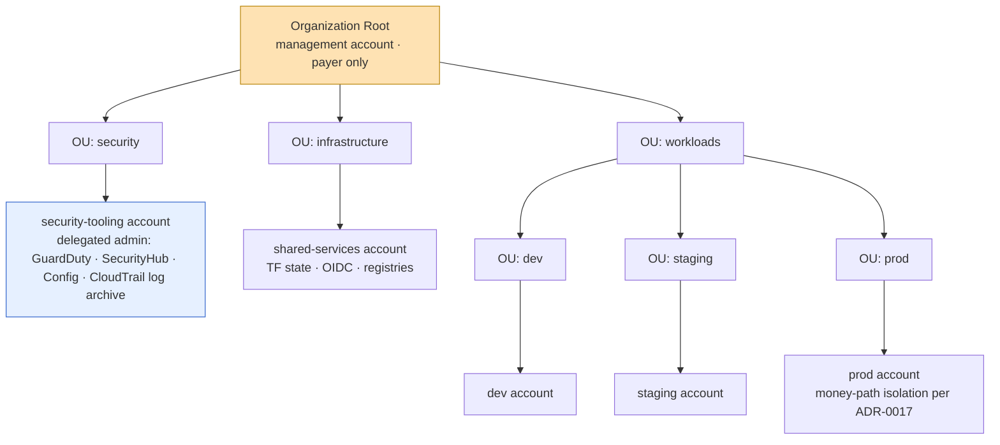

# Chapter 2 — AWS Foundation

**Status:** 🟢 Runbook · **Scope:** turn a **completely empty AWS management account** into a governed multi-account landing zone — AWS Organizations + OUs, member accounts, IAM Identity Center (SSO), SCP guardrails, KMS, CloudTrail, AWS Config, GuardDuty, Security Hub, and budgets — ending at a state where [Chapter 3 — Terraform Bootstrap](03-terraform-bootstrap.md) can run. · **Prev:** [Chapter 1 — GitHub Organization](01-github-org.md) · **Index:** [00-README](00-README.md)

> **This chapter is bootstrap-by-hand, performed exactly once.** The org, accounts, guardrails, and audit plane are the chicken-and-egg substrate that must exist *before* Terraform has anywhere to store state or any role to assume. **Steady-state is Terraform, not the console.** Once Chapter 3 stands up the remote-state backend and OIDC deploy roles, every further change to this landing zone — new SCPs, new per-domain KMS keys, Config rules, budgets — **MUST** be made through the [`global` landing-zone stack](../../../infrastructure/terraform/global/README.md) and the [`security` module](../../../infrastructure/terraform/modules/security/README.md), reviewed in a PR, and applied via CI. The hand-run commands below exist to escape the bootstrap paradox, **not** to become an operating habit. Any resource created here that later has a Terraform equivalent **MUST** be imported into state (noted per step), so a second `terraform apply` shows no drift.
>
> **RFC-2119** keywords (**MUST**, **MUST NOT**, **SHOULD**, **MAY**) are normative. A **MUST** is a gate: do not proceed to the next step until its Verification passes.
>
> This chapter plumbs the cloud-plane posture defined in [09 §10 Cloud security posture](../../../docs/09-cloud-architecture.md#10-cloud-security-posture) and enforces the policy owned by [08 Security Architecture](../../../docs/08-security-architecture.md) (§4 KMS/encryption, §9 residency). It does **not** redefine policy — it lands it.

---

## Placeholders (set once in `env.sh`, never committed)

| Placeholder | Meaning | Example |
|-------------|---------|---------|
| `<MGMT_ACCOUNT_ID>` | The empty management (payer) account you are logged into | `111111111111` |
| `<ROOT_ID>` | Organization root id (emitted when the org is created) | `r-abcd` |
| `<ORG_ID>` | Organization id | `o-exampleorgid` |
| `<EMAIL_BASE>` | A `+`-addressable mailbox you control for member-account root emails | `aws-nexus` (→ `aws-nexus+security@<domain>`) |
| `<DOMAIN>` | Your controlled email domain | `nexus.example` |
| `<SEC_ACCOUNT_ID>` | security-tooling account id (delegated security admin) | `222222222222` |
| `<LOG_ARCHIVE_BUCKET>` | Immutable CloudTrail S3 bucket in the security account | `nexus-org-cloudtrail-<ORG_ID>` |
| `<HOME_REGION>` | Primary/home region for P1 (US residency) | `us-east-1` |
| `<ALLOWED_REGIONS>` | Region allowlist for the region-deny SCP (P1) | `us-east-1`, `us-west-2` |
| `<AUDIT_KMS_KEY_ARN>` | CMK (in the security account) encrypting the CloudTrail/Config log store | `arn:aws:kms:us-east-1:222…:key/…` |
| `<SSO_INSTANCE_ARN>` | IAM Identity Center instance ARN | `arn:aws:sso:::instance/ssoins-…` |
| `<IDENTITY_STORE_ID>` | Identity Center identity-store id | `d-1234567890` |
| `<FINOPS_SNS_TOPIC_ARN>` | SNS topic that pages FinOps for budget/anomaly alerts | `arn:aws:sns:us-east-1:222…:finops-alerts` |

> `<ALLOWED_REGIONS>` is the P1 set. New regions are added **only** as the region-before-market gate opens each phase ([09 §6](../../../docs/09-cloud-architecture.md#6-multi-region-strategy), [ADR-0016](../../../docs/adr/ADR-0016-region-residency-lifecycle.md)); widening the allowlist is a reviewed SCP change in Terraform, never an ad-hoc console edit.

## Target landing-zone shape



> **Account isolation is the outer blast-radius boundary** ([09 §12](../../../docs/09-cloud-architecture.md#12-environments-footprint)). Environments are isolated **by account**, not just by namespace. **prod money-path isolation follows [ADR-0017](../../../docs/adr/ADR-0017-blast-radius-isolation.md)** (R-059/R-082): the discovery-vs-money node-pool/cluster split and the separate money/catalog Redis live *inside* the prod account and are provisioned later by the env Terraform stacks — this chapter only guarantees the prod **account** exists as a clean IAM + billing boundary for that isolation to sit in.

---

## Step 2.1 — Enable AWS Organizations with all features

**Objective.** Convert the standalone management account into an **organization with `ALL` features** (the prerequisite for SCPs, consolidated billing, and delegated administration).

**Prerequisites.** Logged into `<MGMT_ACCOUNT_ID>` with `AdministratorAccess` (bootstrap only — this is the *only* place broad admin is used). `aws` CLI v2 configured for `<HOME_REGION>`. The account MUST NOT already belong to another organization.

**Commands.**
```bash
aws organizations create-organization --feature-set ALL
# Capture identifiers for env.sh:
aws organizations describe-organization \
  --query 'Organization.{OrgId:Id,Root:MasterAccountId}' --output table
aws organizations list-roots --query 'Roots[0].Id' --output text   # -> <ROOT_ID>
```

**Expected output.** `create-organization` returns an `Organization` object with `FeatureSet: "ALL"` and an `Id` like `o-…`. `list-roots` prints a single `r-…` id.

**Verification.**
```bash
test "$(aws organizations describe-organization --query 'Organization.FeatureSet' --output text)" = "ALL" \
  && echo "OK: ALL features" || echo "FAIL"
```
Verification **MUST** print `OK: ALL features` before continuing.

**Rollback.** `aws organizations delete-organization` (only succeeds when **no member accounts** exist — so roll back *before* Step 2.3). This reverts the payer to a standalone account.

**Common failure.** `AlreadyInOrganizationException` — the account is already in an org (a re-run, or the account was invited elsewhere).

**Troubleshooting.** Confirm identity with `aws sts get-caller-identity`; ensure `Account` equals `<MGMT_ACCOUNT_ID>`. If the account was previously in an org, leave/decommission that org first. `ALL` (not `CONSOLIDATED_BILLING`) is mandatory — a consolidated-billing-only org **cannot** attach SCPs; if you see `CONSOLIDATED_BILLING`, enable all features via `aws organizations enable-all-features` (starts an org-wide handshake).

---

## Step 2.2 — Create the OU hierarchy

**Objective.** Create OUs `security`, `infrastructure`, `workloads`, and the nested `workloads/{dev,staging,prod}` so accounts land in policy-scoped containers.

**Prerequisites.** Step 2.1 verified. `<ROOT_ID>` exported.

**Commands.**
```bash
SEC_OU=$(aws organizations create-organizational-unit --parent-id "<ROOT_ID>" --name security       --query 'OrganizationalUnit.Id' --output text)
INF_OU=$(aws organizations create-organizational-unit --parent-id "<ROOT_ID>" --name infrastructure --query 'OrganizationalUnit.Id' --output text)
WL_OU=$( aws organizations create-organizational-unit --parent-id "<ROOT_ID>" --name workloads      --query 'OrganizationalUnit.Id' --output text)
DEV_OU=$(aws organizations create-organizational-unit --parent-id "$WL_OU" --name dev     --query 'OrganizationalUnit.Id' --output text)
STG_OU=$(aws organizations create-organizational-unit --parent-id "$WL_OU" --name staging --query 'OrganizationalUnit.Id' --output text)
PRD_OU=$(aws organizations create-organizational-unit --parent-id "$WL_OU" --name prod    --query 'OrganizationalUnit.Id' --output text)
echo "SEC_OU=$SEC_OU INF_OU=$INF_OU WL_OU=$WL_OU DEV_OU=$DEV_OU STG_OU=$STG_OU PRD_OU=$PRD_OU"
```

**Expected output.** Six `ou-…` ids echoed; `dev/staging/prod` are children of `workloads`.

**Verification.**
```bash
aws organizations list-organizational-units-for-parent --parent-id "$WL_OU" \
  --query 'OrganizationalUnits[].Name' --output text   # -> dev staging prod
```
**MUST** list exactly `dev`, `staging`, `prod`.

**Rollback.** `aws organizations delete-organizational-unit --organizational-unit-id <OU_ID>` (child OUs and accounts MUST be moved/removed first; delete leaf OUs before parents).

**Common failure.** `DuplicateOrganizationalUnitException` on re-run — the OU already exists. `ParentNotFoundException` — wrong `<ROOT_ID>`.

**Troubleshooting.** On a partial re-run, discover existing ids instead of recreating: `aws organizations list-organizational-units-for-parent --parent-id "<ROOT_ID>"`. Keep the `ou-…` ids in `env.sh`; every later placement and SCP attachment references them.

---

## Step 2.3 — Create the member accounts

**Objective.** Create the five member accounts — **security-tooling, shared-services, dev, staging, prod** (the management account already exists as payer) — and place each in its OU. Environments are isolated by account per [09 §12](../../../docs/09-cloud-architecture.md#12-environments-footprint).

**Prerequisites.** Step 2.2 verified. A `+`-addressable mailbox `<EMAIL_BASE>@<DOMAIN>` you control (each account MUST have a unique, deliverable root email). OU ids exported.

**Commands.**
```bash
create_acct () {  # $1 = friendly name, $2 = email localpart suffix, $3 = target OU id
  local req=$(aws organizations create-account \
      --account-name "nexus-$1" \
      --email "<EMAIL_BASE>+$2@<DOMAIN>" \
      --iam-user-access-to-billing ALLOW \
      --query 'CreateAccountStatus.Id' --output text)
  echo "requested $1 -> $req"
  while :; do
    read st acc < <(aws organizations describe-create-account-status --create-account-request-id "$req" \
        --query 'CreateAccountStatus.[State,AccountId]' --output text)
    [ "$st" = "SUCCEEDED" ] && { echo "$1 = $acc"; aws organizations move-account --account-id "$acc" \
        --source-parent-id "<ROOT_ID>" --destination-parent-id "$3"; break; }
    [ "$st" = "FAILED" ] && { echo "FAILED $1"; break; }
    sleep 10
  done
}
create_acct security-tooling security "$SEC_OU"    # -> export <SEC_ACCOUNT_ID>
create_acct shared-services   shared   "$INF_OU"
create_acct dev               dev      "$DEV_OU"
create_acct staging           staging  "$STG_OU"
create_acct prod              prod     "$PRD_OU"
```

**Expected output.** Each account reaches `State=SUCCEEDED` with a 12-digit `AccountId`, then is moved out of the root into its OU. Record the security-tooling id as `<SEC_ACCOUNT_ID>`.

**Verification.**
```bash
aws organizations list-accounts --query 'Accounts[].{Name:Name,Status:Status}' --output table
aws organizations list-accounts-for-parent --parent-id "$PRD_OU" --query 'Accounts[].Name' --output text  # nexus-prod
```
All six accounts (incl. payer) **MUST** show `Status=ACTIVE`, and each member **MUST** appear under its intended OU.

**Rollback.** New AWS behavior allows `aws organizations close-account --account-id <ID>` (90-day suspension before deletion). A closed/removed account cannot be immediately recreated with the same email. Prefer *repurposing* a mis-created account over closing it. **The prod account MUST NOT be closed casually** — treat it as the future money-path boundary ([ADR-0017](../../../docs/adr/ADR-0017-blast-radius-isolation.md)).

**Common failure.** `ConstraintViolationException: EMAIL_ALREADY_EXISTS` — that root email is used by another AWS account. `CONCURRENT_ACCOUNT_MODIFICATION` — `create-account` is serialized; the loop above waits, so run sequentially.

**Troubleshooting.** Verify every `+`-address actually delivers (root email is the last-resort recovery path). If `describe-create-account-status` stalls in `IN_PROGRESS` > 5 min, it is usually still normal AWS provisioning — keep polling; do **not** re-issue `create-account` (that risks duplicate accounts). The auto-created `OrganizationAccountAccessRole` in each member is how you (and later Identity Center) reach it; do not delete it during bootstrap.

---

## Step 2.4 — Enable IAM Identity Center (SSO) and least-privilege permission sets

**Objective.** Stand up **IAM Identity Center** as the single human-access plane and define **least-privilege permission sets**: `AdministratorAccess` **only** in the management account for bootstrap, and scoped roles (e.g. `PlatformAdmin`, `SecurityAudit`, `BillingViewer`, `ReadOnly`) elsewhere. No long-lived IAM users for humans, ever ([09 §10](../../../docs/09-cloud-architecture.md#10-cloud-security-posture); [08 §3](../../../docs/08-security-architecture.md#3-identity--access-management-iam)).

**Prerequisites.** Step 2.3 verified. Identity Center **MUST** be enabled from the management account. Enablement itself is a one-time console action (Identity Center → *Enable*, region `<HOME_REGION>`) or `aws sso-admin create-instance`; after that, all permission-set work is CLI.

**Commands.**
```bash
# Discover the instance created on enablement:
SSO_INSTANCE_ARN=$(aws sso-admin list-instances --query 'Instances[0].InstanceArn'     --output text)
IDENTITY_STORE_ID=$(aws sso-admin list-instances --query 'Instances[0].IdentityStoreId' --output text)

# Bootstrap-only admin permission set (short session, MUST be mgmt-scoped by assignment):
ADMIN_PS=$(aws sso-admin create-permission-set --instance-arn "$SSO_INSTANCE_ARN" \
  --name BootstrapAdmin --description "Break-glass admin, mgmt account only" \
  --session-duration PT1H --query 'PermissionSet.PermissionSetArn' --output text)
aws sso-admin attach-managed-policy-to-permission-set --instance-arn "$SSO_INSTANCE_ARN" \
  --permission-set-arn "$ADMIN_PS" --managed-policy-arn arn:aws:iam::aws:policy/AdministratorAccess

# Scoped, least-privilege sets used everywhere else:
for spec in "PlatformAdmin:PT4H:arn:aws:iam::aws:policy/PowerUserAccess" \
            "SecurityAudit:PT4H:arn:aws:iam::aws:policy/SecurityAudit" \
            "BillingViewer:PT2H:arn:aws:iam::aws:policy/job-function/Billing" \
            "ReadOnly:PT4H:arn:aws:iam::aws:policy/ReadOnlyAccess"; do
  name=${spec%%:*}; rest=${spec#*:}; dur=${rest%%:*}; pol=${rest#*:}
  ps=$(aws sso-admin create-permission-set --instance-arn "$SSO_INSTANCE_ARN" \
        --name "$name" --session-duration "$dur" \
        --query 'PermissionSet.PermissionSetArn' --output text)
  aws sso-admin attach-managed-policy-to-permission-set --instance-arn "$SSO_INSTANCE_ARN" \
        --permission-set-arn "$ps" --managed-policy-arn "$pol"
done
# Assignment (group -> account -> permission set); BootstrapAdmin MUST target ONLY the mgmt account:
aws sso-admin create-account-assignment --instance-arn "$SSO_INSTANCE_ARN" \
  --target-id "<MGMT_ACCOUNT_ID>" --target-type AWS_ACCOUNT \
  --permission-set-arn "$ADMIN_PS" \
  --principal-type GROUP --principal-id "<BREAK_GLASS_GROUP_ID>"
```

**Expected output.** `list-instances` returns one instance ARN + identity-store id. Each `create-permission-set` returns a `permissionSet/ps-…` ARN; assignments return a `RequestId` with `Status: IN_PROGRESS` → `SUCCEEDED`.

**Verification.**
```bash
aws sso-admin list-permission-sets --instance-arn "$SSO_INSTANCE_ARN" --output text | wc -l   # >= 5
# Assert AdministratorAccess is attached to NO permission set assigned outside the mgmt account:
aws sso-admin list-account-assignments --instance-arn "$SSO_INSTANCE_ARN" \
  --account-id "<PRD_ACCOUNT_ID>" --permission-set-arn "$ADMIN_PS" \
  --query 'AccountAssignments' --output text   # MUST be empty
```
The `AdministratorAccess`/`BootstrapAdmin` set **MUST NOT** be assigned to any workload account.

**Rollback.** `aws sso-admin delete-account-assignment …` then `aws sso-admin delete-permission-set --instance-arn "$SSO_INSTANCE_ARN" --permission-set-arn <PS_ARN>`. Disabling Identity Center entirely is a console action and removes all SSO access — avoid unless abandoning the bootstrap.

**Common failure.** `list-instances` returns empty — Identity Center was never enabled (console step skipped) or you queried the wrong region (it is a regional service pinned to `<HOME_REGION>`). `ConflictException` on re-run — permission set name already exists.

**Troubleshooting.** If external IdP federation (Okta/Entra) is planned, configure it as the identity source **before** creating groups, so principals resolve. Until then, create users/groups directly in the Identity Center store (`aws identitystore create-group --identity-store-id "$IDENTITY_STORE_ID" …`). **Steady-state note:** permission sets and assignments SHOULD move to Terraform (`aws_ssoadmin_permission_set`) after Chapter 3; keep the console footprint minimal.

---

## Step 2.5 — Enable SCP policy type and attach guardrails

**Objective.** Enable `SERVICE_CONTROL_POLICY` on the root and attach three **preventive guardrails**: (a) **deny root-user actions**, (b) **deny disabling security services** (CloudTrail/Config/GuardDuty/Security Hub), (c) a **region allowlist** (deny everything outside `<ALLOWED_REGIONS>`, exempting global services). These realize the least-privilege, guardrail-by-default posture of [09 §10](../../../docs/09-cloud-architecture.md#10-cloud-security-posture); the same policy JSON is rendered by the Terraform [`global` stack](../../../infrastructure/terraform/global/README.md) for steady-state ownership.

**Prerequisites.** Step 2.2 verified. Policy documents authored (below). **Do not** attach a region-deny SCP to the **root** in a way that locks out the management account's own global endpoints — attach guardrails to the **workloads OU** first, validate, then widen.

**Commands.**
```bash
aws organizations enable-policy-type --root-id "<ROOT_ID>" --policy-type SERVICE_CONTROL_POLICY

cat > /tmp/scp-deny-root.json <<'JSON'
{ "Version": "2012-10-17", "Statement": [{
  "Sid": "DenyRootUser", "Effect": "Deny", "Action": "*", "Resource": "*",
  "Condition": { "StringLike": { "aws:PrincipalArn": "arn:aws:iam::*:root" } } }] }
JSON

cat > /tmp/scp-protect-security.json <<'JSON'
{ "Version": "2012-10-17", "Statement": [{
  "Sid": "DenyDisableSecurityServices", "Effect": "Deny",
  "Action": [
    "cloudtrail:StopLogging","cloudtrail:DeleteTrail","cloudtrail:UpdateTrail",
    "config:DeleteConfigurationRecorder","config:StopConfigurationRecorder","config:DeleteDeliveryChannel",
    "guardduty:DeleteDetector","guardduty:DisassociateFromMasterAccount","guardduty:UpdateDetector",
    "securityhub:DisableSecurityHub","securityhub:DisassociateFromMasterAccount",
    "organizations:LeaveOrganization"
  ], "Resource": "*",
  "Condition": { "StringNotLike": { "aws:PrincipalArn": [ "arn:aws:iam::*:role/OrganizationAccountAccessRole" ] } } }] }
JSON

cat > /tmp/scp-region-allowlist.json <<'JSON'
{ "Version": "2012-10-17", "Statement": [{
  "Sid": "DenyOutsideAllowedRegions", "Effect": "Deny", "NotAction": [
    "iam:*","sts:*","organizations:*","cloudfront:*","route53:*","route53domains:*",
    "support:*","budgets:*","cur:*","globalaccelerator:*","waf:*","shield:*","kms:ListAliases"
  ], "Resource": "*",
  "Condition": { "StringNotEquals": { "aws:RequestedRegion": [ "us-east-1", "us-west-2" ] } } }] }
JSON

for f in deny-root protect-security region-allowlist; do
  pid=$(aws organizations create-policy --type SERVICE_CONTROL_POLICY \
    --name "guardrail-$f" --description "NEXUS org guardrail: $f" \
    --content "file:///tmp/scp-$f.json" --query 'Policy.PolicySummary.Id' --output text)
  aws organizations attach-policy --policy-id "$pid" --target-id "$WL_OU"   # start on workloads OU
  echo "attached guardrail-$f = $pid to $WL_OU"
done
```

**Expected output.** `enable-policy-type` returns the root with `SERVICE_CONTROL_POLICY` in `EnabledPolicyTypes`. Each `create-policy` returns a `p-…` id; each `attach-policy` returns no error.

**Verification.**
```bash
aws organizations list-policies-for-target --target-id "$WL_OU" --filter SERVICE_CONTROL_POLICY \
  --query 'Policies[].Name' --output text   # guardrail-deny-root guardrail-protect-security guardrail-region-allowlist
# Functional check: assume a scoped role in the dev account and confirm an ap-south-1 call is denied.
```
All three guardrails **MUST** be listed on the workloads OU before any workload account is used by Terraform.

**Rollback.** `aws organizations detach-policy --policy-id <p-id> --target-id "$WL_OU"` then `aws organizations delete-policy --policy-id <p-id>`. The default `FullAWSAccess` SCP remains, so detaching restores unrestricted access. **Keep `FullAWSAccess` attached** while iterating, or an account can be fully locked out.

**Common failure.** `PolicyTypeAlreadyEnabledException` on re-run (benign). `ConstraintViolationException: too many attached policies` — SCP attachment count per target is capped (5). Lockout symptom: after attaching region-deny to the **root**, the console/CLI in the mgmt account starts denying — because a too-broad `Action:"*"` caught a global service; widen the `NotAction` exemptions.

**Troubleshooting.** Test SCPs on the **dev OU** first, never the root, and keep a break-glass session open. Widen `<ALLOWED_REGIONS>` **only** through the region-before-market gate ([ADR-0016](../../../docs/adr/ADR-0016-region-residency-lifecycle.md)) — P1 is `us-east-1`+`us-west-2`; EU/AP regions are added at their phase. **Steady-state:** these exact documents are emitted by `scp_region_deny` / `scp_require_tags` in [`global/guardrails.tf`](../../../infrastructure/terraform/global/README.md); after Chapter 3, manage attachment there, not by hand.

---

## Step 2.6 — Foundational KMS (audit CMK; per-domain keys deferred to Terraform)

**Objective.** Create the **one CMK the audit plane needs now** — a customer-managed key in the **security-tooling account** that encrypts the CloudTrail/Config log store — with **automatic annual rotation on**. Establish the key strategy: **one CMK per data domain, per region, rotation on** ([08 §4.2/§4.5](../../../docs/08-security-architecture.md#4-data-protection)), but the per-domain data keys (rds/redis/msk/s3/eks/secrets) are **NOT** created here — they are provisioned by the Terraform [`security` module](../../../infrastructure/terraform/modules/security/README.md) per env/region. Bootstrap creates only what must exist before Terraform runs.

**Prerequisites.** Step 2.3 verified. Assume a role into `<SEC_ACCOUNT_ID>` (e.g. `OrganizationAccountAccessRole`). Region `<HOME_REGION>`.

**Commands.**
```bash
# (run with credentials for <SEC_ACCOUNT_ID>)
KEY_ID=$(aws kms create-key \
  --description "NEXUS org audit log CMK (CloudTrail + Config)" \
  --key-usage ENCRYPT_DECRYPT --key-spec SYMMETRIC_DEFAULT \
  --tags TagKey=owner,TagValue=infra-security TagKey=domain,TagValue=audit \
  --query 'KeyMetadata.KeyId' --output text)
aws kms enable-key-rotation --key-id "$KEY_ID"
aws kms create-alias --alias-name alias/nexus-audit --target-key-id "$KEY_ID"
KEY_ARN=$(aws kms describe-key --key-id "$KEY_ID" --query 'KeyMetadata.Arn' --output text)   # -> <AUDIT_KMS_KEY_ARN>
# Key policy MUST let CloudTrail + Config use the key org-wide (apply a scoped policy doc):
aws kms put-key-policy --key-id "$KEY_ID" --policy-name default --policy file:///tmp/audit-key-policy.json
echo "AUDIT_KMS_KEY_ARN=$KEY_ARN"
```

**Expected output.** A `key/…` id, rotation enabled, alias `alias/nexus-audit` created, and a full key ARN echoed for `<AUDIT_KMS_KEY_ARN>`.

**Verification.**
```bash
test "$(aws kms get-key-rotation-status --key-id "$KEY_ID" --query KeyRotationEnabled --output text)" = "True" \
  && echo "OK: rotation on" || echo "FAIL"
```
Rotation **MUST** be `True`; the key policy **MUST** grant `cloudtrail.amazonaws.com` and `config.amazonaws.com` `kms:GenerateDataKey*`/`kms:Decrypt`.

**Rollback.** `aws kms schedule-key-deletion --key-id "$KEY_ID" --pending-window-in-days 30` (KMS keys cannot be hard-deleted immediately — a 7–30 day window). `aws kms delete-alias --alias-name alias/nexus-audit`. Because CloudTrail (Step 2.7) depends on this key, do not schedule deletion until the trail is removed.

**Common failure.** `MalformedPolicyDocumentException` — the key policy omits the CloudTrail/Config service principals or the `aws:SourceOrgID`/`aws:SourceArn` conditions, so the audit services can't use the key. Trying to *disable* rotation later trips the Step 2.5 security-protection SCP (intended).

**Troubleshooting.** Scope the key policy with `"Condition": {"StringEquals": {"aws:SourceOrgID": "<ORG_ID>"}}` so only principals in this org can drive the key. **Do not** overload this one CMK for application data — per-domain isolation (a key compromise stays contained) is the whole point ([`security` module](../../../infrastructure/terraform/modules/security/README.md) creates rds/redis/msk/s3/eks/secrets keys with `for_each`). Region-scoped keys follow the data for residency ([08 §9.3](../../../docs/08-security-architecture.md#9-compliance-phased-per-jurisdiction-policy-packs)).

---

## Step 2.7 — Organization CloudTrail → immutable security-account log archive

**Objective.** Create a **multi-region organization trail** that logs **every account** to a hardened, **immutable** S3 bucket in `<SEC_ACCOUNT_ID>`, encrypted with `<AUDIT_KMS_KEY_ARN>`, with log-file validation on. This is the org-wide audit substrate referenced in [09 §10](../../../docs/09-cloud-architecture.md#10-cloud-security-posture) (CloudTrail all-regions → central, immutable).

**Prerequisites.** Steps 2.6 verified. `organizations:*` in the mgmt account (to create an **organization** trail) plus the ability to create the bucket in the security account. Enable trusted access: `aws organizations enable-aws-service-access --service-principal cloudtrail.amazonaws.com`.

**Commands.**
```bash
# (bucket + Object Lock in <SEC_ACCOUNT_ID>) — Object Lock MUST be set at creation:
aws s3api create-bucket --bucket "<LOG_ARCHIVE_BUCKET>" --region "<HOME_REGION>" \
  --object-lock-enabled-for-bucket \
  --create-bucket-configuration LocationConstraint="<HOME_REGION>" 2>/dev/null || true
aws s3api put-object-lock-configuration --bucket "<LOG_ARCHIVE_BUCKET>" \
  --object-lock-configuration '{"ObjectLockEnabled":"Enabled","Rule":{"DefaultRetention":{"Mode":"COMPLIANCE","Years":1}}}'
aws s3api put-public-access-block --bucket "<LOG_ARCHIVE_BUCKET>" \
  --public-access-block-configuration BlockPublicAcls=true,IgnorePublicAcls=true,BlockPublicPolicy=true,RestrictPublicBuckets=true
aws s3api put-bucket-policy --bucket "<LOG_ARCHIVE_BUCKET>" --policy file:///tmp/cloudtrail-bucket-policy.json

# (organization trail, created from the mgmt account)
aws cloudtrail create-trail --name nexus-org-trail \
  --s3-bucket-name "<LOG_ARCHIVE_BUCKET>" \
  --kms-key-id "<AUDIT_KMS_KEY_ARN>" \
  --is-organization-trail --is-multi-region-trail --enable-log-file-validation
aws cloudtrail start-logging --name nexus-org-trail
```

**Expected output.** `create-trail` returns the trail ARN with `IsOrganizationTrail: true`, `IsMultiRegionTrail: true`, `LogFileValidationEnabled: true`, and the KMS key set. `start-logging` returns no error.

**Verification.**
```bash
aws cloudtrail get-trail-status --name nexus-org-trail --query 'IsLogging' --output text   # True
aws cloudtrail get-trail --name nexus-org-trail \
  --query 'Trail.{Org:IsOrganizationTrail,Multi:IsMultiRegionTrail,Valid:LogFileValidationEnabled}' --output table
# Object Lock (immutability) MUST be COMPLIANCE mode:
aws s3api get-object-lock-configuration --bucket "<LOG_ARCHIVE_BUCKET>" \
  --query 'ObjectLockConfiguration.Rule.DefaultRetention.Mode' --output text   # COMPLIANCE
```
`IsLogging` **MUST** be `True` and Object Lock **MUST** be `COMPLIANCE` (immutable — logs cannot be altered or deleted within retention, even by root).

**Rollback.** `aws cloudtrail stop-logging` + `aws cloudtrail delete-trail --name nexus-org-trail`. **The bucket's Object-Lock (COMPLIANCE) objects cannot be deleted before retention expires — by design.** To fully remove, the bucket must age out or be abandoned; do not weaken to `GOVERNANCE`/no-lock to enable deletion, as that defeats the immutability control. Note: `cloudtrail:StopLogging`/`DeleteTrail` are **denied by the Step 2.5 SCP** for non-`OrganizationAccountAccessRole` principals — roll back with an exempt/break-glass role.

**Common failure.** `InsufficientS3BucketPolicyException` — the bucket policy is missing the CloudTrail service principal or the `aws:SourceArn`/`aws:SourceAccount` conditions for the **org** trail (the resource path must allow `AWSLogs/<ORG_ID>/*`). `KmsException` — the audit key policy (Step 2.6) doesn't grant CloudTrail `GenerateDataKey*`.

**Troubleshooting.** For an **organization** trail the bucket policy resource **MUST** cover every member: `arn:aws:s3:::<LOG_ARCHIVE_BUCKET>/AWSLogs/<ORG_ID>/*` (not just the payer's account id). Confirm trusted access is enabled (`aws organizations list-aws-service-access-for-organization`). **Steady-state:** the trail and hardened bucket SHOULD be imported into Terraform after Chapter 3 and never edited in the console thereafter.

---

## Step 2.8 — AWS Config with organization rules

**Objective.** Enable **AWS Config** org-wide with the security-tooling account as **delegated administrator**, and deploy baseline **organization Config rules** (encryption-at-rest, no-public-S3, required `owner` tag, root-MFA) as continuous compliance detection ([09 §10](../../../docs/09-cloud-architecture.md#10-cloud-security-posture): Config detects drift/compliance).

**Prerequisites.** Steps 2.6–2.7 verified. Enable trusted access: `aws organizations enable-aws-service-access --service-principal config.amazonaws.com` and `config-multiaccountsetup.amazonaws.com`. Register the delegated admin.

**Commands.**
```bash
aws organizations register-delegated-administrator \
  --account-id "<SEC_ACCOUNT_ID>" --service-principal config-multiaccountsetup.amazonaws.com

# (run in <SEC_ACCOUNT_ID>) deploy an org Config rule set:
aws configservice put-organization-config-rule \
  --organization-config-rule-name nexus-s3-encryption \
  --organization-managed-rule-metadata \
    RuleIdentifier=S3_BUCKET_SERVER_SIDE_ENCRYPTION_ENABLED,ResourceTypesScope=AWS::S3::Bucket
aws configservice put-organization-config-rule \
  --organization-config-rule-name nexus-s3-no-public \
  --organization-managed-rule-metadata RuleIdentifier=S3_BUCKET_PUBLIC_READ_PROHIBITED
aws configservice put-organization-config-rule \
  --organization-config-rule-name nexus-required-owner-tag \
  --organization-managed-rule-metadata \
    'RuleIdentifier=REQUIRED_TAGS,InputParameters={"tag1Key":"owner"}'
aws configservice put-organization-config-rule \
  --organization-config-rule-name nexus-root-mfa \
  --organization-managed-rule-metadata RuleIdentifier=ROOT_ACCOUNT_MFA_ENABLED
```

**Expected output.** `register-delegated-administrator` returns no error. Each `put-organization-config-rule` returns an `OrganizationConfigRuleArn`.

**Verification.**
```bash
aws configservice describe-organization-config-rule-statuses \
  --query 'OrganizationConfigRuleStatuses[].{Rule:OrganizationConfigRuleName,State:OrganizationRuleStatus}' --output table
```
Every rule **MUST** reach `CREATE_SUCCESSFUL` across member accounts before Chapter 3.

**Rollback.** `aws configservice delete-organization-config-rule --organization-config-rule-name <NAME>` per rule; `aws organizations deregister-delegated-administrator --account-id "<SEC_ACCOUNT_ID>" --service-principal config-multiaccountsetup.amazonaws.com`.

**Common failure.** `NoAvailableDeliveryChannelException` / `OrganizationAccessDeniedException` — the configuration recorder or delivery channel isn't set up in member accounts yet, or trusted access wasn't enabled. `config:*` disable attempts trip the Step 2.5 SCP (intended).

**Troubleshooting.** Org Config rules require each member to have a running configuration recorder + delivery channel; Control Tower or a StackSet normally bootstraps these. If you are not using Control Tower, deploy a recorder/delivery-channel via an org **CloudFormation StackSet** first, then the rules apply. **Steady-state:** the rule set is the same one documented for the org admin in [`global/guardrails.tf`](../../../infrastructure/terraform/global/README.md); manage it as code after Chapter 3.

---

## Step 2.9 — GuardDuty (org-wide, delegated admin = security account)

**Objective.** Enable **GuardDuty** for the whole organization with **auto-enable for all current and future member accounts**, delegating administration to `<SEC_ACCOUNT_ID>` ([09 §10](../../../docs/09-cloud-architecture.md#10-cloud-security-posture)).

**Prerequisites.** Step 2.3 verified. From the **management account**, delegate GuardDuty admin.

**Commands.**
```bash
# (management account) delegate admin to security-tooling:
aws guardduty enable-organization-admin-account --admin-account-id "<SEC_ACCOUNT_ID>"

# (security-tooling account) create the detector + auto-enable org members:
DET=$(aws guardduty create-detector --enable \
  --finding-publishing-frequency FIFTEEN_MINUTES --query 'DetectorId' --output text)
aws guardduty update-organization-configuration \
  --detector-id "$DET" --auto-enable-organization-members ALL
```

**Expected output.** `enable-organization-admin-account` returns no error; `create-detector` returns a `DetectorId`; `update-organization-configuration` succeeds.

**Verification.**
```bash
aws guardduty describe-organization-configuration --detector-id "$DET" \
  --query '{Auto:AutoEnableOrganizationMembers}' --output table   # ALL
aws guardduty list-members --detector-id "$DET" --query 'Members[].RelationshipStatus' --output text   # Enabled…
```
`AutoEnableOrganizationMembers` **MUST** be `ALL` so accounts created in later phases are covered automatically.

**Rollback.** `aws guardduty update-organization-configuration --detector-id "$DET" --auto-enable-organization-members NONE`; `aws guardduty delete-detector --detector-id "$DET"`; from mgmt: `aws guardduty disable-organization-admin-account --admin-account-id "<SEC_ACCOUNT_ID>"`. Note `guardduty:DeleteDetector` is **SCP-denied** for non-exempt principals (Step 2.5).

**Common failure.** `BadRequestException: account is not a member of an organization` — trusted access/org membership not settled; retry after Step 2.3 confirms `ACTIVE`. Delegating from the wrong account (must be the **management** account).

**Troubleshooting.** GuardDuty is **regional** — repeat `create-detector` + `update-organization-configuration` in **each** region in `<ALLOWED_REGIONS>` (delegation is org-wide but detectors are per-region). Enable the S3, EKS-runtime, and malware-protection features per the security baseline. **Steady-state:** move detector config to Terraform after Chapter 3.

---

## Step 2.10 — Security Hub (org-wide, CIS + AWS FSBP standards)

**Objective.** Enable **Security Hub** across the org with `<SEC_ACCOUNT_ID>` as delegated admin, auto-enabling members, subscribed to the **CIS AWS Foundations Benchmark** and **AWS Foundational Security Best Practices (FSBP)** standards — the single pane that aggregates GuardDuty/Config findings ([09 §10](../../../docs/09-cloud-architecture.md#10-cloud-security-posture)).

**Prerequisites.** Steps 2.8–2.9 verified (Security Hub consumes Config + GuardDuty). Enable trusted access: `aws organizations enable-aws-service-access --service-principal securityhub.amazonaws.com`.

**Commands.**
```bash
# (management account) delegate admin:
aws securityhub enable-organization-admin-account --admin-account-id "<SEC_ACCOUNT_ID>"

# (security-tooling account) enable hub + standards + org auto-enable:
aws securityhub enable-security-hub --enable-default-standards
aws securityhub update-organization-configuration --auto-enable
aws securityhub batch-enable-standards --standards-subscription-requests \
  StandardsArn=arn:aws:securityhub:"<HOME_REGION>"::standards/aws-foundational-security-best-practices/v/1.0.0 \
  StandardsArn=arn:aws:securityhub:::ruleset/cis-aws-foundations-benchmark/v/1.4.0
```

**Expected output.** Delegation succeeds; `enable-security-hub` returns no error; `batch-enable-standards` returns `StandardsSubscriptions` with `StandardsStatus: PENDING` → `READY`.

**Verification.**
```bash
aws securityhub get-enabled-standards \
  --query 'StandardsSubscriptions[].{Std:StandardsArn,Status:StandardsStatus}' --output table
aws securityhub describe-organization-configuration --query 'AutoEnable' --output text   # True
```
Both CIS and FSBP **MUST** reach `READY` and org `AutoEnable` **MUST** be `True`.

**Rollback.** `aws securityhub batch-disable-standards --standards-subscription-arns <ARN>`; `aws securityhub update-organization-configuration --no-auto-enable`; `aws securityhub disable-security-hub`; from mgmt: `aws securityhub disable-organization-admin-account --admin-account-id "<SEC_ACCOUNT_ID>"`. `securityhub:DisableSecurityHub` is **SCP-denied** for non-exempt principals (Step 2.5).

**Common failure.** `ResourceConflictException` — Security Hub already enabled in that region. Standards ARN region mismatch — the FSBP ARN embeds `<HOME_REGION>`; the CIS ruleset ARN is region-less. Findings empty at first — Config/GuardDuty need a few hours to populate.

**Troubleshooting.** Security Hub is **regional**; enable it in every region in `<ALLOWED_REGIONS>` and designate an aggregation region (`aws securityhub create-finding-aggregator --region-linking-mode ALL_REGIONS`) so findings converge in `<SEC_ACCOUNT_ID>`. **Steady-state:** manage standards/aggregation via Terraform after Chapter 3.

---

## Step 2.11 — Budgets and cost anomaly detection (per-account + org)

**Objective.** Create **per-account monthly budgets** with alert thresholds plus **AWS Cost Anomaly Detection**, wired to `<FINOPS_SNS_TOPIC_ARN>`. This lands the FinOps guardrail of [09 §9](../../../docs/09-cloud-architecture.md#9-cost-architecture-finops) and gives early warning against the **sub-1M-MAU cost floor**: the fixed HA + isolation floor (discovery/money pool split, warm-GPU minimum, per-region cells) makes unit economics **unprofitable below ~1M MAU** and raises the small-scale floor ~+25–40% ([09 §9.1](../../../docs/09-cloud-architecture.md#91-ai-cost-governance-adr-0009)) — so early spend **MUST** be watched against milestones, not left to a surprise bill.

**Prerequisites.** Steps 2.3 verified. An SNS topic `<FINOPS_SNS_TOPIC_ARN>` (in the mgmt/payer account) that pages FinOps; budgets/CE run in the **payer** account (`us-east-1` global endpoint).

**Commands.**
```bash
# Per-account budget with 80% actual + 100% forecast alerts (repeat per member; filter by LinkedAccount):
for acct in "<MGMT_ACCOUNT_ID>" "<SEC_ACCOUNT_ID>" "<PRD_ACCOUNT_ID>"; do
  aws budgets create-budget --account-id "<MGMT_ACCOUNT_ID>" \
    --budget "{\"BudgetName\":\"nexus-$acct-monthly\",\"BudgetLimit\":{\"Amount\":\"2000\",\"Unit\":\"USD\"},\"TimeUnit\":\"MONTHLY\",\"BudgetType\":\"COST\",\"CostFilters\":{\"LinkedAccount\":[\"$acct\"]}}" \
    --notifications-with-subscribers "[
      {\"Notification\":{\"NotificationType\":\"ACTUAL\",\"ComparisonOperator\":\"GREATER_THAN\",\"Threshold\":80},
       \"Subscribers\":[{\"SubscriptionType\":\"SNS\",\"Address\":\"<FINOPS_SNS_TOPIC_ARN>\"}]},
      {\"Notification\":{\"NotificationType\":\"FORECASTED\",\"ComparisonOperator\":\"GREATER_THAN\",\"Threshold\":100},
       \"Subscribers\":[{\"SubscriptionType\":\"SNS\",\"Address\":\"<FINOPS_SNS_TOPIC_ARN>\"}]}]"
done

# Cost Anomaly Detection: org-wide monitor + subscription:
MON=$(aws ce create-anomaly-monitor --anomaly-monitor \
  '{"MonitorName":"nexus-org-monitor","MonitorType":"DIMENSIONAL","MonitorDimension":"SERVICE"}' \
  --query 'MonitorArn' --output text)
aws ce create-anomaly-subscription --anomaly-subscription \
  "{\"SubscriptionName\":\"nexus-anomaly-alerts\",\"Frequency\":\"IMMEDIATE\",\"MonitorArnList\":[\"$MON\"],\"Subscribers\":[{\"Type\":\"SNS\",\"Address\":\"<FINOPS_SNS_TOPIC_ARN>\"}],\"ThresholdExpression\":{\"Dimensions\":{\"Key\":\"ANOMALY_TOTAL_IMPACT_ABSOLUTE\",\"Values\":[\"100\"],\"MatchOptions\":[\"GREATER_THAN_OR_EQUAL\"]}}}"
```

**Expected output.** Each `create-budget` returns no error; `create-anomaly-monitor` returns a `MonitorArn`; `create-anomaly-subscription` returns a `SubscriptionArn`.

**Verification.**
```bash
aws budgets describe-budgets --account-id "<MGMT_ACCOUNT_ID>" \
  --query 'Budgets[].BudgetName' --output text
aws ce get-anomaly-monitors --query 'AnomalyMonitors[].MonitorName' --output text   # nexus-org-monitor
```
A budget **MUST** exist per active account and the anomaly monitor **MUST** be present; the SNS topic **MUST** have a confirmed subscriber (test-publish once).

**Rollback.** `aws budgets delete-budget --account-id "<MGMT_ACCOUNT_ID>" --budget-name <NAME>`; `aws ce delete-anomaly-subscription --subscription-arn <ARN>`; `aws ce delete-anomaly-monitor --monitor-arn "$MON"`.

**Common failure.** `AccessDeniedException` — Budgets/CE run only from the **payer** account, and IAM-user access to billing data must be enabled (Step 2.3 set `--iam-user-access-to-billing ALLOW`). SNS delivery silently failing — the topic policy doesn't allow `budgets.amazonaws.com`/`costalerts.amazonaws.com` to publish.

**Troubleshooting.** Grant `budgets.amazonaws.com` and `costalerts.amazonaws.com` `SNS:Publish` on `<FINOPS_SNS_TOPIC_ARN>` via the topic policy. Tune `BudgetLimit` per account (prod > dev). Because the **~1M-MAU floor** means early-stage spend is structurally front-loaded, set alert thresholds against a **burn-vs-milestone** plan (risk R-025, [09 §9.1](../../../docs/09-cloud-architecture.md#91-ai-cost-governance-adr-0009)), not a flat number. **Steady-state:** budgets/anomaly detection are declared as code ([09 §9](../../../docs/09-cloud-architecture.md#9-cost-architecture-finops): "budgets/anomaly detection as code") after Chapter 3.

---

## Exit criteria for Chapter 2

All of the following **MUST** be true before starting [Chapter 3 — Terraform Bootstrap](03-terraform-bootstrap.md):

| # | Gate | Check |
|---|------|-------|
| 1 | Org with `ALL` features | `describe-organization` → `FeatureSet=ALL` |
| 2 | OUs `security`/`infrastructure`/`workloads`+`{dev,staging,prod}` | Step 2.2 verify |
| 3 | 5 member accounts `ACTIVE`, each in its OU | Step 2.3 verify |
| 4 | Identity Center on; `AdministratorAccess` **only** in mgmt | Step 2.4 verify |
| 5 | SCP guardrails (deny-root, protect-security, region-allowlist) attached | Step 2.5 verify |
| 6 | Audit CMK with rotation on | Step 2.6 verify |
| 7 | Org CloudTrail logging → immutable (Object-Lock COMPLIANCE) bucket | Step 2.7 verify |
| 8 | Org Config rules `CREATE_SUCCESSFUL` | Step 2.8 verify |
| 9 | GuardDuty org auto-enable `ALL` | Step 2.9 verify |
| 10 | Security Hub CIS + FSBP `READY`, org auto-enable | Step 2.10 verify |
| 11 | Per-account budgets + anomaly monitor wired to SNS | Step 2.11 verify |

> **Handoff to Terraform.** From here, the landing zone is **frozen against manual edits**. Chapter 3 creates the [`global` stack](../../../infrastructure/terraform/global/README.md) (S3+DynamoDB state backend, GitHub OIDC, per-env deploy roles) and thereafter every change to org guardrails, KMS, audit, and budgets is a reviewed Terraform PR applied via CI ([ADR-0003](../../../docs/adr/ADR-0003-cloud-provider.md): all infra via Terraform). Where a bootstrap resource has a Terraform equivalent, **import it** so a second apply shows no drift.

*Next: [Chapter 3 — Terraform Bootstrap](03-terraform-bootstrap.md)*
