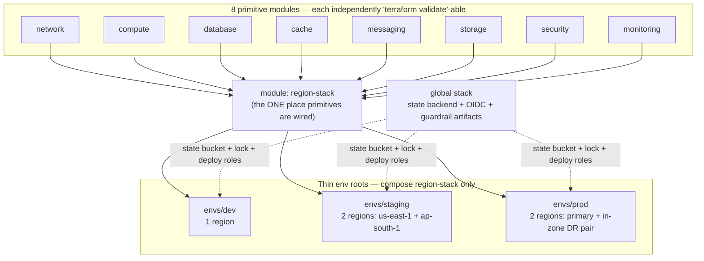

# Chapter 3 — Terraform Bootstrap

**Status:** 🟢 Runbook · **Chapter 3 of 8** · **Scope:** stand up the estate's **remote Terraform state** (S3 + DynamoDB + KMS), wire **per-env backends**, and federate **GitHub Actions → AWS via OIDC** with least-privilege deploy roles — the prerequisites for applying any network, cluster, or data resource. **Enter with:** [Chapter 2 — AWS Foundation](02-aws-foundation.md) complete (org, member accounts, IAM Identity Center, org KMS, CloudTrail/Config/GuardDuty/Security Hub, budgets). **Exit to:** [Chapter 4 — Networking](04-networking.md). **Do NOT apply the `network` module until this chapter's Verification gates pass.**

> This chapter *operates* the [`infrastructure/terraform/global`](../../../infrastructure/terraform/global/README.md) stack and the per-env backends under [`infrastructure/terraform/envs`](../../../infrastructure/terraform/README.md). It realizes [09 §10 org guardrails](../../09-cloud-architecture.md#10-cloud-security-posture) and the anti-lock-in contract of [09 §1](../../09-cloud-architecture.md#1-cloud-provider-decision-adr-0003) (all infra via Terraform, no console-clicked resources), under [ADR-0018 R-065](../../adr/ADR-0018-connector-security-hardening.md) (short-lived OIDC, tight audience/branch conditions, no persistent runner creds) and the operational-maturity posture of [ADR-0019](../../adr/ADR-0019-portability-ops-maturity.md).
>
> **Every step below carries all 8 fields** — Objective · Prerequisites · Commands · Expected output · Verification · Rollback · Common failure · Troubleshooting — per the [step format](00-README.md). Keywords **MUST / MUST NOT / SHOULD / MAY** are [RFC-2119](https://www.rfc-editor.org/rfc/rfc2119). Every `<ANGLE_BRACKET>` is a placeholder you set once in `env.sh` (never committed).

---

## 0. Placeholders & conventions

Set these once (source them into every shell in this chapter). **No account ID, org ID, or real `*.tfvars` is EVER committed** — this is a hard rule of the estate ([terraform/README.md §Rules](../../../infrastructure/terraform/README.md)).

| Placeholder | Meaning | Example |
|-------------|---------|---------|
| `<ORG>` | GitHub organization/owner that owns the repo | `nexus-commerce` |
| `<REPO>` | GitHub repository name the deploy roles trust | `nexus` |
| `<ORG_SLUG>` | Short slug that names global singletons | `nexus` |
| `<STATE_REGION>` | Region that **homes** the state bucket + lock table | `us-east-1` |
| `<PLATFORM_ACCOUNT_ID>` | Shared platform/security account (owns `global`) | 12-digit ID |
| `<PROD_ACCOUNT_ID>` | Prod member account (owns prod state) | 12-digit ID |
| `<STATE_BUCKET>` | Emitted state bucket name (`<ORG_SLUG>-tfstate-<ACCOUNT_ID>`) | from `global` output |
| `<LOCK_TABLE>` | Emitted DynamoDB lock table (`<ORG_SLUG>-tflock`) | from `global` output |
| `<STATE_KMS_ALIAS>` | KMS alias encrypting state (`alias/<ORG_SLUG>-tfstate`) | from `global` output |

```bash
# env.sh (gitignored) — sourced before every command in this chapter.
export AWS_PROFILE="nexus-platform-admin"     # SSO profile for the PLATFORM account (bootstrap only)
export ORG_SLUG="nexus"
export STATE_REGION="us-east-1"
export GH_ORG="<ORG>"
export GH_REPO="<REPO>"
export TF="terraform"                          # pin >= 1.7 (terraform/README.md dependencies)
```

Tool floor: `terraform` ≥ 1.7, `aws` CLI v2, AWS provider `~> 5.60`, `tls ~> 4.0` (pins in [`envs/*/versions.tf`](../../../infrastructure/terraform/envs/dev/versions.tf)). You **MUST** run the bootstrap (Steps 3.2–3.3) with a human management-scope login (SSO `AdministratorAccess` in the platform account) **for bootstrap only** — thereafter every mutation is federated OIDC, never a human key.

---

## 1. Why this order — module layout & workspace strategy (read before touching a CLI)

Two design decisions govern everything below. Neither is a command step; both are load-bearing rationale you MUST internalize before running the steps in §2.

### 1.1 Module layout — 8 primitives → `region-stack` → env roots

The estate is **never one giant Terraform project** ([terraform/README.md](../../../infrastructure/terraform/README.md)). It is a three-tier composition:



- **Primitives** (`modules/network … modules/monitoring`) are decoupled building blocks with no cross-module coupling; each MUST `validate` in isolation.
- **`region-stack`** is the *only* place the 8 are wired into one self-similar region ([region-stack/README.md](../../../infrastructure/terraform/modules/region-stack/README.md)). This is what makes "**staging ≡ prod by construction**" ([09 §12](../../09-cloud-architecture.md#12-environments-footprint)) a construction guarantee, not a review checklist.
- **Env roots** (`envs/{dev,staging,prod}`) are thin: they instantiate `region-stack` (dev ×1, staging ×2, prod ×2 with its in-zone DR pair per [ADR-0016](../../adr/ADR-0016-region-residency-lifecycle.md)) and hold **only** a `backend.tf` (state key) + `*.tfvars.example`. Providers are configured in the env root and injected — never in modules.
- **`global`** is the estate-level singleton that this chapter bootstraps: it creates the state store the other roots write into, plus the OIDC provider + deploy roles they authenticate with.

### 1.2 Workspace strategy — **directory-per-env, NOT `terraform workspace`**

**Decision (MUST):** environments are separated by **directory + separate state file + separate AWS account**, one root per env (`envs/dev`, `envs/staging`, `envs/prod`). CLI workspaces (`terraform workspace new prod`) **MUST NOT** be used to separate `dev`/`staging`/`prod`.

**Rationale:**

1. **Account isolation is the blast-radius boundary.** Environments are isolated *by AWS account* ([09 §12](../../09-cloud-architecture.md#12-environments-footprint)). CLI workspaces share **one** backend, one credential context, and one state bucket — they cannot straddle accounts. Directory-per-env lets each root target its own account (`<PROD_ACCOUNT_ID>` for prod) and its own KMS-encrypted state object.
2. **Prod state must be physically separate and separately access-gated.** Prod uses a distinct state key `prod/terraform.tfstate` and a prod-account KMS key, **never shared with non-prod** ([`envs/prod/backend.tf`](../../../infrastructure/terraform/envs/prod/backend.tf)). Workspaces store every workspace's state under one bucket path prefix (`env:/<workspace>/…`) with one IAM/KMS reach — a foot-gun for a residency- and money-bearing platform.
3. **A workspace is invisible in the code.** `envs/prod/main.tf` differs from `envs/dev/main.tf` in reviewable source (2 regions incl. DR pair vs 1, deletion protection on, no public EKS endpoint). Workspaces express that difference only in transient CLI state (`terraform.workspace`), so a misfired `terraform workspace select` can apply prod-shaped intent into a dev-shaped state. Directories make the target auditable in the diff and in CODEOWNERS.
4. **CI role scoping maps 1:1 to directories.** The OIDC deploy roles (Step 3.4) are scoped per env; a pipeline that `cd envs/prod` assumes the prod-gated role. There is no clean way to bind a workspace name to a distinct OIDC-assumable role — the security boundary between envs lives at the directory/account/role seam, not in a CLI flag.

> Workspaces MAY be used *within* a single env's tooling for throwaway experimentation against the **same** account (e.g. an engineer's scratch plan), but they are NEVER the mechanism that separates dev/staging/prod. The env directory is the strategy.

---

## 2. Ordered steps

Dependency chain: **3.1** (configure inputs) → **3.2** (bootstrap apply, local state) → **3.3** (migrate global state to remote) → **3.4** (verify OIDC + scoped roles) → **3.5** (wire per-env backends) → **3.6** (prove a locked plan). Do them in order.

---

### Step 3.1 — Configure the `global` stack inputs (state + OIDC role scoping)

**Objective.** Author the (gitignored) `global/terraform.tfvars` that parameterizes the state backend naming and, critically, the **least-privilege OIDC deploy-role matrix**: a read-only **plan** role, gated **apply** roles per env, and a **main-only ECR-push** role. No resource is created yet.

**Prerequisites.**
- Chapter 2 complete; you can `aws sts get-caller-identity` as the platform-account admin.
- You know `<ORG>`, `<REPO>`, and the residency regions you will and will not operate in.
- The GitHub `staging` and `prod` **environments** already exist with required-reviewers protection (created in [Chapter 1](01-github-org.md)); the prod role trusts the *environment* `sub`, so protection is what actually gates prod.

**Commands.**
```bash
source ./env.sh
cd infrastructure/terraform/global
cp terraform.tfvars.example terraform.tfvars      # terraform.tfvars is gitignored — NEVER commit it

# Edit terraform.tfvars to the least-privilege matrix below.
cat > terraform.tfvars <<'EOF'
org_slug     = "nexus"
state_region = "us-east-1"

github_org  = "<ORG>"
github_repo = "<REPO>"

# Least-privilege OIDC deploy roles. Each is assumable ONLY from the exact
# repo + ref/environment 'sub' (ADR-0018 R-065). NO static keys exist.
deploy_roles = {
  # plan = READ-ONLY, trusted from ANY pull_request of the repo. Used by the
  # `terraform plan` CI job. Grants describe/list/get only — cannot mutate.
  plan = {
    allowed_ref_patterns = ["repo:<ORG>/<REPO>:pull_request"]
    inline_policy_json   = <<-POLICY
      {
        "Version": "2012-10-17",
        "Statement": [
          { "Sid": "ReadOnlyForPlan", "Effect": "Allow",
            "Action": ["ec2:Describe*","eks:Describe*","eks:List*","rds:Describe*",
                       "elasticache:Describe*","kafka:Describe*","kafka:List*",
                       "s3:Get*","s3:ListBucket","iam:Get*","iam:List*",
                       "kms:Describe*","kms:List*","logs:Describe*"],
            "Resource": "*" },
          { "Sid": "StateReadPlusLock", "Effect": "Allow",
            "Action": ["s3:GetObject","s3:PutObject","dynamodb:GetItem",
                       "dynamodb:PutItem","dynamodb:DeleteItem"],
            "Resource": ["arn:aws:s3:::<ORG_SLUG>-tfstate-*/*",
                         "arn:aws:dynamodb:*:*:table/<ORG_SLUG>-tflock"] }
        ]
      }
    POLICY
    max_session_seconds = 3600
  }

  # apply-dev = APPLY on main only (auto-deploy dev on merge).
  apply-dev = {
    allowed_ref_patterns = ["repo:<ORG>/<REPO>:ref:refs/heads/main"]
    # inline_policy_json: attach the least-privilege dev deploy policy (create/update
    # the dev region-stack resources + full state access). Omitted here for brevity.
    max_session_seconds = 3600
  }

  # apply-staging = APPLY gated by the protected `staging` environment.
  apply-staging = {
    allowed_ref_patterns = ["repo:<ORG>/<REPO>:environment:staging"]
    max_session_seconds  = 3600
  }

  # apply-prod = APPLY gated by the protected `prod` environment (manual approval,
  # required reviewers). Only that environment's token carries this 'sub'.
  apply-prod = {
    allowed_ref_patterns = ["repo:<ORG>/<REPO>:environment:prod"]
    max_session_seconds  = 3600
  }

  # ecr-push = push images to ECR from main ONLY (release builds; never a PR).
  ecr-push = {
    allowed_ref_patterns = ["repo:<ORG>/<REPO>:ref:refs/heads/main"]
    inline_policy_json   = <<-POLICY
      {
        "Version": "2012-10-17",
        "Statement": [
          { "Sid": "EcrPush", "Effect": "Allow",
            "Action": ["ecr:GetAuthorizationToken","ecr:BatchCheckLayerAvailability",
                       "ecr:InitiateLayerUpload","ecr:UploadLayerPart",
                       "ecr:CompleteLayerUpload","ecr:PutImage"],
            "Resource": "*" }
        ]
      }
    POLICY
    max_session_seconds = 3600
  }
}

# Residency guardrail: DENY every region OUTSIDE the approved residency zones.
prohibited_regions = [ "<REGION_YOU_DO_NOT_OPERATE_IN>" ]

tags = { owner = "platform-team", env = "global", service = "landing-zone" }
EOF

$TF fmt
$TF -chdir=. init -backend=false   # provider-only init to validate syntax
$TF validate
```

**Expected output.**
```
Terraform has been successfully initialized!
Success! The configuration is valid.
```
`git status` MUST show `terraform.tfvars` as **untracked/ignored** — confirm it is matched by `.gitignore` and will not be committed.

**Verification.**
- `terraform validate` returns `configuration is valid`.
- `grep -R "<PROD_ACCOUNT_ID>\|AKIA\|-----BEGIN" terraform.tfvars` returns **nothing** — no account IDs, no static keys, no secrets.
- Every `allowed_ref_patterns` entry begins `repo:<ORG>/<REPO>:` — no bare `repo:*` or wildcard org.

**Rollback.** `rm terraform.tfvars`. Nothing has been applied; there is no cloud state to unwind.

**Common failure.** Trust pattern written as `repo:<ORG>/<REPO>:*` (trust-anything) or `repo:*:ref:refs/heads/main` (trust any repo on main) — either destroys the branch/environment security boundary and MUST be rejected in review ([ADR-0018 R-065](../../adr/ADR-0018-connector-security-hardening.md)).

**Troubleshooting.** `validate` complains about an unknown `deploy_roles` attribute → your object keys must be exactly `allowed_ref_patterns`, `policy_arns`, `inline_policy_json`, `max_session_seconds` per [`global/variables.tf`](../../../infrastructure/terraform/global/variables.tf). `tags MUST include an "owner" key` → the `tags` variable has a validation rule requiring `owner`; add it.

---

### Step 3.2 — Bootstrap the state backend with LOCAL state (chicken-and-egg, phase 1)

**Objective.** Apply the `global` stack **with a local state file** to create the resources every other stack depends on: the KMS CMK, the versioned/SSE-KMS/TLS-only/public-blocked S3 **state bucket**, the PAY_PER_REQUEST **DynamoDB lock table** (PITR on), the **GitHub OIDC provider**, the **scoped deploy roles**, and the rendered **SCP guardrail artifacts**.

> **The chicken-and-egg, stated precisely.** The `global` stack *creates* the S3 bucket that remote state is stored in. It therefore cannot store its own state remotely on the first run — the bucket does not yet exist. So the backend block in [`global/backend.tf`](../../../infrastructure/terraform/global/backend.tf) is left **commented**, this step applies to a **local** `terraform.tfstate` on disk, and Step 3.3 then migrates that local state *into* the bucket it just made. This local state exists only for the seconds between apply and migrate; it MUST NOT be committed.

**Prerequisites.** Step 3.1 done. Authenticated to the **platform** account with admin (`aws sts get-caller-identity` shows `<PLATFORM_ACCOUNT_ID>`). The `backend "s3"` block in `global/backend.tf` is **still commented** (default state).

**Commands.**
```bash
source ./env.sh
cd infrastructure/terraform/global

# Confirm the backend block is COMMENTED (phase-1 requires local state):
grep -n 'backend "s3"' backend.tf     # expect only a commented '# backend "s3" {'

$TF init                               # local backend (no -migrate-state yet)
$TF plan  -out=global.plan            # review: KMS + S3(+versioning/SSE/PAB/policy) + DynamoDB + OIDC + roles + SCP docs
$TF apply global.plan
```

**Expected output.**
```
Plan: N to add, 0 to change, 0 to destroy.
...
Apply complete! Resources: N added, 0 changed, 0 destroyed.

Outputs:
deploy_role_arns         = { "apply-dev" = "arn:aws:iam::…:role/nexus-deploy-apply-dev", … }
github_oidc_provider_arn = "arn:aws:iam::…:oidc-provider/token.actions.githubusercontent.com"
tflock_table             = "nexus-tflock"
tfstate_bucket           = "nexus-tfstate-<PLATFORM_ACCOUNT_ID>"
tfstate_kms_key_arn      = "arn:aws:kms:us-east-1:…:key/…"
```
A local `terraform.tfstate` now exists on disk (this is expected and temporary).

**Verification.**
```bash
BUCKET=$($TF output -raw tfstate_bucket)
TABLE=$($TF output -raw tflock_table)

# Bucket hardening — all four MUST be true:
aws s3api get-bucket-versioning        --bucket "$BUCKET"            # Status: Enabled
aws s3api get-bucket-encryption        --bucket "$BUCKET"            # SSEAlgorithm: aws:kms
aws s3api get-public-access-block      --bucket "$BUCKET"            # all 4 flags: true
aws s3api get-bucket-policy            --bucket "$BUCKET" \
  | grep -q '"aws:SecureTransport":"false"' && echo "TLS-only DENY present"

# Lock table exists, PAY_PER_REQUEST, PITR on:
aws dynamodb describe-table            --table-name "$TABLE" \
  --query 'Table.[BillingModeSummary.BillingMode,TableStatus]' --output text   # PAY_PER_REQUEST ACTIVE
aws dynamodb describe-continuous-backups --table-name "$TABLE" \
  --query 'ContinuousBackupsDescription.PointInTimeRecoveryDescription.PointInTimeRecoveryStatus' --output text  # ENABLED

# OIDC provider registered:
aws iam list-open-id-connect-providers | grep token.actions.githubusercontent.com
```
All checks MUST pass. A local `terraform.tfstate` present on disk is expected at this phase.

**Rollback.** Because both the bucket and the lock table carry `prevent_destroy = true` ([`state-backend.tf`](../../../infrastructure/terraform/global/state-backend.tf)), `terraform destroy` will **refuse** them by design — this is the guardrail against nuking the estate's state store, not a bug. To intentionally unwind a *failed* bootstrap: empty the bucket's object versions, then remove the `prevent_destroy` lifecycle temporarily and `terraform destroy -target` the specific resources, or delete them via the console/CLI, then `rm terraform.tfstate*`. Treat teardown of a real state backend as a break-glass, four-eyes operation.

**Common failure.** `Error: creating S3 Bucket … BucketAlreadyOwnedByYou` or `…AlreadyExists` — the bucket name (`<ORG_SLUG>-tfstate-<ACCOUNT_ID>`) already exists from a prior partial run; `terraform import aws_s3_bucket.tfstate "$BUCKET"` into the local state and re-plan rather than renaming.

**Troubleshooting.** `InvalidClientTokenId` / `ExpiredToken` mid-apply → your SSO session lapsed; `aws sso login --profile "$AWS_PROFILE"` and re-run `terraform apply global.plan`. OIDC thumbprint step fails (`tls_certificate` cannot reach the JWKS URL) → the runner has no egress to `token.actions.githubusercontent.com`; run the bootstrap from a host with outbound TLS (the thumbprint is derived live by the `tls` provider, [`oidc.tf`](../../../infrastructure/terraform/global/oidc.tf)).

---

### Step 3.3 — Migrate the `global` stack's own state to the remote backend (`-migrate-state`, phase 2)

**Objective.** Move the just-created local `terraform.tfstate` **into** the S3 bucket + DynamoDB lock it provisioned, so `global` is henceforth managed with the same remote, locked, encrypted state as every other stack. This closes the chicken-and-egg.

**Prerequisites.** Step 3.2 succeeded; the bucket/table/KMS outputs are known; a local `terraform.tfstate` is present.

**Commands.**
```bash
source ./env.sh
cd infrastructure/terraform/global

BUCKET=$($TF output -raw tfstate_bucket)
TABLE=$($TF output -raw tflock_table)
KMS=$($TF output -raw tfstate_kms_key_arn)

# 1. UNCOMMENT the backend "s3" block in backend.tf and fill it (bucket/key/region/
#    dynamodb_table/kms/encrypt). key MUST be "global/terraform.tfstate".
#    You MAY instead keep the block partial and pass values with -backend-config
#    (below) to keep the account-id-bearing bucket name OUT of Git.
$TF init -migrate-state \
  -backend-config="bucket=$BUCKET" \
  -backend-config="key=global/terraform.tfstate" \
  -backend-config="region=$STATE_REGION" \
  -backend-config="dynamodb_table=$TABLE" \
  -backend-config="kms_key_id=$KMS" \
  -backend-config="encrypt=true"
# Answer "yes" when asked to copy existing state to the new backend.
```

**Expected output.**
```
Initializing the backend...
Terraform detected that the backend type changed from "local" to "s3".
Do you want to copy existing state to the new backend?  Enter a value: yes
Successfully configured the backend "s3"! Terraform will automatically
use this backend unless the backend configuration changes.
```

**Verification.**
```bash
# The state object now lives in S3 (server-side KMS-encrypted):
aws s3api head-object --bucket "$BUCKET" --key global/terraform.tfstate \
  --query '[ServerSideEncryption,SSEKMSKeyId]' --output text        # aws:kms  arn:…

# A no-op plan against remote state shows zero drift and takes+releases a lock:
$TF plan        # => "No changes. Your infrastructure matches the configuration."

# The on-disk local copy is now just a backup — it MUST NOT be committed:
git check-ignore -v terraform.tfstate                                 # matched by .gitignore
```
`terraform plan` reporting **No changes** against the migrated remote state is the pass condition.

**Rollback.** Re-comment the `backend "s3"` block and `terraform init -migrate-state` back to local — Terraform copies the remote state object back to disk. The S3 object remains (harmless). Do this only if the migration is wrong; the steady state is remote.

**Common failure.** `Error: Failed to get existing workspaces: S3 bucket does not exist` at migrate time → the bucket name passed to `-backend-config` does not match the created bucket (usually a stale `<ACCOUNT_ID>`); re-read `terraform output -raw tfstate_bucket`. `AccessDenied: kms:GenerateDataKey` → the identity running `init` lacks use of the state CMK; grant `kms:GenerateDataKey`/`kms:Decrypt` on `<STATE_KMS_ALIAS>` to the bootstrap principal.

**Troubleshooting.** Migration prompt never appears and it silently re-inits local → you edited `backend.tf` but left the block commented *and* passed no `-backend-config`; Terraform saw no backend change. Either uncomment the block or pass the `-backend-config` flags. `Error acquiring the state lock … ConditionalCheckFailedException` → a previous run left a stale lock item; confirm no other apply is running, then `terraform force-unlock <LOCK_ID>` (the ID is printed in the error).

---

### Step 3.4 — Verify the GitHub OIDC provider + scoped deploy roles (plan=read-only, apply=gated, ECR-push=main-only)

**Objective.** Confirm the identity federation created in Step 3.2 is correct and *tight*: each role's trust policy pins `aud = sts.amazonaws.com` **and** the exact repo/branch/environment `sub` from [Chapter 1](01-github-org.md), so a PR-branch token can assume only the read-only **plan** role, `apply-prod` is reachable only from the protected `prod` environment, and `ecr-push` only from `main`. There are **no static access keys anywhere**.

**Prerequisites.** Step 3.2 applied the OIDC provider + roles; the GitHub `staging`/`prod` environments exist with required reviewers.

**Commands.**
```bash
source ./env.sh
cd infrastructure/terraform/global

# Enumerate the deploy roles and dump each trust policy:
for ENV in plan apply-dev apply-staging apply-prod ecr-push; do
  ROLE="${ORG_SLUG}-deploy-${ENV}"
  echo "== $ROLE =="
  aws iam get-role --role-name "$ROLE" \
    --query 'Role.AssumeRolePolicyDocument' --output json
done

# Confirm the provider audience + attached policies:
PROVIDER_ARN=$($TF output -raw github_oidc_provider_arn)
aws iam get-open-id-connect-provider --open-id-connect-provider-arn "$PROVIDER_ARN" \
  --query '[Url,ClientIDList]' --output json          # ["token.actions.githubusercontent.com",["sts.amazonaws.com"]]
```

**Expected output.** Each trust document shows `sts:AssumeRoleWithWebIdentity`, `…:aud = sts.amazonaws.com`, and `…:sub` `StringLike` matching exactly:

| Role | `sub` condition | Effect |
|------|-----------------|--------|
| `nexus-deploy-plan` | `repo:<ORG>/<REPO>:pull_request` | read-only plan from any PR |
| `nexus-deploy-apply-dev` | `repo:<ORG>/<REPO>:ref:refs/heads/main` | apply dev on merge to main |
| `nexus-deploy-apply-staging` | `repo:<ORG>/<REPO>:environment:staging` | apply gated by `staging` env |
| `nexus-deploy-apply-prod` | `repo:<ORG>/<REPO>:environment:prod` | apply gated by protected `prod` env |
| `nexus-deploy-ecr-push` | `repo:<ORG>/<REPO>:ref:refs/heads/main` | image push from main only |

**Verification.**
- **No role trusts a wildcard.** `aws iam get-role … | grep -E '"repo:\*|:\*"'` returns nothing for every role.
- **Negative test (the real proof):** a token whose `sub` is `repo:<ORG>/<REPO>:ref:refs/heads/feature-x` MUST fail to assume `apply-prod`. In a scratch PR workflow, request an OIDC token and attempt `aws sts assume-role-with-web-identity --role-arn <apply-prod-arn>`; it MUST return `AccessDenied` (`Not authorized to perform sts:AssumeRoleWithWebIdentity`). Assuming `plan` from that same PR MUST succeed.
- **No static keys:** `aws iam list-access-keys` for any deploy identity returns an empty list — federation only.

**Rollback.** Roles are declarative in [`oidc.tf`](../../../infrastructure/terraform/global/oidc.tf); to withdraw one, remove its key from `deploy_roles` and `terraform apply` (the `for_each` destroys just that role). To sever *all* CI access instantly during an incident, `terraform apply` with `deploy_roles = {}` (or detach the provider) — CI loses AWS reach without touching any workload.

**Common failure.** `apply-prod` assumable from a branch push, not just the `prod` environment → the pattern was written `ref:refs/heads/main` instead of `environment:prod`; a branch-scoped prod role defeats the manual-approval gate. Fix the pattern and re-apply. Trailing/leading whitespace or a stray `*` in a `sub` pattern silently widens trust — diff against the table above.

**Troubleshooting.** GitHub Actions later reports `Error: Could not assume role … not authorized to perform sts:AssumeRoleWithWebIdentity` even from the right ref → the workflow lacks `permissions: id-token: write`, or the `aws-actions/configure-aws-credentials` `audience` is not `sts.amazonaws.com`. `InvalidIdentityToken: … incorrect audience` → the provider `client_id_list` must be exactly `["sts.amazonaws.com"]` (it is, per `oidc.tf`); the mismatch is on the workflow side.

---

### Step 3.5 — Wire the per-env backends (state keys)

**Objective.** Point each env root (`dev`, `staging`, `prod`) at the shared bucket + lock table with its **own** state `key`, so each environment has an isolated, KMS-encrypted, lockable state object — and prod's is separate and prod-account-scoped. This does **not** apply any workload; it only initializes state.

**Prerequisites.** Steps 3.2–3.3 done (bucket, table, KMS exist and outputs are known). You have credentials for the target env's account (dev/staging in the shared/nonprod account; prod in `<PROD_ACCOUNT_ID>`).

**Commands.**
```bash
source ./env.sh
BUCKET="<STATE_BUCKET>"        # from global.tfstate_bucket
TABLE="<LOCK_TABLE>"           # from global.tflock_table
KMS="<STATE_KMS_ALIAS>"        # e.g. alias/nexus-tfstate

# --- dev ---  (state key already set to dev/us-east-1/terraform.tfstate)
cd infrastructure/terraform/envs/dev
$TF init \
  -backend-config="bucket=$BUCKET" \
  -backend-config="dynamodb_table=$TABLE" \
  -backend-config="kms_key_id=$KMS"
# (key/region/encrypt are already committed in envs/dev/backend.tf — no account id there)

# --- staging ---  (key = staging/terraform.tfstate)
cd ../staging && $TF init -backend-config="bucket=$BUCKET" \
  -backend-config="dynamodb_table=$TABLE" -backend-config="kms_key_id=$KMS"

# --- prod ---  (key = prod/terraform.tfstate; run with PROD-account creds)
cd ../prod   && $TF init -backend-config="bucket=$BUCKET" \
  -backend-config="dynamodb_table=$TABLE" -backend-config="kms_key_id=$KMS"
```

> **Why `-backend-config` and not hardcoding the bucket?** The bucket name embeds `<ACCOUNT_ID>`. Committing it would violate the estate's "no account IDs in Git" rule ([terraform/README.md](../../../infrastructure/terraform/README.md)). The state **key** and **region** are non-sensitive and stay committed in each [`backend.tf`](../../../infrastructure/terraform/envs/dev/backend.tf); the bucket/table/KMS are injected at init.

**Expected output.** For each env:
```
Initializing the backend...
Successfully configured the backend "s3"! Terraform will automatically use this backend…
Terraform has been successfully initialized!
```

**Verification.**
```bash
# Each env owns a DISTINCT state key under the one bucket:
aws s3api list-objects-v2 --bucket "$BUCKET" --query 'Contents[].Key' --output text
# => global/terraform.tfstate  dev/us-east-1/terraform.tfstate  staging/terraform.tfstate  prod/terraform.tfstate

# prod state key is isolated and (once applied) encrypted with the prod-account CMK:
cd infrastructure/terraform/envs/prod && $TF state list >/dev/null && echo "prod backend OK"
```
Each env root MUST resolve to its own key; no two envs share a state object.

**Rollback.** `rm -rf .terraform/ .terraform.lock.hcl` in the env dir and re-init — backend init is non-destructive (no cloud resources created here). Removing a state *object* is a destructive act and is out of scope for a re-wire.

**Common failure.** Two envs accidentally sharing one `key` (copy-paste of `backend.tf`) → they overwrite each other's state. Each `backend.tf` MUST carry a unique `key` (`dev/us-east-1/…`, `staging/…`, `prod/…`); verify with the `list-objects-v2` check above.

**Troubleshooting.** `Error: Backend configuration changed` on a later init → someone changed a committed backend value; run `terraform init -reconfigure` (fresh) or `-migrate-state` (to move). `AccessDenied` initializing prod from the nonprod profile → you must init prod with `<PROD_ACCOUNT_ID>` credentials; prod state is not readable from the nonprod account by design.

---

### Step 3.6 — Prove a locked plan (state locking works end-to-end)

**Objective.** Demonstrate that DynamoDB state locking actually prevents concurrent writers — the property that makes remote state safe for a CI fleet. A locked plan/apply takes an exclusive lock; a second concurrent run is **refused**, not silently interleaved. There is no last-writer-wins.

**Prerequisites.** Step 3.5 done for at least `dev`. A trivial, safe change to plan (any env root; a plan alone mutates nothing).

**Commands.**
```bash
source ./env.sh
cd infrastructure/terraform/envs/dev

# Terminal A — hold the lock by running an apply that pauses at confirmation:
$TF apply            # do NOT type yes yet — the lock is held while it waits

# Terminal B (while A waits) — attempt a concurrent plan against the same state:
cd infrastructure/terraform/envs/dev
$TF plan             # MUST fail fast: unable to acquire the state lock

# Inspect the live lock item in DynamoDB (while A holds it):
aws dynamodb get-item --table-name "<LOCK_TABLE>" \
  --key '{"LockID":{"S":"<STATE_BUCKET>/dev/us-east-1/terraform.tfstate-md5"}}' \
  --query 'Item.Info.S' --output text
```

**Expected output.** Terminal B fails within seconds:
```
Error: Error acquiring the state lock

Error message: ConditionalCheckFailedException: The conditional request failed
Lock Info:
  ID:        3f2a…                 Operation: OperationTypeApply
  Who:       user@host             Created:   2026-07-14T…Z
```
The DynamoDB `get-item` returns the lock holder's `Info` (who/operation/created). When Terminal A completes (or is cancelled with `Ctrl-C`), the lock is released and Terminal B can proceed.

**Verification.**
- Concurrent Terminal B run MUST error with `Error acquiring the state lock` / `ConditionalCheckFailedException` — it MUST NOT proceed to plan.
- After Terminal A finishes, `aws dynamodb get-item …` returns **no `Item`** (lock released).
- `terraform plan` on a converged env returns `No changes.` — proving remote state round-trips correctly through S3+KMS.

**Rollback.** None — this step mutates nothing (Terminal A is cancelled, not confirmed). If a run was interrupted and left a **stale** lock, clear it with `terraform force-unlock <LOCK_ID>` (only after confirming no apply is actually running — force-unlocking a live apply can corrupt state).

**Common failure.** Terminal B *succeeds* concurrently → the `dynamodb_table` was not wired into the backend (locking silently disabled); re-check Step 3.5 `-backend-config="dynamodb_table=…"` and confirm `terraform init` reported the S3 backend with a lock table. A missing lock table means two CI runs could write state concurrently.

**Troubleshooting.** `AccessDenied … dynamodb:PutItem` when acquiring the lock → the running principal lacks `PutItem/GetItem/DeleteItem` on `<LOCK_TABLE>`; the deploy roles' inline policy (Step 3.1) already grants this for `<ORG_SLUG>-tflock` — grant the same to a human bootstrap principal. Persistent `state lock` errors with no other run active → a crashed run left a stale item; `terraform force-unlock <LOCK_ID>` using the ID from the error.

---

## 3. Exit gate (all MUST pass before Chapter 4)

| # | Gate | Check |
|---|------|-------|
| 1 | State bucket is versioned, SSE-KMS, TLS-only, public-blocked | Step 3.2 Verification (four `aws s3api` checks) |
| 2 | Lock table PAY_PER_REQUEST + PITR, and locking demonstrably blocks a concurrent run | Steps 3.2 & 3.6 |
| 3 | `global` state migrated to remote; `terraform plan` shows **No changes** | Step 3.3 |
| 4 | OIDC provider audience `sts.amazonaws.com`; every deploy role pins repo + ref/environment `sub`; no wildcard; no static keys | Step 3.4 (incl. negative assume-role test) |
| 5 | `plan`=read-only, `apply-prod`=environment-gated, `ecr-push`=main-only | Step 3.4 table |
| 6 | Each env root initialized against its **own** state key; prod isolated to `<PROD_ACCOUNT_ID>` | Step 3.5 |
| 7 | No account ID, org ID, static key, or real `*.tfvars` committed | `git status` + `grep` audits |

Once green, the S3/DynamoDB backend and OIDC deploy roles exist and are proven — the prerequisites for applying the `network` module. Proceed to **[Chapter 4 — Networking](04-networking.md)**.

---

*Prev: [Chapter 2 — AWS Foundation](02-aws-foundation.md) · Next: [Chapter 4 — Networking](04-networking.md) · Index: [00-README](00-README.md)*
