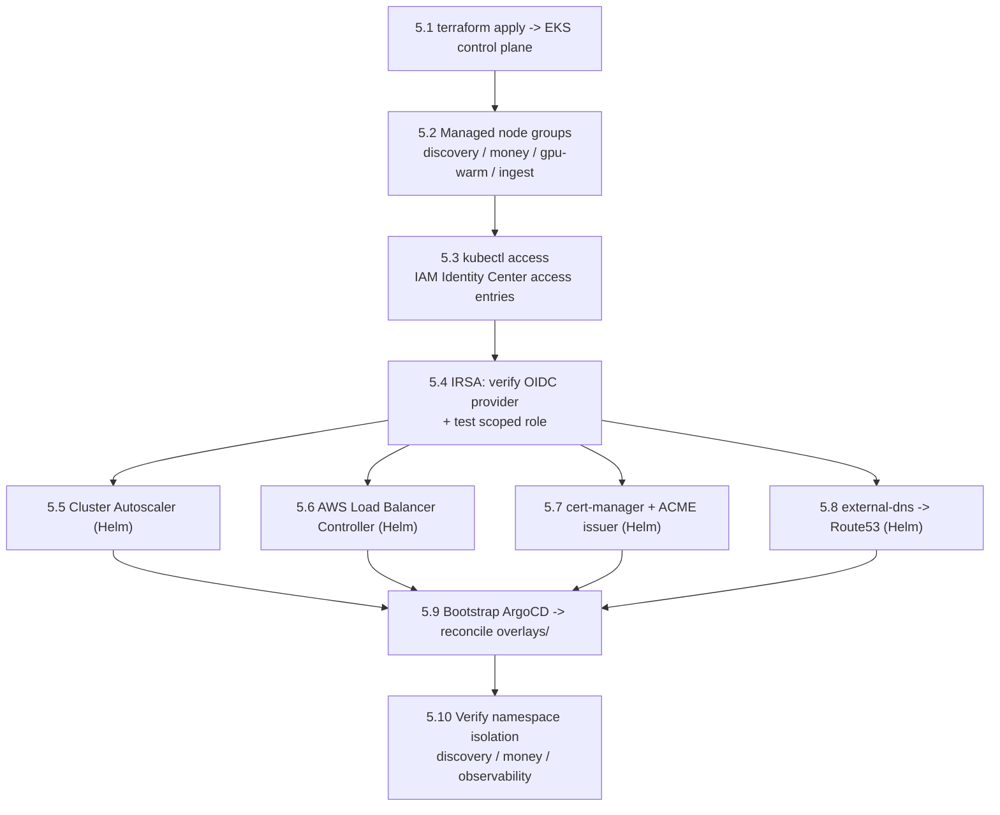

# Chapter 5 — Kubernetes

**Status:** 🟢 Runbook · **Depends on:** [Ch4 — Networking](04-networking.md) (VPC + private-app subnets across ≥3 AZs already applied) · **Blocks:** [Ch6 — Observability](06-observability.md), [Ch7 — CI/CD](07-cicd.md) · **Step format:** all 8 fields per [00-README](00-README.md#step-format-every-step-must-have-all-8).

> **Scope.** Stand up the EKS compute fabric from the empty-but-networked account left by Chapter 4: control plane, the discovery-vs-money node-pool split with a GPU warm floor, IRSA pod identity, human `kubectl` access via IAM Identity Center, the four in-cluster add-ons (autoscaling, ingress, TLS, DNS) via Helm, and ArgoCD reconciling the `overlays/` from the config repo. This chapter *operates* the [`compute` Terraform module](../../../infrastructure/terraform/modules/compute/README.md) and the [`infrastructure/kubernetes`](../../../infrastructure/kubernetes/README.md) charts/overlays; it realizes [09 §3 Compute](../../09-cloud-architecture.md#3-compute) and [ADR-0017](../../adr/ADR-0017-blast-radius-isolation.md) (R-059 discovery/money split, R-078 GPU warm floor, R-060 observability failure domain).
>
> **Conventions.** Placeholders are `<ANGLE_BRACKETS>`, set once in `env.sh` (never committed). Every `apply` is idempotent — a second run **MUST** show no changes. GitOps only: after ArgoCD is live you **MUST NOT** `kubectl apply` workloads to staging/prod ([kubernetes README](../../../infrastructure/kubernetes/README.md) Rules). Add-on chart/image versions **MUST** be pinned (blue-green upgrade matrix, [ADR-0019 R-019](../../09-cloud-architecture.md#eks-upgrade-strategy-adr-0019-r-019)); the `<*_VERSION>` placeholders below are the pins.

## Environment variables (add to `env.sh`)

```bash
export REGION="<REGION>"                         # e.g. us-east-1
export ENV="<ENV>"                               # dev | staging | prod
export NAME_PREFIX="nexus-${ENV}-<REGION_SHORT>" # e.g. nexus-prod-use1
export CLUSTER_NAME="${NAME_PREFIX}"             # module sets cluster name = name_prefix
export ACCOUNT_ID="<WORKLOAD_ACCOUNT_ID>"        # this env's AWS account (Ch2 Control Tower)
export TF_ENV_DIR="infrastructure/terraform/envs/${ENV}"
export SSO_START_URL="<IDENTITY_CENTER_START_URL>"
export SSO_PROFILE="nexus-${ENV}-admin"          # aws CLI SSO profile
export CONFIG_REPO_URL="<CONFIG_REPO_URL>"       # e.g. https://github.com/<ORG>/monorepo.git
export PUBLIC_ZONE_ID="<ROUTE53_PUBLIC_ZONE_ID>"
export CLUSTER_DOMAIN="<ENV>.<DOMAIN>"           # e.g. dev.nexus.example
export ACME_EMAIL="<ACME_CONTACT_EMAIL>"
```

## Provisioning order



> **Why this order.** `kubectl` access (5.3) and IRSA (5.4) are prerequisites for every Helm add-on — the add-ons authenticate to AWS **only** through per-ServiceAccount IRSA roles, never node-wide credentials ([compute README Security notes](../../../infrastructure/terraform/modules/compute/README.md#security-notes)). ArgoCD (5.9) comes last so it reconciles a cluster that already has ingress, TLS, DNS, and autoscaling primitives available to the workloads it deploys.

---

## Step 5.1 — Apply the `compute` module → EKS control plane

**Objective.** Provision the EKS control plane for `<ENV>` in `<REGION>`: private API endpoint, control-plane audit logs, KMS envelope-encrypted secrets, pinned managed add-ons (CNI/CoreDNS/kube-proxy/EBS-CSI), and the IRSA OIDC provider — wired to the Chapter-4 private-app subnets.

**Prerequisites.**
- Chapter 4 complete: the `network` module outputs `app_subnet_ids` spanning ≥3 AZs are in remote state.
- Chapter 3 backend (S3 state + DynamoDB lock) and the GitHub-OIDC deploy role are live; you are authenticated to the deploy role (or, for a manual bootstrap, an admin SSO session).
- The `security` module has emitted `cluster_encryption_kms_key_arn` (a CMK is **REQUIRED** in staging/prod; **MAY** be empty in dev only — [compute README](../../../infrastructure/terraform/modules/compute/README.md#inputs--outputs)).
- `terraform ≥ 1.7`, `aws` CLI v2.

**Commands.**
```bash
# The env root wires the compute module to network/security outputs.
terraform -chdir="${TF_ENV_DIR}" init
terraform -chdir="${TF_ENV_DIR}" plan  -target=module.compute -out=compute.tfplan
terraform -chdir="${TF_ENV_DIR}" apply compute.tfplan
```
The env root **MUST** set, for the compute module: `endpoint_public_access = false` in prod, `cluster_version = "<K8S_VERSION>"` (e.g. `1.30`), the pinned `cluster_addons` map, and `cluster_encryption_kms_key_arn` from the security module. Do **not** pass `node_pools` yet if you are staging the node-group apply separately (Step 5.2); otherwise this step and 5.2 collapse into one apply.

**Expected output.**
```
module.compute.aws_eks_cluster.this: Creation complete after 8m41s [id=nexus-prod-use1]
module.compute.aws_iam_openid_connect_provider.irsa: Creation complete after 1s
Apply complete! Resources: N added, 0 changed, 0 destroyed.
Outputs:
cluster_endpoint  = "https://<HASH>.gr7.<REGION>.eks.amazonaws.com"
oidc_provider_arn = "arn:aws:iam::<ACCOUNT_ID>:oidc-provider/oidc.eks.<REGION>.amazonaws.com/id/<OIDC_ID>"
```

**Verification.**
```bash
aws eks describe-cluster --name "${CLUSTER_NAME}" --region "${REGION}" \
  --query 'cluster.{status:status,version:version,endpointPublicAccess:resourcesVpcConfig.endpointPublicAccess,logs:logging.clusterLogging[0].types,secretsKms:encryptionConfig[0].provider.keyArn}'
```
- `status` **MUST** be `ACTIVE`; `endpointPublicAccess` **MUST** be `false` in prod.
- `logs` **MUST** include `audit` and `authenticator`; `secretsKms` **MUST** be non-null in staging/prod.
- Re-run `terraform ... plan -target=module.compute` → **MUST** report `No changes` (idempotency).

**Rollback.** `terraform -chdir="${TF_ENV_DIR}" destroy -target=module.compute` (tears down control plane, OIDC provider, node role). Safe only before any in-cluster add-on/workload exists; once ArgoCD or data modules reference the cluster SG (`cluster_primary_security_group_id`), unwind those first. State is authoritative — never delete the cluster from the console (leaves state drift).

**Common failure.** `UnsupportedAvailabilityZoneException` or subnet-AZ spread error: `app_subnet_ids` do not cover ≥3 AZs, or include an AZ EKS does not support in `<REGION>`.

**Troubleshooting.** Confirm the network outputs: `terraform -chdir="${TF_ENV_DIR}" output app_subnet_ids` and cross-check each subnet's AZ with `aws ec2 describe-subnets`. If envelope encryption fails with `AccessDeniedException` on the KMS key, the key policy must grant the EKS service and the deploy role `kms:Encrypt/Decrypt/GenerateDataKey*` — fix in the `security` module, not here. API-endpoint-timeout during `describe-cluster` from your workstation is expected with a private endpoint; verify from within the VPC or via SSM (Step 5.3).

---

## Step 5.2 — Provision managed node groups (discovery vs money split + GPU warm floor)

**Objective.** Materialize the `node_pools` map so the blast-radius split is **data, not code** ([ADR-0017 R-059](../../adr/ADR-0017-blast-radius-isolation.md)): a `discovery` pool (elastic, best-effort), an isolated tainted `money` pool (strict-SLO), a tainted `gpu-warm` pool with a **warm floor**, and a `SPOT` `ingest` pool. Taints/labels drive `nodeSelector`/tolerations so a discovery surge cannot starve the money path.

**Prerequisites.** Step 5.1 applied. The env root defines `node_pools`. The following invariants are **MUST**:
- `money.min_size > 0` and `gpu-warm.min_size > 0` — the interactive first-token 1.2 s SLO requires a hot GPU floor ([ADR-0017 R-078](../../adr/ADR-0017-blast-radius-isolation.md), [09 §3 AI/GPU policy](../../09-cloud-architecture.md#3-compute)). **Scale-to-zero (`min_size = 0`) applies only to batch/eval + interruptible ingestion — never the money pool or the interactive GPU path.**
- `money` carries a `NO_SCHEDULE` taint (`pool=money`) so only money-tolerating workloads land there; `gpu-warm` carries the `nvidia.com/gpu=true:NO_SCHEDULE` taint.
- `capacity_type = "SPOT"` only on `ingest`/batch pools.

**Commands.**
```bash
terraform -chdir="${TF_ENV_DIR}" plan  -target=module.compute.aws_eks_node_group.this -out=nodes.tfplan
terraform -chdir="${TF_ENV_DIR}" apply nodes.tfplan
```
Reference `node_pools` shape (env root — [compute README](../../../infrastructure/terraform/modules/compute/README.md#the-pool-split-why-its-config-not-code)):
```hcl
node_pools = {
  money    = { instance_types=["m7g.large"],  desired_size=3, min_size=3, max_size=9,
               labels={ pool="money" },
               taints=[{ key="pool", value="money", effect="NO_SCHEDULE" }] }
  discovery= { instance_types=["c7g.xlarge"], desired_size=3, min_size=2, max_size=40,
               labels={ pool="discovery" } }
  gpu-warm = { instance_types=["g5.xlarge"], ami_type="AL2023_x86_64_NVIDIA",
               desired_size=1, min_size=1, max_size=6,               # warm floor: never 0
               labels={ pool="gpu", workload="inference" },
               taints=[{ key="nvidia.com/gpu", value="true", effect="NO_SCHEDULE" }] }
  ingest   = { instance_types=["m7g.large"], capacity_type="SPOT",
               desired_size=0, min_size=0, max_size=20, labels={ pool="ingest" } }  # batch only
}
```

**Expected output.**
```
module.compute.aws_eks_node_group.this["money"]:     Creation complete [id=nexus-prod-use1:money-...]
module.compute.aws_eks_node_group.this["discovery"]: Creation complete
module.compute.aws_eks_node_group.this["gpu-warm"]:  Creation complete
module.compute.aws_eks_node_group.this["ingest"]:    Creation complete
Apply complete! Resources: 4 added, 0 changed, 0 destroyed.
```

**Verification.** (Requires `kubectl` access — if not yet configured, do Step 5.3 first, then return.)
```bash
kubectl get nodes -L pool,workload,node.kubernetes.io/instance-type
kubectl get nodes -l pool=money -o name | wc -l          # MUST be >= money.min_size (3)
kubectl get nodes -l pool=gpu   -o name | wc -l          # MUST be >= 1 (warm floor)
kubectl describe node -l pool=money | grep -A2 Taints    # MUST show pool=money:NoSchedule
kubectl describe node -l pool=gpu   | grep Taints        # MUST show nvidia.com/gpu=true:NoSchedule
```
- The `money` and `gpu` node counts **MUST** be ≥ their `min_size` at all times.
- A `desired_size` drift plan is expected to show **no change** — the module ignores `desired_size` drift because the autoscaler (Step 5.5) owns it.

**Rollback.** `terraform -chdir="${TF_ENV_DIR}" destroy -target='module.compute.aws_eks_node_group.this["ingest"]'` to drop a single pool, or the whole node-group resource to drop all. For an in-place version change on the money pool, **MUST** use blue-green (stand up a new pool, cordon + drain, retire) — never an in-place upgrade on money ([09 §3 upgrade strategy](../../09-cloud-architecture.md#eks-upgrade-strategy-adr-0019-r-019)).

**Common failure.** GPU pool `NodeCreationFailure`/nodes `NotReady`: the NVIDIA AMI (`AL2023_x86_64_NVIDIA`) came up but the NVIDIA device plugin is not installed, so `nvidia.com/gpu` capacity is `0` and inference pods stay `Pending`.

**Troubleshooting.** For GPU: deploy the NVIDIA device-plugin DaemonSet (tolerating the `nvidia.com/gpu` taint) and confirm `kubectl get nodes -l pool=gpu -o jsonpath='{.items[*].status.allocatable.nvidia\.com/gpu}'` is ≥ 1. For SPOT `ingest` capacity errors (`InsufficientInstanceCapacity`), widen `instance_types` to a mixed-instance set so the pool can diversify across capacity pools. If money pods land on the discovery pool, the workload is missing the `pool=money` toleration — the `nexus-common` chart sets `nodeSelector`+tolerations from `.Values.pool` ([nexus-common README](../../../infrastructure/kubernetes/charts/nexus-common/README.md)); set `pool: money` in the service values.

---

## Step 5.3 — Configure `kubectl` access via IAM Identity Center

**Objective.** Give human operators short-lived, SSO-backed `kubectl` access using EKS **access entries** (API authentication mode) mapped from IAM Identity Center permission-set roles — no long-lived IAM users, no hand-edited `aws-auth` ConfigMap ([09 §10 identity](../../09-cloud-architecture.md#10-cloud-security-posture): "human access via SSO + short-lived roles").

**Prerequisites.** Step 5.1 applied; the cluster's `authentication_mode` includes `API` (module default). IAM Identity Center (Chapter 2) has a permission set (e.g. `<PLATFORM_ADMIN_PERMISSION_SET>`) provisioned into this env's account, giving a role like `arn:aws:iam::<ACCOUNT_ID>:role/aws-reserved/sso.amazonaws.com/<REGION>/AWSReservedSSO_<PERMISSION_SET>_<HASH>`.

**Commands.**
```bash
# 1) Map the SSO permission-set role to a Kubernetes access entry (declare in Terraform ideally).
aws eks create-access-entry --region "${REGION}" --cluster-name "${CLUSTER_NAME}" \
  --principal-arn "arn:aws:iam::${ACCOUNT_ID}:role/aws-reserved/sso.amazonaws.com/${REGION}/<SSO_ROLE_NAME>" \
  --type STANDARD
aws eks associate-access-policy --region "${REGION}" --cluster-name "${CLUSTER_NAME}" \
  --principal-arn "arn:aws:iam::${ACCOUNT_ID}:role/aws-reserved/sso.amazonaws.com/${REGION}/<SSO_ROLE_NAME>" \
  --access-scope type=cluster \
  --policy-arn arn:aws:eks::aws:cluster-access-policy/AmazonEKSClusterAdminPolicy   # scope down per role

# 2) Operator: log in via SSO and write kubeconfig for this cluster.
aws configure sso --profile "${SSO_PROFILE}"     # one-time: SSO start URL + region + account/role
aws sso login --profile "${SSO_PROFILE}"
aws eks update-kubeconfig --region "${REGION}" --name "${CLUSTER_NAME}" \
  --profile "${SSO_PROFILE}" --alias "${CLUSTER_NAME}"
```
For read-only operators (SRE view), associate `AmazonEKSViewPolicy` with `type=namespace` scope instead of cluster-admin — least privilege ([09 §10](../../09-cloud-architecture.md#10-cloud-security-posture)).

**Expected output.**
```
{ "accessEntry": { "principalArn": "...AWSReservedSSO_...", "type": "STANDARD" } }
Successfully logged into Start URL: <IDENTITY_CENTER_START_URL>
Added new context nexus-prod-use1 to <HOME>/.kube/config
```

**Verification.**
```bash
kubectl auth whoami                 # MUST show the SSO-mapped ARN, not an IAM user
kubectl get ns                      # MUST list nexus-* + observability once base is applied
kubectl auth can-i '*' '*' --all-namespaces   # admins: yes; view role: no (expected)
```
With a **private** API endpoint, these calls **MUST** be run from inside the VPC (a bastion / SSM session-manager host or a CI runner in a private-app subnet), not the public internet.

**Rollback.** `aws eks disassociate-access-policy ...` then `aws eks delete-access-entry ...` to revoke a principal. Delete the local context with `kubectl config delete-context "${CLUSTER_NAME}"`.

**Common failure.** `error: You must be logged in to the server (Unauthorized)` — an access entry exists but no access policy is associated, or the caller's assumed role ARN differs from the mapped permission-set role (SSO role ARNs embed a region + hash that vary per account).

**Troubleshooting.** Print the exact caller ARN with `aws sts get-caller-identity --profile "${SSO_PROFILE}"` and confirm it matches the `principal-arn` you mapped (list them with `aws eks list-access-entries --cluster-name "${CLUSTER_NAME}"`). If `update-kubeconfig` succeeds but `kubectl` hangs, it is the private endpoint — establish an SSM port-forward/bastion. Never fall back to editing `aws-auth`; this cluster uses API access entries.

---

## Step 5.4 — Verify the IRSA OIDC provider and mint a test scoped role

**Objective.** Confirm the IRSA OIDC provider (the pod-identity root — **no node-wide credentials**, [compute README](../../../infrastructure/terraform/modules/compute/README.md#what-it-creates)) is trusted by IAM, then prove it end-to-end with a **single, tightly scoped** test role assumed by one test ServiceAccount. Every add-on in 5.5–5.8 depends on this working.

**Prerequisites.** Steps 5.1–5.3. `oidc_provider_arn`/`oidc_provider_url` outputs present. A throwaway S3 bucket or SSM parameter to scope the test role to (use a resource you can delete).

**Commands.**
```bash
# OIDC provider exists and matches the cluster issuer.
ISSUER=$(aws eks describe-cluster --name "${CLUSTER_NAME}" --region "${REGION}" \
  --query 'cluster.identity.oidc.issuer' --output text)
aws iam list-open-id-connect-providers | grep "${ISSUER#https://}"

# Mint a test role trusting ONE SA (system:serviceaccount:default:irsa-test) — declare via the
# `security` module in real use; inline trust policy shown for the smoke test.
cat > /tmp/trust.json <<JSON
{ "Version":"2012-10-17","Statement":[{
  "Effect":"Allow",
  "Principal":{"Federated":"arn:aws:iam::${ACCOUNT_ID}:oidc-provider/${ISSUER#https://}"},
  "Action":"sts:AssumeRoleWithWebIdentity",
  "Condition":{"StringEquals":{
    "${ISSUER#https://}:sub":"system:serviceaccount:default:irsa-test",
    "${ISSUER#https://}:aud":"sts.amazonaws.com"}}}]}
JSON
aws iam create-role --role-name "${NAME_PREFIX}-irsa-test" --assume-role-policy-document file:///tmp/trust.json
aws iam attach-role-policy --role-name "${NAME_PREFIX}-irsa-test" \
  --policy-arn arn:aws:iam::aws:policy/AmazonS3ReadOnlyAccess   # narrow, throwaway scope

# Bind a ServiceAccount + run a pod that calls STS.
kubectl create serviceaccount irsa-test
kubectl annotate serviceaccount irsa-test \
  eks.amazonaws.com/role-arn="arn:aws:iam::${ACCOUNT_ID}:role/${NAME_PREFIX}-irsa-test"
kubectl run irsa-test --rm -it --restart=Never --image=amazon/aws-cli \
  --overrides='{"spec":{"serviceAccountName":"irsa-test"}}' -- sts get-caller-identity
```

**Expected output.**
```
arn:aws:iam::<ACCOUNT_ID>:oidc-provider/oidc.eks.<REGION>.amazonaws.com/id/<OIDC_ID>
{
    "UserId": "AROA...:botocore-session-...",
    "Account": "<ACCOUNT_ID>",
    "Arn": "arn:aws:sts::<ACCOUNT_ID>:assumed-role/nexus-prod-use1-irsa-test/botocore-session-..."
}
```
The pod assumed the role via web-identity — the `Arn` is the **assumed-role** of the test role, proving the SA token was federated.

**Verification.** The `assumed-role` ARN **MUST** match `${NAME_PREFIX}-irsa-test`. Confirm the projected token exists: `kubectl exec` (or the run above) shows `AWS_ROLE_ARN` + `AWS_WEB_IDENTITY_TOKEN_FILE` env injected by the EKS pod-identity webhook. A pod **without** the SA annotation **MUST** fail STS with `Unable to locate credentials` — proving there are no node-wide creds.

**Rollback.** `kubectl delete sa irsa-test`; `aws iam detach-role-policy ... && aws iam delete-role --role-name "${NAME_PREFIX}-irsa-test"`. The OIDC provider itself is owned by the `compute` module — do not delete it here.

**Common failure.** `AccessDenied ... not authorized to perform sts:AssumeRoleWithWebIdentity`: the trust-policy `sub` condition does not exactly match `system:serviceaccount:<namespace>:<sa-name>`, or the `aud` is not `sts.amazonaws.com`.

**Troubleshooting.** Decode the pod's projected token (`cat $AWS_WEB_IDENTITY_TOKEN_FILE` → inspect the `sub`/`aud` claims) and match them character-for-character against the trust condition — a namespace mismatch is the usual culprit. Confirm the OIDC provider thumbprint is current if IAM reports `provider not found`; the module derives it via the `tls` provider, so a re-apply of `module.compute` refreshes it. Real add-on roles **MUST** be minted by the `security` module keyed on `oidc_provider_arn`, not by inline CLI.

---

## Add-on decision — Cluster Autoscaler vs Karpenter (P0.1)

**Decision.** P0.1 **MUST** use the **Cluster Autoscaler (CA)**, not Karpenter.

**Justification.** The blast-radius split lives in the Terraform `node_pools` map as **managed node groups** with per-pool `min/max` floors and taints ([compute README](../../../infrastructure/terraform/modules/compute/README.md#the-pool-split-why-its-config-not-code)); the module deliberately **ignores `desired_size` drift** so an autoscaler owns capacity within those declared bounds. CA is the exact match to that model — it scales the existing managed-node-group ASGs between `min` and `max`, so the discovery/money isolation, the money `min_size` floor, and the **GPU warm floor** are all preserved by construction. Karpenter provisions nodes directly from `NodePool`/`EC2NodeClass` CRDs, **bypassing** managed node groups; adopting it in P0.1 would move the pool split out of Terraform and require re-encoding the money-vs-discovery taint discipline and warm floor as Karpenter CRDs — extra surface, un-rehearsed, on the money path. [09 §3](../../09-cloud-architecture.md#3-compute) and [§7](../../09-cloud-architecture.md#7-scalability--elasticity) explicitly frame Karpenter as a **later staging evaluation** ("**MAY** replace the cluster-autoscaler … evaluate in staging"), not a P0.1 requirement. We therefore ship CA now and leave the Karpenter evaluation to a post-P0.1 spike.

---

## Step 5.5 — Install the Cluster Autoscaler (Helm)

**Objective.** Install CA (IRSA-scoped) so pending pods trigger node scale-up within each pool's `min/max`, and idle nodes scale down — honoring the money/GPU warm floors and scaling `ingest`/batch toward zero when idle.

**Prerequisites.** Steps 5.1–5.4. Node groups are tagged for auto-discovery (`k8s.io/cluster-autoscaler/enabled` + `k8s.io/cluster-autoscaler/${CLUSTER_NAME}` — set by the `compute` module). An IRSA role for CA (`<CA_ROLE_ARN>`) with `autoscaling:Describe*`, `SetDesiredCapacity`, `TerminateInstanceInAutoscalingGroup`, minted by the `security` module. `helm ≥ 3.14`.

**Commands.**
```bash
helm repo add autoscaler https://kubernetes.github.io/autoscaler && helm repo update
helm upgrade --install cluster-autoscaler autoscaler/cluster-autoscaler \
  --namespace kube-system --version "<CA_CHART_VERSION>" \
  --set autoDiscovery.clusterName="${CLUSTER_NAME}" \
  --set awsRegion="${REGION}" \
  --set rbac.serviceAccount.annotations."eks\.amazonaws\.com/role-arn"="<CA_ROLE_ARN>" \
  --set extraArgs.balance-similar-node-groups=true \
  --set extraArgs.skip-nodes-with-system-pods=false \
  --set 'extraArgs.scale-down-utilization-threshold=0.5'
```

**Expected output.**
```
Release "cluster-autoscaler" has been upgraded. Happy Helming!
NAME: cluster-autoscaler ... STATUS: deployed
```

**Verification.**
```bash
kubectl -n kube-system rollout status deploy/cluster-autoscaler
kubectl -n kube-system logs deploy/cluster-autoscaler | grep -i "Registered.*node group"
```
- Logs **MUST** list all four node groups with their `min/max`.
- The money and gpu-warm groups' reported `min` **MUST** match their `min_size` (>0) — CA **MUST NOT** scale them below the warm floor.
- Smoke test: `kubectl scale deploy <TEST_DEPLOY> --replicas=50` on the discovery pool → CA adds nodes toward `discovery.max_size`; scale back → nodes drain (never below `min`).

**Rollback.** `helm uninstall cluster-autoscaler -n kube-system`. Node counts freeze at current `desired`; capacity is still safe because Terraform floors (`min_size`) hold.

**Common failure.** CA pod `CrashLoopBackOff` with `AccessDenied` on `autoscaling:SetDesiredCapacity` — the IRSA role is missing the ASG write permissions, or the SA annotation is wrong.

**Troubleshooting.** Verify the SA annotation (`kubectl -n kube-system get sa cluster-autoscaler -o yaml | grep role-arn`) and the role's inline policy. If CA logs `Failed to find any node groups`, the node-group ASGs lack the auto-discovery tags — confirm on the ASG (`aws autoscaling describe-auto-scaling-groups`) and re-apply `module.compute`. If nodes are added but pods stay `Pending`, the pods lack the pool toleration (money/GPU are tainted) — not a CA fault.

---

## Step 5.6 — Install the AWS Load Balancer Controller (Ingress)

**Objective.** Install the AWS Load Balancer Controller so `Ingress` objects provision internet-facing ALBs and `Service type=LoadBalancer` provisions NLBs — the ingress data path for `nexus-common` services (which allow ingress from `ingress-nginx`/the LB namespace by default, [nexus-common values](../../../infrastructure/kubernetes/charts/nexus-common/values.yaml)).

**Prerequisites.** Steps 5.1–5.4. Public + private-app subnets tagged for ELB discovery (`kubernetes.io/role/elb` on public, `kubernetes.io/role/internal-elb` on private-app — set by the `network` module in Chapter 4). An IRSA role `<ALB_ROLE_ARN>` bound to the [AWS-published LBC IAM policy](../../../infrastructure/terraform/modules/compute/README.md). `helm ≥ 3.14`.

**Commands.**
```bash
helm repo add eks https://aws.github.io/eks-charts && helm repo update
helm upgrade --install aws-load-balancer-controller eks/aws-load-balancer-controller \
  --namespace kube-system --version "<ALB_CHART_VERSION>" \
  --set clusterName="${CLUSTER_NAME}" \
  --set region="${REGION}" \
  --set vpcId="<VPC_ID>" \
  --set serviceAccount.create=true \
  --set serviceAccount.name=aws-load-balancer-controller \
  --set serviceAccount.annotations."eks\.amazonaws\.com/role-arn"="<ALB_ROLE_ARN>"
```

**Expected output.**
```
NAME: aws-load-balancer-controller ... STATUS: deployed
```

**Verification.**
```bash
kubectl -n kube-system rollout status deploy/aws-load-balancer-controller
kubectl get crd | grep -E 'ingressclassparams|targetgroupbindings'   # CRDs installed
kubectl -n kube-system logs deploy/aws-load-balancer-controller | grep -i "successfully"
```
Functional check: apply a throwaway `Ingress` with `ingressClassName: alb` and `alb.ingress.kubernetes.io/scheme: internet-facing`; an ALB **MUST** appear (`aws elbv2 describe-load-balancers`) and the `Ingress` gets an `ADDRESS`. Delete the test Ingress → the ALB **MUST** be de-provisioned.

**Rollback.** `helm uninstall aws-load-balancer-controller -n kube-system`. Any ALBs created from existing Ingresses become orphaned — delete the Ingress objects first so the controller garbage-collects the ALBs before uninstalling.

**Common failure.** Ingress created but no ALB, controller logs `couldn't auto-discover subnets`: the VPC subnets are missing the `kubernetes.io/role/elb` / `internal-elb` tags, or `<VPC_ID>` is wrong.

**Troubleshooting.** Confirm subnet tags (`aws ec2 describe-subnets --filters Name=vpc-id,Values=<VPC_ID> --query 'Subnets[].Tags'`). For `AccessDenied` on `elasticloadbalancing:*`, the IRSA policy is stale versus the chart version — re-pull the AWS LBC IAM policy for `<ALB_CHART_VERSION>` and update the `security` module. Webhook `x509` errors right after install usually resolve once cert-manager (Step 5.7) or the controller's self-signed webhook cert is ready — re-check after a minute.

---

## Step 5.7 — Install cert-manager + ACME (Let's Encrypt) issuer

**Objective.** Install cert-manager and a cluster-wide ACME `ClusterIssuer` (Let's Encrypt) that issues/renews TLS certificates via DNS-01 against Route 53, so ingress hostnames get automatically-rotated certs.

**Prerequisites.** Steps 5.1–5.4 and 5.8 DNS control (DNS-01 needs Route 53 write). An IRSA role `<CERTMGR_ROLE_ARN>` scoped to `route53:GetChange`, `route53:ChangeResourceRecordSets` on `<PUBLIC_ZONE_ID>`, and `route53:ListHostedZonesByName`. `helm ≥ 3.14`.

**Commands.**
```bash
helm repo add jetstack https://charts.jetstack.io && helm repo update
helm upgrade --install cert-manager jetstack/cert-manager \
  --namespace cert-manager --create-namespace --version "<CERTMANAGER_CHART_VERSION>" \
  --set crds.enabled=true \
  --set serviceAccount.annotations."eks\.amazonaws\.com/role-arn"="<CERTMGR_ROLE_ARN>"

# Start with the STAGING ACME endpoint to avoid Let's Encrypt rate limits, then switch to prod.
cat <<YAML | kubectl apply -f -
apiVersion: cert-manager.io/v1
kind: ClusterIssuer
metadata:
  name: letsencrypt-staging
spec:
  acme:
    server: https://acme-staging-v02.api.letsencrypt.org/directory
    email: ${ACME_EMAIL}
    privateKeySecretRef: { name: letsencrypt-staging-account }
    solvers:
      - dns01:
          route53:
            region: ${REGION}
            hostedZoneID: ${PUBLIC_ZONE_ID}
YAML
```
After validation succeeds, apply an identical `letsencrypt-prod` `ClusterIssuer` pointing at `https://acme-v02.api.letsencrypt.org/directory`, and reference it via the `cert-manager.io/cluster-issuer: letsencrypt-prod` annotation on Ingresses.

**Expected output.**
```
NAME: cert-manager ... STATUS: deployed
clusterissuer.cert-manager.io/letsencrypt-staging created
```

**Verification.**
```bash
kubectl -n cert-manager rollout status deploy/cert-manager deploy/cert-manager-webhook
kubectl get clusterissuer letsencrypt-staging -o jsonpath='{.status.conditions[0].type}'  # Ready
# Issue a real cert for a test host, then inspect:
kubectl describe certificate <TEST_CERT> | grep -E 'Status|Message'   # "Certificate is up to date and has not expired"
```

**Rollback.** `kubectl delete clusterissuer letsencrypt-staging letsencrypt-prod`; `helm uninstall cert-manager -n cert-manager`. CRDs persist unless explicitly deleted — leave them if any `Certificate` is still in use, or you will orphan issued certs.

**Common failure.** `Certificate` stuck `False/Pending` with DNS-01 `presenting challenge`: cert-manager cannot write the `_acme-challenge` TXT record — the IRSA role lacks `route53:ChangeResourceRecordSets` on `<PUBLIC_ZONE_ID>`, or the zone id is wrong.

**Troubleshooting.** `kubectl describe challenge` shows the exact ACME error. Confirm the role can write the zone: `aws route53 test-dns-answer` and the role trust `sub` = `system:serviceaccount:cert-manager:cert-manager`. If you hit Let's Encrypt `too many certificates already issued`, you skipped staging — stay on `letsencrypt-staging` until issuance is green, then cut to prod. Webhook `connection refused` on `ClusterIssuer` apply means the cert-manager webhook is not ready yet — retry after `rollout status` is complete.

---

## Step 5.8 — Install external-dns (Route 53)

**Objective.** Install external-dns so `Ingress`/`Service` hostnames are automatically published as Route 53 records in the public zone — no manual DNS. This closes the loop with cert-manager (5.7) and the LBC (5.6): a new Ingress gets an ALB, a DNS record, and a TLS cert with no manual steps.

**Prerequisites.** Steps 5.1–5.4, 5.6 (LBC creates the ALB external-dns points at). An IRSA role `<EXTERNALDNS_ROLE_ARN>` scoped to `route53:ChangeResourceRecordSets` on `<PUBLIC_ZONE_ID>` + `route53:ListHostedZones`/`ListResourceRecordSets`. A `txtOwnerId` unique to this cluster so records are not cross-managed between clusters. `helm ≥ 3.14`.

**Commands.**
```bash
helm repo add external-dns https://kubernetes-sigs.github.io/external-dns && helm repo update
helm upgrade --install external-dns external-dns/external-dns \
  --namespace external-dns --create-namespace --version "<EXTERNALDNS_CHART_VERSION>" \
  --set provider=aws \
  --set aws.region="${REGION}" \
  --set policy=sync \
  --set registry=txt \
  --set txtOwnerId="${CLUSTER_NAME}" \
  --set domainFilters="{${CLUSTER_DOMAIN}}" \
  --set 'zoneIdFilters={'"${PUBLIC_ZONE_ID}"'}' \
  --set serviceAccount.annotations."eks\.amazonaws\.com/role-arn"="<EXTERNALDNS_ROLE_ARN>"
```
`policy=sync` (not `upsert-only`) lets external-dns delete records it owns when the Ingress is removed; the `txt` registry + `txtOwnerId` ensure only records this cluster created are ever modified.

**Expected output.**
```
NAME: external-dns ... STATUS: deployed
```

**Verification.**
```bash
kubectl -n external-dns rollout status deploy/external-dns
kubectl -n external-dns logs deploy/external-dns | grep -iE "CREATE|UPDATE|records"
# After a test Ingress with host <APP>.<CLUSTER_DOMAIN> exists:
dig +short <APP>.${CLUSTER_DOMAIN}          # MUST resolve to the ALB
aws route53 list-resource-record-sets --hosted-zone-id "${PUBLIC_ZONE_ID}" \
  --query "ResourceRecordSets[?contains(Name, '${CLUSTER_DOMAIN}')]"
```
Each managed record **MUST** be accompanied by a companion `TXT` ownership record whose value contains `external-dns/owner=${CLUSTER_NAME}`.

**Rollback.** `helm uninstall external-dns -n external-dns`. With `policy=sync`, delete the app Ingresses **first** so external-dns removes their records; otherwise records are left orphaned in Route 53 (safe to remove manually, matching the `TXT` owner tag).

**Common failure.** Records never created, logs show `no endpoints` or `zone not found`: the `domainFilters`/`zoneIdFilters` do not match the Ingress hostnames or the zone, so external-dns ignores them.

**Troubleshooting.** Confirm the Ingress host is under `<CLUSTER_DOMAIN>` and the zone id is the **public** zone (not a private zone). For `AccessDenied` on `route53:ChangeResourceRecordSets`, fix the IRSA policy resource scope to `arn:aws:route53:::hostedzone/<PUBLIC_ZONE_ID>`. If two clusters fight over a record, their `txtOwnerId` values collide — they **MUST** be distinct per cluster.

---

## Step 5.9 — Bootstrap ArgoCD and reconcile `overlays/`

**Objective.** Install ArgoCD and point it at the config repo so it **pulls** desired state and reconciles the per-env `overlays/` — the namespaces `base/` plus the `platform-hello` canary Application. From here, workload delivery is GitOps: CI never holds cluster credentials, and staging/prod are **not** mutated by `kubectl apply` ([overlays README](../../../infrastructure/kubernetes/overlays/README.md), [09 §—GitOps](../../09-cloud-architecture.md#3-compute)).

**Prerequisites.** Steps 5.1–5.8. The config repo (`<CONFIG_REPO_URL>`) contains `infrastructure/kubernetes/{base,overlays}` with `repoURL`/ECR placeholders wired to real values ([overlays README](../../../infrastructure/kubernetes/overlays/README.md)). A read-only deploy key / GitHub App credential for ArgoCD to pull. `helm ≥ 3.14`.

**Commands.**
```bash
# 1) Install ArgoCD (+ Argo Rollouts is a separate chart, out of scope here).
helm repo add argo https://argoproj.github.io/argo-helm && helm repo update
helm upgrade --install argocd argo/argo-cd \
  --namespace argocd --create-namespace --version "<ARGOCD_CHART_VERSION>" \
  --set configs.params."server\.insecure"=false

# 2) Register the config repo (prefer `argocd` CLI or a sealed repo Secret; never a plaintext PAT in Git).
argocd login <ARGOCD_SERVER> --sso
argocd repo add "${CONFIG_REPO_URL}" --github-app-id <APP_ID> --github-app-private-key-path <KEY_PATH>

# 3) Apply the env's AppProject + Applications (self-bootstrap: this is the ONLY direct apply).
kubectl apply -f "infrastructure/kubernetes/overlays/${ENV}/argocd-application.yaml"
```
The env overlay encodes the sync policy: **dev** auto-syncs + self-heals; **staging** auto-syncs on digest-pinned RCs; **prod** has **no `automated:` block** — promotion is a manual approval gate ([prod argocd-application.yaml](../../../infrastructure/kubernetes/overlays/prod/argocd-application.yaml), [overlays README](../../../infrastructure/kubernetes/overlays/README.md)).

**Expected output.**
```
NAME: argocd ... STATUS: deployed
appproject.argoproj.io/nexus-<ENV> created
application.argoproj.io/nexus-namespaces-<ENV> created
application.argoproj.io/platform-hello-<ENV> created
```

**Verification.**
```bash
kubectl -n argocd rollout status deploy/argocd-server deploy/argocd-repo-server
argocd app list                                   # nexus-namespaces-<ENV>, platform-hello-<ENV>
argocd app get nexus-namespaces-${ENV} --refresh  # Health: Healthy, Sync: Synced
kubectl get ns nexus-platform nexus-discovery nexus-money observability
```
- In **dev/staging**, both Applications **MUST** reach `Synced/Healthy` automatically.
- In **prod**, Applications appear `OutOfSync` until an operator initiates a manual sync — this is intended (self-heal off so drift is reviewed, [prod argocd-application.yaml](../../../infrastructure/kubernetes/overlays/prod/argocd-application.yaml)).

**Rollback.** `kubectl delete -f "infrastructure/kubernetes/overlays/${ENV}/argocd-application.yaml"` (the `resources-finalizer` prunes managed objects); then `helm uninstall argocd -n argocd`. In prod, suspend a bad sync via the scoped break-glass (disable self-heal / `argocd app set --sync-policy none`) rather than deleting.

**Common failure.** `ComparisonError: rpc error ... repository not accessible`: ArgoCD cannot read `<CONFIG_REPO_URL>` — the repo credential is missing/expired, or `repoURL` in the Application still points at the placeholder `https://github.com/nexus/monorepo.git`.

**Troubleshooting.** `argocd repo list` to confirm the repo is connected `Successful`. Wire the placeholder `repoURL`/ECR ids to real values ([overlays README](../../../infrastructure/kubernetes/overlays/README.md)). If `platform-hello-<ENV>` is `Synced` but pods `ImagePullBackOff`, the ECR digest/tag placeholder was not replaced (`sha256:0000...` in the prod Application) — pin a real digest ([nexus-common fail-closed](../../../infrastructure/kubernetes/charts/nexus-common/README.md#fail-closed-behavior): no `:latest`). If namespaces don't appear, check the `nexus-namespaces-<ENV>` Application `path` resolves to `infrastructure/kubernetes/base`.

---

## Step 5.10 — Verify namespace isolation (discovery / money / observability)

**Objective.** Prove the blast-radius separation is real end-to-end: the four namespaces exist with the correct pool labels and PodSecurity `restricted`; money-labeled workloads schedule **only** on the tainted money pool; and the default-deny NetworkPolicy blocks cross-namespace traffic except the explicitly-allowed paths ([ADR-0017 R-059/R-060](../../adr/ADR-0017-blast-radius-isolation.md), [base namespaces.yaml](../../../infrastructure/kubernetes/base/namespaces.yaml), [nexus-common README](../../../infrastructure/kubernetes/charts/nexus-common/README.md)).

**Prerequisites.** Step 5.9 synced the `base/` namespaces. A CNI that enforces `NetworkPolicy` (Cilium/Calico) is installed ([nexus-common README](../../../infrastructure/kubernetes/charts/nexus-common/README.md) dependencies). `kubectl` access.

**Commands.**
```bash
# 1) Namespaces + labels + PodSecurity enforcement.
kubectl get ns nexus-platform nexus-discovery nexus-money observability \
  -L nexus.io/pool,nexus.io/data-sensitivity,pod-security.kubernetes.io/enforce

# 2) Scheduling isolation: a money-tolerating pod lands on a money node; a discovery pod cannot.
kubectl -n nexus-money  get pods -o wide     # nodes MUST all carry pool=money
kubectl -n nexus-discovery get pods -o wide  # nodes MUST all carry pool=discovery (never money)

# 3) Default-deny: an ad-hoc pod in discovery MUST NOT reach a money Service.
kubectl -n nexus-discovery run probe --rm -it --restart=Never --image=busybox -- \
  wget -T4 -qO- http://<MONEY_SVC>.nexus-money.svc.cluster.local:8080/healthz   # MUST time out
```

**Expected output.**
```
NAME              POOL        DATA-SENSITIVITY   ENFORCE
nexus-platform    platform                       restricted
nexus-discovery   discovery                      restricted
nexus-money       money       high               restricted
observability     <none>                         restricted
...
wget: download timed out            # cross-namespace call blocked by default-deny NetworkPolicy
```

**Verification.**
- All four namespaces present; `nexus-money` carries `data-sensitivity=high`; every workload namespace enforces `restricted` ([base namespaces.yaml](../../../infrastructure/kubernetes/base/namespaces.yaml)).
- Money pods **MUST** run only on `pool=money` nodes; discovery pods never on money nodes.
- The discovery→money probe **MUST** fail (default-deny). The allowed paths (DNS, OTel export to `observability`, metrics scrape, same-namespace) **MUST** still work — confirm a service still exports traces to `otel-collector.observability` ([nexus-common values `otel.endpoint`](../../../infrastructure/kubernetes/charts/nexus-common/values.yaml)).
- **observability autonomy (R-060):** the observability namespace/stack **MUST NOT** depend on the workload namespaces to serve — verify no NetworkPolicy or readiness gate makes `observability` require `nexus-*` to be up.

**Rollback.** Isolation is declarative (owned by ArgoCD). To revert a bad NetworkPolicy change, revert the commit in the config repo and let ArgoCD reconcile (dev/staging) or manual-sync (prod) — do **not** hand-edit policies in-cluster (drift). Deleting a namespace deletes its workloads — treat as destructive.

**Common failure.** The discovery→money probe **succeeds** (traffic not blocked): the CNI in use does not enforce `NetworkPolicy` (e.g. default VPC-CNI without a network-policy engine), so the default-deny is silently a no-op.

**Troubleshooting.** Confirm the network-policy engine is active (`kubectl get pods -n kube-system | grep -E 'cilium|calico'`) and that EKS VPC-CNI network-policy is enabled if you rely on it. Check the rendered policy exists: `kubectl -n nexus-money get networkpolicy` — the `nexus-common` chart renders a default-deny per workload ([nexus-common README](../../../infrastructure/kubernetes/charts/nexus-common/README.md)). If money pods land on discovery nodes, the workload's `.Values.pool` is not `money` (missing nodeSelector/toleration). If a PodSecurity `restricted` violation blocks a pod, the container is not honoring the hardened securityContext (non-root, read-only-FS, drop-ALL) — fix the image/values, do not relax the namespace label.

---

## Exit criteria for Chapter 5

- [ ] EKS control plane `ACTIVE`; private endpoint in prod; audit logs + KMS secret encryption on (5.1).
- [ ] Discovery / money / gpu-warm / ingest node groups present; money + gpu-warm at their warm floors (>0); scale-to-zero only on ingest/batch (5.2).
- [ ] `kubectl` access is SSO-backed via IAM Identity Center access entries; no long-lived IAM users (5.3).
- [ ] IRSA OIDC provider trusted; a scoped test role assumed by a ServiceAccount; no node-wide creds (5.4).
- [ ] Cluster Autoscaler, AWS Load Balancer Controller, cert-manager (+ACME issuer), external-dns installed via Helm, each IRSA-scoped, versions pinned (5.5–5.8).
- [ ] ArgoCD reconciling `overlays/${ENV}` from the config repo; dev/staging auto-synced, prod manual-gated (5.9).
- [ ] Namespace isolation verified: pool labels, PodSecurity `restricted`, scheduling split, default-deny cross-namespace, observability autonomy (5.10).

*Next: [Chapter 6 — Observability](06-observability.md) — OpenTelemetry, Prometheus, Grafana, Loki, Tempo in the separate failure domain.*
