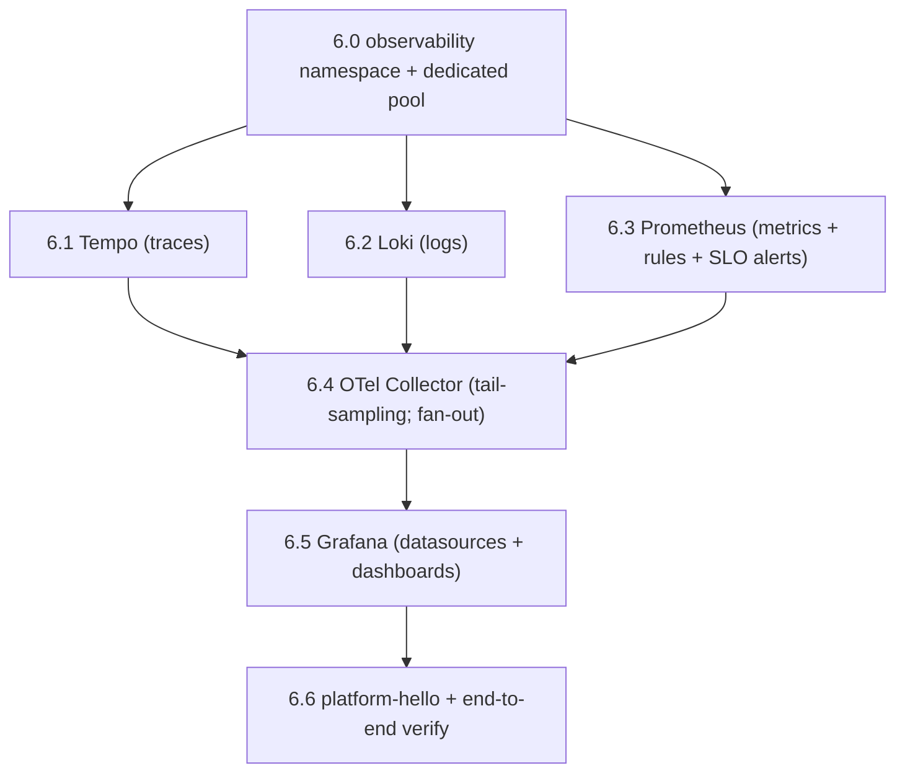

# Chapter 6 — Observability

**Status:** 🟢 Runbook · **Scope:** stand up the NEXUS observability stack — **OpenTelemetry Collector, Prometheus, Grafana, Loki, Tempo** — in its **own failure domain**, then deploy [`platform-hello`](../../../services/platform-hello/README.md) and prove the pipeline end-to-end (one request → **trace in Tempo**, **metrics scraped by Prometheus**, **logs in Loki**, **golden-signals dashboard renders**). **Prerequisite:** Chapter 5 (Kubernetes) is applied — EKS, node groups, IRSA, ingress, cert-manager, external-dns are up. **Do NOT proceed to Chapter 7 (CI/CD) until every step in this chapter verifies.**

> This chapter *operates* the skeleton configs in [`infrastructure/monitoring/`](../../../infrastructure/monitoring/README.md) and satisfies **NFR-OBS-01** (100% tracing of user-facing paths) and [ADR-0010](../../adr/ADR-0010-platform-principles.md) #5 (health) / #6 (metrics). SLO/alerting *policy* is defined in [docs/09 §11](../../09-cloud-architecture.md) and the deployment architecture. Every step follows the fixed 8-field format of [00-README](./00-README.md).

---

## The one non-negotiable: a SEPARATE failure domain (ADR-0017 R-060)

This stack MUST run in its **own failure domain, off the critical path** ([ADR-0017 R-060](../../adr/ADR-0017-blast-radius-isolation.md), [docs/09 §11](../../09-cloud-architecture.md)). Workloads only **export** telemetry to it; it **never** depends on the workloads it watches. This breaks the **autoscaling circular dependency**: the HPA/KEDA control loop that scales the app consumes metrics *from* this domain, so if this domain depended on the app being up, a workload outage would blind the very autoscaler meant to recover it.

Operationally this means:

- The stack MUST run on a **dedicated node pool** (`<OBS_NODE_POOL>`, taint `dedicated=observability:NoSchedule`) or a dedicated cluster, **not** on the elastic discovery/money pools it observes.
- The observability control plane MUST NOT be a client of the app's ingress, service mesh sidecars, or the app-tier autoscaler. Its own scaling MUST use static replica counts or resource-based HPA that reads **its own** Prometheus, never the workload SLIs.
- Backends fail **safe**: if a backend is down the Collector buffers then drops to `debug` rather than backpressuring the app.

## Deploy order (dependency-correct)



Backends (Tempo, Loki, Prometheus) come up **before** the Collector, because the Collector's exporters open connections to them on start. Grafana comes up after Prometheus/Tempo/Loki exist as datasource targets. `platform-hello` is last — it is the workload whose single request lights up the whole pipeline.

## Conventions

- **Placeholders** in `<ANGLE_BRACKETS>` — set once in `env.sh` (never committed): `<OBS_NODE_POOL>`, `<REGION>`, `<CHART_VERSION_*>`, `<GRAFANA_HOST>`, `<GRAFANA_ADMIN_SECRET_ARN>`.
- **Namespace:** everything in this chapter lands in the `observability` namespace; `platform-hello` lands in `nexus-platform`.
- **Config source of truth:** the YAML/JSON under [`infrastructure/monitoring/`](../../../infrastructure/monitoring/README.md) is loaded as ConfigMaps; Helm values only wire replicas, storage, and the dedicated pool. Editing behavior means editing those files and re-templating — **never** click-ops.
- **RFC-2119** keywords (MUST/SHOULD/MAY) are normative.
- **Idempotency:** every `helm upgrade --install` is safe to re-run; a second run MUST report `has been upgraded` with no resource churn.
- **Rollback is mandatory** — every step documents its undo.

---

## Step 6.0 — Create the observability failure domain (namespace + dedicated pool)

**Objective.** Create the `observability` namespace and confirm the dedicated, tainted node pool from Chapter 5 exists, so the entire stack schedules **off** the workload pools and cannot form an autoscaling circular dependency (ADR-0017 R-060).

**Prerequisites.**
- Chapter 5 applied: `kubectl` context points at the workload/observability EKS cluster; the `<OBS_NODE_POOL>` node group exists with taint `dedicated=observability:NoSchedule` and label `nexus.io/pool=observability`.
- `helm` ≥ 3.14, `kubectl` ≥ 1.29 on the operator workstation.
- Grafana chart repos reachable; `<REGION>`, `<OBS_NODE_POOL>` set in `env.sh`.

**Commands.**
```bash
source ./env.sh
# Namespace with pod-security + a label the NetworkPolicies key on.
kubectl create namespace observability --dry-run=client -o yaml | kubectl apply -f -
kubectl label namespace observability \
  pod-security.kubernetes.io/enforce=restricted \
  nexus.io/failure-domain=observability --overwrite

# The dedicated pool MUST already exist (Chapter 5). Confirm, do not create here.
kubectl get nodes -l nexus.io/pool=observability \
  -o custom-columns=NODE:.metadata.name,TAINTS:.spec.taints

helm repo add grafana https://grafana.github.io/helm-charts
helm repo add prometheus-community https://prometheus-community.github.io/helm-charts
helm repo add open-telemetry https://open-telemetry.github.io/opentelemetry-helm-charts
helm repo update
```

**Expected output.**
```
namespace/observability created
namespace/observability labeled
NODE                              TAINTS
ip-10-0-...   [map[effect:NoSchedule key:dedicated value:observability]]
...Update Complete. ⎈Happy Helming!⎈
```

**Verification.**
```bash
kubectl get ns observability -o jsonpath='{.metadata.labels.nexus\.io/failure-domain}'; echo
# => observability
test "$(kubectl get nodes -l nexus.io/pool=observability --no-headers | wc -l)" -ge 2 \
  && echo "OK: >=2 dedicated nodes"
```
The namespace MUST carry the `failure-domain=observability` label and there MUST be ≥ 2 dedicated nodes (HA; the stack is HA and independent per [docs/09 §11](../../09-cloud-architecture.md)).

**Rollback.**
```bash
kubectl delete namespace observability   # removes everything created in this chapter
```
The node pool is owned by Chapter 5 Terraform; do **not** delete it here.

**Common failure.** No nodes match `nexus.io/pool=observability` — the observability pool was not provisioned in Chapter 5, so every pod below would land on a workload pool and reintroduce the circular dependency ADR-0017 forbids.

**Troubleshooting.** Re-run the Chapter 5 node-group apply for `<OBS_NODE_POOL>`; confirm the label/taint in the node-group `labels`/`taints` block. If nodes exist but are `NotReady`, check the CNI and the `dedicated` taint toleration on the CNI DaemonSet. Until `kubectl get nodes -l nexus.io/pool=observability` returns Ready nodes, do not proceed.

---

## Step 6.1 — Deploy Tempo (trace store)

**Objective.** Stand up Tempo as the OTLP trace backend with the `metrics_generator` remote-writing RED/service-graph metrics + exemplars to Prometheus, so traces later enrich the golden-signals dashboard.

**Prerequisites.** Step 6.0 done. The config [`infrastructure/monitoring/tempo/tempo-config.yaml`](../../../infrastructure/monitoring/tempo/tempo-config.yaml) is the source of truth (single-binary skeleton; prod swaps `backend: local` → `s3`).

**Commands.**
```bash
kubectl -n observability create configmap tempo-config \
  --from-file=tempo.yaml=infrastructure/monitoring/tempo/tempo-config.yaml \
  --dry-run=client -o yaml | kubectl apply -f -

helm upgrade --install tempo grafana/tempo \
  --namespace observability --version <CHART_VERSION_TEMPO> \
  --set tempo.reportingEnabled=false \
  --set-json 'tolerations=[{"key":"dedicated","operator":"Equal","value":"observability","effect":"NoSchedule"}]' \
  --set-json 'nodeSelector={"nexus.io/pool":"observability"}' \
  --set 'persistence.enabled=true' \
  --set 'server.grpc_listen_port=9096'
# The chart's config is overridden by the ConfigMap above; mount tempo-config as /conf/tempo.yaml
# via --set-file or the chart's `tempo.configMap` hook per <CHART_VERSION_TEMPO>.

kubectl -n observability rollout status statefulset/tempo --timeout=180s
```

**Expected output.**
```
configmap/tempo-config configured
Release "tempo" has been upgraded. Happy Helming!
statefulset rolling update complete 1 pods ready...
```

**Verification.**
```bash
kubectl -n observability get pod -l app.kubernetes.io/name=tempo \
  -o jsonpath='{.items[0].spec.nodeSelector}'; echo   # => {"nexus.io/pool":"observability"}
# Tempo readiness endpoint on :3200
kubectl -n observability port-forward svc/tempo 3200:3200 >/dev/null 2>&1 &
sleep 2; curl -fsS http://localhost:3200/ready ; echo   # => ready
curl -fsS http://localhost:3200/status/services | grep -q Running && echo "OK: services Running"
```
Tempo MUST be pinned to the observability pool and report `ready`.

**Rollback.**
```bash
helm uninstall tempo -n observability
kubectl -n observability delete configmap tempo-config
```

**Common failure.** Pod `Pending` with `untolerated taint dedicated=observability` — the tolerations/nodeSelector flags were dropped, so Tempo cannot land on the only pool it is allowed on.

**Troubleshooting.** `kubectl -n observability describe pod -l app.kubernetes.io/name=tempo` and read the `Events` — a taint mismatch shows as `FailedScheduling`. Confirm the two `--set-json` toleration/nodeSelector flags were applied (`helm get values tempo -n observability`). If `/ready` 503s past 180 s, check the WAL PVC bound (`kubectl -n observability get pvc`) and the `storage.trace.local.path` is writable.

---

## Step 6.2 — Deploy Loki (log aggregation)

**Objective.** Stand up Loki as the OTLP-native log store with `allow_structured_metadata: true`, so `trace_id`/`span_id` on log records survive as queryable metadata and drive logs↔traces correlation.

**Prerequisites.** Step 6.0 done. Config [`infrastructure/monitoring/loki/loki-config.yaml`](../../../infrastructure/monitoring/loki/loki-config.yaml) (single-target, filesystem, RF=1 skeleton; prod = simple-scalable on S3, RF≥3).

**Commands.**
```bash
kubectl -n observability create configmap loki-config \
  --from-file=config.yaml=infrastructure/monitoring/loki/loki-config.yaml \
  --dry-run=client -o yaml | kubectl apply -f -

helm upgrade --install loki grafana/loki \
  --namespace observability --version <CHART_VERSION_LOKI> \
  --set 'deploymentMode=SingleBinary' \
  --set 'loki.auth_enabled=false' \
  --set 'singleBinary.replicas=1' \
  --set-json 'singleBinary.tolerations=[{"key":"dedicated","operator":"Equal","value":"observability","effect":"NoSchedule"}]' \
  --set-json 'singleBinary.nodeSelector={"nexus.io/pool":"observability"}' \
  --set 'loki.commonConfig.replication_factor=1' \
  --set 'loki.storage.type=filesystem' \
  --set 'test.enabled=false' --set 'lokiCanary.enabled=false'
# Mount the ConfigMap above as the authoritative config (chart `loki.existingConfigMap`
# or extraVolumes) per <CHART_VERSION_LOKI>.

kubectl -n observability rollout status statefulset/loki --timeout=180s
```

**Expected output.**
```
configmap/loki-config configured
Release "loki" has been upgraded. Happy Helming!
statefulset rolling update complete 1 pods ready...
```

**Verification.**
```bash
kubectl -n observability port-forward svc/loki 3100:3100 >/dev/null 2>&1 &
sleep 2
curl -fsS http://localhost:3100/ready ; echo               # => ready
curl -fsS http://localhost:3100/metrics | grep -c '^loki_' # => >0 (Loki exposes its own /metrics)
# Confirm the OTLP ingest path exists (the Collector will POST here).
curl -s -o /dev/null -w '%{http_code}\n' http://localhost:3100/otlp/v1/logs # => 405/400 (path present, GET not allowed)
```
Loki MUST report `ready` and expose the `/otlp` ingest path.

**Rollback.**
```bash
helm uninstall loki -n observability
kubectl -n observability delete configmap loki-config
```

**Common failure.** `too many outstanding requests` or `structured metadata … disabled` when the Collector later ships logs — the chart's default config won this over the ConfigMap, so `allow_structured_metadata` is off and trace correlation silently breaks.

**Troubleshooting.** Confirm the running config is ours: `kubectl -n observability exec sts/loki -- cat /etc/loki/config/config.yaml | grep allow_structured_metadata` MUST print `true`. If the chart injected its own config, set `loki.existingConfigMap=loki-config` (or the chart-version equivalent) and re-upgrade. For `/ready` stuck, check the PVC bound and `compactor.working_directory` writable.

---

## Step 6.3 — Deploy Prometheus (scrape config, recording rules, SLO burn alerts)

**Objective.** Stand up Prometheus with annotation-based pod discovery, the golden-signal recording rules, and the multi-window multi-burn-rate SLO alerts, and enable the remote-write receiver so the Collector and Tempo can push metrics/exemplars in.

**Prerequisites.** Steps 6.0–6.2 done (Tempo remote-writes exemplars here; alerts route to Alertmanager). Configs: [`prometheus.yaml`](../../../infrastructure/monitoring/prometheus/prometheus.yaml), [`recording-rules.yaml`](../../../infrastructure/monitoring/prometheus/recording-rules.yaml), [`alert-rules.yaml`](../../../infrastructure/monitoring/prometheus/alert-rules.yaml).

**Commands.**
```bash
# Validate rules BEFORE loading them (fail fast).
promtool check rules infrastructure/monitoring/prometheus/recording-rules.yaml \
                     infrastructure/monitoring/prometheus/alert-rules.yaml

kubectl -n observability create configmap prometheus-config \
  --from-file=prometheus.yml=infrastructure/monitoring/prometheus/prometheus.yaml \
  --dry-run=client -o yaml | kubectl apply -f -
kubectl -n observability create configmap prometheus-rules \
  --from-file=recording-rules.yaml=infrastructure/monitoring/prometheus/recording-rules.yaml \
  --from-file=alert-rules.yaml=infrastructure/monitoring/prometheus/alert-rules.yaml \
  --dry-run=client -o yaml | kubectl apply -f -

helm upgrade --install prometheus prometheus-community/prometheus \
  --namespace observability --version <CHART_VERSION_PROM> \
  --set 'server.configMapOverrideName=prometheus-config' \
  --set 'server.extraFlags={web.enable-remote-write-receiver,enable-feature=exemplar-storage}' \
  --set-json 'server.tolerations=[{"key":"dedicated","operator":"Equal","value":"observability","effect":"NoSchedule"}]' \
  --set-json 'server.nodeSelector={"nexus.io/pool":"observability"}' \
  --set 'alertmanager.enabled=true' \
  --set 'server.global.scrape_interval=30s'
# Mount prometheus-rules at /etc/prometheus/rules (matches rule_files: in prometheus.yaml).

kubectl -n observability rollout status deploy/prometheus-server --timeout=180s
```

**Expected output.**
```
Checking infrastructure/monitoring/prometheus/recording-rules.yaml
  SUCCESS: 8 rules found
Checking .../alert-rules.yaml
  SUCCESS: 4 rules found
configmap/prometheus-config configured
configmap/prometheus-rules configured
Release "prometheus" has been upgraded. Happy Helming!
deployment "prometheus-server" successfully rolled out
```

**Verification.**
```bash
kubectl -n observability port-forward svc/prometheus-server 9090:80 >/dev/null 2>&1 &
sleep 2
# /healthz on the Prometheus server
curl -fsS http://localhost:9090/-/healthy ; echo          # => Prometheus Server is Healthy.
curl -fsS http://localhost:9090/-/ready   ; echo          # => Prometheus Server is Ready.
# Rules loaded (recording + alerting groups present).
curl -fsS 'http://localhost:9090/api/v1/rules' | grep -o '"name":"nexus.slo.burn"' | head -1
# The remote-write receiver is live (Collector + Tempo target it).
curl -s -o /dev/null -w '%{http_code}\n' -XPOST http://localhost:9090/api/v1/write  # => 400 (endpoint present)
# Self-scrape target for the collector is configured (will be DOWN until Step 6.4).
curl -fsS 'http://localhost:9090/api/v1/targets' | grep -o 'otel-collector' | head -1
```
Prometheus MUST be healthy/ready, MUST have loaded the `nexus.slo.burn` alert group, and MUST accept remote-write POSTs.

**Rollback.**
```bash
helm uninstall prometheus -n observability
kubectl -n observability delete configmap prometheus-config prometheus-rules
```

**Common failure.** Remote-write returns `404` from the Collector in Step 6.4 — the `web.enable-remote-write-receiver` flag was not applied, so `/api/v1/write` does not exist and metrics never land. (The Collector and Tempo both write to `…:9090/api/v1/write`.)

**Troubleshooting.** `promtool check rules` catches malformed recording/alert expressions before they ever reach the server; run it first. If rules show `0 groups` in `/api/v1/rules`, the `prometheus-rules` ConfigMap is not mounted at the `rule_files:` path — confirm `kubectl -n observability exec deploy/prometheus-server -c prometheus-server -- ls /etc/prometheus/rules`. If the remote-write receiver 404s, confirm the extra flags via `kubectl -n observability get deploy prometheus-server -o yaml | grep enable-remote-write-receiver`.

---

## Step 6.4 — Deploy the OpenTelemetry Collector (tail-sampling; fan-out to all three backends)

**Objective.** Deploy the gateway Collector that receives OTLP (gRPC 4317 / HTTP 4318), does authoritative **tail sampling** (keep 100% of errors + traces > 500 ms, sample 10% of the happy path), and fans out **traces → Tempo, metrics → Prometheus (remote-write), logs → Loki**. It MUST fail **safe** — buffer/drop to `debug` if a backend is down rather than backpressuring the app.

**Prerequisites.** Steps 6.1–6.3 done (all three export targets resolvable). Config [`infrastructure/monitoring/otel/otel-collector-config.yaml`](../../../infrastructure/monitoring/otel/otel-collector-config.yaml). The Collector uses a ServiceAccount with the `k8sattributes` RBAC (get/list/watch pods, namespaces, nodes).

**Commands.**
```bash
kubectl -n observability create configmap otel-collector-config \
  --from-file=collector.yaml=infrastructure/monitoring/otel/otel-collector-config.yaml \
  --dry-run=client -o yaml | kubectl apply -f -

helm upgrade --install otel-collector open-telemetry/opentelemetry-collector \
  --namespace observability --version <CHART_VERSION_OTELCOL> \
  --set 'mode=deployment' \
  --set 'fullnameOverride=otel-collector' \
  --set 'configMap.create=false' --set 'configMap.existingName=otel-collector-config' \
  --set 'replicaCount=2' \
  --set 'presets.kubernetesAttributes.enabled=true' \
  --set-json 'tolerations=[{"key":"dedicated","operator":"Equal","value":"observability","effect":"NoSchedule"}]' \
  --set-json 'nodeSelector={"nexus.io/pool":"observability"}' \
  --set 'ports.metrics.enabled=true'   # expose :8888 self-metrics for Prometheus

kubectl -n observability rollout status deploy/otel-collector --timeout=180s
```

> **Tail-sampling note.** Tail sampling makes a per-trace keep/drop decision after `decision_wait`; it is **not** a delivery guarantee. OTLP export is **at-least-once** with retries: duplicate spans are deduplicated by trace/span ID at the store, not prevented on the wire. Do not assume single-delivery semantics anywhere in this pipeline.

**Expected output.**
```
configmap/otel-collector-config configured
Release "otel-collector" has been upgraded. Happy Helming!
deployment "otel-collector" successfully rolled out
```

**Verification.**
```bash
# Health-check extension on :13133, self-metrics on :8888.
kubectl -n observability port-forward svc/otel-collector 13133:13133 8888:8888 >/dev/null 2>&1 &
sleep 2
curl -fsS http://localhost:13133/ ; echo                       # => {"status":"Server available"...}
curl -fsS http://localhost:8888/metrics | grep -c '^otelcol_'  # => >0
# Prometheus now scrapes the collector self-metrics target: it MUST be UP.
kubectl -n observability port-forward svc/prometheus-server 9090:80 >/dev/null 2>&1 &
sleep 2
curl -fsS 'http://localhost:9090/api/v1/query?query=up{job="otel-collector"}' \
  | grep -o '"value":\[[^]]*,"1"\]' && echo "OK: collector UP in Prometheus"
```
The Collector MUST report `Server available` on `:13133`, expose `otelcol_*` on `:8888`, and appear `up=1` in Prometheus.

**Rollback.**
```bash
helm uninstall otel-collector -n observability
kubectl -n observability delete configmap otel-collector-config
```

**Common failure.** Collector `CrashLoopBackOff` with `k8sattributesprocessor: failed to watch pods: forbidden` — the ServiceAccount lacks the cluster RBAC that `k8sattributes` requires, so the pipeline never starts and no signal flows.

**Troubleshooting.** `kubectl -n observability logs deploy/otel-collector` shows the exact processor/exporter that failed to build. For the RBAC error, enable `presets.kubernetesAttributes.enabled=true` (it provisions the ClusterRole) or bind a ClusterRole granting `get,list,watch` on `pods,namespaces,nodes`. If an exporter logs `connection refused` to `tempo`/`loki`/`prometheus`, the backend from Steps 6.1–6.3 is not `ready` — the Collector is *designed* to keep serving and drop to `debug`, so fix the backend, not the Collector. Confirm fail-safe behavior with `... | grep 'dropped'` in the logs rather than an app-side timeout.

---

## Step 6.5 — Deploy Grafana (datasources + golden-signals dashboard + money/VMS placeholder, as-code)

**Objective.** Deploy Grafana with the three datasources wired for cross-signal correlation (metrics↔traces↔logs by UID) and both dashboards provisioned **as code** (read-only UI; changes go through PRs): the per-service **golden-signals** dashboard and the **money/VMS placeholder**.

**Prerequisites.** Steps 6.1–6.4 done. Configs: [`provisioning/datasources.yaml`](../../../infrastructure/monitoring/grafana/provisioning/datasources.yaml), [`provisioning/dashboards.yaml`](../../../infrastructure/monitoring/grafana/provisioning/dashboards.yaml), [`dashboards/golden-signals.json`](../../../infrastructure/monitoring/grafana/dashboards/golden-signals.json), [`dashboards/money-vms.json`](../../../infrastructure/monitoring/grafana/dashboards/money-vms.json). The admin credential MUST come from Secrets Manager, **never** Git.

**Commands.**
```bash
# Datasource + dashboard providers as ConfigMaps the chart provisions from.
kubectl -n observability create configmap grafana-datasources \
  --from-file=datasources.yaml=infrastructure/monitoring/grafana/provisioning/datasources.yaml \
  --dry-run=client -o yaml | kubectl apply -f -
kubectl -n observability create configmap grafana-dashboard-provider \
  --from-file=dashboards.yaml=infrastructure/monitoring/grafana/provisioning/dashboards.yaml \
  --dry-run=client -o yaml | kubectl apply -f -
kubectl -n observability create configmap grafana-dashboards \
  --from-file=infrastructure/monitoring/grafana/dashboards/ \
  --dry-run=client -o yaml | kubectl apply -f -

# Admin password sourced from Secrets Manager (Chapter 2), NOT committed.
ADMIN_PW="$(aws secretsmanager get-secret-value --region <REGION> \
  --secret-id <GRAFANA_ADMIN_SECRET_ARN> --query SecretString --output text)"

helm upgrade --install grafana grafana/grafana \
  --namespace observability --version <CHART_VERSION_GRAFANA> \
  --set "adminPassword=${ADMIN_PW}" \
  --set-json 'tolerations=[{"key":"dedicated","operator":"Equal","value":"observability","effect":"NoSchedule"}]' \
  --set-json 'nodeSelector={"nexus.io/pool":"observability"}' \
  --set-json 'extraConfigmapMounts=[
    {"name":"ds","configMap":"grafana-datasources","mountPath":"/etc/grafana/provisioning/datasources"},
    {"name":"dp","configMap":"grafana-dashboard-provider","mountPath":"/etc/grafana/provisioning/dashboards"},
    {"name":"db","configMap":"grafana-dashboards","mountPath":"/var/lib/grafana/dashboards"}]' \
  --set 'grafana\.ini.users.allow_sign_up=false'
unset ADMIN_PW

kubectl -n observability rollout status deploy/grafana --timeout=180s
```

**Expected output.**
```
configmap/grafana-datasources configured
configmap/grafana-dashboard-provider configured
configmap/grafana-dashboards configured
Release "grafana" has been upgraded. Happy Helming!
deployment "grafana" successfully rolled out
```

**Verification.**
```bash
kubectl -n observability port-forward svc/grafana 3000:80 >/dev/null 2>&1 &
sleep 2
curl -fsS http://localhost:3000/api/health | grep -o '"database": *"ok"'   # => "database":"ok"
# All three datasources provisioned (health endpoint requires basic auth admin:<pw>).
curl -fsS -u admin:<pw> http://localhost:3000/api/datasources \
  | grep -o '"type":"prometheus"\|"type":"tempo"\|"type":"loki"' | sort -u
# Both dashboards loaded into the NEXUS folder.
curl -fsS -u admin:<pw> 'http://localhost:3000/api/search?query=golden' | grep -o 'golden-signals'
curl -fsS -u admin:<pw> 'http://localhost:3000/api/search?query=money'   | grep -o 'money'
```
Grafana MUST report DB `ok`, MUST show all three datasource types, and both dashboards MUST be present. The money/VMS dashboard MAY render empty at P0.1 (no business services emit its metrics yet — this is expected).

**Rollback.**
```bash
helm uninstall grafana -n observability
kubectl -n observability delete configmap grafana-datasources grafana-dashboard-provider grafana-dashboards
```

**Common failure.** Datasource save fails with `Data source is readonly` / dashboards missing — the provisioning ConfigMaps mounted at the wrong path (Grafana provisions only from `/etc/grafana/provisioning/{datasources,dashboards}`), so nothing is loaded and an operator is tempted to click-ops instead (violating dashboards-as-code, [docs/09 §11](../../09-cloud-architecture.md)).

**Troubleshooting.** `kubectl -n observability logs deploy/grafana | grep provisioning` shows each file Grafana loaded. If a datasource shows `Bad Gateway` on test, the backend Service DNS in `datasources.yaml` (`*.observability.svc.cluster.local`) does not resolve — confirm the Steps 6.1–6.3 Services exist with those exact names. Keep `allowUiUpdates: false` / `editable: false`; changes MUST go through a PR to the JSON, not the UI.

---

## Step 6.6 — Deploy `platform-hello` and verify the pipeline end-to-end

**Objective.** Deploy the walking-skeleton canary [`platform-hello`](../../../services/platform-hello/README.md), drive one request, and prove the **whole** pipeline: the request produces a **trace in Tempo**, its **metrics are scraped by Prometheus**, its **logs land in Loki**, and the **golden-signals dashboard renders** from a real workload. This is the objective end-to-end gate for the chapter.

**Prerequisites.** Steps 6.0–6.5 done. Chapter 5 ingress + the [`nexus-common`](../../../infrastructure/monitoring/README.md) library chart available. `platform-hello` values already point at `otel-collector.observability.svc.cluster.local:4317` and enable the ServiceMonitor on `/metrics` (see its [values.yaml](../../../services/platform-hello/README.md)). It lands in `nexus-platform` (`pool: platform`), **not** the observability pool.

**Commands.**
```bash
kubectl create namespace nexus-platform --dry-run=client -o yaml | kubectl apply -f -

helm dependency build services/platform-hello/helm
helm upgrade --install hello services/platform-hello/helm \
  --namespace nexus-platform --version 0.1.0 \
  --set image.tag=0.1.0
kubectl -n nexus-platform rollout status deploy/platform-hello --timeout=180s

# Drive traffic: probes + a few root requests (each opens a server + child span).
kubectl -n nexus-platform port-forward deploy/platform-hello 8080:8080 9090:9090 >/dev/null 2>&1 &
sleep 2
curl -fsS http://localhost:8080/healthz ; echo         # => ok
curl -fsS http://localhost:8080/readyz  ; echo         # => ready
for i in $(seq 1 20); do curl -fsS http://localhost:8080/ >/dev/null; done
curl -fsS http://localhost:9090/metrics | grep '^platform_hello_http_requests_total' | head
```

**Expected output.**
```
deployment "platform-hello" successfully rolled out
ok
ready
platform_hello_http_requests_total{route="/",status="200"} 20
platform_hello_http_request_duration_seconds_bucket{route="/",le="0.1"} 20
platform_hello_build_info{version="0.1.0"} 1
```

**Verification (all four signals MUST pass).**
```bash
# 1) METRICS scraped by Prometheus — the pod target is UP and the series exist.
kubectl -n observability port-forward svc/prometheus-server 9090:80 >/dev/null 2>&1 &
sleep 2
curl -fsS 'http://localhost:9090/api/v1/query?query=up{namespace="nexus-platform",service="platform-hello"}' \
  | grep -o '"value":\[[^]]*,"1"\]' && echo "OK metrics: target UP"
curl -fsS 'http://localhost:9090/api/v1/query?query=service:http_requests:rate5m' \
  | grep -o '"platform-hello"' | head -1 && echo "OK metrics: recording rule populated"

# 2) TRACE in Tempo — search recent traces for the service.
kubectl -n observability port-forward svc/tempo 3200:3200 >/dev/null 2>&1 &
sleep 2
curl -fsS 'http://localhost:3200/api/search?tags=service.name%3Dplatform-hello&limit=1' \
  | grep -o '"traceID"' | head -1 && echo "OK trace: found in Tempo"

# 3) LOGS in Loki — query the stream and confirm a trace_id rode along.
kubectl -n observability port-forward svc/loki 3100:3100 >/dev/null 2>&1 &
sleep 2
curl -fsS -G 'http://localhost:3100/loki/api/v1/query_range' \
  --data-urlencode 'query={service_name="platform-hello"}' --data-urlencode 'limit=5' \
  | grep -o '"result":\[.\+\]' >/dev/null && echo "OK logs: stream present in Loki"

# 4) DASHBOARD renders — golden-signals panels resolve data for the service.
kubectl -n observability port-forward svc/grafana 3000:80 >/dev/null 2>&1 &
sleep 2
curl -fsS -u admin:<pw> 'http://localhost:3000/api/search?query=golden' | grep -o 'golden-signals' \
  && echo "OK dashboard: golden-signals present (open it; traffic/error/p95/burn panels populated)"
```

**Expected verification output.**
```
OK metrics: target UP
OK metrics: recording rule populated
OK trace: found in Tempo
OK logs: stream present in Loki
OK dashboard: golden-signals present ...
```
All four MUST pass. The golden-signals dashboard, opened in a browser at `https://<GRAFANA_HOST>`, MUST show non-empty **traffic**, **error ratio**, **p95 latency**, and **error-budget burn** panels for `platform-hello`. Clicking a latency exemplar MUST jump to the Tempo trace; the trace's `trace_id` MUST link to the correlated Loki logs (one-hop metric→trace→log).

**Rollback.**
```bash
helm uninstall hello -n nexus-platform
kubectl delete namespace nexus-platform   # optional: canary-only namespace
```
Telemetry already ingested ages out per retention (Tempo 14 d, Loki 30 d); no manual purge required.

**Common failure.** Metrics + trace + logs all empty despite `platform-hello` `Running` — the ServiceMonitor/annotations put the pod in `nexus-platform`, but the pod is only reachable to the pipeline via **export** to the Collector and **scrape** by Prometheus; if `nexus-common` did not stamp `prometheus.io/scrape=true` or the `OTEL_EXPORTER_OTLP_ENDPOINT`, nothing flows and the CI metrics/OTel-presence gate (Chapter 7) would also fail.

**Troubleshooting.**
- **No metrics:** `kubectl -n nexus-platform get pod -l app.kubernetes.io/name=platform-hello -o jsonpath='{.items[0].metadata.annotations}'` MUST contain `prometheus.io/scrape:true` and a `prometheus.io/port`. Check the Prometheus target list filters to `namespaces: [nexus-platform, nexus-discovery, nexus-money]` (it does, per [`prometheus.yaml`](../../../infrastructure/monitoring/prometheus/prometheus.yaml)).
- **No trace:** confirm the pod's `OTEL_EXPORTER_OTLP_ENDPOINT` resolves to the Collector and the Collector logs accepted spans (`kubectl -n observability logs deploy/otel-collector | grep -i traces`). Tail sampling holds a decision for `decision_wait: 10s` — wait ≥ 15 s after traffic before searching Tempo.
- **No logs:** confirm the Collector's `otlphttp/loki` exporter is not logging `connection refused`; confirm Loki `allow_structured_metadata: true` (Step 6.2 troubleshooting).
- **Dashboard empty but series exist:** the panel PromQL uses the recording rules (`service:http_requests:rate5m`, `service:http_errors:ratio_*`, `service:http_request_latency:p95_5m`) — if raw series exist but panels are empty, the `prometheus-rules` ConfigMap did not load (Step 6.3 troubleshooting).

---

## Exit criteria for Chapter 6

The chapter is complete when **all** of the following hold and are captured as evidence for the Chapter 8 exit gate:

- [ ] Tempo, Loki, Prometheus, OTel Collector, and Grafana are `Running`/`Ready` **on the `observability` pool** (`nexus.io/pool=observability`), HA where specified, with **no** dependency on any workload pool (ADR-0017 R-060).
- [ ] Prometheus loaded the recording rules and the `nexus.slo.burn` fast/slow burn alerts; `promtool check rules` passed.
- [ ] Grafana provisioned all three datasources and both dashboards **as code** (UI read-only).
- [ ] `platform-hello` in `nexus-platform` produced, from one request: a **trace in Tempo**, **metrics scraped by Prometheus** (raw + recording rule), **logs in Loki** (with correlating `trace_id`), and a **golden-signals dashboard that renders**.
- [ ] The metric→trace→log one-hop correlation works (exemplar → Tempo → Loki).

Proceed to Chapter 7 (CI/CD). Do **not** treat P0.1 as done until [Chapter 8](./00-README.md) signs off.
