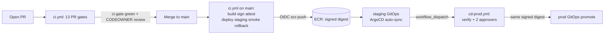

# Chapter 7 — CI/CD

**Status:** 🟢 Runbook · **Scope:** wire the GitHub repo to the AWS OIDC deploy roles produced in [Chapter 3](03-terraform-bootstrap.md), then walk a real pull request through the full **18-job** pipeline ([`.github/workflows/ci.yml`](../../../.github/workflows/ci.yml)) and the manual-approval production promotion ([`.github/workflows/cd-prod.yml`](../../../.github/workflows/cd-prod.yml)), verifying every supply-chain capability against the [E2 acceptance tests](../E2-P0.1-acceptance-tests.md). **Chapters 1–6 MUST be complete** (org + OIDC provider, AWS foundation, Terraform state + OIDC roles, network, EKS + ArgoCD + admission, observability). **Do NOT declare P0.1 exited until [Chapter 8](08-exit-gate-validation.md) signs off.**

> This chapter *operates* the pipeline certified by [10 Deployment Architecture §2–§5](../../10-deployment-architecture.md) and [`infrastructure/security/supply-chain`](../../../infrastructure/security/supply-chain/README.md). Every step follows the fixed 8-field format from [00-README](00-README.md): **Objective · Prerequisites · Commands · Expected output · Verification · Rollback · Common failure · Troubleshooting.** RFC-2119 keywords (**MUST**, **SHOULD**, **MAY**) mark requirements.

## What you are wiring

`ci.yml` and `cd-prod.yml` reference **eight** repository/environment variables — never secrets. Account IDs and role ARNs are **`vars.*`** (public, non-sensitive); there are **no static AWS keys anywhere** (OIDC only, [oidc-trust.md](../../../infrastructure/github/oidc-trust.md), [E2 AT-P01-13](../E2-P0.1-acceptance-tests.md)).

| `vars.*` | Source (Chapter 3 Terraform output) | Consumed by | Ref-scope of the assumed role |
|----------|-------------------------------------|-------------|-------------------------------|
| `AWS_REGION` | env root input | all AWS jobs | — |
| `AWS_TF_PLAN_ROLE_ARN` | `nexus-ci-tfplan` (read-only) | `10 · tf-plan` | `pull_request` **and** `ref:refs/heads/main` |
| `AWS_ECR_PUSH_ROLE_ARN` | `nexus-ci-ecr-push` | `14 · build` | `ref:refs/heads/main` **only** |
| `AWS_ECR_READONLY_ROLE_ARN` | `nexus-cd-ecr-ro` | `cd-prod / verify-artifact` | `environment:production` |
| `ECR_REGISTRY` | ECR module (`<ACCT>.dkr.ecr.<REGION>.amazonaws.com`) | build, sign, verify | — |
| `CONFIG_REPO` | GitOps desired-state repo | deploy, promote | — |
| `COSIGN_CI_IDENTITY_REGEXP` | supply-chain contract | cosign verify (CD + you) | — |
| `PROD_URL` | env root input | `production` environment | — |



---

## Step 7.1 — Wire `vars.*` with the Chapter 3 role ARNs + ECR registry and prove OIDC assume-role works

- **Objective.** Populate the eight repository variables from the Chapter 3 Terraform outputs so every `aws-actions/configure-aws-credentials` step can mint a short-lived OIDC token, and prove (positively and negatively) that federation is correctly ref-scoped: a `main`/PR run assumes the **read-only** plan role, and a PR ref **MUST NOT** be able to assume the push/prod role ([oidc-trust.md](../../../infrastructure/github/oidc-trust.md), [10 §2](../../10-deployment-architecture.md)).
- **Prerequisites.** `gh` authenticated as an org owner (`gh auth status`); Chapter 3 applied so the IAM OIDC provider + `nexus-ci-tfplan` / `nexus-ci-ecr-push` / `nexus-cd-ecr-ro` roles and the ECR registry exist; `terraform` available in the `global`/`security` env root to read outputs; `<ORG>/<REPO>`, `<STAGING_ACCT>`, `<CI_ACCT>`, `<REGION>` known.
- **Commands.**
  ```bash
  # 1. read the ARNs/registry that Chapter 3 emitted (never hand-type them)
  cd infrastructure/terraform/envs/global
  PLAN_ARN=$(terraform output -raw ci_tfplan_role_arn)
  PUSH_ARN=$(terraform output -raw ci_ecr_push_role_arn)
  RO_ARN=$(terraform output -raw cd_ecr_ro_role_arn)
  ECR=$(terraform output -raw ecr_registry)      # <ACCT>.dkr.ecr.<REGION>.amazonaws.com

  # 2. set them as repo VARIABLES (public, non-secret) — never `gh secret set`
  gh variable set AWS_REGION                 --repo <ORG>/<REPO> --body "<REGION>"
  gh variable set AWS_TF_PLAN_ROLE_ARN       --repo <ORG>/<REPO> --body "$PLAN_ARN"
  gh variable set AWS_ECR_PUSH_ROLE_ARN      --repo <ORG>/<REPO> --body "$PUSH_ARN"
  gh variable set AWS_ECR_READONLY_ROLE_ARN  --repo <ORG>/<REPO> --body "$RO_ARN"
  gh variable set ECR_REGISTRY               --repo <ORG>/<REPO> --body "$ECR"
  gh variable set CONFIG_REPO                --repo <ORG>/<REPO> --body "<ORG>/config-repo"
  gh variable set COSIGN_CI_IDENTITY_REGEXP  --repo <ORG>/<REPO> --body "https://github.com/<ORG>/<REPO>/.github/workflows/ci.yml@refs/heads/main"
  gh variable set PROD_URL                   --repo <ORG>/<REPO> --body "https://<PROD_HOST>"

  # 3. environment-scoped vars the deploy jobs read (see environments.yml)
  gh variable set AWS_REGION  --repo <ORG>/<REPO> --env staging    --body "<REGION>"
  gh variable set CONFIG_REPO --repo <ORG>/<REPO> --env staging    --body "<ORG>/config-repo"
  gh variable set PROD_URL    --repo <ORG>/<REPO> --env production  --body "https://<PROD_HOST>"

  # 4. positive OIDC proof: run the read-only plan job from a throwaway branch
  git checkout -b chore/oidc-smoke && git commit --allow-empty -m "chore: oidc smoke" && git push -u origin chore/oidc-smoke
  gh pr create --fill --base main
  gh run watch "$(gh run list --workflow ci --branch chore/oidc-smoke --limit 1 --json databaseId -q '.[0].databaseId')"
  ```
- **Expected output.** `gh variable list --repo <ORG>/<REPO>` shows all eight names with non-empty values (ARNs are `arn:aws:iam::<ACCT>:role/...`, never `AKIA…` keys). The `10 · Terraform plan` job on the PR logs `Assuming role ... nexus-ci-tfplan` and `Terraform has been successfully initialized`, and CloudTrail records a **successful** `AssumeRoleWithWebIdentity` for `role/nexus-ci-tfplan` with `role-session-name: nexus-ci-tfplan-<run_id>`.
- **Verification.** `gh variable list` count == 8; **no** `gh secret list` entry holds an AWS key (`gh secret list --repo <ORG>/<REPO>` returns none for AWS). Negative proof (MUST): a PR-ref token cannot assume the push role — CloudTrail shows an `AccessDenied` `AssumeRoleWithWebIdentity` for any attempt against `nexus-ci-ecr-push` from a `pull_request` sub ([E2 AT-P01-16](../E2-P0.1-acceptance-tests.md)):
  ```bash
  aws cloudtrail lookup-events --lookup-attributes AttributeKey=EventName,AttributeValue=AssumeRoleWithWebIdentity \
    --query "Events[?contains(CloudTrailEvent,'nexus-ci-ecr-push')]" --region <REGION>
  ```
- **Rollback.** Variables are non-mutating to cloud state; to unwire, `gh variable delete <NAME> --repo <ORG>/<REPO>` (and `--env <ENV>`). Delete the smoke branch/PR: `gh pr close chore/oidc-smoke --delete-branch`. No AWS resource is created by this step, so there is nothing to `terraform destroy`.
- **Common failure.** `Error: Not authorized to perform sts:AssumeRoleWithWebIdentity` on the plan job — the role **trust policy** `sub` condition does not match the run's `sub` (e.g. it pins `ref:refs/heads/main` but the run is a `pull_request`). The read-only plan role MUST allow **both** `pull_request` and `ref:refs/heads/main` subs (oidc-trust.md table); push/prod roles MUST allow neither PR sub.
- **Troubleshooting.** Decode the token claims the job actually presented — add a debug step printing `ACTIONS_ID_TOKEN_REQUEST_URL`'s `sub`, or read the STS error's `sub` echo in CloudTrail. Confirm the OIDC provider thumbprint/audience is `sts.amazonaws.com` (Chapter 3). If `terraform output` is empty, the Chapter 3 apply did not export the ARNs — re-run Chapter 3, do not paste ARNs by hand (drift risk).

---

## Step 7.2 — Walk a real PR through the pipeline and read the `ci-gate` result

- **Objective.** Open a genuine change, run all **18 jobs**, and confirm the single required check `ci-gate` aggregates the 13 PR-scoped gates fail-closed (top-level `permissions: {}`; any non-`success` upstream blocks merge — [E2 AT-P01-04](../E2-P0.1-acceptance-tests.md), [10 §2](../../10-deployment-architecture.md)). The four `main`-only jobs (`14 build`, `15 deploy-staging`, `16 smoke`, `17 rollback-proven`) do **not** gate the PR; they run on the post-merge push and are verified in Steps 7.5–7.10.
- **Prerequisites.** Step 7.1 done; branch protection from [branch-protection.yml](../../../infrastructure/github/branch-protection.yml) applied (`ci-gate` is the one required context, CODEOWNER review + signed commits required); `git` configured with commit signing.
- **Commands.**
  ```bash
  git checkout -b feat/hello-tweak
  # make a real, reviewable change to the canary service, then:
  git commit -S -am "feat(platform-hello): adjust readiness log line"
  git push -u origin feat/hello-tweak
  gh pr create --fill --base main

  RUN=$(gh run list --workflow ci --branch feat/hello-tweak --limit 1 --json databaseId -q '.[0].databaseId')
  gh run watch "$RUN"                         # live job graph
  gh run view "$RUN" --json jobs -q '.jobs[] | "\(.name)\t\(.conclusion)"'   # per-job result
  gh pr checks feat/hello-tweak               # the required-check summary the merge button reads
  ```
- **Expected output.** 18 jobs listed in mandated order (Formatting → Lint → Unit → SAST → Secrets → Dependency → Container-scan → SBOM → TF-validate → TF-plan → Policy → Doc-lint → Mermaid → Build → Deploy-staging → Smoke → Rollback → `ci-gate`); on a PR the four `main`-only jobs report **skipped**, the 13 gates report **success**, and `ci-gate` prints `All CI gates green.` `gh pr checks` shows `ci-gate  pass`.
- **Verification.** `gh pr view feat/hello-tweak --json mergeStateStatus -q .mergeStateStatus` is `CLEAN` **only** when `ci-gate` is green **and** a CODEOWNER has approved; the merge button is disabled otherwise ([E2 AT-P01-03](../E2-P0.1-acceptance-tests.md)). Confirm the aggregate is genuinely fail-closed: `ci-gate` `needs:` all 13 gates and its assert step greps for any non-`success` (`grep -vqx "success"`).
- **Rollback.** Close without merging: `gh pr close feat/hello-tweak --delete-branch`. Nothing is pushed to ECR or deployed from a PR run (build/deploy are `github.event_name == 'push' && github.ref == 'refs/heads/main'`), so there is no artifact to unwind.
- **Common failure.** `ci-gate` is **green but a sub-job was skipped** and you expected it to run — a `needs:` dependency upstream failed, so GitHub skipped the dependent, and a *skipped* result is not `success`; the aggregate step MUST treat skip as failure. If `ci-gate` shows green while a gate was red, the branch-protection context is wrong (must be `ci-gate`, not an individual job).
- **Troubleshooting.** Re-run only failed jobs with `gh run rerun "$RUN" --failed`. Read a specific job's log with `gh run view "$RUN" --log --job <JOB_ID>`. If the PR shows "Required statuses must pass" but no run started, the workflow `on: pull_request` path filter or a fork-PR permissions setting suppressed the trigger — check `gh run list --workflow ci`.

---

## Step 7.3 — Verify Terraform Plan (read-only, via OIDC)

- **Objective.** Prove `10 · tf-plan` produces a machine-readable staging plan using **short-lived, read-only** federated credentials, and that the plan JSON feeds the OPA policy gate (`11 · policy`) — plan-time defense in depth ([10 §5](../../10-deployment-architecture.md), [E2 AT-P01-16](../E2-P0.1-acceptance-tests.md)).
- **Prerequisites.** Step 7.1 (`AWS_TF_PLAN_ROLE_ARN` wired); Chapter 4 network module present under `infrastructure/terraform/envs/staging`; remote state backend from Chapter 3 reachable.
- **Commands.**
  ```bash
  gh run view "$RUN" --log --job "$(gh run view "$RUN" --json jobs -q '.jobs[]|select(.name|test("Terraform plan"))|.databaseId')"
  gh run download "$RUN" -n tfplan-json -D ./_plan   # the uploaded plan artifact
  jq '.resource_changes | length' ./_plan/tfplan.json
  ```
- **Expected output.** The job logs `role/nexus-ci-tfplan` assumed, `terraform plan` completing with `-lock=false` (read-only, no state lock held), `terraform show -json tfplan.binary > tfplan.json`, and an uploaded `tfplan-json` artifact. `11 · policy` downloads the same JSON and prints conftest `PASS` for `deny_public_s3`, `deny_open_money_sg`, `require_tags`.
- **Verification.** The role session name in the log is `nexus-ci-tfplan-<run_id>`; the plan performs **only** describe/get calls (grep the log for any `Creating...`/`Modifying...` — there MUST be none). `conftest verify` runs the policies' own unit tests before `conftest test`, so a broken rule cannot silently pass ([E2 AT-P01-10](../E2-P0.1-acceptance-tests.md)).
- **Rollback.** None required — a read-only plan mutates nothing. Discard the downloaded artifact (`rm -rf ./_plan`). If a lock was somehow acquired, `terraform force-unlock <LOCK_ID>` against the staging state (Chapter 3).
- **Common failure.** `Error acquiring the state lock` — the plan must run with `-lock=false`; if a prior apply crashed holding the DynamoDB lock, releases are Chapter 3's `force-unlock`. Alternatively `AccessDenied` on `s3:GetObject` for the state bucket means the plan role's read policy omits the state backend — fix the IAM policy in Chapter 3, not here.
- **Troubleshooting.** Reproduce locally with the same role: `aws sts assume-role-with-web-identity` is CI-only, so locally use `aws sts assume-role --role-arn "$PLAN_ARN"` (if your workstation identity is trusted) then `terraform -chdir=infrastructure/terraform/envs/staging plan -lock=false`. Validate the JSON shape with `jq '.format_version' tfplan.json` (expect `"1.2"`).

---

## Step 7.4 — Verify Terraform Apply (gated; runs on merge, not on PR)

- **Objective.** Confirm infrastructure changes **apply only after merge to `main`**, through a role bound to the `main` ref (never a PR ref), and that a re-apply is a genuine no-op — the idempotency proof of the P0.1 exit gate ([E2 AT-P01-17](../E2-P0.1-acceptance-tests.md), [10 §5](../../10-deployment-architecture.md)).
- **Prerequisites.** Steps 7.1–7.3; an **apply** role provisioned in Chapter 3, wired as `vars.<AWS_TF_APPLY_ROLE_ARN>` with a trust policy pinned to `sub: repo:<ORG>/<REPO>:ref:refs/heads/main` **only** (mirror the ECR-push role scope in oidc-trust.md — a PR ref MUST NOT assume it). Prod applies are additionally gated behind the `production` environment approval ([10 §5](../../10-deployment-architecture.md): *never local apply*).
- **Commands.**
  ```bash
  # apply happens on the post-merge push to main; watch that run:
  gh pr merge feat/hello-tweak --squash --auto
  MRUN=$(gh run list --workflow ci --branch main --limit 1 --json databaseId -q '.[0].databaseId')
  gh run watch "$MRUN"

  # idempotency proof — second plan against the just-applied env MUST be a no-op:
  cd infrastructure/terraform/envs/dev
  terraform plan -detailed-exitcode        # exit 0 == "No changes"; exit 2 == drift
  echo "exit=$?"
  ```
- **Expected output.** The `main` run assumes the apply role scoped to `refs/heads/main`; `terraform apply` reports the intended `Apply complete!`. The follow-up `terraform plan -detailed-exitcode` prints `No changes. Your infrastructure matches the configuration.` and exits **0**.
- **Verification.** `echo $?` after the second plan is `0` (not `2`). CloudTrail shows the apply's `AssumeRoleWithWebIdentity` sub is `...:ref:refs/heads/main`; **no** apply-role assumption exists for any `pull_request` sub. `prevent_destroy` is set on data stores so a destructive plan is refused ([10 §5](../../10-deployment-architecture.md)).
- **Rollback.** Infra rollback is `terraform apply` of the **prior pinned module version** / revert the IaC PR (`git revert <merge_sha>` → merge → reconcile), max time minutes, varies by resource ([10 §4.1](../../10-deployment-architecture.md)). EKS control-plane/node-group changes roll back via **blue-green node groups** (drain back to the still-warm prior group), not an in-place downgrade.
- **Common failure.** A `pull_request` run attempts the apply and fails closed with `AccessDenied` — correct behaviour if the apply role is main-scoped; the misconfiguration to fix is any workflow that runs apply on `pull_request`. A second plan returning **exit 2** means drift: something was click-changed outside Terraform (a snowflake) — raise a drift ticket ([10 §5](../../10-deployment-architecture.md)), reconcile before proceeding.
- **Troubleshooting.** Inspect drift precisely: `terraform plan -detailed-exitcode -no-color | tee drift.txt` and read the `~`/`-` lines. Never `terraform apply` from a laptop against a shared env — apply is CI-only, gated, and audited. If state lock is stuck from a cancelled apply, `terraform force-unlock <LOCK_ID>`.

---

## Step 7.5 — Verify Container Build (multi-stage, distroless) and push by digest

- **Objective.** Confirm `14 · build` builds a **multi-stage** image whose final layer is a **distroless/nonroot** runtime, pushes it to ECR by **immutable digest** (tag = git SHA), and emits build-time provenance + SBOM metadata ([10 §2/§3](../../10-deployment-architecture.md), [E2 AT-P01-29](../E2-P0.1-acceptance-tests.md)). This job runs on `main` only.
- **Prerequisites.** Merge from Step 7.4 landed; `AWS_ECR_PUSH_ROLE_ARN` + `ECR_REGISTRY` wired; `services/platform-hello/Dockerfile` present (the job is scaffold-safe and *skips* if absent — a real image makes it enforce).
- **Commands.**
  ```bash
  BJOB=$(gh run view "$MRUN" --json jobs -q '.jobs[]|select(.name|test("Build"))|.databaseId')
  gh run view "$MRUN" --log --job "$BJOB" | grep -E "digest|nonroot|FROM .*distroless"
  DIGEST=$(gh run view "$MRUN" --json jobs -q '.jobs[]|select(.name|test("Build"))|.outputs.digest' 2>/dev/null)
  # confirm the pushed artifact exists in ECR by digest:
  aws ecr describe-images --repository-name nexus-platform-hello \
    --image-ids imageDigest="$DIGEST" --region <REGION>
  ```
- **Expected output.** Build log shows a builder stage compiling and a minimal final stage `FROM <distroless-or-nonroot base>`, `push: true`, and `steps.build.outputs.digest = sha256:...`. `aws ecr describe-images` returns the image with that digest and `imageTag` == the git SHA.
- **Verification.** The Dockerfile MUST have ≥ 2 `FROM` stages and the final stage MUST run as non-root with a read-only-friendly, shell-less base (`grep -c '^FROM' services/platform-hello/Dockerfile` ≥ 2; the runtime stage is distroless/nonroot). Helm values pin the **digest**, never a tag ([supply-chain README](../../../infrastructure/security/supply-chain/README.md)). No `:latest` anywhere — `deny_latest_image.rego` enforces at admission.
- **Rollback.** Images are immutable; a bad build is superseded by the next digest, and deployment rolls back to the prior digest (Step 7.10). Untagged/preview images expire in 14 days; signed release images are retained ≥ 1 year ([10 §3](../../10-deployment-architecture.md)). Do not delete a promoted digest — admission and audit depend on it.
- **Common failure.** `denied: requested access to the resource is denied` on push — the ECR-push role lacks `ecr:PutImage` on `nexus-*` or the ref-scope excludes this run; recall the push role is `main`-ref-only. A build that succeeds but ships a fat base (bash/apt present) fails the distroless intent — Trivy (Step 7.8) will flag the extra CVE surface.
- **Troubleshooting.** Reproduce locally: `docker build -t local services/platform-hello && docker run --rm local id` (expect a non-root uid, no shell). Inspect the pushed layers: `aws ecr batch-get-image ... | jq '.images[0].imageManifest'`. If `outputs.digest` is empty, the `Detect Dockerfile` guard skipped the build (no Dockerfile) — add the Dockerfile.

---

## Step 7.6 — Verify SBOM (Syft → CycloneDX) is generated and travels with the image

- **Objective.** Confirm `8 · sbom` generates a valid **CycloneDX** SBOM with Syft, uploads it as an artifact, and that `14 · build` attaches it to the pushed digest as a cosign attestation — SBOM is a **required build output**; its absence blocks the build ([10 §2](../../10-deployment-architecture.md), [E2 AT-P01-28](../E2-P0.1-acceptance-tests.md)).
- **Prerequisites.** Step 7.5 (a pushed digest to attest against); `syft` locally for the static check.
- **Commands.**
  ```bash
  gh run download "$MRUN" -n sbom-cyclonedx -D ./_sbom
  jq '.bomFormat, .specVersion, (.components|length)' ./_sbom/sbom.cyclonedx.json
  # static equivalent of the CI step:
  syft dir:. -o cyclonedx-json > /tmp/sbom.cyclonedx.json && jq '.bomFormat' /tmp/sbom.cyclonedx.json
  ```
- **Expected output.** `jq` prints `"CycloneDX"`, a `specVersion` (e.g. `"1.5"`), and a non-zero component count. The build log shows `cosign attest --type cyclonedx --predicate sbom.cyclonedx.json ...@<digest>` succeeding.
- **Verification.** The artifact `sbom-cyclonedx` exists on the run (`gh run view "$MRUN" --json jobs` lists the SBOM job as `success`). The attestation is retrievable from the registry (Step 7.7 verifies it against the digest). `bomFormat == "CycloneDX"` — a SPDX or empty file fails the gate.
- **Rollback.** The SBOM is evidence, not a mutation; nothing to undo. A regenerated SBOM supersedes the prior one per digest. Retain ≥ 1 year with the signed image ([10 §3](../../10-deployment-architecture.md)).
- **Common failure.** SBOM job green but `14 · build` cannot find `sbom.cyclonedx.json` — the artifact name/path drifted between the upload (`8 · sbom`) and the download (`14 · build`); both MUST use `sbom-cyclonedx` / `sbom.cyclonedx.json`. An empty `components` array means Syft scanned the wrong path (`path: .` must be the service context with a lockfile present).
- **Troubleshooting.** Validate against the CycloneDX schema: `cyclonedx validate --input-file sbom.cyclonedx.json` (or any CycloneDX CLI). If component counts look too low, confirm the lockfiles (`pnpm-lock.yaml`, `go.sum`) are committed so Syft can resolve the dependency graph.

---

## Step 7.7 — Verify Cosign (keyless sign + verify; unsigned image rejected)

- **Objective.** Prove `14 · build` **keyless-signs** the digest via the CI OIDC identity (Fulcio cert + Rekor log, **no private key exists**), that you can independently `cosign verify` the signature and the SLSA + CycloneDX attestations, and that an **unsigned image is rejected by admission** — enforcing *unsigned images MUST NOT run* ([10 §3](../../10-deployment-architecture.md), [supply-chain README](../../../infrastructure/security/supply-chain/README.md), [E2 AT-P01-29/30](../E2-P0.1-acceptance-tests.md)).
- **Prerequisites.** Steps 7.5–7.6; `cosign` installed; `COSIGN_CI_IDENTITY_REGEXP` wired; Chapter 5 admission controller (Kyverno/Gatekeeper `cosign verify` policy) live.
- **Commands.**
  ```bash
  export COSIGN_EXPERIMENTAL=1
  IMG="$(gh variable get ECR_REGISTRY --repo <ORG>/<REPO>)/nexus-platform-hello@${DIGEST}"

  # 1. signature verifies against OUR pipeline identity only
  cosign verify \
    --certificate-identity-regexp "$(gh variable get COSIGN_CI_IDENTITY_REGEXP --repo <ORG>/<REPO>)" \
    --certificate-oidc-issuer "https://token.actions.githubusercontent.com" \
    "$IMG"

  # 2. attestations verify for the same digest
  cosign verify-attestation --type slsaprovenance \
    --certificate-identity-regexp "$(gh variable get COSIGN_CI_IDENTITY_REGEXP --repo <ORG>/<REPO>)" \
    --certificate-oidc-issuer "https://token.actions.githubusercontent.com" "$IMG"
  cosign verify-attestation --type cyclonedx \
    --certificate-identity-regexp "$(gh variable get COSIGN_CI_IDENTITY_REGEXP --repo <ORG>/<REPO>)" \
    --certificate-oidc-issuer "https://token.actions.githubusercontent.com" "$IMG"

  # 3. NEGATIVE: an unsigned image must be denied by admission
  kubectl apply -f - <<'EOF'
  apiVersion: v1
  kind: Pod
  metadata: {name: unsigned-probe, namespace: platform}
  spec:
    containers: [{name: c, image: docker.io/library/nginx:latest, resources: {limits: {cpu: 50m, memory: 64Mi}}}]
  EOF
  ```
- **Expected output.** Each `cosign verify` prints `Verified OK` with a Rekor `tlog entry verified` line and the certificate identity matching the CI workflow `sub`. The `kubectl apply` of the unsigned pod is **rejected** with an admission error naming the signature/policy failure; the pod is not created.
- **Verification.** Signature identity MUST be the pinned `COSIGN_CI_IDENTITY_REGEXP` (a signature from any other identity MUST fail — swap in a bogus regexp to confirm `verify` errors). Admission denies the unsigned image **and** the same image is `:latest` (double violation). A genuinely signed digest, by contrast, is admitted (Step 7.9 deploy proves the positive path).
- **Rollback.** Verification is read-only. Delete the negative-test pod attempt if it partially created (it MUST NOT have): `kubectl delete pod unsigned-probe -n platform --ignore-not-found`. Signatures/attestations are append-only in Rekor — nothing to revoke; a compromised identity is handled by rotating the OIDC trust, not by deleting log entries.
- **Common failure.** `no matching signatures` on a digest you believe is signed — you are verifying a **tag** not the **digest** (verify `@sha256:...`, never `:sha`), or `COSIGN_CI_IDENTITY_REGEXP` does not match the actual signing workflow path/ref. `COSIGN_EXPERIMENTAL` unset on older cosign breaks keyless verify.
- **Troubleshooting.** Inspect the transparency log directly: `cosign tree "$IMG"` lists the signature + attestation manifests; `rekor-cli search --sha <DIGEST>` finds the log index (an exit-gate artifact, §11 of E2). If admission *admits* an unsigned image, the Kyverno/Gatekeeper policy is in `Audit` not `Enforce` — fix in Chapter 5, re-test here.

---

## Step 7.8 — Verify Security Scan (SAST · secret · dependency · container), fail-closed

- **Objective.** Prove the four scanner gates block on a real finding, not merely pass the happy path: SAST (`4`, CodeQL + Semgrep), Secrets (`5`, gitleaks over full history), Dependency+license (`6`, osv-scanner), Container (`7`, Trivy) — aggregate High/Critical MUST be **0** on the clean tree, and each MUST go red on a seeded fault ([10 §2](../../10-deployment-architecture.md), [E2 AT-P01-06/07/08/09/31](../E2-P0.1-acceptance-tests.md)).
- **Prerequisites.** Step 7.2 run green on the clean tree; `semgrep`, `gitleaks`, `osv-scanner`, `trivy` locally for the static half.
- **Commands.**
  ```bash
  # clean-tree baseline (all MUST pass):
  semgrep --config .semgrep --config p/owasp-top-ten --error --skip-unknown-extensions .
  gitleaks detect --source . --redact
  osv-scanner --recursive --skip-git ./
  trivy image --severity CRITICAL,HIGH --ignore-unfixed --exit-code 1 "nexus/platform-hello:${GITHUB_SHA:-local}"

  # seeded fault (each on its own throwaway branch), then observe the matching CI job go red:
  #  SAST:   introduce a command-injection sink →  4 · SAST   red
  #  Secret: commit a fake  AKIA...  + secret    →  5 · Secrets red (report NOT uploaded)
  #  Dep:    add a known fixable-critical CVE dep →  6 · Dependency red
  #  Trivy:  base on a known-vuln image           →  7 · Container red (SARIF still uploads)
  ```
- **Expected output.** On the clean tree every scanner exits 0 / prints no findings. On each seeded branch the corresponding CI job exits non-zero, `ci-gate` blocks the merge, and (Trivy/SAST) the SARIF still uploads to the Security tab for auditability; gitleaks does **not** upload its report (`GITLEAKS_ENABLE_UPLOAD_ARTIFACT=false`, no secret echo).
- **Verification.** Reverting each seeded fault restores the job to green (the red-then-green pair is the [E2 §11](../E2-P0.1-acceptance-tests.md) evidence). Aggregate unsuppressed High/Critical across all four scanners == 0; any suppression carries an **owner + expiry** ([E2 AT-P01-31](../E2-P0.1-acceptance-tests.md)) — a bare, permanent `.trivyignore` is not allowed.
- **Rollback.** Delete each seeded-fault branch after capturing evidence (`gh pr close <pr> --delete-branch`). Seeded faults MUST NOT reach `main`; if one merged, `git revert` immediately and rotate any real-looking credential even though it was fake.
- **Common failure.** A seeded secret does **not** trip gitleaks — `fetch-depth: 0` is required so the whole history is scanned, and the fake key must match a gitleaks rule shape (`AKIA` + a plausible secret). osv-scanner passing on a known-CVE dep usually means the lockfile was not committed, so the transitive tree is invisible.
- **Troubleshooting.** For CodeQL noise, scope rules in `.semgrep/`; never silence with a blanket ignore — quarantine flaky rules with an expiry ticket ([10 §2 risks](../../10-deployment-architecture.md)). For Trivy false positives use a **time-boxed, signed, expiring** `.trivyignore` with security-owner approval, never an open-ended entry.

---

## Step 7.9 — Verify Deploy (GitOps → staging) with no cluster creds in CI

- **Objective.** Confirm `15 · deploy-staging` ends CI's responsibility at *"signed artifact + digest-bump PR to the config repo"*, that ArgoCD (in-cluster, pull-based) reconciles the bump, and `16 · smoke` passes — **CI never holds cluster credentials** ([10 §3](../../10-deployment-architecture.md), [E2 AT-P01-21/22](../E2-P0.1-acceptance-tests.md)).
- **Prerequisites.** Steps 7.5–7.7 (a signed digest exists); `CONFIG_REPO` wired; Chapter 5 ArgoCD + the staging `Application` watching `CONFIG_REPO`; `argocd` CLI logged in (`argocd login <ARGOCD_HOST>`).
- **Commands.**
  ```bash
  # the deploy job opens a digest-bump PR to CONFIG_REPO; find + merge it (CODEOWNERS auto-approves non-prod):
  gh pr list --repo "$(gh variable get CONFIG_REPO --repo <ORG>/<REPO>)" --search "platform-hello digest"
  gh pr merge <config-pr> --repo "$(gh variable get CONFIG_REPO --repo <ORG>/<REPO>)" --squash

  # ArgoCD pulls and reconciles — watch it converge:
  argocd app get nexus-platform-hello-staging -o json | jq '{sync:.status.sync.status, health:.status.health.status, revision:.status.sync.revision}'
  argocd app wait nexus-platform-hello-staging --health --timeout 300
  kubectl -n platform get deploy platform-hello -o wide
  ```
- **Expected output.** The config-repo PR bumps only the **digest** in `values-staging.yaml`. `argocd app get` reports `sync == "Synced"` and `health == "Healthy"` on the new digest; the Deployment shows `desired == available` replicas, 0 restarts. `16 · smoke` in the `main` run passes liveness/readiness/core-loop probes against staging.
- **Verification.** No AWS/kube credential appears in the deploy job (`permissions:` grants only `contents: read` + `id-token: write` for the brokered config-repo token — **not** cluster creds). The reconciled `revision` matches the merged config-repo commit; delivery is **effectively-once with idempotent reconciliation** — ArgoCD converges to desired state regardless of retry, and ordering is by Git commit/causal order, never by a network-supplied wall-clock.
- **Rollback.** Application-code rollback: Argo Rollouts abort → last-good ReplicaSet (seconds), or `git revert` the config-repo digest-bump PR → reconcile (≤ 5 min) ([10 §4.1](../../10-deployment-architecture.md)). Verified end-to-end in Step 7.10.
- **Common failure.** ArgoCD stuck `OutOfSync` after merge — the `Application` `targetRevision` points at the wrong branch, or the digest in values does not exist in ECR (typo in the bump). A pod stuck `Pending`/`CreateContainerError` at admission means the digest is unsigned/limits-less — fix upstream (Steps 7.5–7.7), the deploy layer is behaving correctly by refusing it.
- **Troubleshooting.** `argocd app diff nexus-platform-hello-staging` shows desired-vs-live; `argocd app sync nexus-platform-hello-staging` forces a reconcile on non-prod. Read admission rejections with `kubectl -n platform describe pod <p>` and `kubectl -n platform get events --sort-by=.lastTimestamp`.

---

## Step 7.10 — Verify Rollback (bad deploy → auto-rollback → capture restore time)

- **Objective.** Execute the `17 · rollback-proven` drill: promote a deliberately **unhealthy** `platform-hello` to a staging/preview canary, prove Argo Rollouts' AnalysisTemplate **auto-aborts on SLO breach with no human in the revert path**, and capture `restore_seconds ≤` the stated max (application-code: seconds for canary abort → ≤ 5 min for Git-revert reconcile) — *a rollback that has never been run is not a rollback* ([10 §4.1](../../10-deployment-architecture.md), [E2 AT-P01-32](../E2-P0.1-acceptance-tests.md)).
- **Prerequisites.** Step 7.9 (a healthy baseline in staging); Chapter 5 Argo Rollouts installed; Chapter 6 Prometheus/OTel metrics queryable at canary time (the AnalysisTemplate reads error rate / p95 / SLO burn).
- **Commands.**
  ```bash
  # promote a known-bad digest (e.g. /readyz forced to 503) via a config-repo bump to trigger the canary:
  gh pr merge <bad-digest-pr> --repo "$(gh variable get CONFIG_REPO --repo <ORG>/<REPO>)" --squash

  START=$(date +%s)
  argocd app get nexus-platform-hello-staging --refresh -o json | jq '.status.operationState.phase'
  # watch the Rollout abort + revert to last-good:
  kubectl -n platform argo rollouts get rollout platform-hello --watch   # (kubectl-argo-rollouts plugin)
  argocd app wait nexus-platform-hello-staging --health --timeout 600
  END=$(date +%s); echo "restore_seconds=$((END-START))"
  ```
- **Expected output.** The AnalysisTemplate marks the canary **Degraded**, the Rollout **auto-aborts** and scales the last-good ReplicaSet back to 100%, health returns to `Healthy`, and an incident stub is auto-filed. The measured `restore_seconds` is within the max; the gate emits a rollback-proof label `{run_id, restore_seconds}`.
- **Verification.** No human ran a manual revert (the abort is metric-driven). `restore_seconds` ≤ max (seconds for canary abort; ≤ 300 for the Git-revert path). The CD proven-rollback gate later reads this label, and admission checks the same label in-cluster before any prod promotion ([supply-chain README §4](../../../infrastructure/security/supply-chain/README.md)). A drill where restore **exceeds** max MUST fail closed and block promotion ([E2 AT-P01-32](../E2-P0.1-acceptance-tests.md)).
- **Rollback.** The drill *is* the rollback; after it, `git revert` the bad-digest config-repo PR so Git desired-state matches the last-good digest (do not leave staging pinned to a known-bad digest with only a live abort holding it). Feature-flag kill-switch is the independent second lever (seconds), separate from the deploy path ([10 §4.1](../../10-deployment-architecture.md)).
- **Common failure.** The canary does **not** abort — the AnalysisTemplate has no metric source (Prometheus unreachable) or the guardrail threshold is too loose to catch the injected breach; a rollback that never triggers is a failed drill, not a pass. If restore exceeds max, the last-good ReplicaSet was scaled to zero (retain ≥ 1 warm) or image pull is slow (pre-warm the rollback target in a cluster-local cache).
- **Troubleshooting.** `kubectl -n platform argo rollouts status platform-hello` shows the abort reason; `kubectl -n platform describe analysisrun <ar>` shows which metric breached. Confirm the incident stub opened (§7.5 of docs/10). Capture the drill record `{run_id, restore_seconds}` — it is a mandatory exit-gate artifact ([E2 §11](../E2-P0.1-acceptance-tests.md)).

---

## Step 7.11 — Promote the same signed digest to prod (manual-approval `cd-prod.yml`)

- **Objective.** Run `cd-prod.yml` to **promote, never rebuild** — verify the identical CI-signed digest's signature + SLSA provenance + rollback-proof, pause on the `production` environment's **2-reviewer** approval + change ticket, then open the prod config-repo PR for ArgoCD to reconcile. No `docker build` occurs here ([10 §3/§11](../../10-deployment-architecture.md), [environments.yml](../../../infrastructure/github/environments.yml), [E2 AT-P01-29/30](../E2-P0.1-acceptance-tests.md)).
- **Prerequisites.** Steps 7.5–7.10 complete for the target `<DIGEST>`; the `production` environment configured with required reviewers `@nexus/sre` + `@nexus/devsecops`, `wait_timer_minutes: 5`, `prevent_self_review: true`; `AWS_ECR_READONLY_ROLE_ARN`, `COSIGN_CI_IDENTITY_REGEXP`, `PROD_URL` wired; a `<CHANGE_TICKET>` and the `<ROLLBACK_PROOF_ID>` from Step 7.10.
- **Commands.**
  ```bash
  # 0. re-verify the exact digest locally before dispatch (belt-and-suspenders):
  cosign verify \
    --certificate-identity-regexp "$(gh variable get COSIGN_CI_IDENTITY_REGEXP --repo <ORG>/<REPO>)" \
    --certificate-oidc-issuer "https://token.actions.githubusercontent.com" \
    "$(gh variable get ECR_REGISTRY --repo <ORG>/<REPO>)/nexus-platform-hello@<DIGEST>"

  # 1. dispatch the prod promotion of the SAME digest:
  gh workflow run cd-prod.yml --repo <ORG>/<REPO> \
    -f image_digest="<DIGEST>" \
    -f change_ticket="<CHANGE_TICKET>" \
    -f rollback_proof_id="<ROLLBACK_PROOF_ID>"

  CDRUN=$(gh run list --workflow cd-prod --limit 1 --json databaseId -q '.[0].databaseId')
  gh run watch "$CDRUN"     # pauses at the `production` approval gate

  # 2. an approver (not the dispatcher) signs off:
  gh api -X POST repos/<ORG>/<REPO>/actions/runs/$CDRUN/pending_deployments \
    -f state=approved -f comment="approved per <CHANGE_TICKET>"

  # 3. after promote, confirm prod converges on the SAME digest:
  argocd app get nexus-platform-hello-prod -o json | jq '{sync:.status.sync.status, health:.status.health.status}'
  ```
- **Expected output.** `verify-artifact` prints `Verified OK` for signature + SLSA provenance and asserts the rollback-proof id is present. The run **pauses** at `production` (job `2 · Promote`), resumes only after a **different** approver accepts (self-approval blocked), opens the prod config-repo PR bumping the **digest only**, and prod ArgoCD reports `Synced / Healthy` on that same digest.
- **Verification.** The promoted digest equals `<DIGEST>` byte-for-byte (no rebuild — `cd-prod.yml` has no `docker build`). The environment records **2** approvals + the change ticket; `prevent_self_review` blocked the dispatcher from approving. Prod admission re-checks signature + provenance + rollback-label in-cluster before any pod runs ([supply-chain README §4](../../../infrastructure/security/supply-chain/README.md)).
- **Rollback.** Post-promotion, Argo Rollouts canaries region-by-region with **automated SLO-breach rollback** (no human in the revert path); the instant kill-switch is the country/feature flag (seconds), independent of this pipeline ([10 §4/§4.1](../../10-deployment-architecture.md)). Manual hold: `git revert` the prod config-repo digest-bump PR → reconcile.
- **Common failure.** `verify-artifact` fails with `no matching signatures` — the digest was never signed on `main` (e.g. built from a fork/PR), so it is correctly refused; only `main`-built digests carry the CI identity. Promotion refused for a **missing `rollback_proof_id`** is the proven-rollback gate working as designed — supply the Step 7.10 id.
- **Troubleshooting.** If the run does not pause, the `production` environment has no required reviewers configured (re-apply [environments.yml](../../../infrastructure/github/environments.yml)). Inspect the pending approval: `gh api repos/<ORG>/<REPO>/actions/runs/$CDRUN/pending_deployments`. If prod admission rejects the digest that staging accepted, the prod cluster's Kyverno identity/policy differs — reconcile the admission config across clusters (Chapter 5).

---

## Exit criteria for Chapter 7

Chapter 7 is complete when: (1) all eight `vars.*` are wired from Chapter 3 outputs with OIDC proven positively **and** negatively (Step 7.1); (2) a real PR runs the 18-job pipeline green with `ci-gate` as the single fail-closed required check (Step 7.2); (3) Plan/Apply, Build/SBOM/Cosign, and the four security scanners each pass **and** block on a seeded fault (Steps 7.3–7.8); (4) GitOps deploys to staging with no cluster creds in CI (Step 7.9); (5) the rollback drill captures `restore_seconds ≤ max` (Step 7.10); and (6) the same signed digest promotes to prod behind the 2-reviewer gate (Step 7.11). File every artifact into the [E2 §11 exit-gate checklist](../E2-P0.1-acceptance-tests.md), then proceed to [Chapter 8 — Exit-Gate Validation](08-exit-gate-validation.md).
