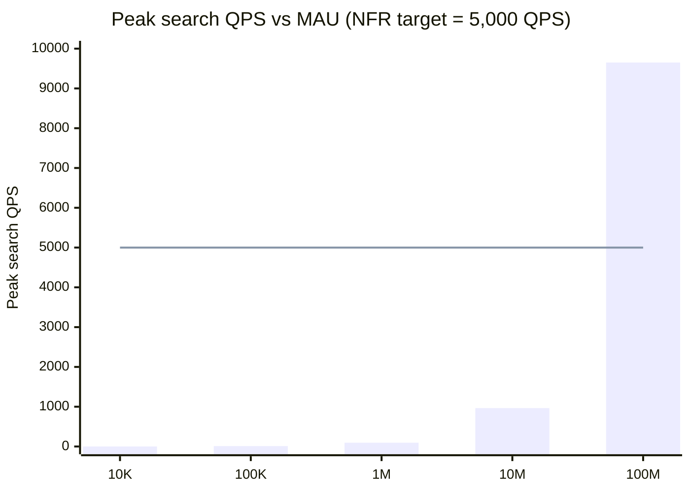
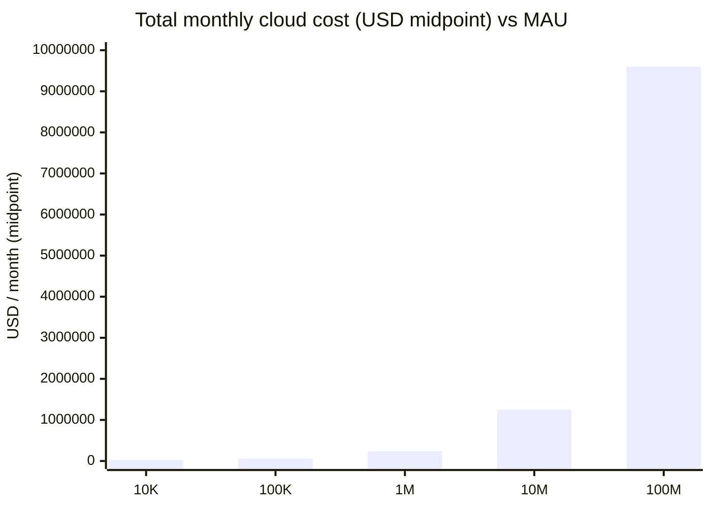

# 02 — Scalability Simulation (NEXUS)

**Status:** Review artifact · **Owner:** Performance + FinOps modeling · **Date:** 2026-07-14
**Scope:** Defensible order-of-magnitude scaling model for the ratified NEXUS architecture across **10K → 100K → 1M → 10M → 100M MAU**.
**Sources:** [PROJECT_MEMORY](../../PROJECT_MEMORY.md), [02 SDD](../02-software-design-document.md), [03 Business Model](../03-business-model.md), [04 System Arch](../04-system-architecture.md), [05 AI Arch](../05-ai-architecture.md), [06 Database Arch](../06-database-architecture.md), [09 Cloud Arch](../09-cloud-architecture.md).

> **Nature of this document.** These are **planning estimates**, not vendor quotes. All money/throughput/storage figures carry **±50–100% error bars** (see §9). They exist to (a) prove the architecture is not internally contradictory at scale, (b) locate the *first* bottleneck at each scale and name the crossing move, and (c) test whether the **≤ $0.01/AI-request** and **5,000 QPS / 500M-offer / p95** NFRs hold. Reconcile against real partner rates and a load test before GA (per [09 §7](../09-cloud-architecture.md#7-scalability--elasticity) gate).

---

## 1. Model & stated assumptions

All demand is derived from MAU through one explicit funnel. Every constant below is an **assumption you can challenge**; the whole model is a spreadsheet in prose.

### 1.1 Global assumptions (constant across scales unless noted)

| # | Assumption | Value | Rationale / source |
|---|-----------|-------|--------------------|
| G1 | Sessions / user / month | **10** | Engaged shopping-agent usage blended with casual MAU |
| G2 | Searches / session | **5** | Discovery-heavy surface; agent turns count as searches |
| G3 | Searches / user / month | **50** (=G1×G2) | Derived |
| G4 | Seconds / month | **2.592 M** | 30 × 86 400 |
| G5 | Peak-to-average factor (normal diurnal) | **×5** | Commerce diurnal + regional overlap |
| G5b | Flash-sale / campaign spike | **×10–15** (noted, not baselined) | Black Friday / Prime-Day class events |
| G6 | AI-assisted query share | **30%** | Fraction of searches that invoke the agent (a "resolved AI request") |
| G7 | Buy-intent → handoff rate | **6% of sessions** | Genuine intent that reaches [SDD §4.2](../02-software-design-document.md#42-delegated-agentic-handoff-with-safety-gate) handoff |
| G8 | Handoff → conversion (postback) rate | **35% of handoffs** | Affiliate-network conversion, async postback ([04 §5.4](../04-system-architecture.md#54-attribution--money-event-sourced)) |
| G9 | Avg order value (AOV) | **$80** | [03 §4](../03-business-model.md#4-unit-economics-illustrative-model-h2) |
| G10 | Search-result cache hit-rate | **85%** | Redis Tier-1 corridor ([06 §7](../06-database-architecture.md#7-caching-redis)); needed for NFR-PERF-01 |
| G11 | AI 4-tier cache hit-rate | **35% → 78%** (scales with volume) | [05 §2.5](../05-ai-architecture.md#25-four-tier-caching--batching); cold at low volume, matures with corpus |
| G12 | Model cascade mix | **70 / 25 / 5** (Tier-1 / Tier-2 / Tier-3) | [05 §2.4](../05-ai-architecture.md#24-cheapest-capable-routing--cheap-model-first-cascade) |
| G13 | Blended tokens / resolved AI request | ~1.5K in + 0.5K out, +1 claim-verify pass | [05 §4.3](../05-ai-architecture.md#43-claim-verification--how-pricefact-claims-are-grounded-the-nfr-ai-01-engine) |
| G14 | Avg price observations / offer / day | **2** (hot+warm blended) | Tier-2 feed sync cadence, long-tail rare ([SDD §8](../02-software-design-document.md#8-data-freshness-strategy-a-defining-design-decision)) |
| G15 | Offers : products ratio | **~3 : 1** | Multiple merchant offers per product ([06 §6](../06-database-architecture.md#6-search-index-opensearch)) |
| G16 | Postback multiplier (confirm+reverse+status) | **×1.3** on conversions | Returns/clawbacks ([06 §9](../06-database-architecture.md#9-consistency-model)) |

### 1.2 Per-scale assumptions (vary by rollout phase)

| Assumption | 10K | 100K | 1M | 10M | 100M |
|-----------|-----|------|-----|------|------|
| Rollout phase ([ADR-0007](../adr/ADR-0007-phased-global-rollout.md)) | P1 beta | P1 GA | P1–P2 | P3 | P4–P5 |
| Regions (active) | 1 (us-east-1) | 1 | 2 | 3 | 5–6 |
| **Catalog size (offers)** | 20 M | 80 M | 200 M | **500 M** | **1.5 B** |
| Products (=offers/3) | 7 M | 27 M | 67 M | 170 M | 500 M |
| AI cache hit-rate (G11) | 35% | 45% | 60% | 70% | 78% |
| Self-host GPU for Tier-1? | ❌ hosted-only | ⚠ starts | ✅ | ✅ | ✅ |

> **Catalog is only loosely coupled to MAU** — it tracks *partner coverage and market phase*, not user count. The 10M row is where the corpus reaches **NFR-SCAL-02 (500M+ offers)**; 100M runs 3× beyond it.

---

## 2. Derived demand — QPS, handoffs, postbacks

Formulas: `searches/mo = MAU × 50` · `avg QPS = searches/mo ÷ 2.592M` · `peak = avg × 5` · `agent QPS = 0.30 × search QPS` · `handoffs/mo = MAU × 10 × 0.06` · `conversions/mo = handoffs × 0.35` · `postbacks/day = conversions/mo × 1.3 ÷ 30`.

| Metric | 10K | 100K | 1M | 10M | 100M |
|--------|-----|------|-----|------|------|
| Searches / month | 500 K | 5 M | 50 M | 500 M | 5 B |
| **Search QPS — avg** | 0.19 | 1.9 | 19 | 193 | **1,929** |
| **Search QPS — peak (×5)** | ~1 | ~10 | ~96 | ~965 | **~9,650** |
| **Agent QPS — avg / peak** | 0.06 / 0.3 | 0.6 / 2.9 | 5.8 / 29 | 58 / 290 | 579 / 2,895 |
| Handoffs / month | 6 K | 60 K | 600 K | 6 M | 60 M |
| Conversions (assisted purchases) / mo | 2.1 K | 21 K | 210 K | 2.1 M | 21 M |
| **Postbacks / day** | ~91 | ~910 | ~9.1 K | ~91 K | ~910 K |
| Assisted GMV / month (×$80) | $168 K | $1.68 M | $16.8 M | $168 M | **$1.68 B** |
| Gross affiliate revenue / mo (≈$3.70/purchase, [03 §4](../03-business-model.md#4-unit-economics-illustrative-model-h2)) | ~$7.8 K | ~$78 K | ~$777 K | ~$7.8 M | **~$77.7 M** |

**NFR-SCAL-01 (5,000 QPS) crossing:** peak search QPS stays **under 5,000 until ~50M MAU**; at **100M the peak (~9,650 QPS) is ~1.9× the ratified target** and requires scaling beyond the single-cluster envelope the NFR was written for (see §6). Flash-sale spikes (G5b) breach 5,000 QPS as early as the **10M** scale (965 × 10–15 = 9.6K–14.5K) — surge headroom + shed-to-cache is mandatory there, not at 100M.

---

## 3. p95 latency behavior — where the bottleneck moves

| Scale | p95 search (≤400ms) | Live price (≤1.5s) | Agent first-token (≤1.2s) | Where the latency risk sits |
|-------|---------------------|--------------------|--------------------------|------------------------------|
| **10K** | ✅ holds trivially | ✅ | ✅ | Nowhere internal — 85% cache hit, ~1 QPS peak. Cold caches only. |
| **100K** | ✅ holds | ✅ | ✅ | AI cache still warming (45%); no throughput pressure. |
| **1M** | ✅ holds | ✅ (external merchant latency dominates) | ✅ | First OpenSearch tail-latency on long-tail (cache-miss) queries; mitigate hot/warm node pools. |
| **10M** | ✅ holds **with autoscale** | ✅ if Gateway failover healthy | ✅ | OpenSearch scatter-gather tail across growing shard fleet; cross-region cache coherence; **flash-sale spikes are the real p95 threat**. |
| **100M** | ⚠ **holds only if** cache≥85% **and** OpenSearch is cellularized | ⚠ bounded by external merchant/affiliate API p95 (Gateway-mediated) | ✅ (Tier-1 stream + cache) | Bottleneck moves to **OpenSearch coordinator fan-out** over 180+ shards and cross-region replication lag; QPS beyond single-cluster envelope. |

**Pattern:** latency is **cache-and-fan-out bound, never CPU-bound** at the app tier. It holds cleanly to ~10M; at 100M it holds *conditionally* on (1) sustained cache hit-rate, (2) OpenSearch cellularization, (3) live-price latency being an external-partner property the Affiliate Gateway degrades around (stale-price-with-badge, [SDD §9](../02-software-design-document.md#9-failure--degradation-design)). Agent first-token is the **most robust** NFR — streaming from a cheap tier while tools run behind the stream ([05 §9.2](../05-ai-architecture.md#92-latency-budget-nfr-perf-03-first-token--12-s)) decouples it from backend scale.

---

## 4. Infrastructure footprint (rough node / shard / partition counts)

Multi-AZ (≥3 AZ) is a **hard floor** ([09 §8](../09-cloud-architecture.md#8-reliability)), so even 10K carries HA-minimum redundancy — this dominates small-scale economics.

| Component | 10K | 100K | 1M | 10M | 100M |
|-----------|-----|------|-----|------|------|
| **EKS** (worker nodes, blended) | 6–10 | 15–30 | 60–120 | 400–800 | 3,000–6,000 |
| **OpenSearch** data nodes / primary shards (+1 replica) | 3 / ~6 | 6 / ~12 | 20 / ~40 | 60 / ~90 | 180+ / **cellular, multi-cluster** |
| **Aurora/Postgres** primary + replicas; offer partitions | 1+1; unpart. | 1+2; unpart. | 1+2; **HASH×64** | 1+3; HASH×64 | **→ Distributed SQL** (Cockroach/Yugabyte), 20–40 nodes |
| **Redis (ElastiCache)** shards | 3 | 3–6 | 10–20 | 40–80 | 200–400 |
| **MSK (Kafka)** brokers / partitions per hot topic | 3 / 12 | 3 / 24 | 6 / 96 | 12 / 300 | 30+ / 1,000+ |
| **ClickHouse** nodes (self-host EKS) | 3 | 3–6 | 8–16 | 30–60 | 120–240 |
| **Affiliate Gateway** pods (Go, HA multi-AZ) | 2–3 | 3–4 | 6–10 | 20–40 | 80–150 + regional connector sharding |

Notes: OpenSearch sized to **~30–50 GB/primary shard** ([06 §6](../06-database-architecture.md#6-search-index-opensearch)); Postgres offer table **HASH(product_id)×64** partitions from 1M ([06 §10.1](../06-database-architecture.md#101-offers--partitioningsharding)); Kafka keyed by `product_id`/`offer_id`; Gateway holds the same 4 connectors (Amazon PA-API, CJ, Impact, Rakuten) at every scale — it scales on **referral+postback volume × region count**, not provider count ([04 §6.1](../04-system-architecture.md#61-affiliate-gateway--plugin-connectors--automatic-failover-adr-0008)).

---

## 5. Monthly cloud cost (ranges) + storage + egress + AI

### 5.1 Cost breakdown (USD / month, order-of-magnitude ranges)

| Line | 10K | 100K | 1M | 10M | 100M |
|------|-----|------|-----|------|------|
| Compute (EKS) | $3–6K | $6–12K | $25–50K | $150–300K | $1.2–2.5M |
| OpenSearch | $3–5K | $8–15K | $25–45K | $120–220K | $700K–1.4M |
| Database (Aurora → distributed SQL) | $2–4K | $5–10K | $20–40K | $80–160K | $600K–1.2M |
| Cache (Redis) | $1–2K | $3–6K | $10–20K | $40–80K | $300–600K |
| Kafka (MSK) | $2–3K | $4–8K | $15–30K | $60–120K | $400–800K |
| ClickHouse (self-host) | $2–3K | $5–10K | $15–30K | $50–100K | $350–700K |
| Egress (user + cross-region + partner) | $0.5–1K | $1–3K | $5–15K | $30–80K | $150–400K |
| **AI inference** (cascade+cache) | $1–1.5K | $8–10K | $45–75K | $300–600K | $2.25–4.5M |
| **TOTAL / month** | **$15–30K** | **$40–75K** | **$165–310K** | **$840K–1.67M** | **$6.6–12.6M** |
| Midpoint | ~$24K | ~$57K | ~$237K | ~$1.25M | ~$9.6M |
| **Cost / MAU / month** | **~$2.40** | **~$0.57** | **~$0.24** | **~$0.125** | **~$0.096** |
| Cloud cost as % of affiliate revenue | ~300% 🔴 | ~73% 🔴 | ~31% ⚠ | ~16% | ~12% ✅ |

> **Economies of scale are the headline:** cost/MAU falls **~25×** from 10K to 100M. The platform is **structurally unprofitable below ~1M MAU** (HA floor + un-amortized fixed infra exceed affiliate revenue) and crosses into healthy margin around **1M–10M**, consistent with the [03 §11](../03-business-model.md#11-financial-guardrails-cfo) ">80% gross margin on the *marginal* transaction" guardrail — note the *marginal* txn is fine even at small scale; it is *total* cost recovery that needs ~1M+ MAU.

### 5.2 Storage & database growth

| Store | 10K | 100K | 1M | 10M | 100M |
|-------|-----|------|-----|------|------|
| **ClickHouse** ingest / month (compressed ~40B/row) | ~48 GB | ~190 GB | ~480 GB | ~1.2 TB | ~3.6 TB |
| ClickHouse cumulative (24-mo raw cap + rollups) | ~1 TB | ~4.5 TB | ~11 TB | ~29 TB | **~90 TB** (+S3 cold tier) |
| **Postgres/Aurora** cumulative (offers + txn) | ~0.1 TB | ~0.3 TB | ~0.75 TB | ~2 TB | **~9–12 TB** 🔴 |
| Postgres txn growth (ledger/referral/attr, append) | negligible | ~few GB/mo | ~4 GB/mo | ~25 GB/mo | ~300 GB/mo |
| **OpenSearch** (primary + replica) | ~0.1 TB | ~0.4 TB | ~1.5 TB | ~4 TB | ~10 TB |
| **Redis** working set | <5 GB | ~10 GB | ~25 GB | ~60 GB | ~100+ GB |
| **Object store (S3)** — media + feed archive + CH cold | ~1 TB | ~5 TB | ~20 TB | ~80 TB | ~400 TB+ |

The **9–12 TB single-primary Postgres** at 100M (offer rows + fast-growing append-only ledger/referral/attribution) is the concrete trigger for distributed SQL (§6). ClickHouse is the largest raw grower but is **columnar + tiered to S3** ([06 §5](../06-database-architecture.md#5-price-time-series-clickhouse)), so it stays operationally cheap per TB.

### 5.3 Network egress

| | 10K | 100K | 1M | 10M | 100M |
|--|-----|------|-----|------|------|
| Egress volume / month | ~15 GB | ~150 GB | ~1.5 TB | ~25–40 TB | ~250–500 TB |
| Dominant driver | user JSON | user JSON | user JSON | **cross-region Kafka replication** | cross-region catalog fan-out to 5–6 regions + partner API |
| Cost (blended $0.02 x-region / $0.07 internet) | <$1K | $1–3K | $5–15K | $30–80K | $150–400K |

Governed via **CDN offload for media/static, VPC endpoints on the AWS backbone, and the egress-allowlist chokepoint as a metering point** ([09 §4, §9](../09-cloud-architecture.md#4-networking)). Cross-region replication of the offer/price stream — not user traffic — is what makes egress a real line item from 10M up.

### 5.4 AI inference — does the ≤ $0.01/request target hold?

Resolved AI requests/mo = `0.30 × searches`. Blended $/req is driven down by (a) cache hit-rate maturing (G11), (b) self-host GPU Tier-1 amortizing once volume saturates a GPU, (c) the 70/25/5 cascade holding ~5% on frontier.

| | 10K | 100K | 1M | 10M | 100M |
|--|-----|------|-----|------|------|
| Resolved AI requests / mo | 150 K | 1.5 M | 15 M | 150 M | 1.5 B |
| AI cache hit-rate | 35% | 45% | 60% | 70% | 78% |
| Serving strategy | **hosted-only** (no GPU to amortize) | hosted + first GPU | hybrid | hybrid | hybrid, GPU-saturated |
| **Blended $/resolved request** | **$0.007–0.010** ⚠ | $0.005–0.008 | $0.003–0.006 | $0.002–0.004 | **$0.0015–0.003** ✅ |
| % hitting frontier (Tier-3) | ~5% | ~5% | ~5% | ~5% | ~5% |
| vs $0.01 target | **AT RISK / tight** | holds | holds | holds comfortably | holds comfortably (3–7× headroom) |

**Verdict on NFR-AI-02:** the **≤ $0.01/request target holds from ~1M MAU upward with growing headroom** (down to ~$0.002 at 100M). At **10K–100K it is *at risk*** — not because the cascade fails, but because **volume is too low to amortize a self-host GPU**, forcing hosted-only serving on cold (35–45%) caches. The correct response at small scale is exactly what [05 §11](../05-ai-architecture.md#11-build-vs-buy-hosted-llm-vs-self-host-oss) prescribes: **stay hosted-heavy pre-PMF, skip the GPU**, and accept a thin AI margin until Tier-1 volume justifies self-host (~1M). Forcing a dedicated GPU at 150K req/mo would alone cost ~$0.01–0.02/req and **breach the target**. The ratified strategy is therefore correct *and* the target is honest — with a stated caveat at sub-1M scale.

---

## 6. First bottleneck at each scale & the crossing move

| Scale | **First bottleneck to break** | Symptom / metric | Architectural change to cross it |
|-------|-------------------------------|------------------|----------------------------------|
| **10K** | **Fixed-cost floor / unit economics** (not throughput) | Cloud cost ≈ 300% of revenue; can't amortize HA-minimum + GPU | Single region, managed-everything, **hosted-only AI (no GPU)**, smallest 3-AZ footprint; treat as investment phase. |
| **100K** | **AI cost amortization + cold caches** | Blended $/req near the $0.01 line; 45% cache hit | Grow response/semantic cache corridor; introduce **first self-host Tier-1 GPU** only when it beats hosted per-req; keep 5% frontier cap. |
| **1M** | **Ingestion write throughput + OpenSearch shard mgmt** (200M offers, ~400M price-updates/day) | Kafka lag on feed storms; OpenSearch reindex pressure; Postgres offer table bloat | **Partition `catalog.offer` HASH(product_id)×64** ([06 §10.1](../06-database-architecture.md#101-offers--partitioningsharding)); category-routed OpenSearch shards; scale MSK partitions; add read replicas. |
| **10M** | **Single-primary Postgres write path** on money SoRs (ledger/referral) **+ cross-region replication lag** (500M offers = NFR-SCAL-02) | Write CPU/IOPS climbing toward trigger; replica lag; flash-sale spikes breach 5,000 QPS | Watch the **distributed-SQL trigger** ([06 §10.4](../06-database-architecture.md#104-the-documented-trigger-point--partitioned-postgres--distributed-sql)); add P3 region; **hot/warm OpenSearch pools**; surge headroom + shed-to-cache for spikes. |
| **100M** | **Postgres single-primary ceiling HIT** (9–12 TB, writes >60% primary IOPS ≥4 wks) **+ OpenSearch single-cluster fan-out + peak QPS ~1.9× NFR** | Trigger fires; 180+ shard scatter-gather tail; peak ~9,650 QPS | **Migrate OLTP write path to distributed SQL (CockroachDB/YugabyteDB, PG-wire)**; **cellularize OpenSearch** into multiple clusters (by category/region); **full active-active** where a market needs local writes; horizontally shard Affiliate Gateway connectors per region. |

**How the bottleneck walks up the stack:** **cost floor** (10K–100K) → **write/ingestion path** (1M) → **OLTP primary + cross-region** (10M) → **distributed-SQL migration + search cellularization + QPS-beyond-envelope** (100M). The application/compute tier is *never* the first thing to break — the architecture's cache-first + CQRS + extracted-services design (04, 06) correctly pushes every ceiling onto a **stateful store** with a documented escape hatch.

---

## 7. Consolidated headline table

| Metric | 10K | 100K | 1M | 10M | 100M |
|--------|-----|------|-----|------|------|
| Peak search QPS | ~1 | ~10 | ~96 | ~965 | **~9,650** |
| Peak agent QPS | 0.3 | 2.9 | 29 | 290 | 2,895 |
| Catalog (offers) | 20 M | 80 M | 200 M | **500 M** | **1.5 B** |
| Total cloud cost / mo (midpoint) | ~$24K | ~$57K | ~$237K | ~$1.25M | **~$9.6M** |
| Cost / MAU / mo | $2.40 | $0.57 | $0.24 | $0.125 | $0.096 |
| Blended AI $/req | $0.007–0.010 | $0.005–0.008 | $0.003–0.006 | $0.002–0.004 | $0.0015–0.003 |
| $0.01 AI target | ⚠ at risk | ✅ tight | ✅ | ✅ | ✅ |
| DB posture | single PG | single PG | PG + HASH×64 | PG + trigger-watch | **distributed SQL** |
| First bottleneck | cost floor | AI amortization | ingestion/search shard | OLTP primary + x-region | OLTP migration + search cellular + QPS |

---

## 8. NFR verdict summary

| NFR | Holds? | Note |
|-----|--------|------|
| **NFR-PERF-01** p95 search ≤400ms | ✅ to 10M; ⚠ conditional at 100M | Needs sustained ≥85% cache hit + OpenSearch cellularization at 100M |
| **NFR-PERF-02** live price ≤1.5s | ✅ | External-partner-bound; Gateway degrades to stale-with-badge |
| **NFR-PERF-03** agent first-token ≤1.2s | ✅ all scales | Most robust NFR — decoupled by streaming |
| **NFR-SCAL-01** 5,000 QPS | ✅ to ~50M; ⚠ 100M (~9.6K peak) | Flash-sale spikes breach it at 10M — needs surge headroom |
| **NFR-SCAL-02** 500M+ offers | ✅ (reached at 10M; 3× at 100M) | Postgres partitioning + OpenSearch sharding as designed |
| **NFR-AI-02** ≤ $0.01/req | ⚠ sub-1M; ✅ ≥1M | At risk only where GPU can't amortize — mitigated by hosted-only pre-PMF |

---

## 9. Confidence & error bars

| Estimate class | Confidence | Error band | Biggest swing factor |
|----------------|-----------|------------|----------------------|
| Derived QPS / handoffs / postbacks | Medium-high | ±40% | G1–G2 (sessions×searches) and G6–G8 funnel rates |
| Storage / DB growth | Medium | ±50% | catalog size, price-update cadence (G14), retention policy |
| Egress volume/cost | Low-medium | ±70% | cross-region replication topology, CDN offload ratio |
| Cloud cost totals | Low-medium | **±50–100%** | instance mix, Savings-Plan/Spot/Graviton discounts, managed-vs-self-host (R-CLD-01) |
| Blended AI $/req | Medium | ±50% | real token counts, cache hit-rate maturation, OSS-vs-hosted price gap |

**These are capacity-planning numbers for architectural decision-making, not a budget.** The load-test gate at [09 §7](../09-cloud-architecture.md#7-scalability--elasticity) ("5,000 sustained search QPS at ≤400ms p95 before GA") and real partner-rate negotiation ([03 §10](../03-business-model.md#10-key-business-risks--mitigations)) are what convert these into committed figures. Re-run this model when (a) the funnel rates G6–G8 are observed in P1, (b) partner affiliate rates are signed, and (c) the first real OpenSearch/Aurora capacity milestone hits the R-CLD-01 build-vs-buy gate.

---

## 10. Remediation deltas (Round-2 architecture)

> **Why this section exists.** §§1–9 were modeled against the *ratified* architecture. Round-2 review found ([ADR-0022](../adr/ADR-0022-round2-remediation.md), **NC-7**) that the sim was never re-run against the remediation ADRs, so the scale gate wasn't certifiable from evidence. This section re-assesses each 10K→100M conclusion under the remediated design. **Same ±50–100% bars apply**; deltas below are order-of-magnitude and stated against the §5/§7 baselines. Remediation ADRs assessed: [ADR-0011](../adr/ADR-0011-attribution-reconciliation.md)/[0012](../adr/ADR-0012-postback-integrity.md) (reconciliation + provisional accrual), [ADR-0013](../adr/ADR-0013-ledger-per-context.md) (ledger-per-context + async GL), [ADR-0017](../adr/ADR-0017-blast-radius-isolation.md) (egress cells, discovery/money pool split, warm-GPU floor).

### 10.1 Reconciliation + provisional-accrual load (ADR-0011/0012)

The remediation adds an **independent revenue-integrity subsystem** that the base sim never priced: a NEXUS-minted **click-out ledger** (one append row per `handoff.redirected`), **provisional pending-accruals + purchase-fingerprint dedup** per postback, periodic **RECON_RUN** batch jobs (3-way: click-out×modeled-rate vs network reporting-API pull vs sampled panel), a derived **ATTRIBUTION_GAP** metric per network/region/period, and a **blinded real-purchase panel** (opt-in + seeded purchases).

**Throughput:** the click-out ledger writes = handoffs (§2), i.e. peak ~115 writes/s even at 100M (2M/day avg × ×5 peak) — **<1% of the 1,929 search QPS** and off the search path entirely. Provisional accrual rides the existing postback stream (already ×1.3 in G16); fingerprint dedup adds one hashed-index lookup per postback (≤910K/day at 100M). **RECON_RUN is async batch** (ClickHouse-class analytics), not OLTP. → *Throughput impact is immaterial at every scale.*

**Storage:** click-out rows are ~200 B; retained ≥ longest reversal window (~90 d) then archived (ADR-0012 R-084). Hot footprint ≈ 3 mo × handoffs: ~4 MB (10K) → ~36 GB (100M) + S3 archive — **negligible beside ClickHouse (3.6 TB/mo) and the 9–12 TB Postgres** at 100M.

**Cost:** the material part is **RECON batch compute + panel opex** (seeded purchases cost real AOV; opt-in users are free). Panel + minimum recon-job infra is a **fixed cost that scales with networks×regions, not MAU**, so it lands hardest as a *floor* at small scale.

| Recon/accrual added line | 10K | 100K | 1M | 10M | 100M |
|--|-----|------|-----|------|------|
| Click-out writes/day (avg) | 200 | 2K | 20K | 200K | 2M |
| Click-out hot storage (~90-day) | ~4 MB | ~36 MB | ~0.36 GB | ~3.6 GB | ~36 GB |
| Added cost / mo (recon compute + panel) | +$0.5–1.5K | +$1–3K | +$3–8K | +$15–40K | +$100–250K |
| As % of §5 total | ~3–5% | ~2–4% | ~2–3% | ~2–3% | ~1.5–2.5% |

**Verdict:** **not material to throughput or the DB ceiling; modestly material to cost (~2–5%)**, weighted toward small scale because of the fixed panel/recon floor. It does *not* move any bottleneck — but it does deepen the sub-1M fixed-floor problem (§10.4).

### 10.2 Ledger-per-context + async GL (ADR-0013)

The base sim named the **single-primary Postgres write path on money SoRs (ledger/referral)** as the *first* bottleneck at **10M** and part of the **100M** single-primary ceiling. Remediation replaces one global double-entry ledger with **four independent append-only sub-ledgers** (affiliate, cashback, rewards, creator) plus an **asynchronous reconciliation GL**. Crucially (ADR-0022 **NC-2**) a conversion emits **one `conversion.confirmed` event** that each sub-ledger **idempotently consumes independently** — no synchronous cross-ledger fan-out.

**Effect on the OLTP bottleneck — net helps:**
- **+** The hottest money table (affiliate accrual) is **decoupled from cashback/rewards/creator** and from consolidated reporting; each sub-ledger is independently shardable/extractable and can migrate to distributed-SQL on its own schedule. The money write path stops being a monolith.
- **+** The **GL is async and off the OLTP hot path** (eventually-consistent reporting store), removing consolidated double-entry work from the primary.
- **−** Event-driven fan-out means the conversion event is consumed ~4× + GL aggregation, so raw money-path write count rises ~3–4×. But money-path writes are tiny: ledger append was only ~300 GB/mo at 100M (§5.2) vs offer rows dominating the 9–12 TB. **4× a small base is still small.**

**Bottom line:** ledger-per-context **relieves the money-SoR portion** of the write ceiling (helps 10M) and takes consolidated reporting off the primary. It does **not** shrink the **offer table**, which remains the true 9–12 TB driver of the 100M distributed-SQL trigger — so the 100M migration still fires, just scoped to offers (+ affiliate sub-ledger), not a co-mingled money+catalog monolith. **Helps at 10M; neutral-to-slightly-helpful at 100M.**

### 10.3 Egress cells vs one chokepoint (ADR-0017 #2)

§5.3 modeled egress cost purely by **volume** ($0.02 x-region / $0.07 internet) and treated the allowlist as a metering/security point. It **silently assumed** that point was not itself a throughput/availability ceiling — which was the latent SPOF Round-2 flagged. Remediation makes egress a **fleet of horizontally-scaled cells** (lose one → reroute); the allowlist stays a metering point but no longer gates throughput.

**Cost conclusion is unchanged:** egress is $/GB volume-driven, and cells add only a small fixed cost for running ≥2–3 cells for HA (≈ +$0.3–1K/mo at small scale, <0.1% at 100M). **Throughput conclusion improves:** the base sim's egress numbers now stand *without* an implicit "assuming the chokepoint keeps up" caveat — the horizontal-scaling assumption is now architecturally true, not hoped. **Neutral on cost, better on resilience.**

### 10.4 Discovery/money pool split + warm-GPU floor (ADR-0017 #4, #5, #6, #7)

This is where remediation **worsens** the numbers — and it lands exactly on the already-weakest zone (10K–100K).

- **Discovery vs money node-pool/cluster split** (#4), **separate money vs catalog Redis** (#5), and **observability on a separate failure domain** (#6) each **re-apply the ≥3-AZ HA floor per split**. At scale these are free (same total capacity, relabeled into pools); at **10K–100K they multiply the fixed minimum** — you now pay HA-minimum for money-path *and* discovery-path *and* an isolated obs domain instead of one shared footprint.
- **Warm-GPU floor** (#7): a **minimum always-warm interactive pool** to guarantee the 1.2 s first-token SLO — scale-to-zero is allowed only for batch/eval. This **directly constrains the §5.4 mitigation** ("stay hosted-only, skip the GPU pre-PMF"): you can no longer scale the interactive path to zero, so a warm floor (physical GPUs *or* hosted provisioned-throughput) must run 24/7 even at 150K req/mo. A 2-unit HA warm floor at ~$1–3K/unit is **otherwise-avoidable fixed cost** at small scale, and on 150K req/mo that floor alone is **~$0.013–0.04/req before any inference** — i.e., it pushes the *already at-risk* 10K–100K blended $/req **further past $0.01**.

**Fixed-floor delta (new cost the remediation adds, order-of-magnitude):**

| Added fixed cost / mo | 10K | 100K | 1M | 10M | 100M |
|--|-----|------|-----|------|------|
| Recon + panel (§10.1) | +$0.5–1.5K | +$1–3K | +$3–8K | +$15–40K | +$100–250K |
| Warm-GPU floor | +$2–6K | +$2–6K | absorbed | absorbed | absorbed |
| Pool / Redis / obs splits | +$4–10K | +$5–12K | +$5–15K | <2% | <2% |
| Egress cells | +$0.3–1K | +$0.5–1.5K | +$1–2K | +$2–4K | +$5–10K |
| **Total added / mo** | **+$7–18K** | **+$8–22K** | **+$9–25K** | **+$20–50K** | **+$110–280K** |
| New total (mid) vs §5 | ~$34K vs $24K | ~$72K vs $57K | ~$254K vs $237K | ~$1.28M vs $1.25M | ~$9.8M vs $9.6M |
| **Cost/MAU old → new** | $2.40 → **~$3.4** | $0.57 → **~$0.72** | $0.24 → **~$0.25** | $0.125 → **~$0.128** | $0.096 → **~$0.098** |
| Delta | **+~40%** | **+~25%** | +~7% | +~2–3% | +~1.5–3% |

**Verdict:** the split-everything HA discipline + warm-GPU floor **worsens the sub-1M unprofitability by roughly +25–40%** at 10K–100K and **is noise (<3%) at ≥10M**. It does **not** change the *shape* of the curve (still ~20–25× economies of scale) — it **deepens the fixed-cost trough** and nudges total-cost breakeven marginally later (toward ~1M rather than just under it).

### 10.5 Restated targets, NFR verdicts, and first-bottleneck table

**≤ $0.01 AI target (NFR-AI-02):** **≥1M unchanged and holds with growing headroom.** **Sub-1M is *more clearly at risk***: §5.4 already flagged 10K–100K as tight on hosted-only cold caches; the **warm-GPU floor removes the "skip the GPU" escape**, adding a fixed interactive floor. The honest sub-1M answer is now "hosted-heavy **with a minimized warm floor** (smallest warm pool / hosted provisioned-throughput), accept a thin-to-negative AI margin pre-PMF" — the target still *fails gracefully* (it was always a scale-amortization statement), but the mitigation is tighter than the base doc implied.

| NFR | Base verdict | Remediated verdict | Change |
|-----|--------------|--------------------|--------|
| PERF-01 p95 search ≤400ms | ✅→⚠ at 100M | unchanged | egress cells remove a latent x-region throughput caveat (slightly better) |
| PERF-02 live price ≤1.5s | ✅ | unchanged | — |
| PERF-03 first-token ≤1.2s | ✅ all scales | ✅ **now guaranteed** by warm-GPU floor | more robust (at a small-scale cost) |
| SCAL-01 5,000 QPS | ✅ to ~50M; ⚠ 100M | unchanged | egress no longer a hidden ceiling; OpenSearch still the constraint |
| SCAL-02 500M+ offers | ✅ | unchanged | offer table still drives the 100M distributed-SQL trigger |
| AI-02 ≤ $0.01/req | ⚠ sub-1M; ✅ ≥1M | ⚠ **sub-1M worse**; ✅ ≥1M | warm-GPU floor tightens the small-scale breach |

**First-bottleneck-per-scale — does it change?**

| Scale | Base first bottleneck | Remediated first bottleneck | Moved? |
|-------|-----------------------|------------------------------|--------|
| 10K | Fixed-cost floor / unit economics | **Fixed-cost floor — deeper** (+warm-GPU floor, +pool/Redis/obs splits, +recon/panel) | Same bottleneck, **~+40% worse** |
| 100K | AI cost amortization + cold caches | **Same + mandatory warm-GPU floor** | Same, tightened |
| 1M | Ingestion write throughput + OpenSearch shard mgmt | Unchanged (ledger fan-out adds trivial write amp) | No |
| 10M | **Single-primary Postgres money-SoR write path** + x-region lag | **x-region lag + offer-table growth + flash-sale QPS** — money-SoR write path **demoted** by ledger-per-context | **Yes — money write path relieved** |
| 100M | Postgres single-primary ceiling + OpenSearch fan-out + QPS ~1.9× NFR | **Offer-table** distributed-SQL trigger + OpenSearch cellular + QPS (money-ledger no longer part of the ceiling) | Refined, not moved |

### 10.6 Net effect on the 10K→100M conclusions

| Dimension | Direction | Magnitude |
|-----------|-----------|-----------|
| Throughput / QPS ceilings | **Neutral** (egress slightly better) | Recon load <1% QPS; egress SPOF removed |
| OLTP / DB write ceiling (10M–100M) | **Improves** | Money-SoR path decomposed & shardable; offer table still the trigger |
| Cost at scale (≥10M) | **Neutral** | +1.5–3% — within error bars |
| Cost floor at 10K–100K | **Worsens** | +25–40%; deepens sub-1M unprofitability |
| ≤$0.01 AI target | **Worsens sub-1M / neutral ≥1M** | Warm-GPU floor tightens the known small-scale breach |
| Latency NFRs | **Neutral-to-better** | First-token now guaranteed; egress caveat removed |

**No headline conclusion is overturned.** The architecture remains internally consistent at every scale; the cache-and-fan-out (not CPU) latency pattern holds; economies of scale still dominate; the 100M distributed-SQL + OpenSearch-cellularization crossing is unchanged. The remediation **buys money-integrity and blast-radius isolation by spending fixed cost** — cheap at scale, painful pre-PMF. Re-run once the P1 warm-floor size and real recon/panel opex are observed.

---
*Companion review artifact to the NEXUS Phase-0 architecture set (docs 01–10). §10 added per [ADR-0022](../adr/ADR-0022-round2-remediation.md) NC-7.*
