# infrastructure/github — repo governance as configuration

> **Purpose.** Declares the merge-blocking controls, deployment environments, and
> the OIDC↔AWS trust relationship that make the CI/CD pipelines
> ([`.github/workflows/ci.yml`](../../.github/workflows/ci.yml),
> [`cd-prod.yml`](../../.github/workflows/cd-prod.yml)) safe and reproducible.
> **Owner.** `@nexus/devsecops`.
> **Dependencies.** GitHub org + repo (created at P0.1 org bootstrap); AWS IAM OIDC
> provider + roles provisioned by [`infrastructure/terraform`](../terraform) (IAM module);
> the config repo (GitOps desired state) referenced by the deploy jobs.

Certified by `docs/10-deployment-architecture.md` §2 (CI, fail-closed gates), §3
(CD/GitOps, manual prod approval), §11 (change management); `docs/08-security-architecture.md`
§5.5 (CI runner hardening); ADR-0018 (R-065, OIDC runners); ADR-0019 (R-064, proven rollback).

These files are **config-as-doc**: the source of truth for what a human (or Terraform
`github` provider / a `gh api` script) must apply. They are intentionally declarative so the
control set is auditable in Git rather than click-configured in the GitHub UI (no snowflakes —
docs/10 §0.1 #1).

## Contents

| File | What it declares |
|------|------------------|
| [`branch-protection.yml`](branch-protection.yml) | `main` protection: required checks (= the CI gate), CODEOWNERS review, linear history, signed commits, no force-push. |
| [`environments.yml`](environments.yml) | GitHub Environments: `staging` (auto), `production` (manual approvers + wait timer). |
| [`oidc-trust.md`](oidc-trust.md) | The OIDC↔AWS trust relationship — which role, which `sub`/audience conditions, least-privilege per role. |

## How the pieces fit

```mermaid
flowchart LR
    PR[PR to main] --> CIGATE[CI gate<br/>required check]
    CIGATE -->|green + CODEOWNERS review| MERGE[Merge allowed]
    MERGE --> CIMAIN[CI on main<br/>build·sign·attest]
    CIMAIN -->|OIDC assume ECR-push role| ECR[(ECR signed digest)]
    ECR --> STG[staging env<br/>auto GitOps]
    STG -->|manual dispatch| CDGATE[production env<br/>2 reviewers + ticket]
    CDGATE -->|verify sig+provenance+rollback| PRD[prod GitOps promote]
```



## Placeholders to resolve at org bootstrap

- `@nexus/*` GitHub teams (see [`.github/CODEOWNERS`](../../.github/CODEOWNERS)) do not exist yet.
- AWS account ids + role ARNs are `vars.*` placeholders (see [`oidc-trust.md`](oidc-trust.md)).
- Action `uses:` pins in the workflows are placeholder SHAs — Dependabot/Renovate must verify + track them.
- The config repo (`vars.CONFIG_REPO`) and its prod env branch are provisioned separately.

## Applying (illustrative — not run in CI)

Branch protection and environments are applied out-of-band by a privileged bootstrap
(the `github` Terraform provider or `gh api`), never by a workflow token, so the pipeline can
never weaken its own gates.

```bash
# example only — requires an org-admin token, run by a human at bootstrap:
gh api -X PUT repos/OWNER/REPO/branches/main/protection \
  --input infrastructure/github/branch-protection.json
```
