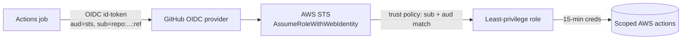

# OIDC ↔ AWS trust relationship

> **Purpose.** Documents how GitHub Actions authenticates to AWS **without any static
> credentials** — the mechanism behind every `aws-actions/configure-aws-credentials`
> step in the workflows. **Owner.** `@nexus-commerce-os/devsecops` + `@nexus-commerce-os/cloud-security`.
> **Dependencies.** The IAM OIDC provider + roles are provisioned by
> [`infrastructure/terraform`](../terraform) (IAM module) — this file is the contract that
> module must satisfy; it does not itself apply anything.

Certified by docs/10 §2 (OIDC federation, no static keys), docs/08 §5.5 + ADR-0018 R-065
(ephemeral runners, short-lived OIDC with tight audience/branch conditions, no persistent
runner credentials).

## Principle

CI/CD holds **no long-lived AWS keys**. Each job that needs AWS mints a **short-lived OIDC
token** from GitHub's provider (`token.actions.githubusercontent.com`) and exchanges it, via
`sts:AssumeRoleWithWebIdentity`, for temporary credentials scoped to **one least-privilege
role**. A token minted for a PR ref **cannot** assume an apply/push/prod role (docs/08 §5.5).



## Trust provider (one, org-wide)

| Field | Value |
|-------|-------|
| Provider URL | `https://token.actions.githubusercontent.com` |
| Audience (`aud`) | `sts.amazonaws.com` |
| Thumbprint | managed by AWS (GitHub's OIDC cert) |

## Roles — one per capability, least privilege (docs P3)

Each role's **trust policy** restricts `token.actions.githubusercontent.com:sub` so only the
intended workflow + ref can assume it. `<ACCOUNT>` and role names are **placeholders** wired
to the workflows as `vars.*`.

| Workflow var | Role (placeholder ARN) | Permissions (max) | `sub` condition (who may assume) |
|--------------|------------------------|-------------------|----------------------------------|
| `AWS_TF_PLAN_ROLE_ARN` | `arn:aws:iam::<STAGING_ACCT>:role/nexus-ci-tfplan` | **Read-only** describe/get for `terraform plan` | `repo:nexus/<repo>:pull_request` **and** `repo:nexus/<repo>:ref:refs/heads/main` |
| `AWS_ECR_PUSH_ROLE_ARN` | `arn:aws:iam::<CI_ACCT>:role/nexus-ci-ecr-push` | `ecr:PutImage` + push to the `nexus-*` repos only | `repo:nexus/<repo>:ref:refs/heads/main` **only** (never a PR ref) |
| `AWS_ECR_READONLY_ROLE_ARN` | `arn:aws:iam::<CI_ACCT>:role/nexus-cd-ecr-ro` | `ecr:GetDownloadUrlForLayer`, `BatchGetImage` (verify attestations) | `repo:nexus/<repo>:environment:production` |

### Condition hardening (all roles MUST)

- Pin `aud` = `sts.amazonaws.com` (blocks token-audience confusion).
- Pin `sub` with a **prefix + exact-ref** match — never a bare `repo:nexus/*` wildcard.
- Bind push/apply/prod roles to a **branch or environment** `sub`, so PR-triggered runs can
  reach only the read-only plan role (ADR-0018 R-065 — a PR ref cannot assume a prod role).
- Set the max session duration to the minimum (≤ 1 h; jobs use ≤ 15 min sessions).

### Example trust policy (ECR push — main only)

```json
{
  "Version": "2012-10-17",
  "Statement": [{
    "Effect": "Allow",
    "Principal": { "Federated": "arn:aws:iam::<CI_ACCT>:oidc-provider/token.actions.githubusercontent.com" },
    "Action": "sts:AssumeRoleWithWebIdentity",
    "Condition": {
      "StringEquals": {
        "token.actions.githubusercontent.com:aud": "sts.amazonaws.com",
        "token.actions.githubusercontent.com:sub": "repo:nexus/<repo>:ref:refs/heads/main"
      }
    }
  }]
}
```

## What is deliberately NOT here

- **No cluster credentials.** Deploy is GitOps (ArgoCD pulls); CI/CD never gets prod kube creds (docs/10 §3).
- **No registry password / no static IAM user keys** anywhere in Git, env files, or Environment secrets.
- **No cosign private key** — signing is keyless (Fulcio/Rekor via the same OIDC identity), see
  [`../security/supply-chain/README.md`](../security/supply-chain/README.md).
