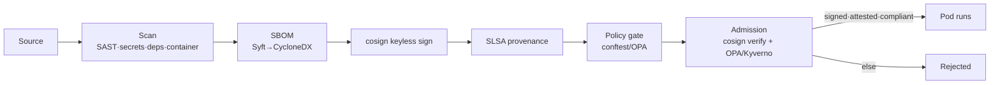

# infrastructure/security — supply-chain & policy enforcement

> **Purpose.** The security controls that make NEXUS's supply chain **fail-closed**:
> policy-as-code (plan-time + admission-time), image signing + provenance + SBOM, and the
> least-privilege IAM model. This directory is the source of truth the CI/CD workflows and
> the cluster admission controller enforce.
> **Owner.** `@nexus-commerce-os/cloud-security`.
> **Dependencies.** [`.github/workflows`](../../.github/workflows) (CI/CD),
> [`infrastructure/github`](../github) (OIDC trust, branch protection),
> [`infrastructure/terraform`](../terraform) (IAM roles, KMS), the in-cluster admission
> controller (Kyverno/Gatekeeper), and [`tests/policy`](../../tests/policy).

Certified by docs/10 §2/§3/§5 and docs/08 §5.3/§5.5/§5.6. Implements deployment principle #4
(docs/10 §0.1): *every artifact is scanned, signed, provenance-attested, and admission-gated;
unsigned images MUST NOT run.*

## Layout

| Path | Purpose |
|------|---------|
| [`policies/`](policies/) | OPA/Rego + conftest rules: no public S3, no `0.0.0.0/0` on money SGs, mandatory tags, no `:latest`, resource limits. |
| [`supply-chain/`](supply-chain/) | cosign keyless signing, SBOM policy, SLSA level target, admission control. |
| [`iam/`](iam/) | Least-privilege principle, IRSA, break-glass. |

## The chain, end to end

Every link fails closed: a missing signature, absent provenance, failed policy, or unproven
rollback stops promotion (docs/10 §3).
